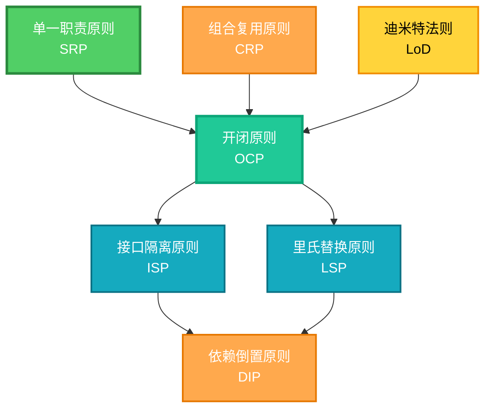

# 面向对象设计原则


面向对象设计原则是软件工程中指导面向对象设计的核心准则，旨在帮助开发者构建可维护、可扩展、可复用的高质量代码。这些原则是设计模式的理论基础，掌握这些原则对于编写优雅的代码至关重要。

## 概述

本仓库收录了 7 大面向对象设计原则的正例与反例，覆盖 Java、Go、C、JavaScript、TypeScript、Python 多语言实现，便于对比理解。每个原则都包含：
- 详细的原则说明和核心思想
- 符合原则的正例代码
- 违反原则的反例代码
- Mermaid 流程图直观展示
- 多语言实现对比

## 7 大设计原则

### 1. 单一职责原则 (Single Responsibility Principle, SRP)
**核心思想**：一个类只负责一件事或一类功能，避免职责混乱。

**应用场景**：订单处理、数据校验、数据持久化等功能应分离到不同的类中。

**[查看详情](./single-responsibility/)**

---

### 2. 开闭原则 (Open Closed Principle, OCP)
**核心思想**：对扩展开放，对修改关闭。通过抽象和多态实现功能的扩展，而不是修改现有代码。

**应用场景**：策略模式、工厂模式、观察者模式等设计模式的核心基础。

**[查看详情](./open-closed/)**

---

### 3. 里氏替换原则 (Liskov Substitution Principle, LSP)
**核心思想**：子类必须能够替换父类而不影响程序的正确性，行为保持一致。

**应用场景**：继承体系设计，确保子类不会破坏父类的契约。

**[查看详情](./liskov-substitution/)**

---

### 4. 接口隔离原则 (Interface Segregation Principle, ISP)
**核心思想**：依赖最小接口，避免臃肿接口，客户端不应依赖它不需要的方法。

**应用场景**：将大接口拆分为多个小接口，每个接口服务于特定的功能模块。

**[查看详情](./interface-segregation/)**

---

### 5. 依赖倒置原则 (Dependency Inversion Principle, DIP)
**核心思想**：高层模块依赖抽象而非具体实现，抽象不依赖细节。

**应用场景**：依赖注入（DI）、控制反转（IoC）容器的理论基础。

**[查看详情](./dependency-inversion/)**

---

### 6. 组合复用原则 (Composite Reuse Principle, CRP)
**核心思想**：优先使用组合或聚合复用，而不是继承复用。

**应用场景**：当需要复用功能时，通过组合现有对象而不是继承来实现。

**[查看详情](./composite-reuse/)**

---

### 7. 迪米特法则 (Law of Demeter, LoD)
**核心思想**：最少知道原则，减少对象间不必要的依赖，只与密切相关的对象交互。

**应用场景**：通过中介类传递消息，避免对象直接依赖朋友的朋友。

**[查看详情](./law-of-demeter/)**

## 原则之间的关系



## 推荐学习顺序

1. **单一职责原则 (SRP)** - 最基础的原则，理解类的职责划分
2. **开闭原则 (OCP)** - 核心原则，理解扩展与修改的关系
3. **里氏替换原则 (LSP)** - 理解继承的正确使用方式
4. **接口隔离原则 (ISP)** - 理解接口设计的艺术
5. **依赖倒置原则 (DIP)** - 理解抽象与解耦
6. **组合复用原则 (CRP)** - 理解组合与继承的选择
7. **迪米特法则 (LoD)** - 理解对象间的松耦合

## 目录约定

每个原则目录下包含：
- `java/` - Java 语言实现
- `go/` - Go 语言实现
- `c/` - C 语言实现
- `js/` - JavaScript 语言实现
- `ts/` - TypeScript 语言实现
- `python/` - Python 语言实现

每种语言均拆分为：
- `GoodExample` - 符合原则的正例
- `BadExample` - 违反原则的反例

## 示例命名规范

- **Java 正例**：`open-closed/java/src/OpenClosedGoodExample.java`
- **Java 反例**：`open-closed/java/src/OpenClosedBadExample.java`
- **Go 正例**：`open-closed/go/OpenClosedGoodExample.go`
- **Go 反例**：`open-closed/go/OpenClosedBadExample.go`

## 运行方式

### Java
```bash
cd open-closed
javac -d out src/*.java test/*.java
java -cp out test.Test
```

### Go
```bash
cd open-closed
go run OpenClosedGoodExample.go
go run OpenClosedBadExample.go
```

### C
```bash
cd open-closed
gcc c/open_closed_good_example.c -o /tmp/example && /tmp/example
```

### JavaScript
```bash
cd open-closed
node js/OpenClosedGoodExample.js
```

### TypeScript
```bash
cd open-closed
ts-node ts/OpenClosedGoodExample.ts
```

### Python
```bash
cd open-closed
python3 python/open_closed_good_example.py
```

## 最佳实践总结

- **不要过度设计**：原则是指南，不是教条，根据实际场景灵活应用
- **循序渐进**：先理解原则的思想，再在实际项目中尝试应用
- **代码审查**：在代码审查时，用这些原则作为评估标准
- **重构工具**：当发现代码违反原则时，使用重构技巧逐步改进
- **团队共识**：与团队达成共识，统一设计原则的应用标准

## 相关资源

- [设计模式](../README.md) - 23 种经典设计模式详解
- [OOD 原则正反例对比](./OOD-Principles-Positive-Negative-Examples.md) - 更详细的正反例对比
- [面向对象设计原则源码](https://github.com/microwind/design-pattern/oop-principles) - GitHub 源码仓库
