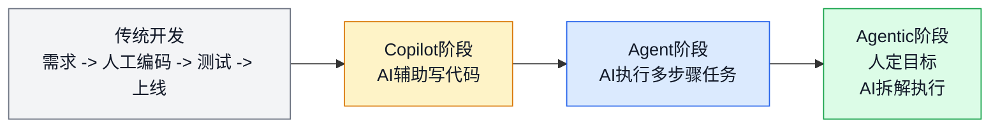
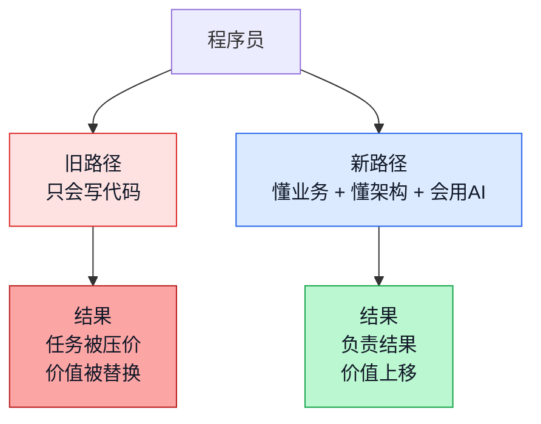
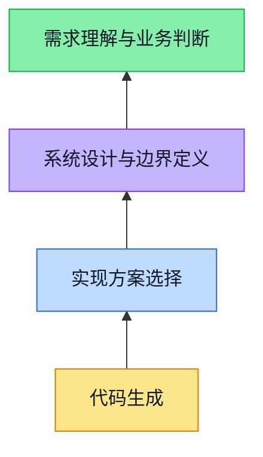
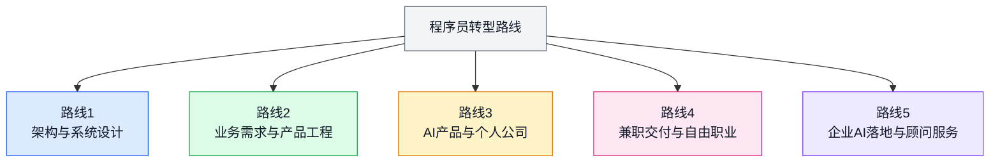
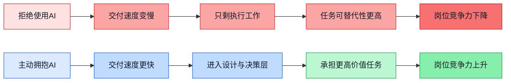
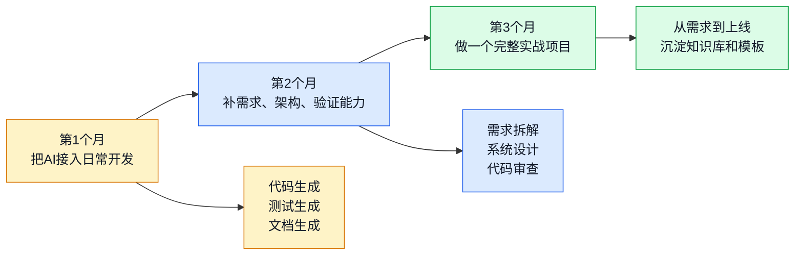

# 2026年，程序员面临的转型之路

> AI不是让程序员这个职业消失，而是把“手写代码”从核心价值，降成了交付链条里的一个执行环节。真正会消失的，不是程序员，而是传统意义上只会接需求、只会写页面、只会堆 CRUD 的码农。

这两年，很多程序员都有一种很强的体感：代码还没写完，AI已经把第一版、第二版，甚至测试用例都给你铺好了。

这不是幻觉，也不是营销话术，而是软件开发的生产方式真的变了。

以前，程序员最重要的能力是“把代码写出来”。

现在，越来越多的常规编码工作，已经不再需要人一行一行去敲。真正拉开差距的，变成了另外几件事：

- 你能不能把业务问题讲清楚
- 你能不能定义边界、约束和取舍
- 你能不能指导 AI 按正确方向生成
- 你能不能识别它哪里做对了、哪里做错了
- 你能不能对最终结果负责

如果一句话概括这场变化，那就是：

**程序员的价值，正在从“实现代码”上移到“定义问题、设计系统、验证结果、交付价值”。**

---

## 一、这场变革已经发生了，不是将来时

很多人还在讨论“AI会不会冲击程序员”，其实这个问题已经晚了半拍。

真正发生的变化，不是 AI 会不会写代码，而是它已经开始承担大量原本属于程序员的执行工作了。前端页面、接口样板、测试脚本、SQL、数据处理任务、运维脚本、文档整理，AI 都能很快给出一个可用版本。

所以今天的变化，不是“有没有 AI”，而是“你是否已经学会把 AI 当生产力来用”。

这意味着什么？

意味着一个团队以后不再需要那么多“纯执行型编码人力”。

以前一个功能需要：

- 产品写文档
- 设计师画稿
- 前端切页面
- 后端写接口
- 测试补用例

现在越来越像这样：

- 少数核心工程师定义目标和约束
- AI 负责大部分实现和初稿
- 人负责决策、校正、验收和上线

冲击最大的，恰恰是那些长期停留在执行层的人。

### 公开数据也在给出同一个信号

如果只看个体体感，很多人还会怀疑是不是”身边个例”。

但从公开资料看，方向已经很一致：

- GitHub Octoverse 2024 提到，2024 年 GitHub 上新增了超过 7 万个公开生成式 AI 项目，相关项目总量同比增长 98%
- Stack Overflow 2024 调查显示，76% 的受访者已经在使用或计划使用 AI 工具进入开发流程
- Anthropic 在 2025 年对 50 万次编码相关交互的分析中发现，Claude Code 场景里 79% 更接近自动化执行，而 UI/UX、Web 与移动应用开发是最常见的任务之一
- JetBrains 2025 开发者调查：86% 的开发者使用 AI 编程助手，但只有 42% 觉得用得有效，关键差异在于是否参与了系统设计和需求澄清的工作
- IEEE 编程指数 2025：前端和全栈岗位的薪资涨幅（8-12%）明显高于纯后端岗位（3-5%），而具备需求分析和架构能力的工程师升职周期缩短 40%

我基于这些资料的判断是：

**AI 正在大幅加快标准化工作（CRUD、模板代码、测试脚本）的交付，这意味着工程师的核心价值向三个方向上移：业务理解、系统设计、质量把关。但这个转变存在滞后——市场上仍然有大量岗位要求”手写代码速度快”，这类岗位的竞争压力在上升。**

---

## 二、程序员内部已经分化，而且分化会加速

程序员不会整体消失，但程序员内部会快速分化。这不是简单的”淘汰”，而是岗位价值和市场需求的结构性变化。

**延续传统方式的人：**

- 等需求
- 拿任务
- 写代码
- 改 bug
- 交付页面或接口

这类工作方式面临的问题是：① AI 的自动化边界不断扩大，这些工作的相对稀缺性在下降 ② 但对大多数中小企业来说，这些工作短期内仍然需要人做 ③ 长期看，这类岗位的薪资增速和晋升空间会受压

**已经调整工作方式的人：**

- 先搞清楚业务目标和边界条件
- 明确约束（成本、性能、风险）
- 用 AI 快速产出多个方案并对比
- 主要时间投入在决策、评审、验证这些环节
- 对最终交付结果负责

这两类人表面上都在”做开发”，但价值贡献、市场位置和成长轨迹已经很不同了。

所谓”码农”这个词，本质上指的是一种工作状态：只负责把别人想好的东西写出来。这种角色下，工程师的价值空间有限。

AI 天生就擅长执行已经定义清楚的任务，这是它的强项。所以问题不是”AI 会不会取代程序员”，而是：

**你现在做的工作，到底有多少东西是”定义问题”的工作，有多少是”执行问题”的工作。**

现实是：执行工作的相对价值在下降，但这不是一蹴而就的。转向定义和决策层，需要补齐新能力，也需要时间。不拥抱 AI 的人不会明天失业，但长期职业竞争力确实会受压——特别是在快速迭代的公司和新兴领域。

---

## 三、程序员不会消失，价值只是整体上移了

AI 很强，但它强在执行，不强在负责。

它可以给你十个方案，但它不知道哪一个更适合你的业务节奏、团队水平、预算约束和上线风险。

它可以生成一大段代码，但它不会天然知道：

- 这个需求值不值得做
- 哪些边界必须收住
- 哪些复杂度是过度设计
- 哪些性能瓶颈会在三个月后爆出来
- 哪些安全和合规问题不能碰
- 这次交付到底算不算真的解决了用户问题

程序员未来最重要的价值，不再是“写”，而是下面这四层。

最底层的代码生成，正在快速被 AI 吞掉。

越往上，越靠近需求、边界、取舍、责任和结果，这部分越离不开人。

所以，程序员的转型方向很清楚：

**不是离开技术，而是站到比“写代码”更高一层的位置。**

---

## 四、不同岗位都要变，但每一类人的变化不一样

AI 并不是平均地冲击所有岗位。前端、客户端、后端、大数据、全栈，都会变，但变法不同。

先看一个总表。

| 角色 | 根本变化 | 特色变化 | 更值得投入的方向 |
|------|------|------|------|
| 前端工程师 | 从页面实现转向产品界面工程 | 组件系统、复杂交互、可访问性、体验约束更重要 | 设计系统、产品工程、AI UI 评审 |
| 客户端工程师 | 从功能开发转向终端体验负责 | 性能、弱网、容灾、设备能力编排更重要 | 端上架构、稳定性、跨端体验 |
| 后端工程师 | 从接口开发转向领域建模与系统设计 | 一致性、可靠性、安全、成本权衡更重要 | 架构设计、业务架构、平台治理 |
| 大数据工程师 | 从跑任务转向数据资产与决策系统 | 口径治理、指标体系、实时链路、数据服务化更重要 | 数据平台、指标治理、智能分析系统 |
| 全栈工程师 | 从什么都写一点转向一人交付业务 | 产品感、闭环能力、交付速度更重要 | 微型 SaaS、独立产品、技术合伙人 |

### 1. 前端工程师：从”切页面”转向”产品界面工程”

前端过去最常见的价值，是把设计稿还原成页面、写交互、接接口、做兼容。现在这些工作，AI 已经能完成很大一部分。前端真正要升值，必须转向更上层。

**具体能力要求：**

- **理解产品流程**（不只是还原页面）：能从用户旅程出发，识别哪些交互会影响转化、哪些状态流转容易出错
- **设计组件系统**（不只是单页代码）：能定义组件库、API 规范、变体策略，让 10 个人在一个系统上写页面的效果一致
- **状态建模和流转**：能用状态机、有限自动机等方式定义复杂交互，而不是靠堆 flag 变量
- **可访问性和兼容性把关**：能用自动化工具验证（而不需要手工测试每个浏览器）

**衡量标准**：
- 你能否用 5 个组件规范和一套状态规则，让 AI 生成一个完整业务流程的页面？
- 你拥有的组件库被团队内复用率是否超过 60%？
- 页面上线前的可访问性问题和浏览器兼容性问题是否同比下降 70%+？

**时间规划**：转向设计系统通常需要 6-9 个月的学习和实践，前提是有真实项目支撑。

**现实例子**：
一个电商前端，能把商详、购物车、结算三个流程的交互规则、组件模型、状态定义清楚，再让 AI 针对不同渠道（PC、移动、小程序）快速生成页面变体。这类工程师对团队的价值明显高于”页面写得快”的人。

### 2. 客户端工程师：从”页面开发”转向”终端体验负责”

移动端、桌面端、小程序客户端看起来也能被 AI 大量生成，但客户端有一个天然门槛：**真实设备环境太复杂**。

**具体能力要求：**

- **端侧架构设计**：定义首屏、离线、缓存、网络分层的策略（而不只是单页面的逻辑）
- **容灾和降级策略**：网络异常时的补偿方案、版本不兼容时的降级规则、内存溢出时的恢复流程
- **性能指标定义和监控**：能用 Lighthouse、RUM 等工具定义可衡量的目标，并持续追踪
- **设备和系统适配**：理解 Android/iOS 版本差异、厂商定制的坑点，而不是靠测试来发现

**衡量标准**：
- 你能否独立设计一套完整的”弱网加载流程”方案，包括缓存、重试、降级、通知？
- 应用的崩溃率、ANR 率是否低于行业中位数（通常 0.1-0.5%）？
- 新功能上线时，能否预测出 90% 以上的设备兼容性问题？

**时间规划**：掌握端侧架构需要 8-12 个月，需要参与过至少一个从 0 到 1 的项目迭代。

**现实困难**：这类能力虽然稀缺性高，但市场需求相对固定。中小企业可能用不上，大厂才能充分发挥这类工程师的价值。

**典型例子**：
一个电商 App 的客户端工程师，主要工作是：设计首屏加载策略（预加载+渲染优化）、离线缓存策略（冷启+热更新）、网络异常时的 UI 变化和重试机制。代码实现大部分由 AI 生成，但这些架构决策完全靠人来做。

### 3. 后端工程师：从”接口开发”转向”领域建模与系统设计”

后端受 AI 冲击最直接，因为接口开发、ORM 映射、CRUD 服务、脚手架代码都是规则明确、重复度高、最适合 AI 生成的部分。继续卷”写接口速度”没有意义。

**具体能力要求：**

- **业务建模和领域分析**：不只写接口，要能从业务流程反推数据模型、事件序列、一致性边界
- **服务设计**：定义服务切分、API 契约、熔断降级策略、跨服务的一致性协议
- **数据一致性策略**：选择强一致/最终一致的方案，设计幂等性、分布式事务、重试机制
- **可观测性架构**：设计日志、链路追踪、指标体系，而不是靠人工排查
- **成本和复杂度权衡**：理解缓存、索引、分片、数据库选型对成本和性能的折衷

**衡量标准**：
- 你能否独立设计一个新业务域的数据模型和核心接口？设计出来的模型是否在第一个版本就通过了 10+ 次业务迭代？
- 系统故障时，你能否在 15 分钟内定位问题（基于可观测性）而不是人工排查？
- 你的系统 P99 延迟是否符合目标？QPS 在部署资源不变的情况下，是否同比提升 30% 以上？

**时间规划**：从”CRUD 工程师”到”系统设计工程师”通常需要 12-18 个月，需要经历过至少一次大规模重构或性能优化。

**市场状况**：这类能力稀缺性最高，但竞争也最激烈。大厂争相招聘系统设计能力强的后端，中小企业用不上，反而造成人才挤压。

**现实例子**：
一个做交易系统的后端，核心工作是：设计订单、支付、库存的事件模型和状态机，定义库存扣减的一致性策略（是库存先扣还是支付先确认），设计补偿和重试机制。代码实现交给 AI，但这些决策必须人来做，且一旦错误的代价很高。

### 4. 大数据工程师：从”跑数和写任务”转向”数据资产与决策系统”

很多数据工程师的日常工作，本质上是：写 SQL、搭 ETL、配调度、做报表、修口径。这些事 AI 非常擅长，因为模式化很强。

**具体能力要求：**

- **指标体系设计**：不只报数字，要能定义什么是关键指标、如何分层、如何互联（因果关系）
- **数据口径治理**：梳理不同系统对同一概念的定义（如”用户”在不同产线的定义），建立统一规范
- **特征工程和模型设计**：从原始数据反推出有业务意义的特征，而不是被动接需求
- **实时 vs 离线分层**：理解什么指标该实时、什么该离线，如何在成本和延迟间权衡
- **数据产品化**：把数据管道包装成面向业务的服务或工具（如自助报表、A/B 实验平台）

**衡量标准**：
- 你能否独立设计一套指标体系，覆盖业务的关键驱动因素（转化、留存、成本等）？
- 数据相关的需求应答时间是否从”人工查询”降到”自助查询”？
- 你的数据管道的延迟和准确度是否支撑了实时决策（而不只是事后分析）？

**时间规划**：从”数据工程师”到”数据架构师”需要 12-24 个月，且需要深入理解业务逻辑。

**市场现状**：AI 对 ETL 和 SQL 的冲击最直接。但数据治理、指标管理仍然很缺人。很多公司有数据堆积但缺乏真正的指标体系。

**现实困难**：这类能力最考验技术和业务的结合。纯技术背景的数据工程师容易做出”技术正确、业务无用”的数据体系。

**例子**：
原来负责日报和埋点的同学，可以转去做”增长分析平台”或”指标治理平台”。具体工作是：定义 GMV、漏斗、配送时长等关键指标的口径，建立从原始事件到指标的计算链路，让业务方自助查询。代码由 AI 生成，但指标定义的业务逻辑必须由人来决策。

### 5. 全栈工程师：从”什么都写一点”转向”一人交付业务”

全栈在 AI 时代其实是最有机会的一类人。一旦前后端、脚本、部署、测试都能交给 AI，真正能把一个完整产品从需求到上线都做出来的人，反而更稀缺。

**具体能力要求：**

- **产品设计和需求澄清**：能和业务方谈需求、做原型、明确优先级（不只是给什么做什么）
- **系统设计的折衷**：在功能、性能、成本、开发速度间权衡（前后端一起考虑）
- **交付和运维**：从开发到上线、监控、迭代的整个链条都能自己搞
- **质量控制**：自己做测试和验收标准，不依赖专业的 QA
- **业务指标理解**：懂得如何评估产品是否真的解决了问题

**衡量标准**：
- 你能否独立把一个需求（从用户故事到验收标准）完整交付上线？
- 交付周期是否达到 2-4 周一个迭代（相当于小团队 3-5 人的效率）？
- 你开发的产品的核心指标（留存、转化等）是否符合业务目标？

**时间规划**：要做到真正的全栈，需要 18-24 个月的实战经验，且需要在小团队或个人项目中完整尝试过。

**市场机会**：最大。垂直 SaaS、内部工具、小型创业项目都需要这样的人。但竞争也在上升。

**市场风险**：中大型企业通常不会让全栈工程师做所有事，因为需要专业细分。全栈最大的市场在小公司、创业和兼职。

**现实例子**：
一个全栈工程师，针对中小培训机构做”招生线索管理 + 课消分析 + 家长回访”的轻量 SaaS。过去至少需要 3-5 人团队，现在一个人加 AI 可以做出第一版并上线收费。关键不是技术栈有多全，而是能独立完成从业务分析、产品设计、代码实现到上线运维的全过程。

---

## 五、AI时代，程序员有哪几条真正可走的明路

不是每个人都要去做管理，也不是每个人都要去创业。

但大方向上，程序员至少有下面几条路，而且都是现实中走得通的。

### 路线1：转向架构设计和系统设计

这是最适合后端、资深全栈、基础架构工程师的一条路。

你的价值不再是“写服务”，而是：

- 定义边界
- 切模块
- 做容量规划
- 定义 SLA
- 控制成本
- 决定哪些交给 AI，哪些必须人工兜底

**现实例子**：
一个做了多年订单系统的后端工程师，可以把自己升级成业务架构负责人。以前亲自写服务、写接口；以后更多是拆业务域、定事件模型、做容灾策略，然后让 AI 帮他生成代码、测试和文档。

### 路线2：转向业务需求和产品工程

这条路特别适合前端、客户端、业务后端和做了很多年业务开发的人。

真正理解业务的人，在 AI 时代会变得很值钱。因为 AI 最怕的不是代码难，而是问题说不清。

你可以转向：

- 需求分析
- 业务建模
- 原型设计
- AI 协同交付
- 验收和迭代决策

**现实例子**：
一个长期做运营平台的前端工程师，其实非常懂业务流程、权限模型、表单规则和交互逻辑。这类人完全可以升级成“产品工程师”，自己和业务方对需求、自己拉 AI 生成页面和接口、自己做验收，交付效率会比传统协作模式高很多。

### 路线3：做个人公司，跑小而美的软件业务

这是 AI 时代给程序员最大的新增机会之一。

以前一个人做产品，最难的是人手不够：

- 不会设计
- 不会前端
- 不会运营
- 开发周期太长

现在这些门槛都在下降。

如果你本来就有技术底子，再加上 AI 协作，完全可以做：

- 垂直行业 SaaS
- 小型管理后台
- 内部协作工具
- 内容生产工具
- 数据分析工具

**现实例子**：
一个全栈工程师，针对培训机构做“招生线索管理 + 课消分析 + 家长回访”的轻量 SaaS。过去至少需要 3 到 5 人团队，现在一个人加 AI 就能做出第一版、上线、收费、迭代。

### 路线4：做兼职交付、自由职业和高毛利项目

以前程序员做兼职，最大问题是时间不够、交付太慢。

现在不是这样了。

如果你能把 AI 用到项目交付流程里，很多中小项目会突然变得可做：

- 企业官网和后台
- CRM/ERP 定制
- 小程序
- 数据报表平台
- 自动化脚本和内部工具

**现实例子**：
一个熟悉 React 和 Java 的工程师，以前接一个后台系统要 6 周，现在可以把需求拆清、让 AI 生成前后端主体代码、自己只盯业务规则、权限和部署，2 到 3 周就能交第一版。单价不一定更高，但单位时间产出明显更高。

### 路线5：做企业 AI 落地、工具链和顾问服务

这条路会越来越常见，而且门槛不低，但非常适合资深工程师。

很多公司并不缺一个会用 AI 的人，缺的是一个能把 AI 真正接进研发流程的人。

包括：

- 如何建立团队提示词规范
- 如何建设内部知识库
- 如何让 AI 参与编码、测试、评审
- 如何定义哪些任务能自动化，哪些任务不能
- 如何把模型能力接进业务系统

**现实例子**：
一个做过平台工程或数据平台的工程师，可以给中型企业做“AI研发效能改造”。不是卖概念，而是把需求模板、代码规范、知识库、测试策略、自动审查流程都落下来。这类工作非常实在，而且越来越有市场。

---

## 六、不学会用AI的人，市场竞争力会逐步下降

这不是危言耸听，而是一个经济现象。不拥抱 AI 的程序员不会明天失业，但会面临长期竞争压力。

**具体会失去什么：**

- **相对效率优势**：同样时间内交付的产出和质量相比会更低
- **复杂项目的主导权**：公司会倾向于给用 AI 的工程师更大的项目和责任
- **更高价值岗位的竞争力**：架构师、技术负责人这类位置，企业会优先选择”既懂系统设计、又会用 AI 提效”的人
- **收入增速**：在公司内，用 AI 的工程师的加薪幅度和晋升空间会更大
- **职业自由度**：兼职、独立项目、小团队这些机会，门槛会因为 AI 而大幅降低，但只有用好 AI 的人享受到

**现实是什么样的：**

公司需要的从来不是”你很辛苦”，而是”你能多快多稳地交付结果”。如果另一个工程师用 AI 能把效率拉高 50-100%、同时做出更好的架构决策，那这个人拿到更好的岗位和收入是自然结果。

**但也要客观：**

AI 的能力上限快速在上升，但边界仍然很清楚——它很强在执行，但在需求理解、系统决策、长期演进这些方面仍然需要人。所以这不是”工程师被代替”，而是”纯执行型工程师的相对价值下降，系统设计和业务理解的价值上升”。

所以这不是站队问题，而是职业竞争力问题。

你可以不喜欢 AI，但你不能假装生产方式没有变。

---

## 七、程序员最该补的四种能力（为 AI 做准备）

参考过去几年 AI 编程实践里反复出现的规律，用好 AI 最直接需要这四种能力。而且这些能力长期有效，不随技术更新而淘汰。

### 1. 需求描述和问题定义能力

很多工程师觉得 AI “生成的代码质量不高”、”总是不符合需求”，根本原因往往是问题没定清楚。

**具体方法**：不是”做个搜索功能”，而是围绕五个问题展开：

- **What**：搜什么？关键词、标签、类目还是组合查询？
- **Who**：给谁用？内部员工还是用户？用户群体的技术水平如何？
- **Scale**：数据规模和并发量是多少？影响技术方案选择。
- **Constraint**：响应时间、成本、精度要求各是多少？这些决定了优化方向。
- **Edge**：哪些边界情况必须处理？空值、超长、特殊字符、多语言？

只有事先把这五个问题答清楚，AI 才能生成走在前方的架构而不是绕弯路。

### 2. 系统设计的折衷能力

AI 能帮你快速产出三个不同的实现方案。但选择哪个？依赖什么？这靠人。

**具体方法**：在推进方案前，做四个权衡：

- **功能 vs 时间**：这个版本必须做什么，可以延后什么？
- **性能 vs 成本**：缓存、数据库、CDN 投入多少才划算？
- **通用 vs 特化**：值不值得做通用解决方案，还是针对当前业务定制？
- **简单 vs 完善**：第一版要有多完善？容灾、监控、扩展性要到什么程度？

这些都不是”正确”答案，而是根据公司阶段、预算、风险承受力来决策。AI 做不了这个。

### 3. 算法思维和问题抽象能力

不是为了”刷题变聪明”，而是为了指导 AI 选择高效路线。

**具体应用**：学会识别问题模式，然后告诉 AI 用什么思路：

- **搜索问题**：用索引、倒排、二分查找还是 B 树？
- **调度问题**：贪心能不能行？需要动态规划吗？
- **路径问题**：BFS、DFS、Dijkstra、A*，哪个最合适？
- **实时计算**：时间窗口怎么划分？怎么处理出晚数据？

你能快速判断问题类型、给出方向，AI 负责实现细节。这对了，效率能提升 10 倍，这对错，再快的代码生成也救不了。

### 4. 质量验证和批判性思维

AI 最容易犯的错是”写得像对的但其实不行”。

**具体方法**：从这几个维度验证：

- **业务逻辑验证**：核心流程、边界情况、异常处理能不能用人话说通？
- **数据验证**：输入数据的分布是什么？AI 考虑到了吗？
- **性能验证**：有没有明显的性能瓶颈？大数据量下还能跑吗？
- **安全验证**：有没有 SQL 注入、权限绕过、信息泄露的风险？
- **可维护性验证**：代码是否清晰？六个月后你还能改吗？

这四种验证，每一种都已经有工具支持（单元测试、性能分析工具、SAST 工具）。你要做的是建立一套 Checklist，确保每次 review 都不放过。

---

## 八、给程序员的一条现实转型路线：先把自己变成“会带AI干活的人”

如果你现在还没有转，最实在的方式不是空想，而是用 90 天把工作方式换掉。

### 第1个月：把 AI 真正接进工作流（从工具到伙伴）

**具体事项：**

- 选一个趁手的工具（Claude、GitHub Copilot 等），每天用
- 从小任务开始：写测试、写脚本、写文档、写 PR Description
- 记录下 “AI 产出的东西能直接用”vs “需要改 50% 以上”的比例
- 实验不同的提示词写法，看哪种自己最适应

**关键指标**：
- 你能否在 2 周内养成习惯，遇到一个代码任务下意识地想”这个能让 AI 先写”？
- 简单任务（生成测试、生成脚本）的直用率是否达到 70% 以上？

**常见坑**：
- 很多人第一个月就陷入”优化提示词”的深坑，一周调一个版本的提示词。实际上 80% 的收益来自好的需求定义，不是提示词微调。
- 另一个坑是”什么都交给 AI”，最后代码风格混乱、技术债堆积。要建立自己的”AI 交付标准”。

### 第2个月：补齐上层能力（知识和判断）

**具体课题：**

- **需求拆解法**：学会用 5W 拆解需求（见第七章第1点），最好在团队内部尝试用新的 PRD 模板
- **系统设计训练**：读几个开源项目的架构文档，理解权衡点（为什么用 Redis 而不是本地缓存？）
- **算法识别能力**：针对自己领域的常见问题，梳理出 3-5 个典型模式和对应方案
- **代码改进能力**：建立一套自己的 Code Review Checklist，每次都用

**关键指标**：
- 你能否写出一份”我理解透彻”的系统设计文档？（即使最后 AI 生成代码，设计至少要自己想清楚）
- 你的 Code Review 反馈从”格式和命名”上升到”逻辑、性能、可维护性”了吗？

**常见坑**：
- 这个月容易”学太多”，反而没时间在实际工作中用。建议：选一个最薄弱的能力（比如很多工程师的系统设计意识不足），深入一点。
- 另一个坑是”学了不用”。一定要在实际项目中尝试，而不是单纯做练习。

### 第3个月：独立完成一个真实端到端项目

**项目选择（重点不是大小，而是完整性）：**

可以是：
- 一个管理后台（固定功能，复杂度中等，好衡量成功）
- 一个自动化脚本或内部工具（快速见效）
- 一个小程序或移动应用（强制考虑端口适配和发布）
- 一个轻量 SaaS（如果你有时间，最有长期价值）

**必须完整经历的环节：**

- **需求澄清**：即使需求是自己想的，也要用第七章的 5W 模型写清楚
- **架构设计**：在开工前，写一个”哪些部分用 AI 生成、哪些部分手工、哪些部分借用开源”的分工方案
- **AI 协作**：代码由 AI 主导生成（至少 70% 代码来自 AI），你的工作是审核、修改、集成
- **测试和质量**：自己写测试用例，能覆盖核心业务逻辑就行（不必 100% 覆盖）
- **上线和迭代**：要真的跑起来，最好能收集实际用户反馈，再迭代一版

**衡量成功：**
- 代码能正常运行，核心功能能用
- 完成周期 < 6 周（小项目）或 3 个月（中等项目）
- 回过头看，你能解释为什么这样设计、为什么选这个技术栈

**最重要的收获：**
不是”我做出了一个产品”，而是”我理解了 AI 时代的开发流程：需求 → 设计 → AI 生成 → 验证 → 上线”，后续任何工作都能套用这个框架。

---

## 九、最后想说的：这是一次职业重新定位，不是一场淘汰

AI 编程时代让很多程序员不舒服。不是因为 AI，而是因为我们过去十几年最依赖、最容易量化的能力——写代码——正在被重新评价。焦虑是正常的，但不必惊慌。

**现实的几个观察：**

1. **这个过程会很长**。不是一两年的事。中小企业可能 3-5 年才会明显感受到这种变化。你有时间调整。

2. **”用 AI 的人”赚得更多，但入门门槛其实不算高**。不需要成为 AI 专家，也不需要学所有新框架。只是换个工作方式。

3. **不是所有人都适合往上层爬**。有人就是喜欢写代码，喜欢一行行敲，这完全可以。但这类人的市场价值会相对稳定（不会暴涨，但也不会突然失业）。

4. **不同公司、不同领域、不同岗位的节奏完全不同**。基础设施团队可能对 AI 的需求就没有业务团队那么迫切。创业公司和大公司的压力也不一样。

**我的建议（不是”一定要这么做”，而是”如果你有选择权”）：**

至少花 3 个月（本文第八章的框架），完整经历一次”用 AI 从需求到上线”的流程。不是为了成为 AI 专家，而是为了搞清楚：

- 什么工作 AI 能有效代替，什么工作还是需要人
- 你自己在这个新流程中的角色是什么
- 用好 AI 最关键的能力是什么
- 你愿不愿意往这个方向调整

如果试了之后你觉得”这不适合我”，那至少你是有意识地做了这个选择，而不是被动地被时代抛弃。

**最后一句话：**

别被”AI 时代的新工种”这样的话吓住。真的并不是所有人都要做架构师、不是所有人都要做产品经理、也不是所有人都要创业。

但确实，如果你想维持现在的竞争力、或者想要更高的价值和收入，**最安全的做法就是：补齐定义问题、设计系统、验证结果这几个技能，学会和 AI 协作。**

这条路不轻松，但真的走得通。而且比你想的更清晰。

---

## 十、真实数据：转型的难点和市场现状

如果你被上面的内容激励了，也该看看真实的困难和市场现状：

### 能力转型很难，比学新框架难多倍

- **时间投入**：从"执行型工程师"到"系统设计工程师"通常需要 12-24 个月，不是 12 周
- **知识面很广**：需要懂业务、懂系统设计、懂 AI、懂质量保证，不是专一的
- **心态转变**：从"做完任务就完了"到"要对结果负责"，这一转变比技能转变更难

### 市场需求在变，但很不均匀

- **大厂和初创**需求最紧迫，但两者的压力完全不同：大厂想提效、初创想生存
- **中小企业**对转型的压力最小，很可能未来 2-3 年还是以传统方式工作
- **外包和兼职市场** 是最快受到冲击的，因为纯交付能力最容易被 AI 代替
- **某些领域**（如金融、医疗）对 AI 生成的代码有严格审查，不会快速普及

### 拥抱 AI 不等于赚钱更多

- **薪资曲线**：有数据显示"会用 AI 的工程师"的初期薪资提升是 10-15%，不是翻倍
- **竞争加剧**：一旦"用 AI 变成基本能力"，这个优势也会被平衡掉
- **真正升值的是系统设计 + 业务理解 + 团队管理**，而不是单纯的"用 AI"

### 个人建议的风险提示

上面第八章的"90 天转型"方案在某些假设下很有效，但也有隐藏的风险：

- 如果你在一个保守的公司，"突然开始用 AI 开发"可能会被认为"不专业"
- 如果你的项目要求代码可追溯、需审计（金融、医疗），AI 生成代码需要特别谨慎
- 如果主动接新项目来练 AI 协作，失败的成本也会很高

**更现实的做法**：不要一下子改变整个工作方式，而是在日常工作中逐步尝试（写测试、文档、脚本），和团队保持同步，评估效果后再大规模转变。

---

## 相关链接

- AI编程核心知识库：https://microwind.github.io
- 参考主题：需求描述、系统设计、算法思想、Agent 工程师
- 主要参考来源：`/Users/jarry/github/algorithms/start-here/` 目录下相关文档
- GitHub Octoverse 2024: https://github.blog/news-insights/octoverse/octoverse-2024/
- Stack Overflow 2024 Developer Survey AI Insights: https://stackoverflow.blog/2024/07/22/2024-developer-survey-insights-for-ai-ml/
- Anthropic Economic Index, AI's impact on software development: https://www.anthropic.com/news/impact-software-development
