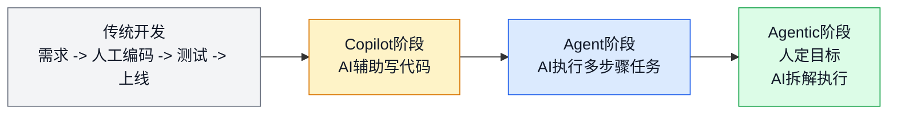
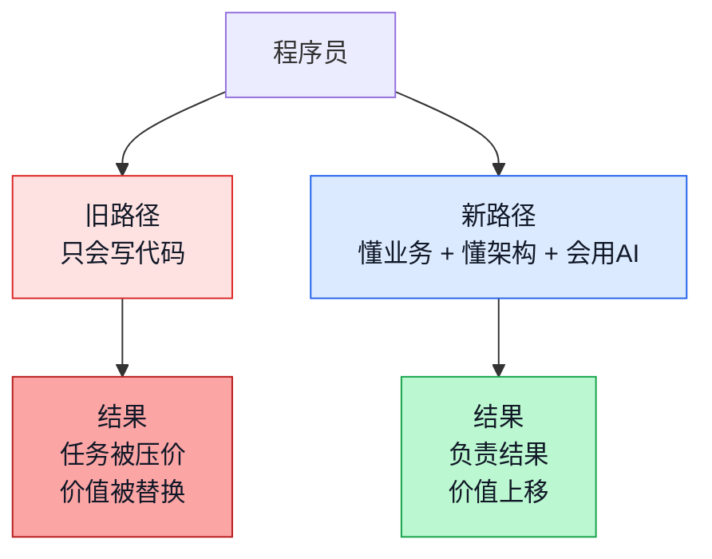
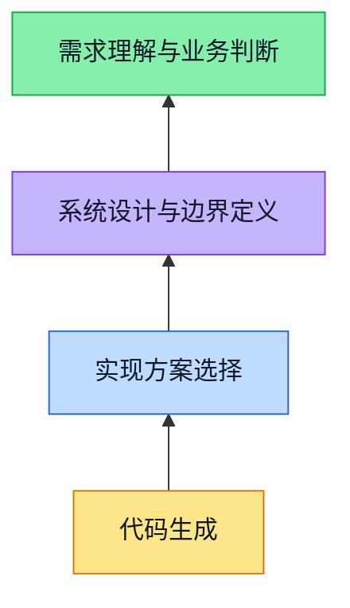
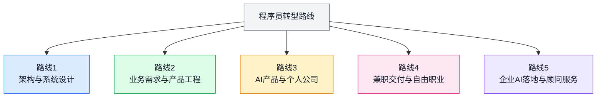
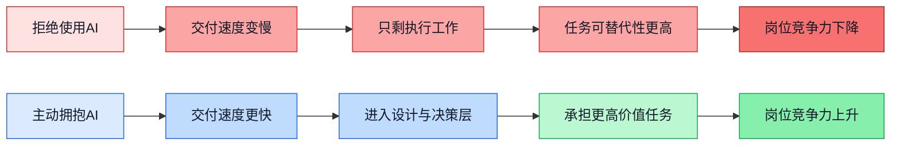
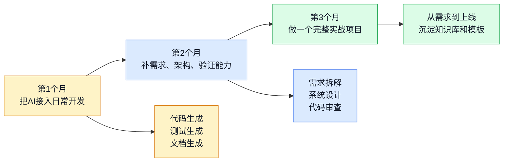

# AI编程时代，程序员面临的转型之路

> AI不是让程序员这个职业消失，而是把“手写代码”从核心价值，降成了交付链条里的一个执行环节。真正会消失的，不是程序员，而是传统意义上只会接需求、只会写页面、只会堆 CRUD 的码农。

这两年，很多程序员都有一种很强的体感：代码还没写完，AI已经把第一版、第二版，甚至测试用例都给你铺好了。

这不是幻觉，也不是营销话术，而是软件开发的生产方式真的变了。

以前，程序员最重要的能力是“把代码写出来”。

现在，越来越多的常规编码工作，已经不再需要人一行一行去敲。真正拉开差距的，变成了另外几件事：

- 你能不能把业务问题讲清楚
- 你能不能定义边界、约束和取舍
- 你能不能指导 AI 按正确方向生成
- 你能不能识别它哪里做对了、哪里做错了
- 你能不能对最终结果负责

如果一句话概括这场变化，那就是：

**程序员的价值，正在从“实现代码”上移到“定义问题、设计系统、验证结果、交付价值”。**

---

## 一、这场变革已经发生了，不是将来时

很多人还在讨论“AI会不会冲击程序员”，其实这个问题已经晚了半拍。

真正发生的变化，不是 AI 会不会写代码，而是它已经开始承担大量原本属于程序员的执行工作了。前端页面、接口样板、测试脚本、SQL、数据处理任务、运维脚本、文档整理，AI 都能很快给出一个可用版本。

所以今天的变化，不是“有没有 AI”，而是“你是否已经学会把 AI 当生产力来用”。

这意味着什么？

意味着一个团队以后不再需要那么多“纯执行型编码人力”。

以前一个功能需要：

- 产品写文档
- 设计师画稿
- 前端切页面
- 后端写接口
- 测试补用例

现在越来越像这样：

- 少数核心工程师定义目标和约束
- AI 负责大部分实现和初稿
- 人负责决策、校正、验收和上线

冲击最大的，恰恰是那些长期停留在执行层的人。

### 公开数据也在给出同一个信号

如果只看个体体感，很多人还会怀疑是不是“身边个例”。

但从公开资料看，方向已经很一致：

- GitHub Octoverse 2024 提到，2024 年 GitHub 上新增了超过 7 万个公开生成式 AI 项目，相关项目总量同比增长 98%
- Stack Overflow 2024 调查显示，76% 的受访者已经在使用或计划使用 AI 工具进入开发流程
- Anthropic 在 2025 年对 50 万次编码相关交互的分析中发现，Claude Code 场景里 79% 更接近自动化执行，而 UI/UX、Web 与移动应用开发是最常见的任务之一

我基于这些资料的判断是：

**标准化程度高、界面导向强、重复实现多的工作，会更早被 AI 重构；而需求判断、系统设计、复杂业务建模和质量验证，会更快升值。**

---

## 二、真正会被淘汰的，是传统意义上的码农

程序员不会整体消失，但程序员内部会快速分化。

一类人还在用过去的方式工作：

- 等需求
- 拿任务
- 写代码
- 改 bug
- 交付页面或接口

另一类人已经换了工作方式：

- 先搞清楚业务目标
- 明确边界、性能和成本约束
- 把任务拆给 AI
- 用 AI 快速产出多个方案
- 自己做选择、评审和验证

这两类人，看上去都还在“做开发”，但本质已经不是一个工种了。

所谓“码农”这个词，本质上指的是一种工作状态：只负责把别人想好的东西写出来。

这种角色在 AI 时代会越来越危险，因为 AI 天生就擅长执行已经定义清楚的任务。

所以真正该警惕的，不是“AI 会不会取代程序员”，而是：

**你现在做的工作，到底是在定义问题，还是只是在执行问题。**

---

## 三、程序员不会消失，价值只是整体上移了

AI 很强，但它强在执行，不强在负责。

它可以给你十个方案，但它不知道哪一个更适合你的业务节奏、团队水平、预算约束和上线风险。

它可以生成一大段代码，但它不会天然知道：

- 这个需求值不值得做
- 哪些边界必须收住
- 哪些复杂度是过度设计
- 哪些性能瓶颈会在三个月后爆出来
- 哪些安全和合规问题不能碰
- 这次交付到底算不算真的解决了用户问题

程序员未来最重要的价值，不再是“写”，而是下面这四层。

最底层的代码生成，正在快速被 AI 吞掉。

越往上，越靠近需求、边界、取舍、责任和结果，这部分越离不开人。

所以，程序员的转型方向很清楚：

**不是离开技术，而是站到比“写代码”更高一层的位置。**

---

## 四、不同岗位都要变，但每一类人的变化不一样

AI 并不是平均地冲击所有岗位。前端、客户端、后端、大数据、全栈，都会变，但变法不同。

先看一个总表。

| 角色 | 根本变化 | 特色变化 | 更值得投入的方向 |
|------|------|------|------|
| 前端工程师 | 从页面实现转向产品界面工程 | 组件系统、复杂交互、可访问性、体验约束更重要 | 设计系统、产品工程、AI UI 评审 |
| 客户端工程师 | 从功能开发转向终端体验负责 | 性能、弱网、容灾、设备能力编排更重要 | 端上架构、稳定性、跨端体验 |
| 后端工程师 | 从接口开发转向领域建模与系统设计 | 一致性、可靠性、安全、成本权衡更重要 | 架构设计、业务架构、平台治理 |
| 大数据工程师 | 从跑任务转向数据资产与决策系统 | 口径治理、指标体系、实时链路、数据服务化更重要 | 数据平台、指标治理、智能分析系统 |
| 全栈工程师 | 从什么都写一点转向一人交付业务 | 产品感、闭环能力、交付速度更重要 | 微型 SaaS、独立产品、技术合伙人 |

### 1. 前端工程师：从“切页面”转向“产品界面工程”

前端过去最常见的价值，是把设计稿还原成页面、写交互、接接口、做兼容。

现在这些工作，AI 已经能完成很大一部分。前端真正要升值，必须转向更上层：

- 理解产品流程，而不是只还原页面
- 设计组件系统，而不是只写单页代码
- 约束交互体验，而不是只补事件处理
- 主导可用性、可访问性和复杂状态流转

**根本变化**：从“页面实现者”变成“产品体验工程师”。

**特色变化**：会不会做设计系统、状态建模、复杂交互约束，比会不会手搓页面更重要。

一个真实可行的例子是：
以前一个前端主要接活动页、表单页、后台页；以后更有价值的前端，是能把一套复杂业务流程拆成组件规范、状态机和交互约束，再让 AI 快速生成页面的人。

### 2. 客户端工程师：从“页面开发”转向“终端体验负责”

移动端、桌面端、小程序客户端看起来也能被 AI 大量生成，但客户端有一个天然门槛：**真实设备环境太复杂**。

比如：

- 弱网、断网、重试
- 启动速度、卡顿、耗电
- 相机、定位、推送、蓝牙、文件系统
- 多机型适配、系统版本兼容、应用商店审核

这些都不是“把页面写出来”就结束的事情。

**根本变化**：从“客户端代码开发”转向“端上体验和稳定性负责人”。

**特色变化**：性能、容灾、终端能力编排、发布策略，会比界面实现本身更值钱。

一个典型例子是：
做电商 App 的客户端工程师，以后最重要的不再是把商品详情页写出来，而是设计首屏加载策略、离线缓存策略、异常恢复策略，再用 AI 帮你生成大部分实现代码。

### 3. 后端工程师：从“接口开发”转向“领域建模与系统设计”

后端受冲击最直接，因为大量接口开发、ORM 映射、CRUD 服务、脚手架代码，本来就是规则明确、重复度高、最适合 AI 生成的部分。

所以后端工程师继续卷“写接口速度”，没有意义。

真正该卷的是：

- 业务抽象是否准确
- 服务边界是否清楚
- 数据模型是否稳定
- 一致性、可靠性、可观测性如何设计
- 性能、成本、安全如何平衡

**根本变化**：从“接口工程师”转向“系统设计工程师”。

**特色变化**：谁能定义领域模型、消息链路、缓存策略、容错策略，谁就更值钱。

一个很现实的例子是：
熟悉交易、库存、支付链路的后端，完全可以转成“业务架构负责人”。AI 可以替你把接口和模块初稿全写出来，但订单状态机怎么设计、补偿逻辑怎么兜底、监控指标怎么定义，仍然要靠人。

### 4. 大数据工程师：从“跑数和写任务”转向“数据资产与决策系统”

很多数据工程师的日常工作，本质上是：

- 写 SQL
- 搭 ETL
- 配调度
- 做报表
- 修口径

这些事 AI 非常擅长，因为模式化很强。

所以大数据工程师真正该升级的方向，是：

- 指标体系定义
- 数据口径治理
- 特征工程设计
- 实时链路与离线链路架构
- 数据服务化、资产化、产品化

**根本变化**：从“数据任务执行者”转向“数据系统设计者”。

**特色变化**：你能不能把混乱的数据加工过程，沉淀成统一口径、统一模型、统一服务。

一个真实可行的例子是：
原来负责日报和埋点的同学，可以转去做“增长分析平台”或“指标治理平台”。AI 能写 SQL 和调度代码，但“GMV 到底怎么定义、跨端漏斗怎么算、异常数据如何修复”必须由真正理解业务的人来做。

### 5. 全栈工程师：从“什么都写一点”转向“一人交付业务”

全栈在 AI 时代其实是最有机会的一类人。

因为一旦前后端、脚本、部署、测试都能交给 AI，真正能把一个完整产品做出来的人，反而更稀缺。

**根本变化**：从“全都懂一点”转向“一个人完成小团队交付”。

**特色变化**：产品感、交付速度、业务闭环能力，会比技术栈本身更重要。

一个非常现实的方向就是：
一个懂前端、后端和部署的全栈工程师，可以做垂直 SaaS、小工具、内部系统外包、小型会员产品，甚至一个人就能跑出一家微型软件公司。

---

## 五、AI时代，程序员有哪几条真正可走的明路

不是每个人都要去做管理，也不是每个人都要去创业。

但大方向上，程序员至少有下面几条路，而且都是现实中走得通的。

### 路线1：转向架构设计和系统设计

这是最适合后端、资深全栈、基础架构工程师的一条路。

你的价值不再是“写服务”，而是：

- 定义边界
- 切模块
- 做容量规划
- 定义 SLA
- 控制成本
- 决定哪些交给 AI，哪些必须人工兜底

**现实例子**：
一个做了多年订单系统的后端工程师，可以把自己升级成业务架构负责人。以前亲自写服务、写接口；以后更多是拆业务域、定事件模型、做容灾策略，然后让 AI 帮他生成代码、测试和文档。

### 路线2：转向业务需求和产品工程

这条路特别适合前端、客户端、业务后端和做了很多年业务开发的人。

真正理解业务的人，在 AI 时代会变得很值钱。因为 AI 最怕的不是代码难，而是问题说不清。

你可以转向：

- 需求分析
- 业务建模
- 原型设计
- AI 协同交付
- 验收和迭代决策

**现实例子**：
一个长期做运营平台的前端工程师，其实非常懂业务流程、权限模型、表单规则和交互逻辑。这类人完全可以升级成“产品工程师”，自己和业务方对需求、自己拉 AI 生成页面和接口、自己做验收，交付效率会比传统协作模式高很多。

### 路线3：做个人公司，跑小而美的软件业务

这是 AI 时代给程序员最大的新增机会之一。

以前一个人做产品，最难的是人手不够：

- 不会设计
- 不会前端
- 不会运营
- 开发周期太长

现在这些门槛都在下降。

如果你本来就有技术底子，再加上 AI 协作，完全可以做：

- 垂直行业 SaaS
- 小型管理后台
- 内部协作工具
- 内容生产工具
- 数据分析工具

**现实例子**：
一个全栈工程师，针对培训机构做“招生线索管理 + 课消分析 + 家长回访”的轻量 SaaS。过去至少需要 3 到 5 人团队，现在一个人加 AI 就能做出第一版、上线、收费、迭代。

### 路线4：做兼职交付、自由职业和高毛利项目

以前程序员做兼职，最大问题是时间不够、交付太慢。

现在不是这样了。

如果你能把 AI 用到项目交付流程里，很多中小项目会突然变得可做：

- 企业官网和后台
- CRM/ERP 定制
- 小程序
- 数据报表平台
- 自动化脚本和内部工具

**现实例子**：
一个熟悉 React 和 Java 的工程师，以前接一个后台系统要 6 周，现在可以把需求拆清、让 AI 生成前后端主体代码、自己只盯业务规则、权限和部署，2 到 3 周就能交第一版。单价不一定更高，但单位时间产出明显更高。

### 路线5：做企业 AI 落地、工具链和顾问服务

这条路会越来越常见，而且门槛不低，但非常适合资深工程师。

很多公司并不缺一个会用 AI 的人，缺的是一个能把 AI 真正接进研发流程的人。

包括：

- 如何建立团队提示词规范
- 如何建设内部知识库
- 如何让 AI 参与编码、测试、评审
- 如何定义哪些任务能自动化，哪些任务不能
- 如何把模型能力接进业务系统

**现实例子**：
一个做过平台工程或数据平台的工程师，可以给中型企业做“AI研发效能改造”。不是卖概念，而是把需求模板、代码规范、知识库、测试策略、自动审查流程都落下来。这类工作非常实在，而且越来越有市场。

---

## 六、不拥抱AI的人，不会一下失业，但会慢慢出局

这件事不需要渲染得很吓人，但确实要说清楚。

不拥抱 AI 的程序员，通常不会在明天突然失业，而是会在接下来的几年里，逐步失去这些东西：

- 同样任务下的效率优势
- 在团队里的稀缺性
- 对复杂项目的主导权
- 更高价值岗位的竞争力
- 时间自由度和收入上限

原因很简单。

公司买的从来不是“你很辛苦”，而是“你能不能更快更稳地交付结果”。

如果另一个工程师能用 AI 把交付效率拉高 2 倍、试错成本降一半、同时还能做架构和需求判断，那么他拿到更好的岗位和更高的收入，是正常结果。

所以这不是站队问题，而是职业竞争力问题。

你可以不喜欢 AI，但你不能假装生产方式没有变。

---

## 七、程序员最该补的，不是某个新框架，而是这四种能力

参考过去几年 AI 编程实践里反复出现的规律，真正长期升值的，始终是这四种能力。

### 1. 需求描述能力

你要能把一句模糊的话，变成清晰、可执行、可验证的问题定义。

比如不是“做个搜索功能”，而是：

- 搜什么
- 给谁用
- 数据规模多大
- 响应时间要求多少
- 结果排序按什么规则
- 哪些边界情况必须考虑

### 2. 系统设计能力

你要能在 AI 开工前，先把边界和约束定住。

包括：

- 模块如何划分
- 数据怎么流动
- 容量怎么估
- 失败怎么兜
- 成本怎么控

### 3. 算法和抽象能力

不是为了刷题，而是为了指导 AI 选择正确思路。

比如看到：

- 搜索问题，想到索引、倒排、二分
- 调度问题，想到优先队列、贪心、回溯
- 路径问题，想到图、最短路、动态规划
- 实时计算问题，想到窗口、聚合、去重、缓存

### 4. 质量验证能力

AI 最大的问题不是不会写，而是很容易“写得像对的”。

所以你必须能验证：

- 业务逻辑是否真的成立
- 边界条件是否覆盖
- 性能是否满足目标
- 安全问题是否埋雷
- 代码是否真的可维护

---

## 八、给程序员的一条现实转型路线：先把自己变成“会带AI干活的人”

如果你现在还没有转，最实在的方式不是空想，而是用 90 天把工作方式换掉。

### 第1个月：把 AI 真正接进工作流

不是拿它当搜索引擎，而是让它参与：

- 写第一版代码
- 补测试
- 生成脚本
- 做重构建议
- 写技术说明

目标只有一个：**让自己习惯“先想怎么让 AI 干，再决定自己补哪里”。**

### 第2个月：补齐上层能力

这个阶段不要继续沉迷于“哪个模型更强”，而是开始系统补：

- 需求拆解
- 系统设计
- 算法思想
- 评审能力
- 测试和验证方法

你会发现，真正限制你用好 AI 的，往往不是工具，而是你自己对问题理解得不够深。

### 第3个月：独立完成一个真实闭环

自己找一个完整项目，从需求到上线都走一遍。

比如：

- 一个管理后台
- 一个数据看板
- 一个小程序
- 一个轻量 SaaS
- 一个团队内部工具

重点不是项目大小，而是你要完整经历：

- 需求澄清
- 架构设计
- AI 协作生成
- 测试和验收
- 部署和迭代

只要你完整跑通一次，你对 AI 时代开发的理解就会从“听说”变成“会用”。

---

## 九、最后想说的：别把自己困在“会不会写代码”这件事里

AI 编程时代，确实让很多程序员不舒服。

因为过去十几年我们最熟悉、最依赖、最容易量化的能力，就是写代码。现在这部分能力正在被快速稀释，焦虑是正常的。

但换个角度看，这也是程序员职业第一次大规模地从执行层，往更高层升级。

以后真正值钱的人，不一定是代码写得最快的人，而是下面这种人：

- 能看懂业务本质
- 能把问题讲清楚
- 能设计合理系统
- 能调动 AI 大规模干活
- 能对结果负责

这类人，过去叫资深工程师、架构师、技术负责人。

以后，这会成为更大范围程序员的基本形态。

所以，别再问“AI 会不会让程序员失业”。

更该问的是：

**从今天开始，你要不要把自己从一个写代码的人，升级成一个能定义问题、设计系统、带着 AI 一起交付结果的人。**

这条路不轻松，但它很明确，而且真的走得通。

---

## 相关链接

- AI编程核心知识库：https://microwind.github.io
- 参考主题：需求描述、系统设计、算法思想、Agent 工程师
- 主要参考来源：`/Users/jarry/github/algorithms/start-here/` 目录下相关文档
- GitHub Octoverse 2024: https://github.blog/news-insights/octoverse/octoverse-2024/
- Stack Overflow 2024 Developer Survey AI Insights: https://stackoverflow.blog/2024/07/22/2024-developer-survey-insights-for-ai-ml/
- Anthropic Economic Index, AI's impact on software development: https://www.anthropic.com/news/impact-software-development
