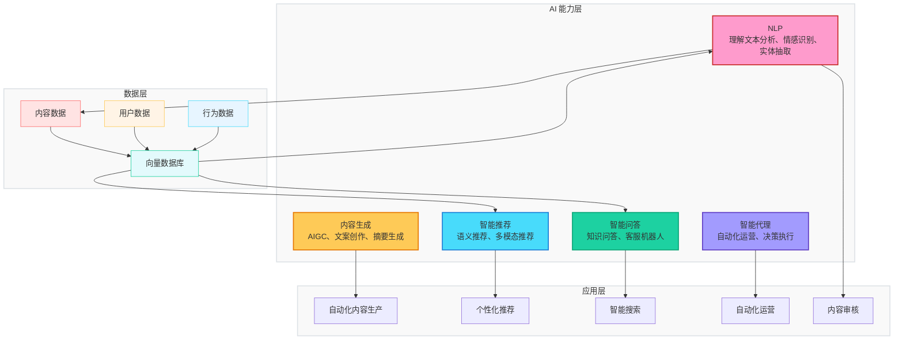
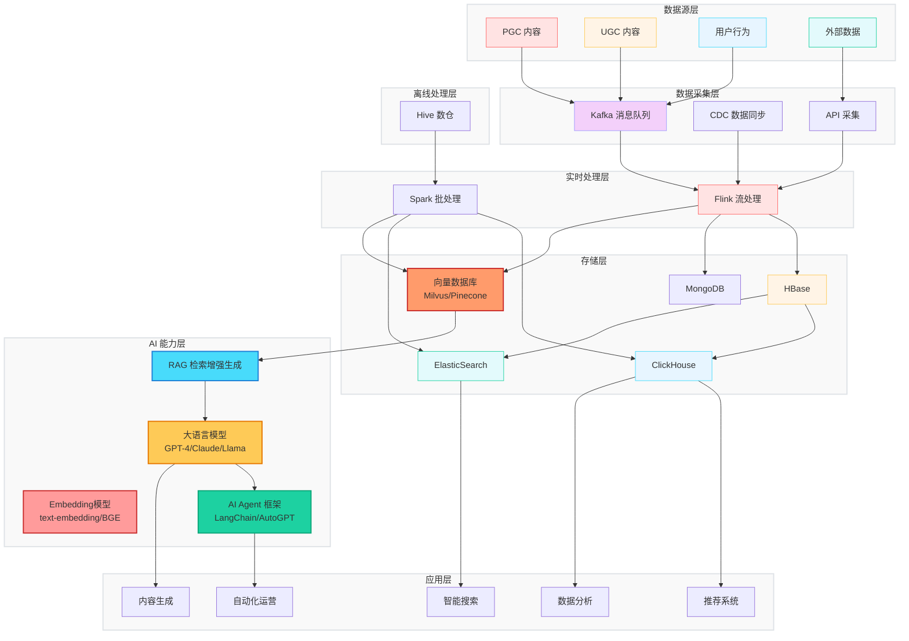
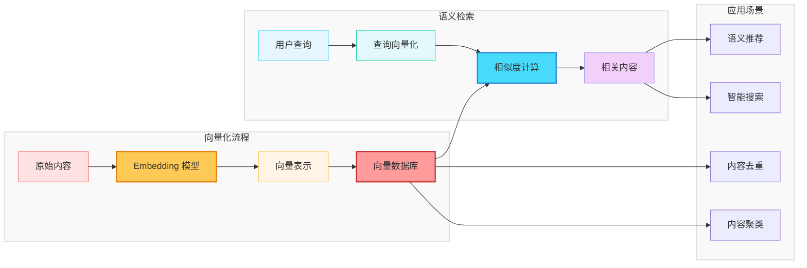
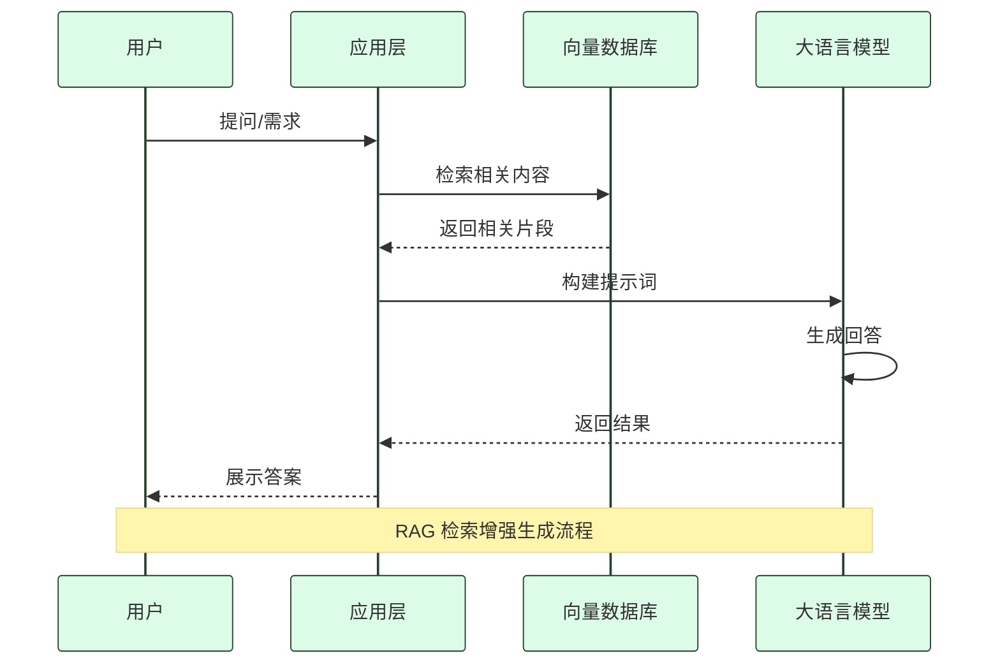
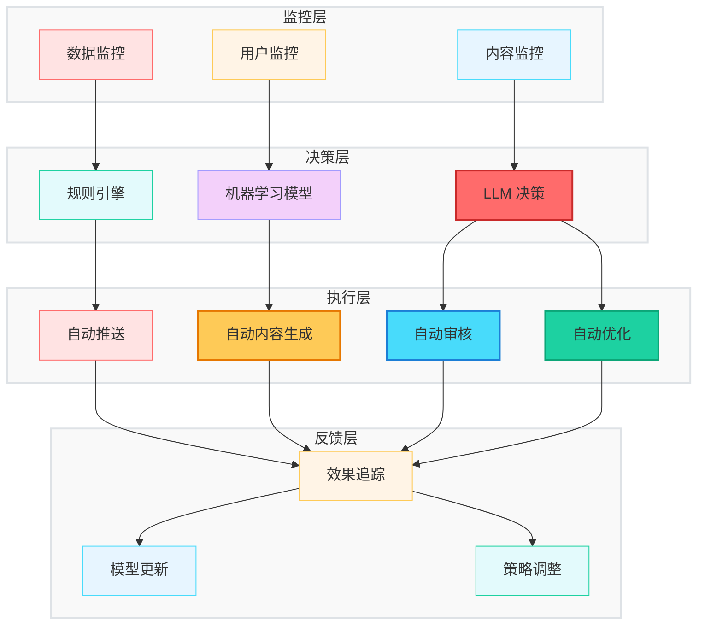

# AI时代，基于大数据驱动的内容运营体系建设

> 内容型的互联网产品，如新闻资讯、内容社区、音乐视频、小说漫画等主要为用户提供内容服务。而庞大的内容离不开运营，运营就是把内容更好地组织聚合，并推送给消费者，让用户享受到更好的服务。AI时代，如何建设基于大数据驱动的内容运营体系呢？

## 人与信息的三个问题


**人与信息的三个问题**

人们关于内容的消费，紧密地围绕三个问题。

1. 信息如何有效产生？

2. 信息如何有效组织整理？

3. 信息如何有效触达消费者？

当这三个问题解决了，一个内容产品才能够得以生存和发展。今天我们主要针对第二和第三个问题来展开讨论，即数据如何有效组织和整理，以便于更好地触达消费者。

## 数据、信息、人的关系

内容主要是指对人们有用的信息，包括资讯、音视频、文章、书籍等等，不同的平台有不同的内容，不同的人们需要不同的内容。因此，数据、信息、人构成了我们要讨论问题的三个基本要素，以下是它们的关系图。


**数据、信息、人三者关系**

数据有很多种产生方式，比如专业的生产者PGC，包括记者、作家、导演等；比如普通UGC用户，以及介于两者之间的小型专业创作者PUGC。数据来源也有很多，比如这种供用户消费的内容数据；也有用户通过浏览观看产生的行为数据；还有各种抓取、共享和挖掘来的数据等。

数据通过加工和整理才能成为有用的信息，有用的信息才是内容，而内容只有经过一定方式让用户消费才能真正产生价值。不同的数据加工成信息的方式不同，大多加工是对原始数据进行整理和包装，再进行关联聚合。数据触达用户的方式通常是推荐和分发，以及用户主动的搜索和浏览行为。

## 数据分类

数据有很多种类。这里主要分为两大类，第一类是内容本身的数据，即基础属性数据和特征信息数据，另一类是内容消费所产生的行为数据，包括用户浏览行为和内容消费行为等。具体如下图。


内容数据可以划分为实体数据和关联数据，以及结构化或非结构化数据等。行为数据包括用户行为和内容消费数据，大多是结构化的，主要来自数据投递以及系统日志等。通过对内容和行为这两类数据的特征分类计算，可以得到内容画像和用户画像。当拥有了这两个画像之后，我们就可以针对画像进行圈层关联。推荐算法就是将这两种圈层最优地匹配起来，即将特定的内容分发给特定的人或人群。

**AI 时代的数据分类补充**：

随着 AI 技术的发展，数据分类也迎来了新的维度：

- **向量数据**：通过 Embedding 模型将文本、图像、音频转换为向量表示，用于语义检索和相似度计算
- **多模态数据**：包括图像、音频、视频等非文本数据，通过多模态模型进行理解和处理
- **知识图谱数据**：实体、关系、属性等结构化知识，用于增强推荐和问答的准确性
- **提示词数据**：用于与 LLM 交互的提示词模板和上下文信息

这些新型数据类型为 AI 驱动的内容运营提供了更丰富的语义理解和更精准的匹配能力。

## 内容与运营关系

内容离不开运营，再好的内容如果不去包装或者没有触达给用户，那么内容就会沉寂。互联网时代里，酒香还真怕巷子深。因为数据大爆炸，内容太多了。人们面对这么多内容，不知道该何去何从。因此，良好的内容运营就至关重要。以下是关于内容的运营方式，包括基于内容的产品运营、市场运营、用户运营、活动运营等。


这里主要针对的是与内容实体相关的运营，也就是对资讯文章、音视频等内容进行整理组织和推送分发等产品内的运营，不是指面向自媒体时代的内容营销。

## 内容运营结构关系

内容运营有很多方式，总体上可以分为基础运营和高级运营、智能运营等。这些运营的前提是内容基础数据的建设。


内容数据建设，主要是基础信息描述与属性特征库。基础运营分为站内和站外运营，站内运营主要是根据自身产品特点，提供内容不同展现的方式，比如首页、分类页、频道页，让用户能够找到想要看的内容。高级运营是在基础运营之上的增强手段，帮助用户更便捷地浏览信息，提升用户体验和增加黏性。智能运营是高级运营的升级版，主要是基于大数据驱动，通过对用户行为与内容特征的计算分析，进行个性化推荐。

## 运营模块体系

内容有很多种运营方式，产品就有很多种运营的模块体系。通过这些模块体系来实现各种运营途径，以让内容更便捷地触达消费者。


随着大数据和智能技术的发展，自动化、智能化、机器替代人工的事情越来越多。在内容运营领域也一样，工具会帮助人们提升对内容组织的加工效率，同时人工智能也会通过对内容和用户特征的计算分析，让内容与用户实现最佳匹配，从而让内容更好地被用户消费。

**AI 驱动的运营模块**：

在传统运营模块基础上，AI 技术催生了新的智能化运营模块：

- **智能内容生产模块**：基于 LLM 自动生成标题、摘要、文案、多语言翻译等，可大幅提升内容生产效率
- **智能审核模块**：利用 NLP 和图像识别技术自动识别违规内容，降低人工审核成本
- **智能推荐模块**：基于语义理解和向量检索，提供更精准的个性化推荐
- **智能搜索模块**：支持语义搜索和对话式搜索，提升用户查找内容的体验
- **智能客服模块**：基于 RAG 技术构建知识问答系统，自动回答用户问题
- **自动化运营模块**：AI Agent 自动执行内容分发、活动策划、用户触达等运营任务

这些 AI 驱动的模块与传统模块协同工作，形成更加智能、高效的内容运营体系。

## 数据驱动与大数据驱动

数据与大数据驱动运营都基于数据，本质上也都是为了让用户享受到更精准内容服务。数据驱动主要是分析内容信息被消费的情况，比如点击量以及停留时长，从而推断出热度以及流行趋势等，这将有助于人工做出合理的决策。大数据驱动也需要分析内容消费的情况，所不同的是大数据还需要分析用户行为和内容特征，并将内容和用户做最优匹配，从而实现最佳的消费效果。

  


**数据驱动与大数据驱动**

数据驱动通常适合那些高质量的精品内容，这些内容更加适合以人工为主的运营，像电视、报刊、门户网站、长视频等都是这种模式。而大数据驱动更适合那些内容丰富的泛娱乐内容，像微博、头条、短视频等，这些站点内容量巨大、质量层次不齐，更适合机器来做基于用户特点的个性化推荐和分发。不同的场景适合不同的方案，数据驱动和大数据驱动这两者并没有优劣之分，在实际场景中通常也都是结合来使用。

**从大数据驱动到由AI驱动**：

随着大语言模型和生成式 AI 的兴起，内容运营进入了第三种模式——AI 驱动：

- **AI 驱动的特点**：不仅分析用户行为和内容特征，还能深度理解内容语义、自动生成内容、实现智能对话交互
- **适用场景**：内容量巨大、需要高度个性化、实时性要求高的场景，如智能推荐、智能搜索、智能客服等
- **与大数据驱动的区别**：大数据驱动主要基于统计分析和协同过滤，AI 驱动则基于语义理解和生成能力
- **三者关系**：数据驱动、大数据驱动、AI 驱动并非相互替代，而是互补关系，在实际运营中往往结合使用

AI 驱动代表了内容运营的未来方向，但需要结合具体业务场景和成本效益来选择合适的方案。

## 大数据架构实时方案

基于数据还是大数据驱动都离不开数据仓库的建设。数仓包括数据采集、存储、处理和查询应用等。

以下是一整套大数据架构的实时方案，数据来源有Hive和DB或直接监听Kafka消息等，经过ETL和Flink等对实时流的处理，我们把数据存储在HBase或MongoDB，再把数据同步到ClickHouse或ElasticSearch查询引擎，这样应用层则通过查询引擎的语法来进行查询和计算了。


**大数据架构实时方案**

当然实时的大数据方案有很多种，不同的场景也有方案和选型的差异。这里只是提供大数据架构的基本方案，就不具体展开细节介绍了。有了一套大数据实时方案，再加上已有的用户画像和内容画像，那么我们就可以基于用户行为进行实时内容匹配计算了，从而实现实时的用户个性化分发和推荐。

**AI 时代的大数据架构**：

在传统大数据架构基础上，AI 驱动的内容运营新增了以下能力：

- **向量数据库**：如 Milvus、Pinecone、Weaviate 等，用于存储和检索向量数据，支持语义级别的内容匹配
- **Embedding 服务**：将文本、图像、音频转换为向量表示，为向量数据库提供数据源
- **大语言模型服务**：如 GPT-4、Claude、Llama 等，提供内容生成、语义理解、智能问答等能力
- **RAG 框架**：检索增强生成框架，结合向量检索和 LLM 生成，提供准确的问答服务
- **AI Agent 框架**：如 LangChain、AutoGPT 等，实现自动化运营任务的编排和执行

这些 AI 组件与现有的大数据架构无缝集成，共同构成 AI 驱动的内容运营基础设施。

## 大数据架构离线方案

有了实时方案，还需要大数据离线方案，这将便于我们构建用户特征库和内容特征库。实时方案面向的是实时性的数据计算，主要基于秒、分钟和小时级，便于实时数据计算，快速做出决策。而离线方案则基于天数来进行计算，离线方案更适合做用户画像、内容画像，以及数据大盘和数据报表等，有助于构建用户圈层和内容圈池。通过对于存量数据的挖掘分析，我们还可以发现更多的商业价值。

  


**大数据架构离线方案**

离线方案主要是对原始数据进行层层清洗处理，并建立不同层级基础特征、行为主题和业务场景表，并将相关表导入到Kylin、Impala、Pilot或Druid等查询引擎中，上层应用则通过查询引擎来实现对于数据的查询和计算。离线大数据方案也有很多种，这里给出的也只是一种参考，具体哪一种方案要根据实际的业务场景。

**AI 时代的离线方案**：

在传统离线方案基础上，AI 驱动的内容运营新增了以下离线处理能力：

- **向量数据构建**：离线批处理将历史内容通过 Embedding 模型转换为向量，批量导入向量数据库
- **知识图谱构建**：从内容中抽取实体和关系，构建领域知识图谱，为推荐和问答提供知识支持
- **模型训练数据准备**：准备用于训练和微调 LLM 的数据集，包括高质量内容、用户对话数据等
- **提示词工程数据**：构建和管理提示词模板库，优化与 LLM 的交互效果
- **效果评估数据**：收集 AI 模型的输出效果数据，用于模型优化和策略调整

这些离线处理能力为 AI 驱动的实时应用提供了坚实的数据基础。

## AI 驱动的大数据内容运营新范式

随着大语言模型（LLMs）和生成式 AI 的快速发展，内容运营正在进入一个全新的时代。传统的大数据驱动主要基于统计分析和协同过滤，而 AI 驱动则能够理解内容语义、生成个性化内容、实现智能对话交互，大幅提升运营效率和质量。

### AI 在内容运营中的核心能力



### 大语言模型在内容运营中的应用场景

#### 1. 智能内容生产（AIGC）

大语言模型能够自动化生成各类内容，大幅提升内容生产效率：

- **标题生成**：基于内容自动生成吸引人的标题，支持多风格（标题党、专业风、情感向等）
- **摘要生成**：自动提取文章核心内容，生成简短摘要，提升用户浏览效率
- **文案创作**：根据产品特点和目标用户，自动生成营销文案
- **多语言翻译**：实现内容的快速多语言转换，支持全球化运营
- **内容改写**：对已有内容进行改写，避免重复，增加内容多样性

**代码示例**（使用 LLM API 进行标题生成）：

```python
import openai

def generate_titles(content, num_titles=5):
    """基于内容生成多个标题"""
    prompt = f"""
    请为以下内容生成 {num_titles} 个吸引人的标题，要求：
    1. 标题要简洁有力
    2. 引起用户兴趣
    3. 符合内容主题
    4. 12个字以内
    5. 由人名+动作组成
    
    内容：{content}
    
    请直接输出标题列表，每行一个标题：
    """
    
    response = openai.ChatCompletion.create(
        model="gpt-5",
        messages=[{"role": "user", "content": prompt}],
        temperature=0.8
    )
    
    titles = response.choices[0].message.content.strip().split('\n')
    return titles
```

#### 2. 语义理解与内容画像

传统的内容画像主要基于关键词和标签，而 LLMs 能够深度理解内容语义：

- **主题识别**：自动识别文章主题、分类、领域
- **情感分析**：分析内容的情感倾向（正面、负面、中性）
- **实体抽取**：提取内容中的关键实体（人名、地名、机构名等）
- **关系抽取**：识别实体之间的关系，构建知识图谱
- **质量评估**：评估内容的质量、原创性、可读性

**代码示例**（使用 LLM 进行内容分析）：

```python
def analyze_content(content):
    """深度分析内容特征"""
    prompt = f"""
    请对以下内容进行深度分析，输出 JSON 格式结果：
    {{
        "theme": "内容主题",
        "category": "内容分类",
        "sentiment": "情感倾向（正面/负面/中性）",
        "entities": ["实体1", "实体2"],
        "quality_score": 0.95,
        "readability": "可读性评分"
    }}
    
    内容：{content}
    """
    
    response = openai.ChatCompletion.create(
        model="gpt-4",
        messages=[{"role": "user", "content": prompt}],
        temperature=0.3
    )
    
    import json
    return json.loads(response.choices[0].message.content)
```

#### 3. 智能推荐系统

基于 LLMs 的语义推荐能够超越传统的协同过滤：

- **语义匹配**：基于内容语义而非关键词进行匹配
- **多模态推荐**：结合文本、图像、音频等多模态信息
- **上下文感知**：理解用户当前上下文，提供更精准的推荐
- **可解释推荐**：生成推荐理由，提升用户信任度
- **冷启动解决**：通过内容理解解决新内容冷启动问题

#### 4. 智能搜索与问答

传统搜索基于关键词匹配，AI 驱动的搜索能够理解用户意图：

- **语义搜索**：理解用户查询意图，返回相关内容
- **问答系统**：直接回答用户问题，而非返回链接列表
- **对话式搜索**：通过多轮对话逐步明确用户需求
- **知识检索**：基于知识图谱提供准确答案

#### 5. 自动化运营

AI Agent 能够自动化执行运营任务：

- **内容分发**：根据用户画像自动选择分发渠道
- **活动策划**：基于数据分析自动策划运营活动
- **用户触达**：个性化推送消息，提升转化率
- **效果监控**：实时监控运营效果，自动调整策略

### AI 增强的大数据架构



### 向量数据库在内容运营中的作用

向量数据库是 AI 时代大数据架构的核心组件：



**向量数据库的核心能力**：

1. **语义检索**：基于向量相似度进行语义级别的内容检索
2. **内容去重**：通过向量相似度识别重复或相似内容
3. **内容聚类**：基于向量空间进行内容自动分类和聚类
4. **推荐增强**：为推荐系统提供语义级别的匹配能力
5. **RAG 基础**：为检索增强生成提供知识库支持

### RAG（检索增强生成）在内容运营中的应用

RAG 结合了检索和生成的优势，是当前 AI 应用的主流架构：



**RAG 在内容运营中的具体应用**：

- **智能客服**：基于内容库回答用户问题
- **内容推荐理由**：生成推荐内容的详细理由
- **个性化摘要**：根据用户偏好生成个性化内容摘要
- **知识问答**：基于平台内容构建知识问答系统
- **内容辅助创作**：检索相关内容辅助创作者创作

### AI 驱动的运营自动化

AI Agent 能够实现运营流程的自动化：



### AI 时代的数据治理

AI 模型的效果高度依赖数据质量，因此需要更严格的数据治理：

- **数据质量监控**：实时监控数据质量，及时发现异常
- **数据标注**：构建高质量的数据标注体系
- **数据血缘**：追踪数据来源和流转过程
- **数据安全**：保护用户隐私，确保数据合规
- **模型监控**：监控模型性能，及时发现模型衰退

### AI 驱动内容运营的最佳实践

1. **渐进式引入**：从单一场景开始，逐步扩展 AI 应用范围
2. **人机协同**：AI 辅助人工决策，而非完全替代
3. **持续优化**：基于效果反馈持续优化模型和策略
4. **可解释性**：保证 AI 决策的可解释性，提升信任度
5. **成本控制**：合理选择模型规模，平衡效果与成本

## 总结

本篇介绍了AI时代下，基于大数据驱动的内容运营体系。包括内容数据的来源、种类以及内容运营的不同方式，同时也介绍了基于数据驱动与基于大数据驱动的内容运营的差异，最后给出了大数据的实时和离线方案。此外，还探讨了AI时代下大数据内容运营新范式，包括：

- **AI 在内容运营中的核心能力**：NLP 理解、内容生成、智能推荐、智能问答、智能代理
- **LLMs 的应用场景**：智能内容生产（AIGC）、语义理解与内容画像、智能推荐系统、智能搜索与问答、自动化运营
- **AI 增强的大数据架构**：在传统大数据架构基础上，加入向量数据库、大语言模型、RAG、AI Agent 等组件
- **向量数据库的作用**：语义检索、内容去重、内容聚类、推荐增强、RAG 基础
- **RAG 架构应用**：智能客服、内容推荐理由、个性化摘要、知识问答、内容辅助创作
- **AI 驱动的运营自动化**：监控层、决策层、执行层、反馈层的完整闭环
- **AI 时代的数据治理**：数据质量监控、数据标注、数据血缘、数据安全、模型监控

现在，我们对数据驱动和 AI 驱动的内容运营有了基本的了解。具体的数仓建设、数据内容特征建设、内容画像建设、用户行为分析、用户画像建设、智能推荐和分发算法，以及 AI 模型的选型、向量数据库的部署、RAG 系统的实现等，将在后续章节中详细分析讨论。

## 下载：基于大数据驱动的内容运营.pptx

链接: <https://pan.baidu.com/s/1ucI4zlHuAtc6BOTPMAwHeg?pwd=data> 提取码: data

本文仓库地址：[https://github.com/microwind/design-patterns](https://github.com/microwind/design-patterns)