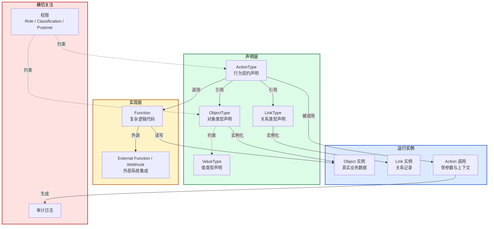
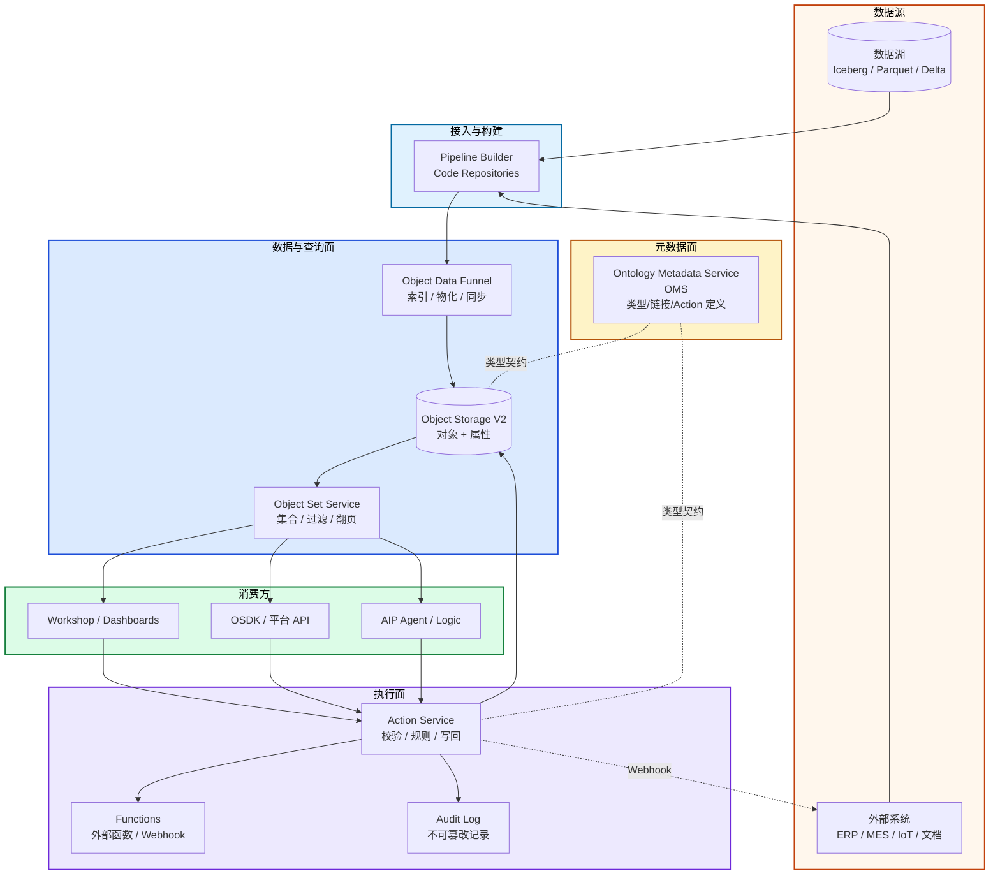
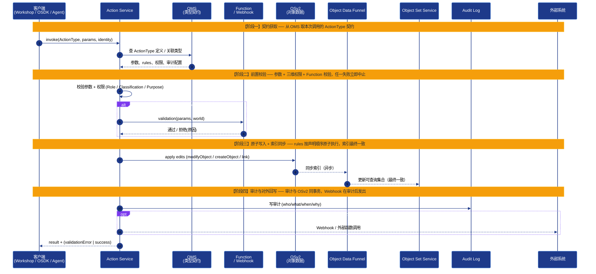
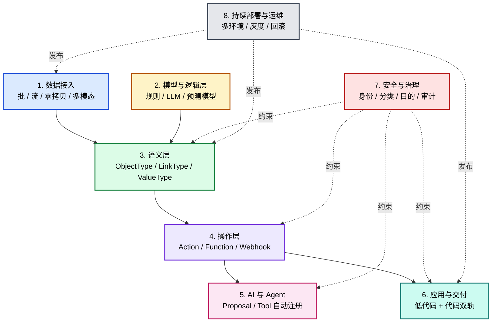
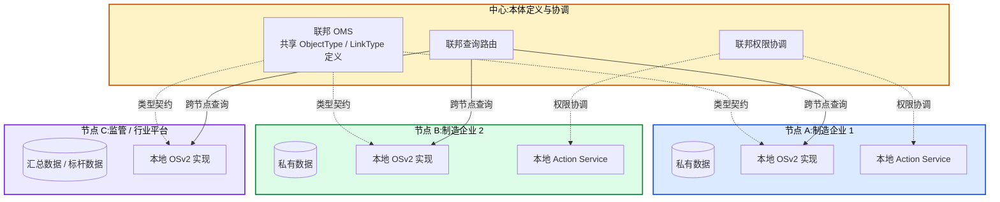

# AI时代，基于Ontology本体论的大数据底层结构分析

> 本文面向架构师、数据工程师、AI 应用开发者。讨论的问题是：在企业 AI 大量落地的今天，Palantir 这家公司被反复提及，背后并非它的模型能力，而是它二十年来构建的一种底层数据结构——Ontology（本体）。本文探讨究竟什么是Ontology，其原理机制是什么？

---

## 引言：企业大模型AI落地的"语义鸿沟"

最近两年，大模型如火如荼，可仅仅是在互联网行业里面自循环，并没有走出自己的圈子，去为实体产业赋能，提升工业界的智能化水平。这是因为做企业AI应用的团队大多遇到过这一类问题：

模型在 Demo 里能写邮件、能查文档、能调工具，一接到真实业务系统就开始出错——用错系统、改错数据、写错单据。RAG、Function Calling、MCP 一项不少，结果还是差最后一公里。

把失败案例拆开来看，原因并非模型能力不行，而是**模型与底层数据之间隔着一层"语义鸿沟"**：

- 数据库里有一张 `vehicle_part` 表，模型只看到字段名，看不出"这条记录代表的零件是必装还是可选"；
- 应用代码里写着 `if (inventory.hasAllParts() && line.isAvailable()) startProduction(...)`，模型看不到这条规则，除非你把它喂进 prompt；
- 权限规则散落在网关、注解、中间件里，模型即便能改，也不知道"它现在到底有没有权改"；
- 当模型决定要"开工生产"时，它能调用的不是一个带业务约束的 Action，而是一组抽象 SQL/REST API。

鸿沟的本质，是**数据结构没有表示出业务语义与行为要求**。Palantir 用 Ontology 解决了这个问题——让数据结构本身含有语义、行为、权限和审计，让人和 AI 在同一个语义层里读、想、做，AI能够真正理解数据了。

Palantir从2003年就开始这么做了，非常超前，那时候人们看不到这么做的好处。到了2025年，一下子就成了实业界AI应用的数据标准。

---

# 第一篇　认知篇：重新定义Ontology

## 1.1 Ontology 不是什么——三个常见误读

对于什么是Ontology 的讨论，有三个误读。我们先把这三个误读讲清楚，然后再讨论Ontology究竟是什么。

### 误读一：Ontology ≈ 图数据库（Neo4j / JanusGraph）

这是最常见的混淆。看到"对象 + 链接"就联想到节点和边，进而以为 Palantir 用的是图数据库。

事实是：Palantir Foundry 的对象数据**坐落在数据湖**（Iceberg / Parquet 等列存格式）里。它的后端是由若干服务组成的：

- **Ontology Metadata Service（OMS）**：管理类型定义；
- **Object Storage V2（OSv2）**：管理对象数据；
- **Object Set Service（OSS）**：管理集合查询；
- **Object Data Funnel**：管理索引与同步；
- **Action Service**：管理写回与审计。

呈现给人和 AI 的"图"，是**逻辑层的语义结构**，而不是底层存储的结构。这样区分的好处是——**任何团队都可以用关系库、列存、数据湖，甚至图库的组合来实现 Ontology**，关键不在底座是什么，而在上层语义结构与运行时契约。

### 误读二：Ontology ≈ DDD 的富血模型 / 聚合根

DDD（领域驱动设计）的富血模型，是把行为写进实体类的方法里：`vehicle.startProduction(...)`。这是面向对象编程范式。

Palantir 的 ActionType **不是挂在对象上的方法**，而是**独立声明的、平台级的类型**。一个 ActionType 可以同时操作多个对象、多条链接，可以被不同的 UI、不同的 Agent 共用。

Ontology与DDD对应关系是：

| DDD 概念 | Ontology 概念 |
|---|---|
| 实体 / 聚合根 | ObjectType |
| 实体之间的关系 | LinkType |
| 应用服务 / 命令入口 | ActionType（多带一层结构化的参数、规则、权限、审计契约） |
| 领域服务 | Function |

可以说，Ontology 与 DDD 思想一脉相承，但它把 DDD 里**主要靠代码表达的建模结果，搬到了声明式、运行时化、可被 AI 直接消费的平台层**。

### 误读三：Ontology ≈ Knowledge Graph（知识图谱）

知识图谱强调"三元组 + 推理"——RDF / OWL / SPARQL、本体推理、可推导事实。它的核心目标是**回答问题**。

Palantir 的 Ontology 强调"对象 + 链接 + 行为 + 权限 + 运行时"——它的核心目标是把数据与行为**写回现实**。

Knowledge里的"Ontology"是学术意义上的本体论（concept / class / axiom），而 Palantir 的"Ontology"借用了这个词，但在产品语境里更接近一个全新概念——**Business Operating Model（业务运行模型）**。

> **两者区分**：知识图谱让你"知道得更多"，Ontology 让你"做得更对"。

## 1.2 三层数据建模演进

工程界对"如何组织企业数据"的认知，大致经历了三层演进：

| 层级 | 本体观 | 技术代表 | 主要能力 | 典型短板 |
|---|---|---|---|---|
| **L1** | 对象中心 | ER 模型 / OOP / 关系库 | 描述实体、字段、属性 | 关系语义弱，行为散落在应用层 |
| **L2** | 对象 + 关系 | Graph / Knowledge Graph | 表达复杂关系和路径 | 仍偏静态，缺动作与权限运行时 |
| **L3** | 关系 + 行为 + 约束 | Palantir Ontology | 对象、关系、动作、权限、审计 | 平台依赖度高、迁移成本高 |

三层是叠加关系而非替代关系——L3 仍然依赖 L1 的关系数据底座、L2 的图查询能力。它的关键差异在于多了一个维度：**把"业务该如何运行"也作为一等公民写进了数据结构里**。

如果用一句话概括三层：

- L1：数据库描述世界**有什么**
- L2：知识图谱描述世界**如何关联**
- L3：Ontology 描述世界**如何运行**

L3 已经不再是单纯的"数据建模"，而是"业务运行建模"。这也是 Palantir 不太愿意把 Foundry 称为"数据平台"的原因——它的官方表述更接近"决策的运行时"。

## 1.3 哲学背景：为什么叫 Ontology

"Ontology"出自哲学里的"本体论"，关心两个问题：**世界上有什么？这些东西如何存在？**

哲学上有两条路径：

- **实体本体论（Substance Ontology）**：世界由"对象/实体"构成，关系是附属的——对应到工程，就是 ER 模型与面向对象编程；
- **关系/过程本体论（Relational / Process Ontology）**：世界本质是"关系 + 过程 + 变化"，对象是关系网络中的稳定节点——对应到工程，就是图模型、分布式系统状态模型，以及 Palantir Ontology。

现代物理对此提供了一个参考视角：粒子不是孤立物体，而是场的激发；引力不是简单的"力"，而是时空结构本身；系统的状态由相互作用决定，而不是由孤立对象的属性决定。

工程系统也类似。企业里真正重要的，往往不是某张表或某个对象本身，而是：

- 对象之间的**关系**（这个零件是哪些车型必需的？）；
- 对象的**状态变化**（这条产线现在能不能开？）；
- 谁能**执行**什么动作（生产经理能不能下达开工指令？）；
- 动作之后如何**追踪**（万一车辆出问题，能不能反查到执行者？）。

这些"关系、变化、动作、追踪"，传统数据模型不直接表达，要靠应用层补。Palantir Ontology 做的事，是把这些原本散落在应用代码里的业务语义，统一抬升到数据结构层面，形成一种**"可执行的现实模型（Executable Model of Reality）"**。

## 1.4 工程化定义

经过上面的辨析，可以给 Ontology 一个更工程化的定义：

> **Ontology 是一种声明式、平台化、可执行的业务运行模型，用于统一表达：**
>
> - 世界中**有什么**（Objects / ObjectType）；
> - 它们**如何关联**（Links / LinkType）；
> - **在什么条件下**可以发生**什么行为**（Actions / ActionType）；
> - 哪些行为受到**什么约束**（Permissions / Classifications / Audits）。

三个修饰词说明：

- **声明式（Declarative）**：以结构化配置而非命令式代码表达，平台读取后自动落实约束；
- **平台化（Platform-level）**：跨应用、跨用户、跨 Agent 共享的一层，而不是某个应用的内部概念；
- **可执行（Executable）**：不只是描述，能驱动真实变更并写回业务系统。

Ontology 不替代人、规则引擎或 LLM 做最终决策，但它提供了**决策发生的语义环境与执行载体**。

这是不是很像一种带有数据描述和行为交互的行业数据的DSL，通过这样的定义，可以构建出能表示具体业务场景的数据来。

---

# 第二篇　结构篇：Ontology 数据结构深度剖析

**基于Ontology的数据结构到底长什么样？**

我们使用一个例子来说明：**汽车制造系统**。它简单到几句话能说清，又复杂到能展示 Ontology 的每一个核心概念。

> 本文中 JSON / TypeScript 都是**解释性伪代码**，目的是说清各类型的语义，并非 Palantir 官方配置字段或 SDK 语法的原样。

## 2.1 ObjectType：带语义的对象声明

`ObjectType` 是 Ontology 中最基础的类型——它对应业务世界中的一个实体类别（车辆、零件、产线、订单、病人、油井……）。

```json
{
  "ObjectType": "Vehicle",
  "displayName": "车辆",
  "description": "一台正在生产或已下线的车辆个体",
  "primaryKey": "id",
  "properties": {
    "id":     { "type": "string",  "searchable": true },
    "model":  { "type": "string" },
    "status": { 
      "type": "enum", 
      "values": ["PLANNED", "IN_PRODUCTION", "DONE"],
      "description": "生产状态"
    },
    "plant":  { "type": "string", "valueType": "PlantCode" },
    "vin":    { "type": "string", "format": "vin-17" },
    "scheduledStartAt": { "type": "timestamp" },
    "exteriorPhoto": {
      "type": "mediaReference",
      "mediaTypes": ["image/jpeg", "image/png", "video/mp4"],
      "maxSize": "10MB",
      "description": "车辆外观照片或视频，用于质检或人审"
    }
  }
}
```

这条声明和典型的"建表语句"有几个关键不同：

1. **`description` 是一等公民**：每个对象、每个字段都自带业务语义注释，平台和 LLM 都能读到，而非写在代码注释里靠人工同步；
2. **`enum` 不只是数据类型**：它声明的是"这个字段的合法取值有限且可枚举"，UI 自动生成下拉框、API 自动校验、Agent 自动理解可能的值；
3. **`valueType` 是值类型扩展机制**：`PlantCode` 不是字符串，而是一个独立的"值类型"，可以挂上"必须是已注册工厂代码""必须经过编码校验"等约束，避免"一个字段含义各说各话"；
4. **`mediaReference` 把图像、视频纳入对象属性**：供视觉模型或人审使用，不需要再单独建一套媒资系统；
5. **没有 `CREATE INDEX` 这一步**：检索能力（`searchable: true`）是声明出来的，由 Object Data Funnel 在底层自动维护索引。

一句话概括：**ObjectType 声明"业务世界里有这么一类东西，它长这样、有哪些合法状态、要被怎么搜索"。**

## 2.2 LinkType：让关系成为一等公民

这是 Ontology 与传统关系库**差异最大**的地方。

传统关系库里，"关系"由外键和连接表表达：

```sql
CREATE TABLE vehicle_part (
  vehicle_id VARCHAR REFERENCES vehicle(id),
  part_id    VARCHAR REFERENCES part(id),
  PRIMARY KEY (vehicle_id, part_id)
);
```

这张表只是"两个 ID 凑在一起的物理事实"。它**不告诉系统**：

- 这条关联代表的零件是必装还是可选？
- 数量是1还是4？
- 有没有可替代的零件？
- 这条关联什么时候建立？谁建立的？

要表达这些，必须新增字段或新增表。久而久之，关系语义就散落在五六个字段名里，任何 SQL 查询都得先去问数据字典。

Ontology 把"关系"声明为独立的 `LinkType`：

```json
{
  "LinkType": "REQUIRES_PART",
  "displayName": "需要零件",
  "description": "车型在标准 BOM 下需要的零件清单",
  "from": "Vehicle",
  "to":   "Part",
  "cardinality": "many-to-many",
  "properties": {
    "mandatory":  { "type": "boolean", "description": "是否必装" },
    "quantity":   { "type": "integer", "min": 1 },
    "substitute": { 
      "type": "array", 
      "items": { "type": "linkRef", "linkType": "Part" },
      "description": "可替代的零件清单"
    },
    "validFrom":  { "type": "timestamp" },
    "validUntil": { "type": "timestamp", "optional": true }
  }
}
```

这个声明带来三个根本性的变化：

1. **关系本身是命名的（Named Relation）**：`REQUIRES_PART` 是一个有业务含义的名字，而不是隐藏在外键命名约定里的"vp 表"；
2. **关系自带属性**：`mandatory`、`quantity`、`substitute` 直接写在关系上，UI / API / Agent 读到的不是一组裸 ID，而是一条结构化的事实；
3. **关系参与权限和审计**：可以为 `REQUIRES_PART` 这条关系单独配置权限——例如"只有研发部门能修改 BOM 关系"。

更重要的是，**沿着 LinkType 的遍历是 Ontology 的原生操作**——不需要写 JOIN，也不需要构造图查询语言，在 OSDK 或 Workshop 里直接表达"给我这辆车需要的所有零件"，平台就会沿 `REQUIRES_PART` 自动遍历。

> 一句话概括：**LinkType 把"关系"从外键升格为带语义、带属性、带权限的一等公民。**

## 2.3 ActionType：可执行的行为契约

这是 Ontology 与传统应用代码差异最大的部分。

传统系统里，"业务行为"写在 Service 层：

```java
@PreAuthorize("hasRole('PLANT_MANAGER')")
public void startProduction(Vehicle v) {
    if (!inventory.hasAllParts(v.getModel()))
        throw new BizException("Missing parts");
    var line = lines.findAvailableLine()
        .orElseThrow(() -> new BizException("No available line"));
    line.assign(v);
    v.setStatus("IN_PRODUCTION");
    audit.log("startProduction", v, line);
    notify.send(v.getPlantManager(), "...");
}
```

这段代码本身没问题，但仔细看，你会发现把六件事**搅和在一起**：

1. 权限校验（`@PreAuthorize`）；
2. 前置条件检查（`if (!inventory.hasAllParts...)`）；
3. 副作用编排（`line.assign + v.setStatus`）；
4. 审计日志（`audit.log(...)`，靠开发者记得写）；
5. 通知（`notify.send(...)`，同样靠开发者记得写）；
6. 事务边界（隐式由 Spring 管，不在这段代码里显式表达）。

任何一项写错或漏掉，都可能导致生产事故。更关键的是，**这套规则只在 Java 应用里生效**——如果有另一个 Python 脚本想"开工生产"，就要把这六件事再实现一遍；Agent 想调用，得再封装一套 API；BI 做看板，再写一份 SQL。

ActionType 把这件事一次性解决：

```json
{
  "ActionType": "startProduction",
  "displayName": "开始生产",
  "description": "把指定车辆从 PLANNED 状态推进到 IN_PRODUCTION 状态",
  "parameters": {
    "vehicle": { "type": "ObjectReference", "objectType": "Vehicle" }
  },
  "validation": [
    { "rule": "${allPartsInStock(vehicle)}",     "errorMessage": "Missing parts" },
    { "rule": "${hasAvailableLine(vehicle.plant)}", "errorMessage": "No available line" }
  ],
  "rules": [
    { 
      "type": "modifyObject", 
      "object": "vehicle", 
      "edits": { "status": "IN_PRODUCTION" } 
    },
    { 
      "type": "createLink", 
      "linkType": "ASSIGNED_TO",
      "from": "vehicle", 
      "to": "${selectAvailableLine(vehicle.plant)}" 
    },
    { 
      "type": "emitEvent", 
      "eventType": "PRODUCTION_STARTED",
      "payload": { "vehicleId": "$vehicle.id" }
    }
  ],
  "permissions": {
    "roles": ["PlantManager", "LineSupervisor"],
    "purpose": "production-scheduling"
  },
  "audit": true
}
```

和上面的 Java 代码对照看，几个核心要点：

1. **`parameters` 显式声明输入契约**：UI 自动生成参数表单，API 自动校验，Agent 自动知道要填什么；
2. **`validation` 把前置条件外部化**：`${allPartsInStock(vehicle)}` 是一个 Function 引用，平台执行时调用，失败信息结构化返回——UI 知道哪个按钮要置灰，Agent 知道哪个 Action 当前不可调；
3. **`rules` 把副作用编排外部化**：按声明顺序"原子地"执行，要么全部成功，要么 Action 整体失败，不会出现"状态改了但链接没建"的中间态；
4. **`permissions` 与对象/链接级权限叠加**：Action 自己有一套权限，对象/字段也有一套权限，叠加后才决定"这个用户能不能调用这个 Action"；
5. **`audit: true` 让审计成为合同**：而不是一行容易漏掉的 `log.info(...)`；
6. **同一份声明被所有客户端共用**：Workshop UI、OSDK、平台 API、AIP Agent 都在调用同一个 `startProduction`，业务规则不再分散。

> 一句话概括：**ActionType 是"做这件事需要什么、会带来什么、谁能做、是否留痕"的合同书。**

### `rules` 字段的更多类型

上面只用了 `modifyObject`、`createLink`、`emitEvent`。真实平台里 `rules` 还能表达：

| 类型 | 用途 |
|---|---|
| `createObject` | 创建新对象 |
| `modifyObject` | 修改对象字段 |
| `deleteObject` | 删除对象（通常要求软删 + 审计） |
| `createLink` | 建立新关系 |
| `modifyLink` | 修改关系属性 |
| `deleteLink` | 删除关系 |
| `invokeFunction` | 调用 Function（声明式逃生口） |
| `emitEvent` | 抛事件给下游订阅 |

这些类型可以在一个 Action 内**链式调用**，并通过 `bind:` 让步骤之间引用前一步的结果。下面是一个综合示例：

```json
{
  "ActionType": "holdBatchForRework",
  "description": "把一个批次扣留并发起返工流程",
  "parameters": {
    "batch":      { "type": "ObjectReference", "objectType": "Batch" },
    "reasonCode": { "type": "enum", "values": ["DIM_OUT_OF_TOL","SURFACE_DEFECT","MATERIAL_FAIL"] }
  },
  "rules": [
    { "type": "modifyObject", "object": "batch", 
      "edits": { "status": "ON_HOLD", "heldAt": "$now" } },

    { "type": "createObject", "objectType": "ReworkOrder",
      "values": { "orderId": "${newId('RWO')}", "sourceBatch": "$batch", "reason": "$reasonCode" },
      "bind": "reworkOrder" },

    { "type": "createLink", "linkType": "HAS_REWORK", 
      "from": "batch", "to": "reworkOrder" },

    { "type": "deleteLink", "linkType": "PENDING_SHIPMENT", "from": "batch" },

    { "type": "invokeFunction", "function": "planReworkSteps",
      "args": ["$reasonCode", "$batch"], "bind": "plan" },

    { "type": "modifyObject", "object": "reworkOrder",
      "edits": { "steps": "$plan.steps", "etaHours": "$plan.etaHours" } },

    { "type": "emitEvent", "eventType": "BATCH_HELD",
      "payload": { "batchId": "$batch.id", "reason": "$reasonCode" } }
  ],
  "validation": [
    { "rule": "$batch.status != ON_HOLD", "errorMessage": "批次已处于扣留状态" }
  ],
  "permissions": { "roles": ["QualityEngineer", "PlantManager"], "purpose": "quality-control" },
  "audit": true
}
```

几条经验：

- **声明优先，代码兜底**：能用声明表达的就别写代码（`modifyObject`、`createLink` 是声明式），复杂算法（最优工序、调度、风险评分）才下沉到 Function；
- **`emitEvent` 解耦外部世界**：MES/ERP 订阅事件后再写回，比直接同步调用更稳，也更利于审计与重放；
- **删除默认走审计**：生产环境通常配合软删除（标记 `deletedAt`），硬删要单独权限。

## 2.4 Function：复杂逻辑的代码下沉

声明式表达不了所有逻辑——库存校验、产线调度、风险评分、最优路径求解，这些天然适合用代码写。Ontology 给了它们一个统一的容器：**Function**。

```typescript
// 校验所有必需零件是否到齐
function allPartsInStock(vehicle: Vehicle): boolean {
  const requiredParts = vehicle.links.REQUIRES_PART
    .filter(link => link.mandatory);

  return requiredParts.every(link => {
    const inventory = Inventory.findByPart(link.to.id, vehicle.plant);
    return inventory.stock >= link.quantity;
  });
}

// 选一条当前可用的产线
function selectAvailableLine(plant: string): ProductionLine | null {
  return ProductionLine
    .where({ plant, status: "IDLE" })
    .orderBy("priority", "desc")
    .first();
}
```

Function 的关键性质：

1. **挂在 Ontology 平台里运行**，而非某个应用进程里的私有代码；
2. **可以被多个 Action、多个 UI、多个 Agent 调用**——一处定义，处处生效；
3. **可以读 Ontology 状态，也可以触发 Action**——它是 Ontology 的"实现层"；
4. **可以接入外部系统**：调外部 REST API、查 ERP、抓传感器数据、读地图服务，通过 External Function / Webhook 机制完成。

一句话概括：**ActionType 管"契约和合法性"，Function 管"怎么算出来"。**

## 2.5 Property + Value Type：随数据流动的约束

最后一个常被低估的概念，是**值类型（Value Type）**。

值类型不是 `string` 这种基础数据类型，而是一种"语义类型"：

```json
{
  "ValueType": "PlantCode",
  "baseType": "string",
  "constraints": [
    { "type": "regex", "value": "^[A-Z]{2}\\d{3}$" },
    { "type": "registeredIn", "table": "PlantRegistry" }
  ],
  "displayName": "工厂代码",
  "description": "全集团范围内唯一的工厂标识，格式如 SH001"
}
```

声明完成后，任何字段只要标注 `valueType: "PlantCode"`，就自动具备：

- 输入校验（必须符合正则）；
- 引用完整性（必须在已注册工厂表里）；
- 跨对象一致性（车辆、产线、订单的"工厂"字段都用同一个值类型，防止"PlantCode 含义各说各话"）；
- 显示标签（UI 自动用"工厂代码"作为字段标签）。

这是 Ontology 与"普通数据库 + 应用层校验"的一个关键差异——**约束是随数据流动的**，而不是在每个应用里重复实现。

## 2.6 把这套结构画在一张图上



这张图概括了 Ontology 数据结构的全貌：声明层定义"是什么"和"怎么变"，实现层补充"怎么算"，运行实例承载真实业务数据，横切关注层约束所有访问与变更。

---

# 第三篇　运行篇：Ontology 后端架构与读写路径

理解了数据结构，下一个问题是工程师会关心的：**这套结构在底层是怎么跑起来的？**

## 3.1 后端服务全景

Foundry Ontology 的后端不是单体，而是若干服务协作。下图把它们画在一起：



概括而言：**OMS 管"是什么"，OSv2 + OSS + Funnel 管"在哪、怎么读"，Action Service + Functions 管"怎么改、改完留什么痕"**。

各服务职责快查表：

| 服务 | 角色 | 主要职责 |
|---|---|---|
| **OMS** | 元数据中枢 | 存储 ObjectType / LinkType / ActionType 等所有类型定义；版本化；为下游服务提供"类型契约"查询 |
| **OSv2** | 对象存储 | 存储对象与链接的实际数据；**强制写路径走 Action Service**，不允许绕过 |
| **Funnel** | 索引同步 | 把数据湖的批量数据物化到 OSv2；维护检索索引；支持流式增量 |
| **OSS** | 集合查询 | 提供 ObjectSet 抽象（过滤、排序、翻页、跨类型遍历） |
| **Action Service** | 写回中枢 | 解析 ActionType；校验权限/参数/Function 校验；原子执行 rules；写审计 |
| **Functions** | 逻辑容器 | 复杂业务逻辑；外部 API / Webhook 调用 |
| **Audit Log** | 审计 | 不可篡改的写入记录，与 Action 同事务发生 |

## 3.2 一次读路径

读路径相对简单。客户端（Workshop / OSDK / Agent）发起一次"查找这个工厂里所有 IDLE 状态的产线"：

```
Client → OSS：构造 ObjectSet { type: ProductionLine, where: { plant: "SH001", status: "IDLE" } }
OSS → OMS：查 ProductionLine 的类型契约（哪些字段、权限规则）
OSS → OSv2：根据契约和权限裁剪查询
OSv2 → OSS：返回原始数据
OSS → Client：按用户权限再裁剪一次（字段级），返回视图
```

**关键设计**：

- **类型契约从 OMS 拿**：保证查询不会越过类型定义；
- **权限两次校验**：第一次在 OSv2（对象级），第二次在 OSS（字段级）；
- **结果是 ObjectSet**：不是一个个游标行，而是一个可继续筛选、可继续翻页、可继续遍历链接的"集合句柄"。

## 3.3 一次写路径（Action 调用时序）

写路径是 Ontology 设计最值得细看的部分。一次 `startProduction(vehicle: V1001)` 的完整链路如下：



把这次调用拆成四个阶段去看，会更容易理清"哪一步如果失败、责任落在哪个服务"：

**阶段一：契约获取（步骤 1–3）**

客户端把"要做什么"以三元组 `(ActionType, params, identity)` 提交给 Action Service。Action Service 不在自己进程里硬编码业务逻辑，而是先去 OMS 取一份当次调用对应的契约——参数定义、`rules`、`validation`、`permissions`、`audit` 配置。这一步保证：**任何 ActionType 的版本变更都不需要重启客户端**，OMS 是单一事实来源。

**阶段二：前置校验（步骤 4–6）**

Action Service 在自己进程内连续做三件事：

- 参数类型校验（与 OMS 返回的 `parameters` 比对）；
- 权限校验（Role × Classification × Purpose 三维独立检查，任一不过即拒）；
- 业务前置条件校验（如果 ActionType 配了 Function 形式的 `validation`，调外部 Function 或 Webhook 拿"通过/拒绝"）。

这三步**全部在写之前完成**。任何一步失败，调用直接中止，OSv2 与 Audit 都不会被触碰，客户端拿到的是结构化 `validationError` 而不是部分写入的脏状态。这是后面"审计可信"的前提。

**阶段三：原子写入与索引同步（步骤 7–9）**

校验通过后，Action Service 按 ActionType 中声明的 `rules` 顺序，把 `modifyObject` / `createObject` / `createLink` 等编辑批量提交给 OSv2。OSv2 的语义是**"这一组编辑要么全部成功，要么全部回滚"**——这也是为什么 OSv2 强制写路径走 Action Service，而不允许客户端绕过去直改对象。

写入落地后，OSv2 把变更广播给 Object Data Funnel，Funnel 再把可查询的物化视图更新到 OSS。**这一步通常是异步发生的**——也就是说，Action 返回成功的瞬间，OSS 上的查询结果可能还没刷新到最新。多数业务场景能接受这种"最终一致"，但对"写完立即查"的强一致需求，需要在客户端侧用 OSDK 的强一致读模式或显式等待索引就绪。

**阶段四：审计与对外回写（步骤 10–12）**

数据面变更落定之后，Action Service 写审计日志（who / what / when / why / 参数 / 旧值 / 新值），这一步与 OSv2 的写入处在同一个事务边界内：**只要 OSv2 写成功，审计一定写成功**，不存在"改了但没留痕"的中间态。

最后才是对外回写：如果 ActionType 配了 Webhook 或外部函数（例如同步到 MES / ERP / 工单系统），Action Service 在审计之后才发起这次外调。顺序是有意设计的——内部状态先稳定、先留痕，再去触碰外部世界。否则一旦外部系统先改成功、内部却因审计失败回滚，两边就脱钩了。

整个调用以 `result` 返回客户端，附带成功标识或结构化错误。客户端如果之后还要读最新视图，会再走一次读路径（前一节的 OSS → OSv2）。

---

从这个分阶段流程能提炼出几个工程结论：

1. **校验在 Action Service 内一次性发生**：参数类型、权限、Function 形式的 validation 全部通过后，才会进入数据面修改阶段，失败永远在写之前发生；
2. **所有写都经 Action 路径**：OSv2 不接受"绕过 Action 直改对象"的请求。这意味着——在 Ontology 里，业务变更只有一条路径；
3. **审计是同事务发生的副作用**：而不是事后补记，避免"改成功但审计漏了"的情况；
4. **索引更新是最终一致**：Funnel → OSS 的同步通常异步发生，写完立即查需要使用强一致读路径或等待信号；
5. **对外回写在审计之后**：避免"外部系统改成功，但内部状态没留痕"。

这套设计的工程价值在于：**写入路径的可审计性，从软规范变成了硬约束**。在金融、医疗、国防等监管严格的行业，这是从"我们承诺会留痕"到"留痕不可绕过"的根本提升。

## 3.4 Scenario：写时复制的"沙盒分支"

紧密耦合的系统（供应链、制造车间、战场态势）里，一个小改动会引发级联效应。Palantir 提供的 `Scenario` 原语，可以在不改主线数据的前提下做"假如……"推演：

- 在 Ontology 的一个分支上做修改，相当于在"沙盒宇宙"里预演；
- 分支只存"相对主线 Ontology 的增量"——修改过的对象属性、新建对象、删除对象、新建/删除链接——其余仍共享主线（**写时复制 / Copy-on-Write**）；
- 读路径先看分支增量、再回落主线；分支被丢弃时增量直接抛掉。

工程上的几条要点：

- **隔离写、共享读**：分支只承担"差异部分"，多数对象仍指向主线，性能可控；
- **权限同样生效**：分支里跑的 Action 也走 Role / Classification / Purpose 校验，不会因为是"沙盒"就放宽；
- **Scenario 创建后不可变（immutable），且不会自动合并回主线**：要"修改"一个 Scenario，需要新建一个带不同 Action 集合的 Scenario；
- **要让推演结果落到主线，需要另走一条路**：要么在主线上重新发起对应 Action（Scenario 充当人审/对比用的"草稿"），要么走 **Foundry Branching / Ontology Proposals**——后者才是带 Pull Request 风格审阅与合并的机制；
- **不可作为事务保障**：Scenario 用于推演，不替代数据库事务；高一致性要求的写仍走 Action 主路径。

类比一下：Scenario 之于业务系统，就像 Git 分支之于代码仓库——以极低代价支持"另一条时间线"，让人和 AI 都能在不污染主线的前提下试错。

## 3.5 三维独立的安全模型

"Ontology 内建权限"容易被理解成简单的 RBAC。Palantir 实际上用了**三个独立维度同时校验**，任一维度不通过即拒绝：

| 维度 | 控制对象 | 例子 | 工程上挂在哪 |
|---|---|---|---|
| **Role（角色）** | "你是谁、属于哪个组" | `PlantManager`、`StrikeCellChief`、`J2_Analyst` | 用户 / 组 / 服务账号 → 角色映射 |
| **Classification（分类 / 密级）** | "数据本身的敏感等级" | `UNCLASSIFIED` / `CONFIDENTIAL` / `SECRET` / `TOP_SECRET`，加 `NOFORN` 等警示语 | ObjectType / 字段 / Action / 数据集级别声明 |
| **Purpose（目的）** | "你来做什么用" | `production-scheduling`、`outage-investigation`、`audit-review` | Action / 查询请求时显式声明，平台校验该目的是否被允许 |

举几个具体的检查例子：

| 请求 | 角色检查 | 分类检查 | 目的检查 | 结果 |
|---|---|---|---|---|
| 工厂经理读 `Vehicle.status` | PlantManager ✓ | SECRET ⊆ 用户 SECRET 许可 ✓ | production-monitoring ✓ | 允许 |
| 同一经理读 `Vehicle.lotMargin`（财务字段） | PlantManager ✗（该字段角色受限） | — | — | 拒绝 |
| 审计员读 `Vehicle.status` | Auditor ✓ | SECRET ⊆ 审计员许可 ✓ | audit-review ✓ | 允许（只读） |
| 同一审计员调用 `startProduction` | Auditor ✗（角色不在该 Action 权限内） | — | — | 拒绝 |
| 跨域共享：合作方访问 `Vehicle` | Partner ✓ | 字段含 `NOFORN` ✗ | — | 字段被裁剪，其余可见 |

这套机制的关键价值：

- **维度独立**：加一个角色不会顺带放开密级；
- **字段级**：同一对象可以 `status` 公开、`margin` 敏感分开声明；
- **Purpose 把"我有权限"和"我现在有正当理由用"分开**：事后审计可以按目的查"谁在什么场景下访问了什么"；
- **规则进 Ontology 而不是进应用代码**：所有客户端（Workshop / OSDK / Agent）拿到的视图都已按规则裁剪。

这是 Palantir 在情报、国防、跨机构协作场景能跑起来的关键之一——把"数据不敢共享"的死结从政治问题转化成了技术问题。

---

# 第四篇　AI 篇：从"问表"到"调系统"

到此为止，讨论的都是传统数据系统也能讨论的概念——对象、关系、行为、权限。Ontology 真正的差异化价值，在 AI 接入企业系统的场景下才完整显现。

## 4.1 LLM 接入"表"的根本困境

回到本文开篇的痛点：为什么"LLM + RAG + Function Calling"做企业 AI 总是差最后一公里？

以"开始生产 V1001 这辆车"这个意图为例，分解一下 Agent 必须经历的步骤：

**第一步：Agent 必须先知道有什么**

- 表结构：`vehicle`、`part`、`inventory`、`production_line`、`vehicle_part`……
- Agent 从哪里知道？答：靠人工写的"业务文档" + "API 文档"，喂给 LLM。

**第二步：Agent 必须知道字段含义**

- `vehicle.status` 的合法值是 `PLANNED / IN_PRODUCTION / DONE`，还是 `0/1/2`？
- `vehicle_part.is_required` 这个字段存在吗，还是隐式约定"出现在表里的就都是必装"？
- Agent 从哪里知道？答：业务文档要写得足够细，否则 LLM 会自己编。

**第三步：Agent 必须知道业务规则**

- "开工生产"需要哪些前置条件？
- 哪些条件是硬约束，哪些是警告？
- Agent 从哪里知道？答：业务文档继续加厚。

**第四步：Agent 必须知道权限**

- 当前用户能不能调"开工生产"？
- 即使能调用 Action，能不能改 `vehicle.assigned_line`？
- Agent 从哪里知道？答：要么写一套权限 API 给 LLM 提前查，要么直接信任 LLM——出错就出错。

**第五步：Agent 必须正确编排副作用**

- 改 `vehicle.status` 后，是不是还要改 `production_line.status`？
- 是不是还要发通知？
- 是不是还要写审计？
- Agent 从哪里知道？答：要么封装一个高层 API 把这些细节藏起来，要么让 Agent 调用裸 SQL 自己去碰运气。

可以看出，传统架构下让 LLM 接入企业系统，**核心矛盾在数据层缺少业务语义、权限语义、行为契约**。每一层都要靠应用代码 + Prompt 工程 + 业务文档把"语义"塞回去，每变一次都得重新喂一遍。这条路在 Demo 里能跑通，到了真实企业大概率难以稳定上线。

## 4.2 Ontology 让 LLM "看到"业务

同样的意图，如果底层是 Ontology：

**第一步：Agent 看到的是什么？**

不是表，而是带语义的对象类型：

```yaml
ObjectType: Vehicle
  description: "一台正在生产或已下线的车辆个体"
  properties:
    id: string
    model: string
    status: enum [PLANNED, IN_PRODUCTION, DONE]   # LLM 直接知道有哪些合法状态
    plant: PlantCode                                # 知道这是工厂代码，不是普通字符串
  links:
    REQUIRES_PART → Part (many-to-many)            # 知道这条关系是"需要哪些零件"
      with properties: { mandatory, quantity, substitute }
    ASSIGNED_TO → ProductionLine (many-to-one)
  available_actions:
    - startProduction
    - flagForRework
    - cancelOrder
```

LLM 直接读到对象、属性、关系、可调用动作。语义都在数据结构里，不需要单独的"业务文档"。

**第二步：Agent 知道每个 Action 的契约**

```yaml
ActionType: startProduction
  description: "把指定车辆从 PLANNED 状态推进到 IN_PRODUCTION 状态"
  parameters:
    vehicle: Vehicle
  preconditions:
    - "所有标注 mandatory=true 的 REQUIRES_PART 链接，对应零件库存 ≥ quantity"
    - "对应工厂存在状态为 IDLE 的 ProductionLine"
  effects:
    - "vehicle.status → IN_PRODUCTION"
    - "新建 ASSIGNED_TO 链接到选定产线"
    - "事件 PRODUCTION_STARTED 发出"
  required_roles: [PlantManager, LineSupervisor]
```

LLM 直接看到：输入要什么、前置条件是什么、调用后会改什么、谁能调。

**第三步：Agent 知道当前状态下"能做什么"**

平台会根据当前用户的角色、当前对象的状态，**动态裁剪**出可用 Action 列表。如果当前用户是审计员，LLM 看到的 Action 列表里就没有 `startProduction`，自然不会去调一个调不动的东西。

**第四步：Agent 调用的不是 SQL，不是 REST API，而是 Action**

```typescript
// LLM 生成的代码（实际上是 OSDK 调用）
await Osdk.actions.startProduction({ vehicle: v1001 });
```

平台拿到这个调用后：

- 自动校验权限（不通过就直接拒绝，不会"半执行"）；
- 自动校验前置条件（库存 / 产线）；
- 自动按声明顺序执行所有副作用；
- 自动写审计；
- 失败时返回结构化错误（LLM 能理解"哪一条前置条件挂了"）。

整个过程没有一行代码描述"开工生产的业务流程"——所有信息都在 Ontology 声明里，LLM 直接消费。

## 4.3 Proposal 模式：人机协作的关键设计

Palantir 的 AIP 并没有让 AI 直接改系统。常见落地模式叫 **Proposal**：

1. **AI 代理先生成提案（Proposal）**：基于 Ontology 上下文，提议"我想调用 `startProduction(V1001)`"；
2. **提案呈现给人类操作员**：UI 展示完整上下文——这辆车是什么型号、哪些零件已到、要分配哪条产线、改完之后会发生什么；
3. **操作员审阅、改进、最终决策**：可以直接通过、可以修改参数后通过、可以拒绝；
4. **每个提案生成元数据**：反过来帮代理学习与演进——哪些 Proposal 通过率高、哪些总被改，给后续微调提供信号。

这种设计的几个工程含义：

- **AI 不需要 100% 准确**：只要 Proposal 比从零写代码的人快，就有价值；
- **责任主体清晰**：通过的 Proposal 是"人的决策"，被审计的是人，不是模型；
- **学习闭环天然存在**：每个 Proposal 都是一个标注样本，模型可持续优化。

一句话概括：**Ontology 让 AI 看得懂业务，Proposal 让 AI 能落地业务，Action 让 AI 不会搞坏业务。**

## 4.4 Agent 能力边界：被授权的 Action

这一节强调一个常被忽略的设计：**Agent 拥有的不是 API 列表，而是一组"被授权的 Action"。**

传统 Agent 框架（OpenAI Function Calling、LangChain Tool、MCP……）里，Tool 是开发者手写的、暴露给 LLM 调用的函数。它们的边界是**代码契约**——写多少 Tool，LLM 就能调多少 Tool。

Ontology 里，Agent 的边界是 **Action 契约 × 当前用户的权限**。也就是说：

- 系统里有 100 个 ActionType；
- 当前用户 / Agent 的角色组合，让其中 30 个对它"可见可调"；
- 当前对象的状态，又过滤掉 10 个（比如车已经在生产中，就不能再 `startProduction`）；
- 最终 Agent 看到的"工具栏"里有 20 个 Action。

整个过程没有任何代码改动，动态裁剪由 Ontology 平台在运行时完成。

工程意义在于：

- **新增业务能力**：声明一个新 ActionType，所有 Agent 自动获得新工具；
- **撤回业务能力**：调整角色配置，所有 Agent 立刻失去对应工具；
- **跨 Agent 复用**：同一个 ActionType 可被任意数量的 Agent 共用，不必在每个 Agent 里重写工具描述。

由此，Agent 的能力面变成了**可治理、可演化、可审计**的，而不是一组散在代码里的 Tool 列表。

---

# 第五篇　构建篇：领域大数据系统的实施指南

如果你正在设计或重构某个领域的大数据系统（制造、能源、医疗、金融、政务），这一篇可作为参考。

## 5.1 设计哲学转变：从"以数据为中心"到"以决策为中心"

传统"大数据"系统的设计起点是**数据**：

- 要把哪些数据集中起来？
- 用什么数据湖 / 仓 / 中台？
- 怎么做 ETL、怎么治理、怎么开放？

Ontology 思路的设计起点是**决策**：

- 这个领域里，最关键的几类决策是什么？
- 这些决策依赖哪些对象、哪些关系、哪些状态？
- 决策落地后，要写回哪些系统、留什么痕、谁能复盘？

两种起点导致两种系统：前者通常长成"数据集合"，后者长成"业务运行时"。后者的 ROI 通常更直接，因为它不是"先建好数据再想办法用"，而是围绕特定决策直接建语义层。

实际项目中可以把第一个问题改成：

> **"如果只能先做对一类决策，是哪一类？"**

抓住这一类决策，更容易设计出"瘦"且"有用"的最小可行 Ontology，而不是一上来就把全公司所有对象建模一遍。

## 5.2 八层能力地图

要做同类平台，至少要覆盖下面这八层能力：



各层的关键设计点：

| 层 | 关键设计点 | 常见错误 |
|---|---|---|
| **L1 数据接入** | 批流统一；零拷贝（避免无谓搬运）；原生支持结构化/非结构化/时序/地理空间 | 只做批处理，流场景靠后期补 |
| **L2 模型与逻辑** | 规则、LLM、预测模型统一接入；模型适配器抽象；评估与漂移监控 | 模型与平台耦合，换模型要重写大量胶水 |
| **L3 语义层** | 对象、链接、属性、ValueType；自动生成 SDK / API；语义搜索 | 把"语义层"搞成"另一份数据库表"，没解决业务语义问题 |
| **L4 操作层** | Action 独立设计；细粒度权限；Scenario 仿真；事件外发 | Action 设计成"对象方法"，导致跨对象操作很难表达 |
| **L5 AI / Agent** | Proposal 模式；动态 Tool 列表；Agent 边界由权限决定 | 把 Tool 写死，Agent 能力扩展靠改代码 |
| **L6 应用与交付** | 低代码（业务方自助）+ 代码（工程方深度定制）双轨；OSDK 暴露给外部 | 非黑即白：要么全低代码、要么全代码 |
| **L7 安全与治理** | Role × Classification × Purpose 三维；字段级；全链路加密 | 权限只做角色，密级和目的靠应用层自己想 |
| **L8 持续部署** | 多环境（云 / 本地 / 边缘 / 隔离网）；灰度；版本编排 | 没考虑离线 / 信创环境的发布路径 |

注意：这八层不是必须一次性建完。但**层次顺序很重要**——L3 没建好就上 L5，AI 长期停留在 Demo 水平。

## 5.3 自建简化版 Ontology Layer：技术选型

如果不打算（也不必）自研一整个 Foundry，但想在自己的领域跑通"声明式 Ontology + Action 契约 + AI 调用"的最小闭环，下面是一份基于开源组件的选型参考：

| 能力 | 推荐选型 | 替代选项 |
|---|---|---|
| **元数据管理（OMS）** | 自建（YAML / JSON Schema 仓库） | LinkML、JSON Schema Registry |
| **对象存储（OSv2）** | PostgreSQL + JSONB（轻量） / Iceberg + Trino（中量） | Cassandra、Elasticsearch |
| **链接 / 图查询（OSS）** | PostgreSQL（LATERAL JOIN）/ DGraph / Neo4j | TigerGraph、Memgraph |
| **声明式权限** | OpenFGA、Oso、OPA | Casbin |
| **Action 引擎** | Temporal（工作流引擎） + 自定义校验层 | Camunda、Airflow（差一些） |
| **Function 容器** | Cloudflare Workers / AWS Lambda / 自建 K8s Job | Vercel Functions、OpenFaaS |
| **审计日志** | 不可篡改：Kafka + 冷存（S3 / OSS） | Loki、ClickHouse |
| **事件总线** | Kafka / Pulsar | NATS、RabbitMQ |
| **LLM Agent 接入** | LangChain / LlamaIndex + 自动从 Ontology 生成 Tool 描述 | DSPy、自研 |
| **OSDK（自动生成 SDK）** | 基于 Ontology Schema 用 codegen 生成 TS / Python / Go SDK | gRPC + Protobuf 派生 |
| **低代码 UI（Workshop 替代）** | Retool、Appsmith、Budibase | 自研 |

一个最小可运行 Demo 的搭建顺序：

1. 用 YAML 写 5 个 ObjectType + 3 个 LinkType + 5 个 ActionType；
2. 用 PostgreSQL 存对象与链接；
3. 用 OpenFGA 写权限规则；
4. 用 Temporal 跑 Action 工作流；
5. 用 codegen 生成一份 TypeScript SDK；
6. 用 Retool 接 SDK 做几个面板；
7. 把 Ontology Schema 喂给 LangChain 自动生成 Tool；
8. 用 LangChain Agent 测试调用。

这一套搭起来大约 **2 人 × 4 周**能跑通 Demo。后续要进入生产，重点投入在 L7（安全治理）和 L8（部署运维）。

## 5.4 领域定制：四个行业的设计模板

不同领域的 Ontology 长得不一样。下表把四个典型行业的 MVP 模板放在一起对比，可作为起点：

| 行业 | 核心 ObjectType | 核心 LinkType | 核心 ActionType | 典型 AI 用例 |
|---|---|---|---|---|
| **制造业**<br/>（汽车 / 电子 / 装备） | `Vehicle / Product`（成品）<br/>`Part`（零件）<br/>`BOM`（物料清单，作为对象而非配置）<br/>`WorkOrder`（工单）<br/>`ProductionLine`（产线）<br/>`Operator`（操作员）<br/>`QualityCheck`（质检记录）<br/>`Defect`（缺陷） | `BOM → Part`（含 mandatory / quantity / substitute）<br/>`WorkOrder → Vehicle`<br/>`WorkOrder → ProductionLine`<br/>`QualityCheck → Vehicle`（一对多）<br/>`Defect → Vehicle` | `releaseWorkOrder` 下发工单<br/>`startProduction` 开工<br/>`holdForRework` 扣留返工<br/>`closeWorkOrder` 完工<br/>`recordQualityCheck` 录入质检<br/>`flagDefect` 标记缺陷 | 缺陷归因 Agent（沿 LinkType 反查 Part / Operator / Line / Time）<br/>排产建议 Agent（生成 `startProduction` Proposal） |
| **能源**<br/>（电网 / 油气 / 新能源） | `Asset`（变压器、机组、油井）<br/>`Site`（站点）<br/>`Sensor`（传感器）<br/>`Reading`（读数，时间序列）<br/>`Alarm`（告警）<br/>`WorkOrder`（工单）<br/>`Crew`（检修班组） | `Asset → Site`（多对一）<br/>`Sensor → Asset`<br/>`Reading → Sensor`（时序）<br/>`Alarm → Asset`<br/>`WorkOrder → Asset`<br/>`WorkOrder → Crew` | `acknowledgeAlarm` 确认告警<br/>`dispatchCrew` 派工<br/>`recordMaintenance` 录入维修<br/>`forecastDemand` 预测负荷（调用预测模型） | 告警关联根因分析（沿 Sensor → Asset → Site 关系图遍历）<br/>巡检任务生成 Agent |
| **金融风控** | `Customer`（客户）<br/>`Account`（账户）<br/>`Transaction`（交易）<br/>`Device`（设备指纹）<br/>`Counterparty`（对手方）<br/>`Case`（案件）<br/>`Investigator`（调查员） | `Account → Customer`（多对一）<br/>`Transaction → Account`（一对多）<br/>`Transaction → Counterparty`<br/>`Device → Customer`（多对多）<br/>`Case → Transaction` | `flagSuspicious` 标记可疑<br/>`freezeAccount` 冻结账户<br/>`openCase` 开案<br/>`assignInvestigator` 分派调查员<br/>`closeCase` 结案 | 反洗钱关联 Agent（沿 Customer → Device → Customer 找团伙）<br/>自动 Proposal 冻结账户（强制人审） |
| **医疗**<br/>（HIS / EMR / 药研） | `Patient`（患者）<br/>`Encounter`（就诊）<br/>`Diagnosis`（诊断）<br/>`Medication`（用药）<br/>`LabResult`（检验结果）<br/>`Provider`（医师 / 护士）<br/>`Department`（科室） | `Encounter → Patient`（一对多）<br/>`Diagnosis → Encounter`<br/>`Medication → Encounter`<br/>`LabResult → Encounter`<br/>`Provider → Department` | `prescribeMedication` 开药<br/>`orderLab` 开化验单<br/>`dischargePatient` 出院<br/>`updateDiagnosis` 修改诊断 | 药物冲突检查 Agent（基于 Medication 历史）<br/>临床路径推荐 Agent |

四个模板有一个共性：**核心对象 5–8 个、核心链接 3–6 个、核心 Action 5–10 个**。一个领域 MVP 的 Ontology 不必巨大，但必须精确——这 5–10 个 Action 一旦定义清楚，平台、AI 与人就在同一个语义层里运行。

## 5.5 联邦式 Ontology：数据主权约束下的现实路径

中国市场（以及欧洲）有一个独特约束：数据主权 / 数据出境 / 跨部门壁垒。集中式 Ontology 在这些场景往往跑不通——数据无法离开原系统。

可行思路是**联邦式 Ontology（Federated Ontology）**：



核心设计：

- **中心只有"定义"，不集中数据**：OMS 共享类型定义、LinkType 规范、ActionType 契约；
- **数据留在原节点**：每个企业 / 部门保留自己的数据与算力；
- **跨节点查询由路由层协调**：跨节点 ObjectSet 查询走联邦协议，节点决定要不要响应；
- **跨节点 Action 走双签**：A 节点的对象 Action 影响 B 节点的对象时，需要双方同意；
- **AI 仍可消费整个语义层**：对 Agent 来说，看到的还是一套统一 Ontology，只是某些对象会因权限不可见。

这个方向在国内的数字孪生城市、产业互联网、工业互联网平台上有落地空间。技术原型可以基于：**Iceberg + 联邦查询（Trino / Presto）+ OPA 跨域权限 + 中心化的 OMS**。

---

# 第六篇　实践篇：避坑指南与评估清单

## 6.1 常见陷阱

参考国内若干"对标 Palantir"的项目，下列陷阱较为普遍：

### 陷阱一：把 Ontology 做成"超级 ER 图"

症状：业务方让你建模，你就把所有的表搬到 Ontology 里，还增加了几条链接。

后果：用了一年，发现 Ontology 还是只有"对象和关系"，没有 Action、没有权限、没有 Function——只是把 ER 模型搬了个家。

破解：**先想清楚"哪些决策由 Ontology 承载"，再倒推需要哪些对象**。Action 优先于 Object 设计。

### 陷阱二：把 Action 做成"Service 层封装"

症状：每个 Action 内部都是一段调旧 Service 的代码，没有声明式校验、没有原子规则。

后果：Action 表面有了，但权限、审计、原子性还是靠旧代码维持，没解决任何问题。

破解：**Action 的 `validation` / `rules` / `permissions` 必须用声明式表达**。如果发现自己在 Action 里写大段命令式代码，要么是设计粒度错了，要么是该下沉到 Function。

### 陷阱三：权限系统外挂

症状：Ontology 里没有权限模型，权限还是靠 API 网关 + JWT + 注解。

后果：Agent 直接调 Action 时绕过了权限，闯祸；或者每个客户端都要自己实现一遍权限检查。

破解：**权限必须进 Ontology**。从第一天开始就用 Role × Classification × Purpose 三维模型，不要把它当后期补丁。

### 陷阱四：忽视 Scenario 与 Branching

症状：所有写操作直接打主线，没有"假如……"机制。

后果：无法做仿真、无法做审批前预演、无法做 A/B 测试。

破解：**Scenario 是 Ontology 的核心特性之一**，从架构层就规划写时复制 / 分支机制。

### 陷阱五：低估了 LinkType 的语义价值

症状：链接只是 `from + to + type`，没有任何业务属性。

后果：业务规则被迫在 Action 内重新查表、重新判断，丧失了"关系即语义"的优势。

破解：**LinkType 上挂业务属性**——`mandatory`、`weight`、`role`、`validFrom`……这些都是关系自身的事实。

### 陷阱六：Function 写成了"应用代码迁移"

症状：把原来 Service 层的代码原封不动搬进 Function，结果 Function 之间互相调用、循环依赖。

后果：Ontology 退化成"另一种应用框架"，没有实质性提升。

破解：**Function 优先做无副作用的纯计算**（库存判断、风险评分、路径推荐）。**有副作用的事走 Action**。

### 陷阱七：试图一次建模整个公司

症状：项目第一阶段目标是"全集团统一 Ontology"。

后果：3 年后还在谈方案，没上线。

破解：**找一个最痛的决策切入**（"工厂级排产决策""跨厂区调度决策""保单理赔决策"），先做一个深度的、能跑起来的小 Ontology，再向外扩。

## 6.2 评估清单：你的系统是否需要 Ontology

不是所有系统都需要 Ontology。下面这份判断清单——满足越多，越值得投入：

| No. | 判断项 | 你的回答 |
|---|---|---|
| 1 | 系统涉及的业务对象 ≥ 10 类，且对象间关系复杂（跨多对多） | ☐ 是 / ☐ 否 |
| 2 | 一次业务决策需要跨多个对象、多条链接遍历 | ☐ 是 / ☐ 否 |
| 3 | 业务规则频繁变化（每月都有新规则上线） | ☐ 是 / ☐ 否 |
| 4 | 同一类业务变更可能由 Web / 移动 / 第三方 / Agent 多种入口触发 | ☐ 是 / ☐ 否 |
| 5 | 监管要求"业务决策必须可审计、可回溯" | ☐ 是 / ☐ 否 |
| 6 | 有跨部门 / 跨企业的数据共享需求，但数据敏感性高 | ☐ 是 / ☐ 否 |
| 7 | 计划接入 LLM 做业务自动化或 Agent 操作 | ☐ 是 / ☐ 否 |
| 8 | 未来 2 年内有"业务变更不停机上线"的诉求 | ☐ 是 / ☐ 否 |

- **0–2 项**：传统应用 + 数据库就够用，不要为了用而用；
- **3–4 项**：可以考虑在关键模块做"轻量 Ontology"——声明式 Schema + 显式 Action；
- **5–6 项**：值得规划完整的 Ontology Layer；
- **7–8 项**：如果不上 Ontology 类架构，AI 时代的核心场景几乎跑不通。

## 6.3 在中国落地的关键约束

在中国市场落地，除了上述通用原则，还有几条额外约束：

1. **信创合规**：底层基础设施（OS / 数据库 / 中间件）需要选择信创目录内的产品；
2. **数据分级分类内建**：按《数据安全法》《个人信息保护法》《网络安全法》要求，把数据级别（L1–L5）、个人信息（PI / SPI）作为 Ontology 的一等公民；
3. **大模型本地化**：语言模型服务层必须支持国产模型（Qwen / GLM / DeepSeek / 文心 / 豆包 等）切换，不能锁死在某一家；
4. **私有化优先**：金融、能源、政府客户基本要求物理隔离部署，"持续升级"要做成"断网包升级"；
5. **行业先做小闭环**：相比一次性卖一整套 Foundry，国内更现实的路径是**针对某个行业的 5–10 个核心 Action 做深**，把 ROI 算清楚；
6. **FDE 模式本地化**：纯外派工程师模式难以在国内大客户铺开，更可行的是"客户内部技术骨干 + 平台方驻场架构师"混编。

---

# 最后

回到本文讨论的核心问题：在 LLM、RAG、Agent 之外，企业AI应用真正缺的是什么？

从前面的分析可以看出，缺的不是模型，也不是工具，而是一种**让数据结构本身承载业务语义、行为契约、权限审计**的底层设计。Palantir 的 Ontology 给出了这个问题的一种成熟答案：

- 在 ER 时代，数据库描述世界**有什么**；
- 在 KG 时代，图描述世界**如何关联**；
- 在 Ontology 时代，业务对象、关系、行为、权限合并到同一层，让数据结构直接描述**世界如何运行**。

当大模型加入之后，这种结构的差异被放大——只有在带语义、带契约、带权限的数据结构上，LLM 才有条件从"问表"变成"调系统"，从"猜规则"变成"读契约"，从能跑通 Demo 变成能稳定上线。

需要承认的是，这套思路并不便宜：它要求组织扁平、要求业务方愿意把规则写成声明、要求工程团队有耐心做抽象、要求商业模式从"按工时和功能点卖"过渡到"按决策与运营效果计费"。这些条件不是技术能单独解决的。

但对于面向特定领域的大数据系统——尤其是制造、能源、金融风控、医疗、政务这些"决策密度高、合规要求重、AI 想介入却难以介入"的场景——理解 Ontology 已经不是可选项。本文提供的是一个起点，更具体的路径需结合各自领域的现实条件去走。

---

# 附录：参考资料

### Palantir 官方

- 平台概览（中文）：https://www.palantir.com/docs/zh/foundry/platform-overview/overview
- Object backend 概览（OSv1 / OSv2 / OSS / OMS / Funnel）：https://palantir.com/docs/foundry/object-backend/overview/
- Object and Link Types 参考：https://palantir.com/docs/foundry/object-link-types/type-reference/
- Action types 概览：https://palantir.com/docs/foundry/action-types/overview/
- Action Rules：https://palantir.com/docs/foundry/action-types/rules/
- AIP 功能总览：https://palantir.com/docs/foundry/aip/aip-features/
- AIP Agent Studio 概览：https://palantir.com/docs/foundry/agent-studio/overview/

### 中文社区分析

- 《Palantir 分析（一）——PLTR 究竟是干什么的？》，雪球：https://xueqiu.com/5388773702/375258242
- 《揭秘 Palantir：从硅谷最神秘独角兽，到 AI 时代的"数据军火商"》，知乎：https://zhuanlan.zhihu.com/p/1999135291437516025
- 《在中国复制帕兰提尔，有多难？》，GeoHey 博客：https://blog.geohey.com/zai-zhong-guo-fu-zhi-pa-lan-ti-er-you-duo-nan/
- 《我们不是一家数据公司》，知乎转译：https://zhuanlan.zhihu.com/p/2010127291414496605
- 《Palantir 的"本体论"骗局》（批评视角，建议交叉阅读）：https://zhuanlan.zhihu.com/p/2008601762047746162
- 《Palantir Technologies 究竟是做什么的？它的机制是什么？》知乎问答：https://www.zhihu.com/question/19558418

### 英文媒体

- 《What Does Palantir Actually Do?》，Wired：https://www.wired.com/story/palantir-what-the-company-does/
- 《Palantir, Seemingly Everywhere All at Once》，PassBlue：https://passblue.com/2025/10/12/palantir-seemingly-everywhere-all-at-once/


### 相关链接：

- 《Palantir业务介绍.md》：公司定位、商业模式、典型客户、国内对标、可学习路径
- 《Palantir技术原理介绍.md》：Ontology / Logic / Action / Scenario / Proposal 系统讲解
- 《Ontology数据存储与使用方式对比.md》：传统关系库 vs Palantir Ontology 在汽车制造场景下的对比
- AI编程核心资源库：[https://microwind.github.io](https://microwind.github.io)
