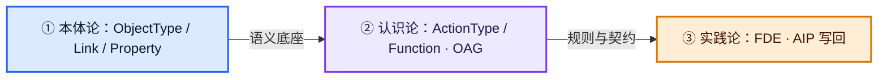
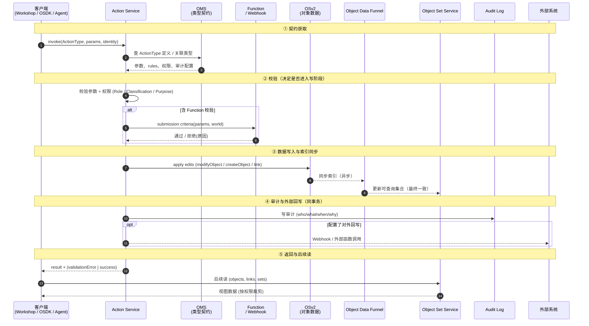
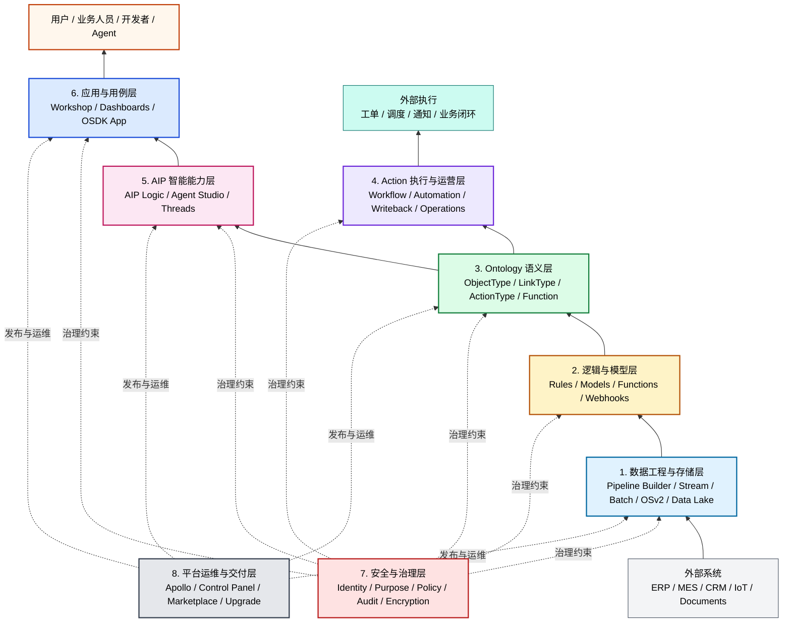

# Palantir 技术原理介绍

> 本文档基于 Palantir 官方《[平台概览](https://www.palantir.com/docs/zh/foundry/platform-overview/overview)》、Foundry 文档（Object backend、Action types、AIP features）整理，探讨 Ontology（本体）、数据组织、决策机制与整体技术框架。公司定位、商业模式与案例见同目录下《业务介绍.md》。**ER/OOP 与 Ontology 在存储与行为模式上的对比**见《数据存储与使用方式对比.md》。

## 一、什么是 Ontology（本体论），与一般的对象关系有什么不同？

### 1.1 官方定义

Palantir《平台概览》中的定义要点如下（[中文版](https://www.palantir.com/docs/zh/foundry/platform-overview/overview) / [英文版](https://www.palantir.com/docs/foundry/platform-overview/overview)）：

> **Ontology 旨在表示企业中的决策，而不仅仅是数据。**

在工程上，Ontology 是一个语义层，用于连接数据与现实世界的业务对象、关系和决策流程。它包含 **数据 (Data)**，**逻辑 (Logic)**，**操作 (Action)** 三大要素，同时 **安全 (Security)** 贯穿其中。

- **数据 (Data)**：事实与状态。哪个现有事实或真相构成了这个决策的背景？
- **逻辑 (Logic)**：规则、模型、外部回调（护栏与分析）。哪些业务规则或内在逻辑作为决策的护栏？不同假设下的结果概率如何？
- **操作 (Action)**：如何落地、回写，受权限与审计约束。决策在现实世界中如何体现？动力学要求是什么？

**安全 (Security)** 是治理层，涵盖基于角色、标记和目的的访问控制，以及端到端的数据血缘追踪。安全也是Palantir的鲜明特点之一。

Ontology 结构的组成主要包括对象（Objects）、链接（Links）、行为类型（Action Types）、函数（Functions）与约束（含权限/审计）。Action 是通过 **Action Type** 独立定义并执行的，而不是实体类上的方法，这与 DDD（领域驱动设计）中的“富血模型”有本质区别。详见《数据存储与使用方式对比.md》第七章。

### 1.2 哲学基础：两种本体观

哲学本体论概念在工程里常有两种体现：

- 实体本体论（对象为主、关系附属 → ER/OOP）
- 关系/过程本体论（关系与变化为主 → 图、分布式状态、Palantir）。

关系过程本体论更贴近 Palantir：**除了“有哪些对象”，还要关心如何关联、哪些动作能改状态、受何约束。** 因此 Ontology 不是静态数据存储，而是把**事实、规则、权限与行动**连在一起的语义层。

**Palantir 还贯穿了“本体—认识—实践”三层哲学。** “过程本体”只是 Palantir 的第一层。纵观整个平台，可以看到平台同时涉及三个传统哲学概念——世界由什么构成、我们如何认识它、如何把认识变成行动。 **Ontology**（Ontology 只是其涵盖的一层）。

| 哲学概念                     | 哲学问题               | Palantir 的对应实现                                                                                                                                                                                                                 |
| ------------------------ | ------------------ | ------------------------------------------------------------------------------------------------------------------------------------------------------------------------------------------------------------------------------ |
| 本体论（Ontology，"有什么"）      | 业务世界由哪些对象、关系、链接构成？ | **ObjectType + LinkType + Property**：声明业务实体、具名关系与属性，作为平台共享的事实底座（详见 2.1）                                                                                                                                                        |
| 认识论（Epistemology，"如何认识"） | 系统如何对世界做推理、计算与分析？  | **ActionType + Function + Models / Analytics**：ActionType 把"哪些变更合法、需要哪些参数与校验"声明为可读契约；Function/Webhook 接入规则与外部知识；Models、Contour、Quiver 做预测、优化与归因；**OAG（Ontology Augmented Generation）** 让 LLM 的检索发生在 Ontology 语义层而非裸文本上（详见 3.1） |
| 实践论（Praxis，"如何变成行动"）     | 认识如何在组织中真正落地、改变现实？ | **FDE 驻场 + AIP 决策回路**：FDE（Forward Deployed Engineer）作为人侧抓手深入客户的工厂、战场、医院，把实际工作流翻译成 Ontology 与 Action；AIP 作为机器侧抓手，让 Agent 走 Proposal → 人审 → Action → Audit 把决策推到生产系统（详见 3.2、3.4）                                                 |

三层是**嵌套约束**关系：认识论里的 Function 与 ActionType 必须挂在本体论给出的 ObjectType 上才有语义；实践论里的 AIP 决策又必须穿过本体论与认识论给出的对象、规则、权限才能写回。这也是 Palantir 与"只做一层"的厂商最大的差异——数仓/图数据库厂商主要解决本体论问题（建模"有什么"），BI / AutoML 厂商主要解决认识论问题（建模"怎么算"），传统咨询/集成商主要解决实践论问题（把方案塞进客户业务）；**Palantir 的核心卖点是把三层合到同一个语义层、同一套权限体系、同一条审计链路里**，使得对象、推理与行动之间不再有跨系统的"翻译损耗"。

> 参考：Palantir 官方 [AI FDE 概览](https://www.palantir.com/docs/foundry/ai-fde/overview)、[AIP Logic Overview](https://www.palantir.com/docs/foundry/logic/overview)、Palantir Blog [Building with Palantir AIP: Logic Tools for RAG/OAG](https://blog.palantir.com/building-with-palantir-aip-logic-tools-for-rag-oag-fdaf8938d02e)（OAG = Ontology Augmented Generation 概念出处）。

### 1.3 工程建模的三层演进

| 层级  | 本体观          | 技术代表                    | 主要能力           |
| --- | ------------ | ----------------------- | -------------- |
| L1  | 对象中心         | ER / OOP                | 描述实体、字段、属性     |
| L2  | 对象 + 关系      | Graph / Knowledge Graph | 表达复杂关系和路径      |
| L3  | 关系 + 行为 + 约束 | Palantir Ontology       | 对象、关系、动作、权限、审计 |

### 1.4 与"一般对象关系（ER / OOP）"模型的主要差异

> ER 主要描述表结构和外键；OOP 常把行为写在应用层类方法里。Palantir Ontology 用 ObjectType / LinkType / ActionType 在平台层声明对象、关系和可执行变更，权限与审计按定义统一生效。应用、Workshop、AIP Agent 只是调用这套定义，不需要各写一遍“谁能改什么”。

| 维度    | 一般的对象/关系模型          | Palantir 的 Ontology                                                                                                                 |
| ----- | ------------------- | ----------------------------------------------------------------------------------------------------------------------------------- |
| 建模目标  | 数据结构、字段约束           | 数据结构 + 业务运行语义 + 可执行变更的契约（回答"有什么、谁能动它、怎么动、留什么痕"）                                                                                     |
| 基本元素  | 实体、属性、外键关系          | **对象 + 链接 + 属性 + ActionType** 对象（ObjectType 实例）映射业务实体； 链接（LinkType 实例）具名关系； **ActionType** 描述可执行变更契约，运行时一次调用常称 **Action**，不是实体类上的方法 |
| 与权限   | 通常外挂在应用层            | **权限 / 分类 / 目的访问控制**内置于本体，随每一次数据调用自动生效                                                                                              |
| 与逻辑   | 业务规则散落在应用或 ETL      | 逻辑以**模型、Function、Webhook、规则**挂到 Ontology 上，供应用、管道与 Agent 在运行时调用                                                                     |
| 与动作   | 读写由应用各自实现           | **ActionType** 为独立一等类型，带细粒度权限与审计，可经 OSDK / 平台 API 对外暴露为可调用的 Action                                                                  |
| 与 AI  | 后接 LLM 对表问 SQL/自然语言 | **在 Ontology 语义与权限下**让 LLM/Agent 理解对象、链接、可调用的 Action，通常经 **Proposal** 与人审，而非默认直连写回                                                  |
| 与外部世界 | 通过定制集成写回            | 通过 Action、外部函数与 Webhook 在权限和审计下同步                                                                                                   |

流程上，传统做法多是「库 → 应用 → 逻辑 → 操作」闭环；Ontology 把对象、关系、逻辑与 Action 串成可审计、可回写的闭环（上表已概括差异，此处不另画图）。

### 1.5 为什么 Ontology 对企业 AI 重要

常见断层是：只把 LLM 接到湖表，缺业务语义与可调用的动作契约。Ontology 用对象/链接表达”是谁、与谁相关“，用 Action 与权限约束”能改什么“；Agent 侧多经 Proposal 与人审再写回，变更可审计。AIP（Logic、Agent Studio、Threads 等，视租户开通情况）叠在这层之上，详见[官方 AIP 功能总览](https://palantir.com/docs/foundry/aip/aip-features/)。**更细的决策链见第三节。**

## 二、数据是如何组织的？

### 2.1 对象 + 链接：描述真实世界的图谱

Ontology 将数据组织为**对象（Object）与链接（Link）**：

- **对象**对应真实世界中的实体：飞机、病人、订单、油井、任务、传感器等；
- **链接**是对象之间的具名关系：`installed_on`、`assigned_to`、`part_of`、`supervised_by`……

这套模型让运营复杂性对**人与 AI 都可理解**——读到一个对象，就能沿着链接走到与之相关的所有上下游，而不必像传统数仓那样靠 JOIN 一步步推导。

> 注意：Ontology 不是图数据库（Neo4j / JanusGraph）。

### 2.2 平台支持的数据类型与扩展

Foundry / Ontology 能纳管的数据类型比较杂：结构化、非结构化、地理空间、时间序列、模拟数据都在范围内；此外还提供了几个特别为"决策场景"准备的扩展基元：

- **语义搜索（Semantic Search）**：用向量化方式解锁非结构化数据（文档、通联记录、工单描述）的检索；
- **媒体引用（Media Reference）**：把图像、视频纳入对象属性，供视觉模型或人审使用；
- **值类型（Value Type）**：为数据嵌入额外约束与上下文（单位、合法取值、密级等），避免"一个字段含义各说各话"。

### 2.3 数据接入：多模式、零拷贝

数据很少以"干净形状"到达。Palantir 提供一套可扩展、多模式的接入框架：

- **就地 / 零拷贝访问**：对接现有数据湖与平台，尽量避免"二次存储"；
- **批流统一的构建系统**：同一套基础设施跑批处理和流处理（官方文档表述为"批流统一"，底层实现细节以 Palantir 为准）；
- **Pipeline Builder + Code Repositories**：前者是低代码点选式管道，后者是工程化的代码管道；
- **LLM 数据变换**：在 Pipeline Builder 里直接调用 LLM 做分类、情感分析、摘要、实体抽取、翻译等；
- **AIP Assist**：在 Pipeline Builder 和代码仓库里提供 AI 编程助手，了解 Palantir 文档与内部 API。

### 2.4 把数据模型变成统一接口

在 Ontology 中建模数据会自动衍生出两件事：

- **Ontology SDK（OSDK）**：企业内外的应用都能以对象/链接/动作为语义调用业务；
- **平台 API**：第三方工具可安全地读写 Ontology。

更准确地说，Ontology 提供的是一层统一语义接口。前提是相应对象、Action、权限和 API 已在租户内配置并暴露出来；并不是任何底层数据一接进来，就天然自动变成可供外部系统调用的业务接口。

### 2.5 Ontology 在工程上“存在哪里”（不是图数据库）

**重要**：业务视角上的“图”不等于部署一套 Neo4j。Foundry **Ontology 后端**由多服务组成：**Ontology Metadata Service (OMS)、Object databases（Object Storage）、Object Set Service (OSS)、Object Data Funnel、Actions、Functions** 等协同完成索引、查询、写回与权限。对象数据可来自数据湖中的 Iceberg/Parquet 等，经索引进入面向应用的查询面。

- **Object Storage V1（Phonograph）**：旧版对象存储，官方已规划**弃用**（如文档所述目标日期前需迁移到 OSv2）。
- **Object Storage V2 (OSv2)**：新一代 Ontology 数据面；OSv2 在写回上强调 **Action** 路径，并与 Funnel 等组件分工（详见[官方 Object backend 概览](https://palantir.com/docs/foundry/object-backend/overview/)、[OSv1/OSv2 说明](https://palantir.com/docs/foundry/object-databases/object-storage-v1/)）。下面是官方给出的总体架构图。

根据官方架构图和文档把后端几个核心服务生成了下面这张图，以便说明各模块的职责，以及流程里面怎么配合。具体调用细节以 Palantir 文档为准；图本身只是方便理解服务边界。

```mermaid
flowchart TB
    subgraph SRC[数据源]
        LAKE[(数据湖<br/>Iceberg / Parquet / Delta)]
        EXT[外部系统<br/>ERP / MES / IoT / 文档]
    end

    subgraph PIPE[接入与构建]
        PB[Pipeline Builder<br/>Code Repositories]
    end

    subgraph META[元数据面]
        OMS[Ontology Metadata Service<br/>OMS<br/>类型/链接/Action 定义]
    end

    subgraph DATA_PLANE[数据与查询面]
        OSv2[(Object Storage V2<br/>对象 + 属性)]
        OSS[Object Set Service<br/>集合 / 过滤 / 翻页]
        FUNNEL[Object Data Funnel<br/>索引 / 物化 / 同步]
    end

    subgraph EXEC[执行面]
        ACT[Action Service<br/>校验 / 规则 / 写回]
        FN[Functions<br/>外部函数 / Webhook]
        AUD[Audit Log<br/>不可篡改记录]
    end

    subgraph CLIENT[消费方]
        WS[Workshop / Dashboards]
        OSDK[OSDK / 平台 API]
        AIP[AIP Agent / Logic]
    end

    LAKE --> PB
    EXT  --> PB
    PB   --> FUNNEL
    FUNNEL --> OSv2
    OSv2 -.写后索引同步.-> FUNNEL
    OMS  -.类型契约.-> OSv2
    OMS  -.类型契约.-> ACT
    OSv2 --> OSS
    OSS  --> WS
    OSS  --> OSDK
    OSS  --> AIP
    WS   --> ACT
    OSDK --> ACT
    AIP  --> ACT
    ACT  --> FN
    ACT  --> OSv2
    ACT  --> AUD
    ACT  -. Webhook .-> EXT

    style SRC fill:#fff7ed,stroke:#c2410c,stroke-width:2px,color:#000
    style PIPE fill:#e0f2fe,stroke:#0369a1,stroke-width:2px,color:#000
    style META fill:#fef3c7,stroke:#b45309,stroke-width:2px,color:#000
    style DATA_PLANE fill:#dbeafe,stroke:#1d4ed8,stroke-width:2px,color:#000
    style EXEC fill:#ede9fe,stroke:#6d28d9,stroke-width:2px,color:#000
    style CLIENT fill:#dcfce7,stroke:#15803d,stroke-width:2px,color:#000
```

简化记忆：**OMS 管"是什么"，OSv2 + OSS + Funnel 管"在哪、怎么读"，Action Service + Functions 管"怎么改、改完留什么痕"**。读路径主要走 OSS → OSv2，写路径主要走 Action → OSv2 + 审计 + 可选 Webhook 写回外部。

> **关于 Funnel 的双时机**：Funnel 既参与接入侧（Pipeline Builder 产出 → 物化为对象进入 OSv2，图中实线 `PB → FUNNEL → OSv2`），也参与写后索引同步（Action 写入 OSv2 后，Funnel 把变更同步到查询集合，图中虚线 `OSv2 -.写后索引同步.-> FUNNEL`）。下文 3.2 的时序图只展示第二种时机。

同一领域问题的更细**存储与 Action 对比**见《数据存储与使用方式对比.md》。

### 2.6 一条最小运行链路

如果从架构实现角度看，一条典型调用链大致是这样：

1. 数据从 ERP、MES、日志系统、文档系统、传感器平台等接入 Foundry；
2. 专门管道把原始数据整理成对象、链接和属性，进入 Ontology；
3. Function、规则或外部函数补上计算逻辑；
4. ActionType 定义哪些变更可以被执行，以及执行时要经过哪些校验、权限和审计；
5. Workshop、OSDK、平台 API 或 AIP Agent 调用这些对象与 Action；
6. 动作执行后，结果再写回 Ontology，必要时再同步到外部系统。

这条链路对架构师的意义在于：数据层、语义层、动作层、权限层和应用层不是各自零散实现，而是被放进了同一条运行路径里。

## 三、数据是如何决策的？

官方把决策过程分解为"数据—逻辑—操作"三段，三者在 Ontology 中同层、同语义、同权限。

### 3.1 逻辑层：为决策提供"推理与分析"

逻辑层贯穿整个平台，大致分为三类：

**(a) 模型（Models）**

- 覆盖 LLM、预测、优化器等；
- 支持**平台内训练**、**自带容器（BYOC）**、**上传预训练模型**三种接入方式；
- 以"建模目标（Modeling Objective）"承载模型的完整生命周期，以"模型适配器（Model Adapter）"抽象不同模型的调用；
- 通过 **Function** 把模型绑定进 Ontology，运营应用可实时调用；
- 通过**批量部署（Batch Deployment）** 在数据管道中计划执行；
- 对生成式 AI 提供统一的语言模型服务，抽象不同 LLM 提供商的差异；
- **评估（Evaluations）**工具用于跨模型、跨时间基准测试，监控漂移。

**(b) 业务逻辑（Business Logic）**

- 外部系统里的既有规则：通过**外部函数 / Webhooks**（实时）或**外部变换**（管道）接入；
- 平台内原生表达：**Rules**、**Pipeline Builder**、**Automate**、**Functions**。

**(c) 模板化分析与报告**

- **Contour / Quiver**：点选式分析工具；
- **Code Workspaces**：Jupyter / RStudio 风格的代码分析；
- **Object View / Workshop 应用 / Dashboards**：分析产物可复用、可嵌入运营应用；
- 支持 Tableau、Power BI 的专用连接器。

这三类逻辑可以组合使用，在决策时补齐上下文。

### 3.2 操作层：让决策产生实际影响

在 Ontology 中，**ActionType** 描述一类可执行变更的契约（参数、规则、权限、审计）；运行时发起的一次调用常称为 **Action**。二者在文档里有时混用，这里按“类型 vs 调用”区分。创建/更改对象、在外部系统中触发变更，都经这条路径表达。关键设计：

- **细粒度权限**：每个 ActionType 的权限独立配置，决定哪个用户或代理能在什么条件下执行对应 Action；
- **简单到复杂的定义路径**：基础 Action 可点选配置，复杂 Action 可用**函数支持的 Action** 和 **Ontology Edit TypeScript API** 写任意逻辑；
- **对外打包**：Action 打进 OSDK / 平台 API，第三方应用可安全回写；
- **结果可回传**：Action 的结果会回到 Ontology，便于后续再训练、微调和复盘。

这里有一个对架构师很重要的边界：

- **声明式层** 适合放对象类型、关系类型、权限、校验条件、可执行动作的基本契约；
- **代码层** 适合放复杂计算、外部系统编排、算法、批量处理和难以通过配置表达的业务规则。

Palantir 的重点不是“完全不要代码”，而是把**适合声明的部分平台化**，把**必须写代码的部分收敛到更清晰的边界里**。

#### 一次 Action 调用的时序

下面这张时序图把 2.5 提到的几个后端服务串起来，明细"谁先谁后、错误从哪抛出"。下文把"应用 / OSDK / Agent"统一称作客户端。

关键点：

- 校验在 Action Service 内一次性发生：参数类型、权限、Function 形式的 submission criteria 全部通过，才会进入数据面修改阶段；
- 所有写都经 Action 路径，OSv2 不接受"绕过 Action 直改对象"的请求（OSv2 的官方表述）；
- 审计是同事务发生的副作用，不是事后补记；
- **索引同步是最终一致**：OSv2 → Funnel → OSS 通常异步发生，Action 返回成功的瞬间 OSS 上的查询结果可能尚未刷新；"写完立即查"要走 OSDK 的强一致读路径或显式等待索引就绪；
- 对外回写（Webhook / 外部函数）发生在审计之后，避免"外部系统改成功，但内部状态没留痕"。

### 3.3 场景（Scenario）：安全地"假想推演……"

在紧密耦合的系统（供应链、制造车间、战场态势）里，一个小改动会引发级联效应。Ontology 提供 **Scenario** 原语：

- 在 Ontology 的一个分支上做修改，如同在"沙盒宇宙"里预演；
- **Vertex** 应用专门用于过程可视化与情景测试；
- **Workshop** 构建器原生支持"假如……"工作流。

#### Scenario 在底层做了什么（按官方的描述推断，不一定完全准确）

Scenario 不是把整套数据完整复制一份，那样代价太高。官方文档的描述是：分支只存"相对主线 Ontology 的增量"——修改过的对象属性、新建对象、删除对象、新建/删除链接类型——其余仍共享主线。这就是**写时复制（copy-on-write）的逻辑分支**。读路径先看分支增量、再回落主线；分支被丢弃时增量直接抛掉。

工程上这意味着：

- **隔离写、共享读**：分支只承担"差异部分"，多数对象仍指向主线。
- **权限同样生效**：分支里跑的 Action 也走 Role / Classification / Purpose 校验，不会因为是"沙盒"就放宽。
- **Scenario 创建后不可变（immutable），且不会自动合并回主线**：官方原文是 "A Scenario is immutable once created"。要"修改"一个 Scenario，需要新建一个带不同 Action 集合的 Scenario。
- **想让推演结果落到主线，得另走一条路**：要么在主线上重新发起对应 Action（Scenario 充当人审/对比用的"草稿"），要么走 **Foundry Branching / Ontology Proposals**——它才是带 Pull Request 风格审阅与合并的机制。Scenario 与 Foundry Branch 是两个不同概念，常被混为一谈。
- **不可作为事务保障**：Scenario 是用于推演，不替代数据库事务；高一致性要求的写仍走 Action 主路径。

> 以上结合官方 Workshop Scenarios 与 Foundry Branching 文档归纳；具体实现细节与租户实际能力以 Palantir 文档为准。

### 3.4 人机协作：Proposal 模式

AIP 的常见落地方式不是“让 AI 直接改系统”，而是：

1. AI 代理先生成**提案（Proposal）**（可通过 Workshop 中的 AIP Logic 同步生成，或通过 Automate / Pipeline Builder 的 `Use LLM` 节点异步生成）；
2. 提案呈现给人类操作员；
3. 操作员审阅、改进、最终决策；
4. 每个提案都生成元数据，反过来帮代理学习与演进。

这套“代理—沙盒—提案—审阅”流程，核心就是把人放在最终决策位。

## 四、技术框架是什么？

### 4.1 Palantir 平台的总体结构

官方《平台概览》里平台能力介绍较多，通过整理，总体上可以自上而下拆成 **8 层**。

- Ontology 是平台核心；
- AIP 建立在 Ontology 之上；
- Action 本质属于 Ontology 的运行能力；
- Apollo 更偏平台运维与交付，而不是业务能力层。

1. **数据工程与存储层（Data Foundation）**
    数据接入、批流处理、Data Lake、OSv2、数据管道与数据服务。
2. **逻辑与模型层（Logic & Compute）**
    Rules、Functions、Webhook、Transform、模型推理与业务计算。
3. **Ontology 语义层（Ontology）**
    ObjectType、LinkType、ActionType、Function、语义对象与业务世界建模。
4. **Action 执行与运营层（Operational Actions）**
    Workflow、Automation、Writeback、Operational Runtime、业务闭环执行。
5. **AIP 智能能力层（AIP）**
    AIP Logic、Agent Studio、Threads、LLM Runtime、AI Agents。
6. **应用与用例层（Applications）**
    Workshop、Dashboards、OSDK App、业务应用与交互界面。
7. **安全与治理层（Governance & Security）**
    Identity、Policy、Purpose、Audit、Encryption、数据治理与权限体系。
8. **平台运维与交付层（Platform Operations）**
    Apollo、Control Panel、Marketplace、升级与平台级运维。

### 4.2 三大平台的关系

业务侧的产品矩阵（Gotham / Foundry / AIP）与技术侧的运行分工不是同一张图。下表从**技术架构**角度拆四件东西在栈里各占什么位置；产品定位 / 客户场景见《业务介绍.md》1.2。

| 组件           | 在技术栈里的位置              | 主要职责                                                                        | 与 Ontology 的关系                                               | 部署形态                     |
| ------------ | --------------------- | --------------------------------------------------------------------------- | ------------------------------------------------------------ | ------------------------ |
| **Foundry**  | 数据 + 应用运行面            | 数据接入、批流处理、OSv2、Function、Workshop、Pipeline Builder——把数据"跑起来"的全套基础设施          | 提供 Ontology 的存储与执行环境（OMS、OSv2、Action Service 等都跑在 Foundry 上） | 商业云、专网、政府云               |
| **Ontology** | 语义层（Foundry 之内的核心）    | ObjectType / LinkType / ActionType / Function / 权限 / 审计——把业务对象、关系、动作、约束统一表达 | 自身即是语义层                                                      | 随 Foundry 部署，不独立交付       |
| **AIP**      | 智能能力层（Ontology 之上）    | LLM 函数、Agent Studio、Threads、AIP Logic——让 LLM/Agent 在 Ontology 的语义和权限下工作     | 强依赖：Agent 只能看到 Ontology 暴露的对象和 Action，写回必经 Action + 审计       | 跟随 Foundry / Gotham 所在环境 |
| **Gotham**   | 与 Foundry 并列的政府/国防产品线 | 与 Foundry 共享对象、链、安全协作的底层理念，但交付环境、鉴权模型、网络隔离要求都不同                             | 同样以本体 + 安全协作为核心，工程实现细节不公开                                    | 政府云、隔离网、专网               |
| **Apollo**   | 平台运维与交付层（跨所有产品）       | 持续部署、版本编排、灰度、回滚——把 Foundry / AIP / Gotham 的更新推到云、本地、边缘、隔离网                  | 自身不读 Ontology，但负责把承载 Ontology 的运行时稳定发布到各环境                   | 控制面集中、执行面分布在各目标环境        |

几个常被混淆的点：

- **AIP 不是与 Foundry 并列的"另一套数据库"**：它是能力剖面 / 产品集，叠在 Foundry 的 Ontology 与安全模型之上，没有自己独立的数据面。
- **Ontology 不是单独可售的产品**：它是 Foundry / Gotham 的核心组件，对外暴露为 OSDK 与平台 API，但部署上跟随 Foundry / Gotham。
- **Apollo 不参与业务能力**：它只解决"如何把上面这些稳定升级到各种环境"，因此在业务架构图里通常被画成横切层，而不是某一层。
- **官方对外叙述里的"Palantir 平台"通常指 Foundry + AIP + Apollo**；业务侧产品线划分仍以 Gotham / Foundry / AIP 为主。

### 4.3 安全与治理：默认随数据流动

Palantir 的安全模型最核心的一点：**安全规则与信息同行**。具体能力：

- 传输中与静止时的全量加密；
- 身份验证与身份保护；
- **基于角色 / 分类 / 目的** 三种方式可叠加的授权控制；
- 强审计日志；
- 信息治理、隐私控制可按字段、按目的精细配置。

这套机制使 Ontology 即便跨部门共享，权限也不会因"数据离开了原有应用"而失效。

#### 三种授权方式合在一起长什么样

光说"基于角色 / 分类 / 目的"很容易停在抽象。把它落到一张矩阵上更直观：每条访问请求都会被三个独立维度同时检查，**只要任何一维不通过就拒绝**。

| 维度                      | 控制对象        | 例子                                                                        | 工程上挂在哪                             |
| ----------------------- | ----------- | ------------------------------------------------------------------------- | ---------------------------------- |
| Role（角色）                | "你是谁、属于哪个组" | `PlantManager`、`StrikeCellChief`、`J2_Analyst`                             | 用户 / 组 / 服务账号 → 角色映射               |
| Classification（分类 / 密级） | "数据本身的敏感等级" | `UNCLASSIFIED` / `CONFIDENTIAL` / `SECRET` / `TOP_SECRET`，加 `NOFORN` 等警示语 | ObjectType / 字段 / Action / 数据集级别声明 |
| Purpose（目的）             | "你来做什么用"    | `production-scheduling`、`outage-investigation`、`audit-review`             | Action / 查询请求时显式声明，平台校验该目的是否被允许    |

这三维独立、可叠加。一个具体例子：

| 请求                                 | 角色检查                                          | 分类检查                    | 目的检查                    | 结果         |
| ---------------------------------- | --------------------------------------------- | ----------------------- | ----------------------- | ---------- |
| 工厂经理读 `Vehicle.status`             | PlantManager ✓                                | SECRET ⊆ 用户 SECRET 许可 ✓ | production-monitoring ✓ | 允许         |
| 同一个工厂经理读 `Vehicle.lotMargin`（财务字段） | PlantManager ✗（该字段角色受限）                       | —                       | —                       | 拒绝         |
| 审计员读 `Vehicle.status`              | Auditor ✓                                     | SECRET ⊆ 审计员许可 ✓        | audit-review ✓          | 允许（只读）     |
| 同一审计员调用 `startProduction` Action   | Auditor ✗（角色不在该 Action `permissions.roles` 内） | —                       | —                       | 拒绝         |
| 跨域共享：合作方访问 `Vehicle`               | Partner ✓                                     | 字段含 `NOFORN` ✗          | —                       | 字段被裁剪，其余可见 |

要点：

- **维度独立**意味着加一个角色不会顺带放开密级，反过来也是。
- **字段级**支持是关键：同一对象的 `status` 公开、`margin` 敏感，可以分开声明，而不必拆成两个对象。
- **Purpose** 是常被忽略的一维：它把"我有权限"和"我现在有正当理由用"分开，事后审计可以按目的查"谁在什么场景下访问了什么"。
- 这套规则**进 Ontology 而不是进应用代码**，因此 Workshop、OSDK、AIP Agent 拿到的视图都已经按规则裁剪好，不需要每个应用各自实现一遍。

### 4.4 开发与交付工具链

- **Pipeline Builder**：低代码数据管道，支持 LLM 变换节点；
- **Code Repositories**：工程化代码管道；
- **Code Workspaces**：Jupyter / RStudio 等笔记本环境；
- **AIP Logic**：无/低代码环境，构建、测试、部署以 LLM 和 Ontology 为后盾的函数与工作流，可与 **Automate** 等集成；
- **AIP Agent Studio** / **AIP Threads**（[官方文档](https://palantir.com/docs/foundry/aip/aip-features/)）：构建可部署的 Agent 与即席分析（Threads 为 Beta 等，视环境而定）；
- **Workshop**：低代码应用开发，支持实时预览与 Scenario；
- **Vertex**：过程可视化与情景测试；
- **Marketplace**：平台内的"产品市场"，用于交付与安装数据产品；
- **OSDK / 平台 API**：让外部应用以语义方式读写 Ontology。

## 五、扩展：如何搭建同类平台

### 5.1 通用路线图（技术视角）

做同类平台需要覆盖 8 个能力层，少任何一层都会让"决策—行动—审计"闭环掉链。下表把每一层的必备子能力与工程要点列出来，便于按层做技术选型评审：

| #   | 能力层                     | 能力项                                                          | 工程要点 / 可参考的开源或商业组件                                                                                                |
| --- | ----------------------- | ------------------------------------------------------------ | ----------------------------------------------------------------------------------------------------------------- |
| 1   | **多模式数据接入**             | 批 / 流 / 就地访问 / 零拷贝；结构化、非结构化、地理空间、时间序列、模拟数据                   | 兼容 Iceberg / Delta / Hudi / Parquet；流侧 Kafka + Flink CDC；RDBMS 通过 CDC 或 JDBC；尽量"零二次存储"以避免数据漂移                     |
| 2   | **语义层（Ontology 本地化实现）** | 对象—链接—属性—Action 统一建模；值类型与约束；语义搜索、媒体引用扩展；SDK / API 自动生成       | 元数据服务 + 索引服务 + 对象存储分层（参考 Palantir 的 OMS / OSv2 / OSS / Funnel 分工，详见 2.5）；可以借鉴 SchemaRegistry / Iceberg Catalog 思路 |
| 3   | **逻辑层**                 | 模型托管（BYOC、上传预训练、平台内训练）；统一 LLM 服务；外部函数 / Webhook；模型评估与漂移监控    | 模型服务化（KServe / BentoML / Triton）；LLM 网关层抽象不同供应商；评估管道独立于训练管道                                                       |
| 4   | **操作层**                 | Action 作为一等公民（独立类型 + 细粒度权限 + 审计）；Scenario 分支与"假如…"仿真         | Action Service 集中校验，写回经审计同事务；Scenario 用 copy-on-write 逻辑分支实现（见 3.3）                                               |
| 5   | **人机协作**                | Proposal 模式（AI 提建议、人审、再落地）；操作反馈回流；元数据用于微调                    | UI 侧 Proposal 队列 + 审批工作流；事件总线把审批结果回写训练集                                                                           |
| 6   | **安全与治理**               | Role / Classification / Purpose 三维授权可叠加；全链路加密、审计；按字段、按目的精细配置 | 权限规则进语义层而非应用层（见 4.3）；审计日志只增不删；合规适配（国标 / GDPR / HIPAA 按场景）                                                         |
| 7   | **持续部署**                | 多环境（云、本地、边缘、隔离网）自动化升级；灰度、回滚、版本编排                             | 控制面 + 执行面分离，参考 Apollo 模式；离线/断网环境用包仓库 + 离线升级通道                                                                     |
| 8   | **低代码 + 代码"双轨"开发**      | 低代码应用与管道构建器；面向工程师的代码仓库 + IDE 集成；AI 编程助手                      | 低代码产物可被代码层"接管"而非锁定；两条路产出统一可部署单元                                                                                   |

依赖关系上，第 2 层（语义层）是其余各层的核心契约：第 3 层的 Function 要挂在 ObjectType 上才能用，第 4 层的 Action 要符合 ActionType 契约，第 5 层的 Proposal 要表达成 Action 候选，第 6 层的权限直接进语义层。**先把第 2 层做扎实，其他层再往上叠**，否则极易在后期把权限和审计当补丁打。

### 5.2 在中国搭建同类服务的技术考量

在国内搭建时，除了上述技术层，还要针对环境做适配：

- **本地化底座**：优先选择信创合规的基础设施（国产数据库、国产云、信创 Linux），并对接现有数据湖/仓标准（如开源 Iceberg / Delta）。
- **联邦式本体**：把语义层与数据所有权解耦。各企业/部门保留自有数据与算力，平台提供本体构建方法、跨节点查询与联邦学习能力，避免把敏感数据集中到一处。
- **私有化 + 专有云部署**：给国防、能源、金融等核心客户提供完全离线部署方案；Apollo 式的持续升级需改造为"断网也能升级"的模式。
- **数据分类与合规**：按《数据安全法》《个人信息保护法》《网络安全法》以及行业合规要求，把数据分级分类内建到权限模型中。
- **大模型本地化**：语言模型服务层对接国产大模型（如符合监管要求的自研/开源模型），并保留切换能力。
- **与现有业务系统的深度打通**：Action 层优先支持国产 ERP / MES / OA / GIS 等系统的写回接口。
- **文化与组织**：技术平台再强，也需要在交付模式上引入 FDE 式驻场，或“客户内部骨干 + 外部产品团队”混编，否则复杂场景很难稳定沉淀下来。

技术能力可以逐步补齐，但组织与商业模式同样关键。这部分请见《业务介绍.md》，可以两份文档一起对比看。

## 六、参考资料

- Palantir 官方[平台概览](https://www.palantir.com/docs/zh/foundry/platform-overview/overview)
- Palantir 官方[Ontology 后端架构](https://palantir.com/docs/foundry/object-backend/overview/)（Object Storage V1/V2、OSS、Funnel 等）
- Palantir 官方[Action types 概览](https://palantir.com/docs/foundry/action-types/overview/)、[AIP 功能](https://palantir.com/docs/foundry/aip/aip-features/)
- 知乎转译[《我们不是一家数据公司》](https://zhuanlan.zhihu.com/p/2010127291414496605)
- [《Palantir 的"本体论"骗局》](https://zhuanlan.zhihu.com/p/2008601762047746162)（批评视角）
- [《在中国复制帕兰提尔，有多难？》](https://blog.geohey.com/zai-zhong-guo-fu-zhi-pa-lan-ti-er-you-duo-nan/)，GeoHey
- AI编程核心资源库：https://microwind.github.io