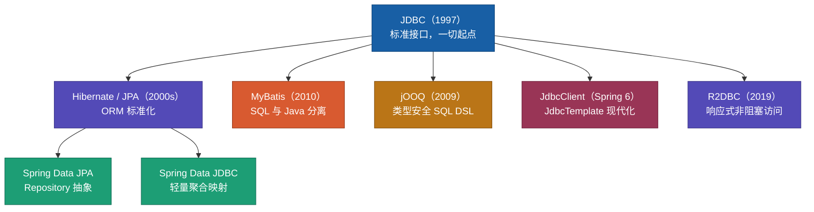
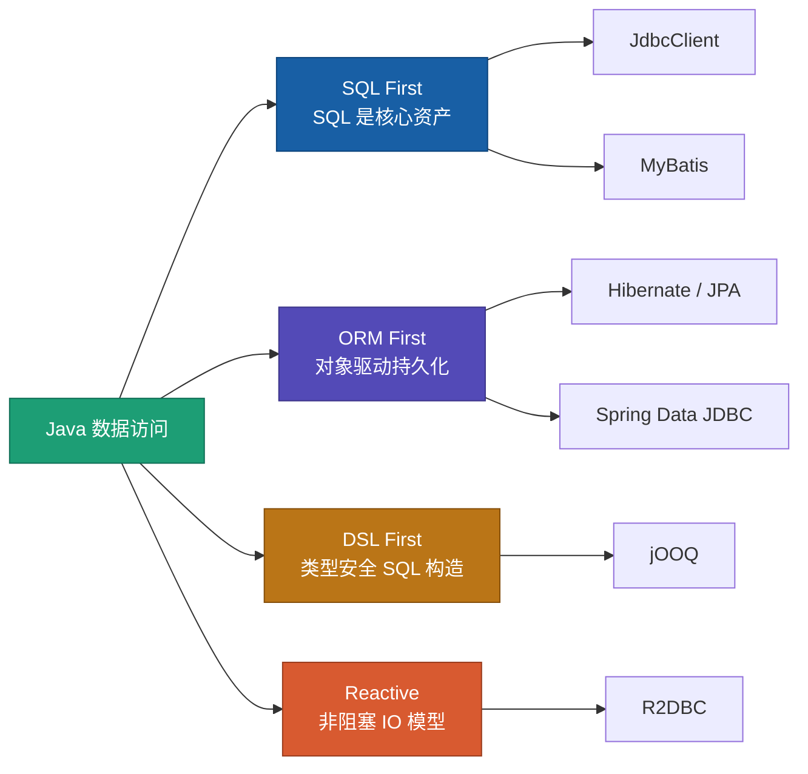
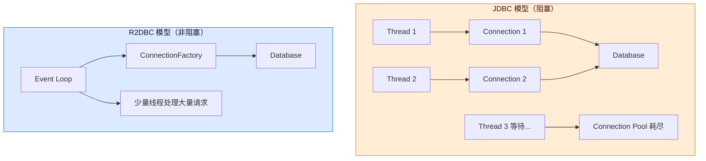
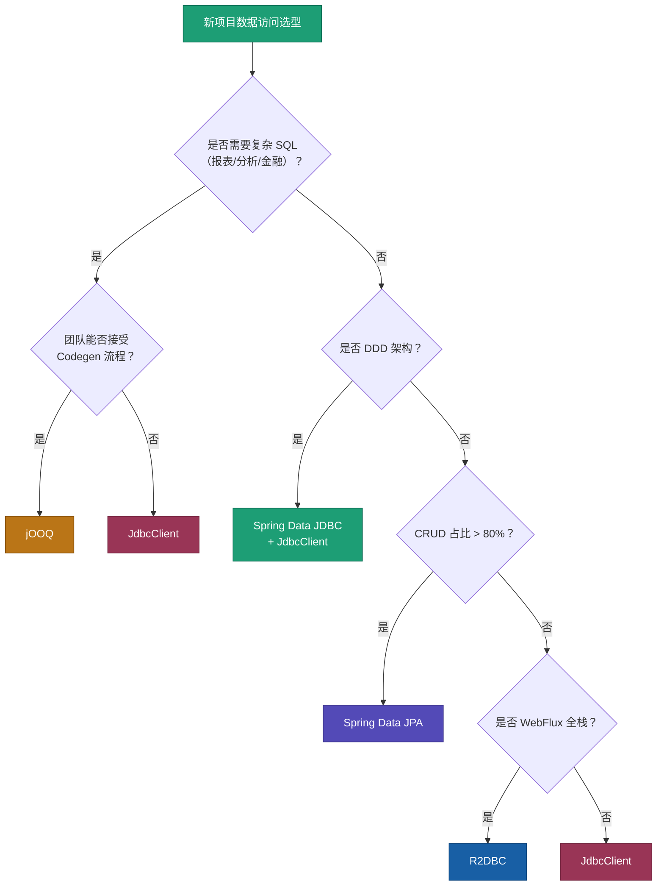

# 2026 年 Java 数据访问技术选型指南
## JdbcClient、MyBatis、jOOQ、JPA 与 R2DBC 深度对比

> 从 SQL 控制、开发效率、类型安全、DDD 适配、AI Coding 友好度等维度，分析现代 Java 数据访问技术选型。

---

## 一、引言：Java 数据访问技术为什么需要重新选择？

### 1.1 从 JDBC 到现代数据访问

Java 数据访问技术已经走过了三十年的演进。它们不是简单的"替代关系"，而是针对不同问题、不同团队、不同业务阶段的**并行方案**。



**JDBC** 是 Java 访问关系型数据库的标准 API。所有上层框架最终都要落到 JDBC 驱动上。它的优点是标准、透明、性能可控；缺点是样板代码多、资源管理繁琐、缺乏对象映射能力。

**Hibernate / JPA** 把"表行 → 对象"的映射自动化，让开发者以对象思维写业务。适合 CRUD 密集、领域模型稳定的系统，但在复杂 SQL、批量操作、性能调优场景容易踩坑。

**MyBatis** 在国内互联网长期占据主流。它把 SQL 写在 XML 或注解里，Java 侧只负责调用和映射，SQL 完全由开发者掌控。适合 SQL 复杂、需要精细调优、团队 SQL 能力强的项目。

**jOOQ** 走另一条路：用 Java DSL 编写类型安全的 SQL，通过代码生成把数据库 Schema 映射为 Java 类型。编译期就能发现字段改名、类型不匹配等问题。

**JdbcClient** 是 Spring Framework 6 引入的现代 JDBC 封装，定位为 JdbcTemplate 的继任者。API 更简洁，与 Spring Boot 3+ 深度集成，适合"要 SQL 控制、不要 ORM 重量"的场景。

**R2DBC** 是响应式数据库连接规范，配合 WebFlux 实现非阻塞 IO。它不是 JDBC 的升级版，而是面向高并发 IO 场景的**并行技术栈**。

理解这条演进线，选型的关键问题就不是"哪个最好"，而是"我的团队、业务、约束条件下，哪条路径的综合成本最低"。

### 1.2 2026 年技术选型的新维度

过去选型主要看两件事：**性能**和**开发效率**。2026 年，以下维度同样重要，甚至在 AI 辅助编程时代权重更高。

| 维度 | 说明 | 为什么重要 |
|------|------|-----------|
| **SQL 控制力** | 能否精确控制执行的 SQL | 复杂查询、批量操作、索引优化依赖此能力 |
| **类型安全** | 编译期能否发现 Schema 变更 | 减少线上因字段改名导致的运行时错误 |
| **可维护性** | 代码重构、Schema 迁移的成本 | 长期项目的技术债往往出在数据访问层 |
| **DDD 适配** | 是否支持聚合根、值对象、仓储模式 | 领域模型与持久化模型的边界清晰度 |
| **AI Coding 友好度** | AI 生成代码的准确率与可验证性 | 类型安全、结构化 API 更容易被 AI 正确生成和审查 |
| **团队匹配** | 团队现有技能、招聘市场、生态文档 | 技术再好，团队驾驭不了也是负收益 |
| **运维可观测性** | SQL 日志、慢查询追踪、连接池监控 | 生产问题排查效率直接影响 SLA |

一个常见的误区是：新项目默认上 JPA，因为"开发快"。但如果业务涉及大量报表 SQL、分库分表、或团队 DBA 文化浓厚，JPA 的"快"会在三个月后变成"慢"——调试不透明 SQL、处理 N+1、绕过 ORM 写原生查询，每一项都是额外成本。

---

## 二、Java 数据访问技术分类

在深入各技术之前，先用一个分类框架建立全局视角。现代 Java 数据访问大致分为四条路线：



### 2.1 SQL First

**代表技术**：JdbcClient、MyBatis、原生 JDBC

**核心哲学**：SQL 是一等公民。开发者编写、审查、优化 SQL，框架只负责执行和结果映射。

**优势**：
- SQL 完全可控，EXPLAIN 所见即所得
- 性能调优路径清晰，DBA 可直接参与
- 不受 ORM 隐式行为（懒加载、脏检查、缓存）干扰
- 适合复杂查询、存储过程、数据库特有功能（窗口函数、CTE、JSON 操作）

**劣势**：
- 需要手写 SQL，CRUD 样板代码多
- 对象映射需自行处理（RowMapper、ResultMap）
- Schema 变更时，字符串 SQL 无法在编译期校验

**典型使用者**：金融核心系统、高并发交易、数据密集型微服务、DDD 仓储实现。

### 2.2 ORM First

**代表技术**：Hibernate、Spring Data JPA、EclipseLink

**核心哲学**：以对象为中心，框架负责对象与表的映射、关联加载、变更追踪。

**优势**：
- CRUD 开发效率最高，`save()` / `findById()` 开箱即用
- 关联关系（OneToMany、ManyToMany）声明式配置
- 二级缓存、乐观锁、审计字段等基础设施内置
- Repository 模式与 DDD 仓储接口天然契合

**劣势**：
- SQL 不透明，"魔法"行为多（N+1、懒加载异常、Session 生命周期）
- 复杂查询需学习 Criteria API / JPQL，不如原生 SQL 直观
- 批量操作性能差（默认逐条 INSERT/UPDATE）
- 领域模型容易被 `@Entity` 注解污染

**典型使用者**：后台管理系统、SaaS 中台、CRUD 为主的业务系统、快速原型。

### 2.3 DSL First

**代表技术**：jOOQ

**核心哲学**：用 Java 代码构造 SQL，兼顾 SQL 控制力与编译期类型安全。

**优势**：
- 数据库 Schema 变更 → 代码生成 → 编译失败，问题左移到开发阶段
- 复杂 SQL（多表 Join、子查询、窗口函数）用 Java 表达，IDE 自动补全
- 重构安全：字段重命名可通过 IDE Refactor 级联
- SQL 与 Java 同仓库，版本管理统一

**劣势**：
- 学习曲线陡峭，需理解 DSL 语法和代码生成流程
- 开源版功能足够，但部分高级特性需商业许可
- 对 NoSQL、非关系型数据源支持有限

**典型使用者**：金融报表、数据分析平台、复杂业务系统、对类型安全有硬性要求的团队。

### 2.4 Reactive Data Access

**代表技术**：R2DBC、Vert.x SQL Client

**核心哲学**：数据库 IO 不阻塞线程，配合响应式编程模型（Reactor / RxJava）提升吞吐量。

**优势**：
- 少量线程支撑大量并发连接，适合 IO 密集型场景
- 与 WebFlux 技术栈统一，端到端非阻塞
- 背压（Backpressure）机制防止生产者压垮消费者

**劣势**：
- 生态成熟度不如 JDBC（驱动覆盖、工具链、社区案例）
- 编程模型复杂，调试困难
- 并非所有场景都受益——CPU 密集型或低并发场景反而增加复杂度
- 事务、连接池行为与 JDBC 有差异，迁移成本高

**典型使用者**：API 网关、高并发推送服务、IoT 数据接入、WebFlux 全栈项目。

### 2.5 连接池：一切数据访问的基础设施

无论选择哪种上层框架，**连接池**都是生产环境的必选项。Java 生态事实标准是 **HikariCP**。

```java
// Spring Boot 默认集成 HikariCP，典型配置
spring.datasource.hikari.maximum-pool-size=20
spring.datasource.hikari.minimum-idle=5
spring.datasource.hikari.connection-timeout=30000
spring.datasource.hikari.idle-timeout=600000
spring.datasource.hikari.max-lifetime=1800000
```

连接池选型要点：

| 关注点 | 建议 |
|--------|------|
| 池大小 | 不是越大越好。公式参考：`connections = (core_count * 2) + effective_spindle_count` |
| 超时配置 | `connection-timeout` 防止线程无限等待；`max-lifetime` 避免长连接被数据库端断开 |
| 监控 | 暴露 HikariCP JMX 指标，关注 `ActiveConnections`、`PendingThreads`、`TimeoutTotal` |
| 与响应式对比 | R2DBC 使用 `ConnectionFactory` 管理连接，模型不同但同样需要池化 |

---

## 三、JdbcClient 深度分析

### 3.1 JdbcClient 是什么？

JdbcClient 是 Spring Framework 6.1 正式引入的现代 JDBC API，作为 `JdbcTemplate` 的继任者。它在 Spring Boot 3.2+ 中自动配置，注入即可使用。

```java
@Service
public class UserService {
    private final JdbcClient jdbcClient;

    public UserService(JdbcClient jdbcClient) {
        this.jdbcClient = jdbcClient;
    }

    public Optional<User> findById(Long id) {
        return jdbcClient.sql("SELECT id, username, email FROM users WHERE id = :id")
                .param("id", id)
                .query(User.class)
                .optional();
    }

    public List<User> findByStatus(String status) {
        return jdbcClient.sql("SELECT id, username, email FROM users WHERE status = :status")
                .param("status", status)
                .query(User.class)
                .list();
    }

    public int updateEmail(Long id, String email) {
        return jdbcClient.sql("UPDATE users SET email = :email WHERE id = :id")
                .param("email", email)
                .param("id", id)
                .update();
    }
}
```

对比旧版 JdbcTemplate：

```java
// JdbcTemplate 写法 — 冗长
User user = jdbcTemplate.queryForObject(
    "SELECT id, username, email FROM users WHERE id = ?",
    (rs, rowNum) -> new User(rs.getLong("id"), rs.getString("username"), rs.getString("email")),
    id
);

// JdbcClient 写法 — 简洁
User user = jdbcClient.sql("SELECT id, username, email FROM users WHERE id = :id")
    .param("id", id)
    .query(User.class)
    .single();
```

**定位**：JdbcTemplate 的现代化替代，保留 JDBC 的完全控制力，API 更符合 2020 年代 Java 风格。

### 3.2 优点

| 优点 | 说明 |
|------|------|
| **SQL 完全可控** | 写什么 SQL 就执行什么 SQL，无 ORM 隐式行为 |
| **API 简洁** | 命名参数（`:id`）、链式调用、直接映射到 POJO |
| **学习成本低** | 会写 SQL + 会 Spring 注入，半天上手 |
| **性能接近原生 JDBC** | 无 ORM 反射、代理、脏检查开销 |
| **Spring 生态集成** | 与 `@Transactional`、Spring Data 混用无冲突 |
| **AI Coding 友好** | API 结构清晰，AI 生成代码准确率高 |
| **DDD 仓储友好** | 适合在 Infrastructure 层实现 Repository，不污染领域模型 |

### 3.3 缺点

| 缺点 | 说明 |
|------|------|
| **手写 SQL** | CRUD 样板代码多，需自行封装通用操作 |
| **无编译期 Schema 校验** | 字段改名、表结构变更只能在运行时发现 |
| **复杂映射需额外代码** | 嵌套对象、聚合根映射需手写 RowMapper 或配合 Spring Data JDBC |
| **动态 SQL 需字符串拼接** | 不如 MyBatis `<if>` 标签或 jOOQ DSL 优雅 |
| **无 Lazy Loading** | 这既是优点也是缺点——关联数据需显式查询 |

### 3.4 适合场景

**推荐指数**：★★★★★

| 场景 | 理由 |
|------|------|
| **DDD 企业应用** | 在仓储实现层写 SQL，领域层保持纯净 |
| **微服务数据层** | 每个服务数据模型简单，SQL 可控便于独立优化 |
| **高性能接口** | 无 ORM 开销，适合延迟敏感的读写 |
| **Spring Boot 3+ 新项目** | 官方推荐方向，长期维护有保障 |
| **混合技术栈** | 与 JPA 共存：简单 CRUD 用 JPA，复杂查询用 JdbcClient |

**不适合的场景**：
- 团队完全没有 SQL 能力，期望全自动映射
- 需要频繁变更 Schema 且希望编译期发现错误（考虑 jOOQ）
- 大量动态 SQL 拼接（考虑 MyBatis 或 jOOQ）

---

## 四、MyBatis 深度分析

### 4.1 MyBatis 为什么流行？

MyBatis 的核心设计哲学是 **SQL 与 Java 分离**。SQL 写在 XML Mapper 或注解中，Java 代码只负责调用和结果映射。

```xml
<!-- UserMapper.xml -->
<select id="findById" resultType="com.example.User">
    SELECT id, username, email, created_at
    FROM users
    WHERE id = #{id}
</select>

<select id="findByCondition" resultType="com.example.User">
    SELECT id, username, email, created_at
    FROM users
    <where>
        <if test="username != null">
            AND username LIKE CONCAT('%', #{username}, '%')
        </if>
        <if test="status != null">
            AND status = #{status}
        </if>
        <if test="startDate != null">
            AND created_at &gt;= #{startDate}
        </if>
    </where>
    ORDER BY created_at DESC
</select>
```

```java
@Mapper
public interface UserMapper {
    User findById(Long id);
    List<User> findByCondition(UserQuery query);
}
```

**流行原因**：
1. **SQL 完全掌控**：DBA 可直接审查 XML 中的 SQL
2. **动态 SQL 强大**：`<if>`、`<choose>`、`<foreach>` 处理条件拼接
3. **国内生态成熟**：教程、招聘、社区支持丰富
4. **调优友好**：慢查询日志即实际执行 SQL，无 ORM 翻译层
5. **学习曲线平缓**：会 SQL 就能上手，无需理解 ORM 概念

### 4.2 MyBatis 的问题

#### 类型安全不足

MyBatis 的 SQL 是字符串，数据库 Schema 变更无法在编译期发现：

```
-- 数据库字段从 user_name 改为 username
-- XML 中仍写 user_name → 运行时 SQLException，而非编译错误
```

这在大型项目中是持续的技术债来源。字段改名、表拆分、索引调整，都需要全局搜索 XML 文件确认影响范围。

#### 动态 SQL 维护成本高

`<if>` / `<foreach>` 嵌套超过三层后，XML 可读性急剧下降。逻辑散落在 Java 和 XML 两侧，重构时容易遗漏。

```xml
<!-- 复杂动态 SQL 示例 — 维护噩梦 -->
<select id="complexQuery" resultType="Order">
    SELECT o.* FROM orders o
    <if test="joinUser">
        LEFT JOIN users u ON o.user_id = u.id
    </if>
    <where>
        <if test="statusList != null and statusList.size() > 0">
            AND o.status IN
            <foreach collection="statusList" item="s" open="(" separator="," close=")">
                #{s}
            </foreach>
        </if>
        <!-- 更多嵌套... -->
    </where>
</select>
```

#### 测试与重构成本

- Mapper XML 无法被 IDE 自动重构
- 单元测试需启动数据库或依赖 H2 兼容模式
- 多表关联映射（`resultMap`）配置繁琐

### 4.3 MyBatis-Plus / MyBatis-Flex

为弥补 MyBatis 在 CRUD 效率上的不足，国内衍生出增强框架：

| 框架 | 核心能力 | 适用 |
|------|---------|------|
| **MyBatis-Plus** | 通用 CRUD（`BaseMapper`）、条件构造器（`QueryWrapper`）、分页插件 | 快速开发、管理后台 |
| **MyBatis-Flex** | 更轻量的 CRUD 增强、多表查询、逻辑删除 | 新项目、希望少依赖 |

```java
// MyBatis-Plus 示例
@Service
public class UserService extends ServiceImpl<UserMapper, User> {
    public List<User> search(String keyword) {
        return lambdaQuery()
            .like(User::getUsername, keyword)
            .eq(User::getStatus, "ACTIVE")
            .list();
    }
}
```

增强框架提升了 CRUD 效率，但**不解决类型安全问题**——底层仍是字符串 SQL。

### 4.4 适合场景

**推荐指数**：★★★★☆

| 场景 | 理由 |
|------|------|
| **存量互联网项目** | 迁移成本高，继续使用并渐进优化 |
| **强 SQL 控制项目** | 团队 SQL 能力强，需要 DBA 深度参与 |
| **国内团队为主** | 招聘、培训、社区资源丰富 |
| **复杂报表系统** | 动态 SQL 需求多，XML 标签体系成熟 |

**不适合的场景**：
- 新项目且团队无 MyBatis 历史积累（优先考虑 JdbcClient 或 jOOQ）
- 对编译期类型安全有硬性要求
- 需要频繁 Schema 变更的敏捷项目

---

## 五、jOOQ 深度分析

### 5.1 jOOQ 是什么？

jOOQ（jOOQ Object Oriented Querying）不是 ORM。它的定位是 **SQL DSL**——用 Java 代码编写类型安全的 SQL。

工作流程：


```java
// 代码生成后的类型安全查询
@Autowired
private DSLContext dsl;

public List<UserRecord> findActiveUsers(String domain) {
    return dsl.selectFrom(USER)
        .where(USER.STATUS.eq("ACTIVE"))
        .and(USER.EMAIL.like("%" + domain))
        .orderBy(USER.CREATED_AT.desc())
        .fetch();
}

// 复杂 SQL — 窗口函数
public List<UserOrderStats> getUserOrderStats() {
    return dsl.select(
            USER.USERNAME,
            count(ORDER.ID).as("order_count"),
            sum(ORDER.AMOUNT).as("total_amount"),
            rowNumber().over(
                orderBy(sum(ORDER.AMOUNT).desc())
            ).as("rank")
        )
        .from(USER)
        .join(ORDER).on(ORDER.USER_ID.eq(USER.ID))
        .groupBy(USER.ID, USER.USERNAME)
        .fetchInto(UserOrderStats.class);
}
```

当数据库字段从 `user_name` 改为 `username` 时，重新运行 Codegen 后 `USER.USER_NAME` 编译失败——问题在开发阶段就被发现。

### 5.2 核心优势

#### 类型安全

| 对比 | MyBatis / JdbcClient | jOOQ |
|------|---------------------|------|
| 字段改名 | 运行时报错 | 编译失败 |
| 类型不匹配 | 运行时报错 | 编译失败 |
| 表删除 | 运行时报错 | 编译失败 |
| IDE 支持 | 无自动补全 | 完整自动补全和重构 |

#### 复杂 SQL 能力强

jOOQ 支持几乎所有标准 SQL 和主流数据库方言特性：

- 多表 Join（INNER、LEFT、FULL、CROSS）
- 子查询和 CTE（`WITH` 子句）
- 窗口函数（`ROW_NUMBER`、`RANK`、`LAG/LEAD`）
- 集合操作（`UNION`、`INTERSECT`、`EXCEPT`）
- JSON 操作（PostgreSQL `jsonb`、MySQL `JSON` 函数）
- 递归查询（`WITH RECURSIVE`）
- 存储过程调用

#### 重构安全

在 IDE 中重命名字段，所有引用该字段的 DSL 代码自动更新。这是字符串 SQL 永远无法提供的保障。

### 5.3 缺点

| 缺点 | 说明 |
|------|------|
| **学习成本高** | 需理解 DSL 语法、Codegen 流程、生成代码结构 |
| **Codegen 流程** | Schema 变更需重新生成代码，CI 流程需集成 |
| **商业版限制** | 开源版支持主流数据库；部分高级迁移工具需商业许可 |
| **生成的代码体积** | 表多时生成类数量大，IDE 索引有压力 |
| **动态表名/列名** | Compile-time 类型安全与 Runtime 动态性存在矛盾 |

### 5.4 适合场景

**推荐指数**：★★★★★

| 场景 | 理由 |
|------|------|
| **金融系统** | 类型安全、审计友好、复杂 SQL 多 |
| **大数据分析** | 窗口函数、CTE、复杂聚合 |
| **复杂业务系统** | 多表关联、动态条件、Schema 频繁演进 |
| **对质量有硬性要求** | 编译期检查减少生产事故 |
| **AI Coding 友好** | 结构化 DSL 比字符串 SQL 更容易被 AI 正确生成 |

**不适合的场景**：
- 简单 CRUD 为主（JPA 或 JdbcClient 更高效）
- 团队规模小且无人愿意维护 Codegen 流程
- 数据库 Schema 极度不稳定且表结构不可控

---

## 六、Spring Data JPA 深度分析

### 6.1 JPA 是什么？

JPA（Java Persistence API）是 Java ORM 标准规范，Hibernate 是最流行的实现。Spring Data JPA 在 JPA 之上提供 Repository 抽象，进一步简化数据访问。

```java
// 实体定义
@Entity
@Table(name = "users")
public class User {
    @Id
    @GeneratedValue(strategy = GenerationType.IDENTITY)
    private Long id;

    private String username;
    private String email;

    @OneToMany(mappedBy = "user", fetch = FetchType.LAZY)
    private List<Order> orders = new ArrayList<>();
}

// Repository — 零 SQL 实现 CRUD
public interface UserRepository extends JpaRepository<User, Long> {
    List<User> findByStatus(String status);
    Optional<User> findByEmail(String email);

    @Query("SELECT u FROM User u JOIN FETCH u.orders WHERE u.id = :id")
    Optional<User> findByIdWithOrders(@Param("id") Long id);
}
```

### 6.2 优势

| 优势 | 说明 |
|------|------|
| **开发效率最高** | 声明式 Repository，简单 CRUD 零 SQL |
| **Repository 模式** | 接口即实现，Spring 自动生成代理 |
| **关联关系管理** | `@OneToMany`、`@ManyToOne` 声明式配置 |
| **DDD 友好** | 可作为仓储接口的实现基础 |
| **生态成熟** | 文档、教程、招聘市场最丰富 |
| **审计支持** | `@CreatedDate`、`@LastModifiedDate` 自动填充 |
| **分页排序** | `Pageable` 开箱即用 |

### 6.3 问题

#### N+1 查询

```java
// 危险写法 — 触发 N+1
List<User> users = userRepository.findAll();
for (User user : users) {
    user.getOrders().size(); // 每个 user 触发一次额外查询
}
// 1 次查 users + N 次查 orders = N+1 次数据库往返
```

解决方案：`@EntityGraph`、`JOIN FETCH`、DTO 投影，但每种都有适用边界，团队需要统一规范。

#### SQL 不透明

```java
// 开发者以为执行了一条简单查询
userRepository.findByStatus("ACTIVE");
// 实际执行可能包含额外的 COUNT 查询（分页）、
// 隐式 JOIN（EAGER 关联）、二级缓存查找等
```

生产环境排查慢查询时，需要开启 `spring.jpa.show-sql` 或使用 P6Spy 等工具才能看到真实 SQL。

#### 批量操作性能问题

```java
// 看起来是批量保存，实际是 N 条 INSERT
userRepository.saveAll(users); // 每条一次 INSERT + 一次 flush

// 正确做法需绕过 JPA
@Modifying
@Query(value = "INSERT INTO users (username, email) VALUES (?, ?)", nativeQuery = true)
// 或使用 EntityManager flush/clear 手动批处理
```

默认配置下，JPA 批量插入性能比原生 JDBC 差一个数量级。

#### 领域模型污染

```java
@Entity  // 持久化注解进入领域层
public class User {
    @Id
    @GeneratedValue(strategy = GenerationType.IDENTITY)
    private Long id;  // 技术 ID 泄露到领域

    @OneToMany(mappedBy = "user", cascade = CascadeType.ALL)
    private List<Order> orders;  // 懒加载代理污染领域对象
}
```

严格 DDD 实践中，需要分离领域实体和持久化实体（或使用 `@MappedSuperclass`），增加模型复杂度。

### 6.4 适合场景

**推荐指数**：★★★★☆

| 场景 | 理由 |
|------|------|
| **后台管理系统** | CRUD 为主，关联关系中等复杂度 |
| **SaaS 中台** | 快速迭代，开发效率优先 |
| **原型验证 / MVP** | 最短时间验证业务假设 |
| **团队熟悉 Hibernate** | 降低学习成本，利用现有经验 |
| **标准领域模型** | 实体关系稳定，无复杂 SQL 需求 |

**不适合的场景**：
- 复杂报表、多维分析（SQL 控制力不足）
- 高并发写入（批量性能差）
- 严格 DDD（领域模型易被污染）
- 需要 DBA 深度参与 SQL 调优

---

## 七、Spring Data JDBC 简析

### 7.1 为什么出现？

Spring Data JDBC 是 Spring 团队对"JPA 太重"的回应。它保留了 Spring Data 的 Repository 抽象，但去掉了 ORM 的核心复杂性。

```java
@Table("users")
public class User {
    @Id
    private Long id;
    private String username;
    private String email;

    @MappedCollection(idColumn = "user_id")
    private Set<Address> addresses;  // 聚合内实体
}

public interface UserRepository extends CrudRepository<User, Long> {
    List<User> findByUsername(String username);
}
```

**与 JPA 的关键区别**：

| 特性 | Spring Data JPA | Spring Data JDBC |
|------|----------------|-----------------|
| Session 管理 | 有（一级缓存、脏检查） | 无 |
| Lazy Loading | 支持 | 不支持 |
| 级联操作 | 自动级联 | 仅聚合内级联 |
| 多表关联 | `@ManyToOne` 跨聚合 | 不支持跨聚合引用 |
| 变更追踪 | 自动 dirty checking | 无，全量保存 |
| 学习曲线 | 陡峭（需理解 Persistence Context） | 平缓 |

### 7.2 优点

- **聚合模型天然契合 DDD**：一个 `@Table` 注解的聚合根 + `@MappedCollection` 的内部实体
- **无懒加载陷阱**：所有数据显式加载，行为可预测
- **SQL 透明**：生成的 SQL 简单直接，易于调试
- **性能优于 JPA**：无 Session 管理、脏检查、代理对象开销
- **与 JdbcClient 互补**：Repository 处理简单聚合，JdbcClient 处理复杂查询

### 7.3 缺点

- 不支持跨聚合引用（`@ManyToOne` 到另一个聚合根）
- 无 Lazy Loading，需自行控制加载策略
- 生态和案例比 JPA 少
- 复杂查询仍需 JdbcClient 或 jOOQ 补充

### 7.4 适合场景

**推荐指数**：★★★★☆

| 场景 | 理由 |
|------|------|
| **DDD 企业应用** | 聚合边界清晰，无跨聚合引用 |
| **微服务** | 每个服务数据模型简单 |
| **厌恶 JPA "魔法"** | 要 Spring Data 便利性，不要 ORM 复杂性 |
| **与 JdbcClient 组合** | Repository 做简单 CRUD，JdbcClient 做复杂 SQL |

---

## 八、R2DBC 深度分析

### 8.1 解决什么问题？

传统 JDBC 是**阻塞式**的：一个线程执行 SQL 时，线程被阻塞直到数据库返回结果。高并发场景下，大量线程阻塞在 IO 等待上，线程池容易成为瓶颈。



R2DBC（Reactive Relational Database Connectivity）提供非阻塞的数据库访问 API，返回 `Publisher`（Reactor 中即 `Mono` / `Flux`）。

```java
@Repository
public class UserRepository {
    private final R2dbcEntityTemplate template;

    public Flux<User> findByStatus(String status) {
        return template.select(User.class)
            .matching(Query.query(Criteria.where("status").is(status)))
            .all();
    }

    public Mono<User> findById(Long id) {
        return template.select(User.class)
            .matching(Query.query(Criteria.where("id").is(id)))
            .one();
    }
}

@RestController
public class UserController {
    @GetMapping("/users")
    public Flux<User> listUsers() {
        return userRepository.findByStatus("ACTIVE");
    }
}
```

### 8.2 优点

| 优点 | 说明 |
|------|------|
| **高并发 IO** | 少量线程处理大量并发数据库请求 |
| **端到端非阻塞** | 与 WebFlux 统一编程模型 |
| **背压支持** | 消费者控制生产速率，防止内存溢出 |
| **资源效率高** | 相同硬件支撑更高并发连接 |

### 8.3 缺点

| 缺点 | 说明 |
|------|------|
| **生态不成熟** | 驱动覆盖有限（MySQL、PostgreSQL、SQL Server 较好） |
| **编程模型复杂** | 响应式思维与传统命令式差异大 |
| **调试困难** | 异步堆栈不直观，问题定位成本高 |
| **事务支持有限** | 响应式事务语义与 JDBC 不同 |
| **工具链不足** | 监控、慢查询分析、迁移工具不如 JDBC 成熟 |
| **收益有前提** | 低并发、CPU 密集型场景无收益甚至负收益 |

### 8.4 是否推荐？

**不是所有项目都需要 R2DBC。** 这是一个针对特定场景的专项技术，而非 JDBC 的升级版。

**推荐指数**：★★★☆☆（场景匹配时 ★★★★☆）

| 适合 | 不适合 |
|------|--------|
| WebFlux 全栈项目 | Spring MVC 项目（强行混用增加复杂度） |
| 高并发 IO 密集（网关、推送） | 低并发业务系统 |
| 团队有响应式编程经验 | 团队只熟悉命令式编程 |
| 数据库操作以简单读写为主 | 复杂事务、批量操作 |

---

## 九、核心能力对比表

| 技术 | SQL 控制 | 开发效率 | 类型安全 | 性能 | DDD 适配 | AI 友好 | 学习成本 | 生态成熟度 |
|------|---------|---------|---------|------|---------|---------|---------|-----------|
| **JdbcClient** | ★★★★★ | ★★★★ | ★★★ | ★★★★★ | ★★★★ | ★★★★★ | ★★★★★ | ★★★★ |
| **MyBatis** | ★★★★★ | ★★★★ | ★★★ | ★★★★★ | ★★★ | ★★★ | ★★★★ | ★★★★★ |
| **jOOQ** | ★★★★★ | ★★★★ | ★★★★★ | ★★★★★ | ★★★★ | ★★★★★ | ★★★ | ★★★★ |
| **Spring Data JPA** | ★★★ | ★★★★★ | ★★★★ | ★★★ | ★★★★ | ★★★★ | ★★★ | ★★★★★ |
| **Spring Data JDBC** | ★★★★ | ★★★★ | ★★★★ | ★★★★★ | ★★★★★ | ★★★★ | ★★★★ | ★★★ |
| **R2DBC** | ★★★★ | ★★★ | ★★★★ | ★★★★ | ★★★ | ★★★ | ★★ | ★★★ |

### 详细对比说明

#### SQL 控制力

```
jOOQ = JdbcClient = MyBatis > Spring Data JDBC > R2DBC > JPA
```

- **第一梯队**：直接编写或生成 SQL，EXPLAIN 即所见
- **JPA 最弱**：JPQL/Criteria 翻译层 + 隐式 SQL 生成

#### 开发效率（简单 CRUD）

```
JPA > MyBatis-Plus > Spring Data JDBC > JdbcClient > jOOQ > R2DBC
```

- **JPA 最高**：`save()` / `findById()` 零 SQL
- **jOOQ 在简单 CRUD 上反而繁琐**：需要 DSL 代码生成

#### 类型安全

```
jOOQ >>> Spring Data JDBC > JPA > JdbcClient > MyBatis > R2DBC
```

- **jOOQ 唯一编译期 Schema 校验**
- **MyBatis 最弱**：字符串 SQL，运行时发现错误

#### DDD 适配

```
Spring Data JDBC > JdbcClient > jOOQ > JPA > MyBatis > R2DBC
```

- **Spring Data JDBC**：聚合模型天然契合
- **JPA**：功能强大但领域模型易被 `@Entity` 污染
- **MyBatis**：无领域模型支持，纯数据映射

---

## 十、2026 年技术选型建议

### 场景一：后台管理系统 / SaaS 中台

**推荐**：Spring Data JPA

**理由**：
- CRUD 操作占 80% 以上，JPA 开发效率最高
- 关联关系中等复杂度，JPA 声明式管理足够
- 团队招聘市场最成熟

**注意**：
- 统一规范 N+1 问题（禁止在循环中访问懒加载属性）
- 复杂报表 SQL 用 `@Query(nativeQuery = true)` 或补充 JdbcClient

### 场景二：DDD 企业应用

**推荐**：Spring Data JDBC + JdbcClient

**理由**：
- Spring Data JDBC 处理聚合内持久化，不污染领域模型
- JdbcClient 在仓储实现层处理复杂查询
- 无 JPA Session / Lazy Loading 的"魔法"

**架构示意**：

```
Domain Layer
  ├── User（聚合根，纯 POJO）
  ├── UserRepository（接口）
  └── UserService（领域服务）

Infrastructure Layer
  ├── UserRepositoryImpl（JdbcClient 实现复杂查询）
  ├── Spring Data JDBC Repository（简单 CRUD）
  └── UserRowMapper / 映射逻辑
```

### 场景三：复杂 SQL / 金融 / 数据分析

**推荐**：jOOQ

**理由**：
- 类型安全是金融系统的硬性要求
- 窗口函数、CTE、复杂聚合是日常需求
- 编译期检查减少 Schema 变更导致的事故

**注意**：
- CI 流程集成 Codegen 步骤
- 团队需投入学习 DSL 语法（约 1-2 周）

### 场景四：互联网核心业务 / 高并发微服务

**推荐**：jOOQ 或 JdbcClient（新项目）；MyBatis（存量项目）

**理由**：
- 性能敏感，需要 SQL 完全可控
- 微服务数据模型相对简单，单服务 SQL 复杂度可控
- 新项目优先 JdbcClient（Spring 官方方向）或 jOOQ（类型安全）

**组合策略**：

| 服务类型 | 推荐技术 |
|---------|---------|
| 交易 / 支付核心 | jOOQ 或 JdbcClient |
| 用户 / 商品 CRUD | Spring Data JDBC |
| 报表 / 搜索 | jOOQ |
| 配置 / 字典 | Spring Data JPA |

### 场景五：存量 MyBatis 系统

**推荐**：继续使用 MyBatis，渐进式优化

**理由**：
- 迁移到其他技术的 ROI 通常不高
- MyBatis 生态在国内仍然成熟
- 可引入 MyBatis-Plus 提升 CRUD 效率

**优化方向**：
- 统一动态 SQL 规范，控制 XML 复杂度
- 引入 SQL Review 流程
- 新模块评估 JdbcClient 或 jOOQ

### 场景六：WebFlux 全栈 / 高并发 IO

**推荐**：R2DBC + Spring Data R2DBC

**前提条件**（全部满足才推荐）：
- 已确定使用 WebFlux 技术栈
- 并发模型以 IO 密集为主
- 团队有响应式编程经验
- 数据库操作以简单读写为主

### 选型决策树



---

## 十一、混合使用策略

生产环境中，**混合使用**往往比"一刀切"更务实。Spring 生态的优势在于这些技术可以共存。

### 11.1 JPA + JdbcClient

```java
@Service
public class OrderService {
    private final OrderRepository orderRepository;  // JPA — 简单 CRUD
    private final JdbcClient jdbcClient;            // 复杂查询

    public Order createOrder(Order order) {
        return orderRepository.save(order);
    }

    public List<OrderReport> generateReport(LocalDate start, LocalDate end) {
        return jdbcClient.sql("""
            SELECT o.id, u.username, o.amount, o.status,
                   COUNT(oi.id) as item_count
            FROM orders o
            JOIN users u ON o.user_id = u.id
            LEFT JOIN order_items oi ON oi.order_id = o.id
            WHERE o.created_at BETWEEN :start AND :end
            GROUP BY o.id, u.username, o.amount, o.status
            ORDER BY o.amount DESC
            """)
            .param("start", start)
            .param("end", end)
            .query(OrderReport.class)
            .list();
    }
}
```

### 11.2 Spring Data JDBC + JdbcClient

```java
// 聚合内 — Spring Data JDBC
public interface UserRepository extends CrudRepository<User, Long> {
    List<User> findByStatus(String status);
}

// 跨聚合复杂查询 — JdbcClient
@Repository
public class UserQueryRepository {
    private final JdbcClient jdbcClient;

    public List<UserWithOrderCount> findUsersWithOrderStats() {
        return jdbcClient.sql("""
            SELECT u.id, u.username, COUNT(o.id) as order_count,
                   COALESCE(SUM(o.amount), 0) as total_spent
            FROM users u
            LEFT JOIN orders o ON o.user_id = u.id
            GROUP BY u.id, u.username
            HAVING COUNT(o.id) > 0
            """)
            .query(UserWithOrderCount.class)
            .list();
    }
}
```

### 11.3 选型原则：默认简单，按需升级

1. **默认用最简单的方案**：CRUD 用 JPA 或 Spring Data JDBC
2. **遇到性能问题再优化**：复杂查询下沉到 JdbcClient 或 jOOQ
3. **不要预防性优化**：新项目不必一开始就上 jOOQ，等 Schema 稳定后再引入
4. **边界清晰**：一个聚合的持久化只用一种技术，避免同一实体既被 JPA 又被 JdbcClient 管理

---

## 十二、总结

### 核心观点

1. **MyBatis 不会消失**，在国内仍有大量存量系统和成熟生态。但新项目需要重新评估——JdbcClient 和 jOOQ 提供了更好的长期维护性。

2. **JdbcClient 是 Spring JDBC 的未来方向**。Spring Boot 3+ 新项目如果不需要 ORM，JdbcClient 应该是默认选择。

3. **jOOQ 是复杂 SQL 场景的最佳选择**。类型安全 + 编译期检查 + 复杂 SQL 表达力，在金融、数据分析领域没有替代品。

4. **JPA 仍然是 CRUD 开发效率最高的方案**。后台管理、SaaS 中台、快速原型，JPA 的优势短期内不会被超越。

5. **Spring Data JDBC 是 DDD 项目的甜蜜点**。聚合模型 + 无 ORM 魔法 + Spring Data 便利性，适合领域驱动设计实践。

6. **R2DBC 是专项技术，不是默认选项**。只在 WebFlux 全栈 + 高并发 IO 场景下才值得投入。

7. **AI Coding 会推动类型安全和结构化代码的发展**。jOOQ 和 JdbcClient 的 API 结构清晰，比 MyBatis XML 更容易被 AI 正确生成和审查。

### 最终结论

没有最好的数据访问框架，只有最适合业务场景的选择。

选型时问自己五个问题：

1. **团队中谁写 SQL？** 开发者主导选 JdbcClient / jOOQ / MyBatis；DBA 深度参与选 MyBatis / jOOQ
2. **CRUD 占比多少？** 超过 80% 考虑 JPA；复杂 SQL 多考虑 jOOQ / JdbcClient
3. **Schema 变更频率？** 频繁变更选 jOOQ（编译期检查）；稳定 Schema 可选 MyBatis / JdbcClient
4. **是否 DDD 架构？** 是则 Spring Data JDBC + JdbcClient；否则灵活选择
5. **团队现有技能？** 技术再好，团队驾驭不了就是负收益

数据访问层是应用架构的基石。选型不必追求"最新"或"最流行"，而应在**控制力、效率、安全、团队匹配**之间找到平衡。在 2026 年，这个平衡正在向**类型安全**和**结构化**倾斜——无论最终选择哪种技术，都应该向这两个方向靠拢。
