# AI时代，如何做好系统架构设计

AI时代，架构设计能力是程序员最核心的竞争力。当AI可以快速生成代码时，决定系统成败的不再是"代码写得好不好"，而是"架构设计得对不对"。好的架构设计，能让AI生成的代码既高效又可维护；差的架构设计，即使AI写出的每一行代码都是对的，系统依然会崩。

> AI时代，程序员的价值不在于写代码，而在于架构设计能力。架构决定上限，代码只是填充。我是刀法如飞。

**本文完整源码请见** [https://github.com/microwind/design-patterns](https://github.com/microwind/design-patterns)

---

## 一、AI时代的系统架构设计概述

### 什么是系统架构设计？

**系统架构设计**是指在明确需求和约束的基础上，对系统的分层结构、组件划分、技术选型、数据流向、部署方案进行全面规划和落地实施的过程。它是从"系统设计"到"工程实现"之间的桥梁。

```
系统设计（What & Why）：定义做什么、为什么这样做
    ↓
架构设计（How）：定义怎么做、用什么做、如何部署
    ↓
代码实现（Do）：AI生成代码、人工验证
```

**架构设计的核心要素**：

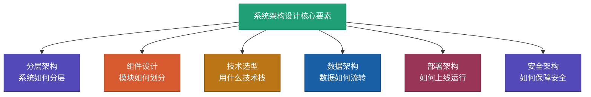

### AI时代架构设计的变化

| 维度 | 传统架构设计 | AI时代架构设计 |
|------|------------|--------------|
| **设计方式** | 架构师凭经验手动设计 | AI辅助生成方案 + 人工决策 |
| **技术选型** | 团队讨论、调研对比 | AI快速评估多方案 + 人工判断 |
| **原型验证** | 手写Demo验证 | AI快速生成原型 + 压测验证 |
| **文档输出** | 手动编写架构文档 | AI生成文档 + 人工审核 |
| **代码实现** | 团队分工手写代码 | AI生成代码 + 人工审查 |
| **核心能力** | 编码 + 经验 | 架构思维 + AI协作 |
| **设计周期** | 数周到数月 | 数天到数周 |

### 架构设计必备技能

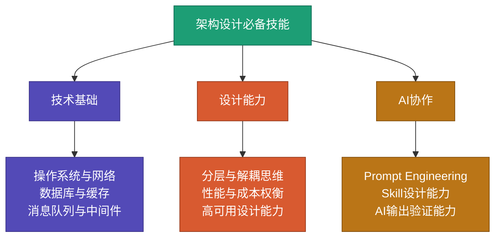

```
架构师必备的技术栈知识：

基础层：
□ 操作系统原理（进程、线程、内存、IO模型）
□ 计算机网络（TCP/UDP、HTTP/HTTPS、DNS、CDN）
□ 数据结构与算法（复杂度分析、常用数据结构）

中间件层：
□ 数据库（MySQL/PostgreSQL、MongoDB、分库分表）
□ 缓存（Redis、本地缓存、多级缓存策略）
□ 消息队列（Kafka、RocketMQ、RabbitMQ）
□ 搜索引擎（Elasticsearch、OpenSearch）

架构层：
□ 微服务架构（服务拆分、服务治理、API网关）
□ 分布式系统（CAP理论、一致性协议、分布式事务）
□ 容器化与编排（Docker、Kubernetes）
□ CI/CD与DevOps

AI协作层：
□ Prompt Engineering（结构化提示词设计）
□ AI Agent工作流设计（任务分解、指令编排）
□ AI输出质量验证（代码审查、性能验证）
```

---

## 二、架构设计的核心原则与思维模型

### 6大架构设计原则

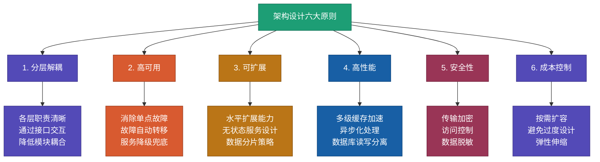

**各原则详解**：

```
原则1：分层解耦
核心：每一层只关心自己的职责，通过定义好的接口与其他层交互。
好处：修改一层不影响其他层，易于维护和替换。
实践：展示层 / 业务逻辑层 / 数据访问层 / 基础设施层

原则2：高可用
核心：系统在部分组件故障时仍能对外提供服务。
好处：减少宕机时间，提升用户体验。
实践：主从复制、多活部署、熔断降级、健康检查

原则3：可扩展
核心：系统能够通过增加资源来应对流量增长。
好处：避免推倒重来，降低扩展成本。
实践：无状态服务、水平扩展、数据分片、读写分离

原则4：高性能
核心：在满足功能需求的前提下，尽可能提升响应速度和吞吐量。
好处：用户体验好、资源利用率高。
实践：缓存策略、异步处理、连接池、批量操作

原则5：安全性
核心：保护系统和数据不被非法访问和篡改。
好处：满足合规要求，保护用户隐私。
实践：HTTPS、JWT/OAuth、SQL注入防护、XSS防护

原则6：成本控制
核心：在满足业务需求的前提下，最小化基础设施和人力成本。
好处：公司活得更久、产品更有竞争力。
实践：按需扩容、弹性伸缩、合理选型、避免过度设计
```

### 架构设计思维模型

```
自顶向下（推荐）：
从全局出发，逐步细化。先定义整体架构分层，再逐层设计细节。
适合：新系统设计、大型系统重构

自底向上：
从具体组件出发，逐步组合成系统。先确定技术组件，再组装成架构。
适合：技术预研、小型系统快速搭建

实践中通常结合使用：
自顶向下定义整体框架 → 自底向上验证技术可行性 → 迭代调整
```

### 架构设计流程

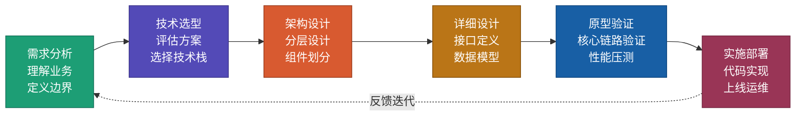

**每个阶段的关键输出**：

| 阶段 | 关键活动 | 输出物 |
|------|---------|-------|
| 需求分析 | 理解业务目标、定义功能边界、估算规模 | 需求文档、规模估算 |
| 技术选型 | 评估候选技术、对比优劣、团队匹配 | 技术选型报告 |
| 架构设计 | 分层设计、组件划分、数据流设计 | 架构设计文档、架构图 |
| 详细设计 | 接口定义、数据模型、算法选择 | API文档、数据库设计 |
| 原型验证 | 核心功能验证、性能压测 | 验证报告 |
| 实施部署 | 编码实现、测试、上线 | 可运行系统 |

---

## 三、Web系统架构设计

### Web系统架构全景

Web系统是最常见的系统类型，从简单的官网到复杂的电商平台，都属于Web系统。

#### 典型Web系统分层架构

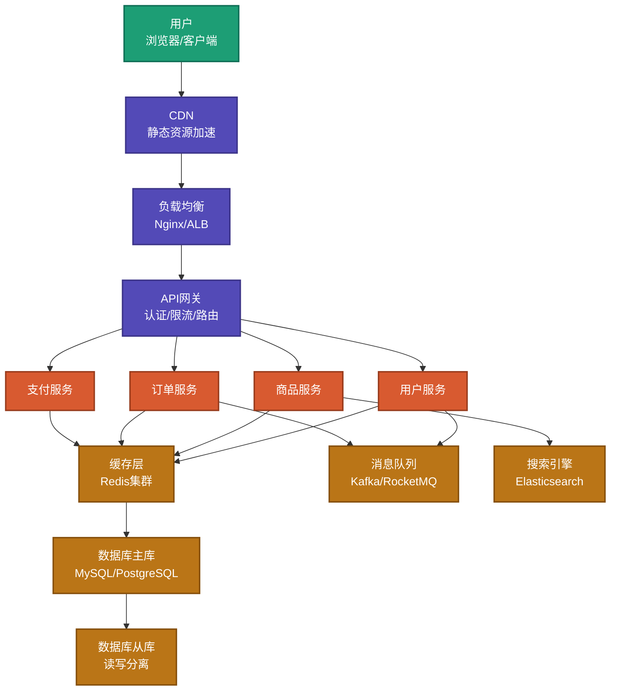

### 各层职责详解

```
接入层（用户 → CDN → 负载均衡 → API网关）：
- CDN：缓存静态资源（JS/CSS/图片/视频），降低延迟
- 负载均衡：将请求分发到多台服务器，支持高并发
- API网关：统一入口，负责认证、限流、路由、熔断

业务服务层（微服务集群）：
- 按业务域拆分：用户、商品、订单、支付等
- 每个服务独立部署、独立扩展
- 通过RPC或HTTP相互调用

数据层（缓存 + 数据库 + 消息队列 + 搜索）：
- 缓存：Redis集群，加速热数据访问
- 数据库：MySQL主从，写主读从
- 消息队列：异步解耦，削峰填谷
- 搜索引擎：全文检索，支持复杂查询
```

### Web系统技术选型参考

| 组件 | 推荐技术 | 适用场景 | 备选方案 |
|------|---------|---------|---------|
| 负载均衡 | Nginx | 通用Web系统 | HAProxy、云ALB |
| API网关 | Kong / Spring Cloud Gateway | 微服务架构 | Zuul、Traefik |
| 后端框架 | Spring Boot(Java) / Gin(Go) | 高性能业务系统 | FastAPI(Python)、NestJS(Node) |
| 前端框架 | React / Vue | 动态交互页面 | Svelte、Angular |
| 数据库 | MySQL / PostgreSQL | 事务型业务 | TiDB(分布式) |
| 缓存 | Redis | 通用缓存 | Memcached |
| 消息队列 | Kafka | 高吞吐场景 | RocketMQ、RabbitMQ |
| 搜索 | Elasticsearch | 全文检索 | OpenSearch |
| 容器编排 | Kubernetes | 微服务部署 | Docker Swarm |

### AI时代的Web架构设计

```
AI如何辅助Web架构设计：

1. 技术选型评估：
   ✓ 告诉AI业务规模和约束，让AI对比多种方案的优劣
   ✓ AI根据团队经验和业务场景推荐最合适的技术栈

2. 架构方案生成：
   ✓ 用SCALE框架描述系统约束，AI生成完整架构方案
   ✓ AI输出架构图、组件清单、数据流设计

3. 代码脚手架生成：
   ✓ AI根据架构设计生成项目骨架代码
   ✓ 包括目录结构、配置文件、基础接口

4. 性能优化建议：
   ✓ AI分析架构瓶颈，提出优化方案
   ✓ 包括缓存策略、数据库索引、异步处理建议
```

### Web系统架构实施步骤

```
第1步：需求分析与规模估算
□ 确定核心业务功能
□ 估算DAU、QPS、数据量
□ 明确性能和可用性要求

第2步：技术选型
□ 根据团队经验选择语言和框架
□ 根据数据规模选择数据库方案
□ 根据并发要求选择缓存和MQ

第3步：架构设计
□ 画出分层架构图
□ 定义各服务的职责和边界
□ 设计数据流向和接口协议

第4步：详细设计与原型验证
□ 设计数据库表结构
□ 定义API接口规范
□ 用AI生成核心模块原型代码并验证

第5步：实施部署
□ AI生成项目骨架和基础代码
□ 配置CI/CD流水线
□ 灰度发布 → 全量上线
```

---

## 四、App系统架构设计

### 移动端架构演进

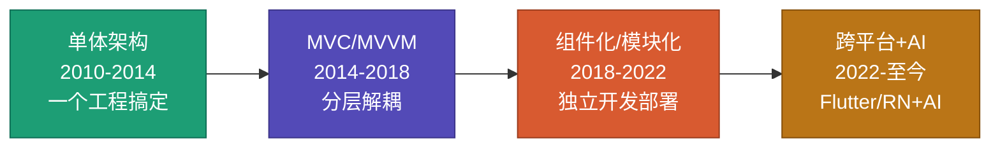

### App分层架构设计

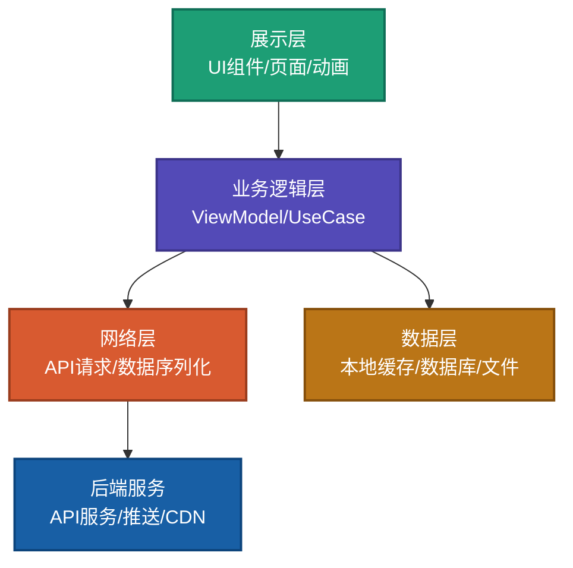

**各层职责**：

```
展示层（UI Layer）：
- 负责页面展示、用户交互、动画效果
- 技术：原生(SwiftUI/Jetpack Compose)、跨平台(Flutter/React Native)
- 原则：只做展示，不含业务逻辑

业务逻辑层（Business Layer）：
- 负责业务规则处理、状态管理
- 技术：ViewModel(MVVM)、BLoC(Flutter)、Redux(RN)
- 原则：可测试、可复用、平台无关

网络层（Network Layer）：
- 负责与后端通信、数据序列化/反序列化
- 技术：Retrofit(Android)、Alamofire(iOS)、Dio(Flutter)
- 原则：统一封装、错误处理、请求重试

数据层（Data Layer）：
- 负责本地数据存储和缓存管理
- 技术：SQLite、SharedPreferences、Hive(Flutter)
- 原则：离线可用、数据同步、缓存策略
```

### App前后端分离架构

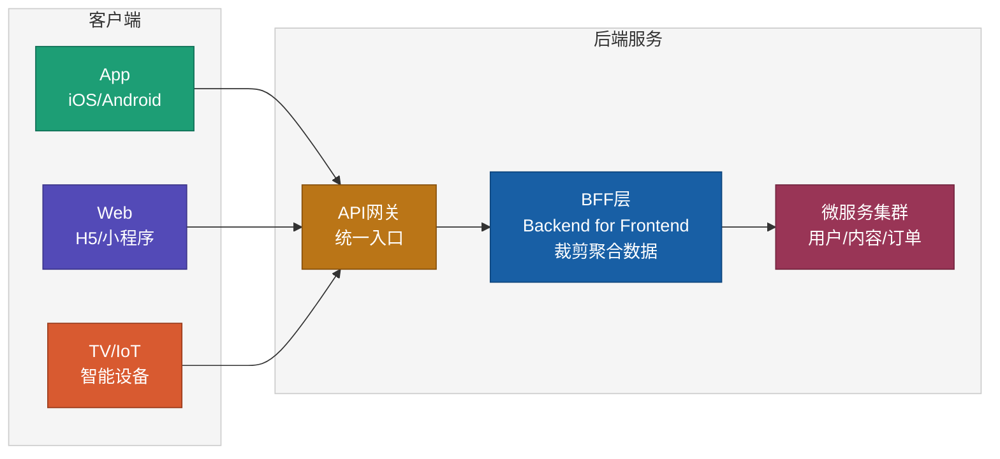

**BFF层的作用**：

```
为什么需要BFF（Backend for Frontend）？

问题：不同终端对数据的需求不同
- App需要精简数据（省流量、省电量）
- Web需要完整数据（带SEO信息）
- TV需要大图数据（大屏展示）

解决：BFF层为每种终端裁剪和聚合数据
- App BFF：精简字段、压缩图片
- Web BFF：完整字段、SEO元数据
- TV BFF：大图资源、简化交互
```

### App技术选型参考

| 维度 | 方案 | 优势 | 劣势 | 适用场景 |
|------|------|------|------|---------|
| 原生开发 | Swift/Kotlin | 性能最佳、体验最好 | 双端开发成本高 | 高性能要求的核心App |
| 跨平台 | Flutter | 一套代码、高性能渲染 | 包体积较大 | 中大型App、快速迭代 |
| 跨平台 | React Native | 生态丰富、热更新 | 性能不如Flutter | 中小型App、Web团队转型 |
| 小程序 | 微信/支付宝 | 无需安装、获客成本低 | 能力受限 | 轻量级应用、电商 |
| H5 | Vue/React | 跨平台、即时更新 | 性能最弱 | 活动页、非核心功能 |

### AI时代的App架构设计

```
AI如何改变App架构：

1. AI驱动UI生成：
   ✓ 设计稿 → AI自动生成UI代码
   ✓ 自然语言描述 → AI生成页面布局
   ✓ 工具：Figma AI、v0.dev、Claude Code

2. 端智能（On-Device AI）：
   ✓ 在设备端运行轻量AI模型
   ✓ 应用：人脸识别、语音助手、图像增强
   ✓ 框架：Core ML(iOS)、ML Kit(Android)、TensorFlow Lite

3. 智能推荐与个性化：
   ✓ 根据用户行为实时调整内容展示
   ✓ 个性化UI布局和功能排序
   ✓ AI预测用户下一步操作，提前预加载

4. AI辅助测试：
   ✓ AI生成测试用例，覆盖边界场景
   ✓ AI自动化UI测试，识别兼容性问题
   ✓ AI分析崩溃日志，定位根因
```

### App架构实施步骤

```
第1步：确定技术路线
□ 选择原生/跨平台/混合方案
□ 确定前后端分离策略
□ 确定是否需要BFF层

第2步：架构分层设计
□ 定义展示层、业务层、数据层的职责
□ 设计模块化/组件化方案
□ 定义模块间的通信机制

第3步：核心技术方案
□ 网络层封装（请求、缓存、重试）
□ 本地存储方案（SQLite/KV存储）
□ 推送方案（APNs/FCM/厂商通道）
□ 热更新方案（CodePush/自建）

第4步：AI赋能设计
□ 确定端智能能力（模型选择、推理框架）
□ 设计AI推荐接入方案
□ 规划AI辅助测试流程

第5步：构建与发布
□ 搭建CI/CD流水线（打包、测试、分发）
□ 设计灰度发布策略
□ 搭建崩溃监控和性能监控
```

---

## 五、大数据系统架构设计

### 大数据系统全景架构

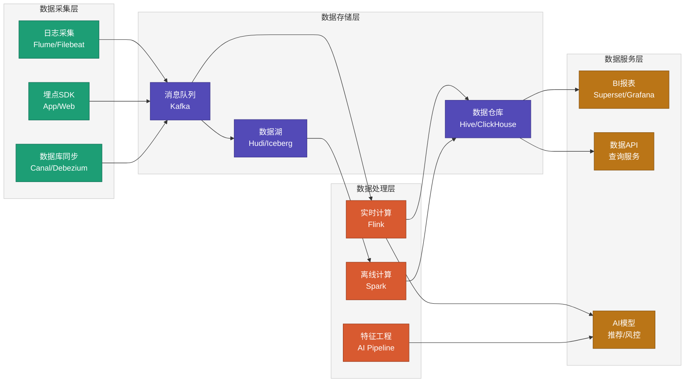

### Lambda架构 vs Kappa架构

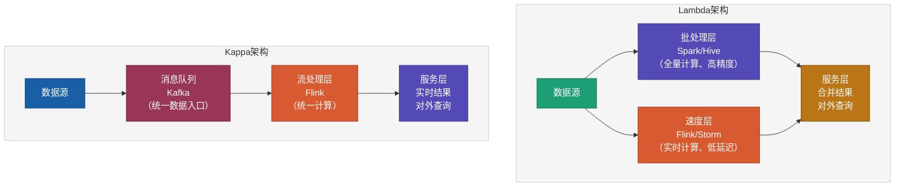

**如何选择**：

| 维度 | Lambda架构 | Kappa架构 |
|------|-----------|----------|
| **复杂度** | 高（维护两套计算逻辑） | 低（统一流处理） |
| **数据精度** | 高（批处理保证精确） | 中（依赖流处理精度） |
| **延迟** | 批处理层延迟高 | 全链路低延迟 |
| **适用场景** | 数据精度要求高（财务、审计） | 实时性要求高（推荐、风控） |
| **维护成本** | 高 | 低 |

### 大数据技术选型参考

| 组件 | 推荐技术 | 适用场景 | 备选方案 |
|------|---------|---------|---------|
| 消息队列 | Kafka | 高吞吐数据管道 | Pulsar |
| 实时计算 | Flink | 流式计算、CEP | Spark Streaming |
| 离线计算 | Spark | 批量ETL、数据分析 | Hive MR |
| 数据湖 | Apache Hudi | 增量更新、时间旅行 | Iceberg、Delta Lake |
| OLAP | ClickHouse | 实时分析查询 | Doris、StarRocks |
| 数据仓库 | Hive | 离线数仓 | Presto/Trino |
| 调度系统 | Apache DolphinScheduler | 任务调度编排 | Airflow |
| 数据质量 | Great Expectations | 数据校验 | dbt tests |

### AI时代的大数据架构

```
AI如何改变大数据架构：

1. AI模型训练平台：
   ✓ 集成ML Pipeline（数据预处理 → 特征工程 → 模型训练 → 模型服务）
   ✓ 支持自动化超参数调优
   ✓ 框架：MLflow、Kubeflow、Ray

2. 特征工程自动化：
   ✓ AI自动发现和生成有效特征
   ✓ 特征存储（Feature Store）管理特征版本
   ✓ 工具：Feast、Tecton

3. 智能数据治理：
   ✓ AI自动识别数据质量问题
   ✓ AI辅助数据分类和标签管理
   ✓ AI驱动的数据血缘追踪

4. 自然语言数据分析：
   ✓ 用自然语言查询数据（Text-to-SQL）
   ✓ AI自动生成数据报表和洞察
   ✓ AI辅助数据可视化设计
```

### 大数据系统实施步骤

```
第1步：数据源梳理
□ 盘点所有业务数据源（数据库、日志、埋点）
□ 确定数据量级和增长速度
□ 定义数据质量标准

第2步：架构选型
□ 根据实时性要求选择Lambda或Kappa架构
□ 根据数据量选择存储方案（数据湖/数据仓库）
□ 根据查询场景选择OLAP引擎

第3步：数据管道搭建
□ 搭建数据采集链路（Kafka + Flink/Spark）
□ 设计数据分层模型（ODS → DWD → DWS → ADS）
□ 实现数据同步和ETL流程

第4步：AI能力集成
□ 搭建特征工程平台
□ 集成模型训练和推理Pipeline
□ 实现AI模型的在线服务

第5步：运维与治理
□ 搭建数据质量监控
□ 实现数据血缘追踪
□ 建立数据安全和权限管理
```

---

## 六、AI时代的架构设计新范式

### AI如何改变架构设计流程

```mermaid
graph TD
    subgraph Traditional["传统架构设计流程"]
        T1["架构师凭经验设计<br/>（数周）"] --> T2["团队评审讨论<br/>（数天）"]
        T2 --> T3["手写设计文档<br/>（数天）"]
        T3 --> T4["团队分工编码<br/>（数周-数月）"]
    end

    subgraph AI["AI时代架构设计流程"]
        A1["人定义需求和约束<br/>BEAT+SCALE框架<br/>（数小时）"] --> A2["AI生成多种架构方案<br/>（数分钟）"]
        A2 --> A3["人评估选择+AI优化<br/>（数小时）"]
        A3 --> A4["AI生成代码骨架<br/>人审查验证<br/>（数天）"]
    end

    style T1 fill:#1D9E75,stroke:#0F6E56,color:#ffffff
    style T2 fill:#534AB7,stroke:#3C3489,color:#ffffff
    style T3 fill:#D85A30,stroke:#993C1D,color:#ffffff
    style T4 fill:#BA7517,stroke:#854F0B,color:#ffffff
    style A1 fill:#185FA5,stroke:#0C447C,color:#ffffff
    style A2 fill:#993556,stroke:#72243E,color:#ffffff
    style A3 fill:#D85A30,stroke:#993C1D,color:#ffffff
    style A4 fill:#BA7517,stroke:#854F0B,color:#ffffff
    style Traditional fill:#F5F5F5,stroke:#CCCCCC,color:#333333
    style AI fill:#F5F5F5,stroke:#CCCCCC,color:#333333
```

### AI辅助架构设计的实践方法

#### 方法1：用AI做技术选型评估

```
✗ 传统方式：
  花2周调研对比3种消息队列的差异

✓ AI方式：
  Prompt：
  "我需要为一个日活1000万的视频平台选择消息队列。
  要求：
  - 峰值吞吐：100万消息/秒
  - 消息延迟：<100ms
  - 可靠性：不允许消息丢失
  - 团队熟悉Java
  请对比Kafka、RocketMQ、Pulsar三种方案的优劣，
  从性能、可靠性、运维成本、学习成本四个维度评估。"

  → AI在5分钟内给出详细对比表和推荐方案
  → 人验证关键数据，做出最终决策
```

#### 方法2：用AI生成架构方案

```
✗ 传统方式：
  架构师花1-2周画架构图和写文档

✓ AI方式：
  用SCALE框架描述约束，AI生成完整方案：

  "请为以下系统设计架构方案：
  S - Scale：日活5000万，峰值并发50万，视频库1000万
  C - Constraints：响应<200ms，可用性>99.9%，成本<500万/月
  A - Architecture：请设计分层架构
  L - Limitations：设计降级策略
  E - Evaluation：定义核心监控指标

  请输出：
  1. 分层架构图（mermaid格式）
  2. 各层组件清单和技术选型
  3. 数据流向图
  4. 部署架构图
  5. 容量估算"

  → AI在10分钟内生成完整架构文档
  → 人审核调整，聚焦于关键决策点
```

#### 方法3：用AI生成代码脚手架

```
✗ 传统方式：
  手动创建项目结构、配置文件、基础代码

✓ AI方式：
  "基于以下架构设计，生成Spring Boot微服务项目骨架：
  - 服务列表：user-service, video-service, recommend-service
  - 公共组件：API网关、统一异常处理、日志链路追踪
  - 数据库：MySQL + Redis
  - 消息队列：Kafka
  - 部署：Docker + K8S

  请生成：
  1. 多模块Maven项目结构
  2. 各服务的基础配置
  3. 公共组件的封装代码
  4. Docker和K8S部署文件
  5. CI/CD流水线配置"

  → AI生成完整项目骨架
  → 团队在此基础上填充业务代码
```

### AI Agent架构设计工作流


**各环节的AI协作方式**：

| 环节 | 人的职责 | AI的职责 |
|------|---------|---------|
| 业务需求 | 理解业务本质、定义目标 | 协助结构化描述、发现遗漏 |
| 系统设计 | 定义约束、做权衡决策 | 生成方案、估算容量 |
| 架构设计 | 审核方案、做最终选择 | 生成架构图、技术选型 |
| 算法选型 | 指导算法方向、验证正确性 | 实现算法、优化性能 |
| 代码实现 | 审查代码、验证质量 | 生成代码、编写测试 |
| 验证部署 | 监控验收、做上线决策 | 自动化测试、生成报告 |

---

## 七、开发者的转变与新技能

### 传统开发者 vs AI时代开发者

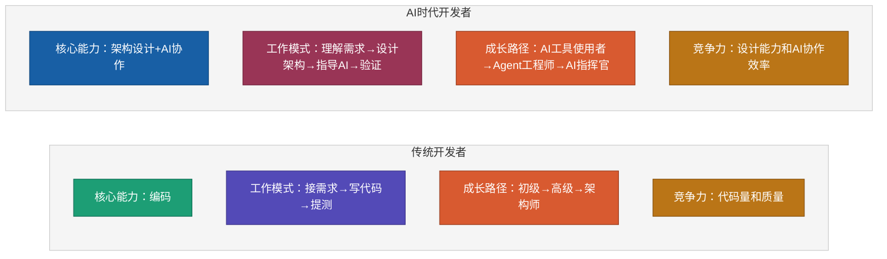

### AI时代开发者必备5大新技能

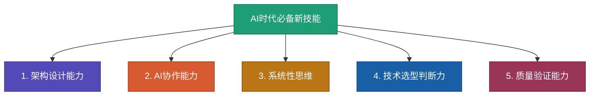

**技能1：架构设计能力**

```
从编码到设计的转变：

传统：
- 拿到需求 → 直接写代码 → 遇到问题再改

AI时代：
- 拿到需求 → 先设计架构 → 指导AI实现 → 验证结果

需要掌握：
□ 分层架构设计（接入层/业务层/数据层）
□ 微服务拆分策略（按业务域/按数据/按变更频率）
□ 数据架构设计（存储选型/缓存策略/数据流向）
□ 部署架构设计（容器化/编排/监控）
```

**技能2：AI协作能力**

```
如何高效地与AI协作：

Prompt Engineering：
- 用BEAT框架描述需求
- 用SCALE框架定义约束
- 结构化、量化、具体化

Skill设计：
- 将常见任务沉淀为可复用的Skill模板
- 定义输入、处理流程、输出
- 持续优化Skill质量

AI输出验证：
- 检查AI生成代码的正确性
- 验证性能是否满足要求
- 评估架构方案的合理性
```

**技能3：系统性思维**

```
从局部到全局的视角转变：

不只看代码：看到整个系统的架构
不只看功能：看到性能、可用性、安全性
不只看当前：看到未来的扩展和演进
不只看技术：看到业务、成本、团队

系统性思维的实践：
□ 画系统全景图，标注各组件的关键指标
□ 分析各组件之间的依赖关系
□ 识别系统瓶颈和单点故障
□ 设计容错和降级方案
□ 规划监控和告警体系
```

**技能4：技术选型判断力**

```
AI能给出方案，但决策权在人手里：

技术选型的判断标准：
1. 业务适配性（40%）：技术是否适合业务场景？
2. 团队经验（30%）：团队是否有能力驾驭？
3. 生态成熟度（20%）：社区、文档、最佳实践是否完善？
4. 成本因素（10%）：许可成本、运维成本、学习成本

常见的选型误区：
✗ 盲目追新：选最新最潮的技术
✗ 过度设计：中小系统用了大厂架构
✗ 忽视团队：选了没人会用的技术
✗ 不看成本：开源不等于免费
```

**技能5：质量验证能力**

```
AI生成的代码不等于正确的代码：

验证清单：
□ 功能正确性：是否实现了预期功能？
□ 性能满足：是否满足延迟和吞吐要求？
□ 安全性：是否有注入、XSS等漏洞？
□ 可维护性：代码结构是否清晰？
□ 边界条件：异常场景是否处理？
□ 资源消耗：CPU、内存、磁盘是否合理？

关键认知：
AI生成代码的速度是人的10-20倍，
但验证代码的速度不能打折——
一个未验证的bug上线，可能造成的损失比节省的时间大100倍。
```

### 学习路径建议

```
阶段1：基础建设（1-3个月）
□ 学习系统架构设计基础（分层、微服务、分布式）
□ 学习SCALE框架，掌握系统设计方法
□ 熟练使用AI编程工具（Claude Code、Cursor等）
□ 参与小型系统的架构设计评审

阶段2：实战深化（3-6个月）
□ 参与2-3个真实项目的架构设计
□ 学会用AI辅助技术选型和方案评估
□ 积累Web/App/大数据三类系统的架构经验
□ 建立自己的Skill模板库

阶段3：能力升级（6-12个月）
□ 主导中大型系统的架构设计
□ 指导团队的架构设计规范
□ 深化AI协作能力，形成自己的方法论
□ 关注新技术趋势，持续更新知识库
```

---

## 八、实战案例：视频播放系统架构设计

> 以爱奇艺、腾讯视频、抖音、快手等视频平台为参考，完整讲解一个视频播放系统的架构设计全过程。

### 8.1 需求分析与边界定义

#### 核心功能

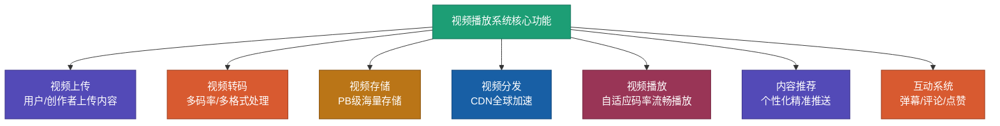

#### 规模估算（以类抖音短视频平台为例）

```
用户规模：
- 注册用户：5亿
- 日活用户（DAU）：2亿
- 同时在线：5000万
- 峰值并发：500万

内容规模：
- 视频总量：50亿条
- 日新增视频：500万条
- 平均视频时长：30秒（短视频）/ 30分钟（长视频）

流量规模：
- 日播放量：100亿次
- QPS（播放请求）：200万/秒（峰值）
- 日均流量：50PB（出带宽）

存储规模：
- 视频存储总量：100PB+
- 日新增存储：500TB
- 用户数据：50TB
- 日志数据：100TB/天
```

#### 性能要求

```
播放体验：
- 首帧时间（启播延迟）：<1秒
- 卡顿率：<1%（百次播放不超过1次卡顿）
- 画质支持：480P / 720P / 1080P / 4K / 8K
- 自适应码率切换延迟：<2秒

系统指标：
- 可用性：>99.99%（年宕机<53分钟）
- API响应时间：<200ms（P99）
- 视频转码延迟：<5分钟（短视频）/ <30分钟（长视频）

成本控制：
- CDN带宽成本：按需优化
- 存储成本：冷热分层
- 计算成本：弹性伸缩
```

### 8.2 整体架构设计

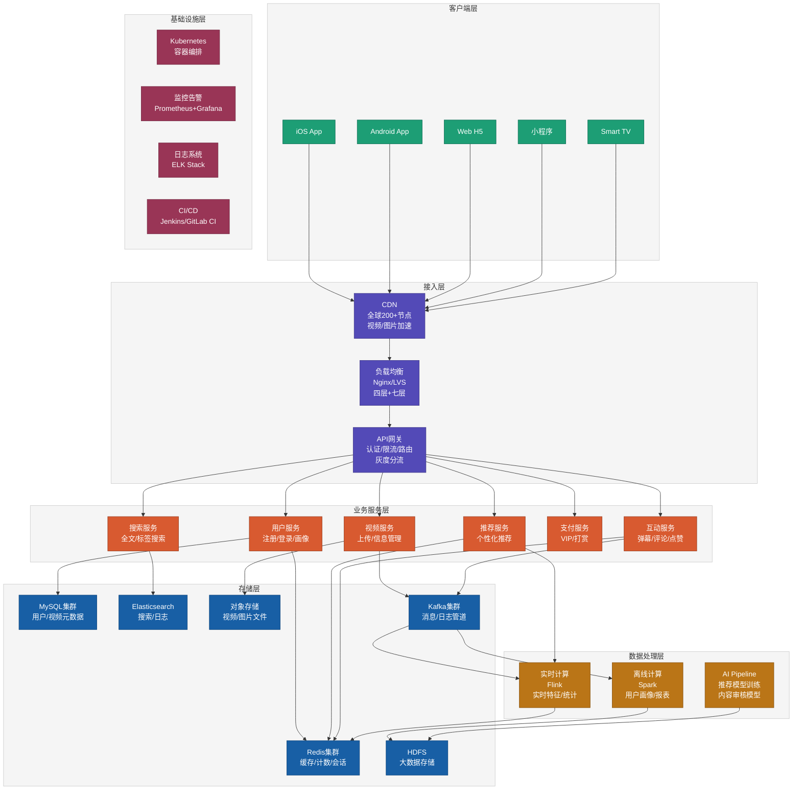

### 8.3 核心子系统详细设计

#### 子系统1：视频上传与转码系统


**关键设计**：

```
上传方案：
- 分片上传：大文件切成1MB-5MB小片并行上传
- 断点续传：记录已上传分片，中断后可恢复
- 秒传：计算文件MD5，相同文件跳过上传
- 上传加速：就近上传到CDN边缘节点，再回源

转码方案：
- 多码率输出：360P / 480P / 720P / 1080P / 4K
- 编码格式：H.264（兼容性） + H.265（省带宽） + AV1（未来）
- 自适应：根据视频内容（动作片/静态画面）调整码率
- 分布式转码：将视频按时间分段，多台机器并行转码

AI智能转码：
- 场景检测：AI识别视频内容类型（运动/风景/人像）
- 动态码率：运动场景给更高码率，静态场景降低码率
- 画质增强：AI超分辨率，低分辨率视频提升画质
- 编码参数优化：AI根据内容自动选择最优编码参数

容量估算：
- 日新增500万视频 × 平均30秒 × 5种码率
- 转码计算量：约需500台16核服务器（弹性伸缩）
- 日新增存储：500万 × 30秒 × 5种 × 平均5MB = 375TB/天
```

#### 子系统2：视频存储与分发系统

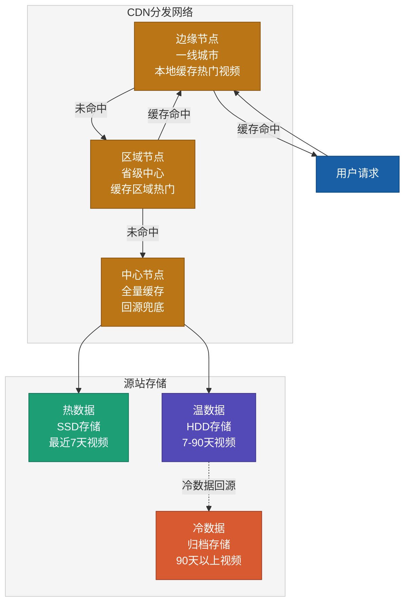

**关键设计**：

```
存储分层策略：
- 热数据（7天内）：SSD存储，毫秒级访问，约10PB
- 温数据（7-90天）：HDD存储，秒级访问，约50PB
- 冷数据（90天+）：归档存储，分钟级访问，约100PB+
- 自动迁移：根据播放热度自动在层级间迁移

CDN分发策略：
- 三级缓存：边缘节点 → 区域节点 → 中心节点
- 智能调度：根据用户位置、网络质量选择最佳节点
- 预热机制：热门视频提前推送到边缘节点
- 缓存命中率目标：>95%（降低回源带宽成本）

多码率自适应（HLS/DASH）：
- 将视频切成2-10秒的小段（TS/MP4片段）
- 每段提供多种码率版本
- 客户端根据网络带宽动态选择最优码率
- 码率切换延迟<2秒
```

#### 子系统3：视频播放系统


**关键设计**：

```
首帧优化（启播<1秒）：
1. 预加载：用户滑动到视频时，提前下载首个片段
2. 首帧缓存：CDN边缘节点缓存每个视频的首帧数据
3. 低码率快启：先用低码率快速启动，再逐步提升
4. DNS预解析：提前解析CDN域名，减少DNS查询时间
5. 连接复用：HTTP/2多路复用，减少连接建立时间

自适应码率算法（ABR）：
- 基于带宽估计：测量实际下载速度，选择匹配码率
- 基于缓冲区：缓冲充足时升码率，缓冲不足时降码率
- AI预测：用机器学习预测网络趋势，提前调整
- 惩罚机制：频繁切换码率会降低体验，需要平滑

防卡顿策略：
- 缓冲区管理：维持3-5秒缓冲，防止网络波动
- 快速降级：网络恶化时<500ms内降到低码率
- 多源切换：当前CDN节点慢时，自动切换到备用节点
- 边缘计算：在CDN边缘节点做实时转码和调整
```

#### 子系统4：推荐系统

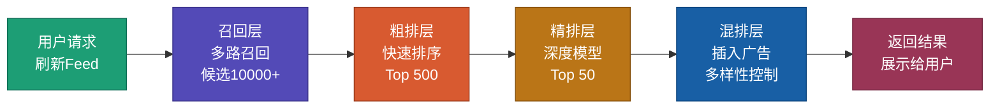

**关键设计**：

```
多路召回（从50亿视频中选出10000+候选）：
- 协同过滤召回：基于用户行为相似性
- 内容召回：基于视频标签和特征相似性
- 热度召回：全网热门视频
- 关注召回：关注的创作者最新内容
- 地域召回：同城/附近的热门内容

粗排（从10000+到500）：
- 轻量级模型：双塔模型（用户塔+视频塔）
- 向量检索：FAISS/Milvus快速相似度计算
- 延迟要求：<20ms

精排（从500到50）：
- 深度模型：DIN/DIEN等注意力模型
- 多目标优化：点击率 + 完播率 + 互动率
- 延迟要求：<100ms

混排（从50到最终展示）：
- 插入广告：贪心插入，平衡用户体验和广告收入
- 多样性控制：相邻视频不重复品类
- 运营干预：置顶/加权特定内容

AI算法选择（引用算法思想）：
- 召回层：搜索策略（最近邻搜索/倒排索引）
- 粗排层：贪心算法（快速筛选最优候选）
- 精排层：动态规划思想（多目标权衡优化）
- 混排层：贪心+约束（在约束下最大化收益）
```

#### 子系统5：互动系统（弹幕/评论/点赞）

```mermaid
graph TD
    A["用户发送弹幕/评论/点赞"]
    A --> B["API网关<br/>限流+鉴权"]
    B --> C["写入Kafka<br/>异步处理"]
    C --> D["消费者集群"]
    D --> D1["弹幕服务<br/>WebSocket推送<br/>实时展示"]
    D --> D2["评论服务<br/>写入MySQL<br/>审核过滤"]
    D --> D3["计数服务<br/>Redis原子计数<br/>点赞/收藏"]

    style A fill:#1D9E75,stroke:#0F6E56,color:#ffffff
    style B fill:#534AB7,stroke:#3C3489,color:#ffffff
    style C fill:#D85A30,stroke:#993C1D,color:#ffffff
    style D fill:#BA7517,stroke:#854F0B,color:#ffffff
    style D1 fill:#185FA5,stroke:#0C447C,color:#ffffff
    style D2 fill:#993556,stroke:#72243E,color:#ffffff
    style D3 fill:#534AB7,stroke:#3C3489,color:#ffffff
```

**关键设计**：

```
弹幕系统（高并发实时推送）：
- 连接：WebSocket长连接，支持百万级并发
- 消息分发：按房间/视频分组，广播给在线用户
- 削峰：弹幕先写入Kafka，消费端控制发送速率
- 存储：热弹幕缓存在Redis，历史弹幕存MongoDB

点赞/收藏计数（高并发写入）：
- Redis原子操作：INCR/DECR保证计数准确
- 异步持久化：定期将Redis计数同步到MySQL
- 防刷：用户ID+视频ID做去重，限制频率

评论系统（读多写少）：
- 写入：先写MySQL，再刷新缓存
- 读取：Redis缓存热门评论，分页加载
- 审核：AI内容审核 → 人工复审 → 展示
- 排序：按热度（点赞数）+ 时间排序
```

### 8.4 AI赋能的架构优化

```mermaid
graph TD
    A["AI赋能视频平台"]

    A --> B["AI智能转码<br/>根据内容自动<br/>选择编码参数"]
    A --> C["AI推荐算法<br/>深度学习模型<br/>实时特征计算"]
    A --> D["AI内容审核<br/>自动识别<br/>违规内容"]
    A --> E["AI画质增强<br/>超分辨率<br/>HDR处理"]

    B --> B1["节省30%带宽成本"]
    C --> C1["提升用户停留时长50%"]
    D --> D1["审核效率提升100倍"]
    E --> E1["低成本提供高画质"]

    style A fill:#1D9E75,stroke:#0F6E56,color:#ffffff
    style B fill:#534AB7,stroke:#3C3489,color:#ffffff
    style C fill:#D85A30,stroke:#993C1D,color:#ffffff
    style D fill:#BA7517,stroke:#854F0B,color:#ffffff
    style E fill:#185FA5,stroke:#0C447C,color:#ffffff
    style B1 fill:#993556,stroke:#72243E,color:#ffffff
    style C1 fill:#BA7517,stroke:#854F0B,color:#ffffff
    style D1 fill:#534AB7,stroke:#3C3489,color:#ffffff
    style E1 fill:#D85A30,stroke:#993C1D,color:#ffffff
```

**AI智能转码**：

```
传统转码：固定码率，不区分内容
AI转码：根据视频内容动态调整

具体应用：
1. 场景检测：AI识别视频场景类型
   - 运动场景（体育/游戏）：高码率，保留运动细节
   - 静态场景（风景/PPT）：低码率，画质不损失
   - 人像场景（直播/采访）：中码率，重点保护人脸区域

2. 感知编码：AI评估人眼感知差异
   - 人眼不敏感的区域降低码率
   - 人眼关注区域（人脸、文字）提高码率
   - 总体节省20-40%带宽

3. 编码参数自动优化：
   - AI模型预测不同编码参数下的VMAF分数
   - 选择在目标质量下码率最低的参数组合
```

**AI内容审核**：

```
审核流程：
上传视频 → AI一审 → 机审通过/拦截/待审 → 人工复审 → 上线/下架

AI审核能力：
- 涉政检测：识别敏感人物、标语、场景
- 涉黄检测：识别不当暴露内容
- 暴力检测：识别打斗、血腥画面
- 版权检测：视频指纹比对，识别盗版内容
- 广告检测：识别软广、二维码、联系方式

审核效率：
- AI审核速度：1秒/条（GPU集群）
- 日审核量：500万条/天
- AI准确率：>95%（剩余5%人工复审）
- 人工复审量：从500万降到25万条/天
```

### 8.5 部署与运维架构

```mermaid
graph TD
    subgraph DC1["机房A（主）"]
        K8S_A["K8S集群<br/>业务服务"]
        DB_A["数据库主库<br/>MySQL Master"]
        REDIS_A["Redis主集群"]
    end

    subgraph DC2["机房B（备）"]
        K8S_B["K8S集群<br/>业务服务"]
        DB_B["数据库备库<br/>MySQL Slave"]
        REDIS_B["Redis备集群"]
    end

    subgraph CDN_Layer["CDN层"]
        CDN_G["全球CDN节点<br/>200+节点"]
    end

    subgraph Monitor["监控体系"]
        PROM["Prometheus<br/>指标采集"]
        GRAF["Grafana<br/>可视化"]
        ALERT["AlertManager<br/>告警通知"]
        ELK_M["ELK Stack<br/>日志分析"]
    end

    CDN_G --> K8S_A
    CDN_G --> K8S_B
    DB_A --> DB_B
    REDIS_A --> REDIS_B
    K8S_A --> PROM
    K8S_B --> PROM
    PROM --> GRAF
    PROM --> ALERT

    classDef dc1 fill:#1D9E75,stroke:#0F6E56,color:#ffffff
    classDef dc2 fill:#534AB7,stroke:#3C3489,color:#ffffff
    classDef cdn fill:#D85A30,stroke:#993C1D,color:#ffffff
    classDef mon fill:#BA7517,stroke:#854F0B,color:#ffffff

    class K8S_A,DB_A,REDIS_A dc1
    class K8S_B,DB_B,REDIS_B dc2
    class CDN_G cdn
    class PROM,GRAF,ALERT,ELK_M mon

    style DC1 fill:#F5F5F5,stroke:#CCCCCC,color:#333333
    style DC2 fill:#F5F5F5,stroke:#CCCCCC,color:#333333
    style CDN_Layer fill:#F5F5F5,stroke:#CCCCCC,color:#333333
    style Monitor fill:#F5F5F5,stroke:#CCCCCC,color:#333333
```

**部署策略**：

```
多机房部署：
- 主机房（北京/上海）：承担主要流量和写请求
- 备机房（广州/深圳）：承担读请求和故障切换
- 数据同步：MySQL主从复制 + Redis数据同步
- 故障切换：DNS切换 + 自动故障转移，RTO<5分钟

灰度发布策略：
- 金丝雀发布：先发布到1%的Pod，观察指标
- 蓝绿发布：两套环境并行，一键切换
- A/B测试：按用户特征分流，对比效果
- 回滚：30秒内快速回滚到上一版本

监控告警体系：
- 基础监控：CPU/内存/磁盘/网络（Prometheus）
- 业务监控：QPS/延迟/错误率/成功率
- 用户体验监控：首帧时间/卡顿率/播放成功率
- 告警分级：P0（立即处理）→ P1（1小时内）→ P2（当天）
```

### 8.6 用AI工具辅助完成架构设计

以下展示如何用AI Agent逐步完成视频播放系统的架构设计：

**步骤1：用BEAT框架描述需求**

```
Prompt示例：

"我需要设计一个类似抖音的短视频平台系统。

B - Background：
- 目标市场：国内一二线城市年轻用户
- 竞品参考：抖音、快手
- 当前阶段：从0到1，首期MVP

E - Expectation：
- 首期目标DAU：1000万
- 用户日均使用时长：30分钟
- 视频播放卡顿率：<1%
- 首帧加载时间：<1秒

A - Action：
- 短视频录制、编辑、上传
- 个性化推荐信息流
- 点赞、评论、分享互动
- 创作者主页和粉丝体系

T - Test：
- 首期支持1000万DAU
- 峰值QPS 50万
- 视频库1亿条
- 存储10PB"
```

**步骤2：用SCALE框架让AI设计架构**

```
Prompt示例：

"基于上述需求，请用SCALE框架设计系统架构：

S - Scale：DAU 1000万，QPS 50万，视频1亿条，存储10PB
C - Constraints：首帧<1s，卡顿率<1%，可用性>99.9%，月成本<500万
A - Architecture：请设计完整的分层架构，包括接入层、业务服务层、数据层
L - Limitations：设计各层的降级方案
E - Evaluation：定义核心监控指标

请输出：
1. 系统分层架构图
2. 各层组件清单和技术选型
3. 核心子系统设计（上传转码、存储分发、播放、推荐）
4. 容量估算和服务器规划
5. 部署架构"
```

**步骤3：用算法思想指导AI优化**

```
Prompt示例：

"请优化推荐系统的架构设计，使用以下算法思想：

1. 召回层（搜索策略 + 分治思想）：
   - 多路并行召回（分治），各路独立，最后合并
   - 向量检索用FAISS/Milvus，O(log n)复杂度

2. 粗排层（贪心算法）：
   - 快速评分，贪心选择Top候选
   - 轻量级双塔模型，<20ms

3. 精排层（动态规划思想）：
   - 多目标权衡（点击率 × 完播率 × 互动率）
   - 深度模型精细排序，<100ms

4. 混排层（贪心 + 约束满足）：
   - 在广告收入和用户体验间贪心平衡
   - 满足多样性约束（相邻不同类别）

请基于这些算法思想，设计推荐系统的详细架构和数据流。"
```

**步骤4：让AI生成代码脚手架**

```
Prompt示例：

"基于上述架构设计，请生成以下代码脚手架：

1. 视频上传服务（Go + Gin）：
   - 分片上传API
   - 秒传检测（MD5校验）
   - 上传完成后发送Kafka消息

2. 转码服务（Python + FFmpeg）：
   - Kafka消费者
   - 多码率转码
   - 转码完成通知

3. 播放服务（Go + Gin）：
   - 播放地址生成（带鉴权防盗链）
   - 自适应码率选择
   - CDN调度

4. 推荐服务（Python + FastAPI）：
   - 多路召回
   - 粗排+精排
   - 结果缓存

每个服务请生成：项目结构、核心接口、配置文件、Dockerfile。"
```

---

## 九、总结

### 核心认知

**1. 架构设计是AI时代开发者的核心竞争力**

```
AI能写代码，但不能替你做架构决策。
- 选择MySQL还是MongoDB？AI可以对比，但决策在你
- 用微服务还是单体？AI可以分析，但判断靠经验
- 系统怎么扩展？AI可以建议，但权衡需要全局视角
```

**2. 三类系统的架构设计各有侧重**

| 系统类型 | 核心挑战 | 架构重点 | AI赋能方向 |
|---------|---------|---------|-----------|
| Web系统 | 高并发、低延迟 | 分层解耦、缓存策略 | AI辅助选型、生成脚手架 |
| App系统 | 多端适配、用户体验 | 前后端分离、BFF设计 | AI驱动UI、端智能 |
| 大数据系统 | 海量数据、实时处理 | 数据管道、计算框架 | AI特征工程、智能治理 |

**3. AI时代的架构设计 = 人做决策 + AI做执行**

```mermaid
graph LR
    A["人的职责<br/>理解需求<br/>定义约束<br/>做权衡决策<br/>验证质量"] --> B["AI的职责<br/>生成方案<br/>对比选型<br/>写代码<br/>跑测试"]
    B --> C["交付物<br/>可运行的系统<br/>完整的文档<br/>监控告警"]

    style A fill:#1D9E75,stroke:#0F6E56,color:#ffffff
    style B fill:#534AB7,stroke:#3C3489,color:#ffffff
    style C fill:#D85A30,stroke:#993C1D,color:#ffffff
```

### AI时代程序员的三层能力

> AI时代，掌握这三层能力，你就能驾驭AI，让AI替你打工。

```mermaid
graph TD
    A["AI时代程序员的三层能力"] --> B["第一层：需求描述工程师<br/>(What)"]
    A --> C["第二层：系统设计工程师<br/>(Scope)"]
    A --> D["第三层：算法思想工程师<br/>(How)"]

    B --> B1["能清晰理解业务<br/>用框架化语言描述问题<br/>发现隐需求和矛盾"]

    C --> C1["能定义系统边界<br/>进行容量规划和架构设计<br/>识别瓶颈和风险"]

    D --> D1["能用算法思想指导AI<br/>理解和选择最优算法<br/>验证AI生成的代码"]

    classDef root fill:#1D9E75,stroke:#0F6E56,color:#ffffff,stroke-width:2px
    classDef layer fill:#534AB7,stroke:#3C3489,color:#ffffff,stroke-width:1px
    classDef skill fill:#D85A30,stroke:#993C1D,color:#ffffff,stroke-width:1px

    class A root
    class B,C,D layer
    class B1,C1,D1 skill
```

程序员的价值从"写代码"转向"设计架构、指导AI"。你需要：
> 1. **清晰地描述问题**（需求描述工程师）
> 2. **合理地设计架构**（系统设计工程师）
> 3. **用算法思想优化**（算法思想工程师）

### 相关链接
- [AI时代，人人都是AI Agent工程师](https://github.com/microwind/algorithms/blob/main/start-here/AI-Era-Programmers-as-Agent-Engineers.md)
- [AI时代，人人都是需求描述工程师](https://github.com/microwind/algorithms/blob/main/start-here/AI-Era-Programmers-as-Requirements-Engineers.md)
- [AI时代，人人都是系统设计工程师](https://github.com/microwind/algorithms/blob/main/start-here/AI-Era-Programmers-as-System-Design-Engineers.md)
- [AI时代，人人都是算法思想工程师](https://github.com/microwind/algorithms/blob/main/start-here/AI-Era-Programmers-as-Algorithmic-Thinkers.md)
- [算法与数据结构代码分析](https://github.com/microwind/algorithms)
- [设计模式与编程范式详解](https://github.com/microwind/design-patterns)
- [AI编程提示词模板库](https://github.com/microwind/ai-prompt)
- [AI编程Skill仓库](https://github.com/microwind/ai-skills)
