# AI时代，如何做好系统架构设计？

AI 工具把"写代码"这件事的门槛降了一截。但真实系统——要处理几十万 QPS、接入十几个外部服务、凌晨三点还要能被值班工程师调试——从来不只是代码堆出来的。

本文梳理 Web、App、大数据三类系统的架构设计套路，以及一个视频平台的完整实战示例。哪些是 AI 能帮你加速的，哪些还是要自己想清楚的，文中会分别说明。

**本文完整源码请见** [https://github.com/microwind/design-patterns](https://github.com/microwind/design-patterns)

---

## 一、什么是系统架构设计

系统架构设计是从需求到工程实现之间的那一层。需求告诉你"做什么"，代码告诉机器"怎么做"，架构设计处理中间的问题：系统怎么分层、组件怎么划分、用什么技术栈、数据怎么流转、怎么部署。

```
需求（做什么）
    ↓
架构设计（分层、组件、技术栈、数据流、部署）
    ↓
代码实现（落地）
```

架构设计要处理六件事：分层、组件、技术选型、数据流、部署、安全。

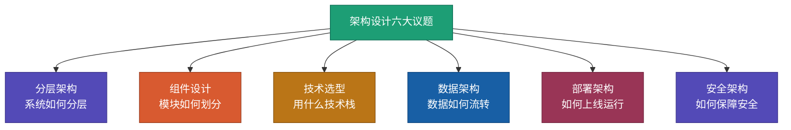

AI 工具改变的是**代码实现环节**的效率，不改变架构设计要处理的问题。技术选型、容量估算、降级方案这些决策，仍然需要架构师做——AI 可以帮你列候选、算数字、生成脚手架，但最后拍板需要理解团队、业务和成本。

### 架构师要掌握的基础

这份清单不是"必须全会"，而是遇到相关问题时要知道去哪里补。

**基础**：操作系统（进程、线程、内存、IO 模型）、计算机网络（TCP/HTTP/DNS/CDN）、数据结构与算法。

**中间件**：数据库（MySQL/PostgreSQL、MongoDB、分库分表）、缓存（Redis、多级缓存）、消息队列（Kafka、RocketMQ）、搜索引擎（Elasticsearch）。

**分布式**：微服务（服务拆分、服务治理、API 网关）、分布式理论（CAP、一致性协议、分布式事务）、容器化（Docker、Kubernetes）、CI/CD。

**AI 协作**：Prompt 编写、Agent 工作流设计、AI 输出的质量验证。

---

## 二、架构设计的原则

架构设计没有"最佳方案"，只有"在约束下的权衡"。以下六条原则是权衡时的参照。

### 分层解耦

每一层只做自己的事，通过接口与其他层交互。修改一层不影响其他层，是分层解耦最直接的收益。但过度分层会让调用链过深、调试困难——中小项目三层就够用，强行分六层是给后来的人挖坑。

### 高可用

系统在部分组件故障时仍能对外提供服务。常用手段：主从复制、多活部署、熔断降级、健康检查。

可用性的成本呈指数上升——99.9% 是年宕机 8 小时 45 分钟，99.99% 是 53 分钟。中间这 8 小时的差距，对应的可能是一个数量级的基础设施成本。先想清楚业务能接受多少宕机时间，再决定可用性目标。

### 可扩展

水平扩展靠无状态服务、数据分片、读写分离。垂直扩展是加机器配置——便宜但有天花板。

大部分系统的瓶颈最终都在数据库而不是应用层。应用层的无状态扩展相对容易，数据库的扩展（分库分表、读写分离、分布式数据库）才是架构设计的难点。

### 高性能

缓存、异步、连接池、批量——这些是常规手段。但真正决定性能的，是**写代码前是否想清楚"哪段代码是热点路径"**。优化冷门代码是负收益，既增加复杂度也不提升体验。

### 安全性

传输加密、访问控制、数据脱敏、SQL 注入防护、XSS 防护。安全不是"做了就行"，而是持续对抗。一次安全事故的代价，通常远超之前节省的所有安全建设成本。

### 成本控制

按需扩容、弹性伸缩、避免过度设计。

中小系统套用大厂架构是最常见的过度设计——百人团队用了千人级别的基础设施，后期维护成本远超收益。技术选型要先问"团队能驾驭吗"、"业务真的需要吗"，再问"这个技术好不好"。

### 架构设计流程

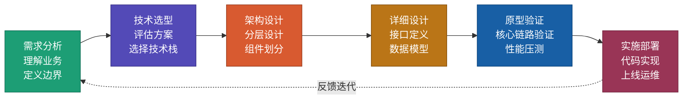

| 阶段 | 关键活动 | 输出物 |
|------|---------|-------|
| 需求分析 | 理解业务目标、定义功能边界、估算规模 | 需求文档、规模估算 |
| 技术选型 | 评估候选技术、对比优劣、团队匹配 | 技术选型报告 |
| 架构设计 | 分层设计、组件划分、数据流设计 | 架构设计文档、架构图 |
| 详细设计 | 接口定义、数据模型、算法选择 | API 文档、数据库设计 |
| 原型验证 | 核心功能验证、性能压测 | 验证报告 |
| 实施部署 | 编码实现、测试、上线 | 可运行系统 |

### AI 在架构设计中的位置

AI 工具在三个环节价值明显：

**技术选型评估**——告诉 AI 业务规模、约束条件、团队情况，让它对比多种方案的优劣。过去架构师要花一两周调研对比三种消息队列，现在几分钟能拿到一个结构化的对比。但 AI 输出的性能数据需要自己去官方文档或 benchmark 验证，不能直接采信。

**架构方案生成**——描述系统约束，让 AI 生成分层架构、组件清单、数据流向。AI 的初稿通常是"合理但保守"的——它会给出业界主流方案，但不会给出有创意的方案。人的职责是在初稿上做裁剪和优化。

**代码脚手架生成**——基于已确定的架构，让 AI 生成项目骨架、配置文件、基础接口。这一步节省的时间最可观，但生成后要人工检查项目结构是否符合团队规范。

AI 做不了的是：**承担决策责任**。选型错了线上炸了，AI 不会赔钱，你会。

---

## 三、主流架构方法论

架构方法论是前人总结的"怎么组织系统"的套路。下面几种是生产中用得最多的。

### 分层架构家族：MVC / MVP / MVVM

这三种都是把"界面"和"业务逻辑"分开的思路，差别在于中间层的职责。

**MVC**（Model-View-Controller）：Controller 接收用户输入，调 Model 处理数据，再把结果交给 View 展示。Controller 和 View 耦合较紧，适合后端 Web 框架。代表：Spring MVC、Django、Rails。

**MVP**（Model-View-Presenter）：Presenter 接管 View 的逻辑，View 只做展示。View 和 Model 之间无直接通信，便于单元测试。代表：Android 传统开发。

**MVVM**（Model-View-ViewModel）：ViewModel 暴露数据和命令，View 通过数据绑定自动同步。代表：WPF、Vue、Flutter。

| 模式 | 核心区别 | 典型场景 |
|------|---------|---------|
| MVC | Controller 协调 View 和 Model | Spring MVC、Django |
| MVP | Presenter 接管所有交互逻辑 | Android 传统开发 |
| MVVM | ViewModel + 数据绑定自动同步 | WPF、Vue、Flutter |

三者是演进关系：MVC 解决了"界面和业务分家"，MVP 解决了"View 测试困难"，MVVM 解决了"手动同步太繁琐"。前端框架（Vue、React、Flutter）本质都在往 MVVM 的方向走。

**[本仓库 MVC / MVP / MVVM 代码示例](https://github.com/microwind/design-patterns/tree/main/mvx)**

### DDD 领域驱动设计

DDD（Domain-Driven Design）解决"复杂业务系统如何建模"的问题。核心思想是**把代码结构对齐业务结构**，让开发者和业务人员说同一种语言。

四个核心概念：

- **限界上下文**（Bounded Context）：业务边界清晰的区域，不同上下文通过明确接口交互
- **实体**（Entity）：有唯一标识、生命周期贯穿业务的对象（订单、用户）
- **值对象**(Value Object)：没有标识、属性相同即相等（金额、地址）
- **领域服务**（Domain Service）：不属于单个实体的业务逻辑（跨账户转账）

典型的四层架构：

```
Interface 层         ← Controller、DTO、接口暴露
    ↓
Application 层       ← 编排领域服务、事务边界
    ↓
Domain 层            ← 实体、值对象、领域服务、领域事件
    ↓
Infrastructure 层    ← 数据库、消息队列、外部服务
```

适合用 DDD 的场景：业务逻辑复杂、需要长期演进、领域专家和开发团队需要协作。不适合的场景：简单 CRUD、一次性项目。

**[本仓库 DDD 代码示例](https://github.com/microwind/design-patterns/tree/main/domain-driven-design)**

### AKF 扩展立方体

AKF Partners 提出的系统扩展方法论，把扩展分成三个维度：

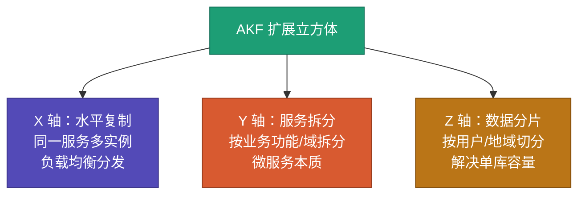

- **X 轴**：同一份代码多跑几个实例，负载均衡分发。最简单，但数据库会成为瓶颈
- **Y 轴**：按业务功能拆服务（用户服务、订单服务）。微服务本质就是 Y 轴扩展
- **Z 轴**：按数据维度分片（用户 ID 取模、地域分库）。解决单库容量问题

扩展顺序一般是 X → Y → Z。大部分系统 X 轴就够了，业务复杂后上 Y 轴，数据量爆炸后上 Z 轴。强行一上来就 Z 轴是过度设计。

### SOA 与微服务

两者都是"服务化"思路，区别在粒度和治理方式。

**SOA**（Service-Oriented Architecture）：以企业级集成为目标，通过 ESB（企业服务总线）连接各服务。服务粒度较粗，一个服务对应一个业务模块。常见于传统企业 IT 架构。

**微服务**（Microservices）：SOA 的轻量化演进。服务粒度更细，一个服务专注一个业务能力；去掉 ESB 用服务注册发现；强调"独立部署、独立扩展、独立数据存储"。

| 维度 | SOA | 微服务 |
|------|------|--------|
| 服务粒度 | 粗（业务模块级） | 细（业务能力级） |
| 通信方式 | ESB 集中总线 | 轻量协议（HTTP / gRPC） |
| 数据存储 | 常共享数据库 | 一服务一数据库 |
| 部署方式 | 传统部署 | 容器化、CI/CD |
| 治理 | 集中式 | 去中心化 |

微服务是 SOA 的演进，不是替代。中大型企业常见的组合是：SOA 做跨系统集成，微服务做单系统内部拆分。

**[本仓库微服务代码示例](https://github.com/microwind/design-patterns/tree/main/microservice-architecture)**

### 六边形架构与整洁架构

两者思想一致：**业务逻辑放在核心，外部依赖（UI、数据库、第三方服务）通过适配器接入**。

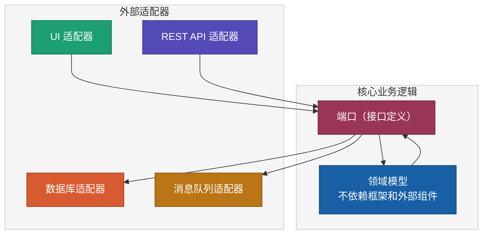

**六边形架构**（Alistair Cockburn 提出）又名"端口与适配器"，强调业务逻辑和外部世界的隔离。

**整洁架构**（Uncle Bob 提出）是同一思想的另一种表达，强调"依赖倒置"：内层不知道外层存在，外层依赖内层的接口。

这类架构和 DDD 搭配使用效果好——DDD 告诉你怎么建模业务，六边形 / 整洁架构告诉你怎么组织代码。

---

## 四、典型架构场景方案

方法论落地到具体场景，有几种常见方案。这里聚焦架构模式本身，下一章开始会按系统类型详细展开。

### 前后端分离架构

前后端分离的本质是**各自技术栈独立演进**：前端用 React / Vue，后端用 Spring / Gin，通过 API 契约（RESTful 或 GraphQL）协作。

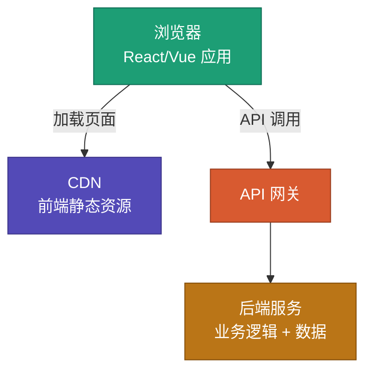

关键点：

- 前端独立部署（CDN + 静态文件），后端独立发布
- API 契约先行（OpenAPI / Swagger），前后端并行开发
- 跨域靠网关处理（CORS），鉴权用 JWT 或 Session Cookie
- SEO 需求用 SSR（Next.js / Nuxt.js）解决

几乎所有现代 Web 系统都适用。不适合的只有重度依赖 SEO 且服务端模板渲染足够的老系统。

### 客户端架构（单端 + 多端）

单端客户端架构一般采用 MVVM 或组件化：

- **Web**：组件化（React / Vue）+ 状态管理（Redux / Vuex / Pinia）
- **App 原生**：MVVM + Clean Architecture 组合（iOS Swift、Android Kotlin）
- **App 跨端**：Flutter（Dart）或 React Native（JavaScript）

多端共存时的典型架构：

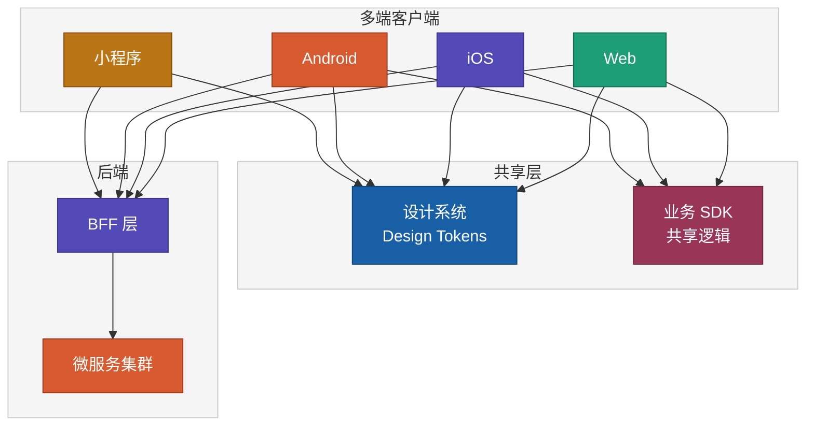

要点：

- 设计系统（Design Tokens）保证多端视觉一致
- 业务 SDK 封装共享逻辑（登录、支付、埋点）
- BFF 层按端适配数据

### SOA 架构

经典 SOA 架构围绕 ESB 展开：

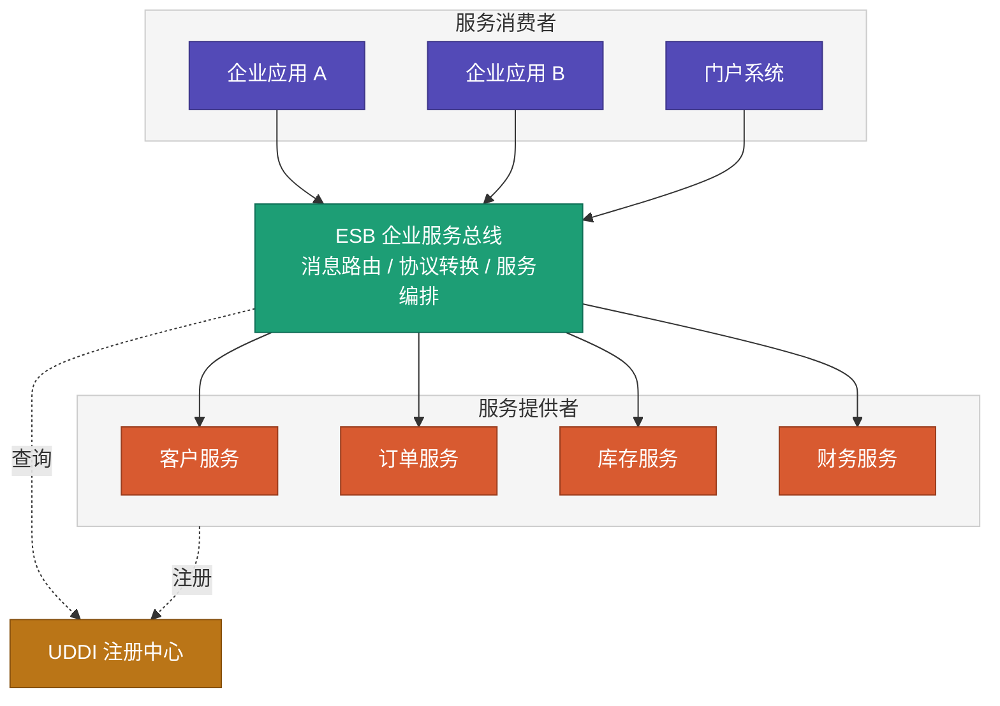

特点：

- ESB 承担消息路由、协议转换、服务编排
- 服务粒度较粗，常对应一个业务模块
- 技术栈常见 WS-\*（SOAP、WSDL、UDDI）或商业 ESB（IBM、Oracle）
- 适合传统企业级集成、异构系统多的大型组织

SOA 的问题是 ESB 容易成为单点瓶颈，治理不当会退化成"分布式的大单体"。

### 微服务架构

微服务的典型架构：

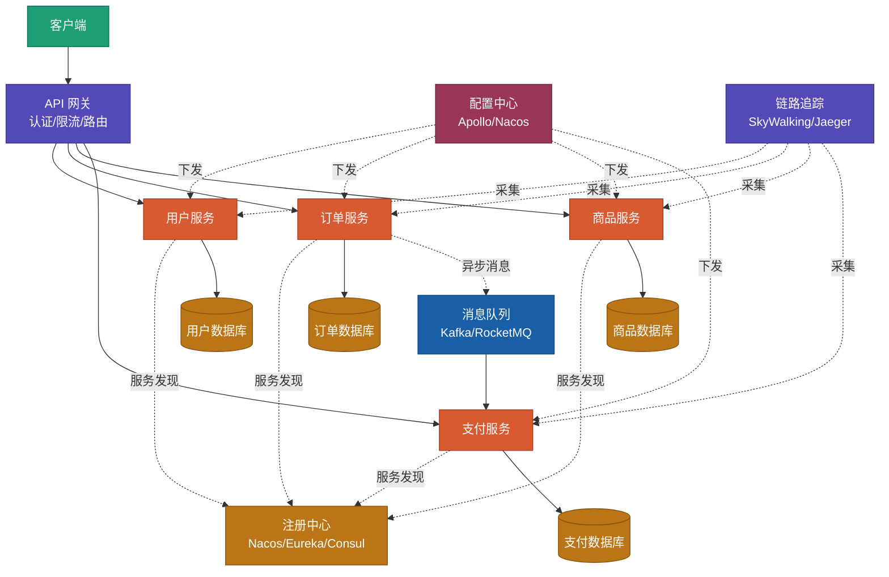

核心组件：

- **API 网关**：统一入口，做认证、限流、路由、熔断（Kong、Spring Cloud Gateway）
- **服务注册中心**：服务实例的动态发现（Nacos、Eureka、Consul）
- **配置中心**：集中管理配置、动态下发（Apollo、Nacos）
- **消息队列**：服务间异步解耦（Kafka、RocketMQ）
- **链路追踪**：跨服务调用链可视化（SkyWalking、Jaeger）

拆分原则：

- 按业务域拆（DDD 限界上下文）
- 按变更频率拆（高频迭代独立）
- 按团队边界拆（康威定律）
- 初期不要拆太细，等单服务超过 2 个团队维护再考虑拆分

微服务不是银弹——它把单体的"代码复杂度"换成了"分布式复杂度"（网络、数据一致性、部署、监控）。团队规模不够时，微服务的成本远高于收益。

---

## 五、Web 系统架构设计

Web 系统是最常见的系统类型，从官网到电商平台都属于这一类。

### 典型分层架构

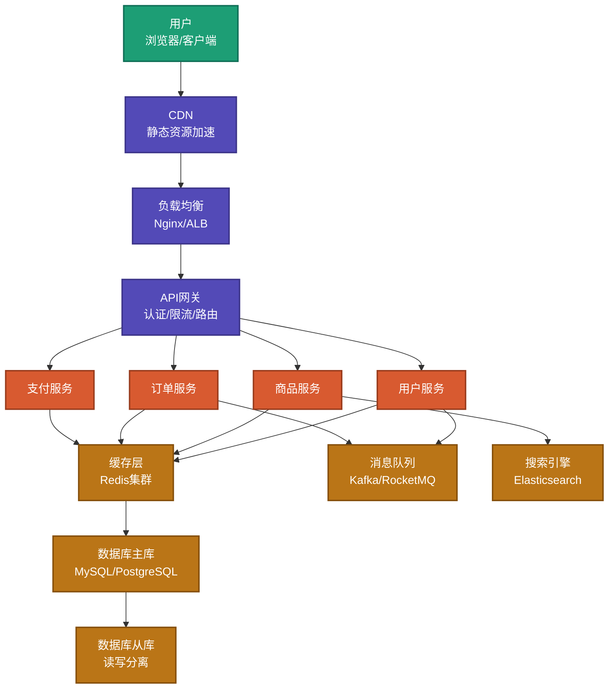

### 各层职责

**接入层**：CDN 缓存静态资源降低延迟；负载均衡把请求分发到多台服务器支持高并发；API 网关做统一入口，承担认证、限流、路由、熔断。

**业务服务层**：按业务域拆分微服务。但**初期没必要拆**——一个写得干净的单体应用能撑到百万 DAU。只有当服务变更频率差异大、团队规模超过 20 人、或单个服务成了瓶颈时，才考虑拆分。拆早了就是给自己找事。

**数据层**：Redis 集群做热数据缓存；MySQL 主从做写主读从；Kafka 做异步解耦和削峰填谷；Elasticsearch 做全文检索。

### 技术选型参考

| 组件 | 推荐技术 | 适用场景 | 备选方案 |
|------|---------|---------|---------|
| 负载均衡 | Nginx | 通用 Web 系统 | HAProxy、云 ALB |
| API 网关 | Kong / Spring Cloud Gateway | 微服务架构 | Zuul、Traefik |
| 后端框架 | Spring Boot(Java) / Gin(Go) | 高性能业务系统 | FastAPI(Python)、NestJS(Node) |
| 前端框架 | React / Vue | 动态交互页面 | Svelte、Angular |
| 数据库 | MySQL / PostgreSQL | 事务型业务 | TiDB（分布式） |
| 缓存 | Redis | 通用缓存 | Memcached |
| 消息队列 | Kafka | 高吞吐场景 | RocketMQ、RabbitMQ |
| 搜索 | Elasticsearch | 全文检索 | OpenSearch |
| 容器编排 | Kubernetes | 微服务部署 | Docker Swarm |

### 选型的常见误区

- **盲目追新**：选最新最潮的技术，生产环境没人踩过的坑都会砸到自己头上
- **过度设计**：中小系统用大厂架构，运维成本远超业务价值
- **忽视团队**：选了团队不熟悉的技术栈，学习成本拖垮迭代速度
- **不看成本**：开源 ≠ 免费，自建运维、商业支持都是真金白银

---

## 六、App 系统架构设计

### 分层设计

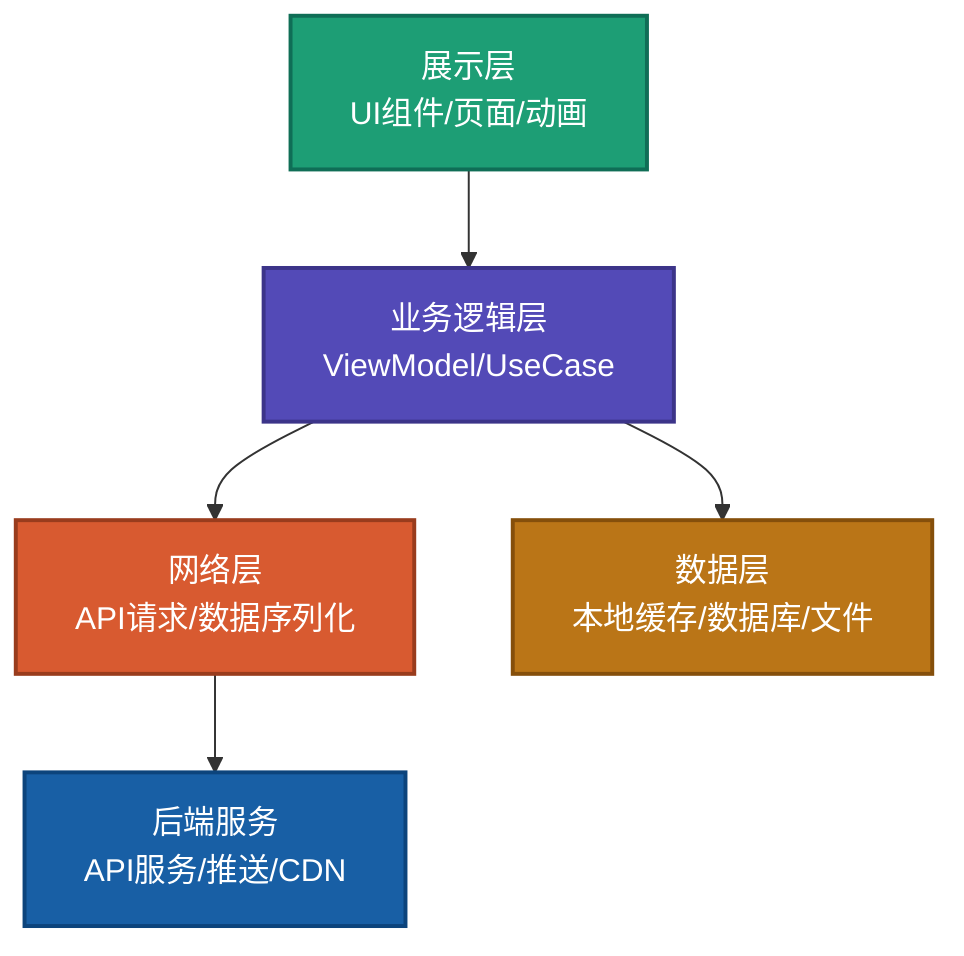

**展示层**做页面展示、用户交互、动画效果。原生选 SwiftUI / Jetpack Compose，跨平台选 Flutter / React Native。关键原则是只做展示，不含业务逻辑。

**业务逻辑层**处理业务规则和状态管理。MVVM 架构下是 ViewModel，Flutter 用 BLoC，RN 用 Redux。这一层要做到可测试、可复用、平台无关——混进了平台代码就违背了分层设计的初衷。

**网络层**负责与后端通信。Retrofit (Android)、Alamofire (iOS)、Dio (Flutter)。统一封装请求、错误处理、重试策略。

**数据层**负责本地数据存储和缓存。SQLite、SharedPreferences、Hive。移动端要特别关注离线可用和缓存策略——网络不稳定时体验全靠本地数据。

### 前后端分离与 BFF

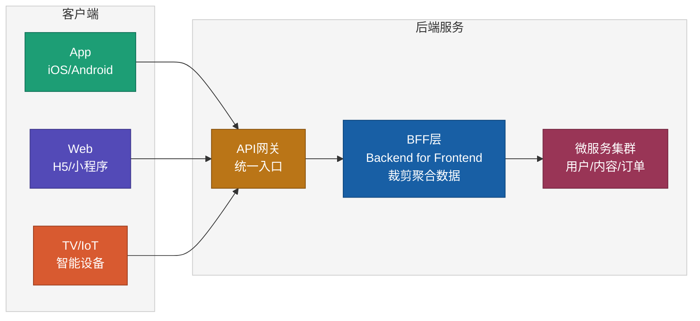

BFF 层解决一个实际问题：不同终端对数据需求不同。App 要省流量（精简字段、压缩图片），Web 要 SEO 元数据（完整字段），TV 要大图资源（简化交互）。如果每个终端都直接调同一组后端 API，要么 API 肥大、要么客户端各自做裁剪。BFF 在中间做适配，各端拿到的都是已裁剪好的数据。

引入 BFF 的代价是多一层维护成本。单端或小团队没必要上 BFF，等到三端以上、各端数据差异明显时再引入。

### 技术选型参考

| 维度 | 方案 | 优势 | 劣势 | 适用场景 |
|------|------|------|------|---------|
| 原生开发 | Swift / Kotlin | 性能最佳、体验最好 | 双端开发成本高 | 高性能要求的核心 App |
| 跨平台 | Flutter | 一套代码、高性能渲染 | 包体积较大 | 中大型 App、快速迭代 |
| 跨平台 | React Native | 生态丰富、热更新 | 性能不如 Flutter | 中小型 App、Web 团队转型 |
| 小程序 | 微信 / 支付宝 | 无需安装、获客成本低 | 能力受限 | 轻量级应用、电商 |
| H5 | Vue / React | 跨平台、即时更新 | 性能最弱 | 活动页、非核心功能 |

---

## 七、大数据系统架构设计

### 全景架构

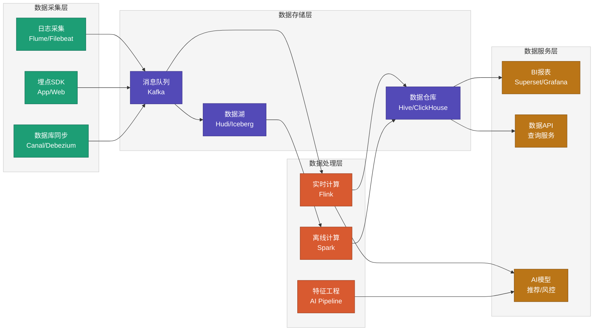

采集 → 存储 → 处理 → 服务，四层。每一层都有多种技术选型，但骨架是稳定的。

### Lambda 架构 vs Kappa 架构

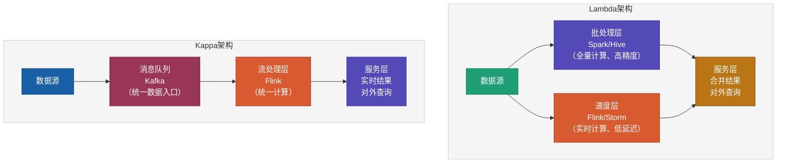

Lambda 架构同时跑批处理和流处理。批处理保证数据精度（全量计算），流处理保证延迟（实时结果），服务层合并两者。代价是要维护两套计算逻辑——同一业务口径要在 Spark 和 Flink 里各写一遍，哪一边漏改就是数据不一致。

Kappa 架构把所有数据都过流处理，简化了维护成本。代价是批处理的精度保障不见了——历史数据要重算就要重放 Kafka 全量数据。

选 Lambda 还是 Kappa，取决于业务对精度和实时性的相对权重。金融、审计场景对精度敏感，适合 Lambda；推荐、风控场景对实时性敏感，适合 Kappa。

| 维度 | Lambda 架构 | Kappa 架构 |
|------|-----------|----------|
| 复杂度 | 高（维护两套计算逻辑） | 低（统一流处理） |
| 数据精度 | 高（批处理保证精确） | 中（依赖流处理精度） |
| 延迟 | 批处理层延迟高 | 全链路低延迟 |
| 适用场景 | 数据精度要求高（财务、审计） | 实时性要求高（推荐、风控） |
| 维护成本 | 高 | 低 |

### 技术选型参考

| 组件 | 推荐技术 | 适用场景 | 备选方案 |
|------|---------|---------|---------|
| 消息队列 | Kafka | 高吞吐数据管道 | Pulsar |
| 实时计算 | Flink | 流式计算、CEP | Spark Streaming |
| 离线计算 | Spark | 批量 ETL、数据分析 | Hive MR |
| 数据湖 | Apache Hudi | 增量更新、时间旅行 | Iceberg、Delta Lake |
| OLAP | ClickHouse | 实时分析查询 | Doris、StarRocks |
| 数据仓库 | Hive | 离线数仓 | Presto / Trino |
| 调度系统 | Apache DolphinScheduler | 任务调度编排 | Airflow |
| 数据质量 | Great Expectations | 数据校验 | dbt tests |

---

## 八、AI 辅助架构设计

第二章提到了 AI 在架构设计中的三个环节。这一章展开具体的操作方法。

### 用 AI 做技术选型评估

传统方式是花一两周调研对比三种消息队列。AI 辅助方式用结构化 Prompt 描述约束，几分钟拿到对比结果。

```
我需要为一个日活 1000 万的视频平台选择消息队列。

要求：
- 峰值吞吐：100 万消息/秒
- 消息延迟：<100ms
- 可靠性：不允许消息丢失
- 团队熟悉 Java

请对比 Kafka、RocketMQ、Pulsar 三种方案的优劣，
从性能、可靠性、运维成本、学习成本四个维度评估。
```

AI 输出结构化对比后，人去验证关键数据（官方 benchmark、生产案例）——AI 给出的性能数字不能直接采信。

### 用 AI 生成架构方案（SCALE 框架）

用 SCALE 框架描述系统约束，让 AI 生成架构方案：

```
请为以下系统设计架构：

S - Scale：日活 5000 万，峰值并发 50 万，视频库 1000 万
C - Constraints：响应 <200ms，可用性 >99.9%，成本 <500 万/月
A - Architecture：请设计分层架构
L - Limitations：设计降级策略
E - Evaluation：定义核心监控指标

请输出：
1. 分层架构图（mermaid）
2. 各层组件清单和技术选型
3. 数据流向图
4. 部署架构图
5. 容量估算
```

AI 产出初稿，人负责审核、调整、拍板。AI 的初稿通常是"合理但保守"的——给业界主流方案，但不会给有创意的方案。

### 用 BEAT 框架描述需求

需求阶段也可以结构化。BEAT 框架的四个字母：

- **B - Background**：目标市场、竞品参考、当前阶段
- **E - Expectation**：核心指标（DAU、使用时长、可用性目标）
- **A - Action**：核心功能清单
- **T - Test**：规模和压测目标

BEAT + SCALE 组合使用：BEAT 描述"做什么"，SCALE 描述"怎么做的约束"。

### 用 AI 生成代码脚手架

架构方案定稿后，让 AI 生成项目骨架：

```
基于上述架构，生成 Spring Boot 微服务项目骨架：

- 服务：user-service、video-service、recommend-service
- 公共组件：API 网关、异常处理、链路追踪
- 数据库：MySQL + Redis
- 消息队列：Kafka
- 部署：Docker + K8S

请生成：
1. 多模块 Maven 项目结构
2. 各服务基础配置
3. 公共组件封装代码
4. Dockerfile 和 K8S YAML
5. CI/CD 流水线配置
```

### AI Agent 架构设计工作流


各环节的人机分工：

| 环节 | 人的职责 | AI 的职责 |
|------|---------|---------|
| 业务需求 | 理解业务本质、定义目标 | 协助结构化描述、发现遗漏 |
| 系统设计 | 定义约束、做权衡决策 | 生成方案、估算容量 |
| 架构设计 | 审核方案、做最终选择 | 生成架构图、技术选型 |
| 算法选型 | 指导算法方向、验证正确性 | 实现算法、优化性能 |
| 代码实现 | 审查代码、验证质量 | 生成代码、编写测试 |
| 验证部署 | 监控验收、做上线决策 | 自动化测试、生成报告 |

---

## 九、实战：视频平台架构

> 以下规模估算为**参考级**，以抖音、B 站、爱奇艺等平台公开的技术分享为基础整理。实际数字以生产压测为准。
>
> 本章目的是演示一个完整的架构设计过程，不是给出可以直接抄的方案。

### 9.1 需求与边界


**规模估算（参考级，以主流短视频平台公开数据为基础）**：

- DAU 2 亿，峰值并发 500 万
- 视频库 50 亿条，日新增 500 万条
- 日播放 100 亿次，峰值 QPS 200 万
- 存储 100PB+，日新增约 500TB

**性能目标**：

- 首帧时间 <1 秒（播放器拿到第一帧的时间）
- 卡顿率 <1%（每百次播放卡顿不超过一次）
- API P99 延迟 <200ms
- 可用性 >99.99%（年宕机 <53 分钟）

具体到自己的系统，数字要按真实 DAU × 用户行为模型重新估算，不能直接套用。

### 9.2 整体架构

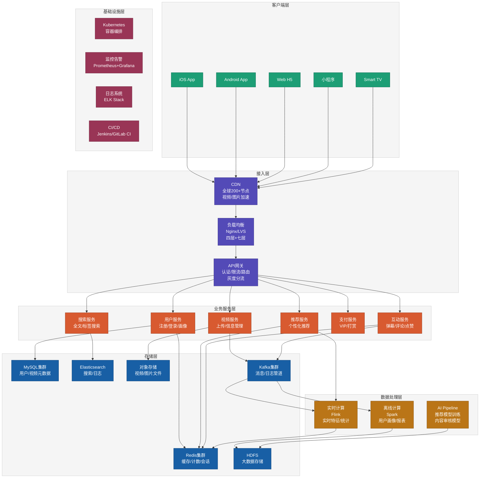

### 9.3 子系统设计

#### 上传与转码


上传环节的要点是**分片上传 + 断点续传 + 秒传去重**。大文件切成 1-5MB 分片并行传，网络中断能续；新上传的文件先算 MD5，命中已有文件就跳过传输。再配合就近上传到 CDN 边缘节点，用户的实际上传体验才能做到"秒传"级别。

转码环节输出多个码率版本（360P / 480P / 720P / 1080P / 4K），兼顾不同网络条件和设备能力。编码格式上，H.264 负责兼容性，H.265 省带宽（20-40%），AV1 是未来方向但终端支持还不够普及。视频按时间分段后可以多台机器并行转码。

AI 在转码环节最值得投入的是**感知编码**——识别画面类型（运动、静态、人像），把码率预算倾斜到人眼关注的区域。这不是未来设想，Netflix 的 per-title encoding、YouTube 的 VP9 优化都是成熟的工业实践。对于视频库大、带宽成本敏感的业务，感知编码的投资回报率很高。

#### 存储与分发

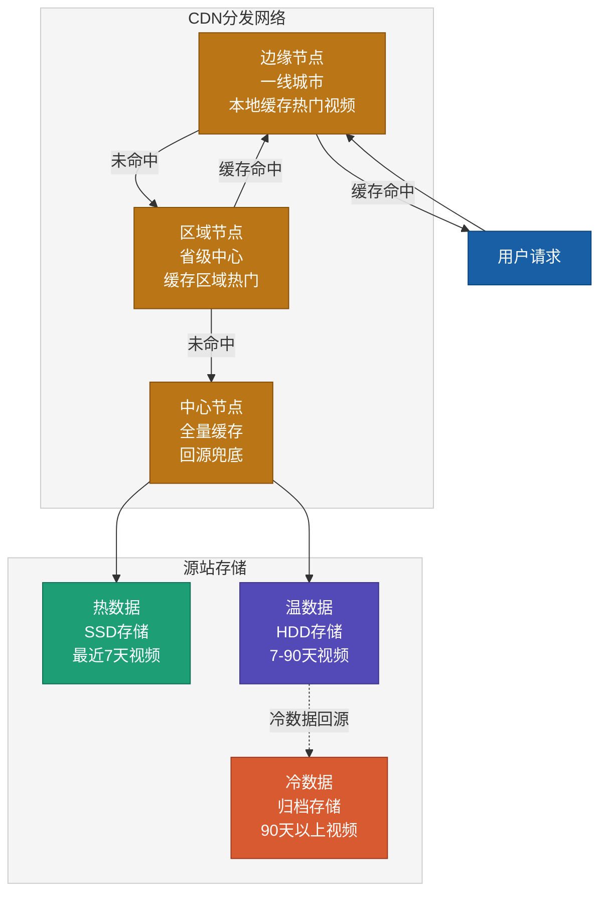

存储分层的原理是视频的访问热度随时间衰减——刚发布的视频用 SSD，一个月前的用 HDD，半年前的归档。自动迁移策略根据访问频次决定。

CDN 分发用三级缓存：边缘节点（一线城市）、区域节点（省级中心）、中心节点（全量缓存兜底）。**CDN 命中率是带宽成本的主要变量**——命中率从 90% 提到 95%，回源带宽降一半，月账单能少很多。热门视频要主动预热到边缘节点，不能等用户请求来触发。

自适应码率（HLS / DASH）把视频切成 2-10 秒的小段，每段提供多种码率版本，客户端根据实时网络带宽选择。码率切换延迟要控制在 2 秒以内，否则用户能明显感知。

#### 播放系统


首帧优化是多个小优化叠加的结果：用户滑到视频时提前下载首个片段；CDN 边缘节点缓存每个视频的首帧；启动时先用低码率快速拉起再逐步提升；DNS 预解析减少查询时间；HTTP/2 多路复用减少连接建立。每一项单独看收益不大，但叠加起来能把首帧时间从 2 秒压到 1 秒以内。

自适应码率算法（ABR）的决策依据是带宽估计和缓冲区状态。带宽好、缓冲充足时升码率；带宽差、缓冲不足时降码率。算法要兼顾平滑——频繁切换码率比单一码率的体验更差。

#### 推荐系统

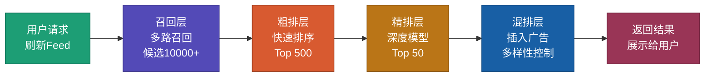

推荐系统是多级漏斗：从 50 亿视频漏到最终几十个展示结果。

**召回层**从全量库里筛出上万候选。多路召回——协同过滤、内容相似、热度、关注关系、地域，每路几千候选，最后合并去重。向量检索（FAISS / Milvus）是召回层的基础设施。

**粗排层**用轻量级模型（常见是双塔结构）把候选筛到几百。延迟预算在 20ms 以内，模型不能太重。

**精排层**用深度模型（DIN / DIEN 等）做精细排序，多目标优化点击率、完播率、互动率的加权。延迟预算 100ms。

**混排层**做最后的调整：插入广告（平衡收入和体验）、多样性控制（相邻不同品类）、运营干预（置顶或加权特定内容）。

每一层的延迟预算和模型复杂度是反向权衡——召回要快要广，精排要准要深，混排要满足多种约束。

#### 互动系统

```mermaid
graph TD
    A["用户发送弹幕/评论/点赞"]
    A --> B["API网关<br/>限流+鉴权"]
    B --> C["写入Kafka<br/>异步处理"]
    C --> D["消费者集群"]
    D --> D1["弹幕服务<br/>WebSocket推送<br/>实时展示"]
    D --> D2["评论服务<br/>写入MySQL<br/>审核过滤"]
    D --> D3["计数服务<br/>Redis原子计数<br/>点赞/收藏"]

    style A fill:#1D9E75,stroke:#0F6E56,color:#ffffff
    style B fill:#534AB7,stroke:#3C3489,color:#ffffff
    style C fill:#D85A30,stroke:#993C1D,color:#ffffff
    style D fill:#BA7517,stroke:#854F0B,color:#ffffff
    style D1 fill:#185FA5,stroke:#0C447C,color:#ffffff
    style D2 fill:#993556,stroke:#72243E,color:#ffffff
    style D3 fill:#534AB7,stroke:#3C3489,color:#ffffff
```

弹幕走 WebSocket 长连接支持高并发推送，消息先写 Kafka 再分发，削峰。热弹幕在 Redis，历史弹幕归档到 MongoDB。

点赞、收藏用 Redis 原子操作（INCR / DECR）保证计数准确，定期异步同步到 MySQL 做持久化。前端要做防抖，后端要做频率限制防刷。

评论读多写少，写 MySQL 后刷缓存，读取优先走 Redis。审核走 AI 初筛 + 人工复审的双层流程。

### 9.4 部署架构

```mermaid
graph TD
    subgraph DC1["机房A（主）"]
        K8S_A["K8S集群<br/>业务服务"]
        DB_A["数据库主库<br/>MySQL Master"]
        REDIS_A["Redis主集群"]
    end

    subgraph DC2["机房B（备）"]
        K8S_B["K8S集群<br/>业务服务"]
        DB_B["数据库备库<br/>MySQL Slave"]
        REDIS_B["Redis备集群"]
    end

    subgraph CDN_Layer["CDN层"]
        CDN_G["全球CDN节点<br/>200+节点"]
    end

    subgraph Monitor["监控体系"]
        PROM["Prometheus<br/>指标采集"]
        GRAF["Grafana<br/>可视化"]
        ALERT["AlertManager<br/>告警通知"]
        ELK_M["ELK Stack<br/>日志分析"]
    end

    CDN_G --> K8S_A
    CDN_G --> K8S_B
    DB_A --> DB_B
    REDIS_A --> REDIS_B
    K8S_A --> PROM
    K8S_B --> PROM
    PROM --> GRAF
    PROM --> ALERT

    classDef dc1 fill:#1D9E75,stroke:#0F6E56,color:#ffffff
    classDef dc2 fill:#534AB7,stroke:#3C3489,color:#ffffff
    classDef cdn fill:#D85A30,stroke:#993C1D,color:#ffffff
    classDef mon fill:#BA7517,stroke:#854F0B,color:#ffffff

    class K8S_A,DB_A,REDIS_A dc1
    class K8S_B,DB_B,REDIS_B dc2
    class CDN_G cdn
    class PROM,GRAF,ALERT,ELK_M mon

    style DC1 fill:#F5F5F5,stroke:#CCCCCC,color:#333333
    style DC2 fill:#F5F5F5,stroke:#CCCCCC,color:#333333
    style CDN_Layer fill:#F5F5F5,stroke:#CCCCCC,color:#333333
    style Monitor fill:#F5F5F5,stroke:#CCCCCC,color:#333333
```

多机房主备，主机房承担主要流量和写请求，备机房承担读请求。MySQL 主从复制、Redis 数据同步保证数据一致。故障切换通过 DNS + 自动转移，RTO（恢复时间目标）控制在 5 分钟以内。

发布用灰度策略：金丝雀（先 1% Pod 观察指标）、蓝绿（两套环境一键切换）、A/B（按用户分流对比效果）。回滚能力比发布速度更重要——30 秒内能回滚比 1 小时发布完要有价值得多。

监控分三层：基础监控（CPU / 内存 / 磁盘 / 网络）、业务监控（QPS / 延迟 / 错误率）、体验监控（首帧时间 / 卡顿率 / 播放成功率）。告警分级（P0 立即处理、P1 一小时内、P2 当天）避免告警疲劳。

---

## 十、程序员的三层能力与总结

AI 把"写代码"的门槛降低了，程序员的价值重心开始上移。往上走是三层能力：

```mermaid
graph TD
    A["AI 时代程序员的三层能力"] --> B["第一层：需求描述工程师<br/>(What)"]
    A --> C["第二层：系统设计工程师<br/>(Scope)"]
    A --> D["第三层：算法思想工程师<br/>(How)"]

    B --> B1["能清晰理解业务<br/>用框架化语言描述问题<br/>发现隐需求和矛盾"]

    C --> C1["能定义系统边界<br/>进行容量规划和架构设计<br/>识别瓶颈和风险"]

    D --> D1["能用算法思想指导 AI<br/>理解和选择最优算法<br/>验证 AI 生成的代码"]

    classDef root fill:#1D9E75,stroke:#0F6E56,color:#ffffff,stroke-width:2px
    classDef layer fill:#534AB7,stroke:#3C3489,color:#ffffff,stroke-width:1px
    classDef skill fill:#D85A30,stroke:#993C1D,color:#ffffff,stroke-width:1px

    class A root
    class B,C,D layer
    class B1,C1,D1 skill
```

**第一层：需求描述工程师（What）**

能把模糊的业务需求整理成结构化描述，发现被业务方忽略的隐性需求和矛盾。对应技能是 BEAT 框架（Background / Expectation / Action / Test）。这是上游能力——需求说清楚了，下游才能做对。

**第二层：系统设计工程师（Scope）**

能定义系统边界、做容量规划、识别瓶颈和风险。对应技能是 SCALE 框架（Scale / Constraints / Architecture / Limitations / Evaluation）。这是本文的重点——架构设计能力决定了系统的上限。

**第三层：算法思想工程师（How）**

能用算法思想指导 AI、理解并选择最优算法、验证 AI 生成的代码是否正确。核心是分治、贪心、动态规划等思想的灵活运用。这是底层能力——具体实现怎么写由 AI 执行，但选择哪种思路要人做判断。

三层能力层层递进：先把问题说清楚（What），再把系统边界划出来（Scope），最后用算法把实现优化到位（How）。

### 几点观察

**AI 工具不改变架构设计的本质问题。** 选 MySQL 还是 MongoDB、用微服务还是单体、怎么做容量规划——这些决策 AI 可以给建议，但决策的依据（业务特征、团队情况、成本约束）需要人自己想清楚。AI 最有价值的不是"替你决策"，而是"帮你更快地评估候选方案"。

**不要过度设计。** 大部分系统死于"上线三年还没达到设计容量"。百万 DAU 的系统不需要千万 DAU 的架构——为还没到来的规模付的复杂度成本，很少能真正派上用场。

**架构要能被调试。** 凌晨三点值班工程师能否快速定位问题？日志是否足够、链路追踪是否覆盖、异常是否能被一眼看出？这些比"理论上能扛多少 QPS"更重要。一个能扛百万并发但出了问题没人能查的系统，比一个只能扛十万并发但出了问题十分钟就能定位的系统差。

**AI 生成的代码要有验证意识。** 速度快不等于对——AI 把写代码的速度提了 10 倍，但一个没验证的 bug 上线造成的损失可能远超省下的时间。把省下的时间用在验证和测试上，才是合理的收益分配。

### 相关链接

- [AI 时代，人人都是 AI Agent 工程师](https://github.com/microwind/algorithms/blob/main/start-here/AI-Era-Programmers-as-Agent-Engineers.md)
- [AI 时代，人人都是需求描述工程师](https://github.com/microwind/algorithms/blob/main/start-here/AI-Era-Programmers-as-Requirements-Engineers.md)
- [AI 时代，人人都是系统设计工程师](https://github.com/microwind/algorithms/blob/main/start-here/AI-Era-Programmers-as-System-Design-Engineers.md)
- [AI 时代，人人都是算法思想工程师](https://github.com/microwind/algorithms/blob/main/start-here/AI-Era-Programmers-as-Algorithmic-Thinkers.md)
- [算法与数据结构代码分析](https://github.com/microwind/algorithms)
- [设计模式与编程范式详解](https://github.com/microwind/design-patterns)
- [AI 编程提示词模板库](https://github.com/microwind/ai-prompt)
- [AI 编程 Skill 仓库](https://github.com/microwind/ai-skills)
