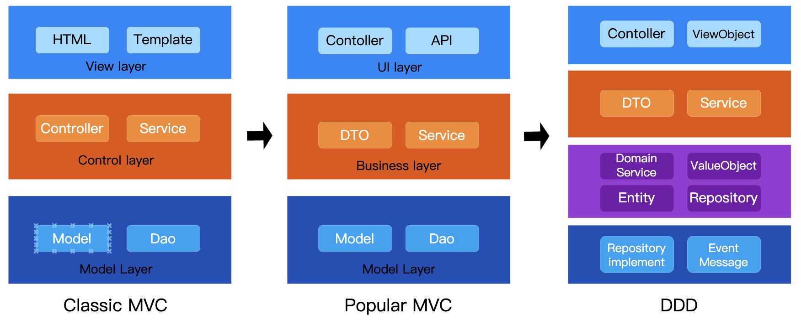

# Overview of DDD Layered Architecture Design

Domain-Driven Design (DDD) is a software architectural approach that aims to manage complex business logic through layering and domain modeling. DDD primarily organizes code using a layered architecture to achieve high cohesion and low coupling.

Compared with traditional MVC architectures, DDD places greater emphasis on abstracting the infrastructure and domain layers: complex business rules and logic are centralized in the domain layer, while robust infrastructure strongly supports it. This design philosophy is particularly well-suited for building complex enterprise-level applications, making systems more resilient and sustainable.



View Source: https://github.com/microwind/design-patterns/tree/main/domain-driven-design

Example Diagram of the DDD Structure

```
+--------------------+
|    User Interface  |
|     Layer (UI)     |
+--------------------+
          |
          v
+--------------------+
|  Application Layer |
|   (Application)    |
+--------------------+
          |
          v
+--------------------+
|    Domain Layer    |
|      (Domain)      |
+--------------------+
          |
          v
+----------------------+
| Infrastructure Layer |
|  (Repository Impl)   |
+----------------------+
```

### Responsibilities of Each Layer
- **User Interface (UI) Layer:** Handles user input and displays information.

- **Application Layer:** Manages application flow logic and coordinates operations within the domain layer.

- **Domain Layer:** Implements core business logic, including entities, value objects, aggregates, domain services, etc.

- **Infrastructure Layer:** Provides technical support such as databases, external APIs, message queues, and more.

> DDD splits the “business logic layer” in MVC into two distinct layers: the Application Layer (for process orchestration) and the Domain Layer (where business rules are cohesively encapsulated). In this approach, business logic is concentrated within the domain, and business capabilities are divided into domain modules (for example, a Payment Domain or a Risk Control Domain). This model replaces the purely technical layering of MVC, thereby reducing cross-module coupling.

## Comparison between DDD Layered Architecture and MVX Layered Architecture

| Feature             | MVX (MVC/MVP/MVVM)                          | DDD (Domain-Driven Design)                        |
|---------------------|---------------------------------------------|---------------------------------------------------|
| Primary Goal        | Separate UI, business logic, and data       | Solve complex domain modeling and business logic  |
| Focus               | UI-driven, suitable for front-end development | Domain-driven, ideal for complex business systems |
| Layers              | 3 layers (Model, View, X)                     | 4 layers (UI, Application, Domain, Infrastructure) |
| Applicable Scenarios| Front-end frameworks, highly interactive applications | Enterprise systems, complex business domains  |

## Application Scenarios for DDD
- **Enterprise Systems**: such as e-commerce platforms, ERP systems, banking systems.
- **Complex Business Logic**: where clear domain modeling is required.
- **Multiple System Interactions**: involving databases, external APIs, message queues, etc.
- **Team Collaborative Development**: where business personnel and developers work closely together.

## DDD Examples in C, Java, JavaScript, Go, and Python

### Implementing DDD in C

Although C does not support Object-Oriented Programming (OOP), you can implement DDD principles using structures and functions for modular design.

```c
/* User Interface Layer (UI Layer) */
// ui.c
#include <stdio.h>
#include "application.h"

int main() {
    OrderService service;
    init_service(&service);
    
    create_order(&service, "1001", "Alice", 250.5);
    Order order = get_order(&service, "1001");

    printf("Retrieved Order: %s, %s, %.2f\n", order.id, order.customer_name, order.amount);
    return 0;
}

/* Application Service Layer (Application Layer) */
// order_service.c
#include <string.h>
#include "application.h"

void init_service(OrderService *service) {
    init_repository(&service->repo);
}

void create_order(OrderService *service, const char *id, const char *name, float amount) {
    Order order;
    strcpy(order.id, id);
    strcpy(order.customer_name, name);
    order.amount = amount;
    save_order(&service->repo, order);
}

Order get_order(OrderService *service, const char *id) {
    return find_order(&service->repo, id);
}

/* Domain Layer */
// order.h
#ifndef DOMAIN_H
#define DOMAIN_H

typedef struct {
    char id[10];
    char customer_name[50];
    float amount;
} Order;

#endif

/* Infrastructure Layer */
// order_repository.c
#include <stdio.h>
#include <string.h>
#include "infrastructure.h"

void init_repository(OrderRepository *repo) {
    repo->count = 0;
}

void save_order(OrderRepository *repo, Order order) {
    repo->orders[repo->count++] = order;
}

Order find_order(OrderRepository *repo, const char *id) {
    for (int i = 0; i < repo->count; i++) {
        if (strcmp(repo->orders[i].id, id) == 0) {
            return repo->orders[i];
        }
    }
    Order empty = { "", "", 0 };
    return empty;
}
```

### Implementing DDD in Java

```java
/* User Interface Layer (UI Layer) */
// UI.java
public class UI {
    public static void main(String[] args) {
        OrderService service = new OrderService();
        service.createOrder("1001", "Alice", 250.5);
        Order order = service.getOrder("1001");

        System.out.println("Retrieved Order: " + order);
    }
}

/* Application Service Layer (Application Layer) */
// OrderService.java
class OrderService {
    private OrderRepository repository = new OrderRepository();

    public void createOrder(String id, String name, double amount) {
        Order order = new Order(id, name, amount);
        repository.save(order);
    }

    public Order getOrder(String id) {
        return repository.findById(id);
    }
}

/* Domain Layer */
// Order.java
class Order {
    String id, customerName;
    double amount;

    public Order(String id, String name, double amount) {
        this.id = id;
        this.customerName = name;
        this.amount = amount;
    }

    @Override
    public String toString() {
        return id + ", " + customerName + ", " + amount;
    }
}

/* Infrastructure Layer */
// OrderRepository.java
import java.util.HashMap;
import java.util.Map;

class OrderRepository {
    private Map<String, Order> db = new HashMap<>();

    public void save(Order order) {
        db.put(order.id, order);
    }

    public Order findById(String id) {
        return db.get(id);
    }
}
```

### Implementing DDD in Go

```go
/* User Interface Layer (UI Layer) */
// ui.go
func main() {
	repo := NewOrderRepository()
	service := NewOrderService(repo)

	service.CreateOrder("1001", "Alice", 250.5)
	order := service.GetOrder("1001")

	fmt.Println("Retrieved Order:", order)
}

/* Application Service Layer (Application Layer) */
// order_service.go
type OrderService struct {
	repo *OrderRepository
}

func NewOrderService(repo *OrderRepository) *OrderService {
	return &OrderService{repo: repo}
}

func (s *OrderService) CreateOrder(id, name string, amount float64) {
	order := Order{ID: id, CustomerName: name, Amount: amount}
	s.repo.Save(order)
}

func (s *OrderService) GetOrder(id string) Order {
	return s.repo.FindById(id)
}

/* Domain Layer */
// order.go
type Order struct {
	ID           string
	CustomerName string
	Amount       float64
}

/* Infrastructure Layer */
// order_repository.go
type OrderRepository struct {
	data map[string]Order
}

func NewOrderRepository() *OrderRepository {
	return &OrderRepository{data: make(map[string]Order)}
}

func (r *OrderRepository) Save(order Order) {
	r.data[order.ID] = order
}

func (r *OrderRepository) FindById(id string) Order {
	return r.data[id]
}
```

### Implementing DDD in Python

```python
# User Interface Layer (UI Layer)
# ui.py
from application import OrderService

service = OrderService()
service.create_order("1001", "Alice", 250.5)
order = service.get_order("1001")

print(f"Retrieved Order: {order}")

# Application Service Layer (Application Layer)
# order_service.py
from domain import Order
from infrastructure import OrderRepository

class OrderService:
    def __init__(self):
        self.repository = OrderRepository()

    def create_order(self, order_id, name, amount):
        order = Order(order_id, name, amount)
        self.repository.save(order)

    def get_order(self, order_id):
        return self.repository.get(order_id)

# Domain Layer
# order.py
class Order:
    def __init__(self, order_id, customer_name, amount):
        self.order_id = order_id
        self.customer_name = customer_name
        self.amount = amount

    def __str__(self):
        return f"{self.order_id}, {self.customer_name}, {self.amount}"

# Infrastructure Layer
# order_repository.py
class OrderRepository:
    def __init__(self):
        self.db = {}

    def save(self, order):
        self.db[order.order_id] = order

    def get(self, order_id):
        return self.db.get(order_id, None)
```

### Implementing DDD in JavaScript (Node.js Version)

```javascript
/* User Interface Layer (UI Layer) */
// UI.js
const OrderService = require("./OrderService");

const service = new OrderService();
service.createOrder("1001", "Alice", 250.5);
console.log("Retrieved Order:", service.getOrder("1001"));

/* Application Service Layer (Application Layer) */
// OrderService.js
const Order = require("./Order");
const OrderRepository = require("./OrderRepository");

class OrderService {
    constructor() {
        this.repository = new OrderRepository();
    }

    createOrder(id, name, amount) {
        const order = new Order(id, name, amount);
        this.repository.save(order);
    }

    getOrder(id) {
        return this.repository.get(id);
    }
}

module.exports = OrderService;

/* Domain Layer */
// Order.js
class Order {
    constructor(id, customerName, amount) {
        this.id = id;
        this.customerName = customerName;
        this.amount = amount;
    }
}

module.exports = Order;

/* Infrastructure Layer */
// OrderRepository.js
class OrderRepository {
    constructor() {
        this.db = {};
    }

    save(order) {
        this.db[order.id] = order;
    }

    get(id) {
        return this.db[id] || null;
    }
}

module.exports = OrderRepository;
```

### Implementing DDD in JavaScript (Frontend Version)

```javascript
/* Application Service Layer */
// OrderService.js
class OrderService {
    constructor(repository) {
        this.repository = repository;
    }

    async createOrder(id, name, amount) {
        const order = new Order(id, name, amount);
        await this.repository.save(order);
    }

    async getAllOrders() {
        return await this.repository.getAll();
    }
}

/* Domain Layer */
// Order.js
class Order {
    constructor(id, customerName, amount) {
        this.id = id;
        this.customerName = customerName;
        this.amount = amount;
    }
}

/* Infrastructure Layer */
// OrderRepository.js
class OrderRepository {
    constructor() {
        this.apiUrl = ""; // Simulating absence of an API
        // Mock data
        this.mockData = [
            new Order("1001", "Alice", 250.5),
            new Order("1002", "Bob", 150.0)
        ];
    }

    async save(order) {
        if (!this.apiUrl) {
            // If apiUrl is empty, directly add the order to mock data
            this.mockData.push(order);
            return { success: true, message: "Order saved successfully", data: order };
        }
        // Otherwise, perform an actual API request
        try {
            const response = await fetch(this.apiUrl, {
                method: "POST",
                headers: { "Content-Type": "application/json" },
                body: JSON.stringify(order)
            });
            const data = await response.json();
            return { success: true, message: "Order saved successfully", data: data };
        } catch (error) {
            console.error("Failed to save order:", error);
            return { success: false, message: "Failed to save order", data: null };
        }
    }

    async getAll() {
        if (!this.apiUrl) {
            // If apiUrl is empty, return mock data
            return this.mockData;
        }
        // Otherwise, perform an actual API request
        try {
            const response = await fetch(this.apiUrl);
            const data = await response.json();
            return data || [];
        } catch (error) {
            console.error("Failed to retrieve order list:", error);
            return [];
        }
    }
}

/* User Interface Layer */
// UI.js
class View {
    constructor(selector) {
        this.$ele = document.querySelector(selector);
        this.template = `
            <div>
                <h2>Order Management</h2>
                <form id="orderForm">
                    <input type="text" id="orderId" placeholder="Order ID" required>
                    <input type="text" id="customerName" placeholder="Customer Name" required>
                    <input type="number" id="amount" placeholder="Amount" required>
                    <button type="submit">Submit Order</button>
                </form>
                <ul id="orderList"></ul>
            </div>
        `;
    }

    init() {
        this.$ele.innerHTML = this.template;
        this.bindEvents();
    }

    bindEvents() {
        const $form = this.$ele.querySelector("#orderForm");
        $form.addEventListener("submit", async (event) => {
            event.preventDefault();
            const id = this.$ele.querySelector("#orderId").value;
            const name = this.$ele.querySelector("#customerName").value;
            const amount = parseFloat(this.$ele.querySelector("#amount").value);

            await orderService.createOrder(id, name, amount);
            this.updateOrderList();
        });
    }

    async updateOrderList() {
        const orders = await orderService.getAllOrders();
        const $orderList = this.$ele.querySelector("#orderList");
        $orderList.innerHTML = orders
            .map(order => `<li>ID: ${order.id}, Customer: ${order.customerName}, Amount: ${order.amount}</li>`)
            .join("");
    }
}

// **Initialization**
const orderService = new OrderService(new OrderRepository());
const app = new View("#app");
app.init();
app.updateOrderList();
```

## Summary
- **DDD is suitable for complex business systems**, emphasizing domain modeling and high cohesion with low coupling.
- **MVX is suitable for frontend applications with clear UI structures**, focusing on the separation of UI and business logic.
- **DDD can be implemented in various programming languages**, with the key being adherence to layered architecture principles.

## Final Thoughts
- **Should DDD be used?** Not every project is suitable for DDD; its adoption should be based on the project's specific context and requirements.
- **What does 'suitable' mean?** It means that the development and maintenance processes are clear, reliable, and efficient for the development team.

## Source Code

DDD is essentially a code organization strategy aimed at helping developers understand, construct, and maintain systems more efficiently. While different programming languages have their unique features, they can all implement clear, maintainable, and scalable codebases based on the DDD architecture.

- [DDD Source Code Repository](https://github.com/microwind/design-patterns/tree/main/domain-driven-design)
- [DDD in Go](https://github.com/microwind/design-patterns/tree/main/domain-driven-design/go-web) — Implementation of DDD architecture in Go
- [DDD in Java](https://github.com/microwind/design-patterns/tree/main/domain-driven-design/java-web) — Implementation of DDD architecture in Java
- [DDD in JavaScript (Node.js)](https://github.com/microwind/design-patterns/tree/main/domain-driven-design/node-web) — Implementation of DDD architecture in JavaScript (Node.js)
- [DDD in Python](https://github.com/microwind/design-patterns/tree/main/domain-driven-design/python-web) — Implementation of DDD architecture in Python
- [DDD in C](https://github.com/microwind/design-patterns/tree/main/domain-driven-design/c) — Implementation of DDD architecture in C
- [DDD in Rust](https://github.com/microwind/design-patterns/tree/main/domain-driven-design/rust) — Implementation of DDD architecture in Rust
- [DDD with Spring Boot](https://github.com/microwind/design-patterns/tree/main/domain-driven-design/spring-ddd) — Implementation of DDD architecture using Spring Boot framework

