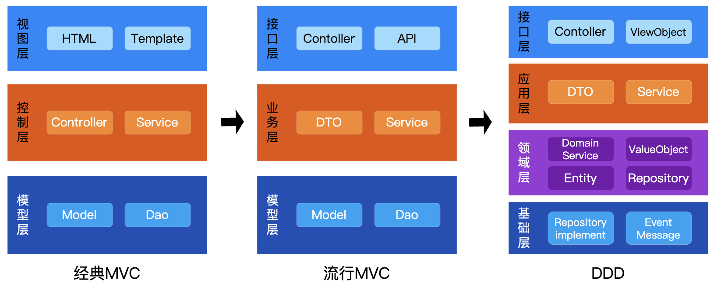

# Go语言 MVC 与 DDD 分层架构详细对比

`MVC`和`DDD`是后台开发两种流行的分层架构思想，`MVC`（Model-View-Controller）是一种设计模式，主要用于分离用户界面、业务逻辑和数据模型，便于分层解耦，而`DDD`（领域驱动设计）则是一种架构方法论，旨在通过构建业务领域模型来解决复杂系统中的设计和维护难题。

在Java领域，很多系统逐渐由`MVC`转为`DDD`，但在Go、Python、NodeJS等领域，秉持简单高效的理念，`MVC`依然是主流架构。下面基于Go语言来具体探讨下`MVC`和`DDD`两种目录结构的区别。



## MVC 图形结构
```c
+------------------+
|      View        | 用户界面层：负责数据展示和用户交互（如HTML页面、API响应）
+------------------+
|   Controller     | 控制层：处理用户请求，调用Service逻辑，协调Model与View
+------------------+
|      Model       | 模型层：包含数据对象（如数据库表结构）和部分业务逻辑（常分散在Service层）
+------------------+
```

## DDD 图形结构
```c
+--------------------+
|   用户界面层（UI）    | 负责用户交互和展示（如REST API、Web界面）
+--------------------+
| 应用层（Application）| 编排业务流程（如调用领域服务、事务管理），不包含核心业务规则
+--------------------+
|  领域层（Domain）    | 核心业务逻辑层：包含聚合根、实体、值对象、领域服务等，内聚业务规则
+--------------------+
|      基础设施层      | 提供技术实现（如数据库访问、消息队列、外部API）
|  （Infrastructure） | 
+--------------------+
```

## `MVC` 与 `DDD` 的主要区别：
**1. 代码组织逻辑**
MVC 按技术功能分层（Controller/Service/DAO），关注技术实现；DDD 按业务领域划分模块（如订单域、支付域），以限界上下文隔离核心业务逻辑。

**2. 业务逻辑载体**
MVC 通常采用贫血模型，数据（Model）与行为（Service）分离，逻辑分散导致维护成本高；DDD 通过聚合根、领域服务实现充血模型，业务逻辑内聚于领域层，增强可扩展性。

**3. 适用性与成本**
MVC 开发成本低，适合需求稳定的中小型系统；DDD 需前期领域建模和统一语言，适用于业务复杂、需长期演进的大型系统，但团队需具备领域抽象能力。例如，电商促销规则用 DDD 可避免逻辑散落在多个 Service 中。

---

## Go语言 `MVC` 目录结构
MVC主要分为三层：视图、控制器、模型。
```bash
gin-order/
├── cmd
│   └── main.go                  # 应用入口，启动 Gin 引擎
├── internal
│   ├── controllers              # 控制器层（处理 HTTP 请求），也可以叫handlers
│   │   └── order
│   │       └── order_controller.go  # Order 模块的控制器
│   ├── services                 # 服务层（业务逻辑处理）
│   │   └── order
│   │       └── order_service.go       # Order 模块的服务实现
│   ├── repository               # 数据访问层（与数据库交互）
│   │   └── order
│   │       └── order_repository.go    # Order 模块的数据访问接口及实现
│   ├── models                   # 模型层（数据结构定义）
│   │   └── order
│   │       └── order.go               # Order 模块的数据模型
│   ├── middleware               # 中间件（如鉴权、日志、请求拦截）
│   │   ├── logging.go             # 日志中间件
│   │   └── auth.go                # 鉴权中间件
│   └── config                   # 配置模块（数据库、服务器等配置）
│       └── config.go                # 应用与环境配置
├── pkg                          # 公共工具包（如响应包装工具）
│   └── response.go              # 响应处理工具方法
├── web                          # 前端资源（模板与静态资源）
│   ├── static                   # 静态资源（CSS、JS、图片）
│   └── templates                # 模板文件（HTML模板）
│       └── order.tmpl           # Order 模块的视图模板（如果需要渲染HTML）
├── go.mod                       # Go 模块管理文件
└── go.sum                       # Go 模块依赖版本锁定
```

---

## Go语言 `DDD` 目录结构
DDD主要分为四层：界面、应用、领域、基础。
```bash
go-web/
│── cmd/
│   └── main.go               # 应用入口
│── internal/
│   ├── application/          # 应用层（协调领域逻辑，处理业务用例）
│   │   ├── services/         # 服务层，业务逻辑目录
│   │   │   └── order_service.go # 订单应用服务，调用领域层业务逻辑
│   ├── domain/               # 领域层（核心业务逻辑和接口定义）
│   │   ├── order/            # 订单聚合
│   │   │   ├── order.go      # 订单实体（聚合根），包含核心业务逻辑
│   │   ├── repository/       # 通用仓库接口
│   │   │   ├── repository.go # 通用仓库接口（通用 CRUD 操作）
│   │   │   └── order_repository.go # 订单仓储接口，定义对订单数据的操作
│   ├── infrastructure/       # 基础设施层（实现领域层定义的接口）
│   │   ├── repository/       # 仓储实现
│   │   │   └── order_repository_impl.go  # 订单仓储实现，具体的订单数据存储
│   └── interfaces/           # 接口层（处理外部请求，如HTTP接口）
│   │   ├── handlers/         # HTTP 处理器
│   │   │  └── order_handler.go # 订单相关的HTTP处理器
│   │   └── routes/
│   │   │   ├── router.go     # 基础路由工具设置
│   │   │   └── order-routes.go # 订单路由地址配置
│   │   │   └── order-routes-test.go # 订单路由测试
│   └── middleware/           # 中间件（例如：鉴权、拦截、认证等）
│   │   └── logging.go        # 日志中间件
│   ├── config/               # 服务相关配置
│   │   └── server_config.go  # 服务器配置（如端口、超时设置等）
│── pkg/                      # 可复用的公共库
│   └── utils/                # 工具类（例如：日志、日期处理等）
```

## Go语言 MVC 代码实现
源码：[https://github.com/microwind/design-patterns/tree/main/mvx/mvc/gin-mvc](https://github.com/microwind/design-patterns/tree/main/mvx/mvc/gin-mvc)
```text
Controller（接口层） → Service（业务逻辑层） → Repository（数据访问层） → Model（数据模型）
```

### 分层代码
- **控制器层（Controller）**

```go
// internal/controller/order/order.go
package order

import (
    "net/http"
    "strconv"
    "github.com/gin-gonic/gin"
    "github.com/gin-order/internal/model"
    "github.com/gin-order/internal/service/order"
    "github.com/gin-order/internal/pkg/response"
)

type OrderController struct {
    service *order.OrderService
}

func NewOrderController(service *order.OrderService) *OrderController {
    return &OrderController{service: service}
}

func (c *OrderController) GetOrder(ctx *gin.Context) {
    idStr := ctx.Param("id")
    id, _ := strconv.ParseUint(idStr, 10, 64)
    
    order, err := c.service.GetOrderByID(uint(id))
    if err != nil {
        response.Error(ctx, http.StatusNotFound, "Order not found")
        return
    }
    
    response.Success(ctx, order)
}

func (c *OrderController) CreateOrder(ctx *gin.Context) {
    var req model.Order
    if err := ctx.ShouldBindJSON(&req); err != nil {
        response.Error(ctx, http.StatusBadRequest, "Invalid request")
        return
    }
    
    if err := c.service.CreateOrder(&req); err != nil {
        response.Error(ctx, http.StatusInternalServerError, "Create failed")
        return
    }
    
    response.Success(ctx, req)
}
```

- **路由配置**
```go
// cmd/server/main.go
package main

import (
    "github.com/gin-gonic/gin"
    "github.com/gin-order/internal/controller/order"
    "github.com/gin-order/internal/pkg/database"
    "github.com/gin-order/internal/repository/order"
    "github.com/gin-order/internal/service/order"
)

func main() {
    // 初始化数据库
    db := database.NewGORM()
    
    // 依赖注入
    orderRepo := order_repo.NewMySQLOrderRepository(db)
    orderService := order_service.NewOrderService(orderRepo)
    orderController := order_controller.NewOrderController(orderService)
    
    // 创建路由
    r := gin.Default()
    
    // 注册中间件
    r.Use(middleware.Logger())
    
    // 路由分组
    apiGroup := r.Group("/api")
    {
        orderGroup := apiGroup.Group("/orders")
        {
            orderGroup.GET("/:id", orderController.GetOrder)
            orderGroup.POST("", orderController.CreateOrder)
        }
    }
    
    // 启动服务
    r.Run(":8080")
}
```

- **服务层（Service）**
```go
// internal/service/order/service.go
package order

import (
    "github.com/gin-order/internal/model"
    "github.com/gin-order/internal/repository/order"
)

type OrderService struct {
    repo order.OrderRepository
}

func NewOrderService(repo order.OrderRepository) *OrderService {
    return &OrderService{repo: repo}
}

func (s *OrderService) GetOrderByID(id uint) (*model.Order, error) {
    return s.repo.FindByID(id)
}

func (s *OrderService) CreateOrder(order *model.Order) error {
    return s.repo.Create(order)
}
```

- **数据访问层（Repository）**
```go
// internal/repository/order/interface.go
package order

import "github.com/gin-order/internal/model"

type OrderRepository interface {
    FindByID(id uint) (*model.Order, error)
    Create(order *model.Order) error
    FindByStatus(status string) ([]model.Order, error)
}
```

```go
// internal/repository/order/mysql.go
package order

import (
    "gorm.io/gorm"
    "github.com/gin-order/internal/model"
)

type MySQLOrderRepository struct {
    db *gorm.DB
}

func NewMySQLOrderRepository(db *gorm.DB) OrderRepository {
    return &MySQLOrderRepository{db: db}
}

func (r *MySQLOrderRepository) FindByID(id uint) (*model.Order, error) {
    var order model.Order
    if err := r.db.First(&order, id).Error; err != nil {
        return nil, err
    }
    return &order, nil
}

func (r *MySQLOrderRepository) Create(order *model.Order) error {
    return r.db.Create(order).Error
}

func (r *MySQLOrderRepository) FindByStatus(status string) ([]model.Order, error) {
    var orders []model.Order
    if err := r.db.Where("status = ?", status).Find(&orders).Error; err != nil {
        return nil, err
    }
    return orders, nil
}
```

- **模型层（Model）**
```go
// internal/model/order.go
package model

import "time"

type Order struct {
    OrderID     uint      `gorm:"primaryKey;column:order_id"`
    OrderNo     string    `gorm:"uniqueIndex;column:order_no"`
    UserID      uint      `gorm:"index;column:user_id"`
    OrderName   string    `gorm:"column:order_name"`
    Amount      float64   `gorm:"type:decimal(10,2);column:amount"`
    Status      string    `gorm:"column:status"`
    CreatedAt   time.Time `gorm:"column:created_at"`
    UpdatedAt   time.Time `gorm:"column:updated_at"`
}

func (Order) TableName() string {
    return "orders"
}
```

## Go语言 MVC 最佳实践
### 接口隔离原则

Repository 层通过接口定义，支持多种数据库实现

```go
// 可轻松切换为 Mock 实现
type MockOrderRepository struct {}
func (m *MockOrderRepository) FindByID(id uint) (*model.Order, error) {
    return &model.Order{OrderNo: "mock-123"}, nil
}
```

### 统一响应格式

```go
// pkg/response/response.go
func Success(c *gin.Context, data interface{}) {
    c.JSON(http.StatusOK, gin.H{
        "code":    0,
        "message": "success",
        "data":    data,
    })
}
```

### 中间件链

```go
// 全局中间件
r.Use(gin.Logger(), gin.Recovery())

// 路由组中间件
adminGroup := r.Group("/admin", middleware.AuthJWT())
```

### 数据库迁移
使用 GORM AutoMigrate：

```go
db.AutoMigrate(&model.Order{})
```

---

## Go语言 DDD 代码实现与最佳实践

源码：https://github.com/microwind/design-patterns/tree/main/domain-driven-design/go-web

### 1. 关注领域模型
DDD 强调领域模型的构建，使用 **聚合（Aggregate）**、**实体（Entity）**、**值对象（Value Object）** 组织业务逻辑。

在 Go 语言中，通常使用 `struct` 定义实体和值对象：

```go
// 实体（Entity）
type User struct {
    ID   int
    Name string
}
```

### 2. 分层架构
DDD 通常采用 **分层架构**，Go 语言项目可以遵循如下结构：

- **领域层（Domain Layer）**：核心业务逻辑，如 `domain` 目录下的实体和聚合。
- **应用层（Application Layer）**：用例（Use Cases）和业务流程编排。
- **基础设施层（Infrastructure Layer）**：数据库、缓存、外部 API 适配等。
- **接口层（Interface Layer）**：提供 HTTP、gRPC 或 CLI 接口。

### 3. 依赖倒置（Dependency Inversion）
领域层不应直接依赖基础设施，而是通过 **接口（Interface）** 进行依赖倒置。
> 注：DDD架构核心就是依赖倒置（DIP），Domain是最核心的内层，仅定义业务规则和接口抽象，其他层级依赖Domain实现，Domain不依赖任何外部实现。在六边形架构（Hexagonal Architecture）中，领域层位于核心，其他层级（如应用层、基础设施层）通过实现领域层定义的接口来提供具体技术细节（如数据库操作、API 调用），从而达成领域与技术实现的解耦。

```go
// 领域层：定义接口
type UserRepository interface {
    GetByID(id int) (*User, error)
}
```

```go
// 基础设施层：数据库实现
type userRepositoryImpl struct {
    db *sql.DB
}

func (r *userRepositoryImpl) GetByID(id int) (*User, error) {
    // 数据库查询逻辑
}
```

### 4. 聚合（Aggregate）管理

聚合根（Aggregate Root）管理整个聚合的生命周期：

```go
type Order struct {
    ID      int
    Items   []OrderItem
    Status  string
}

func (o *Order) AddItem(item OrderItem) {
    o.Items = append(o.Items, item)
}
```

### 5. 应用服务（Application Service）
应用服务封装领域逻辑，避免外部直接操作领域对象：

```go
type OrderService struct {
    repo OrderRepository
}

func (s *OrderService) CreateOrder(userID int, items []OrderItem) (*Order, error) {
    order := Order{UserID: userID, Items: items, Status: "Pending"}
    return s.repo.Save(order)
}
```

### 6. 事件驱动（Event-Driven）
使用 **领域事件（Domain Events）** 进行解耦，在 Go 语言中可通过 **Channel** 或 **Pub/Sub** 实现：

```go
type OrderCreatedEvent struct {
    OrderID int
}

def publishEvent(event OrderCreatedEvent) {
    go func() {
        eventChannel <- event
    }()
}
```

### 7. 结合 CQRS（命令查询职责分离）
DDD 可结合 CQRS（Command Query Responsibility Segregation），在 Go 语言中可用 **命令（Command）** 处理变更操作，用 **查询（Query）** 处理数据读取：

```go
type CreateOrderCommand struct {
    UserID int
    Items  []OrderItem
}

func (h *OrderHandler) Handle(cmd CreateOrderCommand) (*Order, error) {
    return h.service.CreateOrder(cmd.UserID, cmd.Items)
}
```

## MVC与DDD架构总结
### 1. 架构核心区别

| **维度**       | **MVC 架构**                               | **DDD 架构**   |
|----------------|------------------------------------------|--------------------------------------------|
| **层级**       | 三层：Controller/Service/DAO         | 四层：接口层/应用层/领域层/基础设施层    |
| **职责**       | - Controller 处理请求，Service 承载逻辑<br>- DAO 直接操作数据库             | - 应用层编排流程（如调用领域服务）<br>- 领域层内聚业务原子操作（如订单创建规则）<br>- 基础设施层实现技术细节（如数据库访问） |
| **痛点**       | Service 层臃肿，业务逻辑与数据操作耦合        | 领域层独立于技术实现，逻辑与层级强对应       |

### 2. 模块化与扩展性

**MVC**：
- **高耦合**：缺乏明确的业务边界，跨模块调用（如订单服务直接依赖账户表）导致代码难以维护。
- **扩展性差**：新增功能需全局修改（如添加风控规则需侵入订单服务），易引发连锁问题。

**DDD**：
- **限界上下文**：按业务能力划分模块（如支付域、风控域），通过事件驱动（如订单支付完成事件）解耦协作。
- **独立演进**：各领域模块可独立升级（如支付逻辑优化不影响订单服务），降低系统级风险。

### 3. 适用场景区别
- **中小系统优先 MVC**：业务简单（如博客、CMS、管理后台），需快速开发且业务规则清晰，无后续反复变更。
- **复杂业务转向 DDD**：规则密集（如金融交易、供应链）、多领域协作（如电商订单与库存联动），后续变更频繁。
- **该如何选择？** 具体选择哪种架构需要因时因地而异，不能一概而论，而是要深入分析，不同场景采取不同的方案。

## 更多架构设计源码
- [https://github.com/microwind/design-patterns](https://github.com/microwind/design-patterns)
- [https://github.com/microwind/algorithms](https://github.com/microwind/algorithms)