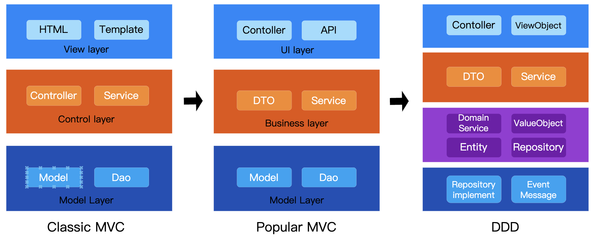

# Detailed Comparison of MVC and DDD Layered Architectures in Go

`MVC` and `DDD` are two popular layered architecture paradigms in backend development. MVC (Model-View-Controller) is a design pattern that mainly separates the user interface, business logic, and data models to facilitate decoupling, whereas DDD (Domain-Driven Design) is an architectural methodology aimed at solving design and maintenance challenges in complex systems by constructing business domain models.

In the `Java` ecosystem, many systems have gradually shifted from MVC to DDD. However, in languages such as `Go`, `Python`, and `NodeJS`—where simplicity and efficiency are prioritized—MVC remains the mainstream architecture. Below, we explore the differences in directory structures between MVC and DDD using Go as an example.



## MVC Diagram Structure
```c
+------------------+
|      View        | User Interface Layer: Responsible for data presentation and user interactions (e.g., HTML pages, API responses)
+------------------+
|   Controller     | Controller Layer: Handles user requests, invokes service logic, and coordinates between Model and View
+------------------+
|      Model       | Model Layer: Contains data objects (e.g., database table structures) and some business logic (often dispersed in the Service layer)
+------------------+
```

## DDD Diagram Structure
```c
+---------------------+
| User Interface (UI) | Handles user interactions and presentations (e.g., REST API, Web interface)
+---------------------+
| Application Layer   | Orchestrates business processes (e.g., invoking domain services, transaction management) without including core business rules
+---------------------+
|   Domain Layer      | Core business logic layer: Contains aggregate roots, entities, value objects, domain services, etc., and encapsulates business rules
+---------------------+
| Infrastructure Layer| Provides technical implementations (e.g., database access, message queues, external APIs)
|  (Infrastructure)   | 
+---------------------+
```

## Main Differences between `MVC` and `DDD`
**1. Code Organization Logic**
MVC organizes code by technical functions (Controller/Service/DAO), focusing on implementation details; DDD, on the other hand, structures modules by business domains (e.g., order domain, payment domain), isolating core business logic within bounded contexts.

**2. Carrier of Business Logic**
MVC typically uses an anemic model where data (Model) and behavior (Service) are separated, leading to scattered logic and increased maintenance costs; DDD implements a rich model through aggregate roots and domain services, centralizing business logic in the domain layer to enhance scalability.

**3. Applicability and Cost**
MVC offers lower development costs and is suitable for small to medium-sized systems with stable requirements; DDD requires upfront domain modeling and a common language, making it more appropriate for large, complex systems that need long-term evolution—though it demands strong domain abstraction capabilities from the team. For instance, using DDD for e-commerce promotion rules can prevent business logic from scattering across multiple services.

---

## Go Language `MVC` Directory Structure
MVC mainly consists of three layers: View, Controller, and Model.
```bash
gin-order/
├── cmd
│   └── main.go                  # Application entry point, starts the Gin engine
├── internal
│   ├── controllers              # Controller layer (handles HTTP requests), also known as handlers
│   │   └── order
│   │       └── order_controller.go  # Controller for the Order module
│   ├── services                 # Service layer (business logic processing)
│   │   └── order
│   │       └── order_service.go       # Service implementation for the Order module
│   ├── repository               # Data access layer (interacts with the database)
│   │   └── order
│   │       └── order_repository.go    # Data access interface and implementation for the Order module
│   ├── models                   # Model layer (data structure definitions)
│   │   └── order
│   │       └── order.go               # Data model for the Order module
│   ├── middleware               # Middleware (e.g., authentication, logging, request interception)
│   │   ├── logging.go             # Logging middleware
│   │   └── auth.go                # Authentication middleware
│   └── config                   # Configuration module (database, server, etc. configurations)
│       └── config.go                # Application and environment configuration
├── pkg                          # Common utility packages (e.g., response wrapping tools)
│   └── response.go              # Response handling utility methods
├── web                          # Front-end resources (templates and static assets)
│   ├── static                   # Static assets (CSS, JS, images)
│   └── templates                # Template files (HTML templates)
│       └── order.tmpl           # View template for the Order module (if HTML rendering is needed)
├── go.mod                       # Go module management file
└── go.sum                       # Go module dependency version lock file
```

---

## Go Language `DDD` Directory Structure
DDD mainly consists of four layers: Interfaces, Application, Domain, and Infrastructure.
```bash
go-web/
│── cmd/
│   └── main.go               # Application entry point
│── internal/
│   ├── application/          # Application layer (coordinates domain logic, handles business use cases)
│   │   ├── services/         # Service layer, business logic directory
│   │   │   └── order_service.go # Order application service, calls domain layer business logic
│   ├── domain/               # Domain layer (core business logic and interface definitions)
│   │   ├── order/            # Order aggregate
│   │   │   ├── order.go      # Order entity (aggregate root) that contains core business logic
│   │   ├── repository/       # Common repository interfaces
│   │   │   ├── repository.go # Common repository interface (general CRUD operations)
│   │   │   └── order_repository.go # Order repository interface, defines operations on order data
│   ├── infrastructure/       # Infrastructure layer (implements the interfaces defined in the domain layer)
│   │   ├── repository/       # Repository implementations
│   │   │   └── order_repository_impl.go  # Order repository implementation, specific storage for order data
│   └── interfaces/           # Interface layer (handles external requests, such as HTTP interfaces)
│   │   ├── handlers/         # HTTP handlers
│   │   │  └── order_handler.go # HTTP handler for order-related operations
│   │   └── routes/
│   │   │   ├── router.go     # Basic routing configuration tool
│   │   │   └── order-routes.go # Order route configuration
│   │   │   └── order-routes-test.go # Order route tests
│   └── middleware/           # Middleware (e.g., authentication, interception, authorization)
│   │   └── logging.go        # Logging middleware
│   ├── config/               # Service-related configurations
│   │   └── server_config.go  # Server configurations (e.g., port, timeout settings, etc.)
│── pkg/                      # Reusable common libraries
│   └── utils/                # Utility classes (e.g., logging, date handling, etc.)
```

## Go Language MVC Code Implementation
Source code: https://github.com/microwind/design-patterns/tree/main/mvx/mvc/gin-mvc
```text
Controller (Interface layer) → Service (Business logic layer) → Repository (Data access layer) → Model (Data model)
```

### Layered Code
- **Controller Layer**

```go
// internal/controller/order/order.go
package order

import (
    "net/http"
    "strconv"
    "github.com/gin-gonic/gin"
    "github.com/gin-order/internal/model"
    "github.com/gin-order/internal/service/order"
    "github.com/gin-order/internal/pkg/response"
)

type OrderController struct {
    service *order.OrderService
}

func NewOrderController(service *order.OrderService) *OrderController {
    return &OrderController{service: service}
}

func (c *OrderController) GetOrder(ctx *gin.Context) {
    idStr := ctx.Param("id")
    id, _ := strconv.ParseUint(idStr, 10, 64)
    
    order, err := c.service.GetOrderByID(uint(id))
    if err != nil {
        response.Error(ctx, http.StatusNotFound, "Order not found")
        return
    }
    
    response.Success(ctx, order)
}

func (c *OrderController) CreateOrder(ctx *gin.Context) {
    var req model.Order
    if err := ctx.ShouldBindJSON(&req); err != nil {
        response.Error(ctx, http.StatusBadRequest, "Invalid request")
        return
    }
    
    if err := c.service.CreateOrder(&req); err != nil {
        response.Error(ctx, http.StatusInternalServerError, "Create failed")
        return
    }
    
    response.Success(ctx, req)
}
```

- **Routing Configuration**
```go
// cmd/server/main.go
package main

import (
    "github.com/gin-gonic/gin"
    "github.com/gin-order/internal/controller/order"
    "github.com/gin-order/internal/pkg/database"
    order_repo "github.com/gin-order/internal/repository/order"
    order_service "github.com/gin-order/internal/service/order"
    "github.com/gin-order/internal/middleware"
)

func main() {
    // Initialize the database
    db := database.NewGORM()
    
    // Dependency injection
    orderRepo := order_repo.NewMySQLOrderRepository(db)
    orderService := order_service.NewOrderService(orderRepo)
    orderController := order.NewOrderController(orderService)
    
    // Create the router
    r := gin.Default()
    
    // Register middleware
    r.Use(middleware.Logger())
    
    // Route grouping
    apiGroup := r.Group("/api")
    {
        orderGroup := apiGroup.Group("/orders")
        {
            orderGroup.GET("/:id", orderController.GetOrder)
            orderGroup.POST("", orderController.CreateOrder)
        }
    }
    
    // Start the service
    r.Run(":8080")
}
```

- **Service Layer**
```go
// internal/service/order/service.go
package order

import (
    "github.com/gin-order/internal/model"
    order_repo "github.com/gin-order/internal/repository/order"
)

type OrderService struct {
    repo order_repo.OrderRepository
}

func NewOrderService(repo order_repo.OrderRepository) *OrderService {
    return &OrderService{repo: repo}
}

func (s *OrderService) GetOrderByID(id uint) (*model.Order, error) {
    return s.repo.FindByID(id)
}

func (s *OrderService) CreateOrder(order *model.Order) error {
    return s.repo.Create(order)
}
```

- **Repository Layer (Data Access Layer)**
```go
// internal/repository/order/interface.go
package order

import "github.com/gin-order/internal/model"

type OrderRepository interface {
    FindByID(id uint) (*model.Order, error)
    Create(order *model.Order) error
    FindByStatus(status string) ([]model.Order, error)
}
```

```go
// internal/repository/order/mysql.go
package order

import (
    "gorm.io/gorm"
    "github.com/gin-order/internal/model"
)

type MySQLOrderRepository struct {
    db *gorm.DB
}

func NewMySQLOrderRepository(db *gorm.DB) OrderRepository {
    return &MySQLOrderRepository{db: db}
}

func (r *MySQLOrderRepository) FindByID(id uint) (*model.Order, error) {
    var order model.Order
    if err := r.db.First(&order, id).Error; err != nil {
        return nil, err
    }
    return &order, nil
}

func (r *MySQLOrderRepository) Create(order *model.Order) error {
    return r.db.Create(order).Error
}

func (r *MySQLOrderRepository) FindByStatus(status string) ([]model.Order, error) {
    var orders []model.Order
    if err := r.db.Where("status = ?", status).Find(&orders).Error; err != nil {
        return nil, err
    }
    return orders, nil
}
```

- **Model Layer**
```go
// internal/model/order.go
package model

import "time"

type Order struct {
    OrderID   uint      `gorm:"primaryKey;column:order_id"`
    OrderNo   string    `gorm:"uniqueIndex;column:order_no"`
    UserID    uint      `gorm:"index;column:user_id"`
    OrderName string    `gorm:"column:order_name"`
    Amount    float64   `gorm:"type:decimal(10,2);column:amount"`
    Status    string    `gorm:"column:status"`
    CreatedAt time.Time `gorm:"column:created_at"`
    UpdatedAt time.Time `gorm:"column:updated_at"`
}

func (Order) TableName() string {
    return "orders"
}
```

## Go Language MVC Best Practices
### Interface Segregation Principle
The repository layer defines interfaces to support multiple database implementations.

```go
// Easily switch to a mock implementation
type MockOrderRepository struct {}
func (m *MockOrderRepository) FindByID(id uint) (*model.Order, error) {
    return &model.Order{OrderNo: "mock-123"}, nil
}
```

### Unified Response Format

```go
// pkg/response/response.go
func Success(c *gin.Context, data interface{}) {
    c.JSON(http.StatusOK, gin.H{
        "code":    0,
        "message": "success",
        "data":    data,
    })
}
```

### Middleware Chain

```go
// Global middleware
r.Use(gin.Logger(), gin.Recovery())

// Route group middleware
adminGroup := r.Group("/admin", middleware.AuthJWT())
```

### Database Migration
Using GORM AutoMigrate:

```go
db.AutoMigrate(&model.Order{})
```

---

## Go Language DDD Code Implementation and Best Practices
Source code: https://github.com/microwind/design-patterns/tree/main/domain-driven-design/go-web

### 1. Focus on Domain Models
Domain-Driven Design (DDD) emphasizes constructing domain models using `Aggregates`, `Entities`, and `Value Objects` to organize business logic.

In Go, entities and value objects are typically defined using struct:

```go
// Entity
type User struct {
    ID   int
    Name string
}
```

### Layered Architecture
DDD often employs a **layered architecture**. A Go project can follow this structure:

- **Domain Layer**: Core business logic, such as entities and aggregates in the domain directory.
- **Application Layer**: Use cases and business process orchestration.
- **Infrastructure Layer**: Adapters for databases, caches, external APIs, etc.
-**Interface Layer**: Provides HTTP, gRPC, or CLI interfaces.

### 3. Dependency Inversion
The domain layer should not directly depend on infrastructure; instead, it uses interfaces to achieve dependency inversion.
> Note: The core of DDD architecture is Dependency Inversion Principle (DIP). The Domain is the innermost core, defining business rules and abstract interfaces. Other layers depend on the Domain for implementation, while the Domain remains independent of external implementations. In Hexagonal Architecture, the domain layer is at the core, with other layers (like application and infrastructure) implementing interfaces defined by the domain layer, thereby decoupling domain logic from technical implementations.

```go
// Domain Layer: Define Interface
type UserRepository interface {
    GetByID(id int) (*User, error)
}
```

```go
// Infrastructure Layer: Database Implementation
type userRepositoryImpl struct {
    db *sql.DB
}

func (r *userRepositoryImpl) GetByID(id int) (*User, error) {
    // Database query logic
}
```

### 4. Aggregate Management
The Aggregate Root manages the lifecycle of the entire aggregate:

```go
type Order struct {
    ID      int
    Items   []OrderItem
    Status  string
}

func (o *Order) AddItem(item OrderItem) {
    o.Items = append(o.Items, item)
}
```

### 5. 5. Application Services
Application services encapsulate domain logic, preventing external direct manipulation of domain objects:

```go
type OrderService struct {
    repo OrderRepository
}

func (s *OrderService) CreateOrder(userID int, items []OrderItem) (*Order, error) {
    order := Order{UserID: userID, Items: items, Status: "Pending"}
    return s.repo.Save(order)
}
```

### 6. 6. Event-Driven
Utilize Domain Events for decoupling. In Go, this can be implemented using Channels or Pub/Sub mechanisms:

```go
type OrderCreatedEvent struct {
    OrderID int
}

def publishEvent(event OrderCreatedEvent) {
    go func() {
        eventChannel <- event
    }()
}
```

### 7. Combining CQRS (Command Query Responsibility Segregation)
DDD can be combined with `CQRS`. In Go, Commands handle state-changing operations, while `Queries` handle data retrieval:

```go
type CreateOrderCommand struct {
    UserID int
    Items  []OrderItem
}

func (h *OrderHandler) Handle(cmd CreateOrderCommand) (*Order, error) {
    return h.service.CreateOrder(cmd.UserID, cmd.Items)
}
```

## Summary of MVC and DDD Architectures

### 1. Core Architectural Differences

| **Dimension**   | **MVC Architecture**                               | **DDD Architecture**   |
|-----------------|----------------------------------------------------|-------------------------|
| **Layers**      | Three layers: Controller/Service/DAO               | Four layers: Interface Layer/Application Layer/Domain Layer/Infrastructure Layer |
| **Responsibilities** | - Controller handles requests<br>- Service contains business logic<br>- DAO directly interacts with the database | - Application Layer orchestrates processes (e.g., invoking domain services)<br>- Domain Layer encapsulates business operations (e.g., order creation rules)<br>- Infrastructure Layer implements technical details (e.g., database access) |
| **Pain Points** | - Service layer becomes bloated, mixing business logic with data operations<br>- Tight coupling between components makes maintenance challenging | - Domain layer is independent of technical implementations, with logic corresponding closely to specific layers |

### 2. Modularity and Scalability

**MVC:**
- **High Coupling:** Lacks clear business boundaries; cross-module dependencies (e.g., order service directly depends on account table) make maintenance challenging.
- **Poor Scalability:** Adding new features requires global modifications (e.g., introducing a risk control rule necessitates changes in the order service), potentially causing cascading issues.

**DDD:**
- **Bounded Contexts:** Modules are divided based on business capabilities (e.g., payment domain, risk control domain); collaboration is achieved through event-driven mechanisms (e.g., order payment completion event), reducing coupling.
- **Independent Evolution:** Each domain module can be upgraded independently (e.g., optimizing payment logic without affecting the order service), minimizing system-wide risks.

### 3. Applicable Scenarios

- **Prefer MVC for Small to Medium Systems:** Suitable for simple business scenarios (e.g., blogs, CMS, management dashboards) requiring rapid development with clear and stable business rules.
- **Transition to DDD for Complex Businesses:** Ideal for domains with intensive rules (e.g., financial transactions, supply chains) and multi-domain collaboration (e.g., e-commerce order and inventory linkage), especially when frequent changes are anticipated.
- **How to Choose?** The selection of an architecture should be context-specific; thorough analysis is essential to determine the most appropriate approach for each scenario.

## Additional Architectural Design Resources

- [https://github.com/microwind/design-patterns](https://github.com/microwind/design-patterns)
- [https://github.com/microwind/algorithms](https://github.com/microwind/algorithms)
- [This article link](https://microwind.medium.com/detailed-comparison-of-mvc-and-ddd-layered-architectures-in-go-a47f6a7188b3)
