# AI时代：如何进行DDD领域驱动设计？

## 前言

在软件开发的漫长历程中，我们一直在寻找一种能够有效应对复杂业务逻辑的方法。随着业务系统的日益复杂，传统的开发模式逐渐显露出其局限性：业务逻辑散落在各处、代码难以维护、需求变更响应缓慢。正是在这样的背景下，领域驱动设计（Domain-Driven Design，简称 DDD）应运而生。

进入AI时代，软件开发面临新的变革。从ChatGPT到Claude Code，再到OpenClaw等Agent框架，AI正在深刻改变软件开发的各个环节。AI时代，程序员的价值从"写代码"转向"指导AI干活"，这要求我们具备更深入的业务理解能力和更清晰的系统设计能力。

DDD 不仅是一种架构方法，更是一种思维方式。它通过建立领域模型，将业务知识转化为软件构造的核心，使开发人员能够用业务语言来思考和编写代码。在AI时代，DDD的价值更加凸显——它为AI提供了清晰的业务边界、统一的领域语言和结构化的设计框架，让AI能够更准确地理解意图、生成高质量的代码。

本文将系统性地介绍 DDD 的核心概念、设计方法以及实际应用，并特别探讨AI时代下DDD的重要性和应用，帮助你从零开始理解并掌握 DDD，在AI时代成为优秀的领域驱动设计工程师。

## 为什么需要领域驱动设计

### 传统开发模式的困境

在深入 DDD 之前，我们先看看传统开发模式面临的困境。以大家熟悉的 MVC 模式为例：

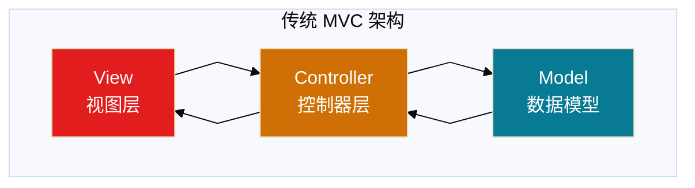

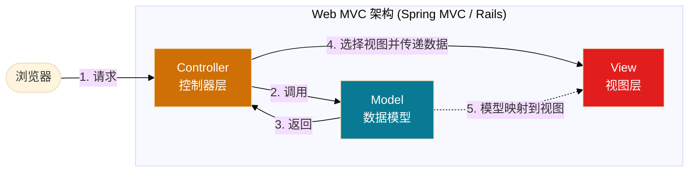


MVC 模式在业务逻辑简单的场景下确实高效，但随着业务复杂度的增加，逐渐暴露出以下问题：

1. **缺乏业务语言**：MVC 仅仅反映了软件层面的架构，不包含业务语言，无法直接与业务对话
2. **数据与行为分离**：天然切割了数据和行为，容易造成需求的首尾分离
3. **边界不清晰**：缺乏明确的边界划分规范，大规模团队协作容易出现职责不清晰
4. **业务逻辑散落**：业务规则散落在 Controller、Service、Model 各处，难以维护

### DDD 的解决方案

DDD 通过以下方式解决上述问题：

**MVC vs DDD 架构对比**：

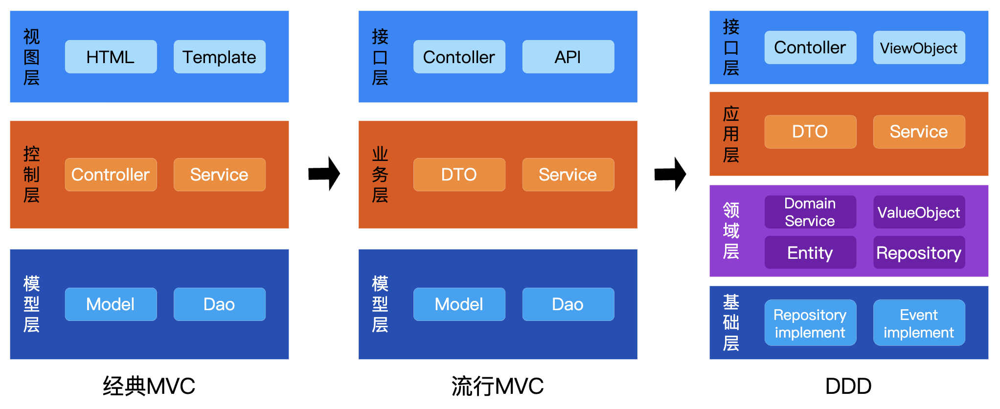

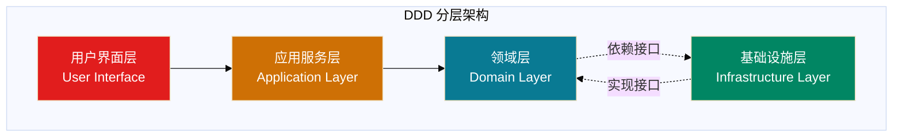

DDD 的核心思想是：**用业务语言统一代码和需求，让复杂系统按业务边界清晰拆分**。

## AI时代：为什么DDD格外重要

### AI时代软件开发的新变革

2025年Claude与Codex等Agent的推出，深刻改变了软件开发的各个环节：

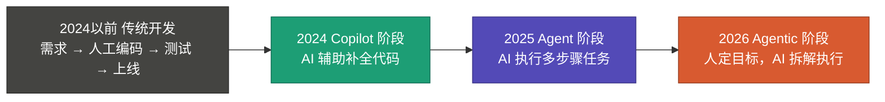

**关键转折点**：传统时代：程序员写代码，代码执行。AI新时代：程序员指导AI，AI写代码，代码执行。

### AI时代DDD的核心价值

#### 1. 为AI提供清晰的业务边界

AI时代，程序员的核心职责从"写代码"转向"指导AI干活"。要让AI准确理解业务意图，必须提供清晰的业务边界。

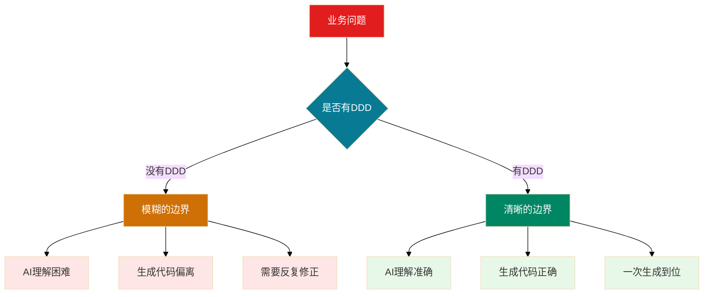

**DDD如何提供清晰边界**：
- **限界上下文**：明确每个上下文的职责和边界
- **聚合设计**：定义聚合根和聚合边界
- **领域服务**：封装跨聚合的业务逻辑
- **领域事件**：定义上下文间的通信边界

#### 2. 统一语言成为AI理解的基础

AI时代，需求描述能力成为核心竞争力。DDD的统一语言为AI提供了标准的业务术语和概念。

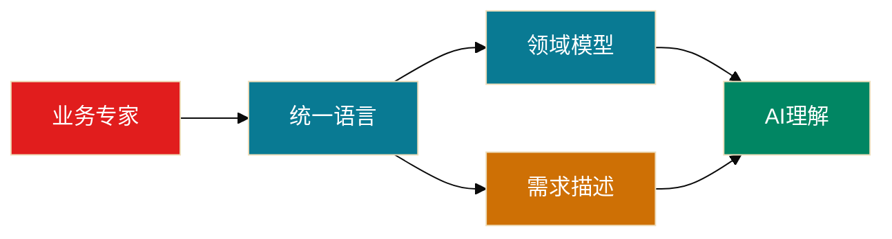

**统一语言对AI的价值**：
- **标准化术语**：AI能够准确理解业务概念
- **结构化表达**：提供一致的需求描述框架
- **减少歧义**：避免因术语混乱导致的理解偏差
- **上下文传递**：为AI提供丰富的业务上下文

#### 3. 领域模型成为AI生成的蓝图

AI时代，系统设计能力变得更加重要。DDD的领域模型为AI提供了结构化的设计蓝图。

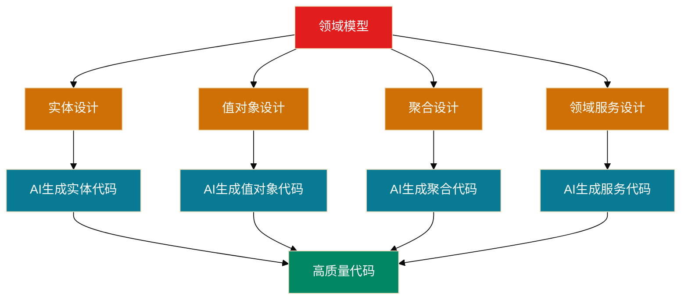

**领域模型对AI的指导作用**：
- **结构化设计**：为AI提供清晰的代码结构
- **业务逻辑封装**：指导AI正确实现业务规则
- **关系定义**：明确对象间的关系和依赖
- **行为规范**：定义对象的行为和约束

#### 4. Agent时代的DDD应用

随着ClaudeCode、OpenClaw等Agent框架的出现，AI具备自主规划执行能力。DDD为Agent提供了任务分解和执行的基础框架。

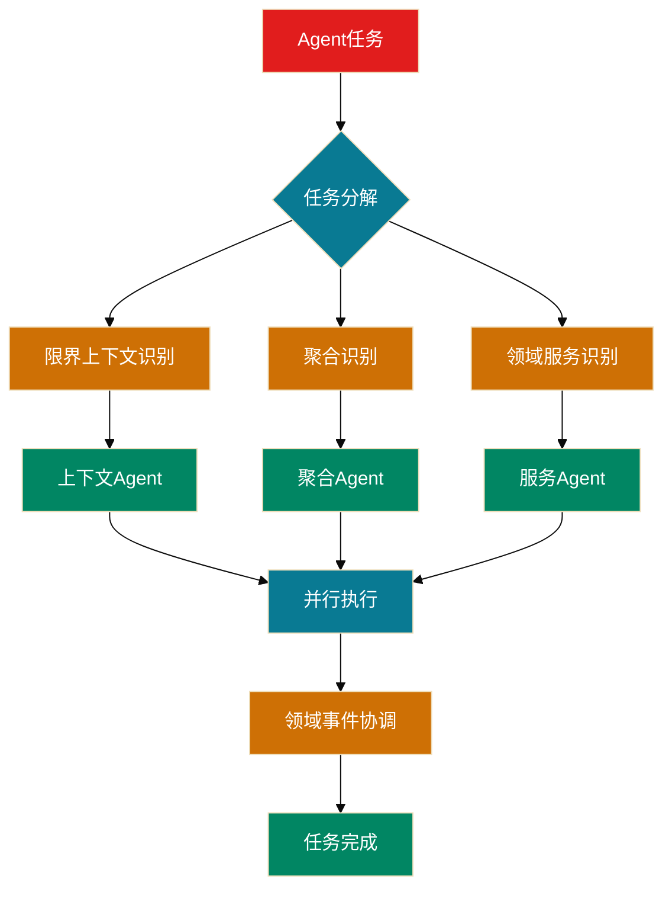

**DDD在Agent时代的应用**：
- **任务分解**：基于限界上下文分解复杂任务
- **自主执行**：Agent根据领域模型自主执行
- **事件协调**：通过领域事件协调Agent间协作
- **边界保护**：确保Agent在限界上下文内执行

### AI时代DDD的实践指南

#### 1. 为AI优化的领域建模

**传统建模 vs AI时代建模**：

| 维度 | 传统建模 | AI时代建模 |
|------|---------|-----------|
| **建模目标** | 人工理解 | AI理解 |
| **表达方式** | 图表+文档 | 结构化描述 |
| **详细程度** | 概念级 | 实现级 |
| **验证方式** | 人工Review | AI验证 |

**AI时代建模要点**：
- **结构化描述**：使用标准化的描述格式
- **完整信息**：提供足够的上下文和约束
- **可执行性**：确保模型可以直接指导代码生成
- **可验证性**：设计可验证的业务规则

#### 2. AI辅助的DDD实施

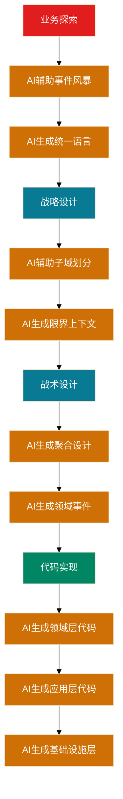

**AI辅助DDD的优势**：
- **加速建模**：AI快速生成初步模型
- **质量提升**：AI发现建模中的不一致
- **知识沉淀**：AI记录建模决策过程
- **持续优化**：AI基于反馈优化模型

#### 4. AI时代DDD工具链

**建模工具**：
- **AI辅助事件风暴**：使用AI工具（如Claude Code）辅助识别领域事件、命令、聚合
- **自动生成统一语言**：AI从业务文档中提取关键术语，生成词汇表
- **领域模型验证**：AI检查模型的一致性和完整性

**代码生成**：
- **基于领域模型的代码生成**：输入领域模型，AI生成实体、值对象、聚合代码
- **接口自动生成**：AI根据领域模型生成Repository接口和领域服务接口
- **测试代码生成**：AI基于业务规则生成单元测试和集成测试

**质量验证**：
- **AI驱动的代码审查**：AI检查代码是否符合DDD原则
- **领域规则验证**：AI验证业务规则是否正确实现
- **架构一致性检查**：AI检查分层架构是否正确

**实践建议**：
1. **渐进式引入AI**：从简单的代码生成开始，逐步扩展到建模和验证
2. **保持人工审核**：AI生成的内容需要人工审核和调整
3. **建立AI使用规范**：制定AI工具的使用标准和流程
4. **持续学习优化**：根据使用反馈不断优化AI提示词和工作流程

#### 3. AI时代的DDD团队

**新角色定义**：

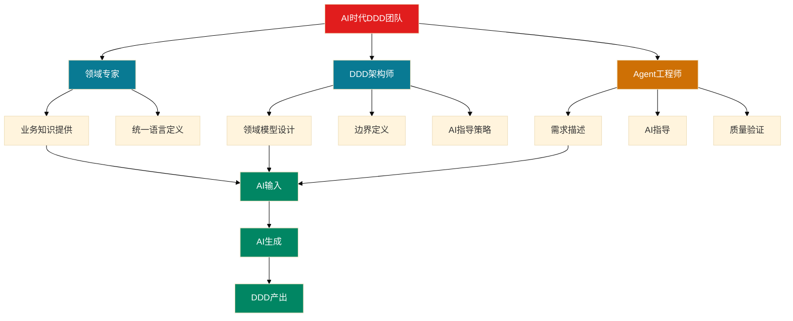

**核心能力要求**：
- **领域专家**：深度业务理解，清晰的业务表达
- **DDD架构师**：系统设计能力，AI指导策略
- **Agent工程师**：需求描述，AI协调，质量验证

### AI时代DDD的挑战与机遇

#### 挑战

1. **AI理解局限性**：AI可能误解复杂的业务规则
2. **幻觉问题**：AI可能生成不符合实际的内容
3. **上下文限制**：AI的上下文窗口有限
4. **质量控制**：需要新的质量验证方法

#### 机遇

1. **开发效率提升**：AI大幅加速开发过程
2. **质量一致性**：AI保证代码风格和结构一致
3. **知识传承**：AI记录和传承领域知识
4. **创新空间**：人类可以专注于更高价值的创新

AI时代，DDD的价值不仅没有减弱，反而更加重要：

1. **为AI提供清晰的业务边界**，让AI准确理解业务意图
2. **统一语言成为AI理解的基础**，提供标准化的业务术语
3. **领域模型成为AI生成的蓝图**，指导AI生成高质量代码
4. **支持Agent时代的任务分解**，为自主执行提供框架

掌握DDD思想精髓的工程师将有效指导AI完成复杂的业务系统开发。DDD不再仅仅是架构方法，更是AI时代软件工程的核心竞争力。

## 如何用好DDD：实践指南

### 1. DDD适用的判断标准

#### 适合使用DDD的场景
- **中大型业务系统**：业务规则复杂，需要深度领域知识
- **需要长期维护**：需要持续演进和扩展的系统
- **需要多团队协作**：需要明确边界和协作规范的大型项目

#### 不适合使用DDD的场景
- **简单CRUD应用**：业务逻辑简单，主要是数据增删改查
- **快速原型开发**：需要快速验证想法，不需要长期维护
- **小型项目**：团队规模小，业务复杂度低

### 2. DDD实施的关键步骤

#### 第一阶段：业务探索


**关键产出**：
- 业务流程图
- 领域事件清单
- 统一语言词汇表
- 初步的领域概念

#### 第二阶段：战略设计


**关键产出**：
- 子域划分图
- 限界上下文地图
- 上下文映射关系
- 技术架构蓝图

#### 第三阶段：战术设计


**关键产出**：
- 聚合设计图
- 实体关系图
- 领域事件清单
- 仓储接口定义

#### 第四阶段：代码实现


**关键产出**：
- 可运行的代码
- 单元测试
- 集成测试
- 部署文档

### 3. DDD成功的关键因素

#### 组织因素
- **管理层支持**：DDD需要投入额外的设计和沟通成本
- **业务专家参与**：领域专家深度参与建模过程
- **团队技能**：团队需要具备DDD思维和技能
- **文化转变**：从技术驱动转向业务驱动

#### 技术因素
- **建模能力**：能够抽象和表达业务概念
- **架构设计**：合理的分层和模块划分
- **代码质量**：保持代码的清晰和可维护性
- **测试覆盖**：确保领域逻辑的正确性

#### 过程因素
- **迭代演进**：模型需要持续优化和调整
- **持续沟通**：保持团队间的有效沟通
- **文档维护**：及时更新设计文档和统一语言
- **反馈收集**：从使用中收集反馈改进模型

### 4. 常见的DDD误区和避免方法

#### 误区1：过度设计
**表现**：为了DDD而DDD，引入不必要的复杂性
**避免方法**：
- 从简单开始，逐步演进
- 关注业务价值，避免技术炫技
- 定期review设计的必要性

#### 误区2：忽视业务专家
**表现**：技术人员闭门造车，脱离业务实际
**避免方法**：
- 建立业务专家参与机制
- 定期组织建模工作坊
- 确保统一语言的准确性

#### 误区3：僵化执行
**表现**：严格遵循DDD规则，缺乏灵活性
**避免方法**：
- 理解DDD的原理而非形式
- 根据实际情况调整方法
- 保持实用性优先原则

## DDD 基本概念

DDD 的概念体系可以分为战略设计和战术设计两个层面：

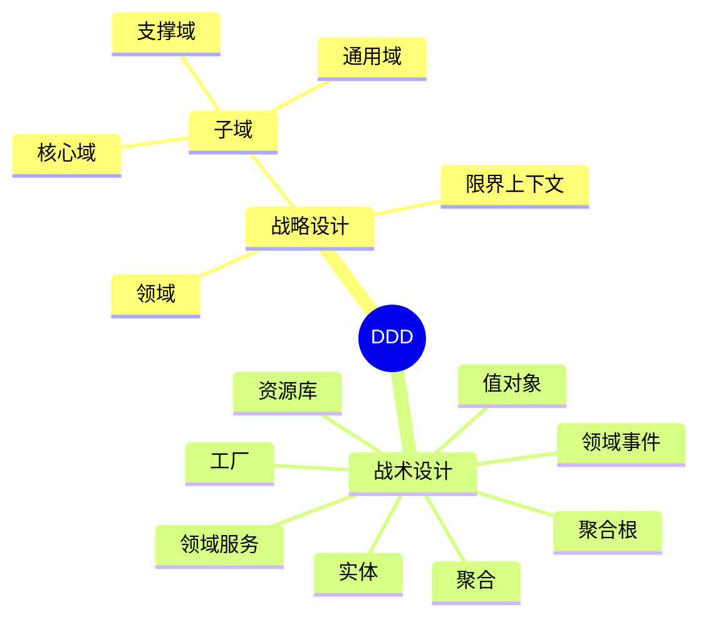

## 战略设计

战略设计是对整个领域进行分析和规划，确定领域中的概念、业务规则和领域边界等基础性问题。

### 领域（Domain）

领域就是一个组织所要做的整个事情，以及这个事情下所包含的一切内容。这是一个范围概念，而且是面向业务的。

**示例**：
- 电商公司的领域：电商领域
- 银行的领域：金融领域
- 医院的领域：医疗领域

### 子域（Subdomain）

子域是指在一个大的领域中，可以进一步划分出来的独立的业务子领域，它们有着自己的业务概念、规则和流程。

**示例**：在电商领域中，可以划分出以下子域：
- 商品域
- 订单域
- 支付域
- 物流域
- 用户域

根据重要性的不同，子域又可分为：

#### 核心域（Core Domain）

决定公司和产品核心竞争力的子域，是业务成功的主要因素。

**示例**：在电商系统中，订单域就是核心域，因为订单处理直接关系到公司的收入。

#### 支撑域（Supporting Domain）

支撑其他领域业务，具有企业特性，但不具有通用性。

**示例**：商品域、评论域就是支撑域。

#### 通用域（Generic Domain）

没有太多个性化的诉求，同时被多个子域使用的、具有通用功能的子域。

**示例**：权限域、登录域就是通用域。

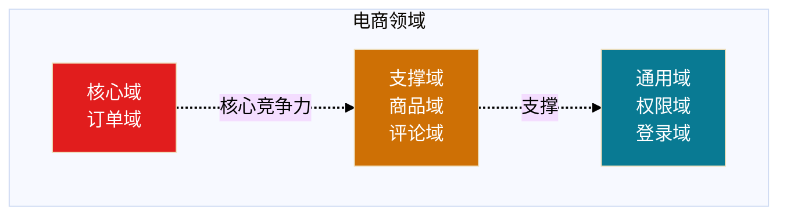

### 限界上下文（Bounded Context）

限界上下文就是业务边界的划分，这个边界可以是一个子域或者多个子域的集合。限界上下文是微服务拆分的依据，即每个限界上下文对应一个微服务。

**划分原则**：一个限界上下文必须支持一个完整的业务流程，保证这个业务流程所涉及的领域都在一个限界上下文中。

**示例**：在电商系统中，可以有以下限界上下文：
- 订单上下文（包含订单域、支付域）
- 商品上下文（包含商品域）
- 用户上下文（包含用户域、权限域）

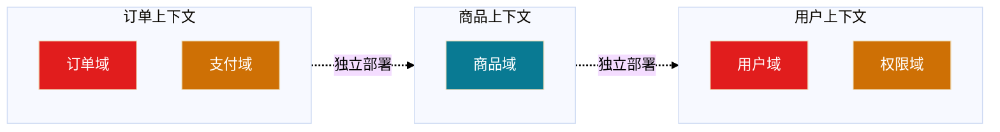

### 范围关系

领域、子域、限界上下文、聚合都是用来表示一个业务范围，它们的关系如下：

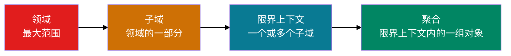

## 战术设计

战术设计是在战略设计的基础上，对领域中的具体问题进行具体的解决方案设计。

### 实体（Entity）

**定义**：实体是拥有唯一标识和状态，且具有生命周期的业务对象。实体通常代表着现实世界中的某个概念。

**特点**：
- 有唯一标识（ID）
- 有状态
- 有生命周期
- 可变性

**代码示例**（Go 语言，来自 go-web 目录）：

```go
// 【DDD】实体承担身份标识与状态迁移：状态变更（如支付）由实体方法表达业务规则。
// 【非DDD】Controller/Service 里直接改 Status 字符串，或实体只有 getter/setter 而无领域行为（贫血模型）。
// 订单实体
type Order struct {
    ID           string
    CustomerName string
    Amount       float64
    Status       string
    CreatedAt    time.Time
    UpdatedAt    time.Time
}

// 领域行为：支付订单
func (o *Order) Pay() error {
    if o.Status != "PENDING" {
        return errors.New("只有待支付订单可以支付")
    }
    o.Status = "PAID"
    o.UpdatedAt = time.Now()
    return nil
}
```

**实体的代码形态**：
- **失血模型**：仅包含数据和 getter/setter，业务逻辑都在服务层
- **贫血模型**：包含一些业务逻辑，但不包含依赖持久层的业务逻辑
- **充血模型**：包含所有业务逻辑，包括依赖持久层的业务逻辑
- **胀血模型**：将业务逻辑无关的应用逻辑也放到领域模型中

**推荐**：采用贫血模型，实体和领域服务共同构成领域模型。

### 值对象（Value Object）

**定义**：通过对象属性值来识别的对象，它将多个相关属性组合为一个概念整体。值对象没有唯一标识，没有生命周期，不可修改。

**特点**：
- 没有唯一标识
- 不可变性
- 可替换性
- 描述实体的特征

**代码示例**（Java 语言，来自 java-web 目录）：

```java
// 【DDD】值对象：不可变、按属性值相等；修改语义用 withXxx 返回新对象，而不是 setter。
// 【非DDD】可变的“地址DTO”、或与数据库列一一对应的 DO 当领域值对象混用。
// 地址值对象
public class Address {
    private final String province;
    private final String city;
    private final String street;
    private final String zipCode;
    
    public Address(String province, String city, String street, String zipCode) {
        this.province = province;
        this.city = city;
        this.street = street;
        this.zipCode = zipCode;
    }
    
    // 值对象是不可变的，不提供 setter
    // 但可以提供创建新对象的方法
    public Address withCity(String newCity) {
        return new Address(this.province, newCity, this.street, this.zipCode);
    }
    
    // 值对象的相等性基于属性值
    @Override
    public boolean equals(Object o) {
        if (this == o) return true;
        if (o == null || getClass() != o.getClass()) return false;
        Address address = (Address) o;
        return Objects.equals(province, address.province) &&
               Objects.equals(city, address.city) &&
               Objects.equals(street, address.street) &&
               Objects.equals(zipCode, address.zipCode);
    }
}
```

**值对象的业务形态**：
- 单一属性的值对象：字符串、整型、枚举等
- 多属性的值对象：封装多个属性，表达一个业务含义

### 聚合和聚合根（Aggregate & Aggregate Root）

**定义**：聚合是一种更大范围的封装，把一组有相同生命周期、在业务上不可分隔的实体和值对象放在一起考虑。只有根实体可以对外暴露引用，这个根实体就是聚合根。

**特点**：
- 聚合根是聚合的唯一入口
- 聚合内部对象只能通过聚合根访问
- 聚合保证数据一致性
- 聚合之间通过 ID 引用

**代码示例**（Python 语言，来自 python-web 目录）：

```python
# 【DDD】聚合根：对外修改订单项、校验规则都经 Order；OrderItem 随订单生命周期，不单独暴露引用。
# 【非DDD】外部直接改 item 列表、或仓储返回 OrderItem 让应用层绕过聚合根修改。
# 订单聚合
class Order:
    def __init__(self, order_id, customer_id):
        self.order_id = order_id
        self.customer_id = customer_id
        self.status = "PENDING"
        self.items = []  # 订单项，属于同一个聚合
    
    # 聚合根方法：添加订单项
    def add_item(self, product_id, quantity, price):
        item = OrderItem(product_id, quantity, price)
        self.items.append(item)
    
    # 聚合根方法：计算总金额
    def calculate_total(self):
        return sum(item.quantity * item.price for item in self.items)
    
    # 聚合根方法：保证业务规则
    def can_add_item(self, product_id):
        # 检查是否已存在该商品
        for item in self.items:
            if item.product_id == product_id:
                return False
        return True

class OrderItem:
    def __init__(self, product_id, quantity, price):
        self.product_id = product_id
        self.quantity = quantity
        self.price = price
```

**聚合的一致性边界**：
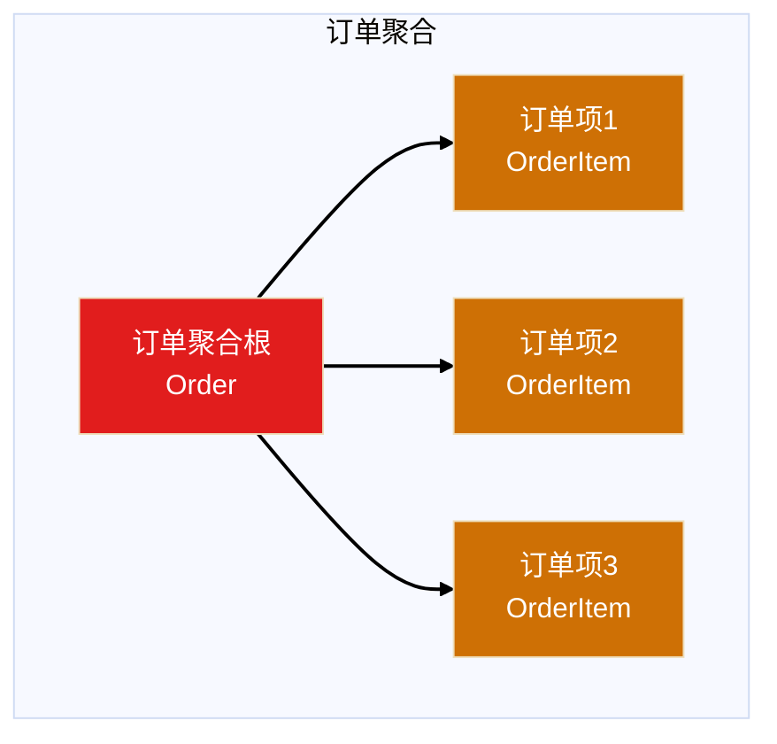

### 资源库（Repository）

**定义**：资源库是一种模式，用于封装数据访问逻辑，提供对数据的持久化和查询。它旨在将数据访问细节与领域模型分离。

**特点**：
- 封装数据访问逻辑
- 提供类似集合的接口
- 使领域模型独立于持久化技术

**代码示例**（Node.js，来自 node-web 目录）：

```javascript
// 【DDD】依赖倒置：领域（或应用）只依赖仓储抽象；SQL/驱动只在基础设施实现中出现。
// 【非DDD】领域层直接 import 数据库客户端，或在实体里写 JDBC/SQL。
// 领域层：定义仓储接口
class OrderRepository {
    save(order) {
        throw new Error("Method not implemented");
    }
    
    findById(orderId) {
        throw new Error("Method not implemented");
    }
    
    findByCustomerId(customerId) {
        throw new Error("Method not implemented");
    }
}

// 基础设施层：实现仓储
class OrderRepositoryImpl extends OrderRepository {
    constructor(database) {
        super();
        this.database = database;
    }
    
    save(order) {
        return this.database.insert('orders', order);
    }
    
    findById(orderId) {
        return this.database.query('SELECT * FROM orders WHERE id = ?', [orderId]);
    }
    
    findByCustomerId(customerId) {
        return this.database.query('SELECT * FROM orders WHERE customer_id = ?', [customerId]);
    }
}
```

### 领域服务（Domain Service）

**定义**：有些领域中的动作看上去并不属于任何对象。它们代表了领域中的一个重要的行为，不能忽略它们或者简单地把它们合并到某个实体或者值对象中。当这样的行为从领域中被识别出来时，推荐的实践方式是将它声明成一个服务。

**使用场景**：
- 涉及多个实体的操作
- 需要访问外部系统的操作
- 不适合放在实体或值对象中的业务逻辑

**代码示例**（Go 语言）：

```go
// 【DDD】领域服务：协调多个聚合/实体（订单归属校验 + 用户存在性），不适合塞进单一实体方法时使用。
// 【非DDD】把“只属于订单的规则”也放在这里，或领域服务里直接写 SQL/调 HTTP（应下沉 Infra 或通过端口）。
// 订单转移服务（涉及订单和用户两个实体）
type OrderTransferService struct {
    orderRepo    OrderRepository
    userRepo     UserRepository
}

func (s *OrderTransferService) TransferOrder(orderId string, fromUserId string, toUserId string) error {
    // 1. 验证订单
    order, err := s.orderRepo.FindById(orderId)
    if err != nil {
        return err
    }
    
    if order.CustomerID != fromUserId {
        return errors.New("订单不属于该用户")
    }
    
    // 2. 验证目标用户
    _, err = s.userRepo.FindById(toUserId)
    if err != nil {
        return errors.New("目标用户不存在")
    }
    
    // 3. 执行转移
    order.CustomerID = toUserId
    return s.orderRepo.Save(order)
}
```

### 领域事件（Domain Event）

**定义**：领域事件是发生在领域中且值得注意的事件。领域事件通常意味着领域对象状态的改变。领域事件在系统中起到了传递消息、触发其他动作的作用，是解耦领域模型的重要手段。

**特点**：
- 表示领域中的重要业务事件
- 通常意味着状态改变
- 用于解耦聚合
- 通过消息队列传递

**代码示例**（Java 语言，来自 java-web 目录）：

```java
// 【DDD】领域事件：表达领域内已发生的事实；先记入聚合内再统一发布，便于解耦与最终一致。
// 【非DDD】用“DTO 广播”代替领域事件、或在应用层手写一堆同步远程调用伪装成业务完成。
// 领域事件基类
public abstract class DomainEvent {
    private String eventId;
    private LocalDateTime occurredAt;
    
    protected DomainEvent() {
        this.eventId = UUID.randomUUID().toString();
        this.occurredAt = LocalDateTime.now();
    }
    
    public String getEventId() {
        return eventId;
    }
    
    public LocalDateTime getOccurredAt() {
        return occurredAt;
    }
    
    public abstract String getEventType();
}

// 订单创建事件
public class OrderCreatedEvent extends DomainEvent {
    private String orderId;
    private String customerId;
    private BigDecimal amount;
    
    public OrderCreatedEvent(String orderId, String customerId, BigDecimal amount) {
        super();
        this.orderId = orderId;
        this.customerId = customerId;
        this.amount = amount;
    }
    
    @Override
    public String getEventType() {
        return "OrderCreated";
    }
}

// 在订单实体中发布事件
public class Order {
    private List<DomainEvent> domainEvents = new ArrayList<>();
    
    public void create(String customerId, BigDecimal amount) {
        this.customerId = customerId;
        this.amount = amount;
        this.status = "PENDING";
        
        // 记录领域事件
        this.domainEvents.add(new OrderCreatedEvent(this.id, customerId, amount));
    }
    
    public List<DomainEvent> getDomainEvents() {
        return Collections.unmodifiableList(domainEvents);
    }
    
    public void clearDomainEvents() {
        this.domainEvents.clear();
    }
}
```

**领域事件流转**：

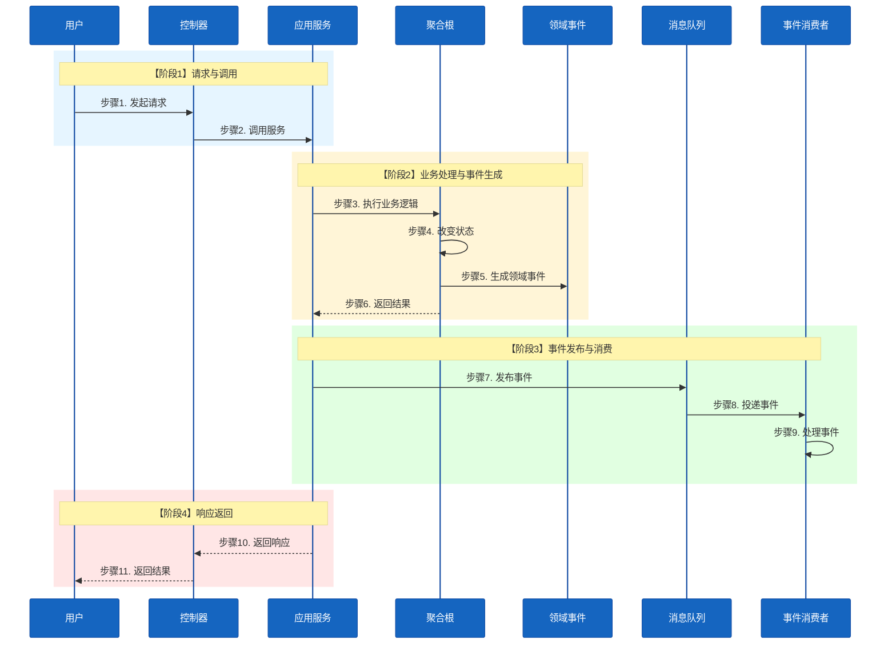

## 领域建模方法

领域建模是 DDD 的核心，好的领域建模意味着对业务有深刻的理解。下面介绍两种常见的领域建模方法。

### 事件风暴建模（Event Storming）

事件风暴是意大利人 Alberto Brandolini 在 2012 年创造的一种事件建模方法。它是一种互动式建模工作坊，通过将不同背景的项目参与方汇聚一堂，集思广益，从而形成有效的模型。

#### 事件风暴语法

事件风暴通过彩色贴纸的"语法"来组织逻辑：

- **橙色**：事件（Event）- 已发生且重要的事情
- **蓝色**：命令（Command）- 由行动者发起的行为
- **浅黄色**：行动者（Actor）- 系统的使用者
- **粉色**：业务规则（Policy）- 对于事件的响应
- **紫色**：系统（System）- 不需要了解细节的三方系统
- **绿色**：阅读模型（Read Model）- 用以支撑决策的信息
- **红色**：热点问题（HotSpot）- 业务痛点、瓶颈、模糊点

#### 事件风暴流程

**第一步：梳理事件（橙色贴纸）**

事件是已发生且重要的事情。事件必须是既成事实，且业务关注的事情。

**示例**：订单系统的事件
- 订单已创建
- 订单已支付
- 订单已发货
- 订单已取消

**第二步：业务规则（粉色贴纸）**

业务规则或者业务逻辑，是业务中最重要的部分。

**示例**："订单已创建"事件的业务逻辑
- 订单已创建的前提条件是商品可购买，同时用户未购买过该商品
- 订单创建后，会导致发起支付

**第三步：行动者、命令、阅读模型和系统**

通过问题引导找到 Actor、Command、Read Model。

**第四步：热点问题（红色贴纸）**

业务痛点、瓶颈、模糊点用红色贴纸记录。

**第五步：故事串讲**

邀请一名现场成员，按事件发生的时间顺序串讲业务。

**第六步：产出架构**

通过事件风暴，业务流程和处理逻辑应该已经很清楚了，接下来就由架构师产出对应的架构。

#### 事件风暴示例

```mermaid
%%{init: {'theme': 'base', 'themeVariables': { 'sectionBkgColor': '#f1f1f1', 'altSectionBkgColor': '#f1f1f1', 'gridColor': '#e9ecef'}}}%%
flowchart TB
    A[用户]
    
    subgraph 命令["命令"]
        C1[创建订单]
        C2[支付订单]
        C3[取消订单]
    end
    
    subgraph 事件["事件"]
        E1[订单已创建]
        E2[订单已支付]
        E3[订单已取消]
    end
    
    subgraph 业务规则["业务规则"]
        P1[检查库存]
        P2[扣减库存]
        P3[退款处理]
    end
    
    subgraph 系统["系统"]
        S1[库存系统]
        S2[支付系统]
    end
    
    A --> C1
    C1 --> P1
    P1 --> E1
    E1 --> C2
    C2 --> S2
    S2 --> E2
    E2 --> P2
    C3 --> E3
    E3 --> P3
    
    style A fill:#E11D1D,color:#ffffff
    style C1 fill:#CE7005,color:#FFFFFF
    style C2 fill:#CE7005,color:#FFFFFF
    style C3 fill:#CE7005,color:#FFFFFF
    style E1 fill:#097A93,color:#ffffff
    style E2 fill:#097A93,color:#ffffff
    style E3 fill:#097A93,color:#ffffff
    style P1 fill:#018663,color:#ffffff
    style P2 fill:#018663,color:#ffffff
    style P3 fill:#018663,color:#ffffff
    style S1 fill:#E11D1D,color:#ffffff
    style S2 fill:#E11D1D,color:#ffffff
```

### 四色建模法

四色建模法是一种从收敛逻辑出发的强分析方法，通过寻找现金往来和凭证、角色和参与者，逐步获得领域模型。

#### 四色建模法语法

四色建模法使用四种颜色来表示不同类型的对象：

- **绿色**：时刻时间段（Moment-Interval）- 表示业务发生的时间点或时间段
- **黄色**：角色（Role）- 表示在业务中扮演的角色
- **蓝色**：描述（Description）- 表示对象的描述信息
- **红色**：参与方（Party）- 表示业务中的参与实体

#### 四色建模法操作流程

```mermaid
%%{init: {'theme': 'base', 'themeVariables': { 'sectionBkgColor': '#f1f1f1', 'altSectionBkgColor': '#f1f1f1', 'gridColor': '#e9ecef'}}}%%
flowchart LR
    S1[第一步<br/>寻找现金往来和凭证<br/>绿色时刻时间段]
    S2[第二步<br/>寻找角色和参与者<br/>黄色角色+红色参与方]
    S3[第三步<br/>获得领域模型<br/>蓝色描述]
    S4[第四步<br/>验证业务脊梁<br/>领域模型有效性]
    
    S1 --> S2
    S2 --> S3
    S3 --> S4
    
    style S1 fill:#4CAF50,color:#ffffff
    style S2 fill:#FFC107,color:#000000
    style S3 fill:#2196F3,color:#ffffff
    style S4 fill:#F44336,color:#ffffff
    
    linkStyle 0 stroke:#000000,stroke-width:2px,color:#ffffff
    linkStyle 1 stroke:#000000,stroke-width:2px,color:#ffffff
    linkStyle 2 stroke:#000000,stroke-width:2px,color:#ffffff
```

**第一步：寻找现金往来和凭证**

找到业务中的资金往来和凭证，这些通常是绿色的时刻时间段对象。

**第二步：寻找角色和参与者**

找到业务中的角色和参与者，这些通常是黄色的角色和红色的参与方对象。

**第三步：获得领域模型**

通过前面的步骤，逐步构建出领域模型。

**第四步：验证业务脊梁以及领域模型的有效性**

验证模型是否能够支撑业务流程。

## DDD 详细设计图

在DDD落地实践中，需要使用多种设计图来表达系统的不同方面。下面以电商订单系统为例，展示各类设计图。

### 用例图

用例图清晰地表示出系统的功能，帮助理解系统应该提供哪些服务。

```mermaid
%%{init: {'theme': 'base', 'themeVariables': { 'sectionBkgColor': '#f1f1f1', 'altSectionBkgColor': '#f1f1f1', 'gridColor': '#e9ecef'}}}%%
flowchart TD
    subgraph 用户["用户"]
        U1[普通用户]
        U2[管理员]
    end
    
    subgraph 订单系统["订单系统"]
        UC1[创建订单]
        UC2[查询订单]
        UC3[取消订单]
        UC4[支付订单]
        UC5[发货]
        UC6[订单统计]
    end
    
    U1 --> UC1
    U1 --> UC2
    U1 --> UC3
    U1 --> UC4
    
    U2 --> UC5
    U2 --> UC6
    
    style U1 fill:#E11D1D,color:#ffffff
    style U2 fill:#E11D1D,color:#ffffff
    style UC1 fill:#097A93,color:#ffffff
    style UC2 fill:#097A93,color:#ffffff
    style UC3 fill:#097A93,color:#ffffff
    style UC4 fill:#097A93,color:#ffffff
    style UC5 fill:#CE7005,color:#FFFFFF
    style UC6 fill:#CE7005,color:#FFFFFF
    
    linkStyle 0 stroke:#000000,stroke-width:2px,color:#ffffff
    linkStyle 1 stroke:#000000,stroke-width:2px,color:#ffffff
    linkStyle 2 stroke:#000000,stroke-width:2px,color:#ffffff
    linkStyle 3 stroke:#000000,stroke-width:2px,color:#ffffff
    linkStyle 4 stroke:#000000,stroke-width:2px,color:#ffffff
    linkStyle 5 stroke:#000000,stroke-width:2px,color:#ffffff
```

### 状态机图

状态机图刻画实体的生命周期，清晰展示状态转换规则。

```mermaid
%%{init: {'theme': 'base', 'themeVariables': { 'sectionBkgColor': '#f1f1f1', 'altSectionBkgColor': '#f1f1f1', 'gridColor': '#e9ecef'}}}%%
stateDiagram-v2
    [*] --> 待支付: 创建订单
    待支付 --> 已支付: 支付成功
    待支付 --> 已取消: 超时取消
    待支付 --> 已取消: 用户取消
    已支付 --> 已发货: 商家发货
    已支付 --> 已取消: 申请退款
    已发货 --> 已完成: 用户确认收货
    已发货 --> 已取消: 申请退货
    已完成 --> [*]
    已取消 --> [*]
    
    note right of 待支付
        30分钟内未支付
        自动取消
    end note
    
    note right of 已支付
        发货后不可取消
    end note
```

### 活动图/流程图

活动图展示具体的业务流程，描述业务处理逻辑。

```mermaid
%%{init: {'theme': 'base', 'themeVariables': { 'sectionBkgColor': '#f1f1f1', 'altSectionBkgColor': '#f1f1f1', 'gridColor': '#e9ecef'}}}%%
flowchart TD
    A1[选择商品]
    A2[提交订单]
    B1[创建订单]
    B2[检查库存]
    B3[计算金额]
    B4[锁定库存]
    B5[生成支付单]
    A3[选择支付方式]
    A4[完成支付]
    C1[处理支付]
    C2[返回支付结果]
    B6[更新订单状态]
    D1[扣减库存]
    D2[释放库存]
    E[提示库存不足]
    
    A1 --> A2
    A2 --> B1
    B1 --> B2
    B2 -->|库存充足| B3
    B2 -->|库存不足| E
    B3 --> B4
    B4 --> B5
    B5 --> A3
    A3 --> A4
    A4 --> C1
    C1 --> C2
    C2 -->|支付成功| B6
    C2 -->|支付失败| D2
    B6 --> D1
    
    style A1 fill:#E11D1D,color:#ffffff
    style A2 fill:#E11D1D,color:#ffffff
    style A3 fill:#E11D1D,color:#ffffff
    style A4 fill:#E11D1D,color:#ffffff
    style B1 fill:#097A93,color:#ffffff
    style B2 fill:#097A93,color:#ffffff
    style B3 fill:#097A93,color:#ffffff
    style B4 fill:#097A93,color:#ffffff
    style B5 fill:#097A93,color:#ffffff
    style B6 fill:#097A93,color:#ffffff
    style C1 fill:#CE7005,color:#FFFFFF
    style C2 fill:#CE7005,color:#FFFFFF
    style D1 fill:#018663,color:#ffffff
    style D2 fill:#018663,color:#ffffff
    style E fill:#FFE6E6,color:#000000
```

### 时序图

时序图描述完成某个业务流程时，系统中各个对象之间的交互过程和消息传递序列。

```mermaid
%%{init: {'theme': 'base', 'themeVariables': {
    'actorBkg': '#1565C0',
    'actorBorder': '#0D47A1',
    'actorTextColor': '#FFFFFF',
    'noteBkg': '#E3F2FD',
    'noteBorder': '#90CAF9',
    'actorFontSize': '18px',
    'noteFontSize': '18px',
    'messageFontSize': '18px'
}}}%%
sequenceDiagram
    participant User as 用户
    participant Controller as 订单控制器
    participant AppService as 订单应用服务
    participant Order as 订单聚合
    participant Inventory as 库存服务
    participant Payment as 支付服务
    participant Repo as 订单仓储

    rect rgb(230, 245, 255)
        Note over User,Controller: 1. 创建订单
        User->>Controller: POST /orders
        Controller->>AppService: createOrder(request)
    end

    rect rgb(255, 245, 215)
        Note over AppService,Inventory: 2. 检查库存
        AppService->>Inventory: checkStock(items)
        Inventory-->>AppService: stockAvailable
    end

    rect rgb(225, 255, 225)
        Note over AppService,Order: 3. 创建订单
        AppService->>Order: new Order(customer, items)
        Order->>Order: calculateTotal()
        Order-->>AppService: order
    end

    rect rgb(255, 230, 230)
        Note over AppService,Repo: 4. 保存订单
        AppService->>Repo: save(order)
        Repo-->>AppService: saved
    end

    rect rgb(230, 245, 255)
        Note over AppService,Payment: 5. 处理支付
        AppService->>Payment: processPayment(order)
        Payment-->>AppService: paymentResult
    end

    rect rgb(255, 245, 215)
        Note over AppService,Controller: 6. 返回结果
        AppService-->>Controller: orderResponse
        Controller-->>User: 201 Created
    end
```

### ER图

ER图描述数据库建模，用于直接指导数据库建表。在DDD中，ER图是仓储实施细节，只在领域建模完成后才进行ER设计。

```mermaid
%%{init: {'theme': 'base', 'themeVariables': { 
    'sectionBkgColor': '#89BCF5', 
    'altSectionBkgColor': '#6579ED', 
    'gridColor': '#7CC5F0',
    'entityBkg': '#89BCF5',
    'entityBorder': '#6579ED'
}}}%%
erDiagram
    ORDERS ||--o{ ORDER_ITEMS : contains
    ORDERS ||--|| PAYMENTS : has
    CUSTOMERS ||--o{ ORDERS : places
    
    ORDERS {
        string id PK
        string customer_id FK
        decimal total_amount
        string status
        datetime created_at
        datetime updated_at
    }
    
    ORDER_ITEMS {
        string id PK
        string order_id FK
        string product_id
        int quantity
        decimal unit_price
        decimal subtotal
    }
    
    PAYMENTS {
        string id PK
        string order_id FK
        string payment_method
        decimal amount
        string status
        datetime paid_at
    }
    
    CUSTOMERS {
        string id PK
        string name
        string email
        string phone
        datetime created_at
    }
```

## DDD 编码规范

为了保证团队协作的一致性和代码质量，需要制定统一的编码规范。以下是基于实际项目经验的DDD编码规范。

### POJO 规范

POJO（Plain Ordinary Java Object）是简单的Java对象，区别于Spring Bean。不同类型的对象后缀约定如下：

#### DO（Data Object）- 数据库模型
**用途**：XXDO代表数据库模型，字段与数据库表字段平铺对应。
**位置**：仓储层（repository）
**示例**：
```java
// 【DDD】持久化模型（DO）与表对照，放基础设施侧；领域模型另有其语义类型（Money、OrderStatus）。
// 【非DDD】全项目只用一套 OrderDO/Entity 贯通 Controller→DB，业务规则散落在各层。
public class OrderDO {
    private String id;
    private String customerId;
    private BigDecimal amount;
    private String status;
    private LocalDateTime createdAt;
    private LocalDateTime updatedAt;
    // getter/setter
}
```

#### Model - 领域模型
**用途**：XXModel代表领域模型，是逻辑核心。
**位置**：领域层（domain）
**示例**：
```java
// 【DDD】领域模型用语义类型表达不变量；状态迁移走实体方法（pay），而不是随处 setStatus。
// 【非DDD】领域对象实为数据库模型的别名，业务规则全在 Application Service。
public class Order {
    private OrderId id;
    private CustomerId customerId;
    private Money amount;
    private OrderStatus status;
    private LocalDateTime createdAt;
    
    // 业务方法
    public void pay() {
        if (this.status != OrderStatus.PENDING) {
            throw new OrderStateException("只有待支付订单可以支付");
        }
        this.status = OrderStatus.PAID;
    }
}
```

#### DTO（Data Transfer Object）- 外部传输对象
**用途**：XXDTO是对外的数据传输对象，在facade层定义。
**位置**：接口门面层（facade）
**示例**：
```java
// 【DDD】DTO 仅承载传输字段，与接口契约绑定；领域语义留在 Order/Money 等领域类型。
// 【非DDD】DTO 一路传到仓储层并直接持久化，领域层被绕过。
public class OrderDTO {
    private String orderId;
    private String customerId;
    private BigDecimal amount;
    private String status;
    // getter/setter
}
```

#### Info - 内部传输对象
**用途**：XXInfo是application层和domain层之间的数据传输对象。
**位置**：应用层（application）
**示例**：
```java
// 【DDD】应用层与领域之间仍可有专用形状（Info），避免把 HTTP DTO 直接塞进领域。
// 【非DDD】领域方法签名直接用 OrderDTO/JSON Map，领域层依赖接口层类型。
public class OrderInfo {
    private OrderId orderId;
    private CustomerId customerId;
    private Money amount;
    // getter/setter
}
```

#### VO（Value Object）- 值对象
**用途**：XXVO代表值对象，接收其他系统facade传递过来的DTO。
**注意**：VO不是View Object（视图对象），而是Value Object（值对象）。
**位置**：领域层（domain）
**示例**：
```java
// 【DDD】命名此处 VO=Value Object：强调不可变与相同语义；勿与 MVC 的 View Object 混淆。
// 【非DDD】把 UI 表单 Bean 当领域值对象，或与 Address DTO 混名导致边界混乱。
public class Address {
    private final String province;
    private final String city;
    private final String street;
    private final String zipCode;
    
    // 值对象不可变，不提供setter
    public Address withCity(String newCity) {
        return new Address(this.province, newCity, this.street, this.zipCode);
    }
}
```

#### Query - 查询对象
**用途**：XXQuery是仓储接口接收的查询参数封装对象。
**位置**：领域层（domain）
**示例**：
```java
// 【DDD】查询条件对象进入仓储抽象，避免 Repository 方法罗列一长串基本类型参数。
// 【非DDD】仓储接口暴露 SQL 片段或 Map，查询语义泄漏到应用层。
public class OrderQuery {
    private CustomerId customerId;
    private OrderStatus status;
    private LocalDateTime startDate;
    private LocalDateTime endDate;
    // getter/setter
}
```

#### Request - 请求对象
**用途**：XXRequest是facade层中定义的查询对象。
**位置**：接口门面层（facade）
**示例**：
```java
// 【DDD】HTTP/API 入参停在门面层，再转换为应用命令或领域所需参数。
// 【非DDD】Controller 把 Request 直接传给 Repository 或 Mapper。
public class CreateOrderRequest {
    private String customerId;
    private List<OrderItemRequest> items;
    private AddressRequest shippingAddress;
    // getter/setter
}
```

#### Converter - 转换器
**用途**：各种类型对象之间的转换，XXAA2BBConverter表示XX实体的AA对象转成BB对象。
**位置**：对应的分层中
**示例**：
```java
// 【DDD】显式映射 DO/DTO 与领域模型，边界清晰；字段变更时编译期可感知（配合手写或生成策略）。
// 【非DDD】到处 BeanUtils.copyProperties，隐蔽字段错位，领域被静默污染。
// Model2DOConverter - 仓储层
public class OrderModel2DOConverter {
    public static OrderDO toDO(Order model) {
        OrderDO dto = new OrderDO();
        dto.setId(model.getId().getValue());
        dto.setCustomerId(model.getCustomerId().getValue());
        dto.setAmount(model.getAmount().getValue());
        dto.setStatus(model.getStatus().name());
        return dto;
    }
}

// Model2DTOConverter - facade-impl层
public class OrderModel2DTOConverter {
    public static OrderDTO toDTO(Order model) {
        OrderDTO dto = new OrderDTO();
        dto.setOrderId(model.getId().getValue());
        dto.setCustomerId(model.getCustomerId().getValue());
        dto.setAmount(model.getAmount().getValue());
        dto.setStatus(model.getStatus().name());
        return dto;
    }
}
```

**注意**：建议逐个字段手写转换，不建议使用BeanUtils.copyProperties或MapStruct，因为字段变化时无法在编译阶段感知。

### Bean 命名规范

#### Controller - 控制器
**用途**：对外提供http服务的控制器。
**位置**：控制器层（controller）
**示例**：
```java
// 【DDD】接口层只负责协议与入参出参，编排交给应用服务，不直接操作仓储/Mapper。
// 【非DDD】Controller 里写业务判断、查库、调支付接口。
@RestController
@RequestMapping("/api/orders")
public class OrderController {
    private final OrderService orderService;
    
    @PostMapping
    public ResponseEntity<OrderDTO> createOrder(@RequestBody CreateOrderRequest request) {
        OrderDTO order = orderService.createOrder(request);
        return ResponseEntity.ok(order);
    }
}
```

#### Facade - 门面服务
**用途**：通过门面方式对外提供的服务接口，以Facade结尾。
**位置**：接口门面层（facade）
**示例**：
```java
// 【DDD】Facade 用应用服务能理解的入参/出参稳定对外契约，隔离 UI 与内部用例。
// 【非DDD】把 Facade 当作万能 Service，堆满业务与 SQL。
public interface OrderWriteFacade {
    OrderDTO createOrder(CreateOrderRequest request);
    void cancelOrder(String orderId);
}

public interface OrderReadFacade {
    OrderDTO getOrder(String orderId);
    List<OrderDTO> listOrders(OrderQuery query);
}
```

#### FacadeImpl - 门面服务实现
**用途**：Facade门面服务对应的实现。
**位置**：接口门面实现层（facade-impl）
**示例**：
```java
// 【DDD】门面实现薄：编排调用应用层，避免重复业务逻辑。
// 【非DDD】FacadeImpl 内复制粘贴大量领域规则。
@Service
public class OrderWriteFacadeImpl implements OrderWriteFacade {
    private final OrderApplicationService orderApplicationService;
    
    @Override
    public OrderDTO createOrder(CreateOrderRequest request) {
        return orderApplicationService.createOrder(request);
    }
}
```

#### AppService - 应用层服务
**用途**：应用层的服务，以AppService结尾。
**位置**：应用层（application）
**示例**：
```java
// 【DDD】应用服务编排用例（事务边界、跨聚合协调），核心规则仍在实体/领域服务。
// 【非DDD】ApplicationService 变成“上帝类”，所有 if-else 业务都写在这里。
@Service
public class OrderApplicationService {
    private final OrderRepository orderRepository;
    private final PaymentServiceClient paymentServiceClient;
    
    public OrderDTO createOrder(CreateOrderRequest request) {
        // 应用层逻辑
    }
}
```

#### DomainService - 领域服务
**用途**：领域服务，以DomainService结尾。
**位置**：领域层（domain）
**示例**：
```java
// 【DDD】领域服务处理跨实体/跨聚合或不适合放在单一实体上的领域行为。
// 【非DDD】把本该属于 Order.pay() 的规则拆到领域服务，形成贫血模型。
@DomainService
public class OrderDomainService {
    private final OrderRepository orderRepository;
    private final InventoryService inventoryService;
    
    public void validateOrder(Order order) {
        // 领域服务逻辑
    }
}
```

#### Repository - 仓储接口
**用途**：仓储接口定义在领域层。
**位置**：领域层（domain）
**示例**：
```java
// 【DDD】仓储接口由领域定义，表达“像集合一样持久化聚合”；由基础设施实现。
// 【非DDD】领域层依赖 MyBatis Mapper 接口或具体 JDBC。
public interface OrderRepository {
    Order save(Order order);
    Order findById(OrderId id);
    List<Order> findByCustomerId(CustomerId customerId);
}
```

#### RepositoryImpl - 仓储接口实现
**用途**：仓储接口实现在仓储层，体现倒置依赖。
**位置**：仓储层（repository）
**示例**：
```java
// 【DDD】实现侧负责 DO↔领域模型转换与持久化技术选型。
// 【非DDD】仓储返回 OrderDO，让上层自己猜领域语义。
@Repository
public class OrderRepositoryImpl implements OrderRepository {
    private final JdbcTemplate jdbcTemplate;
    
    @Override
    public Order save(Order order) {
        // 实现保存逻辑
    }
}
```

#### Mapper - 数据库查询接口
**用途**：MyBatis的查询接口，只允许在仓储层调用。
**位置**：仓储层（repository）
**示例**：
```java
// 【DDD】Mapper 作为基础设施细节，仅被仓储实现使用，不穿越到应用层。
// 【非DDD】Controller/AppService 直接 Autowired Mapper。
@Mapper
public interface OrderMapper extends BaseMapper<OrderDO> {
    List<OrderDO> selectByCustomerId(String customerId);
}
```

#### Client - 中间件服务依赖接口
**用途**：通过定义Client接口来消费中间件服务，体现防腐层设计思想。
**位置**：领域层（domain）
**示例**：
```java
// 【DDD】防腐层端口：领域声明需要什么能力，不绑定 HTTP/SDK 细节。
// 【非DDD】领域类里直接 new RestTemplate 或引用第三方 DTO。
public interface PaymentServiceClient {
    PaymentResult processPayment(PaymentRequest request);
}
```

#### ClientImpl - 中间件服务依赖实现
**用途**：对领域层中声明的依赖的实现。
**位置**：基础设施层（infrastructure）
**示例**：
```java
// 【DDD】适配器实现：把外部系统的协议/DTO 转成领域内认可的类型。
// 【非DDD】把第三方响应 JSON 一路传到领域层。
@Service
public class PaymentServiceClientImpl implements PaymentServiceClient {
    private final RestTemplate restTemplate;
    
    @Override
    public PaymentResult processPayment(PaymentRequest request) {
        // 实现调用逻辑
    }
}
```

### 方法命名规范

#### Service/Repository/Client/DAO 方法命名规约

- **获取单个对象**：用 `query` 作前缀
  ```java
  // 【DDD】领域仓储侧重“查领域对象”；命名统一便于团队扫读。【非DDD】get/find/query 混用且无约定。
  Order queryById(OrderId id);
  Order queryByOrderNo(String orderNo);
  ```

- **获取多个对象列表**：用 `list` 作前缀，复数结尾
  ```java
  // 【DDD】list 表达集合结果，与 query/page 分工清晰。【非DDD】一律 getXxx 掩盖是否集合。
  List<Order> listOrders(OrderQuery query);
  List<Order> listPendingOrders();
  ```

- **获取多个对象分页**：用 `page` 作前缀，复数结尾
  ```java
  // 【DDD】分页显式命名，避免与全量 list 混淆。【非DDD】同一方法有时返回 List 有时返回 Page。
  PageResult<Order> pageOrders(OrderQuery query, PageRequest pageRequest);
  ```

- **获取统计值**：用 `count` 作前缀
  ```java
  // 【DDD】统计即领域可读意图，不与“取实体”混名。【非DDD】queryTotal 又返回 int 又返回 Order。
  int countOrders(OrderQuery query);
  long countByStatus(OrderStatus status);
  ```

- **插入**：用 `insert` 作前缀
  ```java
  // 【DDD】持久化侧动词与数据库一致，仓储实现内使用。【非DDD】领域层出现 insert 语句拼接。
  int insert(OrderDO order);
  ```

- **删除**：用 `delete` 作前缀
  ```java
  // 【DDD】删除语义集中，配合聚合删除策略（先领域决策再持久化）。【非DDD】物理删散落各处无不变量。
  int deleteById(OrderId id);
  int deleteByStatus(OrderStatus status);
  ```

- **修改**：用 `update` 作前缀
  ```java
  // 【DDD】更新 DO 与领域状态变更是两件事：先改聚合再映射落库。【非DDD】绕过实体直接 update status 字段。
  int update(OrderDO order);
  int updateStatus(OrderId id, OrderStatus status);
  ```

## DDD 分层架构实战

DDD 分层架构是 DDD 落地的重要方式，下面结合 domain-driven-design 目录中的实际代码示例，展示如何在不同的编程语言中实现 DDD 分层架构。

### DDD 分层架构图

```mermaid
%%{init: {'theme': 'base', 'themeVariables': { 'sectionBkgColor': '#f1f1f1', 'altSectionBkgColor': '#f1f1f1', 'gridColor': '#e9ecef'}}}%%
flowchart TB
    subgraph DDD架构["DDD 分层架构"]
        UI[用户界面层<br/>Interfaces Layer]
        App[应用服务层<br/>Application Layer]
        Domain[领域层<br/>Domain Layer]
        Infra[基础设施层<br/>Infrastructure Layer]
    end
    
    UI --> App
    App --> Domain
    Domain -.依赖接口.-> Infra
    Infra -.实现接口.-> Domain
    
    style UI fill:#E11D1D,color:#ffffff
    style App fill:#CE7005,color:#FFFFFF
    style Domain fill:#097A93,color:#ffffff
    style Infra fill:#018663,color:#ffffff
    
    linkStyle 0 stroke:#000000,stroke-width:2px,color:#000000
    linkStyle 1 stroke:#000000,stroke-width:2px,color:#000000
    linkStyle 2 stroke:#000000,stroke-width:2px,color:#000000
    linkStyle 3 stroke:#018663,stroke-width:2px,color:#000000
```

### 各层职责

- **用户界面层（Interfaces Layer）**：处理用户输入与展示信息，如 HTTP 控制器、路由等
- **应用服务层（Application Layer）**：负责应用层流程逻辑，协调领域层的操作
- **领域层（Domain Layer）**：实现核心业务逻辑，包括实体、值对象、聚合、领域服务等
- **基础设施层（Infrastructure Layer）**：提供数据库、外部 API、消息队列等技术支持

### Go 语言 DDD 实现示例

来自 `domain-driven-design/go-web` 目录：

```go
// 【DDD】分层示意：Handler→应用服务→领域（实体/仓储接口）→基础设施实现；依赖方向指向领域。
// 【非DDD】Handler 直接打开 DB、写 SQL，或领域层 import SQL 驱动。
// 用户界面层（Interfaces Layer）
// internal/interfaces/handlers/order_handler.go
type OrderHandler struct {
    orderService *OrderService
}

func (h *OrderHandler) CreateOrder(c *gin.Context) {
    var req CreateOrderRequest
    if err := c.ShouldBindJSON(&req); err != nil {
        c.JSON(400, gin.H{"error": err.Error()})
        return
    }
    
    order, err := h.orderService.CreateOrder(req.CustomerName, req.Amount)
    if err != nil {
        c.JSON(500, gin.H{"error": err.Error()})
        return
    }
    
    c.JSON(200, order)
}

// 应用服务层（Application Layer）
// internal/application/services/order_service.go
type OrderService struct {
    orderRepo domain.OrderRepository
}

func (s *OrderService) CreateOrder(customerName string, amount float64) (*domain.Order, error) {
    order := &domain.Order{
        ID:           generateID(),
        CustomerName: customerName,
        Amount:       amount,
        Status:       "PENDING",
        CreatedAt:    time.Now(),
    }
    
    if err := s.orderRepo.Save(order); err != nil {
        return nil, err
    }
    
    return order, nil
}

// 领域层（Domain Layer）
// internal/domain/order/order.go
type Order struct {
    ID           string
    CustomerName string
    Amount       float64
    Status       string
    CreatedAt    time.Time
    UpdatedAt    time.Time
}

func (o *Order) Pay() error {
    if o.Status != "PENDING" {
        return errors.New("只有待支付订单可以支付")
    }
    o.Status = "PAID"
    o.UpdatedAt = time.Now()
    return nil
}

// 领域层：仓储接口
// internal/domain/repository/order_repository.go
type OrderRepository interface {
    Save(order *Order) error
    FindByID(id string) (*Order, error)
    FindAll() ([]*Order, error)
}

// 基础设施层（Infrastructure Layer）
// internal/infrastructure/repository/order_repository_impl.go
type OrderRepositoryImpl struct {
    db *sql.DB
}

func (r *OrderRepositoryImpl) Save(order *Order) error {
    _, err := r.db.Exec(
        "INSERT INTO orders (id, customer_name, amount, status, created_at) VALUES (?, ?, ?, ?, ?)",
        order.ID, order.CustomerName, order.Amount, order.Status, order.CreatedAt,
    )
    return err
}

func (r *OrderRepositoryImpl) FindByID(id string) (*Order, error) {
    var order Order
    err := r.db.QueryRow(
        "SELECT id, customer_name, amount, status, created_at FROM orders WHERE id = ?",
        id,
    ).Scan(&order.ID, &order.CustomerName, &order.Amount, &order.Status, &order.CreatedAt)
    
    if err != nil {
        return nil, err
    }
    return &order, nil
}
```

### Java 语言 DDD 完整实现示例

来自 `domain-driven-design/java-web` 目录，展示完整的DDD分层架构实现。

#### 完整文件结构

```
java-web/
├── src/main/java/com/microwind/
│   ├── application/                    # 应用层
│   │   ├── services/
│   │   │   └── OrderApplicationService.java
│   │   └── dto/
│   │       ├── CreateOrderRequest.java
│   │       └── OrderDTO.java
│   ├── domain/                         # 领域层
│   │   ├── model/
│   │   │   ├── Order.java              # 订单实体（聚合根）
│   │   │   ├── OrderItem.java          # 订单项实体
│   │   │   ├── OrderStatus.java        # 订单状态枚举
│   │   │   └── Money.java              # 金额值对象
│   │   ├── event/
│   │   │   ├── DomainEvent.java        # 领域事件基类
│   │   │   ├── OrderCreatedEvent.java  # 订单创建事件
│   │   │   └── OrderPaidEvent.java     # 订单支付事件
│   │   ├── repository/
│   │   │   └── OrderRepository.java   # 仓储接口
│   │   └── service/
│   │       └── OrderDomainService.java # 领域服务
│   ├── infrastructure/                 # 基础设施层
│   │   ├── repository/
│   │   │   └── OrderRepositoryImpl.java # 仓储实现
│   │   ├── messaging/
│   │   │   └── OrderEventPublisher.java # 事件发布器
│   │   └── persistence/
│   │       └── OrderMapper.java        # MyBatis Mapper
│   └── interfaces/                     # 接口层
│       └── controller/
│           └── OrderController.java
```

#### 领域层实现

**订单实体（聚合根）**：
```java
// 【DDD】聚合根封装不变量与状态迁移（pay/cancel/addItem），并发事件表达领域内事实。
// 【非DDD】贫血实体 + Service 改字段；或聚合根直接依赖 Mapper/SQL。
// domain/model/Order.java
package com.microwind.domain.model;

import com.microwind.domain.event.*;
import java.math.BigDecimal;
import java.time.LocalDateTime;
import java.util.ArrayList;
import java.util.List;

public class Order {
    private String id;
    private String customerId;
    private Money totalAmount;
    private OrderStatus status;
    private List<OrderItem> items;
    private LocalDateTime createdAt;
    private LocalDateTime updatedAt;
    private List<DomainEvent> domainEvents = new ArrayList<>();
    
    // 构造函数
    public Order(String id, String customerId, List<OrderItem> items) {
        this.id = id;
        this.customerId = customerId;
        this.items = items;
        this.status = OrderStatus.PENDING;
        this.createdAt = LocalDateTime.now();
        this.updatedAt = LocalDateTime.now();
        this.totalAmount = calculateTotal();
        
        // 发布订单创建事件
        this.domainEvents.add(new OrderCreatedEvent(id, customerId, totalAmount));
    }
    
    // 业务方法：支付订单
    public void pay(String paymentMethod) {
        if (this.status != OrderStatus.PENDING) {
            throw new OrderStateException("只有待支付订单可以支付");
        }
        this.status = OrderStatus.PAID;
        this.updatedAt = LocalDateTime.now();
        
        // 发布订单支付事件
        this.domainEvents.add(new OrderPaidEvent(id, customerId, totalAmount, paymentMethod));
    }
    
    // 业务方法：取消订单
    public void cancel(String reason) {
        if (this.status == OrderStatus.COMPLETED) {
            throw new OrderStateException("已完成订单不能取消");
        }
        this.status = OrderStatus.CANCELLED;
        this.updatedAt = LocalDateTime.now();
        
        // 发布订单取消事件
        this.domainEvents.add(new OrderCancelledEvent(id, customerId, reason));
    }
    
    // 业务方法：添加订单项
    public void addItem(OrderItem item) {
        if (this.status != OrderStatus.PENDING) {
            throw new OrderStateException("只有待支付订单可以添加商品");
        }
        this.items.add(item);
        this.totalAmount = calculateTotal();
        this.updatedAt = LocalDateTime.now();
    }
    
    // 私有方法：计算总金额
    private Money calculateTotal() {
        BigDecimal total = items.stream()
            .map(item -> item.getUnitPrice().multiply(BigDecimal.valueOf(item.getQuantity())))
            .reduce(BigDecimal.ZERO, BigDecimal::add);
        return new Money(total);
    }
    
    // 获取领域事件
    public List<DomainEvent> getDomainEvents() {
        return new ArrayList<>(domainEvents);
    }
    
    // 清除领域事件
    public void clearDomainEvents() {
        this.domainEvents.clear();
    }
    
    // Getter方法
    public String getId() { return id; }
    public String getCustomerId() { return customerId; }
    public Money getTotalAmount() { return totalAmount; }
    public OrderStatus getStatus() { return status; }
    public List<OrderItem> getItems() { return items; }
    public LocalDateTime getCreatedAt() { return createdAt; }
    public LocalDateTime getUpdatedAt() { return updatedAt; }
}
```

**订单状态枚举**：
```java
// 【DDD】状态机语义进入类型系统，避免魔法字符串散落。
// 【非DDD】status 用 String 全程拼写，校验散落在各层。
// domain/model/OrderStatus.java
package com.microwind.domain.model;

public enum OrderStatus {
    PENDING,    // 待支付
    PAID,       // 已支付
    SHIPPED,    // 已发货
    COMPLETED,  // 已完成
    CANCELLED   // 已取消
}
```

**金额值对象**：
```java
// 【DDD】Money 封装金额与币种规则，运算返回新对象，避免 BigDecimal 散落。
// 【非DDD】BigDecimal 裸奔，加减乘除与舍入规则写在 Service。
// domain/model/Money.java
package com.microwind.domain.model;

import java.math.BigDecimal;
import java.util.Objects;

public class Money {
    private final BigDecimal amount;
    private final String currency;
    
    public Money(BigDecimal amount) {
        this(amount, "CNY");
    }
    
    public Money(BigDecimal amount, String currency) {
        this.amount = amount;
        this.currency = currency;
    }
    
    public Money add(Money other) {
        if (!this.currency.equals(other.currency)) {
            throw new IllegalArgumentException("货币类型不同");
        }
        return new Money(this.amount.add(other.amount), this.currency);
    }
    
    public Money multiply(BigDecimal multiplier) {
        return new Money(this.amount.multiply(multiplier), this.currency);
    }
    
    public BigDecimal getValue() {
        return amount;
    }
    
    public String getCurrency() {
        return currency;
    }
    
    @Override
    public boolean equals(Object o) {
        if (this == o) return true;
        if (o == null || getClass() != o.getClass()) return false;
        Money money = (Money) o;
        return Objects.equals(amount, money.amount) && 
               Objects.equals(currency, money.currency);
    }
    
    @Override
    public int hashCode() {
        return Objects.hash(amount, currency);
    }
}
```

**领域事件实现**：
```java
// 【DDD】事件承载已发生事实，附 id/时间；具体事件类型表达业务含义。
// 【非DDD】用 Map 或裸字符串广播“消息”，无类型与版本约束。
// domain/event/DomainEvent.java
package com.microwind.domain.event;

import java.time.LocalDateTime;
import java.util.UUID;

public abstract class DomainEvent {
    private final String eventId;
    private final LocalDateTime occurredAt;
    
    protected DomainEvent() {
        this.eventId = UUID.randomUUID().toString();
        this.occurredAt = LocalDateTime.now();
    }
    
    public String getEventId() {
        return eventId;
    }
    
    public LocalDateTime getOccurredAt() {
        return occurredAt;
    }
    
    public abstract String getEventType();
}

// domain/event/OrderCreatedEvent.java
package com.microwind.domain.event;

import com.microwind.domain.model.Money;

public class OrderCreatedEvent extends DomainEvent {
    private final String orderId;
    private final String customerId;
    private final Money amount;
    
    public OrderCreatedEvent(String orderId, String customerId, Money amount) {
        super();
        this.orderId = orderId;
        this.customerId = customerId;
        this.amount = amount;
    }
    
    @Override
    public String getEventType() {
        return "OrderCreated";
    }
    
    public String getOrderId() { return orderId; }
    public String getCustomerId() { return customerId; }
    public Money getAmount() { return amount; }
}

// domain/event/OrderPaidEvent.java
package com.microwind.domain.event;

import com.microwind.domain.model.Money;

public class OrderPaidEvent extends DomainEvent {
    private final String orderId;
    private final String customerId;
    private final Money amount;
    private final String paymentMethod;
    
    public OrderPaidEvent(String orderId, String customerId, Money amount, String paymentMethod) {
        super();
        this.orderId = orderId;
        this.customerId = customerId;
        this.amount = amount;
        this.paymentMethod = paymentMethod;
    }
    
    @Override
    public String getEventType() {
        return "OrderPaid";
    }
    
    public String getOrderId() { return orderId; }
    public String getCustomerId() { return customerId; }
    public Money getAmount() { return amount; }
    public String getPaymentMethod() { return paymentMethod; }
}

// domain/event/OrderCancelledEvent.java
package com.microwind.domain.event;

public class OrderCancelledEvent extends DomainEvent {
    private final String orderId;
    private final String customerId;
    private final String reason;
    
    public OrderCancelledEvent(String orderId, String customerId, String reason) {
        super();
        this.orderId = orderId;
        this.customerId = customerId;
        this.reason = reason;
    }
    
    @Override
    public String getEventType() {
        return "OrderCancelled";
    }
    
    public String getOrderId() { return orderId; }
    public String getCustomerId() { return customerId; }
    public String getReason() { return reason; }
}
```

**仓储接口**：
```java
// 【DDD】领域定义持久化聚合的端口；返回 Optional/List 表达查询语义。
// 【非DDD】仓储返回 OrderDO 或暴露分页 SQL 条件对象。
// domain/repository/OrderRepository.java
package com.microwind.domain.repository;

import com.microwind.domain.model.Order;
import java.util.List;
import java.util.Optional;

public interface OrderRepository {
    Order save(Order order);
    Optional<Order> findById(String id);
    List<Order> findByCustomerId(String customerId);
    List<Order> findByStatus(OrderStatus status);
    void delete(String id);
}
```

**领域服务**：
```java
// 【DDD】协调多聚合/查询仓储做跨实体规则（如待支付单数量）；单聚合内优先放实体。
// 【非DDD】领域服务里写 SQL、调 HTTP，或替代实体内的状态检查。
// domain/service/OrderDomainService.java
package com.microwind.domain.service;

import com.microwind.domain.model.Order;
import com.microwind.domain.model.OrderItem;
import com.microwind.domain.repository.OrderRepository;
import org.springframework.stereotype.Service;

@Service
public class OrderDomainService {
    private final OrderRepository orderRepository;
    
    public OrderDomainService(OrderRepository orderRepository) {
        this.orderRepository = orderRepository;
    }
    
    // 验证订单是否可以创建
    public void validateOrderCreation(String customerId, List<OrderItem> items) {
        if (items == null || items.isEmpty()) {
            throw new IllegalArgumentException("订单项不能为空");
        }
        
        // 检查用户是否有未完成的订单
        List<Order> pendingOrders = orderRepository.findByCustomerId(customerId);
        long count = pendingOrders.stream()
            .filter(order -> order.getStatus() == OrderStatus.PENDING)
            .count();
        
        if (count >= 3) {
            throw new IllegalStateException("待支付订单数量超过限制");
        }
    }
    
    // 计算订单折扣
    public Money calculateDiscount(Order order) {
        // 根据业务规则计算折扣
        // 这里只是一个示例
        return order.getTotalAmount().multiply(new java.math.BigDecimal("0.95"));
    }
}
```

#### 基础设施层实现

**仓储实现**：
```java
// 【DDD】基础设施：DO↔领域转换 + Mapper；领域仍不知表结构细节。
// 【非DDD】RepositoryImpl 返回 DO，调用方自己组装领域对象。
// infrastructure/repository/OrderRepositoryImpl.java
package com.microwind.infrastructure.repository;

import com.microwind.domain.model.Order;
import com.microwind.domain.model.OrderStatus;
import com.microwind.domain.repository.OrderRepository;
import com.microwind.infrastructure.persistence.OrderMapper;
import com.microwind.infrastructure.persistence.OrderDO;
import com.microwind.infrastructure.converter.OrderConverter;
import org.springframework.stereotype.Repository;
import java.util.List;
import java.util.Optional;
import java.util.stream.Collectors;

@Repository
public class OrderRepositoryImpl implements OrderRepository {
    private final OrderMapper orderMapper;
    private final OrderConverter orderConverter;
    
    public OrderRepositoryImpl(OrderMapper orderMapper, OrderConverter orderConverter) {
        this.orderMapper = orderMapper;
        this.orderConverter = orderConverter;
    }
    
    @Override
    public Order save(Order order) {
        OrderDO orderDO = orderConverter.toDO(order);
        if (orderDO.getId() == null) {
            orderMapper.insert(orderDO);
        } else {
            orderMapper.update(orderDO);
        }
        return orderConverter.toModel(orderDO);
    }
    
    @Override
    public Optional<Order> findById(String id) {
        OrderDO orderDO = orderMapper.selectById(id);
        return orderDO != null ? 
            Optional.of(orderConverter.toModel(orderDO)) : 
            Optional.empty();
    }
    
    @Override
    public List<Order> findByCustomerId(String customerId) {
        List<OrderDO> orderDOs = orderMapper.selectByCustomerId(customerId);
        return orderDOs.stream()
            .map(orderConverter::toModel)
            .collect(Collectors.toList());
    }
    
    @Override
    public List<Order> findByStatus(OrderStatus status) {
        List<OrderDO> orderDOs = orderMapper.selectByStatus(status.name());
        return orderDOs.stream()
            .map(orderConverter::toModel)
            .collect(Collectors.toList());
    }
    
    @Override
    public void delete(String id) {
        orderMapper.deleteById(id);
    }
}
```

**事件发布器**：
```java
// 【DDD】发布属基础设施：领域产生事件，此处对接 MQ/Kafka，领域不依赖 Kafka API。
// 【非DDD】实体里直接 kafkaTemplate.send。
// infrastructure/messaging/OrderEventPublisher.java
package com.microwind.infrastructure.messaging;

import com.microwind.domain.event.DomainEvent;
import org.springframework.beans.factory.annotation.Autowired;
import org.springframework.kafka.core.KafkaTemplate;
import org.springframework.stereotype.Component;

@Component
public class OrderEventPublisher {
    @Autowired
    private KafkaTemplate<String, DomainEvent> kafkaTemplate;
    
    public void publish(DomainEvent event) {
        String topic = "order-events";
        kafkaTemplate.send(topic, event.getEventType(), event);
    }
}
```

**MyBatis Mapper**：
```java
// 【DDD】Mapper 仅基础设施；SQL 与注解留在实现细节层。
// 【非DDD】领域服务直接调用 Mapper 查表。
// infrastructure/persistence/OrderMapper.java
package com.microwind.infrastructure.persistence;

import org.apache.ibatis.annotations.*;
import java.util.List;

@Mapper
public interface OrderMapper {
    @Insert("INSERT INTO orders (id, customer_id, total_amount, status, created_at, updated_at) " +
            "VALUES (#{id}, #{customerId}, #{totalAmount}, #{status}, #{createdAt}, #{updatedAt})")
    int insert(OrderDO orderDO);
    
    @Update("UPDATE orders SET customer_id=#{customerId}, total_amount=#{totalAmount}, " +
            "status=#{status}, updated_at=#{updatedAt} WHERE id=#{id}")
    int update(OrderDO orderDO);
    
    @Select("SELECT * FROM orders WHERE id = #{id}")
    OrderDO selectById(String id);
    
    @Select("SELECT * FROM orders WHERE customer_id = #{customerId}")
    List<OrderDO> selectByCustomerId(String customerId);
    
    @Select("SELECT * FROM orders WHERE status = #{status}")
    List<OrderDO> selectByStatus(String status);
    
    @Delete("DELETE FROM orders WHERE id = #{id}")
    int deleteById(String id);
}
```

**数据库模型（DO）**：
```java
// 【DDD】DO 对齐表字段，供仓储实现映射；领域模型不继承 DO。
// 【非DDD】一套 Entity 贯穿 UI→DB。
// infrastructure/persistence/OrderDO.java
package com.microwind.infrastructure.persistence;

import java.math.BigDecimal;
import java.time.LocalDateTime;

public class OrderDO {
    private String id;
    private String customerId;
    private BigDecimal totalAmount;
    private String status;
    private LocalDateTime createdAt;
    private LocalDateTime updatedAt;
    
    // Getter/Setter
    public String getId() { return id; }
    public void setId(String id) { this.id = id; }
    public String getCustomerId() { return customerId; }
    public void setCustomerId(String customerId) { this.customerId = customerId; }
    public BigDecimal getTotalAmount() { return totalAmount; }
    public void setTotalAmount(BigDecimal totalAmount) { this.totalAmount = totalAmount; }
    public String getStatus() { return status; }
    public void setStatus(String status) { this.status = status; }
    public LocalDateTime getCreatedAt() { return createdAt; }
    public void setCreatedAt(LocalDateTime createdAt) { this.createdAt = createdAt; }
    public LocalDateTime getUpdatedAt() { return updatedAt; }
    public void setUpdatedAt(LocalDateTime updatedAt) { this.updatedAt = updatedAt; }
}
```

**对象转换器**：
```java
// 【DDD】集中映射领域↔DO，避免仓储内复制粘贴转换逻辑。
// 【非DDD】应用层手动从 DO set 到领域对象数十行重复。
// infrastructure/converter/OrderConverter.java
package com.microwind.infrastructure.converter;

import com.microwind.domain.model.Order;
import com.microwind.domain.model.OrderItem;
import com.microwind.domain.model.OrderStatus;
import com.microwind.infrastructure.persistence.OrderDO;
import org.springframework.stereotype.Component;

@Component
public class OrderConverter {
    
    public OrderDO toDO(Order model) {
        OrderDO dto = new OrderDO();
        dto.setId(model.getId());
        dto.setCustomerId(model.getCustomerId());
        dto.setTotalAmount(model.getTotalAmount().getValue());
        dto.setStatus(model.getStatus().name());
        dto.setCreatedAt(model.getCreatedAt());
        dto.setUpdatedAt(model.getUpdatedAt());
        return dto;
    }
    
    public Order toModel(OrderDO dto) {
        return new Order(
            dto.getId(),
            dto.getCustomerId(),
            dto.getTotalAmount(),
            OrderStatus.valueOf(dto.getStatus()),
            dto.getCreatedAt(),
            dto.getUpdatedAt()
        );
    }
}
```

#### 应用层实现

**应用服务**：
```java
// 【DDD】用例编排：事务边界、DTO↔领域、委托领域服务/聚合，再发布领域事件；不把业务规则堆成“上帝类”。
// 【非DDD】在 createOrder 里写 SQL/调 Mapper、或绕过实体直接改库。
// application/services/OrderApplicationService.java
package com.microwind.application.services;

@Service
public class OrderApplicationService {

    // ..... 此处代码省略

    /**
     * 创建订单
     * @param request 创建订单请求
     * @return 订单DTO
     */
    @Transactional
    public OrderDTO createOrder(CreateOrderRequest request) {
        // === 第一步：参数转换与基础验证 ===
        // 将DTO中的订单项转换为领域对象，同时进行基础的数据验证
        List<OrderItem> items = request.getItems().stream()
            .map(item -> new OrderItem(item.getProductId(), item.getQuantity(), item.getUnitPrice()))
            .collect(Collectors.toList());
        
        // === 第二步：跨聚合业务规则验证 ===
        // 调用领域服务进行跨聚合的业务验证
        // 典型验证：用户信用额度检查、商品库存状态验证、用户权限验证等
        // 注意：单个聚合内的业务逻辑应该在实体内部，而不是在领域服务中
        orderDomainService.validateOrderCreation(request.getCustomerId(), items);
        
        // === 第三步：创建聚合根 ===
        // 通过工厂方法创建订单聚合根，确保业务不变量
        // 订单创建时会自动：
        // 1. 生成唯一标识符（OrderId）
        // 2. 计算订单总金额
        // 3. 设置初始状态为PENDING
        // 4. 生成OrderCreatedEvent领域事件
        Order order = new Order(
            java.util.UUID.randomUUID().toString(), // 生成聚合根唯一标识符
            request.getCustomerId(),                // 客户ID，通过ID引用用户聚合
            items                                   // 订单项列表，属于订单聚合的一部分
        );
        
        // === 第四步：持久化聚合根 ===
        // 保存整个聚合根到数据库，确保数据一致性
        // 重要：保存的是完整的聚合，而不是部分数据
        // 这保证了聚合的原子性和一致性边界
        orderRepository.save(order);
        
        // === 第五步：发布领域事件 ===
        // 获取订单创建过程中产生的领域事件
        // 典型事件：OrderCreatedEvent（订单创建事件）
        // 事件包含的信息：订单ID、客户ID、订单总金额、订单项等
        List<DomainEvent> events = order.getDomainEvents();
        
        // 异步发布事件到消息队列，实现系统解耦
        // 事件消费者可能包括：
        // - 库存服务：扣减商品库存
        // - 通知服务：发送订单创建通知
        // - 积分服务：记录用户积分
        // - 数据服务：更新统计报表
        events.forEach(eventPublisher::publish);
        
        // === 第六步：清空事件列表 ===
        // 清空聚合根中的事件列表，避免重复发布
        // 这是DDD中的标准实践，确保每个事件只发布一次
        // 同时也符合"事件已处理"的业务语义
        order.clearDomainEvents();
        
        // === 第七步：返回结果 ===
        // 将领域对象转换为DTO，避免领域对象泄露到接口层
        // 这里使用转换器模式，保持领域模型的纯净性
        return orderConverter.toDTO(order);
    }
    
    /**
     * 支付订单
     * @param orderId 订单ID
     * @param paymentMethod 支付方式
     * @return 订单DTO
     */
    @Transactional
    public OrderDTO payOrder(String orderId, String paymentMethod) {
        // === 第一步：查询订单 ===
        // 根据订单ID查询订单聚合根
        // 1. 查询订单
        Order order = orderRepository.findById(orderId)
            .orElseThrow(() -> new OrderNotFoundException(orderId));
        
        // 2. 支付订单
        order.pay(paymentMethod);
        
        // 3. 保存订单
        orderRepository.save(order);
        
        // 4. 发布领域事件
        List<DomainEvent> events = order.getDomainEvents();
        events.forEach(eventPublisher::publish);
        order.clearDomainEvents();
        
        return orderConverter.toDTO(order);
    }
    
    public OrderDTO getOrder(String orderId) {
        Order order = orderRepository.findById(orderId)
            .orElseThrow(() -> new OrderNotFoundException(orderId));
        return orderConverter.toDTO(order);
    }
}
```

#### 接口层实现

**控制器**：
```java
// 【DDD】HTTP 适配层：只解析入参、调用应用服务、返回 DTO；无领域规则与持久化。
// 【非DDD】Controller 里扣库存、调支付、写 SQL。
// interfaces/controller/OrderController.java
package com.microwind.interfaces.controller;

import com.microwind.application.dto.CreateOrderRequest;
import com.microwind.application.dto.OrderDTO;
import com.microwind.application.services.OrderApplicationService;
import org.springframework.http.ResponseEntity;
import org.springframework.web.bind.annotation.*;

@RestController
@RequestMapping("/api/orders")
public class OrderController {
    private final OrderApplicationService orderApplicationService;
    
    public OrderController(OrderApplicationService orderApplicationService) {
        this.orderApplicationService = orderApplicationService;
    }
    
    @PostMapping
    public ResponseEntity<OrderDTO> createOrder(@RequestBody CreateOrderRequest request) {
        OrderDTO order = orderApplicationService.createOrder(request);
        return ResponseEntity.ok(order);
    }
    
    @PostMapping("/{id}/pay")
    public ResponseEntity<OrderDTO> payOrder(@PathVariable String id, @RequestParam String paymentMethod) {
        OrderDTO order = orderApplicationService.payOrder(id, paymentMethod);
        return ResponseEntity.ok(order);
    }
    
    @GetMapping("/{id}")
    public ResponseEntity<OrderDTO> getOrder(@PathVariable String id) {
        OrderDTO order = orderApplicationService.getOrder(id);
        return ResponseEntity.ok(order);
    }
}
```

### Python 语言 DDD 实现示例

来自 `domain-driven-design/python-web` 目录：

```python
# 【DDD】与 Go/Node 示例同构：Controller → 应用服务 → 领域 + 仓储接口 → 基础设施实现。
# 【非DDD】单文件里路由+SQL+业务全写在一起（典型脚本式 CRUD）。
# 用户界面层（Interfaces Layer）
# interfaces/controllers/order_controller.py
from flask import request, jsonify
from application.services.order_service import OrderService

class OrderController:
    def __init__(self, order_service: OrderService):
        self.order_service = order_service
    
    def create_order(self):
        data = request.get_json()
        order = self.order_service.create_order(
            data['customer_name'],
            data['amount']
        )
        return jsonify(order.to_dict()), 201
    
    def get_order(self, order_id):
        order = self.order_service.get_order(order_id)
        return jsonify(order.to_dict())

# 应用服务层（Application Layer）
# application/services/order_service.py
from domain.order import Order
from domain.order_repository import OrderRepository

class OrderService:
    def __init__(self, order_repository: OrderRepository):
        self.order_repository = order_repository
    
    def create_order(self, customer_name: str, amount: float) -> Order:
        order = Order(
            order_id=str(uuid.uuid4()),
            customer_name=customer_name,
            amount=amount
        )
        self.order_repository.save(order)
        return order
    
    def get_order(self, order_id: str) -> Order:
        return self.order_repository.find_by_id(order_id)

# 领域层（Domain Layer）
# domain/order.py
from datetime import datetime

class Order:
    def __init__(self, order_id: str, customer_name: str, amount: float):
        self.order_id = order_id
        self.customer_name = customer_name
        self.amount = amount
        self.status = "PENDING"
        self.created_at = datetime.now()
        self.updated_at = datetime.now()
    
    def pay(self):
        if self.status != "PENDING":
            raise ValueError("只有待支付订单可以支付")
        self.status = "PAID"
        self.updated_at = datetime.now()
    
    def to_dict(self):
        return {
            'order_id': self.order_id,
            'customer_name': self.customer_name,
            'amount': self.amount,
            'status': self.status,
            'created_at': self.created_at.isoformat(),
            'updated_at': self.updated_at.isoformat()
        }

# 领域层：仓储接口
# domain/order_repository.py
from abc import ABC, abstractmethod

class OrderRepository(ABC):
    @abstractmethod
    def save(self, order: Order):
        pass
    
    @abstractmethod
    def find_by_id(self, order_id: str) -> Order:
        pass

# 基础设施层（Infrastructure Layer）
# infrastructure/repositories/order_repository_impl.py
from domain.order import Order
from domain.order_repository import OrderRepository

class OrderRepositoryImpl(OrderRepository):
    def __init__(self, db_connection):
        self.db = db_connection
    
    def save(self, order: Order):
        self.db.execute(
            "INSERT INTO orders (id, customer_name, amount, status, created_at, updated_at) VALUES (?, ?, ?, ?, ?, ?)",
            (order.order_id, order.customer_name, order.amount, order.status, order.created_at, order.updated_at)
        )
    
    def find_by_id(self, order_id: str) -> Order:
        row = self.db.fetch_one(
            "SELECT * FROM orders WHERE id = ?",
            (order_id,)
        )
        if row:
            return Order(
                order_id=row['id'],
                customer_name=row['customer_name'],
                amount=row['amount']
            )
        return None
```

### Node.js 语言 DDD 实现示例

来自 `domain-driven-design/node-web` 目录：

```javascript
// 【DDD】分层依赖向内：应用服务依赖领域与仓储抽象；基础设施继承/实现抽象。
// 【非DDD】Controller 直接 require DB 模块拼 SQL；领域模块引用 axios/mysql。
// 用户界面层（Interfaces Layer）
// interfaces/controllers/order-controller.js
const OrderService = require('../../application/services/order-service');

class OrderController {
    constructor(orderService) {
        this.orderService = orderService;
    }
    
    async createOrder(req, res) {
        try {
            const { customerName, amount } = req.body;
            const order = await this.orderService.createOrder(customerName, amount);
            res.status(201).json(order);
        } catch (error) {
            res.status(500).json({ error: error.message });
        }
    }
    
    async getOrder(req, res) {
        try {
            const { id } = req.params;
            const order = await this.orderService.getOrder(id);
            res.json(order);
        } catch (error) {
            res.status(404).json({ error: error.message });
        }
    }
}

module.exports = OrderController;

// 应用服务层（Application Layer）
// application/services/order-service.js
const Order = require('../../domain/order/order');
const OrderRepository = require('../../domain/order/order-repository');

class OrderService {
    constructor(orderRepository) {
        this.orderRepository = orderRepository;
    }
    
    async createOrder(customerName, amount) {
        const order = new Order(uuid.v4(), customerName, amount);
        await this.orderRepository.save(order);
        return order;
    }
    
    async getOrder(orderId) {
        return await this.orderRepository.findById(orderId);
    }
}

module.exports = OrderService;

// 领域层（Domain Layer）
// domain/order/order.js
class Order {
    constructor(orderId, customerName, amount) {
        this.orderId = orderId;
        this.customerName = customerName;
        this.amount = amount;
        this.status = 'PENDING';
        this.createdAt = new Date();
        this.updatedAt = new Date();
    }
    
    pay() {
        if (this.status !== 'PENDING') {
            throw new Error('只有待支付订单可以支付');
        }
        this.status = 'PAID';
        this.updatedAt = new Date();
    }
    
    toJSON() {
        return {
            orderId: this.orderId,
            customerName: this.customerName,
            amount: this.amount,
            status: this.status,
            createdAt: this.createdAt,
            updatedAt: this.updatedAt
        };
    }
}

module.exports = Order;

// 领域层：仓储接口
// domain/order/order-repository.js
class OrderRepository {
    async save(order) {
        throw new Error('Method not implemented');
    }
    
    async findById(orderId) {
        throw new Error('Method not implemented');
    }
}

module.exports = OrderRepository;

// 基础设施层（Infrastructure Layer）
// infrastructure/repository/order-repository-impl.js
const OrderRepository = require('../../domain/order/order-repository');

class OrderRepositoryImpl extends OrderRepository {
    constructor(database) {
        super();
        this.database = database;
    }
    
    async save(order) {
        await this.database.insert('orders', {
            id: order.orderId,
            customer_name: order.customerName,
            amount: order.amount,
            status: order.status,
            created_at: order.createdAt,
            updated_at: order.updatedAt
        });
    }
    
    async findById(orderId) {
        return await this.database.query('SELECT * FROM orders WHERE id = ?', [orderId]);
    }
}

module.exports = OrderRepositoryImpl;
```

## DDD 与 MVC 的对比

### 架构对比

```mermaid
%%{init: {'theme': 'base', 'themeVariables': { 'sectionBkgColor': '#f1f1f1', 'altSectionBkgColor': '#f1f1f1', 'gridColor': '#e9ecef'}}}%%
flowchart TB
    MVC_View[View<br/>MVC视图层]
    MVC_Controller[Controller<br/>MVC控制器层]
    MVC_Model[Model<br/>MVC模型层]
    MVC_DB[(Database<br/>数据库)]
    
    DDD_UI[用户界面层<br/>DDD]
    DDD_App[应用服务层<br/>DDD]
    DDD_Domain[领域层<br/>DDD]
    DDD_Infra[基础设施层<br/>DDD]
    
    MVC_View --> MVC_Controller
    MVC_Controller --> MVC_Model
    MVC_Model --> MVC_DB
    
    DDD_UI --> DDD_App
    DDD_App --> DDD_Domain
    DDD_Domain -.接口.-> DDD_Infra
    
    style MVC_View fill:#CE7005,color:#ffffff
    style MVC_Controller fill:#097A93,color:#ffffff
    style MVC_Model fill:#E11D1D,color:#ffffff
    style MVC_DB fill:#018663,color:#ffffff
    
    style DDD_UI fill:#CE7005,color:#ffffff
    style DDD_App fill:#097A93,color:#ffffff
    style DDD_Domain fill:#E11D1D,color:#ffffff
    style DDD_Infra fill:#018663,color:#ffffff
```

### 特性对比

| 特性 | MVC | DDD |
|------|-----|-----|
| 主要目标 | 分离 UI、业务逻辑和数据 | 解决复杂领域建模与业务逻辑 |
| 关注点 | UI 驱动，适用于前端开发 | 领域驱动，适用于复杂业务系统 |
| 层次 | 3 层（Model、View、Controller） | 4 层（UI、Application、Domain、Infrastructure） |
| 业务语言 | 缺乏业务语言 | 统一语言贯穿始终 |
| 边界划分 | 技术边界 | 业务边界 |
| 适用场景 | 前端框架、强交互应用 | 企业级系统、复杂业务领域 |
| 依赖方向 | 依赖数据库 | 依赖倒置，领域层独立 |

## DDD 的应用场景

### 适合使用 DDD 的场景

1. **业务逻辑复杂**：业务规则复杂，需要清晰的领域建模
2. **企业级系统**：如电商平台、ERP、银行系统
3. **多系统交互**：涉及数据库、外部 API、消息队列等
4. **团队协作开发**：需要业务人员和开发人员紧密合作
5. **长期维护项目**：需要持续演进和扩展的系统

### 不适合使用 DDD 的场景

1. **简单 CRUD 应用**：业务逻辑简单，主要是数据的增删改查
2. **快速原型开发**：需要快速验证想法，不需要长期维护
3. **小型项目**：团队规模小，业务复杂度低
4. **技术驱动项目**：主要关注技术实现，业务逻辑简单

## DDD实施挑战与解决方案

### 1. 技术挑战

#### 挑战1：复杂查询处理
**问题描述**：DDD强调聚合根的完整性，但实际业务中经常需要跨聚合的复杂查询。

**解决方案**：
```mermaid
%%{init: {'theme': 'base', 'themeVariables': { 'sectionBkgColor': '#f1f1f1', 'altSectionBkgColor': '#f1f1f1', 'gridColor': '#e9ecef'}}}%%
flowchart TD
    A[复杂查询需求] --> B{查询类型}
    B -->|跨聚合查询| C[应用服务协调]
    B -->|报表查询| D[读写分离]
    B -->|实时查询| E[事件溯源]
    
    C --> F[多个聚合根组合]
    D --> G[专门查询模型]
    E --> H[事件重放]
    
    style A fill:#E11D1D,color:#ffffff
    style B fill:#097A93,color:#ffffff
    style C fill:#CE7005,color:#FFFFFF
    style D fill:#CE7005,color:#FFFFFF
    style E fill:#CE7005,color:#FFFFFF
    style F fill:#018663,color:#ffffff
    style G fill:#018663,color:#ffffff
    style H fill:#018663,color:#ffffff
```

**具体策略**：
- **应用服务协调**：通过应用服务调用多个聚合根，组合结果
- **读写分离**：为查询建立专门的读取模型，避免影响写入模型
- **事件溯源**：通过事件重放构建查询所需的状态

#### 挑战2：分布式事务
**问题描述**：跨限界上下文的操作需要保证数据一致性。

**解决方案**：
```mermaid
%%{init: {'theme': 'base', 'themeVariables': { 'sectionBkgColor': '#f1f1f1', 'altSectionBkgColor': '#f1f1f1', 'gridColor': '#e9ecef'}}}%%
flowchart TD
    A[分布式操作] --> B{一致性要求}
    B -->|强一致性| C[两阶段提交]
    B -->|最终一致性| D[Saga模式]
    B -->|业务补偿| E[领域事件]
    
    C --> F[性能牺牲]
    D --> G[复杂性增加]
    E --> H[业务逻辑复杂]
    
    style A fill:#E11D1D,color:#ffffff
    style B fill:#097A93,color:#ffffff
    style C fill:#CE7005,color:#FFFFFF
    style D fill:#CE7005,color:#FFFFFF
    style E fill:#CE7005,color:#FFFFFF
    style F fill:#018663,color:#ffffff
    style G fill:#018663,color:#ffffff
    style H fill:#018663,color:#ffffff
```

**具体策略**：
- **Saga模式**：将长事务拆分为多个本地事务，通过补偿机制处理失败
- **领域事件**：通过异步事件传播，实现最终一致性
- **业务补偿**：设计明确的补偿操作，处理异常情况

#### 挑战3：性能优化
**问题描述**：DDD的分层和抽象可能带来性能开销。

**解决方案**：
- **缓存策略**：在适当层级引入缓存，减少数据库访问
- **批量操作**：设计批量接口，减少网络开销
- **异步处理**：将非关键操作异步化，提升响应速度

### 2. 组织挑战

#### 挑战1：团队技能要求
**问题描述**：DDD需要团队具备建模、架构、业务理解等多方面能力。

**解决方案**：
```mermaid
%%{init: {'theme': 'base', 'themeVariables': { 'sectionBkgColor': '#f1f1f1', 'altSectionBkgColor': '#f1f1f1', 'gridColor': '#e9ecef'}}}%%
flowchart TD
    A[技能提升] --> B[培训体系]
    A --> C[实践指导]
    A --> D[知识分享]
    
    B --> E[DDD基础理论]
    B --> F[建模方法]
    B --> G[架构设计]
    
    C --> H[导师制度]
    C --> I[代码Review]
    C --> J[项目实践]
    
    D --> K[技术分享]
    D --> L[案例研究]
    D --> M[经验总结]
    
    style A fill:#E11D1D,color:#ffffff
    style B fill:#097A93,color:#ffffff
    style C fill:#097A93,color:#ffffff
    style D fill:#097A93,color:#ffffff
    style E fill:#CE7005,color:#FFFFFF
    style F fill:#CE7005,color:#FFFFFF
    style G fill:#CE7005,color:#FFFFFF
    style H fill:#018663,color:#ffffff
    style I fill:#018663,color:#ffffff
    style J fill:#018663,color:#ffffff
    style K fill:#018663,color:#ffffff
    style L fill:#018663,color:#ffffff
    style M fill:#018663,color:#ffffff
```

**具体措施**：
- **系统培训**：组织DDD理论和实践培训
- **导师制度**：为新人配备经验丰富的导师
- **实践项目**：从简单项目开始，逐步提升复杂度

#### 挑战2：业务专家参与
**问题描述**：业务专家通常很忙，难以深度参与建模过程。

**解决方案**：
- **高层支持**：获得管理层对业务专家参与的支持
- **激励机制**：建立业务专家参与的激励机制
- **高效协作**：设计高效的协作工具和流程

#### 挑战3：文化转变
**问题描述**：从技术驱动转向业务驱动需要文化转变。

**解决方案**：
- **价值观引导**：强调业务价值的重要性
- **成功案例**：通过成功案例展示DDD的价值
- **持续改进**：建立持续改进的文化氛围

### 3. 过程挑战

#### 挑战1：渐进式实施
**问题描述**：如何在现有系统中渐进式引入DDD。

**解决方案**：
```mermaid
%%{init: {'theme': 'base', 'themeVariables': { 'sectionBkgColor': '#f1f1f1', 'altSectionBkgColor': '#f1f1f1', 'gridColor': '#e9ecef'}}}%%
flowchart TD
    A[现有系统] --> B[识别核心域]
    B --> C[建立限界上下文]
    C --> D[重构核心模块]
    D --> E[扩展到其他模块]
    E --> F[全面DDD化]
    
    style A fill:#E11D1D,color:#ffffff
    style B fill:#CE7005,color:#FFFFFF
    style C fill:#097A93,color:#ffffff
    style D fill:#097A93,color:#ffffff
    style E fill:#018663,color:#ffffff
    style F fill:#018663,color:#ffffff
```

**具体步骤**：
- **识别核心域**：找到业务价值最高的领域
- **建立边界**：在核心域周围建立清晰的边界
- **逐步重构**：逐步将现有代码重构为DDD结构

#### 挑战2：度量与评估
**问题描述**：如何度量DDD实施的效果。

**解决方案**：
- **业务指标**：关注业务价值的提升
- **技术指标**：关注代码质量和可维护性
- **团队指标**：关注团队效率和满意度

## 完整实践案例：电商订单系统

### 案例背景
某电商平台面临以下挑战：
- 订单系统复杂度高，业务规则繁多
- 多个系统相互依赖，维护困难
- 业务变化频繁，响应速度慢
- 新人上手困难，知识传承不畅

### 第一阶段：业务探索

#### 1.1 业务目标梳理
```mermaid
%%{init: {'theme': 'base', 'themeVariables': { 'sectionBkgColor': '#f1f1f1', 'altSectionBkgColor': '#f1f1f1', 'gridColor': '#e9ecef'}}}%%
flowchart TD
    A[业务目标] --> B[提升用户体验]
    A --> C[降低运营成本]
    A --> D[提高系统稳定性]
    
    B --> E[快速下单]
    B --> F[实时状态跟踪]
    B --> G[灵活支付方式]
    
    C --> H[自动化处理]
    C --> I[减少人工干预]
    C --> J[优化资源使用]
    
    D --> K[高可用性]
    D --> L[数据一致性]
    D --> M[快速故障恢复]
    
    style A fill:#E11D1D,color:#ffffff
    style B fill:#097A93,color:#ffffff
    style C fill:#097A93,color:#ffffff
    style D fill:#097A93,color:#ffffff
    style E fill:#CE7005,color:#FFFFFF
    style F fill:#CE7005,color:#FFFFFF
    style G fill:#CE7005,color:#FFFFFF
    style H fill:#018663,color:#ffffff
    style I fill:#018663,color:#ffffff
    style J fill:#018663,color:#ffffff
    style K fill:#018663,color:#ffffff
    style L fill:#018663,color:#ffffff
    style M fill:#018663,color:#ffffff
```

#### 1.2 领域专家访谈
通过访谈业务专家，识别出以下关键业务概念：
- **订单生命周期**：创建 → 支付 → 发货 → 完成 → 取消
- **订单状态**：待支付、已支付、已发货、已完成、已取消
- **支付方式**：在线支付、货到付款、分期付款
- **库存管理**：库存检查、预留、释放

#### 1.3 事件风暴工作坊
组织为期2天的事件风暴工作坊，产出：

**关键事件**：
- 订单创建事件
- 支付完成事件
- 订单发货事件
- 订单完成事件
- 订单取消事件

**业务规则**：
- 库存不足时不能创建订单
- 支付超时自动取消订单
- 发货后不能取消订单

**统一语言**：
- **订单**：用户购买商品的请求
- **订单项**：订单中的具体商品
- **支付**：订单的付款过程
- **发货**：商品的配送过程

### 第二阶段：战略设计

#### 2.1 子域划分
```mermaid
%%{init: {'theme': 'base', 'themeVariables': { 'sectionBkgColor': '#f1f1f1', 'altSectionBkgColor': '#f1f1f1', 'gridColor': '#e9ecef'}}}%%
flowchart TD
    A[电商系统] --> B[核心域]
    A --> C[支撑域]
    A --> D[通用域]
    
    B --> E[订单域]
    B --> F[支付域]
    B --> G[库存域]
    
    C --> H[商品域]
    C --> I[用户域]
    C --> J[物流域]
    
    D --> K[通知域]
    D --> L[日志域]
    D --> M[配置域]
    
    style A fill:#E11D1D,color:#ffffff
    style B fill:#097A93,color:#ffffff
    style C fill:#CE7005,color:#FFFFFF
    style D fill:#018663,color:#ffffff
    style E fill:#097A93,color:#ffffff
    style F fill:#097A93,color:#ffffff
    style G fill:#097A93,color:#ffffff
    style H fill:#CE7005,color:#FFFFFF
    style I fill:#CE7005,color:#FFFFFF
    style J fill:#CE7005,color:#FFFFFF
    style K fill:#018663,color:#ffffff
    style L fill:#018663,color:#ffffff
    style M fill:#018663,color:#ffffff
```

#### 2.2 限界上下文定义
基于子域划分，定义以下限界上下文：

**订单上下文**：
- 职责：订单的创建、支付、发货、取消
- 边界：包含订单相关的所有业务逻辑
- 接口：提供订单查询、状态更新等服务

**支付上下文**：
- 职责：处理各种支付方式
- 边界：独立于订单，专注于支付流程
- 接口：提供支付、退款、查询等服务

**库存上下文**：
- 职责：库存管理和分配
- 边界：处理商品的库存相关操作
- 接口：提供库存检查、预留、释放等服务

#### 2.3 上下文映射
```mermaid
%%{init: {'theme': 'base', 'themeVariables': { 'sectionBkgColor': '#f1f1f1', 'altSectionBkgColor': '#f1f1f1', 'gridColor': '#e9ecef'}}}%%
flowchart TD
    subgraph 订单上下文["订单上下文"]
        A[订单聚合]
        B[订单服务]
    end
    
    subgraph 支付上下文["支付上下文"]
        C[支付聚合]
        D[支付服务]
    end
    
    subgraph 库存上下文["库存上下文"]
        E[库存聚合]
        F[库存服务]
    end
    
    A -.->|客户关系| C
    A -.->|客户关系| E
    C -.->|发布-订阅| A
    E -.->|发布-订阅| A
    
    style A fill:#E11D1D,color:#ffffff
    style B fill:#CE7005,color:#FFFFFF
    style C fill:#097A93,color:#ffffff
    style D fill:#CE7005,color:#FFFFFF
    style E fill:#018663,color:#ffffff
    style F fill:#018663,color:#ffffff
```

### 第三阶段：战术设计

#### 3.1 订单聚合设计
```mermaid
%%{init: {'theme': 'base', 'themeVariables': { 'sectionBkgColor': '#f1f1f1', 'altSectionBkgColor': '#f1f1f1', 'gridColor': '#e9ecef'}}}%%
flowchart TD
    subgraph 订单聚合["订单聚合根"]
        A[订单 Order]
        B[订单项 OrderItem]
        C[收货地址 Address]
        D[支付信息 Payment]
    end
    
    A --> B
    A --> C
    A --> D
    
    style A fill:#E11D1D,color:#ffffff
    style B fill:#CE7005,color:#FFFFFF
    style C fill:#097A93,color:#ffffff
    style D fill:#018663,color:#ffffff
```

**订单实体**：
```java
public class Order {
    private OrderId id;
    private List<OrderItem> items;
    private Address shippingAddress;
    private Payment payment;
    private OrderStatus status;
    private LocalDateTime createdAt;
    
    // 业务方法
    public void pay(PaymentMethod method) {
        if (status != OrderStatus.PENDING) {
            throw new OrderStateException("只有待支付订单可以支付");
        }
        this.payment = new Payment(method, calculateTotal());
        this.status = OrderStatus.PAID;
        
        // 发布领域事件
        DomainEventPublisher.publish(new OrderPaidEvent(id));
    }
    
    public void ship(ShippingInfo shippingInfo) {
        if (status != OrderStatus.PAID) {
            throw new OrderStateException("只有已支付订单可以发货");
        }
        this.status = OrderStatus.SHIPPED;
        
        // 发布领域事件
        DomainEventPublisher.publish(new OrderShippedEvent(id, shippingInfo));
    }
    
    public void cancel(String reason) {
        if (status == OrderStatus.COMPLETED) {
            throw new OrderStateException("已完成订单不能取消");
        }
        this.status = OrderStatus.CANCELLED;
        
        // 发布领域事件
        DomainEventPublisher.publish(new OrderCancelledEvent(id, reason));
    }
}
```

#### 3.2 领域事件定义
```java
// 订单支付事件
public class OrderPaidEvent extends DomainEvent {
    private final OrderId orderId;
    private final Money amount;
    private final PaymentMethod paymentMethod;
    
    public OrderPaidEvent(OrderId orderId, Money amount, PaymentMethod paymentMethod) {
        this.orderId = orderId;
        this.amount = amount;
        this.paymentMethod = paymentMethod;
    }
}

// 订单发货事件
public class OrderShippedEvent extends DomainEvent {
    private final OrderId orderId;
    private final ShippingInfo shippingInfo;
    
    public OrderShippedEvent(OrderId orderId, ShippingInfo shippingInfo) {
        this.orderId = orderId;
        this.shippingInfo = shippingInfo;
    }
}

// 订单取消事件
public class OrderCancelledEvent extends DomainEvent {
    private final OrderId orderId;
    private final String reason;
    
    public OrderCancelledEvent(OrderId orderId, String reason) {
        this.orderId = orderId;
        this.reason = reason;
    }
}
```

#### 3.3 仓储接口设计
```java
public interface OrderRepository {
    Order findById(OrderId id);
    List<Order> findByCustomerId(CustomerId customerId);
    void save(Order order);
    void delete(OrderId id);
    
    // 查询方法
    List<Order> findPendingOrders();
    List<Order> findOrdersByStatus(OrderStatus status);
}
```

### 第四阶段：代码实现

#### 4.1 分层架构实现
```
order-service/
├── application/
│   ├── OrderApplicationService.java
│   ├── dto/
│   │   ├── CreateOrderRequest.java
│   │   ├── OrderResponse.java
│   │   └── PaymentRequest.java
│   └── exceptions/
│       └── OrderApplicationException.java
├── domain/
│   ├── model/
│   │   ├── Order.java
│   │   ├── OrderItem.java
│   │   ├── Address.java
│   │   └── Payment.java
│   ├── service/
│   │   ├── OrderDomainService.java
│   │   └── PricingService.java
│   ├── repository/
│   │   └── OrderRepository.java
│   └── event/
│       ├── DomainEvent.java
│       ├── OrderPaidEvent.java
│       ├── OrderShippedEvent.java
│       └── OrderCancelledEvent.java
├── infrastructure/
│   ├── repository/
│   │   └── OrderRepositoryImpl.java
│   ├── messaging/
│   │   ├── OrderEventPublisher.java
│   │   └── PaymentEventHandler.java
│   └── external/
│       ├── PaymentServiceClient.java
│       └── InventoryServiceClient.java
└── interfaces/
    ├── OrderController.java
    └── OrderEventHandler.java
```

#### 4.2 应用服务实现
```java
@Service
@Transactional
public class OrderApplicationService {
    private final OrderRepository orderRepository;
    private final PaymentServiceClient paymentServiceClient;
    private final InventoryServiceClient inventoryServiceClient;
    private final OrderEventPublisher eventPublisher;
    
    public OrderResponse createOrder(CreateOrderRequest request) {
        // 1. 检查库存
        for (OrderItemRequest item : request.getItems()) {
            if (!inventoryServiceClient.checkAvailability(item.getProductId(), item.getQuantity())) {
                throw new InsufficientInventoryException("商品库存不足");
            }
        }
        
        // 2. 创建订单
        Order order = Order.create(
            request.getCustomerId(),
            request.getItems(),
            request.getShippingAddress()
        );
        
        // 3. 预留库存
        inventoryServiceClient.reserve(order.getId(), order.getItems());
        
        // 4. 保存订单
        orderRepository.save(order);
        
        // 5. 发布事件
        eventPublisher.publish(new OrderCreatedEvent(order.getId()));
        
        return OrderResponse.from(order);
    }
    
    public void payOrder(PaymentRequest request) {
        Order order = orderRepository.findById(request.getOrderId());
        
        // 调用支付服务
        PaymentResult result = paymentServiceClient.processPayment(
            request.getOrderId(),
            request.getPaymentMethod(),
            order.calculateTotal()
        );
        
        if (result.isSuccess()) {
            order.pay(request.getPaymentMethod());
            orderRepository.save(order);
        } else {
            throw new PaymentFailedException(result.getErrorMessage());
        }
    }
}
```

### 实施效果

#### 业务价值提升
- **响应速度**：新需求开发时间从4周缩短到2周
- **系统稳定性**：订单处理成功率从95%提升到99.5%
- **维护成本**：缺陷修复时间减少60%

#### 技术指标改善
- **代码质量**：代码覆盖率从60%提升到85%
- **可维护性**：代码复杂度降低40%
- **团队效率**：新人上手时间从3个月缩短到1个月

#### 团队能力提升
- **业务理解**：开发人员对业务的理解深度显著提升
- **协作效率**：跨团队协作效率提升50%
- **知识传承**：业务知识在代码中得到有效传承

## DDD 常见反模式与避免方法

### 反模式1：贫血领域模型（Anemic Domain Model）

**表现特征**：
```java
// ❌ 反模式：贫血模型 - 实体只有数据，没有行为
public class Order {
    private String id;
    private String status;
    private BigDecimal amount;
    // 只有getter/setter，没有业务方法
    public void setStatus(String status) {
        this.status = status;
    }
}

// 业务逻辑全部在Service层
public class OrderService {
    public void payOrder(String orderId) {
        Order order = orderRepository.findById(orderId);
        // 业务规则散落在Service中
        if ("PENDING".equals(order.getStatus())) {
            order.setStatus("PAID");
        }
        orderRepository.save(order);
    }
}
```

**问题分析**：
- 违反了DDD的核心原则：业务逻辑应该封装在领域对象中
- 导致业务规则散落各处，难以维护
- 违反了封装性，对象不能保护自己的不变量

**正确做法**：
```java
// ✅ 正确：充血模型 - 实体包含数据和行为
public class Order {
    private OrderId id;
    private OrderStatus status;
    private Money amount;
    
    // 业务方法封装在实体中
    public void pay() {
        if (this.status != OrderStatus.PENDING) {
            throw new OrderStateException("只有待支付订单可以支付");
        }
        this.status = OrderStatus.PAID;
        
        // 发布领域事件
        this.addDomainEvent(new OrderPaidEvent(this.id));
    }
}
```

### 反模式2：限界上下文边界模糊

**表现特征**：
```java
// ❌ 反模式：一个微服务承担多个职责
@RestController
@RequestMapping("/api")
public class SuperController {
    
    // 订单相关
    @PostMapping("/orders")
    public OrderDTO createOrder(CreateOrderRequest request) { ... }
    
    // 用户相关  
    @PostMapping("/users")
    public UserDTO createUser(CreateUserRequest request) { ... }
    
    // 商品相关
    @PostMapping("/products")
    public ProductDTO createProduct(CreateProductRequest request) { ... }
    
    // 支付相关
    @PostMapping("/payments")
    public PaymentDTO processPayment(PaymentRequest request) { ... }
}
```

**问题分析**：
- 违反了单一职责原则
- 导致代码库庞大，维护困难
- 无法独立部署和扩展

**正确做法**：
```java
// ✅ 正确：按限界上下文拆分服务

// 订单上下文
@RestController
@RequestMapping("/api/orders")
public class OrderController {
    // 只处理订单相关业务
}

// 用户上下文  
@RestController
@RequestMapping("/api/users")
public class UserController {
    // 只处理用户相关业务
}

// 支付上下文
@RestController
@RequestMapping("/api/payments") 
public class PaymentController {
    // 只处理支付相关业务
}
```

### 反模式3：过度使用领域服务

**表现特征**：
```java
// ❌ 反模式：将本该在实体中的逻辑放到领域服务
@DomainService
public class OrderDomainService {
    
    // 这个逻辑应该在Order实体中
    public boolean canPay(Order order) {
        return OrderStatus.PENDING.equals(order.getStatus());
    }
    
    // 这个逻辑也应该在Order实体中
    public Money calculateTotal(Order order) {
        return order.getItems().stream()
            .map(item -> item.getPrice().multiply(item.getQuantity()))
            .reduce(Money.ZERO, Money::add);
    }
}
```

**问题分析**：
- 违反了信息专家原则：数据应该和操作数据的行为封装在一起
- 导致领域服务变得臃肿
- 降低了模型的内聚性

**正确做法**：
```java
// ✅ 正确：业务逻辑在实体中
public class Order {
    
    // 状态检查应该在实体内部
    public boolean canPay() {
        return this.status == OrderStatus.PENDING;
    }
    
    // 金额计算应该在实体内部
    public Money calculateTotal() {
        return this.items.stream()
            .map(item -> item.getPrice().multiply(item.getQuantity()))
            .reduce(Money.ZERO, Money::add);
    }
    
    public void pay() {
        if (!canPay()) {
            throw new OrderStateException("订单当前状态不允许支付");
        }
        this.status = OrderStatus.PAID;
    }
}

// 领域服务只处理跨聚合的协调逻辑
@DomainService
public class OrderDomainService {
    
    // 跨聚合的业务逻辑：订单转移
    public void transferOrder(OrderId orderId, UserId fromUserId, UserId toUserId) {
        Order order = orderRepository.findById(orderId);
        User fromUser = userRepository.findById(fromUserId);
        User toUser = userRepository.findById(toUserId);
        
        // 验证权限和业务规则
        validateTransferPermission(order, fromUser, toUser);
        
        // 执行转移
        order.transferTo(toUserId);
        orderRepository.save(order);
    }
}
```

### 反模式4：聚合根设计过大

**表现特征**：
```java
// ❌ 反模式：聚合根包含过多内容
public class Order {
    // 订单基本信息
    private OrderId id;
    private OrderStatus status;
    
    // 订单项
    private List<OrderItem> items;
    
    // 收货地址
    private Address shippingAddress;
    
    // 支付信息
    private Payment payment;
    
    // 用户信息 - 这应该属于用户聚合
    private User user;
    
    // 商品信息 - 这应该属于商品聚合
    private List<Product> products;
    
    // 库存信息 - 这应该属于库存聚合
    private List<Inventory> inventories;
    
    // 物流信息 - 这应该属于物流聚合
    private Shipment shipment;
    
    // 评价信息 - 这应该属于评价聚合
    private List<Review> reviews;
}
```

**问题分析**：
- 违反了聚合设计原则：聚合应该保持合理的大小
- 导致性能问题：加载一个聚合需要加载大量不相关的数据
- 违反了聚合边界：一个聚合不应该跨越多个业务概念

**正确做法**：
```java
// ✅ 正确：聚合根只包含核心业务数据
public class Order {
    // 订单聚合的核心数据
    private OrderId id;
    private CustomerId customerId;  // 只保存ID，不保存整个用户对象
    private OrderStatus status;
    private List<OrderItem> items;
    private Address shippingAddress;
    private Payment payment;
    
    // 通过ID引用其他聚合，而不是直接包含
    public void addProduct(ProductId productId, int quantity, Money price) {
        // 通过产品ID获取产品信息，而不是直接包含Product对象
        this.items.add(new OrderItem(productId, quantity, price));
    }
}

// 其他聚合独立设计
public class User {
    private UserId id;
    private String name;
    private String email;
    // 用户相关业务逻辑
}

public class Product {
    private ProductId id;
    private String name;
    private Money price;
    // 商品相关业务逻辑
}
```

### 反模式5：忽视领域事件

**表现特征**：
```java
// ❌ 反模式：同步调用，紧耦合
@Service
public class OrderService {
    
    @Transactional
    public void payOrder(String orderId) {
        Order order = orderRepository.findById(orderId);
        order.pay();
        orderRepository.save(order);
        
        // 同步调用其他服务，导致紧耦合
        inventoryService.releaseStock(order.getItems());
        notificationService.sendPaymentSuccessNotification(order.getCustomerId());
        pointsService.addPoints(order.getCustomerId(), order.getAmount());
        
        // 如果任何一个服务调用失败，整个事务回滚
        // 这违反了微服务的自治性原则
    }
}
```

**问题分析**：
- 导致系统紧耦合
- 违反了微服务的自治性
- 性能问题：同步调用增加了响应时间
- 可靠性问题：一个服务故障会影响整个流程

**正确做法**：
```java
// ✅ 正确：使用领域事件解耦
public class Order {
    
    public void pay() {
        if (!canPay()) {
            throw new OrderStateException("订单当前状态不允许支付");
        }
        
        this.status = OrderStatus.PAID;
        
        // 发布领域事件，而不是直接调用其他服务
        this.addDomainEvent(new OrderPaidEvent(
            this.id, 
            this.customerId, 
            this.calculateTotal()
        ));
    }
}

// 事件处理器处理跨聚合的逻辑
@EventHandler
public class OrderPaidEventHandler {
    
    @Async
    public void handle(OrderPaidEvent event) {
        // 异步处理，避免阻塞主流程
        inventoryService.releaseStock(event.getOrderItems());
        notificationService.sendPaymentSuccessNotification(event.getCustomerId());
        pointsService.addPoints(event.getCustomerId(), event.getAmount());
    }
}
```

### 反模式6：统一语言缺失

**表现特征**：
```java
// ❌ 反模式：技术术语与业务术语不统一
// 业务人员说"订单"，代码中用"OrderEntity"
// 业务人员说"支付"，代码中用"PaymentTransaction"
// 业务人员说"库存"，代码中用"StockReservation"

@Entity
@Table(name = "order_transaction")
public class OrderEntity {
    @Column(name = "payment_status")
    private String paymentStatusCode;
    
    @Column(name = "inventory_flag") 
    private Boolean inventoryReserved;
}
```

**问题分析**：
- 导致业务人员无法理解代码
- 增加了沟通成本
- 容易产生需求理解偏差

**正确做法**：
```java
// ✅ 正确：使用业务术语
@Entity
@Table(name = "orders")
public class Order {
    @Column(name = "status")
    private OrderStatus status;
    
    @Column(name = "inventory_reserved")
    private Boolean inventoryReserved;
}

// 枚举使用业务术语
public enum OrderStatus {
    PENDING,    // 待支付
    PAID,       // 已支付  
    SHIPPED,    // 已发货
    COMPLETED,  // 已完成
    CANCELLED   // 已取消
}
```

## 如何避免DDD反模式

### 1. 建立DDD思维
- **业务优先**：始终从业务角度思考问题
- **模型驱动**：让领域模型指导代码设计
- **边界意识**：时刻关注限界上下文的边界

### 2. 持续重构
- **定期Review**：定期检查代码是否符合DDD原则
- **渐进式改进**：逐步消除反模式，不要追求一步到位
- **团队培训**：确保团队理解DDD的核心概念

### 3. 工具支持
- **静态分析**：使用工具检查DDD反模式
- **代码生成**：基于领域模型生成符合DDD规范的代码
- **文档维护**：保持统一语言文档的更新

### 4. 度量指标
- **聚合大小**：监控聚合的复杂度
- **依赖关系**：检查模块间的依赖是否合理
- **测试覆盖率**：确保领域逻辑的测试覆盖

## DDD 实施建议

1. **从小处着手**：不要一开始就追求完美的 DDD 架构，可以从一个核心域开始，逐步扩展
2. **建立统一语言**：在项目初期，花时间与业务人员沟通，建立统一的语言和术语
3. **持续重构**：DDD 不是一次性的设计，而是一个持续重构的过程。随着对业务理解的深入，不断调整领域模型
4. **工具支持**：选择合适的工具和框架来支持 DDD 的实施，如领域建模工具、代码生成工具、测试框架
5. **团队培训**：确保团队成员理解 DDD 的核心思想，能够正确应用 DDD 的概念和模式

## 总结

领域驱动设计（DDD）是一种应对复杂业务逻辑的软件架构方法。它通过建立领域模型，将业务知识转化为软件构造的核心，使开发人员能够用业务语言来思考和编写代码。

### DDD 的核心要点

1. **统一语言**：团队使用一致的语言进行沟通和编码
2. **战略设计**：通过领域、子域、限界上下文划分业务边界
3. **战术设计**：通过实体、值对象、聚合、领域服务等构建领域模型
4. **分层架构**：通过四层架构分离关注点，实现依赖倒置
5. **领域建模**：通过事件风暴、四色建模等方法构建领域模型

### DDD 的价值

- 提高业务理解和沟通效率
- 降低业务与技术的耦合度
- 提高代码的可维护性和可扩展性
- 促进业务知识的沉淀和传承

### 何时使用 DDD

DDD 不是银弹，不是所有项目都适合使用 DDD。在业务逻辑复杂、需要长期维护、团队规模较大的项目中，DDD 能够发挥其价值。在简单的 CRUD 应用或快速原型开发中，过度使用 DDD 可能会增加不必要的复杂度。

## 参考资源

### 参考文档
- [一文读懂：领域驱动设计DDD](https://www.zhihu.com/tardis/zm/art/641295531?source_id=1003)
- [Domain-Driven Design 官方网站](https://domainlanguage.com/ddd/)

### 推荐书籍
- 《领域驱动设计：软件核心复杂性应对之道》- Eric Evans
- 《实现领域驱动设计》- Vaughn Vernon
- 《领域驱动设计精粹》- Vaughn Vernon

### DEMO项目，学习参考
- [DDD Go语言版](https://github.com/microwind/design-patterns/tree/main/domain-driven-design/go-web)
- [DDD Java语言版](https://github.com/microwind/design-patterns/tree/main/domain-driven-design/java-web)
- [DDD Python语言版](https://github.com/microwind/design-patterns/tree/main/domain-driven-design/python-web)
- [DDD Node.js语言版](https://github.com/microwind/design-patterns/tree/main/domain-driven-design/node-web)
- [DDD Springboot框架版](https://github.com/microwind/design-patterns/tree/main/domain-driven-design/spring-ddd)

### DDD工程脚手架，开箱即用
- [DDD Springboot框架版](https://github.com/microwind/design-patterns/tree/main/practice-projects/springboot4ddd)
- [DDD Go框架版](https://github.com/microwind/design-patterns/tree/main/practice-projects/go-ddd)

- [DDD Flask框架版](https://github.com/microwind/design-patterns/tree/main/practice-projects/flask-mvc)
- [DDD Django框架版](https://github.com/microwind/design-patterns/tree/main/practice-projects/django-ddd)
- [DDD NestJS框架版](https://github.com/microwind/design-patterns/tree/main/practice-projects/nestjs-ddd)

---

**最后**：DDD 本质上是一种代码组织策略，旨在帮助开发者更高效地理解、构建和维护系统。不同编程语言特点不同，但都能基于 DDD 架构构造出清晰、易维护、可扩展的代码。是否采用 DDD 应当根据项目的实际情况来决定，开发和维护起来最清晰、最靠谱、最轻松的就是最适合的。
