# 一文彻底搞懂DDD领域驱动设计

## 前言

在软件开发的漫长历程中，我们一直在寻找一种能够有效应对复杂业务逻辑的方法。随着业务系统的日益复杂，传统的开发模式逐渐显露出其局限性：业务逻辑散落在各处、代码难以维护、需求变更响应缓慢。正是在这样的背景下，领域驱动设计（Domain-Driven Design，简称 DDD）应运而生。

DDD 不仅仅是一种架构方法，更是一种思维方式。它通过建立领域模型，将业务知识转化为软件构造的核心，使开发人员能够用业务语言来思考和编写代码。本文将系统性地介绍 DDD 的核心概念、设计方法以及实际应用，帮助你从零开始理解并掌握 DDD。

## 为什么需要领域驱动设计

### 传统开发模式的困境

在深入 DDD 之前，我们先看看传统开发模式面临的困境。以大家熟悉的 MVC 模式为例：

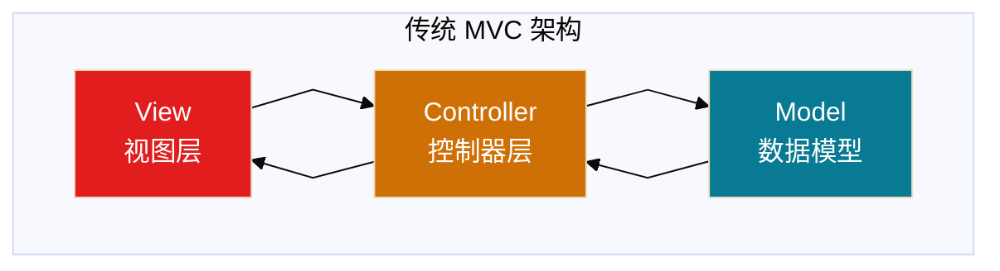

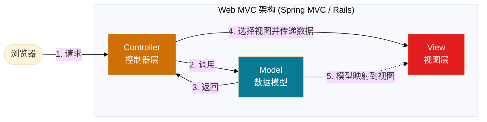


MVC 模式在业务逻辑简单的场景下确实高效，但随着业务复杂度的增加，逐渐暴露出以下问题：

1. **缺乏业务语言**：MVC 仅仅反映了软件层面的架构，不包含业务语言，无法直接与业务对话
2. **数据与行为分离**：天然切割了数据和行为，容易造成需求的首尾分离
3. **边界不清晰**：缺乏明确的边界划分规范，大规模团队协作容易出现职责不清晰
4. **业务逻辑散落**：业务规则散落在 Controller、Service、Model 各处，难以维护

### DDD 的解决方案

DDD 通过以下方式解决上述问题：

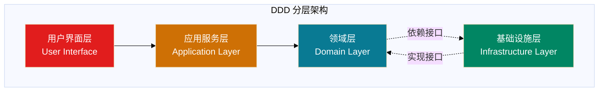

DDD 的核心思想是：**用业务语言统一代码和需求，让复杂系统按业务边界清晰拆分**。

## 为什么需要DDD：深度解析

### 1. 业务复杂性管理的必然选择

现代软件系统面临的挑战不仅仅是技术复杂性，更重要的是业务复杂性：

#### 业务复杂性的特征
- **规则复杂**：业务规则繁多且相互关联
- **变化频繁**：市场需求快速变化，需要快速响应
- **知识密集**：蕴含大量领域专业知识
- **多方协作**：业务专家、产品、技术等多角色参与

#### 传统方法的局限性


**问题**：业务与技术直接耦合，业务变化导致技术架构大改

#### DDD的解决方案
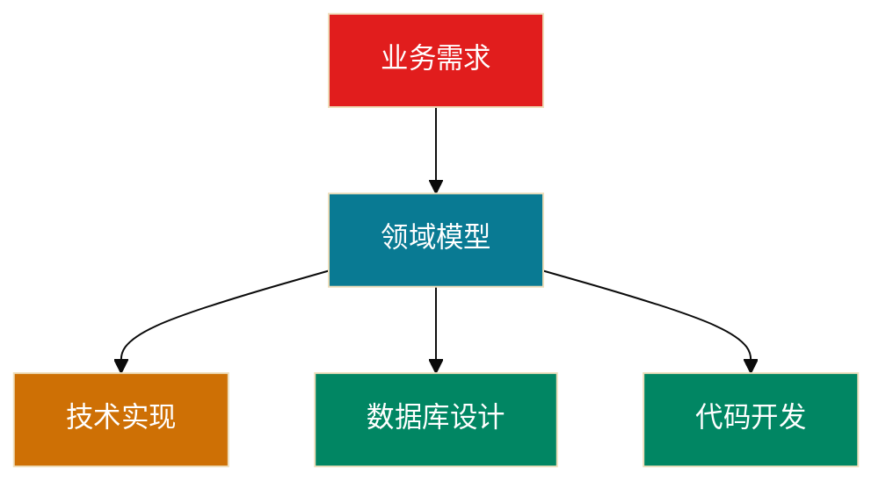

**优势**：领域模型作为中间层，隔离业务变化对技术的影响

### 2. 知识传递的载体

#### 软件开发中的知识传递问题
- **业务知识流失**：业务专家离开后，知识难以传承
- **理解偏差**：技术人员对业务理解不深入，实现偏离需求
- **沟通成本**：不同角色使用不同语言，沟通效率低

#### DDD如何解决
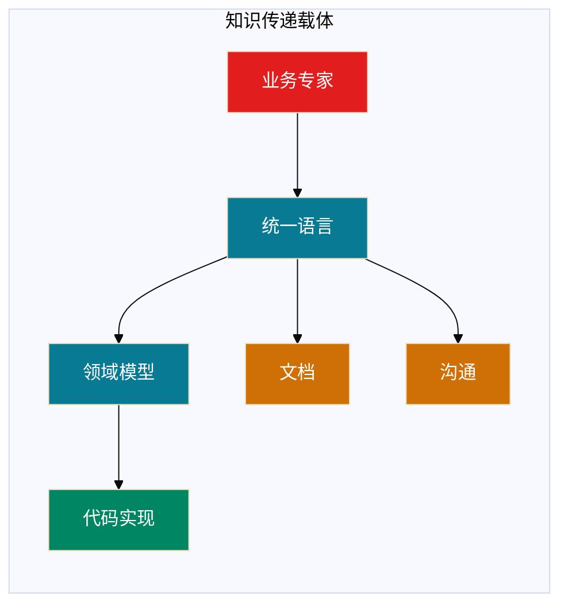

**统一语言**成为知识传递的桥梁，确保：
- 业务知识被准确理解和记录
- 不同角色使用相同术语沟通
- 知识在代码中得以体现和传承

### 3. 变化响应能力的提升

#### 软件系统的变化类型
- **业务规则变化**：价格策略、审批流程等
- **业务流程变化**：新增步骤、调整顺序等
- **业务范围变化**：新增功能、扩展领域等

#### DDD的应对策略
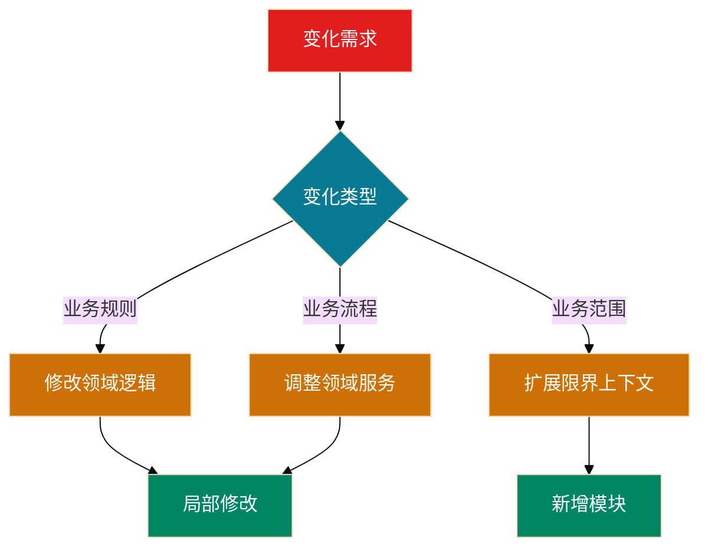

**优势**：通过清晰的边界和模块化，实现局部修改，降低变更成本

## 如何用好DDD：实践指南

### 1. DDD适用的判断标准

#### ✅ 适合使用DDD的场景
- **复杂业务系统**：业务规则复杂，需要深度领域知识
- **长期维护项目**：需要持续演进和扩展的系统
- **多团队协作**：需要明确边界和协作规范的大型项目
- **知识密集型系统**：蕴含大量专业领域知识的系统

#### ❌ 不适合使用DDD的场景
- **简单CRUD应用**：业务逻辑简单，主要是数据增删改查
- **快速原型开发**：需要快速验证想法，不需要长期维护
- **小型项目**：团队规模小，业务复杂度低
- **技术驱动项目**：主要关注技术实现，业务逻辑简单

### 2. DDD实施的关键步骤

#### 第一阶段：业务探索


**关键产出**：
- 业务流程图
- 领域事件清单
- 统一语言词汇表
- 初步的领域概念

#### 第二阶段：战略设计


**关键产出**：
- 子域划分图
- 限界上下文地图
- 上下文映射关系
- 技术架构蓝图

#### 第三阶段：战术设计


**关键产出**：
- 聚合设计图
- 实体关系图
- 领域事件清单
- 仓储接口定义

#### 第四阶段：代码实现


**关键产出**：
- 可运行的代码
- 单元测试
- 集成测试
- 部署文档

### 3. DDD成功的关键因素

#### 组织因素
- **管理层支持**：DDD需要投入额外的设计和沟通成本
- **业务专家参与**：领域专家深度参与建模过程
- **团队技能**：团队需要具备DDD思维和技能
- **文化转变**：从技术驱动转向业务驱动

#### 技术因素
- **建模能力**：能够抽象和表达业务概念
- **架构设计**：合理的分层和模块划分
- **代码质量**：保持代码的清晰和可维护性
- **测试覆盖**：确保领域逻辑的正确性

#### 过程因素
- **迭代演进**：模型需要持续优化和调整
- **持续沟通**：保持团队间的有效沟通
- **文档维护**：及时更新设计文档和统一语言
- **反馈收集**：从使用中收集反馈改进模型

### 4. 常见的DDD误区和避免方法

#### 误区1：过度设计
**表现**：为了DDD而DDD，引入不必要的复杂性
**避免方法**：
- 从简单开始，逐步演进
- 关注业务价值，避免技术炫技
- 定期review设计的必要性

#### 误区2：忽视业务专家
**表现**：技术人员闭门造车，脱离业务实际
**避免方法**：
- 建立业务专家参与机制
- 定期组织建模工作坊
- 确保统一语言的准确性

#### 误区3：僵化执行
**表现**：严格遵循DDD规则，缺乏灵活性
**避免方法**：
- 理解DDD的原理而非形式
- 根据实际情况调整方法
- 保持实用性优先原则

## DDD 的核心价值

### 1. 统一语言（Ubiquitous Language）

统一语言是 DDD 的基石。团队（业务方、产品、设计、技术等）在一个限定的上下文中形成对事物统一的描述，从而形成统一的概念。

**示例**：在电商系统中，"订单"这个词在不同上下文中有不同含义：
- 在订单上下文中：订单包含商品、金额、收货地址
- 在物流上下文中：订单是物流单号、包裹信息
- 在财务上下文中：订单是发票、支付记录

通过统一语言，我们确保：
- 需求文档中的术语与代码中的类名、方法名一致
- 开发人员与业务人员使用相同的语言交流
- 避免因术语歧义导致的沟通成本

### 2. 面向业务建模

DDD 将领域模型与数据模型分离，业务复杂度和技术复杂度分离：

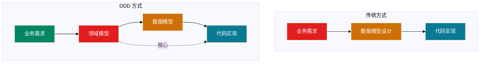

### 3. 边界清晰的设计方法

通过对需求的识别及分类，划分出领域、子域和限界上下文，进而指导团队成员分工协作。

### 4. 业务领域的知识沉淀

通过模型与软件实现关联，统一语言与模型关联，反复论证和提炼模型，使得模型与业务的真实世界保持一致。

## DDD 基本概念

DDD 的概念体系可以分为战略设计和战术设计两个层面：

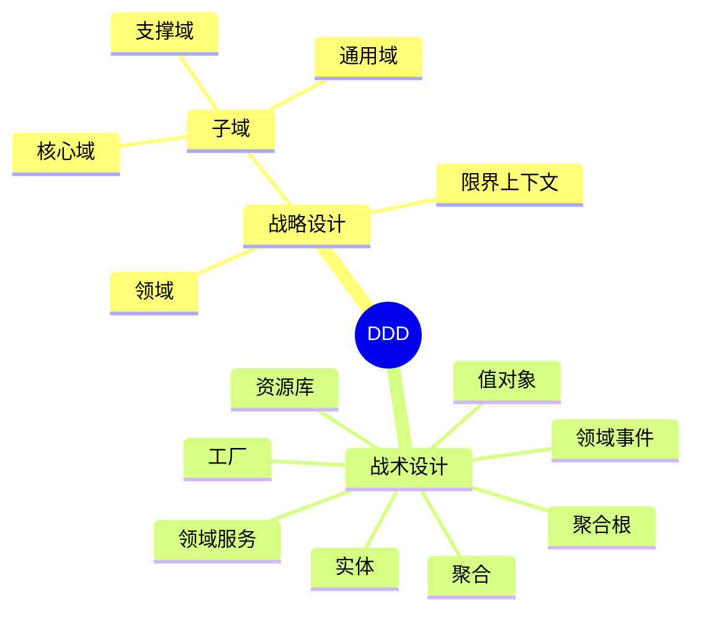

## 战略设计

战略设计是对整个领域进行分析和规划，确定领域中的概念、业务规则和领域边界等基础性问题。

### 领域（Domain）

领域就是一个组织所要做的整个事情，以及这个事情下所包含的一切内容。这是一个范围概念，而且是面向业务的。

**示例**：
- 电商公司的领域：电商领域
- 银行的领域：金融领域
- 医院的领域：医疗领域

### 子域（Subdomain）

子域是指在一个大的领域中，可以进一步划分出来的独立的业务子领域，它们有着自己的业务概念、规则和流程。

**示例**：在电商领域中，可以划分出以下子域：
- 商品域
- 订单域
- 支付域
- 物流域
- 用户域

根据重要性的不同，子域又可分为：

#### 核心域（Core Domain）

决定公司和产品核心竞争力的子域，是业务成功的主要因素。

**示例**：在电商系统中，订单域就是核心域，因为订单处理直接关系到公司的收入。

#### 支撑域（Supporting Domain）

支撑其他领域业务，具有企业特性，但不具有通用性。

**示例**：商品域、评论域就是支撑域。

#### 通用域（Generic Domain）

没有太多个性化的诉求，同时被多个子域使用的、具有通用功能的子域。

**示例**：权限域、登录域就是通用域。

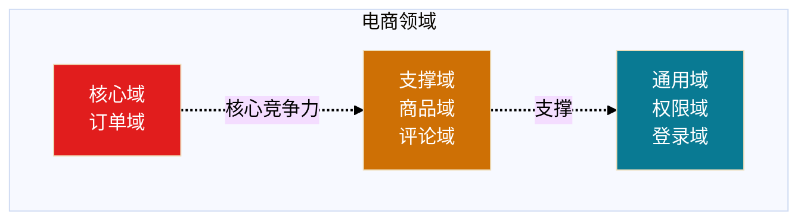

### 限界上下文（Bounded Context）

限界上下文就是业务边界的划分，这个边界可以是一个子域或者多个子域的集合。限界上下文是微服务拆分的依据，即每个限界上下文对应一个微服务。

**划分原则**：一个限界上下文必须支持一个完整的业务流程，保证这个业务流程所涉及的领域都在一个限界上下文中。

**示例**：在电商系统中，可以有以下限界上下文：
- 订单上下文（包含订单域、支付域）
- 商品上下文（包含商品域）
- 用户上下文（包含用户域、权限域）

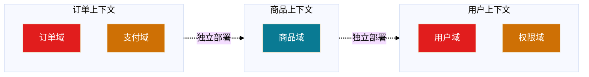

### 范围关系

领域、子域、限界上下文、聚合都是用来表示一个业务范围，它们的关系如下：

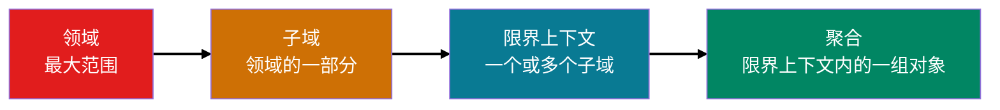

## 战术设计

战术设计是在战略设计的基础上，对领域中的具体问题进行具体的解决方案设计。

### 实体（Entity）

**定义**：实体是拥有唯一标识和状态，且具有生命周期的业务对象。实体通常代表着现实世界中的某个概念。

**特点**：
- 有唯一标识（ID）
- 有状态
- 有生命周期
- 可变性

**代码示例**（Go 语言，来自 go-web 目录）：

```go
// 订单实体
type Order struct {
    ID           string
    CustomerName string
    Amount       float64
    Status       string
    CreatedAt    time.Time
    UpdatedAt    time.Time
}

// 领域行为：支付订单
func (o *Order) Pay() error {
    if o.Status != "PENDING" {
        return errors.New("只有待支付订单可以支付")
    }
    o.Status = "PAID"
    o.UpdatedAt = time.Now()
    return nil
}
```

**实体的代码形态**：
- **失血模型**：仅包含数据和 getter/setter，业务逻辑都在服务层
- **贫血模型**：包含一些业务逻辑，但不包含依赖持久层的业务逻辑
- **充血模型**：包含所有业务逻辑，包括依赖持久层的业务逻辑
- **胀血模型**：将业务逻辑无关的应用逻辑也放到领域模型中

**推荐**：采用贫血模型，实体和领域服务共同构成领域模型。

### 值对象（Value Object）

**定义**：通过对象属性值来识别的对象，它将多个相关属性组合为一个概念整体。值对象没有唯一标识，没有生命周期，不可修改。

**特点**：
- 没有唯一标识
- 不可变性
- 可替换性
- 描述实体的特征

**代码示例**（Java 语言，来自 java-web 目录）：

```java
// 地址值对象
public class Address {
    private final String province;
    private final String city;
    private final String street;
    private final String zipCode;
    
    public Address(String province, String city, String street, String zipCode) {
        this.province = province;
        this.city = city;
        this.street = street;
        this.zipCode = zipCode;
    }
    
    // 值对象是不可变的，不提供 setter
    // 但可以提供创建新对象的方法
    public Address withCity(String newCity) {
        return new Address(this.province, newCity, this.street, this.zipCode);
    }
    
    // 值对象的相等性基于属性值
    @Override
    public boolean equals(Object o) {
        if (this == o) return true;
        if (o == null || getClass() != o.getClass()) return false;
        Address address = (Address) o;
        return Objects.equals(province, address.province) &&
               Objects.equals(city, address.city) &&
               Objects.equals(street, address.street) &&
               Objects.equals(zipCode, address.zipCode);
    }
}
```

**值对象的业务形态**：
- 单一属性的值对象：字符串、整型、枚举等
- 多属性的值对象：封装多个属性，表达一个业务含义

### 聚合和聚合根（Aggregate & Aggregate Root）

**定义**：聚合是一种更大范围的封装，把一组有相同生命周期、在业务上不可分隔的实体和值对象放在一起考虑。只有根实体可以对外暴露引用，这个根实体就是聚合根。

**特点**：
- 聚合根是聚合的唯一入口
- 聚合内部对象只能通过聚合根访问
- 聚合保证数据一致性
- 聚合之间通过 ID 引用

**代码示例**（Python 语言，来自 python-web 目录）：

```python
# 订单聚合
class Order:
    def __init__(self, order_id, customer_id):
        self.order_id = order_id
        self.customer_id = customer_id
        self.status = "PENDING"
        self.items = []  # 订单项，属于同一个聚合
    
    # 聚合根方法：添加订单项
    def add_item(self, product_id, quantity, price):
        item = OrderItem(product_id, quantity, price)
        self.items.append(item)
    
    # 聚合根方法：计算总金额
    def calculate_total(self):
        return sum(item.quantity * item.price for item in self.items)
    
    # 聚合根方法：保证业务规则
    def can_add_item(self, product_id):
        # 检查是否已存在该商品
        for item in self.items:
            if item.product_id == product_id:
                return False
        return True

class OrderItem:
    def __init__(self, product_id, quantity, price):
        self.product_id = product_id
        self.quantity = quantity
        self.price = price
```

**聚合的一致性边界**：
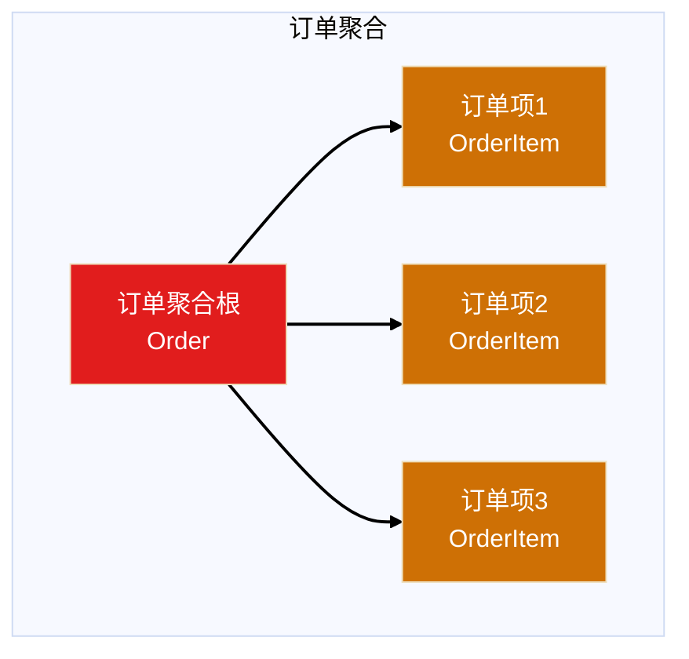

### 资源库（Repository）

**定义**：资源库是一种模式，用于封装数据访问逻辑，提供对数据的持久化和查询。它旨在将数据访问细节与领域模型分离。

**特点**：
- 封装数据访问逻辑
- 提供类似集合的接口
- 使领域模型独立于持久化技术

**代码示例**（Node.js，来自 node-web 目录）：

```javascript
// 领域层：定义仓储接口
class OrderRepository {
    save(order) {
        throw new Error("Method not implemented");
    }
    
    findById(orderId) {
        throw new Error("Method not implemented");
    }
    
    findByCustomerId(customerId) {
        throw new Error("Method not implemented");
    }
}

// 基础设施层：实现仓储
class OrderRepositoryImpl extends OrderRepository {
    constructor(database) {
        super();
        this.database = database;
    }
    
    save(order) {
        return this.database.insert('orders', order);
    }
    
    findById(orderId) {
        return this.database.query('SELECT * FROM orders WHERE id = ?', [orderId]);
    }
    
    findByCustomerId(customerId) {
        return this.database.query('SELECT * FROM orders WHERE customer_id = ?', [customerId]);
    }
}
```

### 领域服务（Domain Service）

**定义**：有些领域中的动作看上去并不属于任何对象。它们代表了领域中的一个重要的行为，不能忽略它们或者简单地把它们合并到某个实体或者值对象中。当这样的行为从领域中被识别出来时，推荐的实践方式是将它声明成一个服务。

**使用场景**：
- 涉及多个实体的操作
- 需要访问外部系统的操作
- 不适合放在实体或值对象中的业务逻辑

**代码示例**（Go 语言）：

```go
// 订单转移服务（涉及订单和用户两个实体）
type OrderTransferService struct {
    orderRepo    OrderRepository
    userRepo     UserRepository
}

func (s *OrderTransferService) TransferOrder(orderId string, fromUserId string, toUserId string) error {
    // 1. 验证订单
    order, err := s.orderRepo.FindById(orderId)
    if err != nil {
        return err
    }
    
    if order.CustomerID != fromUserId {
        return errors.New("订单不属于该用户")
    }
    
    // 2. 验证目标用户
    _, err = s.userRepo.FindById(toUserId)
    if err != nil {
        return errors.New("目标用户不存在")
    }
    
    // 3. 执行转移
    order.CustomerID = toUserId
    return s.orderRepo.Save(order)
}
```

### 领域事件（Domain Event）

**定义**：领域事件是发生在领域中且值得注意的事件。领域事件通常意味着领域对象状态的改变。领域事件在系统中起到了传递消息、触发其他动作的作用，是解耦领域模型的重要手段。

**特点**：
- 表示领域中的重要业务事件
- 通常意味着状态改变
- 用于解耦聚合
- 通过消息队列传递

**代码示例**（Java 语言，来自 java-web 目录）：

```java
// 领域事件基类
public abstract class DomainEvent {
    private String eventId;
    private LocalDateTime occurredAt;
    
    protected DomainEvent() {
        this.eventId = UUID.randomUUID().toString();
        this.occurredAt = LocalDateTime.now();
    }
    
    public String getEventId() {
        return eventId;
    }
    
    public LocalDateTime getOccurredAt() {
        return occurredAt;
    }
    
    public abstract String getEventType();
}

// 订单创建事件
public class OrderCreatedEvent extends DomainEvent {
    private String orderId;
    private String customerId;
    private BigDecimal amount;
    
    public OrderCreatedEvent(String orderId, String customerId, BigDecimal amount) {
        super();
        this.orderId = orderId;
        this.customerId = customerId;
        this.amount = amount;
    }
    
    @Override
    public String getEventType() {
        return "OrderCreated";
    }
}

// 在订单实体中发布事件
public class Order {
    private List<DomainEvent> domainEvents = new ArrayList<>();
    
    public void create(String customerId, BigDecimal amount) {
        this.customerId = customerId;
        this.amount = amount;
        this.status = "PENDING";
        
        // 记录领域事件
        this.domainEvents.add(new OrderCreatedEvent(this.id, customerId, amount));
    }
    
    public List<DomainEvent> getDomainEvents() {
        return Collections.unmodifiableList(domainEvents);
    }
    
    public void clearDomainEvents() {
        this.domainEvents.clear();
    }
}
```

**领域事件流转**：

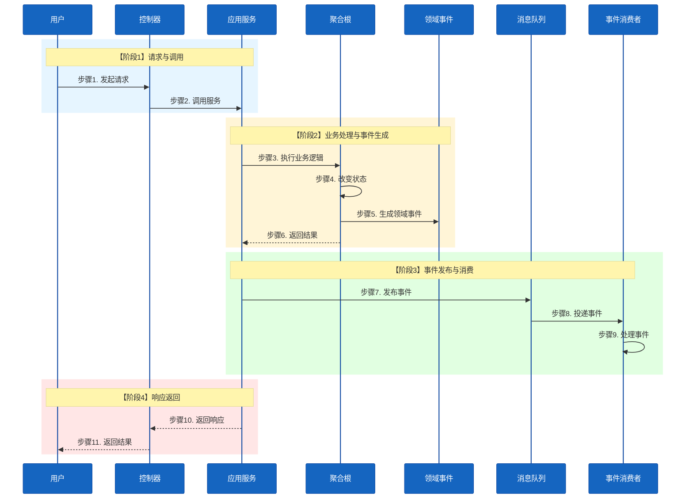

## 领域建模方法

领域建模是 DDD 的核心，好的领域建模意味着对业务有深刻的理解。下面介绍两种常见的领域建模方法。

### 事件风暴建模（Event Storming）

事件风暴是意大利人 Alberto Brandolini 在 2012 年创造的一种事件建模方法。它是一种互动式建模工作坊，通过将不同背景的项目参与方汇聚一堂，集思广益，从而形成有效的模型。

#### 事件风暴语法

事件风暴通过彩色贴纸的"语法"来组织逻辑：

- **橙色**：事件（Event）- 已发生且重要的事情
- **蓝色**：命令（Command）- 由行动者发起的行为
- **浅黄色**：行动者（Actor）- 系统的使用者
- **粉色**：业务规则（Policy）- 对于事件的响应
- **紫色**：系统（System）- 不需要了解细节的三方系统
- **绿色**：阅读模型（Read Model）- 用以支撑决策的信息
- **红色**：热点问题（HotSpot）- 业务痛点、瓶颈、模糊点

#### 事件风暴流程

**第一步：梳理事件（橙色贴纸）**

事件是已发生且重要的事情。事件必须是既成事实，且业务关注的事情。

**示例**：订单系统的事件
- 订单已创建
- 订单已支付
- 订单已发货
- 订单已取消

**第二步：业务规则（粉色贴纸）**

业务规则或者业务逻辑，是业务中最重要的部分。

**示例**："订单已创建"事件的业务逻辑
- 订单已创建的前提条件是商品可购买，同时用户未购买过该商品
- 订单创建后，会导致发起支付

**第三步：行动者、命令、阅读模型和系统**

通过问题引导找到 Actor、Command、Read Model。

**第四步：热点问题（红色贴纸）**

业务痛点、瓶颈、模糊点用红色贴纸记录。

**第五步：故事串讲**

邀请一名现场成员，按事件发生的时间顺序串讲业务。

**第六步：产出架构**

通过事件风暴，业务流程和处理逻辑应该已经很清楚了，接下来就由架构师产出对应的架构。

#### 事件风暴示例

```mermaid
%%{init: {'theme': 'base', 'themeVariables': { 'sectionBkgColor': '#f1f1f1', 'altSectionBkgColor': '#f1f1f1', 'gridColor': '#e9ecef'}}}%%
flowchart LR
    subgraph 事件风暴["订单订阅事件风暴"]
        direction TB
        
        subgraph 用户["用户"]
            A[用户]
        end
        
        subgraph 命令["命令"]
            C1[创建订单]
            C2[支付订单]
            C3[取消订单]
        end
        
        subgraph 事件["事件"]
            E1[订单已创建]
            E2[订单已支付]
            E3[订单已取消]
        end
        
        subgraph 业务规则["业务规则"]
            P1[检查库存]
            P2[扣减库存]
            P3[退款处理]
        end
        
        subgraph 系统["系统"]
            S1[库存系统]
            S2[支付系统]
        end
    end
    
    A --> C1
    C1 --> P1
    P1 --> E1
    E1 --> C2
    C2 --> S2
    S2 --> E2
    E2 --> P2
    C3 --> E3
    E3 --> P3
    
    style A fill:#E11D1D,color:#ffffff
    style C1 fill:#CE7005,color:#FFFFFF
    style C2 fill:#CE7005,color:#FFFFFF
    style C3 fill:#CE7005,color:#FFFFFF
    style E1 fill:#097A93,color:#ffffff
    style E2 fill:#097A93,color:#ffffff
    style E3 fill:#097A93,color:#ffffff
    style P1 fill:#018663,color:#ffffff
    style P2 fill:#018663,color:#ffffff
    style P3 fill:#018663,color:#ffffff
    style S1 fill:#E11D1D,color:#ffffff
    style S2 fill:#E11D1D,color:#ffffff
    
    linkStyle 0 stroke:#000000,stroke-width:2px,color:#ffffff
    linkStyle 1 stroke:#000000,stroke-width:2px,color:#ffffff
    linkStyle 2 stroke:#018663,stroke-width:2px,color:#ffffff
    linkStyle 3 stroke:#000000,stroke-width:2px,color:#ffffff
    linkStyle 4 stroke:#000000,stroke-width:2px,color:#ffffff
    linkStyle 5 stroke:#018663,stroke-width:2px,color:#ffffff
    linkStyle 6 stroke:#000000,stroke-width:2px,color:#ffffff
    linkStyle 7 stroke:#000000,stroke-width:2px,color:#ffffff
    linkStyle 8 stroke:#000000,stroke-width:2px,color:#ffffff
    linkStyle 9 stroke:#000000,stroke-width:2px,color:#ffffff
```

### 四色建模法

四色建模法是一种从收敛逻辑出发的强分析方法，通过寻找现金往来和凭证、角色和参与者，逐步获得领域模型。

#### 四色建模法语法

四色建模法使用四种颜色来表示不同类型的对象：

- **绿色**：时刻时间段（Moment-Interval）- 表示业务发生的时间点或时间段
- **黄色**：角色（Role）- 表示在业务中扮演的角色
- **蓝色**：描述（Description）- 表示对象的描述信息
- **红色**：参与方（Party）- 表示业务中的参与实体

#### 四色建模法操作流程

**第一步：寻找现金往来和凭证**

找到业务中的资金往来和凭证，这些通常是绿色的时刻时间段对象。

**第二步：寻找角色和参与者**

找到业务中的角色和参与者，这些通常是黄色的角色和红色的参与方对象。

**第三步：获得领域模型**

通过前面的步骤，逐步构建出领域模型。

**第四步：验证业务脊梁以及领域模型的有效性**

验证模型是否能够支撑业务流程。

## DDD 分层架构实战

DDD 分层架构是 DDD 落地的重要方式，下面结合 domain-driven-design 目录中的实际代码示例，展示如何在不同的编程语言中实现 DDD 分层架构。

### DDD 分层架构图

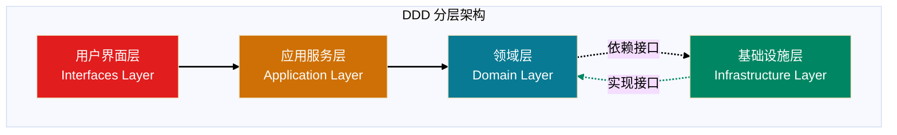

### 各层职责

- **用户界面层（Interfaces Layer）**：处理用户输入与展示信息，如 HTTP 控制器、路由等
- **应用服务层（Application Layer）**：负责应用层流程逻辑，协调领域层的操作
- **领域层（Domain Layer）**：实现核心业务逻辑，包括实体、值对象、聚合、领域服务等
- **基础设施层（Infrastructure Layer）**：提供数据库、外部 API、消息队列等技术支持

### Go 语言 DDD 实现示例

来自 `domain-driven-design/go-web` 目录：

```go
// 用户界面层（Interfaces Layer）
// internal/interfaces/handlers/order_handler.go
type OrderHandler struct {
    orderService *OrderService
}

func (h *OrderHandler) CreateOrder(c *gin.Context) {
    var req CreateOrderRequest
    if err := c.ShouldBindJSON(&req); err != nil {
        c.JSON(400, gin.H{"error": err.Error()})
        return
    }
    
    order, err := h.orderService.CreateOrder(req.CustomerName, req.Amount)
    if err != nil {
        c.JSON(500, gin.H{"error": err.Error()})
        return
    }
    
    c.JSON(200, order)
}

// 应用服务层（Application Layer）
// internal/application/services/order_service.go
type OrderService struct {
    orderRepo domain.OrderRepository
}

func (s *OrderService) CreateOrder(customerName string, amount float64) (*domain.Order, error) {
    order := &domain.Order{
        ID:           generateID(),
        CustomerName: customerName,
        Amount:       amount,
        Status:       "PENDING",
        CreatedAt:    time.Now(),
    }
    
    if err := s.orderRepo.Save(order); err != nil {
        return nil, err
    }
    
    return order, nil
}

// 领域层（Domain Layer）
// internal/domain/order/order.go
type Order struct {
    ID           string
    CustomerName string
    Amount       float64
    Status       string
    CreatedAt    time.Time
    UpdatedAt    time.Time
}

func (o *Order) Pay() error {
    if o.Status != "PENDING" {
        return errors.New("只有待支付订单可以支付")
    }
    o.Status = "PAID"
    o.UpdatedAt = time.Now()
    return nil
}

// 领域层：仓储接口
// internal/domain/repository/order_repository.go
type OrderRepository interface {
    Save(order *Order) error
    FindByID(id string) (*Order, error)
    FindAll() ([]*Order, error)
}

// 基础设施层（Infrastructure Layer）
// internal/infrastructure/repository/order_repository_impl.go
type OrderRepositoryImpl struct {
    db *sql.DB
}

func (r *OrderRepositoryImpl) Save(order *Order) error {
    _, err := r.db.Exec(
        "INSERT INTO orders (id, customer_name, amount, status, created_at) VALUES (?, ?, ?, ?, ?)",
        order.ID, order.CustomerName, order.Amount, order.Status, order.CreatedAt,
    )
    return err
}

func (r *OrderRepositoryImpl) FindByID(id string) (*Order, error) {
    var order Order
    err := r.db.QueryRow(
        "SELECT id, customer_name, amount, status, created_at FROM orders WHERE id = ?",
        id,
    ).Scan(&order.ID, &order.CustomerName, &order.Amount, &order.Status, &order.CreatedAt)
    
    if err != nil {
        return nil, err
    }
    return &order, nil
}
```

### Java 语言 DDD 实现示例

来自 `domain-driven-design/java-web` 目录：

```java
// 用户界面层（Interfaces Layer）
// interfaces/controllers/OrderController.java
@RestController
@RequestMapping("/api/orders")
public class OrderController {
    private final OrderService orderService;
    
    public OrderController(OrderService orderService) {
        this.orderService = orderService;
    }
    
    @PostMapping
    public ResponseEntity<OrderDTO> createOrder(@RequestBody CreateOrderRequest request) {
        OrderDTO order = orderService.createOrder(request.getCustomerName(), request.getAmount());
        return ResponseEntity.ok(order);
    }
    
    @GetMapping("/{id}")
    public ResponseEntity<OrderDTO> getOrder(@PathVariable String id) {
        OrderDTO order = orderService.getOrder(id);
        return ResponseEntity.ok(order);
    }
}

// 应用服务层（Application Layer）
// application/services/OrderService.java
@Service
public class OrderService {
    private final OrderRepository orderRepository;
    
    public OrderService(OrderRepository orderRepository) {
        this.orderRepository = orderRepository;
    }
    
    public OrderDTO createOrder(String customerName, BigDecimal amount) {
        Order order = new Order(UUID.randomUUID().toString(), customerName, amount);
        orderRepository.save(order);
        return OrderDTO.fromDomain(order);
    }
    
    public OrderDTO getOrder(String id) {
        Order order = orderRepository.findById(id)
            .orElseThrow(() -> new OrderNotFoundException(id));
        return OrderDTO.fromDomain(order);
    }
}

// 领域层（Domain Layer）
// domain/order/Order.java
public class Order {
    private String id;
    private String customerName;
    private BigDecimal amount;
    private String status;
    private LocalDateTime createdAt;
    private LocalDateTime updatedAt;
    
    public Order(String id, String customerName, BigDecimal amount) {
        this.id = id;
        this.customerName = customerName;
        this.amount = amount;
        this.status = "PENDING";
        this.createdAt = LocalDateTime.now();
        this.updatedAt = LocalDateTime.now();
    }
    
    public void pay() {
        if (!"PENDING".equals(this.status)) {
            throw new IllegalStateException("只有待支付订单可以支付");
        }
        this.status = "PAID";
        this.updatedAt = LocalDateTime.now();
    }
}

// 领域层：仓储接口
// domain/repository/OrderRepository.java
public interface OrderRepository {
    void save(Order order);
    Optional<Order> findById(String id);
    List<Order> findAll();
}

// 基础设施层（Infrastructure Layer）
// infrastructure/repository/OrderRepositoryImpl.java
@Repository
public class OrderRepositoryImpl implements OrderRepository {
    private final JdbcTemplate jdbcTemplate;
    
    public OrderRepositoryImpl(JdbcTemplate jdbcTemplate) {
        this.jdbcTemplate = jdbcTemplate;
    }
    
    @Override
    public void save(Order order) {
        jdbcTemplate.update(
            "INSERT INTO orders (id, customer_name, amount, status, created_at, updated_at) VALUES (?, ?, ?, ?, ?, ?)",
            order.getId(), order.getCustomerName(), order.getAmount(), 
            order.getStatus(), order.getCreatedAt(), order.getUpdatedAt()
        );
    }
    
    @Override
    public Optional<Order> findById(String id) {
        List<Order> orders = jdbcTemplate.query(
            "SELECT * FROM orders WHERE id = ?",
            new Object[]{id},
            (rs, rowNum) -> new Order(
                rs.getString("id"),
                rs.getString("customer_name"),
                rs.getBigDecimal("amount")
            )
        );
        return orders.isEmpty() ? Optional.empty() : Optional.of(orders.get(0));
    }
}
```

### Python 语言 DDD 实现示例

来自 `domain-driven-design/python-web` 目录：

```python
# 用户界面层（Interfaces Layer）
# interfaces/controllers/order_controller.py
from flask import request, jsonify
from application.services.order_service import OrderService

class OrderController:
    def __init__(self, order_service: OrderService):
        self.order_service = order_service
    
    def create_order(self):
        data = request.get_json()
        order = self.order_service.create_order(
            data['customer_name'],
            data['amount']
        )
        return jsonify(order.to_dict()), 201
    
    def get_order(self, order_id):
        order = self.order_service.get_order(order_id)
        return jsonify(order.to_dict())

# 应用服务层（Application Layer）
# application/services/order_service.py
from domain.order import Order
from domain.order_repository import OrderRepository

class OrderService:
    def __init__(self, order_repository: OrderRepository):
        self.order_repository = order_repository
    
    def create_order(self, customer_name: str, amount: float) -> Order:
        order = Order(
            order_id=str(uuid.uuid4()),
            customer_name=customer_name,
            amount=amount
        )
        self.order_repository.save(order)
        return order
    
    def get_order(self, order_id: str) -> Order:
        return self.order_repository.find_by_id(order_id)

# 领域层（Domain Layer）
# domain/order.py
from datetime import datetime

class Order:
    def __init__(self, order_id: str, customer_name: str, amount: float):
        self.order_id = order_id
        self.customer_name = customer_name
        self.amount = amount
        self.status = "PENDING"
        self.created_at = datetime.now()
        self.updated_at = datetime.now()
    
    def pay(self):
        if self.status != "PENDING":
            raise ValueError("只有待支付订单可以支付")
        self.status = "PAID"
        self.updated_at = datetime.now()
    
    def to_dict(self):
        return {
            'order_id': self.order_id,
            'customer_name': self.customer_name,
            'amount': self.amount,
            'status': self.status,
            'created_at': self.created_at.isoformat(),
            'updated_at': self.updated_at.isoformat()
        }

# 领域层：仓储接口
# domain/order_repository.py
from abc import ABC, abstractmethod

class OrderRepository(ABC):
    @abstractmethod
    def save(self, order: Order):
        pass
    
    @abstractmethod
    def find_by_id(self, order_id: str) -> Order:
        pass

# 基础设施层（Infrastructure Layer）
# infrastructure/repositories/order_repository_impl.py
from domain.order import Order
from domain.order_repository import OrderRepository

class OrderRepositoryImpl(OrderRepository):
    def __init__(self, db_connection):
        self.db = db_connection
    
    def save(self, order: Order):
        self.db.execute(
            "INSERT INTO orders (id, customer_name, amount, status, created_at, updated_at) VALUES (?, ?, ?, ?, ?, ?)",
            (order.order_id, order.customer_name, order.amount, order.status, order.created_at, order.updated_at)
        )
    
    def find_by_id(self, order_id: str) -> Order:
        row = self.db.fetch_one(
            "SELECT * FROM orders WHERE id = ?",
            (order_id,)
        )
        if row:
            return Order(
                order_id=row['id'],
                customer_name=row['customer_name'],
                amount=row['amount']
            )
        return None
```

### Node.js 语言 DDD 实现示例

来自 `domain-driven-design/node-web` 目录：

```javascript
// 用户界面层（Interfaces Layer）
// interfaces/controllers/order-controller.js
const OrderService = require('../../application/services/order-service');

class OrderController {
    constructor(orderService) {
        this.orderService = orderService;
    }
    
    async createOrder(req, res) {
        try {
            const { customerName, amount } = req.body;
            const order = await this.orderService.createOrder(customerName, amount);
            res.status(201).json(order);
        } catch (error) {
            res.status(500).json({ error: error.message });
        }
    }
    
    async getOrder(req, res) {
        try {
            const { id } = req.params;
            const order = await this.orderService.getOrder(id);
            res.json(order);
        } catch (error) {
            res.status(404).json({ error: error.message });
        }
    }
}

module.exports = OrderController;

// 应用服务层（Application Layer）
// application/services/order-service.js
const Order = require('../../domain/order/order');
const OrderRepository = require('../../domain/order/order-repository');

class OrderService {
    constructor(orderRepository) {
        this.orderRepository = orderRepository;
    }
    
    async createOrder(customerName, amount) {
        const order = new Order(uuid.v4(), customerName, amount);
        await this.orderRepository.save(order);
        return order;
    }
    
    async getOrder(orderId) {
        return await this.orderRepository.findById(orderId);
    }
}

module.exports = OrderService;

// 领域层（Domain Layer）
// domain/order/order.js
class Order {
    constructor(orderId, customerName, amount) {
        this.orderId = orderId;
        this.customerName = customerName;
        this.amount = amount;
        this.status = 'PENDING';
        this.createdAt = new Date();
        this.updatedAt = new Date();
    }
    
    pay() {
        if (this.status !== 'PENDING') {
            throw new Error('只有待支付订单可以支付');
        }
        this.status = 'PAID';
        this.updatedAt = new Date();
    }
    
    toJSON() {
        return {
            orderId: this.orderId,
            customerName: this.customerName,
            amount: this.amount,
            status: this.status,
            createdAt: this.createdAt,
            updatedAt: this.updatedAt
        };
    }
}

module.exports = Order;

// 领域层：仓储接口
// domain/order/order-repository.js
class OrderRepository {
    async save(order) {
        throw new Error('Method not implemented');
    }
    
    async findById(orderId) {
        throw new Error('Method not implemented');
    }
}

module.exports = OrderRepository;

// 基础设施层（Infrastructure Layer）
// infrastructure/repository/order-repository-impl.js
const OrderRepository = require('../../domain/order/order-repository');

class OrderRepositoryImpl extends OrderRepository {
    constructor(database) {
        super();
        this.database = database;
    }
    
    async save(order) {
        await this.database.insert('orders', {
            id: order.orderId,
            customer_name: order.customerName,
            amount: order.amount,
            status: order.status,
            created_at: order.createdAt,
            updated_at: order.updatedAt
        });
    }
    
    async findById(orderId) {
        return await this.database.query('SELECT * FROM orders WHERE id = ?', [orderId]);
    }
}

module.exports = OrderRepositoryImpl;
```

## DDD 与 MVC 的对比

### 架构对比

```mermaid
%%{init: {'theme': 'base', 'themeVariables': { 'sectionBkgColor': '#f1f1f1', 'altSectionBkgColor': '#f1f1f1', 'gridColor': '#e9ecef'}}}%%
flowchart TB
    subgraph MVC["MVC 架构"]
        MVC_View[View]
        MVC_Controller[Controller]
        MVC_Model[Model]
        MVC_DB[(Database)]
    end
    
    subgraph DDD["DDD 架构"]
        DDD_UI[用户界面层]
        DDD_App[应用服务层]
        DDD_Domain[领域层]
        DDD_Infra[基础设施层]
    end
    
    MVC_View --> MVC_Controller
    MVC_Controller --> MVC_Model
    MVC_Model --> MVC_DB
    
    DDD_UI --> DDD_App
    DDD_App --> DDD_Domain
    DDD_Domain -.接口.-> DDD_Infra
    
    style MVC_View fill:#CE7005
    style MVC_Controller fill:#097A93
    style MVC_Model fill:#E11D1D
    style MVC_DB fill:#018663
    
    style DDD_UI fill:#CE7005
    style DDD_App fill:#097A93
    style DDD_Domain fill:#E11D1D
    style DDD_Infra fill:#018663
    
    linkStyle 0 stroke:#000000,stroke-width:2px,color:#ffffff
    linkStyle 1 stroke:#000000,stroke-width:2px,color:#ffffff
    linkStyle 2 stroke:#000000,stroke-width:2px,color:#ffffff
    linkStyle 3 stroke:#018663,stroke-width:2px,color:#ffffff
    linkStyle 4 stroke:#000000,stroke-width:2px,color:#ffffff
    linkStyle 5 stroke:#000000,stroke-width:2px,color:#ffffff
    linkStyle 6 stroke:#000000,stroke-width:2px,color:#ffffff
    linkStyle 7 stroke:#018663,stroke-width:2px,color:#ffffff
```

### 特性对比

| 特性 | MVC | DDD |
|------|-----|-----|
| 主要目标 | 分离 UI、业务逻辑和数据 | 解决复杂领域建模与业务逻辑 |
| 关注点 | UI 驱动，适用于前端开发 | 领域驱动，适用于复杂业务系统 |
| 层次 | 3 层（Model、View、Controller） | 4 层（UI、Application、Domain、Infrastructure） |
| 业务语言 | 缺乏业务语言 | 统一语言贯穿始终 |
| 边界划分 | 技术边界 | 业务边界 |
| 适用场景 | 前端框架、强交互应用 | 企业级系统、复杂业务领域 |
| 依赖方向 | 依赖数据库 | 依赖倒置，领域层独立 |

## DDD 的应用场景

### 适合使用 DDD 的场景

1. **业务逻辑复杂**：业务规则复杂，需要清晰的领域建模
2. **企业级系统**：如电商平台、ERP、银行系统
3. **多系统交互**：涉及数据库、外部 API、消息队列等
4. **团队协作开发**：需要业务人员和开发人员紧密合作
5. **长期维护项目**：需要持续演进和扩展的系统

### 不适合使用 DDD 的场景

1. **简单 CRUD 应用**：业务逻辑简单，主要是数据的增删改查
2. **快速原型开发**：需要快速验证想法，不需要长期维护
3. **小型项目**：团队规模小，业务复杂度低
4. **技术驱动项目**：主要关注技术实现，业务逻辑简单

## DDD实施挑战与解决方案

### 1. 技术挑战

#### 挑战1：复杂查询处理
**问题描述**：DDD强调聚合根的完整性，但实际业务中经常需要跨聚合的复杂查询。

**解决方案**：
```mermaid
%%{init: {'theme': 'base', 'themeVariables': { 'sectionBkgColor': '#f1f1f1', 'altSectionBkgColor': '#f1f1f1', 'gridColor': '#e9ecef'}}}%%
flowchart TD
    A[复杂查询需求] --> B{查询类型}
    B -->|跨聚合查询| C[应用服务协调]
    B -->|报表查询| D[读写分离]
    B -->|实时查询| E[事件溯源]
    
    C --> F[多个聚合根组合]
    D --> G[专门查询模型]
    E --> H[事件重放]
    
    style A fill:#E11D1D,color:#ffffff
    style B fill:#097A93,color:#ffffff
    style C fill:#CE7005,color:#FFFFFF
    style D fill:#CE7005,color:#FFFFFF
    style E fill:#CE7005,color:#FFFFFF
    style F fill:#018663,color:#ffffff
    style G fill:#018663,color:#ffffff
    style H fill:#018663,color:#ffffff
```

**具体策略**：
- **应用服务协调**：通过应用服务调用多个聚合根，组合结果
- **读写分离**：为查询建立专门的读取模型，避免影响写入模型
- **事件溯源**：通过事件重放构建查询所需的状态

#### 挑战2：分布式事务
**问题描述**：跨限界上下文的操作需要保证数据一致性。

**解决方案**：
```mermaid
%%{init: {'theme': 'base', 'themeVariables': { 'sectionBkgColor': '#f1f1f1', 'altSectionBkgColor': '#f1f1f1', 'gridColor': '#e9ecef'}}}%%
flowchart TD
    A[分布式操作] --> B{一致性要求}
    B -->|强一致性| C[两阶段提交]
    B -->|最终一致性| D[Saga模式]
    B -->|业务补偿| E[领域事件]
    
    C --> F[性能牺牲]
    D --> G[复杂性增加]
    E --> H[业务逻辑复杂]
    
    style A fill:#E11D1D,color:#ffffff
    style B fill:#097A93,color:#ffffff
    style C fill:#CE7005,color:#FFFFFF
    style D fill:#CE7005,color:#FFFFFF
    style E fill:#CE7005,color:#FFFFFF
    style F fill:#018663,color:#ffffff
    style G fill:#018663,color:#ffffff
    style H fill:#018663,color:#ffffff
```

**具体策略**：
- **Saga模式**：将长事务拆分为多个本地事务，通过补偿机制处理失败
- **领域事件**：通过异步事件传播，实现最终一致性
- **业务补偿**：设计明确的补偿操作，处理异常情况

#### 挑战3：性能优化
**问题描述**：DDD的分层和抽象可能带来性能开销。

**解决方案**：
- **缓存策略**：在适当层级引入缓存，减少数据库访问
- **批量操作**：设计批量接口，减少网络开销
- **异步处理**：将非关键操作异步化，提升响应速度

### 2. 组织挑战

#### 挑战1：团队技能要求
**问题描述**：DDD需要团队具备建模、架构、业务理解等多方面能力。

**解决方案**：
```mermaid
%%{init: {'theme': 'base', 'themeVariables': { 'sectionBkgColor': '#f1f1f1', 'altSectionBkgColor': '#f1f1f1', 'gridColor': '#e9ecef'}}}%%
flowchart TD
    A[技能提升] --> B[培训体系]
    A --> C[实践指导]
    A --> D[知识分享]
    
    B --> E[DDD基础理论]
    B --> F[建模方法]
    B --> G[架构设计]
    
    C --> H[导师制度]
    C --> I[代码Review]
    C --> J[项目实践]
    
    D --> K[技术分享]
    D --> L[案例研究]
    D --> M[经验总结]
    
    style A fill:#E11D1D,color:#ffffff
    style B fill:#097A93,color:#ffffff
    style C fill:#097A93,color:#ffffff
    style D fill:#097A93,color:#ffffff
    style E fill:#CE7005,color:#FFFFFF
    style F fill:#CE7005,color:#FFFFFF
    style G fill:#CE7005,color:#FFFFFF
    style H fill:#018663,color:#ffffff
    style I fill:#018663,color:#ffffff
    style J fill:#018663,color:#ffffff
    style K fill:#018663,color:#ffffff
    style L fill:#018663,color:#ffffff
    style M fill:#018663,color:#ffffff
```

**具体措施**：
- **系统培训**：组织DDD理论和实践培训
- **导师制度**：为新人配备经验丰富的导师
- **实践项目**：从简单项目开始，逐步提升复杂度

#### 挑战2：业务专家参与
**问题描述**：业务专家通常很忙，难以深度参与建模过程。

**解决方案**：
- **高层支持**：获得管理层对业务专家参与的支持
- **激励机制**：建立业务专家参与的激励机制
- **高效协作**：设计高效的协作工具和流程

#### 挑战3：文化转变
**问题描述**：从技术驱动转向业务驱动需要文化转变。

**解决方案**：
- **价值观引导**：强调业务价值的重要性
- **成功案例**：通过成功案例展示DDD的价值
- **持续改进**：建立持续改进的文化氛围

### 3. 过程挑战

#### 挑战1：渐进式实施
**问题描述**：如何在现有系统中渐进式引入DDD。

**解决方案**：
```mermaid
%%{init: {'theme': 'base', 'themeVariables': { 'sectionBkgColor': '#f1f1f1', 'altSectionBkgColor': '#f1f1f1', 'gridColor': '#e9ecef'}}}%%
flowchart TD
    A[现有系统] --> B[识别核心域]
    B --> C[建立限界上下文]
    C --> D[重构核心模块]
    D --> E[扩展到其他模块]
    E --> F[全面DDD化]
    
    style A fill:#E11D1D,color:#ffffff
    style B fill:#CE7005,color:#FFFFFF
    style C fill:#097A93,color:#ffffff
    style D fill:#097A93,color:#ffffff
    style E fill:#018663,color:#ffffff
    style F fill:#018663,color:#ffffff
```

**具体步骤**：
- **识别核心域**：找到业务价值最高的领域
- **建立边界**：在核心域周围建立清晰的边界
- **逐步重构**：逐步将现有代码重构为DDD结构

#### 挑战2：度量与评估
**问题描述**：如何度量DDD实施的效果。

**解决方案**：
- **业务指标**：关注业务价值的提升
- **技术指标**：关注代码质量和可维护性
- **团队指标**：关注团队效率和满意度

## 完整实践案例：电商订单系统

### 案例背景
某电商平台面临以下挑战：
- 订单系统复杂度高，业务规则繁多
- 多个系统相互依赖，维护困难
- 业务变化频繁，响应速度慢
- 新人上手困难，知识传承不畅

### 第一阶段：业务探索

#### 1.1 业务目标梳理
```mermaid
%%{init: {'theme': 'base', 'themeVariables': { 'sectionBkgColor': '#f1f1f1', 'altSectionBkgColor': '#f1f1f1', 'gridColor': '#e9ecef'}}}%%
flowchart TD
    A[业务目标] --> B[提升用户体验]
    A --> C[降低运营成本]
    A --> D[提高系统稳定性]
    
    B --> E[快速下单]
    B --> F[实时状态跟踪]
    B --> G[灵活支付方式]
    
    C --> H[自动化处理]
    C --> I[减少人工干预]
    C --> J[优化资源使用]
    
    D --> K[高可用性]
    D --> L[数据一致性]
    D --> M[快速故障恢复]
    
    style A fill:#E11D1D,color:#ffffff
    style B fill:#097A93,color:#ffffff
    style C fill:#097A93,color:#ffffff
    style D fill:#097A93,color:#ffffff
    style E fill:#CE7005,color:#FFFFFF
    style F fill:#CE7005,color:#FFFFFF
    style G fill:#CE7005,color:#FFFFFF
    style H fill:#018663,color:#ffffff
    style I fill:#018663,color:#ffffff
    style J fill:#018663,color:#ffffff
    style K fill:#018663,color:#ffffff
    style L fill:#018663,color:#ffffff
    style M fill:#018663,color:#ffffff
```

#### 1.2 领域专家访谈
通过访谈业务专家，识别出以下关键业务概念：
- **订单生命周期**：创建 → 支付 → 发货 → 完成 → 取消
- **订单状态**：待支付、已支付、已发货、已完成、已取消
- **支付方式**：在线支付、货到付款、分期付款
- **库存管理**：库存检查、预留、释放

#### 1.3 事件风暴工作坊
组织为期2天的事件风暴工作坊，产出：

**关键事件**：
- 订单创建事件
- 支付完成事件
- 订单发货事件
- 订单完成事件
- 订单取消事件

**业务规则**：
- 库存不足时不能创建订单
- 支付超时自动取消订单
- 发货后不能取消订单

**统一语言**：
- **订单**：用户购买商品的请求
- **订单项**：订单中的具体商品
- **支付**：订单的付款过程
- **发货**：商品的配送过程

### 第二阶段：战略设计

#### 2.1 子域划分
```mermaid
%%{init: {'theme': 'base', 'themeVariables': { 'sectionBkgColor': '#f1f1f1', 'altSectionBkgColor': '#f1f1f1', 'gridColor': '#e9ecef'}}}%%
flowchart TD
    A[电商系统] --> B[核心域]
    A --> C[支撑域]
    A --> D[通用域]
    
    B --> E[订单域]
    B --> F[支付域]
    B --> G[库存域]
    
    C --> H[商品域]
    C --> I[用户域]
    C --> J[物流域]
    
    D --> K[通知域]
    D --> L[日志域]
    D --> M[配置域]
    
    style A fill:#E11D1D,color:#ffffff
    style B fill:#097A93,color:#ffffff
    style C fill:#CE7005,color:#FFFFFF
    style D fill:#018663,color:#ffffff
    style E fill:#097A93,color:#ffffff
    style F fill:#097A93,color:#ffffff
    style G fill:#097A93,color:#ffffff
    style H fill:#CE7005,color:#FFFFFF
    style I fill:#CE7005,color:#FFFFFF
    style J fill:#CE7005,color:#FFFFFF
    style K fill:#018663,color:#ffffff
    style L fill:#018663,color:#ffffff
    style M fill:#018663,color:#ffffff
```

#### 2.2 限界上下文定义
基于子域划分，定义以下限界上下文：

**订单上下文**：
- 职责：订单的创建、支付、发货、取消
- 边界：包含订单相关的所有业务逻辑
- 接口：提供订单查询、状态更新等服务

**支付上下文**：
- 职责：处理各种支付方式
- 边界：独立于订单，专注于支付流程
- 接口：提供支付、退款、查询等服务

**库存上下文**：
- 职责：库存管理和分配
- 边界：处理商品的库存相关操作
- 接口：提供库存检查、预留、释放等服务

#### 2.3 上下文映射
```mermaid
%%{init: {'theme': 'base', 'themeVariables': { 'sectionBkgColor': '#f1f1f1', 'altSectionBkgColor': '#f1f1f1', 'gridColor': '#e9ecef'}}}%%
flowchart TD
    subgraph 订单上下文["订单上下文"]
        A[订单聚合]
        B[订单服务]
    end
    
    subgraph 支付上下文["支付上下文"]
        C[支付聚合]
        D[支付服务]
    end
    
    subgraph 库存上下文["库存上下文"]
        E[库存聚合]
        F[库存服务]
    end
    
    A -.->|客户关系| C
    A -.->|客户关系| E
    C -.->|发布-订阅| A
    E -.->|发布-订阅| A
    
    style A fill:#E11D1D,color:#ffffff
    style B fill:#CE7005,color:#FFFFFF
    style C fill:#097A93,color:#ffffff
    style D fill:#CE7005,color:#FFFFFF
    style E fill:#018663,color:#ffffff
    style F fill:#018663,color:#ffffff
```

### 第三阶段：战术设计

#### 3.1 订单聚合设计
```mermaid
%%{init: {'theme': 'base', 'themeVariables': { 'sectionBkgColor': '#f1f1f1', 'altSectionBkgColor': '#f1f1f1', 'gridColor': '#e9ecef'}}}%%
flowchart TD
    subgraph 订单聚合["订单聚合根"]
        A[订单 Order]
        B[订单项 OrderItem]
        C[收货地址 Address]
        D[支付信息 Payment]
    end
    
    A --> B
    A --> C
    A --> D
    
    style A fill:#E11D1D,color:#ffffff
    style B fill:#CE7005,color:#FFFFFF
    style C fill:#097A93,color:#ffffff
    style D fill:#018663,color:#ffffff
```

**订单实体**：
```java
public class Order {
    private OrderId id;
    private List<OrderItem> items;
    private Address shippingAddress;
    private Payment payment;
    private OrderStatus status;
    private LocalDateTime createdAt;
    
    // 业务方法
    public void pay(PaymentMethod method) {
        if (status != OrderStatus.PENDING) {
            throw new OrderStateException("只有待支付订单可以支付");
        }
        this.payment = new Payment(method, calculateTotal());
        this.status = OrderStatus.PAID;
        
        // 发布领域事件
        DomainEventPublisher.publish(new OrderPaidEvent(id));
    }
    
    public void ship(ShippingInfo shippingInfo) {
        if (status != OrderStatus.PAID) {
            throw new OrderStateException("只有已支付订单可以发货");
        }
        this.status = OrderStatus.SHIPPED;
        
        // 发布领域事件
        DomainEventPublisher.publish(new OrderShippedEvent(id, shippingInfo));
    }
    
    public void cancel(String reason) {
        if (status == OrderStatus.COMPLETED) {
            throw new OrderStateException("已完成订单不能取消");
        }
        this.status = OrderStatus.CANCELLED;
        
        // 发布领域事件
        DomainEventPublisher.publish(new OrderCancelledEvent(id, reason));
    }
}
```

#### 3.2 领域事件定义
```java
// 订单支付事件
public class OrderPaidEvent extends DomainEvent {
    private final OrderId orderId;
    private final Money amount;
    private final PaymentMethod paymentMethod;
    
    public OrderPaidEvent(OrderId orderId, Money amount, PaymentMethod paymentMethod) {
        this.orderId = orderId;
        this.amount = amount;
        this.paymentMethod = paymentMethod;
    }
}

// 订单发货事件
public class OrderShippedEvent extends DomainEvent {
    private final OrderId orderId;
    private final ShippingInfo shippingInfo;
    
    public OrderShippedEvent(OrderId orderId, ShippingInfo shippingInfo) {
        this.orderId = orderId;
        this.shippingInfo = shippingInfo;
    }
}

// 订单取消事件
public class OrderCancelledEvent extends DomainEvent {
    private final OrderId orderId;
    private final String reason;
    
    public OrderCancelledEvent(OrderId orderId, String reason) {
        this.orderId = orderId;
        this.reason = reason;
    }
}
```

#### 3.3 仓储接口设计
```java
public interface OrderRepository {
    Order findById(OrderId id);
    List<Order> findByCustomerId(CustomerId customerId);
    void save(Order order);
    void delete(OrderId id);
    
    // 查询方法
    List<Order> findPendingOrders();
    List<Order> findOrdersByStatus(OrderStatus status);
}
```

### 第四阶段：代码实现

#### 4.1 分层架构实现
```
order-service/
├── application/
│   ├── OrderApplicationService.java
│   ├── dto/
│   │   ├── CreateOrderRequest.java
│   │   ├── OrderResponse.java
│   │   └── PaymentRequest.java
│   └── exceptions/
│       └── OrderApplicationException.java
├── domain/
│   ├── model/
│   │   ├── Order.java
│   │   ├── OrderItem.java
│   │   ├── Address.java
│   │   └── Payment.java
│   ├── service/
│   │   ├── OrderDomainService.java
│   │   └── PricingService.java
│   ├── repository/
│   │   └── OrderRepository.java
│   └── event/
│       ├── DomainEvent.java
│       ├── OrderPaidEvent.java
│       ├── OrderShippedEvent.java
│       └── OrderCancelledEvent.java
├── infrastructure/
│   ├── repository/
│   │   └── OrderRepositoryImpl.java
│   ├── messaging/
│   │   ├── OrderEventPublisher.java
│   │   └── PaymentEventHandler.java
│   └── external/
│       ├── PaymentServiceClient.java
│       └── InventoryServiceClient.java
└── interfaces/
    ├── OrderController.java
    └── OrderEventHandler.java
```

#### 4.2 应用服务实现
```java
@Service
@Transactional
public class OrderApplicationService {
    private final OrderRepository orderRepository;
    private final PaymentServiceClient paymentServiceClient;
    private final InventoryServiceClient inventoryServiceClient;
    private final OrderEventPublisher eventPublisher;
    
    public OrderResponse createOrder(CreateOrderRequest request) {
        // 1. 检查库存
        for (OrderItemRequest item : request.getItems()) {
            if (!inventoryServiceClient.checkAvailability(item.getProductId(), item.getQuantity())) {
                throw new InsufficientInventoryException("商品库存不足");
            }
        }
        
        // 2. 创建订单
        Order order = Order.create(
            request.getCustomerId(),
            request.getItems(),
            request.getShippingAddress()
        );
        
        // 3. 预留库存
        inventoryServiceClient.reserve(order.getId(), order.getItems());
        
        // 4. 保存订单
        orderRepository.save(order);
        
        // 5. 发布事件
        eventPublisher.publish(new OrderCreatedEvent(order.getId()));
        
        return OrderResponse.from(order);
    }
    
    public void payOrder(PaymentRequest request) {
        Order order = orderRepository.findById(request.getOrderId());
        
        // 调用支付服务
        PaymentResult result = paymentServiceClient.processPayment(
            request.getOrderId(),
            request.getPaymentMethod(),
            order.calculateTotal()
        );
        
        if (result.isSuccess()) {
            order.pay(request.getPaymentMethod());
            orderRepository.save(order);
        } else {
            throw new PaymentFailedException(result.getErrorMessage());
        }
    }
}
```

### 实施效果

#### 业务价值提升
- **响应速度**：新需求开发时间从4周缩短到2周
- **系统稳定性**：订单处理成功率从95%提升到99.5%
- **维护成本**：缺陷修复时间减少60%

#### 技术指标改善
- **代码质量**：代码覆盖率从60%提升到85%
- **可维护性**：代码复杂度降低40%
- **团队效率**：新人上手时间从3个月缩短到1个月

#### 团队能力提升
- **业务理解**：开发人员对业务的理解深度显著提升
- **协作效率**：跨团队协作效率提升50%
- **知识传承**：业务知识在代码中得到有效传承

## DDD 实施建议

### 1. 从小处着手

不要一开始就追求完美的 DDD 架构，可以从一个核心域开始，逐步扩展。

### 2. 建立统一语言

在项目初期，花时间与业务人员沟通，建立统一的语言和术语。

### 3. 持续重构

DDD 不是一次性的设计，而是一个持续重构的过程。随着对业务理解的深入，不断调整领域模型。

### 4. 工具支持

选择合适的工具和框架来支持 DDD 的实施，如：
- 领域建模工具
- 代码生成工具
- 测试框架

### 5. 团队培训

确保团队成员理解 DDD 的核心思想，能够正确应用 DDD 的概念和模式。

## 总结

领域驱动设计（DDD）是一种应对复杂业务逻辑的软件架构方法。它通过建立领域模型，将业务知识转化为软件构造的核心，使开发人员能够用业务语言来思考和编写代码。

### DDD 的核心要点

1. **统一语言**：团队使用一致的语言进行沟通和编码
2. **战略设计**：通过领域、子域、限界上下文划分业务边界
3. **战术设计**：通过实体、值对象、聚合、领域服务等构建领域模型
4. **分层架构**：通过四层架构分离关注点，实现依赖倒置
5. **领域建模**：通过事件风暴、四色建模等方法构建领域模型

### DDD 的价值

- 提高业务理解和沟通效率
- 降低业务与技术的耦合度
- 提高代码的可维护性和可扩展性
- 促进业务知识的沉淀和传承

### 何时使用 DDD

DDD 不是银弹，不是所有项目都适合使用 DDD。在业务逻辑复杂、需要长期维护、团队规模较大的项目中，DDD 能够发挥其价值。在简单的 CRUD 应用或快速原型开发中，过度使用 DDD 可能会增加不必要的复杂度。

## 参考资源

### 在线文档
- [本文参考的知乎文章](https://www.zhihu.com/tardis/zm/art/641295531?source_id=1003)
- [Domain-Driven Design 官方网站](https://domainlanguage.com/ddd/)

### 推荐书籍
- 《领域驱动设计：软件核心复杂性应对之道》- Eric Evans
- 《实现领域驱动设计》- Vaughn Vernon
- 《领域驱动设计精粹》- Vaughn Vernon

### 实践项目
- [DDD Go语言版](https://github.com/microwind/design-patterns/tree/main/domain-driven-design/go-web)
- [DDD Java语言版](https://github.com/microwind/design-patterns/tree/main/domain-driven-design/java-web)
- [DDD Python语言版](https://github.com/microwind/design-patterns/tree/main/domain-driven-design/python-web)
- [DDD Node.js语言版](https://github.com/microwind/design-patterns/tree/main/domain-driven-design/node-web)
- [DDD Springboot框架版](https://github.com/microwind/design-patterns/tree/main/domain-driven-design/spring-ddd)

---

**最后**：DDD 本质上是一种代码组织策略，旨在帮助开发者更高效地理解、构建和维护系统。不同编程语言特点不同，但都能基于 DDD 架构构造出清晰、易维护、可扩展的代码。是否采用 DDD 应当根据项目的实际情况来决定，开发和维护起来最清晰、最靠谱、最轻松的就是最适合的。
