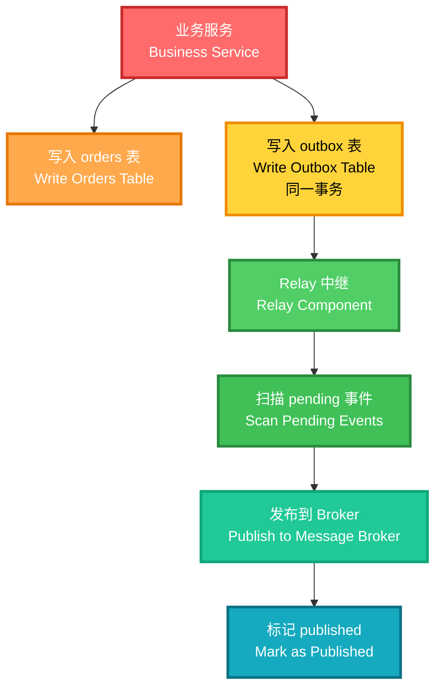

# 【Outbox模式详解】C/Java/JS/Go/Python/TS不同语言实现

# 简介

Outbox 模式（Outbox Pattern）是微服务架构中解决"业务数据写入成功但事件发布失败"导致数据与事件不一致问题的核心模式。其核心思想是：在同一个数据库事务中同时写入业务数据和 outbox 事件记录，然后由独立的 relay（中继）组件异步扫描 outbox 表并发布事件到消息中间件。

# 作用

1. **可靠事件发布**：业务数据和事件记录在同一事务中写入，保证原子性。
2. **最终一致性**：即使消息中间件暂时不可用，事件也不会丢失，relay 重试后最终发布。
3. **解耦写入与发布**：业务服务只负责写数据和 outbox，不直接依赖消息中间件。

# ��现步骤

1. 定义业务实体（Order）和事件实体（OutboxEvent），事件包含 status 字段（pending/published）。
2. 创建订单时同时写入 orders 和 outbox（同一"事务"）。
3. relay 组件扫描 outbox 中 status=pending 的事件，发布到 broker 后标记为 published。
4. relay 可安全重跑——已标记 published 的事件不会被重复发布。

# 架构图



# 涉及的设计模式

| 设计模式 | 在本模块中的体现 |
|---|---|
| **观察者模式（Observer Pattern）** | outbox 事件被 relay 扫描并发布到 broker，broker 再通知下游消费者。本示例用 MemoryBroker 简化。 |
| **命令模式（Command Pattern）** | OutboxEvent 将"需要发布的事件"封装为数据对象，relay 后续异步执行发布动作。 |

# 与实际开源项目对比

| 对比维度 | 本示例 | 实际工程 |
|---|---|---|
| **事务保证** | 内存列表模拟同步写入 | 数据库事务（同一个 BEGIN/COMMIT）保证原子性 |
| **relay 实现** | 同步方法调用 | 独立进程/线程，定时轮询或 CDC 触发 |
| **消息中间件** | MemoryBroker（内存数组） | Kafka / RabbitMQ / RocketMQ |
| **去重** | relay 检查 status 字段 | 消费端幂等 + 消息唯一 ID |
| **CDC 替代** | 无 | Debezium 直接监听 outbox 表变更日志，替代轮询 relay |
| **并发安全** | 非线程安全 | 数据库行锁 / SELECT FOR UPDATE |

> **整体思路一致**：业务写入 + outbox 同事务 → relay 异步发布 → 标记已发布，是所有实现的核心骨架。

# 代码

## Java 核心实现

```java
// 命令模式 —— OutboxEvent 封装事件数据，relay 异步发布
public static class OutboxService {
    public void createOrder(String orderId) { ... }     // 业务写入 + 追加 outbox 事件
    public void relayPending(MemoryBroker broker) { ... } // 扫描待发布事件并发布
}

public static class MemoryBroker {
    public void publish(String eventId) { ... }
}
```

## Go 核心实现

```go
type OutboxService struct { ... }
func (s *OutboxService) CreateOrder(orderID string) { ... }
func (s *OutboxService) RelayPending(broker *MemoryBroker) { ... }
```

## Python 核心实现

```python
class OutboxService:
    def create_order(self, order_id: str) -> None: ...
    def relay_pending(self, broker: MemoryBroker) -> None: ...
```

## JavaScript 核心实现

```javascript
export class OutboxService {
  createOrder(orderId) { ... }
  relayPending(broker) { ... }
}
```

## TypeScript 核心实现

```typescript
export class OutboxService {
  createOrder(orderId: string): void { ... }
  relayPending(broker: MemoryBroker): void { ... }
}
```

## C 核心实现

```c
void outbox_create_order(OutboxService *svc, const char *order_id);
void outbox_relay_pending(OutboxService *svc, MemoryBroker *broker);
```

# 测试验证

```bash
# Java
cd microservice-architecture/outbox-pattern/java
javac src/OutboxPattern.java test/Test.java && java test.Test

# Go
cd microservice-architecture/outbox-pattern/go
go test ./...

# Python
cd microservice-architecture/outbox-pattern/python
python3 -m unittest discover -s test -p "test_*.py"

# JavaScript
cd microservice-architecture/outbox-pattern/js
node test/test_outbox.js

# TypeScript
cd microservice-architecture/outbox-pattern/ts
tsc -p . && node dist/test/test_outbox.js

# C
cd microservice-architecture/outbox-pattern/c
cc test/test.c src/*.c -o test.out && ./test.out
```
