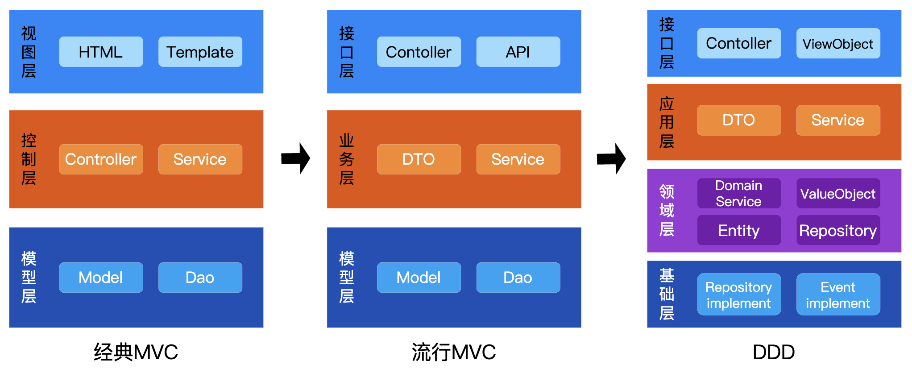

# MVC与MVP/MVVM/DDD架构对比，不同语言实现

## MVC 分层架构设计概述

模型-视图-控制器（Model-View-Controller，简称 MVC）是一种经典软件架构设计，通过分层解耦，使得系统结构清晰和易于维护，具有良好的可扩展性。MVC 适用于需要清晰分离用户界面、业务逻辑和数据管理的应用场景。随着MVC的发展，还衍生出了MVP、MVVM以及领域驱动设计（DDD）等架构，这些都是为了让庞大的系统变得简单，易于人们理解。



## MVC 结构图形示例
以Web后端开发为例
```text

                     用户请求  
                       |  
                       v
+---------+       +-----------+      +-----------+
|  View   |  <--- | Controller| ---> |   Model   | 
+---------+       +-----------+      +-----------+
    ^                                      v
    |            Model数据映射到View         |
    ****--------------------------------****
```

### MVC 各层职责
- **视图层（View）**：处理用户界面展示和用户输入事件
- **控制器层（Controller）**：接收用户请求，协调模型和视图
- **模型层（Model）**：封装业务逻辑和数据结构

### MVC 应用场景
- **Web 应用程序**（如电商网站、博客系统）
- **前后端分离项目**（RESTful API + 前端框架）
- **桌面 GUI 应用**（Java Swing、C# WinForms）
- **移动端应用**（Android Activity 结构）

---
MVC与MVP、MVVM以及DDD分层架构都是为了让代码结构更清晰，便于系统维护和扩展，以下对这几种架构进行比较。

## MVC 分层架构与 DDD 分层架构对比
DDD将MVC的“业务逻辑层”拆分为应用层​（流程编排）和领域层​（业务规则内聚），业务逻辑内聚于领域内，将业务能力划分为领域模块（如支付域、风控域），取代MVC的纯技术分层，以降低跨模块耦合。

MVC 以**界面与数据分离**为核心目标，强调快速开发；DDD 则以**领域模型驱动**为核心思想，专注于复杂业务系统的可持续架构设计。

### DDD 结构图形示例
```
+--------------------+
|     用户界面层       |
|   User Interface   |
|   含Controller/UI   |
+--------------------+
          |
          v
+--------------------+
|      应用服务层      |
|  Application Layer |
|   含Service/DTO    |
+--------------------+
          |
          v
+--------------------+
|       领域层        |
|    Domain Layer    |
|   含Model/Service  |
+--------------------+
          |
          v
+----------------------+
|       基础设施层       |
| Infrastructure Layer |
| 含Repository/Message |
+----------------------+
```

DDD各语言源码：https://github.com/microwind/design-patterns/tree/main/domain-driven-design

### MVC 分层架构与 DDD 分层架构特点
| 特性 | MVC | DDD |
| --- | --- | --- |
| **主要目标** | 分离 UI、逻辑和数据 | 解决复杂领域建模问题 |
| **核心分层** | 3 层（View、Controller、Model） | 4 层（UI、应用、领域、基础设施） |
| ​**业务逻辑** | 贫血模型（逻辑分散在 Service 层）| 充血模型（逻辑内聚于聚合根）|  
| ​**数据建模** | 数据库表驱动          | 业务规则驱动（聚合根封装）|  
| **适用场景** | Web 应用、前端交互密集型系统 | 企业级复杂业务系统（如金融交易、供应链管理） |
| **开发效率** | 快速原型开发，中小型项目友好 | 需前期领域建模，适合长期演进的大型项目 |
<!--
| **优点**     | 1. 结构简单直观<br>2. 框架生态成熟（如Spring MVC）<br>3. 学习成本低 | 1. 业务逻辑高内聚<br>2. 技术细节与领域解耦<br>3. 长期维护性强         |
| **缺点**     | 1. 业务逻辑易分散在Controller<br>2. 复杂场景扩展性差                | 1. 领域建模门槛高<br>2. 初期开发成本高<br>3. 简单项目易过度设计       |
-->

## MVC与MVP、MVVM的分层架构对比
MVC与MVP总体上一致，只是在View与Model是否完全解耦上有差别。MVP通过接口隔离实现完全解耦，而MVC允许视图直接访问模型。MVC与MVVM的本质差异在于数据同步机制：MVVM通过双向绑定实现自动数据同步，MVC则依赖手动进行状态管理。

### MVP（Model-View-Presenter）结构图形
```
User Input  
    | 
    v        由主持人代理View和Model交互
+---------+      +-----------+       +-----------+
|  View   | <--> | Presenter | <---> |   Model   |
+---------+      +-----------+       +-----------+

1. MVP 主要用于前端开发，尤其是界面渲染，当一个界面需要针对多个视图数据进行渲染时，采用MVP比MVC更合适。
2. MVP 下 View 与 Model 隔离，View 中没有对应 Model 概念，数据由 Presenter 代为传递。
```
MVP各语言源码：https://github.com/microwind/design-patterns/tree/main/mvx/mvp

### MVVM（Model-View-ViewModel）
```
User Input  
    |
    v         将View与Model双向数据绑定
+---------+      +-----------+      +-----------+
|  View   | ---> | ViewModel | <--> |   Model    |
+---------+      +-----------+      +-----------+
                   ^        |
                   |        v
          Data Binding(由Agent监听数据变化)

1. MVVM 从 View 触发，监听事件执行数据更新。
2. 通过代理监听数据变化，自动更新视图。
```
MVVM各语言源码：https://github.com/microwind/design-patterns/tree/main/mvx/mvvm

### MVC与MVP、MVVM的分层架构特点
| 模式  | 控制流程描述                                               | View与Model耦合度                           | 组件角色                                   |
|-------|-----------------------------------------------------------|--------------------------------------------|------------------------------------------|
| MVC   | **请求驱动模式**：<br>Controller 接收 View 请求 → 操作 Model → Model 直接通知 View 更新；View 主动监听 Model 事件。 | 存在一定耦合，View 直接绑定 Model。           | Controller 处理逻辑；View 展示数据；Model 管理数据。 |
| MVP   | **中介者模式**：View 与 Presenter 双向交互：用户操作触发事件 → Presenter 调用 Model 更新 → Presenter 通知 View 更新。 | 完全解耦，View 仅与 Presenter 交互，Model 不直接通知 View。 | Presenter 充当中介者；View 仅负责展示；Model 管理数据。  |
| MVVM  | **响应式编程模式**：利用数据绑定：View 与 ViewModel 双向绑定，ViewModel 操作 Model 后自动反映在 View 上。 | 完全解耦，借助数据绑定技术实现 View 与 Model 之间的间接通信。 | ViewModel 充当桥梁；View 为声明式UI层；Model 纯数据结构。   |

<!--
## MVC与MVP、MVVM的优缺点
| 模式  | 优点                                                         | 缺点                                                         | 常见问题                                             |
|-------|--------------------------------------------------------------|--------------------------------------------------------------|------------------------------------------------------|
| MVC   | 架构简单，关注点分离，有助于维护和扩展；适合传统Web应用。            | View与Model直接绑定，耦合度较高；复杂场景下Controller可能变得臃肿。         | 项目规模增大时容易出现“胖Controller”现象。                   |
| MVP   | 通过Presenter实现View与Model解耦，便于单元测试，适用于复杂UI逻辑。   | 需要编写较多样板代码，增加系统复杂度；对于简单场景显得冗余。               | 在简单场景中可能过于复杂，增加开发和维护成本。                   |
| MVVM  | 利用数据绑定实现自动同步，View与Model完全解耦，提高开发效率。         | 数据绑定调试较为困难，复杂绑定可能带来性能问题，特别在大型应用中。           | 数据绑定机制复杂，错误排查不易，性能问题需谨慎处理。                |
-->

MVC是分层架构思想的先驱，后来MVP、MVVM、DDD等才流行开来，可以对比下几种分层代码，理解其中的变迁：[https://github.com/microwind/design-patterns/tree/main/mvx](https://github.com/microwind/design-patterns/tree/main/mvx)

## MVC 的例子（C、Java、JavaScript、Go、Python等）
MVC最早从Smalltalk语言发展而来，后来经过Java、C++、.NET等将其发扬光大，除了传统的面向对象语言可以实现MVC模式，其他各种高级语言都可以实现MVC。需要注意的是MVC并非一种技术，而是一种理念。只要秉持这种分层思想，那么任何语言都可以实现MVC思想。

### C 语言实现 MVC
```c
/* 视图层（View）*/
// view.c
#include <stdio.h>
#include "controller.h"

void display_order(Order order) {
    printf("Order ID: %s\nCustomer: %s\nAmount: %.2f\n",
           order.id, order.customer_name, order.amount);
}

/* 控制器层（Controller）*/
// controller.c
#include "controller.h"
#include "repository.h"

void create_order(Order order) {
    save_order(order);
}

Order get_order(char* id) {
    return find_order(id);
}

/* 模型层（Model）*/
// order.h
typedef struct {
    char id[10];
    char customer_name[50];
    float amount;
} Order;

/* 数据访问层（Repository）*/
// repository.c
#include <string.h>
#include "repository.h"

static Order orders[100];
static int count = 0;

void save_order(Order order) {
    orders[count++] = order;
}

Order find_order(char* id) {
    for (int i = 0; i < count; i++) {
        if (strcmp(orders[i].id, id) == 0) {
            return orders[i];
        }
    }
    Order empty = { "", "", 0 };
    return empty;
}
```

### Java 语言实现 MVC
```java
/* 视图层（View）*/
// Thymeleaf 模板 (orders.html)
<!DOCTYPE html>
<html xmlns:th="http://www.thymeleaf.org">
<body>
    <h1>订单列表</h1>
    <ul>
        <li th:each="order : ${orders}">
            <span th:text="${order.id}"></span> - 
            <span th:text="${order.customerName}"></span>
        </li>
    </ul>
</body>
</html>

/* 控制器层（Controller）*/
// OrderController.java
@Controller
@RequestMapping("/orders")
public class OrderController {
    private final OrderService service;

    @Autowired
    public OrderController(OrderService service) {
        this.service = service;
    }

    @GetMapping
    public String listOrders(Model model) {
        model.addAttribute("orders", service.getAllOrders());
        return "orders";
    }
}

/* 模型层（Model）*/
// Order.java
@Entity
public class Order {
    @Id
    @GeneratedValue(strategy = GenerationType.IDENTITY)
    private Long id;
    private String customerName;
    private BigDecimal amount;

    // Getters & Setters
}

/* 数据访问层（Repository）*/
// OrderRepository.java
public interface OrderRepository extends JpaRepository<Order, Long> {
    List<Order> findByCustomerName(String name);
}
```

### Go 语言实现 MVC
```go
/* 视图层（View）*/
// view.go
func RenderOrder(w http.ResponseWriter, order Order) {
    fmt.Fprintf(w, "ID: %s\nCustomer: %s\nAmount: %.2f",
        order.ID, order.CustomerName, order.Amount)
}

/* 控制器层（Controller）*/
// controller.go
func OrderHandler(w http.ResponseWriter, r *http.Request) {
    id := r.URL.Query().Get("id")
    order := repository.GetOrder(id)
    RenderOrder(w, order)
}

/* 模型层（Model）*/
// order.go
type Order struct {
    ID           string
    CustomerName string
    Amount       float64
}

/* 数据访问层（Repository）*/
// repository.go
var orders = make(map[string]Order)

func GetOrder(id string) Order {
    return orders[id]
}

func SaveOrder(order Order) {
    orders[order.ID] = order
}
```


### Python 语言实现 MVC（Flask）
```py
# 视图层（View）
# templates/orders.html
<html>
<body>
    <h1>Orders</h1>
    <ul>
        
            <li>{{ order.id }} - {{ order.customer_name }}</li>
        
    </ul>
</body>
</html>

# 控制器层（Controller）
# app.py
from flask import Flask, render_template
from service import OrderService

app = Flask(__name__)
service = OrderService()

@app.route('/orders')
def list_orders():
    orders = service.get_all_orders()
    return render_template('orders.html', orders=orders)

# 模型层（Model）
# order.py
class Order:
    def __init__(self, id, customer_name, amount):
        self.id = id
        self.customer_name = customer_name
        self.amount = amount

# 数据访问层（Repository）
# repository.py
class OrderRepository:
    def __init__(self):
        self.orders = {}

    def save(self, order):
        self.orders[order.id] = order

    def get_all(self):
        return list(self.orders.values())
```

### JavaScript 实现 MVC（Express.js）
```javascript
/* 视图层（View）*/
// views/orders.ejs
<!DOCTYPE html>
<html>
<body>
    <h1>Orders</h1>
    <ul>
        <% orders.forEach(order => { %>
            <li><%= order.id %> - <%= order.customerName %></li>
        <% }) %>
    </ul>
</body>
</html>

/* 控制器层（Controller）*/
// routes/orderRoutes.js
const express = require('express');
const router = express.Router();
const service = require('../services/orderService');

router.get('/orders', async (req, res) => {
    const orders = await service.getAllOrders();
    res.render('orders', { orders });
});

/* 模型层（Model）*/
// models/Order.js
class Order {
    constructor(id, customerName, amount) {
        this.id = id;
        this.customerName = customerName;
        this.amount = amount;
    }
}

/* 数据访问层（Repository）*/
// repositories/orderRepository.js
class OrderRepository {
    constructor() {
        this.db = new Map();
    }

    save(order) {
        this.db.set(order.id, order);
    }

    getAll() {
        return Array.from(this.db.values());
    }
}
```

### JavaScript 前端版 MVC
功能：点击按钮增减数值并更新视图。
1. 模型层：CounterModel 类封装数据和操作逻辑，包含数值和标题的修改方法。
2. 视图层：CounterView 类负责渲染界面，绑定模型数据，根据模型状态更新视图。
3. 控制层：CounterController 类作为中间层，绑定视图和模型，监听事件，实现数据和视图的更新。
```javascript
// Model 类：封装数据逻辑
class CounterModel {
    constructor() {
        // 初始化数据
        this.title = '点击更换标题';
        this.num = 0;
    }

    // 标题操作：增加标题
    changeTitle() {
        this.title = '点击更换标题' + Math.floor(Math.random() * 100);
    }

    // 数据操作方法：增加数值
    increment() {
        this.num++;
    }

    // 数据操作方法：减少数值
    decrement() {
        this.num--;
    }
}

// View 类：处理界面渲染
class CounterView {
    template(data = {}) {
        return `
        <div class="counter">
            <h3 class="title">${data.title}</h3>
            <button class="dec-btn">-</button>
            <span class="num">${data.num}</span>
            <button class="inc-btn">+</button>
        </div>
        `;
    }

    constructor(model, container) {
        this.model = model; // 绑定模型，这是跟MVP最大区别
        this.$container = container;
        this.init();
    }

    // 初始化DOM
    init() {
        this.$container.innerHTML = this.template(this.model);
        this.$titleEl = this.$container.querySelector('.title');
        this.$numEl = this.$container.querySelector('.num');
        this.$incBtn = this.$container.querySelector('.inc-btn');
        this.$decBtn = this.$container.querySelector('.dec-btn');
    }

    // 更新视图方法
    render() {
        // 可以根据数据是否有变化来确定要更新哪个字段
        const data = this.model
        this.$titleEl.textContent = data.title;
        this.$numEl.textContent = data.num;
    }
}

// Controller 类：处理用户输入
class CounterController {
    constructor(model, view) {
        this.model = model;
        this.view = view;
        this.bindEvents();
    }

    // 绑定DOM事件
    bindEvents() {
        this.view.$titleEl.addEventListener('click', () => this.changeTitleHandle());
        this.view.$incBtn.addEventListener('click', () => this.incrementHandle());
        this.view.$decBtn.addEventListener('click', () => this.decrementHandle());
    }

    changeTitleHandle() {
        this.model.changeTitle();
        this.view.render(); // 直接更新视图，不必传递model
    }
 
    // 事件处理：增加操作
    incrementHandle() {
        this.model.increment();
        this.view.render(); // 直接更新视图，不必传递model
    }

    // 事件处理：减少操作
    decrementHandle() {
        this.model.decrement();
        this.view.render(); // 直接更新视图，不必传递model
    }
}

// 初始化应用
const appContainer = document.body;
const model = new CounterModel();
const view = new CounterView(model, appContainer);
const controller = new CounterController(model, view);
```

## 总结
- **MVC** 适用于快速开发 Web 应用，强调职责分离。
- **MVP** 适用于对视图和业务逻辑分离要求较高的场景，强调展示层对视图和模型的协调。
- **MVVM** ​适用于复杂视图与模型交互的应用，利用数据绑定机制自动同步视图和模型的状态。
- **DDD** 适用于复杂业务系统，强调领域建模。
- **核心优势**：代码可维护性强，团队协作效率高。
- **选型建议**：中小型项目优先考虑 MVC，复杂业务系统可结合 DDD。

## 最后
- **要用 MVC 吗？** 90% 的 Web 项目都适合 MVC 架构
- **如何判断适用性？** 如果需求变化主要集中在 UI 和流程的中小型项目，MVC 是最佳选择
- **扩展建议**：大型项目可在 MVC 基础上增加 Service 层和 DTO 对象，或者直接采用DDD架构
- **更多设计与架构源码：** https://github.com/microwind/design-patterns