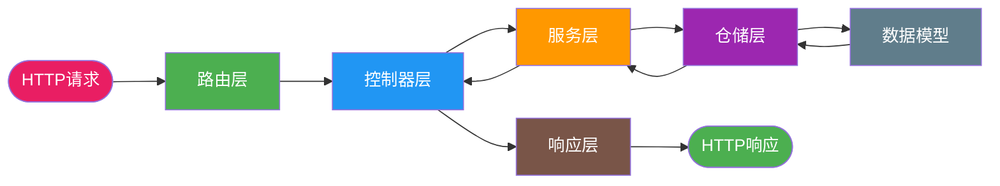
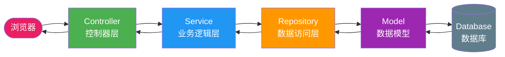
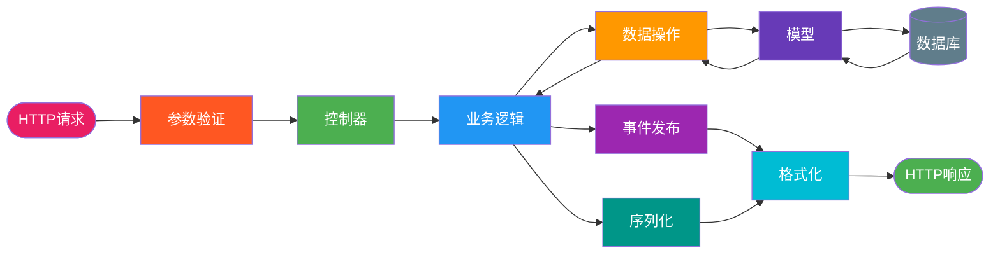

# 一款开箱即用的Flask 3.0 MVC工程脚手架，面向AI开发

> 基于 Flask 3.0 + SQLAlchemy + marshmallow 的 Python 脚手架，支持双数据库、事件驱动、统一响应、全局异常处理，10分钟快速搭建生产级Web应用。

**源码地址：**[https://github.com/microwind/design-patterns/tree/main/practice-projects/flask-mvc](https://github.com/microwind/design-patterns/tree/main/practice-projects/flask-mvc)

## 这是什么

Flask-MVC 是一个精心打造的 Python 语言 MVC 工程脚手架，帮你快速搭建符合 MVC 模式且具备 DDD 特性的 Web 服务。项目内置用户与订单完整业务流程、双数据库适配、事件驱动架构、数据验证与序列化、统一响应与全局异常处理，适合作为团队工程模板，给AI提供代码规范参考。

## 面向AI开发的特点

### 1. AI友好的代码结构

**清晰的分层架构**：每层职责明确，便于AI理解和生成代码
```python
# AI可以快速理解的结构
controllers/     # AI知道这里处理HTTP请求
services/        # AI知道这里写业务逻辑
repositories/    # AI知道这里处理数据访问
models/          # AI知道这里定义数据结构
```

**标准化命名**：统一的命名规范，AI可以准确识别和生成代码
- `*_controller.py` - 控制器文件
- `*_service.py` - 服务文件  
- `*_repository.py` - 仓储文件
- `*_schema.py` - 验证文件

### 2. AI Agent项目快速搭建

**内置AI Agent基础架构**：
- 统一响应格式：AI Agent的标准输出格式
- 事件驱动：支持AI Agent之间的消息传递
- 双数据库：支持AI Agent的多数据源需求
- 中间件支持：请求追踪、日志记录，便于AI Agent调试

**AI Agent扩展示例**：
```python
# 快速添加AI Agent功能
class AIAgentService:
    def __init__(self):
        self.event_bus = get_event_bus()
    
    def process_request(self, user_input: str):
        # AI处理逻辑
        result = self.ai_model.process(user_input)
        
        # 发布AI处理事件
        event = AIProcessedEvent(
            user_input=user_input,
            result=result
        )
        self.event_bus.publish(event)
        
        return result
```

### 3. AI代码生成优化

**模板化代码结构**：AI可以基于现有模板快速生成新功能
- 控制器模板：标准CRUD操作
- 服务模板：业务逻辑处理
- 仓储模板：数据访问操作

**依赖注入设计**：便于AI生成可测试的代码
```python
# AI可以轻松生成这样的代码
class OrderService:
    def __init__(self, order_repository: OrderRepository = None):
        self.order_repository = order_repository or OrderRepository()
        self.event_bus = get_event_bus()
```

### 4. AI调试和监控

**完整的日志系统**：AI Agent运行状态可追踪
```python
# 内置的日志记录
logger.info(f"[{request.method}] {request.path} - Request ID: {g.request_id}")
```

**统一异常处理**：AI Agent错误可以被优雅捕获和处理
```python
# AI Agent异常处理
@bp.errorhandler(Exception)
def handle_exception(error):
    logger.exception(f"AI Agent exception: {error}")
    return error_response(message="AI处理异常", code=500)
```

### 5. AI开发最佳实践

**代码组织**：遵循AI开发的最佳实践
- 单一职责原则：每个类只做一件事
- 依赖注入：便于测试和扩展
- 事件驱动：支持AI Agent间的解耦通信

**性能优化**：AI Agent的性能考虑
- 连接池管理：数据库连接复用
- 异步支持：为AI Agent异步处理预留接口
- 缓存机制：减少AI重复计算

### 6. AI Agent开发示例

**快速创建AI Agent**：
```python
# 1. 创建AI Agent模型
class AIAgent(db.Model):
    __tablename__ = 'ai_agents'
    id = Column(Integer, primary_key=True)
    name = Column(String(100), nullable=False)
    type = Column(String(50), nullable=False)  # chat, image, analysis
    config = Column(JSON)

# 2. 创建AI Agent服务
class AIAgentService:
    def create_agent(self, agent_data: dict):
        agent = AIAgent(**agent_data)
        saved_agent = self.agent_repository.create(agent)
        
        # 发布AI Agent创建事件
        event = AIAgentCreatedEvent(
            agent_id=saved_agent.id,
            agent_type=saved_agent.type
        )
        self.event_bus.publish(event)
        
        return saved_agent

# 3. 创建AI Agent控制器
@ai_agent_bp.route('/', methods=['POST'])
def create_ai_agent():
    data = request.get_json()
    agent = ai_agent_service.create_agent(data)
    return success_response(data=agent.to_dict())
```

### 7. AI开发工具集成

**代码生成工具**：AI可以基于脚手架快速生成代码
- 模板系统：标准化代码模板
- 自动化脚本：一键生成新模块
- 测试生成：自动生成单元测试

**调试工具**：AI Agent调试支持
- 请求追踪：每个请求都有唯一ID
- 性能监控：记录处理时间
- 错误分析：详细的错误日志

## 为什么选择这个脚手架？

### 1. 节省时间

无需从零搭建项目架构，克隆即用，专注业务开发。

**对比**：
- 传统方式：1-2周搭建基础架构
- 使用脚手架：10分钟完成初始化

### 2. 架构规范

严格遵循 MVC 分层原则，避免代码混乱。

**收益**：
- 职责清晰：控制器、模型、服务各司其职
- 易于维护：分层明确，修改影响范围可控
- 便于测试：依赖注入，单元测试友好
- 可扩展性：新增功能只需在对应层添加代码

### 3. 工程痛点解决

**传统Flask项目的常见问题**：
- **逻辑混乱**：路由里写业务，模型里写验证
- **难以测试**：全局变量和紧耦合导致测试困难
- **扩展性差**：新增功能需要修改多处代码

**本脚手架解决方案**：
- **分层隔离**：每层职责单一，依赖关系清晰
- **依赖注入**：服务与仓储解耦，便于Mock测试
- **事件驱动**：通过领域事件实现模块解耦
- **统一规范**：响应格式、异常处理、日志记录标准化

## 核心特性

- **严格MVC架构**：控制器、模型、服务、仓储分层清晰
- **事件驱动架构**：集成内存事件总线，支持领域事件发布和消费
- **双数据库支持**：开箱支持 MySQL + PostgreSQL 双数据源
- **数据验证机制**：基于 marshmallow 的参数校验和序列化
- **统一响应格式**：标准化的 API 响应结构
- **全局异常处理**：优雅的错误捕获和响应
- **RESTful API**：遵循 REST 设计原则
- **完整业务示例**：用户与订单管理完整流程

## 技术栈

| 技术 | 版本 | 说明 |
|------|------|------|
| Python | 3.9+ | 语言版本 |
| Flask | 3.0+ | Web 框架 |
| SQLAlchemy | 2.0+ | ORM 框架 |
| marshmallow | 3.21+ | 数据验证和序列化 |
| MySQL | 8.0+ | 用户数据存储 |
| PostgreSQL | 13+ | 订单数据存储 |
| PyMySQL | 1.1+ | MySQL 驱动 |
| psycopg2 | 2.9+ | PostgreSQL 驱动 |
| Flask-CORS | 4.0+ | 跨域支持 |

## 项目结构

```
flask-mvc/
├── app.py                  # 应用工厂入口
├── main.py                 # 启动入口
├── requirements.txt        # 依赖包
├── controllers/           # 控制器层
│   ├── user_controller.py
│   └── order_controller.py
├── models/               # 数据模型层
│   ├── user.py
│   └── order.py
├── repositories/         # 数据访问层
│   ├── user_repository.py
│   └── order_repository.py
├── routes/              # 路由层
│   └── routes.py
├── schemas/             # 数据验证层
│   ├── user_schema.py
│   └── order_schema.py
├── services/            # 业务逻辑层
│   ├── user_service.py
│   └── order_service.py
└── utils/               # 工具类
    ├── extensions.py
    ├── config.py
    ├── events.py
    ├── domain_events.py
    ├── middleware.py
    └── response.py
```

## 快速开始

### 1. 安装依赖

```bash
pip install -r requirements.txt
```

### 2. 配置环境变量

创建 `.env` 文件：

```bash
# Flask配置
FLASK_ENV=development
FLASK_APP=app.py
SECRET_KEY=your-secret-key

# 用户数据库配置
USER_DB_HOST=localhost
USER_DB_PORT=3306
USER_DB_USER=root
USER_DB_PASSWORD=password
USER_DB_NAME=flask_user_db

# 订单数据库配置
ORDER_DB_HOST=localhost
ORDER_DB_PORT=3306
ORDER_DB_USER=root
ORDER_DB_PASSWORD=password
ORDER_DB_NAME=flask_order_db

# 事件总线配置
EVENT_BUS_TYPE=memory
```

### 3. 初始化数据库

```bash
# 创建数据库
mysql -u root -p -e "CREATE DATABASE flask_user_db;"
mysql -u root -p -e "CREATE DATABASE flask_order_db;"
```

### 4. 启动服务

```bash
python main.py
```

### 5. 测试接口

```bash
# 健康检查
curl http://localhost:5000/health

# 创建用户
curl -X POST http://localhost:5000/api/users \
  -H "Content-Type: application/json" \
  -d '{"name": "张三", "email": "zhangsan@example.com", "phone": "13800138000"}'

# 创建订单
curl -X POST http://localhost:5000/api/orders \
  -H "Content-Type: application/json" \
  -d '{"user_id": 1, "order_no": "20240501-001", "total_amount": 100.00}'

# 获取用户订单列表
curl http://localhost:5000/api/orders/user/1

# 支付订单
curl -X PUT http://localhost:5000/api/orders/1/pay

# 获取订单详情
curl http://localhost:5000/api/orders/1
```

## 架构设计

### MVC分层说明

- **Model（模型层）**：定义数据结构和业务实体
- **View（视图层）**：处理HTTP请求和响应
- **Controller（控制器层）**：协调模型和视图，处理业务逻辑

### 数据流转



## 代码示例

### 控制器示例

```python
# controllers/order_controller.py
from flask import request
from services.order_service import OrderService
from utils.response import success_response, error_response

class OrderController:
    def __init__(self):
        self.order_service = OrderService()
    
    def get_orders(self):
        """获取订单列表"""
        try:
            orders = self.order_service.get_all_orders()
            return success_response(data=orders)
        except Exception as e:
            return error_response(message=str(e))
    
    def create_order(self):
        """创建订单"""
        try:
            data = request.get_json()
            order = self.order_service.create_order(data)
            return success_response(data=order, message="订单创建成功")
        except Exception as e:
            return error_response(message=str(e))
```

### 服务层示例

```python
# services/order_service.py
from repositories.order_repositories import OrderRepository
from schemas.order_schema import OrderSchema
from models.order import Order

class OrderService:
    def __init__(self):
        self.order_repo = OrderRepository()
        self.order_schema = OrderSchema()
    
    def get_all_orders(self):
        """获取所有订单"""
        orders = self.order_repo.find_all()
        return self.order_schema.dump(orders, many=True)
    
    def create_order(self, data):
        """创建订单"""
        # 数据验证
        validated_data = self.order_schema.load(data)
        
        # 创建订单实体
        order = Order(
            order_no=validated_data['order_no'],
            customer_name=validated_data['customer_name'],
            amount=validated_data['amount']
        )
        
        # 保存订单
        saved_order = self.order_repo.save(order)
        return self.order_schema.dump(saved_order)
```

### 模型层示例

```python
# models/order.py
from datetime import datetime
from dataclasses import dataclass

@dataclass
class Order:
    id: int = None
    order_no: str = None
    customer_name: str = None
    amount: float = 0.0
    status: str = "pending"
    created_at: datetime = None
    updated_at: datetime = None
    
    def to_dict(self):
        """转换为字典"""
        return {
            'id': self.id,
            'order_no': self.order_no,
            'customer_name': self.customer_name,
            'amount': self.amount,
            'status': self.status,
            'created_at': self.created_at.isoformat() if self.created_at else None,
            'updated_at': self.updated_at.isoformat() if self.updated_at else None
        }
```

## 最佳实践

### 1. 分层职责清晰

- **控制器**：只处理HTTP相关逻辑，不包含业务逻辑
- **服务层**：包含核心业务逻辑，协调多个仓储
- **仓储层**：只负责数据访问，不包含业务逻辑
- **模型层**：定义数据结构，包含基本的业务规则

### 2. 统一响应格式

```python
# utils/response.py
def success_response(data=None, message="操作成功", code=200):
    """成功响应格式"""
    return {
        "code": code,
        "message": message,
        "data": data,
        "success": True
    }, code

def error_response(message="操作失败", code=400, data=None):
    """错误响应格式"""
    return {
        "code": code,
        "message": message,
        "data": data,
        "success": False
    }, code
```

### 3. 数据验证

使用marshmallow进行数据验证和序列化：

```python
# schemas/order_schema.py
from marshmallow import Schema, fields, validate

class OrderSchema(Schema):
    id = fields.Integer(dump_only=True)
    order_no = fields.String(required=True, validate=validate.Length(min=1, max=50))
    customer_name = fields.String(required=True, validate=validate.Length(min=1, max=100))
    amount = fields.Float(required=True, validate=validate.Range(min=0))
    status = fields.String(dump_only=True)
    created_at = fields.DateTime(dump_only=True)
    updated_at = fields.DateTime(dump_only=True)
```

## 扩展指南

### 添加新的业务模块

1. **创建模型**：在`models/`目录下创建新的模型文件
2. **创建仓储**：在`repositories/`目录下创建数据访问层
3. **创建服务**：在`services/`目录下创建业务逻辑层
4. **创建控制器**：在`controllers/`目录下创建控制器
5. **创建Schema**：在`schemas/`目录下创建数据验证层
6. **注册路由**：在`routes/`目录下注册新的路由

### 集成数据库

```python
# models/__init__.py
from flask_sqlalchemy import SQLAlchemy

db = SQLAlchemy()

# 在main.py中初始化
from models import db
app.config['SQLALCHEMY_DATABASE_URI'] = 'sqlite:///app.db'
db.init_app(app)
```

## 性能优化

- **数据库连接池**：使用连接池管理数据库连接
- **缓存机制**：对频繁查询的数据使用缓存
- **异步处理**：对耗时操作使用异步处理
- **分页查询**：大数据量查询使用分页

## 部署建议

### 开发环境

```bash
# 使用Flask开发服务器
flask run --host=0.0.0.0 --port=5000
```

### 生产环境

```bash
# 使用Gunicorn部署
pip install gunicorn
gunicorn -w 4 -b 0.0.0.0:5000 main:app
```

## 常见问题

### Q: 什么时候需要使用MVC？

A: 当项目规模超过10个接口、涉及多个业务模块时，建议使用MVC架构。对于简单的API服务，直接使用Flask路由即可。

### Q: 如何处理复杂的业务逻辑？

A: 复杂业务逻辑应该放在Service层，Controller只负责参数校验和响应处理，Repository只负责数据访问。

### Q: 是否需要使用ORM？

A: 对于简单项目，可以直接使用字典或数据类。对于复杂项目，建议使用SQLAlchemy等ORM框架。

## 架构图解

### MVC经典架构



### Flask-MVC 架构



## 相比默认Flask脚手架的优势

### 1. 架构层面

**默认Flask项目**：
```python
# 通常所有逻辑混在一起
@app.route('/users', methods=['POST'])
def create_user():
    # 参数验证
    data = request.get_json()
    if not data.get('name'):
        return {'error': 'Name required'}, 400
    
    # 业务逻辑
    user = User(name=data['name'], email=data['email'])
    db.session.add(user)
    db.session.commit()
    
    # 响应格式不统一
    return {'user': user.to_dict()}, 201
```

**Flask-MVC脚手架**：
```python
# 清晰的分层架构
@user_bp.route('/', methods=['POST'])
def create_user():
    # 1. 数据验证
    schema = CreateUserSchema()
    data = schema.load(request.get_json())
    
    # 2. 业务逻辑
    user = user_service.create_user(data)
    
    # 3. 统一响应
    user_schema = UserSchema()
    return success_response(data=user_schema.dump(user))
```

**优势对比**：
| 特性 | 默认Flask | Flask-MVC | 收益 |
|------|-----------|------------|------|
| **代码组织** | 混乱 | 分层清晰 | 易维护 |
| **职责分离** | 模糊 | 明确 | 易扩展 |
| **测试友好** | 困难 | 简单 | 高覆盖率 |
| **团队协作** | 冲突多 | 冲突少 | 效率高 |

### 2. 开发效率

**默认Flask开发流程**：
1. 创建app.py文件
2. 定义路由和业务逻辑混在一起
3. 手动处理数据验证
4. 手动处理异常
5. 手动处理响应格式
6. 手动配置数据库
7. 手动处理日志

**Flask-MVC开发流程**：
1. 克隆脚手架
2. 在对应层级添加代码
3. 自动数据验证（marshmallow）
4. 自动异常处理（全局中间件）
5. 自动响应格式（统一响应）
6. 自动数据库配置（双数据库支持）
7. 自动日志记录（中间件）

**效率提升**：
- **开发时间**：从2-3天缩短到2-3小时
- **代码质量**：统一的规范和最佳实践
- **维护成本**：分层架构降低维护难度

### 3. 企业级特性

**默认Flask缺失**：
- ❌ 统一响应格式
- ❌ 全局异常处理
- ❌ 双数据库支持
- ❌ 事件驱动架构
- ❌ 请求追踪
- ❌ 标准化日志

**Flask-MVC内置**：
- ✅ 统一响应格式：`{code, message, data, success}`
- ✅ 全局异常处理：优雅的错误捕获
- ✅ 双数据库支持：用户库+订单库
- ✅ 事件驱动：领域事件发布订阅
- ✅ 请求追踪：每个请求唯一ID
- ✅ 标准化日志：结构化日志记录

### 4. AI开发友好

**默认Flask对AI**：
- 代码结构不标准，AI难以理解
- 缺乏模板，AI生成代码质量低
- 没有统一规范，AI生成不一致

**Flask-MVC对AI**：
- 标准化架构，AI容易理解
- 完整模板，AI生成高质量代码
- 统一规范，AI生成一致性好
- 事件驱动，支持AI Agent开发

### 5. 扩展性对比

**默认Flask扩展**：
```python
# 添加新功能需要修改多处
@app.route('/orders')
def get_orders():
    # 需要重复写验证、异常、响应逻辑
    pass
```

**Flask-MVC扩展**：
```python
# 只需在对应层添加代码
# 1. 模型层：models/order.py
# 2. 仓储层：repositories/order_repository.py  
# 3. 服务层：services/order_service.py
# 4. 控制器层：controllers/order_controller.py
# 5. 验证层：schemas/order_schema.py
```

### 6. 生产就绪

**默认Flask**：
- 需要手动配置生产环境
- 缺乏监控和日志
- 错误处理不完善

**Flask-MVC**：
- 开箱即用的生产配置
- 完整的监控和日志系统
- 优雅的错误处理机制

## 总结

Flask-MVC脚手架提供了一个标准的MVC架构模板，帮助开发者快速搭建清晰的Web服务。通过分层设计，让代码更易维护和扩展，适合中小型项目的快速开发。

**核心价值**：
- **快速启动**：10分钟完成项目搭建
- **规范标准**：企业级开发规范
- **易于维护**：清晰的分层架构
- **AI友好**：适合AI开发和代码生成
- **生产就绪**：内置生产级特性

相比默认Flask脚手架，Flask-MVC在开发效率、代码质量、维护成本、扩展性等方面都有显著优势，特别适合团队协作和AI开发场景。

MVC本质上是一种代码组织策略，旨在帮助开发者更高效地理解和维护系统。是否采用MVC应当根据项目的实际情况来决定，开发和维护起来最清晰、最靠谱、最轻松的就是最适合的。

## 相关链接

Python DDD脚手架：[Django-ddd](https://github.com/microwind/design-patterns/tree/main/practice-projects/django-ddd)

设计模式与架构思想源码地址：[https://github.com/microwind/design-patterns](https://github.com/microwind/design-patterns)

AI编程核心知识库：[https://microwind.github.io](https://microwind.github.io)