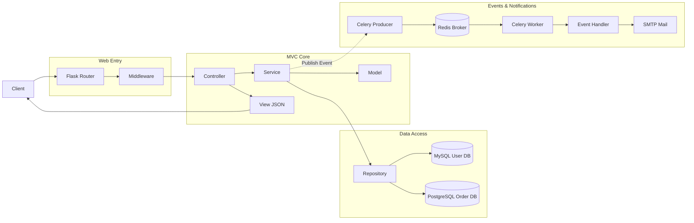

# Flask-MVC Scaffold

> A production-ready MVC (Model-View-Controller) Flask scaffold with dual database support, unified response, middleware, and event-driven architecture examples.

## What is this?

Flask-MVC is a Flask-based MVC engineering scaffold that helps you quickly build web services with clear layering. It includes user and order examples, event-driven architecture, dual database support, unified response format, and middleware, suitable as a team engineering template or for code initialization in most scenarios.

This project is aligned with the `practice-projects/gin-mvc` functionality. Unlike the DDD architecture, the MVC architecture is more concise and clear, allowing you to compare the differences between DDD and MVC project structures and choose the appropriate architecture based on business needs.

## Why use MVC?

Many developers mix routing, business logic, and data access directly in Flask projects. While small projects can run fast, they become difficult to control as modules increase. The value of MVC lies in separating responsibilities: Controller handles HTTP interactions, Service carries business rules, Repository focuses on data access, and Model maintains core state and behavior.

In summary, whether to adopt MVC is independent of language, but depends on business complexity and team collaboration costs. For small to medium and large business systems, MVC achieves a good balance between "sufficient clarity" and "implementation cost".

**Source Code:** [https://github.com/microwind/design-patterns/tree/main/practice-projects/flask-mvc](https://github.com/microwind/design-patterns/tree/main/practice-projects/flask-mvc)

**Project Directory:** `flask-mvc/`

## Core Features

- **Clear MVC Layering:** Controller, Service, Repository, Model
- **Flask 3.x:** Latest Flask framework with modern Python patterns
- **Event-Driven:** Business events + Celery async task support
- **Dual Database Support:** User database + Order database (MySQL + PostgreSQL by default)
- **Unified Response Format:** Response encapsulation with business domain error codes
- **Global Middleware:** Request ID, logging, error recovery, CORS
- **Optional Email Notification:** Order creation event-driven SMTP email sending

## Tech Stack

| Technology | Version | Description |
|------------|---------|-------------|
| Python | 3.9+ | Language version |
| Flask | 3.0+ | HTTP framework |
| SQLAlchemy | 2.0+ | ORM framework |
| MySQL | 8.0+ | User database default |
| PostgreSQL | 14+ | Order database default |
| Celery | 5.3+ | Async task queue |
| Redis | 7.0+ | Celery broker |
| PyYAML | - | Configuration file format |

## Project Structure

### Structure Diagram



### Directory Structure

```
flask-mvc/
├── app/
│   ├── __init__.py                          # Application factory
│   ├── config/
│   │   └── config.py                        # Configuration loader
│   ├── controllers/                         # Controller layer (HTTP handling)
│   │   ├── user_controller.py
│   │   └── order_controller.py
│   ├── services/                            # Service layer (business orchestration)
│   │   ├── user_service.py
│   │   └── order_service.py
│   ├── repository/                          # Repository layer (data access)
│   │   ├── user_repository.py
│   │   └── order_repository.py
│   ├── models/                              # Model layer (core models & events)
│   │   ├── __init__.py
│   │   ├── user.py
│   │   ├── order.py
│   │   └── event.py
│   └── middleware/                          # Flask middleware
│       ├── __init__.py
│       ├── request_id.py
│       ├── logging.py
│       ├── cors.py
│       └── error_handler.py
├── pkg/
│   ├── logger/                              # Logging utility
│   │   └── __init__.py
│   └── response/                            # Unified response
│       └── __init__.py
├── config/
│   └── config.yaml                          # Application configuration
├── docs/
│   ├── init_user_mysql.sql                  # MySQL user database initialization
│   └── init_order_postgres.sql              # PostgreSQL order database initialization
├── run.py                                   # Application entry point
├── requirements.txt                         # Python dependencies
└── README.md                                # This file
```

## Layer Responsibilities

| Layer | Location | Responsibility | Key Principles |
|-------|----------|----------------|----------------|
| Model Layer | `app/models/` | Core business objects, state machines, event models | Focus on business semantics, no dependency on HTTP/DB details |
| Service Layer | `app/services/` | Orchestrate business processes, state transitions, event publishing | Business rules centralized, avoid scattering to Controller |
| Repository Layer | `app/repository/` | DB access, MQ/SMTP external system integration | Only IO and persistence, no business rules |
| Controller Layer | `app/controllers/` | HTTP request parsing, parameter validation, response output | Lightweight layer, no direct database operations |

## Quick Start

### 1. Environment Preparation

- Python 3.9+
- MySQL 8.0+ and PostgreSQL 14+ (or choose one)
- Redis 7.0+ (optional, for Celery)
- SMTP email (optional, recommended QQ email)

### 2. Initialize Database

Default configuration uses dual databases:
- User database: MySQL (default database name `flask_mvc_user`)
- Order database: PostgreSQL (default database name `flask_mvc_order`)

Execute initialization scripts:

```bash
mysql -u root -p < docs/init_user_mysql.sql
psql -U postgres -f docs/init_order_postgres.sql
```

### 3. Install Dependencies

```bash
pip install -r requirements.txt
```

### 4. Configure Application

Edit `config/config.yaml`, at minimum configure database:

```yaml
server:
  host: "0.0.0.0"
  port: 8080
  debug: true

database:
  user:
    driver: "mysql"
    host: "localhost"
    port: 3306
    username: "root"
    password: "your_password"
    database: "flask_mvc_user"
  order:
    driver: "postgresql"
    host: "localhost"
    port: 5432
    username: "postgres"
    password: "your_password"
    database: "flask_mvc_order"
```

### 5. Start Application

```bash
python run.py
```

### 6. Verify APIs

```bash
curl http://localhost:8080/health
curl http://localhost:8080/api/users
curl http://localhost:8080/api/orders
```

## API Overview

### User APIs

- `POST /api/users` - Create user
- `GET /api/users` - Get all users
- `GET /api/users/:id` - Get user by ID
- `PUT /api/users/:id/email` - Update user email
- `PUT /api/users/:id/phone` - Update user phone
- `DELETE /api/users/:id` - Delete user
- `GET /api/users/:id/orders` - Get user orders

Example:

```bash
curl -X POST http://localhost:8080/api/users \
  -H "Content-Type: application/json" \
  -d '{"name":"张三","email":"zhangsan@example.com","phone":"13800138000"}'
```

### Order APIs

- `POST /api/orders` - Create order
- `GET /api/orders` - Get all orders
- `GET /api/orders/:id` - Get order by ID
- `PUT /api/orders/:id/pay` - Pay order
- `PUT /api/orders/:id/ship` - Ship order
- `PUT /api/orders/:id/deliver` - Deliver order
- `PUT /api/orders/:id/cancel` - Cancel order
- `PUT /api/orders/:id/refund` - Refund order

Example:

```bash
curl -X POST http://localhost:8080/api/orders \
  -H "Content-Type: application/json" \
  -d '{"user_id":1,"total_amount":99.99}'
```

## Configuration

`config/config.yaml` main sections:

- `server`: Host, port, debug mode
- `database.user`: User database connection
- `database.order`: Order database connection
- `log`: Log level and output format
- `celery`: Celery configuration for async tasks
- `mail`: SMTP configuration for email notifications

## How to Develop New Features Based on Scaffold

Example: Add "Product Management" module

**Step 1:** Add model `app/models/product.py`

```python
from datetime import datetime
from sqlalchemy import Column, Integer, String, Numeric
from app.models import db

class Product(db.Model):
    __tablename__ = 'products'
    __bind_key__ = 'user'  # or 'order'

    id = Column(Integer, primary_key=True, autoincrement=True)
    name = Column(String(100), nullable=False)
    price = Column(Numeric(10, 2), nullable=False)
    stock = Column(Integer, default=0)
    created_at = Column(DateTime, default=datetime.utcnow)
    updated_at = Column(DateTime, default=datetime.utcnow, onupdate=datetime.utcnow)
```

**Step 2:** Add repository `app/repository/product_repository.py`

```python
from app.models.product import Product
from app.models import db

class ProductRepository:
    def create(self, name, price, stock):
        product = Product(name=name, price=price, stock=stock)
        db.session.add(product)
        db.session.commit()
        db.session.refresh(product)
        return product
```

**Step 3:** Add service `app/services/product_service.py`

```python
from app.repository.product_repository import ProductRepository

class ProductService:
    def __init__(self, product_repository):
        self.product_repository = product_repository

    def create_product(self, name, price, stock):
        return self.product_repository.create(name, price, stock)
```

**Step 4:** Add controller and register blueprint in `app/controllers/product_controller.py`

```python
from flask import Blueprint, request, jsonify

product_bp = Blueprint('products', __name__, url_prefix='/api/products')

def init_product_controller(product_service):
    @product_bp.route('', methods=['POST'])
    def create_product():
        data = request.get_json()
        product = product_service.create_product(
            data.get('name'),
            data.get('price'),
            data.get('stock')
        )
        return jsonify({'code': 200, 'message': 'success', 'data': product.to_dict()}), 201
    return product_bp
```

**Step 5:** Register in `app/__init__.py`

```python
from app.controllers.product_controller import init_product_controller
# Initialize and register
init_product_controller(product_service)
app.register_blueprint(product_bp)
```

## Event-Driven Architecture

### Event Types

Order events:
- order.created
- order.paid
- order.shipped
- order.delivered
- order.cancelled
- order.refunded

User events:
- user.created
- user.deleted

### Message Flow

```
HTTP Request -> Controller -> Service -> Model/Repository
            -> Publish DomainEvent -> Celery Task
            -> Redis Broker -> Celery Worker
            -> Event Handler -> Send Email/Trigger Follow-up
```

## Development Standards

**Naming Conventions:**
- Models: Nouns, like `Order`, `User`
- Services: `Service` or `XxxService`
- Repositories: `Repository` or `XxxRepository`
- Controllers: `Controller` or `XxxController`

**Layering Principles:**
- Controller only handles HTTP parameters and responses
- Service responsible for business rules, process orchestration, and event publishing
- Repository responsible for data access and external dependency calls
- Model responsible for domain state and object behavior

## Common Commands

```bash
# Install dependencies
pip install -r requirements.txt

# Run application
python run.py

# Run with development server
FLASK_ENV=development python run.py
```

## Source Code

**MVC Architecture:**
[https://github.com/microwind/design-patterns/tree/main/practice-projects/flask-mvc](https://github.com/microwind/design-patterns/tree/main/practice-projects/flask-mvc)

**Go MVC Architecture:**
[https://github.com/microwind/design-patterns/tree/main/practice-projects/gin-mvc](https://github.com/microwind/design-patterns/tree/main/practice-projects/gin-mvc)

**Go DDD Architecture:**
[https://github.com/microwind/design-patterns/tree/main/practice-projects/gin-ddd](https://github.com/microwind/design-patterns/tree/main/practice-projects/gin-ddd)

## License

MIT License
