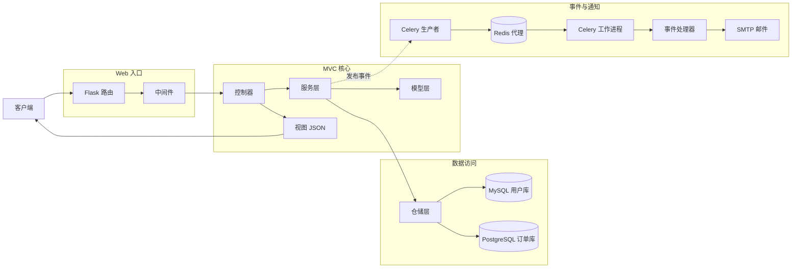

# Flask-MVC 工程脚手架

> 一个生产级别的 MVC（模型-视图-控制器）Flask 工程脚手架，支持双数据库、统一响应格式、中间件和事件驱动架构示例。

## 这是什么？

Flask-MVC 是一个基于 Flask 的 MVC 工程脚手架，帮助你快速构建分层清晰的 Web 服务。它包含用户和订单示例、事件驱动架构、双数据库支持、统一响应格式和中间件，适合作为团队工程模板或在大多数场景下进行代码初始化。

本项目与 `practice-projects/gin-mvc` 功能对齐。与 DDD 架构不同，MVC 架构更加简洁清晰，让你可以对比 DDD 和 MVC 项目结构的差异，根据业务需求选择合适的架构。

## 为什么要用 MVC？

很多开发者在 Flask 项目中直接把路由、业务逻辑和数据访问混在一起。小项目可能跑得快，但随着模块增加就难以控制。MVC 的价值在于职责分离：Controller 处理 HTTP 交互，Service 承载业务规则，Repository 专注数据访问，Model 维护核心状态和行为。

总之，是否采用 MVC 与语言无关，而取决于业务复杂度和团队协作成本。对于中小型及大型业务系统，MVC 在"足够清晰"和"实现成本"之间取得了很好的平衡。

**源码地址：** [https://github.com/microwind/design-patterns/tree/main/practice-projects/flask-mvc](https://github.com/microwind/design-patterns/tree/main/practice-projects/flask-mvc)

**项目目录：** `flask-mvc/`

## 核心特性

- **清晰的 MVC 分层**：Controller、Service、Repository、Model
- **Flask 3.x**：最新的 Flask 框架，采用现代 Python 模式
- **事件驱动**：业务事件 + Celery 异步任务支持
- **双数据库支持**：用户数据库 + 订单数据库（默认 MySQL + PostgreSQL）
- **统一响应格式**：响应封装，支持业务领域错误码
- **全局中间件**：请求 ID、日志记录、错误恢复、跨域支持
- **可选邮件通知**：订单创建事件驱动的 SMTP 邮件发送

## 技术栈

| 技术 | 版本 | 说明 |
|------------|---------|-------------|
| Python | 3.9+ | 语言版本 |
| Flask | 3.0+ | HTTP 框架 |
| SQLAlchemy | 2.0+ | ORM 框架 |
| MySQL | 8.0+ | 用户数据库默认 |
| PostgreSQL | 14+ | 订单数据库默认 |
| Celery | 5.3+ | 异步任务队列 |
| Redis | 7.0+ | Celery 消息代理 |
| PyYAML | - | 配置文件格式 |

## 项目结构

### 结构图



### 目录结构

```
flask-mvc/
├── app/
│   ├── __init__.py                          # 应用工厂
│   ├── config/
│   │   └── config.py                        # 配置加载器
│   ├── controllers/                         # 控制器层（HTTP 处理）
│   │   ├── user_controller.py
│   │   └── order_controller.py
│   ├── services/                            # 服务层（业务编排）
│   │   ├── user_service.py
│   │   └── order_service.py
│   ├── repository/                          # 仓储层（数据访问）
│   │   ├── user_repository.py
│   │   └── order_repository.py
│   ├── models/                              # 模型层（核心模型和事件）
│   │   ├── __init__.py
│   │   ├── user.py
│   │   ├── order.py
│   │   └── event.py
│   └── middleware/                          # Flask 中间件
│       ├── __init__.py
│       ├── request_id.py
│       ├── logging.py
│       ├── cors.py
│       └── error_handler.py
├── pkg/
│   ├── logger/                              # 日志工具
│   │   └── __init__.py
│   └── response/                            # 统一响应
│       └── __init__.py
├── config/
│   └── config.yaml                          # 应用配置
├── docs/
│   ├── init_user_mysql.sql                  # MySQL 用户数据库初始化
│   └── init_order_postgres.sql              # PostgreSQL 订单数据库初始化
├── run.py                                   # 应用入口
├── requirements.txt                         # Python 依赖
└── README.md                                # 本文件
```

## 各层职责

| 层级 | 位置 | 职责 | 关键原则 |
|-------|----------|----------------|----------------|
| 模型层 | `app/models/` | 核心业务对象、状态机、事件模型 | 专注业务语义，不依赖 HTTP/DB 细节 |
| 服务层 | `app/services/` | 编排业务流程、状态转换、事件发布 | 业务规则集中，避免分散到 Controller |
| 仓储层 | `app/repository/` | 数据库访问、MQ/SMTP 外部系统集成 | 只负责 IO 和持久化，不包含业务规则 |
| 控制器层 | `app/controllers/` | HTTP 请求解析、参数校验、响应输出 | 轻量层，不直接操作数据库 |

## 快速开始

### 1. 环境准备

- Python 3.9+
- MySQL 8.0+ 和 PostgreSQL 14+（或选择其中一个）
- Redis 7.0+（可选，用于 Celery）
- SMTP 邮箱（可选，推荐使用 QQ 邮箱）

### 2. 初始化数据库

默认配置使用双数据库：
- 用户数据库：MySQL（默认数据库名 `flask_mvc_user`）
- 订单数据库：PostgreSQL（默认数据库名 `flask_mvc_order`）

执行初始化脚本：

```bash
mysql -u root -p < docs/init_user_mysql.sql
psql -U postgres -f docs/init_order_postgres.sql
```

### 3. 安装依赖

```bash
python3 -m venv venv
source venv/bin/activate
pip install -r requirements.txt
```

### 4. 配置应用

编辑 `config/config.yaml`，至少配置数据库：

```yaml
server:
  host: "0.0.0.0"
  port: 8080
  debug: true

database:
  user:
    driver: "mysql"
    host: "localhost"
    port: 3306
    username: "root"
    password: "your_password"
    database: "flask_mvc_user"
  order:
    driver: "postgresql"
    host: "localhost"
    port: 5432
    username: "postgres"
    password: "your_password"
    database: "flask_mvc_order"
```

### 5. 启动应用

```bash
python3 run.py
```

### 6. 验证 API

```bash
curl http://localhost:8080/health
curl http://localhost:8080/api/users
curl http://localhost:8080/api/orders
```

## API 概览

### 用户 API

- `POST /api/users` - 创建用户
- `GET /api/users` - 获取所有用户
- `GET /api/users?page=1&per_page=10` - 分页获取用户
- `GET /api/users/:id` - 根据 ID 获取用户
- `PUT /api/users/:id/email` - 更新用户邮箱
- `PUT /api/users/:id/phone` - 更新用户手机号
- `DELETE /api/users/:id` - 删除用户
- `GET /api/users/:id/orders` - 获取用户订单

示例：

```bash
curl -X POST http://localhost:8080/api/users \
  -H "Content-Type: application/json" \
  -d '{"name":"张三","email":"zhangsan@example.com","phone":"13800138000"}'
```

### 订单 API

- `POST /api/orders` - 创建订单
- `GET /api/orders` - 获取所有订单
- `GET /api/orders?page=1&per_page=10` - 分页获取订单
- `GET /api/orders/:id` - 根据 ID 获取订单
- `PUT /api/orders/:id/pay` - 支付订单
- `PUT /api/orders/:id/ship` - 发货
- `PUT /api/orders/:id/deliver` - 送达
- `PUT /api/orders/:id/cancel` - 取消订单
- `PUT /api/orders/:id/refund` - 退款

示例：

```bash
curl -X POST http://localhost:8080/api/orders \
  -H "Content-Type: application/json" \
  -d '{"user_id":1,"total_amount":99.99}'
```

## 配置说明

`config/config.yaml` 主要配置项：

- `server`：主机、端口、调试模式
- `database.user`：用户数据库连接
- `database.order`：订单数据库连接
- `log`：日志级别和输出格式
- `celery`：Celery 异步任务配置
- `mail`：SMTP 邮件通知配置

## 基于脚手架开发新功能

示例：添加"商品管理"模块

**步骤 1：** 添加模型 `app/models/product.py`

```python
from datetime import datetime
from sqlalchemy import Column, Integer, String, Numeric
from app.models import db

class Product(db.Model):
    __tablename__ = 'products'
    __bind_key__ = 'user'  # 或 'order'

    id = Column(Integer, primary_key=True, autoincrement=True)
    name = Column(String(100), nullable=False)
    price = Column(Numeric(10, 2), nullable=False)
    stock = Column(Integer, default=0)
    created_at = Column(DateTime, default=datetime.utcnow)
    updated_at = Column(DateTime, default=datetime.utcnow, onupdate=datetime.utcnow)
```

**步骤 2：** 添加仓储 `app/repository/product_repository.py`

```python
from app.models.product import Product
from app.models import db

class ProductRepository:
    def create(self, name, price, stock):
        product = Product(name=name, price=price, stock=stock)
        db.session.add(product)
        db.session.commit()
        db.session.refresh(product)
        return product
```

**步骤 3：** 添加服务 `app/services/product_service.py`

```python
from app.repository.product_repository import ProductRepository

class ProductService:
    def __init__(self, product_repository):
        self.product_repository = product_repository

    def create_product(self, name, price, stock):
        return self.product_repository.create(name, price, stock)
```

**步骤 4：** 添加控制器并在 `app/controllers/product_controller.py` 中注册蓝图

```python
from flask import Blueprint, request, jsonify

product_bp = Blueprint('products', __name__, url_prefix='/api/products')

def init_product_controller(product_service):
    @product_bp.route('', methods=['POST'])
    def create_product():
        data = request.get_json()
        product = product_service.create_product(
            data.get('name'),
            data.get('price'),
            data.get('stock')
        )
        return jsonify({'code': 200, 'message': 'success', 'data': product.to_dict()}), 201
    return product_bp
```

**步骤 5：** 在 `app/__init__.py` 中注册

```python
from app.controllers.product_controller import init_product_controller
# 初始化并注册
init_product_controller(product_service)
app.register_blueprint(product_bp)
```

## 事件驱动架构

### 事件类型

订单事件：
- order.created - 订单创建
- order.paid - 订单支付
- order.shipped - 订单发货
- order.delivered - 订单送达
- order.cancelled - 订单取消
- order.refunded - 订单退款

用户事件：
- user.created - 用户创建
- user.deleted - 用户删除

### 消息流转

```
HTTP 请求 -> 控制器 -> 服务层 -> 模型/仓储
            -> 发布领域事件 -> Celery 任务
            -> Redis 代理 -> Celery 工作进程
            -> 事件处理器 -> 发送邮件/触发后续操作
```

## 开发规范

**命名规范：**
- 模型：名词，如 `Order`、`User`
- 服务：`Service` 或 `XxxService`
- 仓储：`Repository` 或 `XxxRepository`
- 控制器：`Controller` 或 `XxxController`

**分层原则：**
- 控制器只处理 HTTP 参数和响应
- 服务层负责业务规则、流程编排和事件发布
- 仓储层负责数据访问和外部依赖调用
- 模型层负责领域状态和对象行为

## 常用命令

```bash
# 安装依赖
pip install -r requirements.txt

# 运行应用
python run.py

# 使用开发服务器运行
FLASK_ENV=development python run.py
```

## 源码地址

**MVC 架构：**
[https://github.com/microwind/design-patterns/tree/main/practice-projects/flask-mvc](https://github.com/microwind/design-patterns/tree/main/practice-projects/flask-mvc)

**Go MVC 架构：**
[https://github.com/microwind/design-patterns/tree/main/practice-projects/gin-mvc](https://github.com/microwind/design-patterns/tree/main/practice-projects/gin-mvc)

**Go DDD 架构：**
[https://github.com/microwind/design-patterns/tree/main/practice-projects/gin-ddd](https://github.com/microwind/design-patterns/tree/main/practice-projects/gin-ddd)
