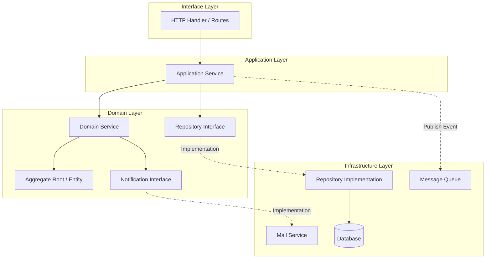

# Gin Framework DDD Scaffold - A Go DDD Engineering Framework for Rapid Project Development

> An out-of-the-box DDD (Domain-Driven Design) Go scaffold based on Gin + RocketMQ, featuring dual databases, unified response format, middleware, and event-driven architecture examples.

## What is This?

Gin-Framework-DDD is a DDD engineering scaffold for Go language that helps you quickly build web services conforming to DDD layered architecture standards. The project includes User and Order examples, Domain Events with RocketMQ producer/consumer, email notification examples, unified response format, and middleware. It's suitable as a team engineering template or teaching material.

## Why Use DDD?

Many believe Go doesn't need DDD since it's lightweight and flexible like Python or JavaScript, and MVC is sufficient. Indeed, in most cases MVC is adequate. Engineering practices simply involve separating interface handling, business logic, and data processing, allowing each component to fulfill its role and facilitate maintenance and extension. DDD is relatively better suited for medium to large-scale projects: if your project has dozens of modules and hundreds of endpoints, DDD design would be more appropriate; for projects with fewer modules and endpoints, simple layering suffices.

In summary, whether to adopt DDD is independent of the language but depends on business scale. When something becomes complex, you need mechanisms to standardize it for better control.

Source Code: [https://github.com/microwind/design-patterns/tree/main/practice-projects/gin-ddd](https://github.com/microwind/design-patterns/tree/main/practice-projects/gin-ddd)

Project Directory: `gin-ddd/`

## Key Features

- Strict DDD four-layer architecture: Domain Layer, Application Layer, Infrastructure Layer, Interface Layer
- Gin Web Framework: High-performance HTTP service
- Event-Driven Architecture: Domain Events + RocketMQ producer/consumer
- Dual Database Support: User DB + Order DB independently configurable (MySQL + PostgreSQL by default)
- Unified Response Format: Response wrapper, centralized error code management
- Global Middleware: Logging, recovery, CORS
- Optional Email Notification: Order creation events trigger SMTP email sending

## Technology Stack

| Technology | Version | Description |
|------------|---------|-------------|
| Go | 1.21+ | Language Version |
| Gin | 1.9+ | HTTP Framework |
| RocketMQ | 5.3+ | Event Message Queue |
| MySQL | 8.0+ | User DB Default |
| PostgreSQL | 14+ | Order DB Default |
| YAML | - | Configuration Format |

## Project Structure

### Architecture Diagram



### Project Directory Structure

```
gin-ddd/
├── cmd/server/main.go                            # Entry point, initializes layers and starts HTTP + MQ
├── config/config.yaml                            # Application configuration
├── docs/init.sql                                 # MySQL initialization script (example)
├── internal/
│   ├── domain/                                   # Domain Layer
│   │   ├── model/
│   │   │   ├── order/order.go                    # Order Aggregate Root
│   │   │   └── user/user.go                      # User Aggregate Root
│   │   ├── repository/                           # Repository Interfaces
│   │   │   ├── order/order_repository.go
│   │   │   └── user/user_repository.go
│   │   ├── event/                                # Domain Events
│   │   │   ├── domain_event.go
│   │   │   ├── order_event.go
│   │   │   ├── user_event.go
│   │   │   └── event_publisher.go
│   │   ├── notification/mail_service.go          # Notification Domain Interface (Email)
│   │   └── service/                              # Domain Services (Reserved)
│   ├── application/                              # Application Layer
│   │   ├── dto/
│   │   │   ├── order/order_dto.go
│   │   │   └── user/user_dto.go
│   │   └── service/
│   │       ├── order/order_service.go            # Order Application Service (Publish Events)
│   │       └── user/user_service.go              # User Application Service
│   ├── infrastructure/                           # Infrastructure Layer
│   │   ├── config/                               # Configuration & DB Initialization
│   │   ├── persistence/                          # Repository Implementations
│   │   │   ├── order/order_repository_impl.go
│   │   │   └── user/user_repository_impl.go
│   │   ├── mq/                                   # RocketMQ Implementation
│   │   │   ├── rocketmq_producer.go
│   │   │   └── rocketmq_consumer.go
│   │   ├── mail/                                 # SMTP Mail Implementation
│   │   ├── middleware/                           # Gin Middleware
│   │   ├── common/response.go                    # Unified Response
│   │   └── constants/error_code.go               # Error Codes
│   └── interfaces/                               # Interface Layer
│       ├── handler/                              # HTTP Handlers
│       ├── router/                               # Route Configuration
│       └── vo/                                   # Request/Response Objects
└── pkg/utils/                                    # Logging and other utilities
```

## Layer Responsibilities

| Layer | Location | Responsibility | Key Principle |
|-------|----------|-----------------|--------------|
| Domain Layer | `internal/domain/` | Domain models, rules, and events | No framework dependencies, business logic cohesion |
| Application Layer | `internal/application/` | Orchestrate domain objects, transaction boundaries | Thin and clear, no business rule implementation |
| Infrastructure Layer | `internal/infrastructure/` | DB, MQ, email, and other technical details | Provide implementations upward, details sink down |
| Interface Layer | `internal/interfaces/` | HTTP request/response and routing | Handle external interaction, no business rules |

## Quick Start

### 1. Environment Setup

- Go 1.21+
- MySQL 8.0+ and PostgreSQL 14+ (or choose one of them)
- RocketMQ 5.3+ (optional)

### 2. Database Initialization

Default configuration uses dual databases:
- User Database: MySQL
- Order Database: PostgreSQL

MySQL User Database Example (you can use `docs/init.sql` as a starting point):

```sql
CREATE DATABASE IF NOT EXISTS gin_ddd CHARACTER SET utf8mb4;
USE gin_ddd;

CREATE TABLE IF NOT EXISTS users (
    id BIGINT AUTO_INCREMENT PRIMARY KEY,
    name VARCHAR(50) NOT NULL UNIQUE,
    email VARCHAR(100) NOT NULL UNIQUE,
    phone VARCHAR(20),
    created_time TIMESTAMP NOT NULL DEFAULT CURRENT_TIMESTAMP,
    updated_time TIMESTAMP NOT NULL DEFAULT CURRENT_TIMESTAMP ON UPDATE CURRENT_TIMESTAMP
);
```

PostgreSQL Order Database Example (consistent with current order repository fields):

```sql
CREATE DATABASE seed;
\c seed;

CREATE TABLE IF NOT EXISTS orders (
    id BIGSERIAL PRIMARY KEY,
    order_no VARCHAR(50) NOT NULL UNIQUE,
    user_id BIGINT NOT NULL,
    total_amount DECIMAL(10, 2) NOT NULL DEFAULT 0.00,
    status VARCHAR(20) NOT NULL DEFAULT 'PENDING',
    created_at TIMESTAMP NOT NULL DEFAULT CURRENT_TIMESTAMP,
    updated_at TIMESTAMP NOT NULL DEFAULT CURRENT_TIMESTAMP
);
```

Database Adaptation Notes:
- If order database is changed to MySQL, SQL placeholders should be changed from `$1` format to `?`
- If user database is changed to PostgreSQL, the insert ID retrieval logic should be changed to `RETURNING id`

### 3. Configure Application

Edit `config/config.yaml`, at minimum configure database and RocketMQ:

```yaml
server:
  host: "0.0.0.0"
  port: 8080
  mode: "debug"

database:
  user:
    driver: "mysql"
    host: "localhost"
    port: 3306
    username: "root"
    password: "your_password"
    database: "gin_ddd"
  order:
    driver: "postgres"
    host: "localhost"
    port: 5432
    username: "postgres"
    password: "your_password"
    database: "seed"

rocketmq:
  enabled: true
  nameserver: "localhost:9876"
  group_name: "gin-ddd-group"
  instance_name: "gin-ddd-instance"
  topics:
    order_event: "order-event-topic"
```

Notes:
- `rocketmq.enabled: true` will initialize the producer and consumer
- Current order event Topic uses fixed value `order-event-topic` in code, must be consistent with configuration

### 4. Start RocketMQ (Optional)

```bash
sh bin/mqnamesrv
sh bin/mqbroker -n localhost:9876
```

### 5. Start Application

```bash
go mod tidy
go run cmd/server/main.go
```

### 6. Verify APIs

```bash
curl http://localhost:8080/health
curl http://localhost:8080/api/users
curl http://localhost:8080/api/orders
```

## How to Develop New Features Based on Scaffold

Example: Add a "Product Management" module

Step 1: Create domain model `internal/domain/model/product/product.go`

```go
package product

import "time"

type Product struct {
	ID        int64
	Name      string
	Price     float64
	Stock     int
	CreatedAt time.Time
	UpdatedAt time.Time
}
```

Step 2: Create repository interface `internal/domain/repository/product/product_repository.go`

```go
package product

import (
	"context"
	"gin-ddd/internal/domain/model/product"
)

type ProductRepository interface {
	Create(ctx context.Context, p *product.Product) error
	Update(ctx context.Context, p *product.Product) error
	FindByID(ctx context.Context, id int64) (*product.Product, error)
	FindAll(ctx context.Context) ([]*product.Product, error)
}
```

Step 3: Create repository implementation `internal/infrastructure/persistence/product/product_repository_impl.go`

```go
package product

import (
	"context"
	"database/sql"
	"gin-ddd/internal/domain/model/product"
)

type ProductRepositoryImpl struct {
	db *sql.DB
}

func NewProductRepository(db *sql.DB) *ProductRepositoryImpl {
	return &ProductRepositoryImpl{db: db}
}

func (r *ProductRepositoryImpl) Create(ctx context.Context, p *product.Product) error {
	_, err := r.db.ExecContext(ctx,
		`INSERT INTO products (name, price, stock, created_at, updated_at) VALUES (?, ?, ?, ?, ?)`,
		p.Name, p.Price, p.Stock, p.CreatedAt, p.UpdatedAt,
	)
	return err
}
```

Step 4: Create application service `internal/application/service/product/product_service.go`

```go
package product

import (
	"context"
	"time"
	"gin-ddd/internal/domain/model/product"
	productDomain "gin-ddd/internal/domain/repository/product"
)

type ProductService struct {
	repo productDomain.ProductRepository
}

func NewProductService(repo productDomain.ProductRepository) *ProductService {
	return &ProductService{repo: repo}
}

func (s *ProductService) Create(ctx context.Context, name string, price float64, stock int) error {
	p := &product.Product{
		Name:      name,
		Price:     price,
		Stock:     stock,
		CreatedAt: time.Now(),
		UpdatedAt: time.Now(),
	}
	return s.repo.Create(ctx, p)
}
```

Step 5: Create HTTP Handler and routes

Place request/response objects in `internal/interfaces/vo/product/`, Handler in `internal/interfaces/handler/product/`, and register routes in `internal/interfaces/router/router.go`.

Step 6: Create database table

```sql
CREATE TABLE IF NOT EXISTS products (
    id BIGINT AUTO_INCREMENT PRIMARY KEY,
    name VARCHAR(100) NOT NULL,
    price DECIMAL(10, 2) NOT NULL,
    stock INT NOT NULL DEFAULT 0,
    created_at TIMESTAMP NOT NULL DEFAULT CURRENT_TIMESTAMP,
    updated_at TIMESTAMP NOT NULL DEFAULT CURRENT_TIMESTAMP
);
```

## Event-Driven Architecture and RocketMQ

### Event Types

Order Events:
- order.created
- order.paid
- order.shipped
- order.delivered
- order.cancelled
- order.refunded

User Events:
- user.created
- user.activated
- user.deactivated
- user.blocked
- user.deleted

### Message Flow

```
HTTP Request -> Application Service -> Domain Model
            -> Publish DomainEvent -> RocketMQ Producer
            -> RocketMQ Broker -> Consumer
            -> Event Handler -> Send Email / Trigger Follow-up Process
```

### Event Publishing and Consuming Key Points

- After order creation, `order.created` event is published (publish failure won't affect main process)
- Consumer parses messages by Tag into `OrderEvent` or `UserEvent`
- Order email notification only triggers on `order.created` when email is enabled

## Email Sending Configuration (QQ Mailbox)

Enable email configuration in `config/config.yaml`:

```yaml
mail:
  enabled: true
  host: "smtp.qq.com"
  port: 465
  username: "your@qq.com"
  password: "Your SMTP Authorization Code"
  from_email: "your@qq.com"
  from_name: "Order System"
```

Important Notes:
- Must use SMTP authorization code, not QQ login password
- Port 465 uses TLS, port 587 uses STARTTLS
- Recipient email is taken from user table `email` field

## Troubleshooting

- Log message "event publisher not initialized": RocketMQ not enabled or initialization failed
- Order event sent but email not received: Verify user email field is correct and SMTP authorization code works
- Consumer not receiving messages: Verify Topic and Tag are correct, Broker is running normally

## Development Conventions

Naming Suggestions:
- Domain Models: Nouns, e.g., `Order`, `User`
- Application Services: `XxxService`
- Repository Interfaces: `XxxRepository`
- Repository Implementations: `XxxRepositoryImpl`
- Handlers: `XxxHandler`

Layering Principles:
- Domain Layer doesn't depend on Infrastructure
- Application Layer only orchestrates and coordinates transactions
- Infrastructure provides technical implementations
- Interface Layer only handles HTTP interactions

## Common Commands

```bash
go mod tidy
go test ./...
```

## Source Code

[https://github.com/microwind/design-patterns/tree/main/practice-projects/gin-ddd](https://github.com/microwind/design-patterns/tree/main/practice-projects/gin-ddd)
