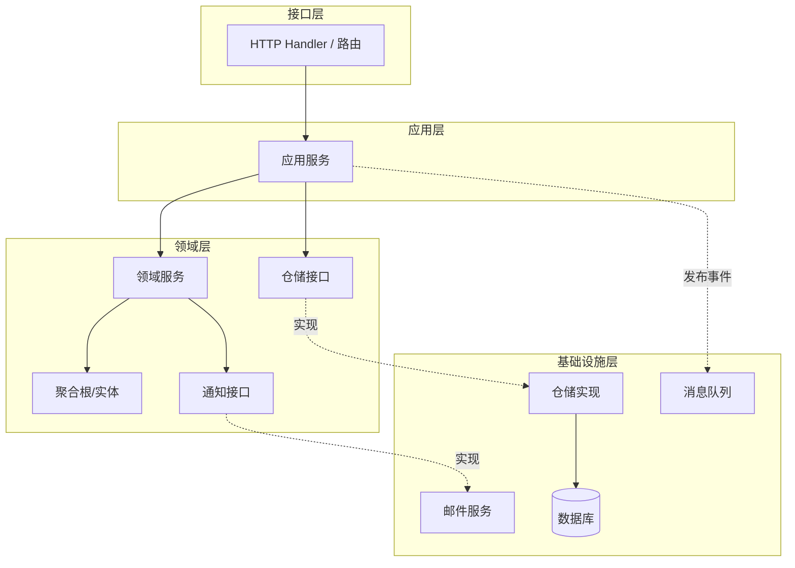

# 一款go语言Gin框架DDD脚手架，适合快速搭建项目

> 一个开箱即用的 DDD（领域驱动设计）Go 脚手架，基于 Gin + RocketMQ，包含双数据库、统一响应、中间件与事件驱动示例

## 这是什么

Gin-Framework-DDD 是一个面向 Go 语言的 DDD 工程脚手架，帮你快速搭建符合 DDD 分层规范的 Web 服务。项目内置用户与订单示例、领域事件与 RocketMQ 生产/消费、邮件通知示例、统一响应与中间件，适合作为团队工程模板或教学示例。

源码地址：[https://github.com/microwind/design-patterns/tree/main/practice-projects/gin-ddd](https://github.com/microwind/design-patterns/tree/main/practice-projects/gin-ddd)

项目目录：`gin-ddd/`

## 核心特点

- 严格 DDD 四层架构：领域层、应用层、基础设施层、接口层
- Gin Web 框架：高性能 HTTP 服务
- 事件驱动：领域事件 + RocketMQ 生产者/消费者
- 双数据库支持：用户库 + 订单库可独立配置（默认 MySQL + PostgreSQL）
- 统一响应格式：Response 封装，错误码集中管理
- 全局中间件：日志、恢复、跨域
- 可选邮件通知：订单创建事件驱动 SMTP 邮件发送

## 技术栈

| 技术 | 版本 | 说明 |
|------|------|------|
| Go | 1.21+ | 语言版本 |
| Gin | 1.9+ | HTTP 框架 |
| RocketMQ | 5.3+ | 事件消息队列 |
| MySQL | 8.0+ | 用户库默认 |
| PostgreSQL | 14+ | 订单库默认 |
| YAML | - | 配置文件格式 |

## 工程结构

### 工程结构图



### 工程结构列表

```
gin-ddd/
├── cmd/server/main.go                            # 启动入口，装配各层并启动 HTTP + MQ
├── config/config.yaml                            # 应用配置
├── docs/init.sql                                 # MySQL 初始化脚本（示例）
├── internal/
│   ├── domain/                                   # 领域层
│   │   ├── model/
│   │   │   ├── order/order.go                    # 订单聚合根
│   │   │   └── user/user.go                      # 用户聚合根
│   │   ├── repository/                           # 仓储接口
│   │   │   ├── order/order_repository.go
│   │   │   └── user/user_repository.go
│   │   ├── event/                                # 领域事件
│   │   │   ├── domain_event.go
│   │   │   ├── order_event.go
│   │   │   ├── user_event.go
│   │   │   └── event_publisher.go
│   │   ├── notification/mail_service.go          # 通知领域接口（邮件）
│   │   └── service/                              # 领域服务（预留）
│   ├── application/                              # 应用层
│   │   ├── dto/
│   │   │   ├── order/order_dto.go
│   │   │   └── user/user_dto.go
│   │   └── service/
│   │       ├── order/order_service.go            # 订单应用服务（发布事件）
│   │       └── user/user_service.go              # 用户应用服务
│   ├── infrastructure/                           # 基础设施层
│   │   ├── config/                               # 配置与 DB 初始化
│   │   ├── persistence/                          # 仓储实现
│   │   │   ├── order/order_repository_impl.go
│   │   │   └── user/user_repository_impl.go
│   │   ├── mq/                                   # RocketMQ 实现
│   │   │   ├── rocketmq_producer.go
│   │   │   └── rocketmq_consumer.go
│   │   ├── mail/                                 # SMTP 邮件实现
│   │   ├── middleware/                           # Gin 中间件
│   │   ├── common/response.go                    # 统一响应
│   │   └── constants/error_code.go               # 错误码
│   └── interfaces/                               # 接口层
│       ├── handler/                              # HTTP 处理器
│       ├── router/                               # 路由配置
│       └── vo/                                   # 请求/响应对象
└── pkg/utils/                                    # 日志等工具
```

## 各层职责说明

| 层级 | 位置 | 职责 | 关键原则 |
|------|------|------|---------|
| 领域层 | `internal/domain/` | 领域模型、规则与事件 | 不依赖框架、业务逻辑内聚 |
| 应用层 | `internal/application/` | 编排领域对象、事务边界 | 薄而清晰，不实现业务规则 |
| 基础设施层 | `internal/infrastructure/` | DB、MQ、邮件等技术细节 | 向上提供实现，细节下沉 |
| 接口层 | `internal/interfaces/` | HTTP 请求/响应与路由 | 处理外部交互，不含业务规则 |

## 快速开始

### 1. 环境准备

- Go 1.21+
- MySQL 8.0+ 与 PostgreSQL 14+（或自行选择其一）
- RocketMQ 5.3+（可选）

### 2. 初始化数据库

默认配置使用双数据库：
- 用户库：MySQL
- 订单库：PostgreSQL

MySQL 用户库示例（可直接用 `docs/init.sql` 作为起点）：

```sql
CREATE DATABASE IF NOT EXISTS gin_ddd CHARACTER SET utf8mb4;
USE gin_ddd;

CREATE TABLE IF NOT EXISTS users (
    id BIGINT AUTO_INCREMENT PRIMARY KEY,
    name VARCHAR(50) NOT NULL UNIQUE,
    email VARCHAR(100) NOT NULL UNIQUE,
    phone VARCHAR(20),
    created_time TIMESTAMP NOT NULL DEFAULT CURRENT_TIMESTAMP,
    updated_time TIMESTAMP NOT NULL DEFAULT CURRENT_TIMESTAMP ON UPDATE CURRENT_TIMESTAMP
);
```

PostgreSQL 订单库示例（与当前订单仓储字段一致）：

```sql
CREATE DATABASE seed;
\c seed;

CREATE TABLE IF NOT EXISTS orders (
    id BIGSERIAL PRIMARY KEY,
    order_no VARCHAR(50) NOT NULL UNIQUE,
    user_id BIGINT NOT NULL,
    total_amount DECIMAL(10, 2) NOT NULL DEFAULT 0.00,
    status VARCHAR(20) NOT NULL DEFAULT 'PENDING',
    created_at TIMESTAMP NOT NULL DEFAULT CURRENT_TIMESTAMP,
    updated_at TIMESTAMP NOT NULL DEFAULT CURRENT_TIMESTAMP
);
```

数据库适配注意：
- 若订单库改为 MySQL，需要将 SQL 占位符从 `$1` 形式改为 `?`
- 若用户库改为 PostgreSQL，需要将插入 ID 获取逻辑改为 `RETURNING id`

### 3. 配置应用

编辑 `config/config.yaml`，至少配置数据库与 RocketMQ：

```yaml
server:
  host: "0.0.0.0"
  port: 8080
  mode: "debug"

database:
  user:
    driver: "mysql"
    host: "localhost"
    port: 3306
    username: "root"
    password: "your_password"
    database: "gin_ddd"
  order:
    driver: "postgres"
    host: "localhost"
    port: 5432
    username: "postgres"
    password: "your_password"
    database: "seed"

rocketmq:
  enabled: true
  nameserver: "localhost:9876"
  group_name: "gin-ddd-group"
  instance_name: "gin-ddd-instance"
  topics:
    order_event: "order-event-topic"
```

说明：
- `rocketmq.enabled: true` 才会初始化生产者与消费者
- 当前订单事件 Topic 在代码中使用固定值 `order-event-topic`，需与配置保持一致

### 4. 启动 RocketMQ（可选）

```bash
sh bin/mqnamesrv
sh bin/mqbroker -n localhost:9876
```

### 5. 启动应用

```bash
go mod tidy
go run cmd/server/main.go
```

### 6. 验证接口

```bash
curl http://localhost:8080/health
curl http://localhost:8080/api/users
curl http://localhost:8080/api/orders
```

## 如何基于脚手架开发新功能

示例：新增“商品管理”模块

步骤 1：新增领域模型 `internal/domain/model/product/product.go`

```go
package product

import "time"

type Product struct {
	ID        int64
	Name      string
	Price     float64
	Stock     int
	CreatedAt time.Time
	UpdatedAt time.Time
}
```

步骤 2：新增仓储接口 `internal/domain/repository/product/product_repository.go`

```go
package product

import (
	"context"
	"gin-ddd/internal/domain/model/product"
)

type ProductRepository interface {
	Create(ctx context.Context, p *product.Product) error
	Update(ctx context.Context, p *product.Product) error
	FindByID(ctx context.Context, id int64) (*product.Product, error)
	FindAll(ctx context.Context) ([]*product.Product, error)
}
```

步骤 3：新增仓储实现 `internal/infrastructure/persistence/product/product_repository_impl.go`

```go
package product

import (
	"context"
	"database/sql"
	"gin-ddd/internal/domain/model/product"
)

type ProductRepositoryImpl struct {
	db *sql.DB
}

func NewProductRepository(db *sql.DB) *ProductRepositoryImpl {
	return &ProductRepositoryImpl{db: db}
}

func (r *ProductRepositoryImpl) Create(ctx context.Context, p *product.Product) error {
	_, err := r.db.ExecContext(ctx,
		`INSERT INTO products (name, price, stock, created_at, updated_at) VALUES (?, ?, ?, ?, ?)`,
		p.Name, p.Price, p.Stock, p.CreatedAt, p.UpdatedAt,
	)
	return err
}
```

步骤 4：新增应用服务 `internal/application/service/product/product_service.go`

```go
package product

import (
	"context"
	"time"
	"gin-ddd/internal/domain/model/product"
	productDomain "gin-ddd/internal/domain/repository/product"
)

type ProductService struct {
	repo productDomain.ProductRepository
}

func NewProductService(repo productDomain.ProductRepository) *ProductService {
	return &ProductService{repo: repo}
}

func (s *ProductService) Create(ctx context.Context, name string, price float64, stock int) error {
	p := &product.Product{
		Name:      name,
		Price:     price,
		Stock:     stock,
		CreatedAt: time.Now(),
		UpdatedAt: time.Now(),
	}
	return s.repo.Create(ctx, p)
}
```

步骤 5：新增 HTTP Handler 和路由

将请求/响应对象放到 `internal/interfaces/vo/product/`，Handler 放到 `internal/interfaces/handler/product/`，并在 `internal/interfaces/router/router.go` 中注册路由。

步骤 6：新增数据库表

```sql
CREATE TABLE IF NOT EXISTS products (
    id BIGINT AUTO_INCREMENT PRIMARY KEY,
    name VARCHAR(100) NOT NULL,
    price DECIMAL(10, 2) NOT NULL,
    stock INT NOT NULL DEFAULT 0,
    created_at TIMESTAMP NOT NULL DEFAULT CURRENT_TIMESTAMP,
    updated_at TIMESTAMP NOT NULL DEFAULT CURRENT_TIMESTAMP
);
```

## 事件驱动与 RocketMQ

### 事件类型

订单事件：
- order.created
- order.paid
- order.shipped
- order.delivered
- order.cancelled
- order.refunded

用户事件：
- user.created
- user.activated
- user.deactivated
- user.blocked
- user.deleted

### 消息流转

```
HTTP 请求 -> Application Service -> Domain Model
            -> 发布 DomainEvent -> RocketMQ Producer
            -> RocketMQ Broker -> Consumer
            -> 事件处理 -> 发送邮件/触发后续流程
```

### 事件发布与消费关键点

- 订单创建后会发布 `order.created` 事件（发布失败不会影响主流程）
- 消费端按 Tag 解析为 `OrderEvent` 或 `UserEvent`
- 订单邮件通知仅在 `order.created` 且启用邮件时触发

## 邮件发送配置（QQ 邮箱）

在 `config/config.yaml` 中开启邮件配置：

```yaml
mail:
  enabled: true
  host: "smtp.qq.com"
  port: 465
  username: "your@qq.com"
  password: "你的SMTP授权码"
  from_email: "your@qq.com"
  from_name: "订单系统"
```

注意事项：
- 必须使用 SMTP 授权码，不是 QQ 登录密码
- 端口 465 使用 TLS，端口 587 使用 STARTTLS
- 收件人取自用户表中的 `email` 字段

## 常见问题排查

- 日志提示“事件发布器未初始化”：RocketMQ 未启用或初始化失败
- 订单事件已发送但邮件未到：确认用户邮箱字段正确，且 SMTP 授权码可用
- 消费者没有收到消息：确认 Topic 与 Tag 正确、Broker 启动正常

## 开发规范

命名建议：
- 领域模型：名词，如 `Order`、`User`
- 应用服务：`XxxService`
- 仓储接口：`XxxRepository`
- 仓储实现：`XxxRepositoryImpl`
- Handler：`XxxHandler`

分层原则：
- 领域层不依赖基础设施
- 应用层只做编排与事务协调
- 基础设施提供技术实现
- 接口层只负责 HTTP 交互

## 常用命令

```bash
go mod tidy
go test ./...
```

## 源码地址

[https://github.com/microwind/design-patterns/tree/main/practice-projects/gin-ddd](https://github.com/microwind/design-patterns/tree/main/practice-projects/gin-ddd)
