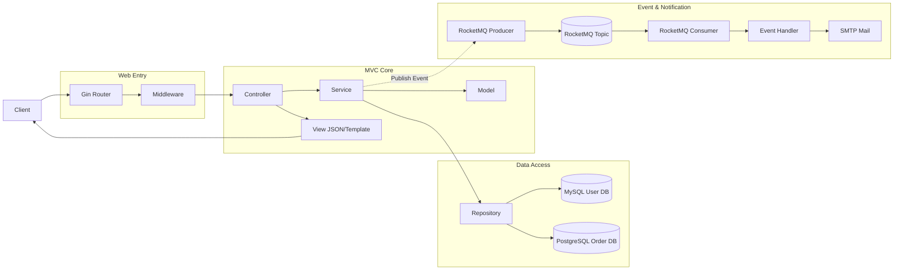

# Gin Framework MVC Scaffold - A Go MVC Engineering Framework for Rapid Project Development

> An out-of-the-box MVC (Model-View-Controller) Go scaffold based on Gin + RocketMQ, featuring dual databases, unified response format, middleware, and event-driven architecture examples.

## What is This?

Gin-Framework-MVC is an MVC engineering scaffold for Go language that helps you quickly build web services with clear layering. The project includes User and Order examples, RocketMQ producer/consumer, email notification examples, unified response format, and middleware. It's suitable as a team engineering template or teaching material.

## Why Use MVC?

In many Go projects, routes, business logic, and data access are mixed together. That can work for small projects, but it quickly becomes hard to maintain when modules grow. MVC separates responsibilities clearly: Controller handles HTTP interactions, Service carries business rules, Repository focuses on data access, and Model maintains core state and behavior.

In short, adopting MVC is not language-specific. It is mainly about business complexity and team collaboration cost. For small to medium and medium to large business systems, MVC provides a practical balance between clarity and implementation cost.

Source Code: [https://github.com/microwind/design-patterns/tree/main/practice-projects/gin-mvc](https://github.com/microwind/design-patterns/tree/main/practice-projects/gin-mvc)

Project Directory: `gin-mvc/`

## Key Features

- Clear MVC layering: Controller, Service, Repository, Model
- Gin Web Framework: High-performance HTTP service
- Event-Driven Architecture: Business events + RocketMQ producer/consumer
- Dual Database Support: User DB + Order DB independently configurable (MySQL + PostgreSQL by default)
- Unified Response Format: Response wrapper with business-domain error codes
- Global Middleware: Request ID, logging, recovery, CORS
- Optional Email Notification: Order creation events trigger SMTP email sending

## Technology Stack

| Technology | Version | Description |
|------------|---------|-------------|
| Go | 1.21+ | Language Version |
| Gin | 1.9+ | HTTP Framework |
| RocketMQ | 5.3+ | Event Message Queue |
| MySQL | 8.0+ | User DB Default |
| PostgreSQL | 14+ | Order DB Default |
| YAML | - | Configuration Format |

## Project Structure

### Architecture Diagram



### Project Directory Structure

```
gin-mvc/
├── cmd/main.go                                  # Entry point, initializes layers and starts HTTP + MQ
├── config/config.yaml                            # Application configuration
├── docs/
│   ├── init_user_mysql.sql                       # MySQL user DB initialization script
│   └── init_order_postgres.sql                   # PostgreSQL order DB initialization script
├── internal/
│   ├── controllers/                              # Controller layer (HTTP handlers)
│   │   ├── home/home_controller.go
│   │   ├── order/order_controller.go
│   │   └── user/user_controller.go
│   ├── services/                                 # Service layer (business orchestration)
│   │   ├── order/order_service.go                # Order service (state transitions + event publishing)
│   │   ├── user/user_service.go                  # User service
│   │   ├── event/order_handler.go                # Event consumer handler
│   │   └── notification/mail_service.go          # Mail service interface
│   ├── repository/                               # Repository layer (data access and external dependencies)
│   │   ├── db/                                   # DB connection and SQL placeholder dialects
│   │   ├── order/
│   │   │   ├── order_repository.go
│   │   │   └── order_sql_repository.go
│   │   ├── user/
│   │   │   ├── user_repository.go
│   │   │   └── user_sql_repository.go
│   │   ├── mq/                                   # RocketMQ implementation
│   │   │   ├── rocketmq_producer.go
│   │   │   └── rocketmq_consumer.go
│   │   └── mail/smtp_mail_repository.go          # SMTP mail implementation
│   ├── models/                                   # Model layer (core models and events)
│   │   ├── order/order.go
│   │   ├── user/user.go
│   │   └── event/
│   │       ├── event.go
│   │       ├── order_event.go
│   │       └── user_event.go
│   ├── middleware/                               # Gin middleware
│   │   ├── request_id.go
│   │   ├── logging.go
│   │   ├── recovery.go
│   │   ├── cors.go
│   │   └── context.go
│   └── config/config.go                          # Configuration loading and validation
├── pkg/
│   ├── logger/logger.go                          # Logging utility
│   └── response/response.go                      # Unified response helper
└── web/templates/order.tmpl                      # Example page template
```

## Layer Responsibilities

| Layer | Location | Responsibility | Key Principle |
|-------|----------|----------------|--------------|
| Model Layer | `internal/models/` | Core business objects, state machines, and event models | Focus on business semantics, no HTTP/DB details |
| Service Layer | `internal/services/` | Orchestrate business flow, state transitions, and event publishing | Keep business rules centralized, not in controllers |
| Repository Layer | `internal/repository/` | DB access and external integrations (MQ/SMTP) | IO and persistence only, no business rules |
| Controller Layer | `internal/controllers/` | HTTP request parsing, validation, and response output | Thin layer, no direct DB operations |

## Quick Start

### 1. Environment Setup

- Go 1.21+
- MySQL 8.0+ and PostgreSQL 14+ (or choose one of them)
- RocketMQ 5.3+ (optional)
- SMTP mailbox (optional, QQ mailbox recommended)

### 2. Database Initialization

Default configuration uses dual databases:
- User Database: MySQL (default DB name `gin_mvc_user`)
- Order Database: PostgreSQL (default DB name `gin_mvc_order`)

Run initialization scripts:

```bash
mysql -u root -p < docs/init_user_mysql.sql
psql -U postgres -f docs/init_order_postgres.sql
```

Database adaptation notes:
- Current repositories already support both MySQL and PostgreSQL placeholders
- When switching drivers, make sure `database.user.driver` and `database.order.driver` are configured correctly in `config/config.yaml`

### 3. Configure Application

Edit `config/config.yaml`, at minimum configure database and RocketMQ:

```yaml
server:
  host: "0.0.0.0"
  port: 8080
  mode: "debug"

database:
  user:
    driver: "mysql"
    host: "localhost"
    port: 3306
    username: "root"
    password: "your_password"
    database: "gin_mvc_user"
  order:
    driver: "postgres"
    host: "localhost"
    port: 5432
    username: "postgres"
    password: "your_password"
    database: "gin_mvc_order"

rocketmq:
  enabled: true
  nameserver: "localhost:9876"
  group_name: "gin-mvc-group"
  instance_name: "gin-mvc-instance"
  topics:
    order_event: "order-event-topic"
```

Notes:
- `rocketmq.enabled: true` will initialize producer and consumer
- `rocketmq.topics.order_event` is required, otherwise config validation fails
- If MQ is not needed now, set `rocketmq.enabled: false`

Minimum runnable configuration (recommended for local setup):
- `database.user` and `database.order` are correctly configured and reachable
- `rocketmq.enabled: false` (if message queue is not needed yet)
- `mail.enabled: false` (if email sending is not needed yet)

### 4. Start RocketMQ (Optional)

```bash
sh bin/mqnamesrv
sh bin/mqbroker -n localhost:9876
```

### 5. Start Application

```bash
go mod tidy
go run cmd/main.go
```

### 6. Verify APIs

```bash
curl http://localhost:8080/health
curl http://localhost:8080/api/users
curl http://localhost:8080/api/orders
```

## API Overview

### User APIs

- `POST /api/users`
- `GET /api/users`
- `GET /api/users/:id`
- `PUT /api/users/:id/email`
- `PUT /api/users/:id/phone`
- `DELETE /api/users/:id`
- `GET /api/users/:id/orders`

Example:

```bash
curl -X POST http://localhost:8080/api/users \
  -H "Content-Type: application/json" \
  -d '{"name":"Zhang San","email":"zhangsan@example.com","phone":"13800138000"}'
```

### Order APIs

- `POST /api/orders`
- `GET /api/orders`
- `GET /api/orders/:id`
- `PUT /api/orders/:id/pay`
- `PUT /api/orders/:id/ship`
- `PUT /api/orders/:id/deliver`
- `PUT /api/orders/:id/cancel`
- `PUT /api/orders/:id/refund`

Example:

```bash
curl -X POST http://localhost:8080/api/orders \
  -H "Content-Type: application/json" \
  -d '{"user_id":1,"total_amount":99.99}'
```

## Configuration Overview

Main sections in `config/config.yaml`:

- `server`: host, port, gin mode, timeouts
- `database.user`: user database connection
- `database.order`: order database connection
- `log`: log level and output format (text/json)
- `rocketmq`: switch, nameserver, group, topic
- `mail`: SMTP switch and account configuration

## How to Develop New Features Based on Scaffold

Example: Add a "Product Management" module

Step 1: Create model `internal/models/product/product.go`

```go
package product

import "time"

type Product struct {
	ID        int64
	Name      string
	Price     float64
	Stock     int
	CreatedAt time.Time
	UpdatedAt time.Time
}
```

Step 2: Create repository interface `internal/repository/product/product_repository.go`

```go
package product

import (
	"context"
	"gin-mvc/internal/models/product"
)

type Repository interface {
	Create(ctx context.Context, p *product.Product) error
	Update(ctx context.Context, p *product.Product) error
	FindByID(ctx context.Context, id int64) (*product.Product, error)
	FindAll(ctx context.Context) ([]*product.Product, error)
}
```

Step 3: Create repository implementation `internal/repository/product/product_sql_repository.go`

```go
package product

import (
	"context"
	"database/sql"
	"gin-mvc/internal/models/product"
)

type SQLRepository struct {
	db *sql.DB
}

func NewSQLRepository(db *sql.DB) *SQLRepository {
	return &SQLRepository{db: db}
}

func (r *SQLRepository) Create(ctx context.Context, p *product.Product) error {
	_, err := r.db.ExecContext(ctx,
		`INSERT INTO products (name, price, stock, created_at, updated_at) VALUES (?, ?, ?, ?, ?)`,
		p.Name, p.Price, p.Stock, p.CreatedAt, p.UpdatedAt,
	)
	return err
}
```

Step 4: Create business service `internal/services/product/product_service.go`

```go
package product

import (
	"context"
	"time"
	"gin-mvc/internal/models/product"
	productRepo "gin-mvc/internal/repository/product"
)

type Service struct {
	repo productRepo.Repository
}

func New(repo productRepo.Repository) *Service {
	return &Service{repo: repo}
}

func (s *Service) Create(ctx context.Context, name string, price float64, stock int) error {
	p := &product.Product{
		Name:      name,
		Price:     price,
		Stock:     stock,
		CreatedAt: time.Now(),
		UpdatedAt: time.Now(),
	}
	return s.repo.Create(ctx, p)
}
```

Step 5: Create Controller and routes

Place controller code in `internal/controllers/product/`, and register route group `api.Group("/products")` in `cmd/main.go`.

Step 6: Create database table

```sql
CREATE TABLE IF NOT EXISTS products (
    id BIGINT AUTO_INCREMENT PRIMARY KEY,
    name VARCHAR(100) NOT NULL,
    price DECIMAL(10, 2) NOT NULL,
    stock INT NOT NULL DEFAULT 0,
    created_at TIMESTAMP NOT NULL DEFAULT CURRENT_TIMESTAMP,
    updated_at TIMESTAMP NOT NULL DEFAULT CURRENT_TIMESTAMP
);
```

## Event-Driven Architecture and RocketMQ

### Event Types

Order Events:
- order.created
- order.paid
- order.shipped
- order.delivered
- order.cancelled
- order.refunded

User Events:
- user.created
- user.deleted

### Message Flow

```
HTTP Request -> Controller -> Service -> Model/Repository
             -> Publish DomainEvent -> RocketMQ Producer
             -> RocketMQ Broker -> Consumer
             -> Event Handler -> Send Email / Trigger Follow-up Process
```

Order creation scenario (more concrete):

```text
HTTP Request
-> OrderController
-> OrderService (publish event after persistence)
-> RocketMQ Producer
-> RocketMQ Topic(order-event-topic)
-> RocketMQ Consumer
-> event handler
-> SMTP MailService (send confirmation for order.created)
```

### Event Publishing and Consuming Key Points

- Order creation, payment, and cancellation flows attempt to publish order events (publish failure does not block main business flow)
- Consumer parses message tags by prefix: `order.*` maps to `OrderEvent`, `user.*` maps to `UserEvent`
- Order email notification is triggered only on `order.created` when mail is enabled

## Email Sending Configuration (QQ Mailbox)

Enable email configuration in `config/config.yaml`:

```yaml
mail:
  enabled: true
  host: "smtp.qq.com"
  port: 465
  username: "your@qq.com"
  password: "Your SMTP Authorization Code"
  from_email: "your@qq.com"
  from_name: "Order System"
```

Important notes:
- Must use SMTP authorization code, not QQ login password
- Port 465 uses TLS, port 587 uses STARTTLS
- Recipient email comes from the `email` field in user table

## Troubleshooting

- RocketMQ enabled but no message published
  - Check `rocketmq.enabled`, NameServer/Broker connectivity, and `topics.order_event`
- Order event consumed but no email sent
  - Check `mail.enabled`, SMTP authorization code, and user email field
- Consumer not receiving messages
  - Check Topic/Tag match and Consumer Group status
- Database placeholder or driver errors
  - Verify `database.*.driver` matches the target database

## Development Conventions

Naming suggestions:
- Models: nouns, e.g., `Order`, `User`
- Services: `Service` or `XxxService`
- Repository interfaces: `Repository`
- Repository implementations: `SQLRepository`
- Controllers: `Controller` or `XxxController`

Layering principles:
- Controller only handles HTTP params and responses
- Service is responsible for business rules, orchestration, and event publishing
- Repository handles data access and external dependencies
- Model handles domain state and object behavior

## Comparison with DDD Version

Compared with `practice-projects/gin-ddd`:

- Functional scope remains aligned: user/order/MQ/email/dual DB
- Layering is switched to MVC: easier to understand and teach
- Dependency wiring is centralized in `cmd/main.go` for faster startup-flow tracing

## Common Commands

```bash
go mod tidy
go test ./...
```

## Source Code

[https://github.com/microwind/design-patterns/tree/main/practice-projects/gin-mvc](https://github.com/microwind/design-patterns/tree/main/practice-projects/gin-mvc)

[https://github.com/microwind/design-patterns/tree/main/practice-projects/gin-ddd](https://github.com/microwind/design-patterns/tree/main/practice-projects/gin-ddd)
