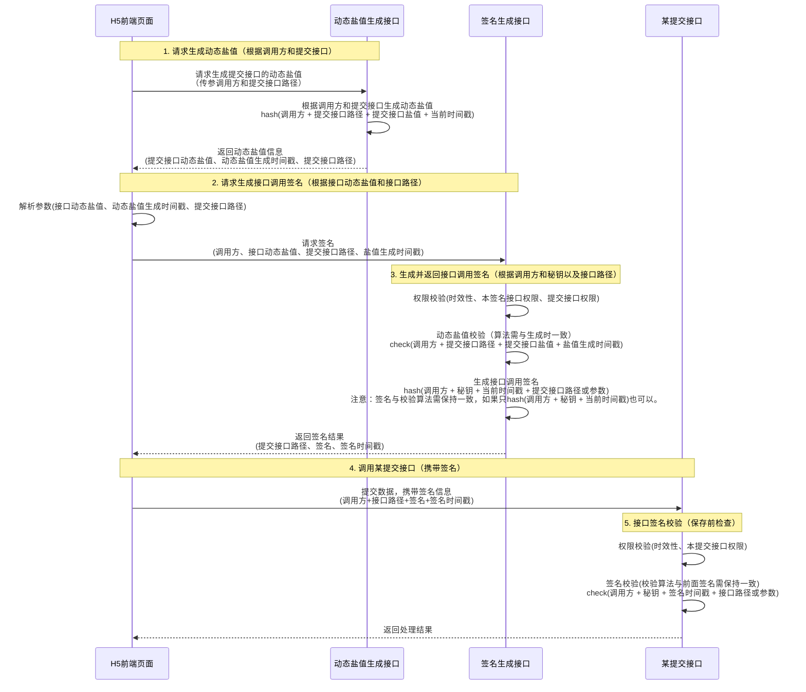

# 概述
为了增加接口调用安全，前后端形成一套接口签名与动态盐值的方案。
由后端给前端办法用户身份以及生成动态盐值和接口签名，保证接口调用的安全可靠。

## 时序图


## 数据库
```sql
--- 1. API调用者表，用于记录api调用者身份和秘钥等
CREATE TABLE api_users (
    id             BIGINT AUTO_INCREMENT PRIMARY KEY COMMENT '主键ID',
    app_code       VARCHAR(64) NOT NULL UNIQUE COMMENT '调用方编码，如 h5、miniapp',
    app_name       VARCHAR(128) NOT NULL COMMENT '调用方名称',
    secret_key      VARCHAR(128) NOT NULL COMMENT '调用方秘钥，用于签名',
    status          TINYINT NOT NULL DEFAULT 1 COMMENT '1启用 0禁用',
    daily_limit INT DEFAULT NULL COMMENT '每日调用限额，默认不限',
    expire_time DATETIME DEFAULT NULL COMMENT '密钥过期时间，默认不限',
    created_at      DATETIME NOT NULL DEFAULT CURRENT_TIMESTAMP, '创建时间',
    updated_at      DATETIME NOT NULL DEFAULT CURRENT_TIMESTAMP ON UPDATE CURRENT_TIMESTAMP COMMENT '更新时间',
    INDEX idx_app_code (app_code),
    INDEX idx_status (status)
) COMMENT='API调用者表';

--- 2. api_info表，包括接口名称、路径、类型(不用sign、普通sign、带盐值sign)、固定盐值、限流策略等
CREATE TABLE api_info (
    id BIGINT AUTO_INCREMENT PRIMARY KEY COMMENT '主键ID',
    api_path VARCHAR(255) NOT NULL UNIQUE COMMENT '接口路径',
    api_name VARCHAR(100) NOT NULL COMMENT '接口名称',
    api_type TINYINT DEFAULT 1 COMMENT '接口类型：1-不用sign，2-需要sign',
    fixed_salt VARCHAR(64) NOT NULL COMMENT '该接口的固定盐值',
    rate_limit INT DEFAULT 100 COMMENT '接口限流（次/分钟）',
    status TINYINT DEFAULT 1 COMMENT '状态：0-禁用，1-启用',
    description TEXT COMMENT '接口描述',
    created_at DATETIME DEFAULT CURRENT_TIMESTAMP COMMENT '创建时间',
    updated_at DATETIME DEFAULT CURRENT_TIMESTAMP ON UPDATE CURRENT_TIMESTAMP COMMENT '更新时间',
    INDEX idx_api_path (api_path),
    INDEX idx_api_type (api_type),
    INDEX idx_status (status)
) COMMENT='API接口信息表';

--- 3. api_auth表，调用者接口权限
CREATE TABLE api_auth (
    id BIGINT AUTO_INCREMENT PRIMARY KEY COMMENT '主键ID',
    app_code VARCHAR(50) NOT NULL COMMENT '用户标识',
    api_path VARCHAR(255) NOT NULL COMMENT '接口路径',
    status TINYINT DEFAULT 1 COMMENT '状态：0-禁用，1-启用',
    expire_time DATETIME COMMENT '权限过期时间',
    created_at DATETIME DEFAULT CURRENT_TIMESTAMP COMMENT '创建时间',
    updated_at DATETIME DEFAULT CURRENT_TIMESTAMP ON UPDATE CURRENT_TIMESTAMP COMMENT '更新时间',
    UNIQUE KEY uk_user_api (app_code, api_path),
    INDEX idx_app_code (app_code),
    INDEX idx_api_path (api_path),
    INDEX idx_status (status),
) COMMENT='API接口权限表';

--- 4. api_dynamic_salt_log表【可选】，
--- 每次生成动态盐值时记录，如果配置了从数据库校验动态盐值才需要记录到表中，否则每次算法校验即可
CREATE TABLE api_dynamic_salt_log (
    id BIGINT AUTO_INCREMENT PRIMARY KEY COMMENT '主键ID',
    app_code VARCHAR(50) NOT NULL COMMENT '用户标识',
    api_id   BIGINT NOT NULL COMMENT '提交接口ID',
    api_path VARCHAR(255) NOT NULL COMMENT '目标接口路径',
    dynamic_salt VARCHAR(128) NOT NULL COMMENT '动态盐值',
    salt_timestamp BIGINT NOT NULL COMMENT '生成时间戳（毫秒）',
    expire_time DATETIME COMMENT '过期时间',
    used TINYINT DEFAULT 0 COMMENT '是否已使用：0-未使用，1-已使用',
    created_at DATETIME DEFAULT CURRENT_TIMESTAMP COMMENT '创建时间',
    INDEX idx_user_api (app_code, api_path),
    INDEX idx_dynamic_salt (dynamic_salt),
    INDEX idx_expire_time (expire_time),
    INDEX idx_used (used)
) COMMENT='动态盐值记录表';
```

```postgresql
--- 表1. API调用者表，用于记录api调用者身份和秘钥等
CREATE TABLE api_users (
    id BIGINT GENERATED ALWAYS AS IDENTITY PRIMARY KEY,
    app_code VARCHAR(64) NOT NULL UNIQUE,
    app_name VARCHAR(128) NOT NULL,
    secret_key VARCHAR(128) NOT NULL,
    status SMALLINT NOT NULL DEFAULT 1,
    daily_limit INT DEFAULT NULL,
    expire_time TIMESTAMP DEFAULT NULL,
    created_at TIMESTAMP NOT NULL DEFAULT CURRENT_TIMESTAMP,
    updated_at TIMESTAMP NOT NULL DEFAULT CURRENT_TIMESTAMP
);

-- 自动更新时间戳
CREATE OR REPLACE FUNCTION update_timestamp()
RETURNS TRIGGER AS $$
BEGIN
   NEW.updated_at = CURRENT_TIMESTAMP;
   RETURN NEW;
END;
$$ LANGUAGE plpgsql;

CREATE TRIGGER trg_api_users_updated_at
BEFORE UPDATE ON api_users
FOR EACH ROW
EXECUTE FUNCTION update_timestamp();

-- 注释
COMMENT ON TABLE api_users IS 'API调用者表';
COMMENT ON COLUMN api_users.app_code IS '调用方编码，如 h5、miniapp';
COMMENT ON COLUMN api_users.app_name IS '调用方名称';
COMMENT ON COLUMN api_users.secret_key IS '调用方秘钥，用于签名';
COMMENT ON COLUMN api_users.status IS '1启用 0禁用';
COMMENT ON COLUMN api_users.daily_limit IS '每日调用限额';
COMMENT ON COLUMN api_users.expire_time IS '密钥过期时间';
COMMENT ON COLUMN api_users.created_at IS '创建时间';
COMMENT ON COLUMN api_users.updated_at IS '更新时间';

CREATE INDEX idx_api_users_app_code ON api_users(app_code);
CREATE INDEX idx_api_users_status ON api_users(status);

--- 表2. api_info表，包括接口名称、路径、类型(不用sign、普通sign、带盐值sign)、固定盐值、限流策略等
CREATE TABLE api_info (
    id BIGINT GENERATED ALWAYS AS IDENTITY PRIMARY KEY,
    api_path VARCHAR(255) NOT NULL UNIQUE,
    api_name VARCHAR(100) NOT NULL,
    api_type SMALLINT DEFAULT 1,
    fixed_salt VARCHAR(64),
    rate_limit INT DEFAULT 100,
    status SMALLINT DEFAULT 1,
    description TEXT,
    created_at TIMESTAMP DEFAULT CURRENT_TIMESTAMP,
    updated_at TIMESTAMP DEFAULT CURRENT_TIMESTAMP
);

CREATE TRIGGER trg_api_info_updated_at
BEFORE UPDATE ON api_info
FOR EACH ROW
EXECUTE FUNCTION update_timestamp();

-- 注释
COMMENT ON TABLE api_info IS 'API接口信息表';
COMMENT ON COLUMN api_info.api_path IS '接口路径';
COMMENT ON COLUMN api_info.api_name IS '接口名称';
COMMENT ON COLUMN api_info.api_type IS '接口类型：1-不用sign，2-需要sign';
COMMENT ON COLUMN api_info.fixed_salt IS '固定盐值';
COMMENT ON COLUMN api_info.rate_limit IS '限流（次/分钟）';
COMMENT ON COLUMN api_info.status IS '状态';
COMMENT ON COLUMN api_info.description IS '接口描述';

CREATE INDEX idx_api_info_path ON api_info(api_path);
CREATE INDEX idx_api_info_type ON api_info(api_type);
CREATE INDEX idx_api_info_status ON api_info(status);

--- 表3. api_auth表，调用者接口权限
CREATE TABLE api_auth (
    id BIGINT GENERATED ALWAYS AS IDENTITY PRIMARY KEY,
    app_code VARCHAR(50) NOT NULL,
    api_path VARCHAR(255) NOT NULL,
    status SMALLINT DEFAULT 1,
    expire_time TIMESTAMP DEFAULT NULL,
    created_at TIMESTAMP DEFAULT CURRENT_TIMESTAMP,
    updated_at TIMESTAMP DEFAULT CURRENT_TIMESTAMP,
    CONSTRAINT uk_user_api UNIQUE (app_code, api_path)
);

CREATE TRIGGER trg_api_auth_updated_at
BEFORE UPDATE ON api_auth
FOR EACH ROW
EXECUTE FUNCTION update_timestamp();

-- 注释
COMMENT ON TABLE api_auth IS 'API接口权限表';

CREATE INDEX idx_api_auth_app_code ON api_auth(app_code);
CREATE INDEX idx_api_auth_api_path ON api_auth(api_path);
CREATE INDEX idx_api_auth_status ON api_auth(status);

--- 表4. api_dynamic_salt_log表【可选】，
--- 每次生成动态盐值时记录，如果配置了从数据库校验动态盐值才需要记录到表中，否则每次算法校验即可
CREATE TABLE api_dynamic_salt_log (
    id BIGINT GENERATED ALWAYS AS IDENTITY PRIMARY KEY,
    app_code VARCHAR(50) NOT NULL,
    api_id BIGINT NOT NULL,
    api_path VARCHAR(255) NOT NULL,
    dynamic_salt VARCHAR(128) NOT NULL,
    salt_timestamp BIGINT NOT NULL,
    expire_time TIMESTAMP,
    used SMALLINT DEFAULT 0,
    created_at TIMESTAMP DEFAULT CURRENT_TIMESTAMP
);

-- 注释
COMMENT ON TABLE api_dynamic_salt_log IS '动态盐值记录表';

CREATE INDEX idx_dynamic_salt_user_api ON api_dynamic_salt_log(app_code, api_path);
CREATE INDEX idx_dynamic_salt_val ON api_dynamic_salt_log(dynamic_salt);
CREATE INDEX idx_dynamic_salt_expire ON api_dynamic_salt_log(expire_time);
CREATE INDEX idx_dynamic_salt_used ON api_dynamic_salt_log(used);

```