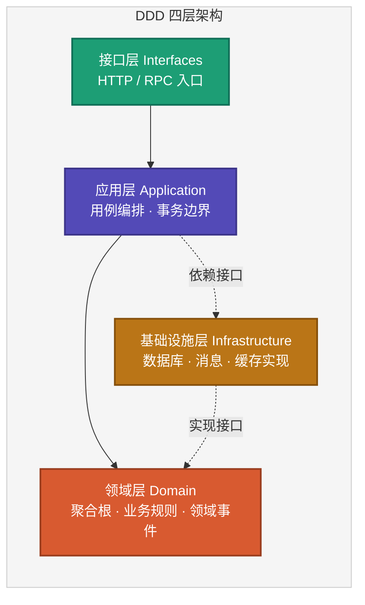
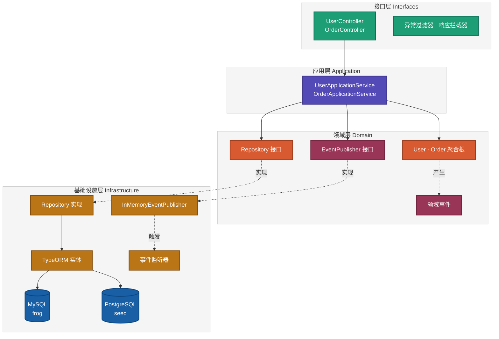
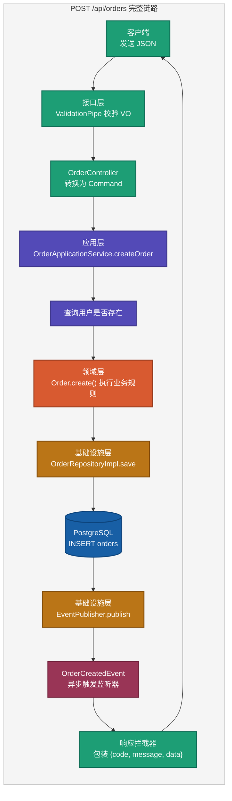
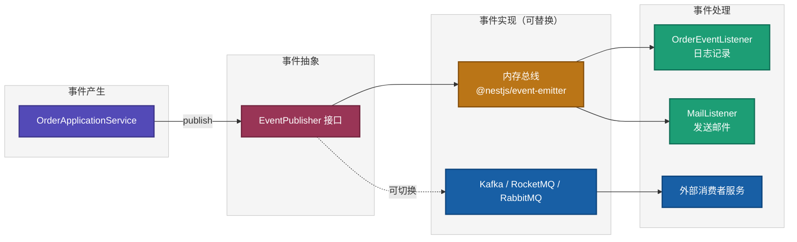
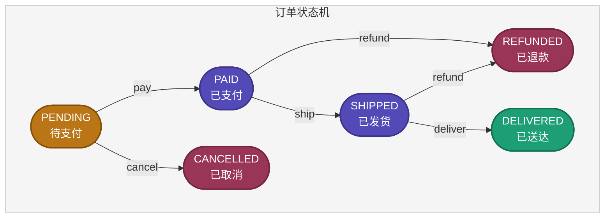

# 一款基于 NestJS 的 DDD 脚手架，开箱即用

> 一个基于 **NestJS 10 + TypeORM** 的领域驱动设计（DDD）Node.js 脚手架，内置双数据库、领域事件、统一响应、Swagger 文档与 Docker 一键启动示例。

## 这是什么

**nestjs-ddd** 是一个面向 Node.js / TypeScript 的 DDD 工程脚手架，帮你用几分钟时间搭好一个符合 DDD 分层规范的后端服务。

项目内置 **用户（User）** 和 **订单（Order）** 两个示例聚合，用户库走 MySQL、订单库走 PostgreSQL，包含 15 个 REST 接口、领域事件发布与监听、Swagger 文档、Docker Compose 一键启动。

功能与 [`gin-ddd`](https://github.com/microwind/design-patterns/blob/main/practice-projects/gin-ddd/Gin-Framework-DDD-Scaffold.md) / [`springboot4ddd`](https://github.com/microwind/design-patterns/blob/main/practice-projects/springboot4ddd/Springboot4DDD-Scaffold.md) 对齐，便于对比不同语言栈在 DDD 工程中的落地差异。

- 项目目录：`practice-projects/nestjs-ddd/`
- 源码地址：[github.com/microwind/design-patterns](https://github.com/microwind/design-patterns/tree/main/practice-projects/nestjs-ddd)
- 开发指南：[`NestJS-DDD-Development-Guide.md`](https://github.com/microwind/design-patterns/blob/main/practice-projects/nestjs-ddd/NestJS-DDD-Development-Guide.md)

## DDD概念速览

> 更系统的讲解见 [`domain-driven-design/README.md`](https://github.com/microwind/design-patterns/blob/main/domain-driven-design/README.md)。

**DDD（领域驱动设计）** 把软件按业务概念分层建模，让代码结构和业务知识保持一致。相比 MVC，DDD 把核心业务规则集中放在 **领域层** 里，而不是散落在 Controller / Service 的流程代码中。

### 四层结构



| 层 | 关注点 | 约束 |
|----|--------|------|
| **接口层** | HTTP 协议适配（VO / 路由 / 过滤器） | 不写业务逻辑 |
| **应用层** | 用例编排、事务、DTO / Command | 只依赖领域层 |
| **领域层** | 业务规则、聚合、领域事件、仓储接口 | **零框架依赖** |
| **基础设施层** | TypeORM、消息、邮件等技术实现 | 向上实现领域接口 |

一句话：**MVC 按技术切，DDD 按业务切**。业务越复杂，DDD 的价值越明显。

## 为什么 Node.js 也要用 DDD？

有人会觉得：Node.js 是不是写写脚本、BFF 就够了，没必要用 DDD？

**结论很简单：用不用 DDD 和语言无关，和业务复杂度有关。**

- **小项目**：NestJS 默认的 `Module / Controller / Service` 三件套就够用，没必要上 DDD。
- **中大型项目**（模块超过 10 个、接口超过 50 个、业务规则密集），很容易出现：
  - Service 越写越臃肿，一个方法里掺杂参数校验、业务规则、事务、事件、ORM 细节；
  - 对象退化成只有 getter/setter 的"贫血模型"，业务散落在各个 Service；
  - 新来的人看不懂代码结构在表达什么业务。
- **这时候用 DDD 就能把代码按业务语义重新切清楚**：
  - **聚合根** 持有业务规则，不再被 Service 侵蚀；
  - **应用服务** 只负责编排和事务，职责非常薄；
  - **仓储接口 + 依赖倒置** 让领域层完全独立于数据库/框架。
- **TypeScript + NestJS 特别适合落地 DDD**：强类型表达值对象/聚合，装饰器 + DI 天然契合依赖倒置，几乎不用造轮子。

## 核心特点

- 严格 **DDD 四层架构**：`domain` / `application` / `infrastructure` / `interfaces`
- **NestJS 10 + TypeORM 0.3**：现代企业级 Node.js 技术栈
- **双数据库**：MySQL（用户） + PostgreSQL（订单），TypeORM 多数据源独立管理
- **领域事件**：基于 `@nestjs/event-emitter` 的内存事件总线，接口化可切换 Kafka / RabbitMQ / RocketMQ
- **统一 API 契约**：snake_case JSON + `{ code, message, data }` 响应格式
- **自动响应包装 + 全局异常**：Controller 只需返回 DTO，异常自动转换
- **Swagger 文档**：启动即可访问 `http://localhost:8080/docs`
- **YAML 配置**：和 gin-ddd 对齐，支持多环境
- **Docker Compose**：一条命令拉起 MySQL + PostgreSQL + App
- **零业务侵入的参数校验**：`class-validator` 装饰器

## 技术栈

| 技术 | 版本 | 用途 |
|------|------|------|
| Node.js | 18+ | 运行时 |
| TypeScript | 5.5 | 强类型 |
| NestJS | 10.x | Web 框架 |
| TypeORM | 0.3.x | ORM（多数据源） |
| MySQL | 8.0+ | 用户库默认 |
| PostgreSQL | 14+ | 订单库默认 |
| class-validator | 0.14 | DTO 校验 |
| @nestjs/event-emitter | 2.x | 内存事件总线 |
| @nestjs/swagger | 7.x | OpenAPI |
| js-yaml | 4.x | YAML 配置 |

## 工程结构



### 目录结构

```
nestjs-ddd/
├── config/
│   ├── config.yaml                  # 本地开发配置
│   └── config.docker.yaml           # Docker 环境配置
├── docs/
│   ├── init.mysql.sql               # 用户库 schema + 测试数据
│   └── init.postgres.sql            # 订单库 schema + 测试数据
├── Dockerfile                       # 多阶段构建
├── compose.yaml                     # 一键拉起 DB + App
├── src/
│   ├── domain/                      # 领域层（纯业务）
│   │   ├── shared/events/
│   │   ├── user/{model,repository}
│   │   └── order/{model,repository,events}
│   ├── application/                 # 应用层（用例编排）
│   │   ├── user/{dto,user-application.service.ts}
│   │   └── order/{dto,order-application.service.ts}
│   ├── infrastructure/              # 基础设施层（技术实现）
│   │   ├── config/
│   │   ├── persistence/{user,order}
│   │   └── messaging/
│   ├── interfaces/http/             # 接口层（HTTP 适配）
│   │   ├── common/ · filters/ · interceptors/
│   │   ├── user/ · order/
│   │   └── app.controller.ts
│   ├── modules/                     # NestJS 模块装配
│   ├── app.module.ts
│   └── main.ts
└── README.md
```

## 请求生命周期

以"创建订单"为例，展示请求在四层之间的流转：



## 快速开始

### 1. 环境准备

- Node.js 18+ / npm 9+
- MySQL 8.0+、PostgreSQL 14+（或直接用 `docker compose`）

### 2. 初始化数据库（首次必做）

脚手架默认 `synchronize: false`（生产安全），需要先用 init SQL 建表：

```bash
mysql -u root -p < docs/init.mysql.sql

psql -U postgres -c "CREATE DATABASE seed;"
psql -U postgres -d seed -f docs/init.postgres.sql
```

> 两个脚本都是可重复执行的（内置 `DROP TABLE IF EXISTS`），跑过旧版本也能直接覆盖。

### 3. 安装依赖并启动

```bash
npm install
npm run start:dev
```

启动后访问：

- API 前缀：`http://localhost:8080/api`
- **Swagger 文档**：`http://localhost:8080/docs`
- 健康检查：`http://localhost:8080/health`

### 4. 一键 Docker 启动（推荐新手）

不想本地装数据库，直接：

```bash
docker compose up -d        # MySQL + PostgreSQL + App 全部起
docker compose logs -f app  # 观察启动日志
docker compose down -v      # 彻底清理
```

`compose.yaml` 会自动把 `docs/*.sql` 挂到容器的 `/docker-entrypoint-initdb.d/`，首次启动自动建表。

### 5. 试一下接口

```bash
# 创建用户
curl -X POST http://localhost:8080/api/users \
  -H 'Content-Type: application/json' \
  -d '{"name":"jarry","email":"jarry@example.com"}'

# 创建订单（注意 snake_case）
curl -X POST http://localhost:8080/api/orders \
  -H 'Content-Type: application/json' \
  -d '{"user_id":1,"total_amount":99.9}'

# 支付订单（状态机转换）
curl -X PUT http://localhost:8080/api/orders/1/pay
```

统一响应格式：

```json
{ "code": 200, "message": "success", "data": { "id": 1, "status": "PAID" } }
```

更多接口列表和开发细节见 [`NestJS-DDD-Development-Guide.md`](https://github.com/microwind/design-patterns/blob/main/practice-projects/nestjs-ddd/NestJS-DDD-Development-Guide.md)。

## 事件驱动设计

领域层定义事件接口，基础设施层提供实现，**业务代码只和接口打交道**，这样就可以在不改业务的前提下，把事件总线从内存切到 Kafka / RocketMQ / RabbitMQ。



订单事件：`order.created` / `order.paid` / `order.shipped` / `order.delivered` / `order.cancelled` / `order.refunded`。

## 订单状态机

订单的业务规则用状态机表达，全部封装在 `Order` 聚合根内部，外部只能通过 `pay()` / `ship()` / `deliver()` 等方法触发合法转换：



## 和 gin-ddd / springboot4ddd 对比

| 维度 | gin-ddd (Go) | springboot4ddd (Java) | nestjs-ddd (TS) |
|------|--------------|----------------------|-----------------|
| Web 框架 | Gin | Spring Boot 4 | NestJS 10 |
| ORM | GORM | JdbcTemplate / Spring Data | TypeORM |
| IoC | 手工装配 | Spring | NestJS DI |
| 事件总线 | RocketMQ | RocketMQ | event-emitter（可换） |
| 参数校验 | binding tag | Jakarta Validation | class-validator |
| API 文档 | 无 | springdoc-openapi | @nestjs/swagger |
| 启动 | `go run` | `mvn spring-boot:run` | `npm run start:dev` |

**数据库 schema / API 契约 / 业务规则三端完全对齐**，可以直接用同一份 Postman 集合跨语言调用，非常适合对比学习。

## 相关链接

- 本项目源码：[practice-projects/nestjs-ddd](https://github.com/microwind/design-patterns/tree/main/practice-projects/nestjs-ddd)
- Go 版：[practice-projects/gin-ddd](https://github.com/microwind/design-patterns/tree/main/practice-projects/gin-ddd)
- Java 版：[practice-projects/springboot4ddd](https://github.com/microwind/design-patterns/tree/main/practice-projects/springboot4ddd)
- DDD 多语言对比：[`domain-driven-design/`](https://github.com/microwind/design-patterns/tree/main/domain-driven-design)
