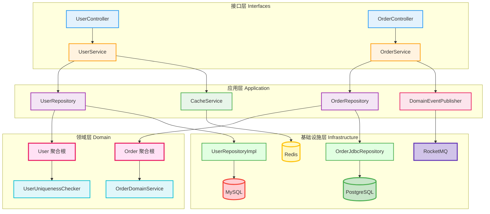
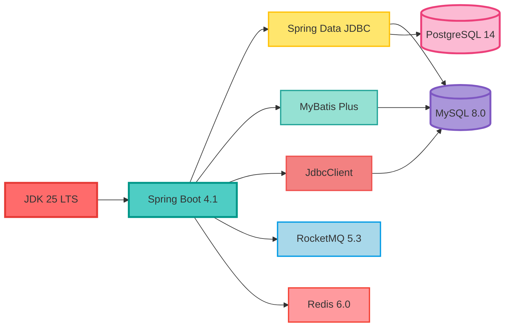
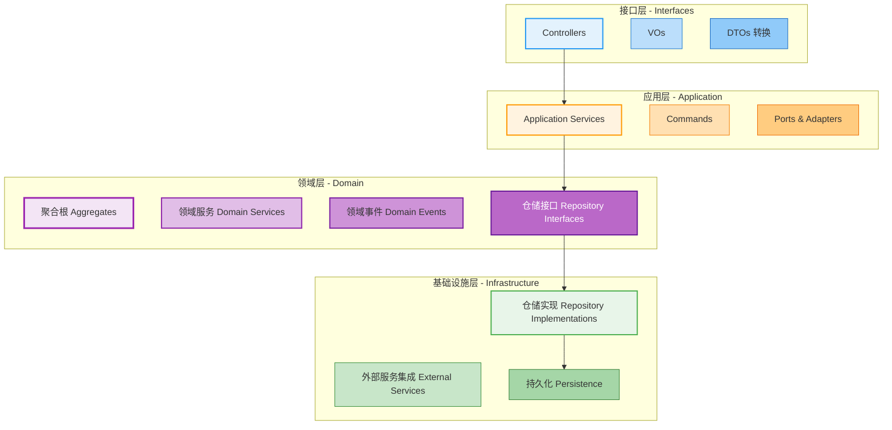
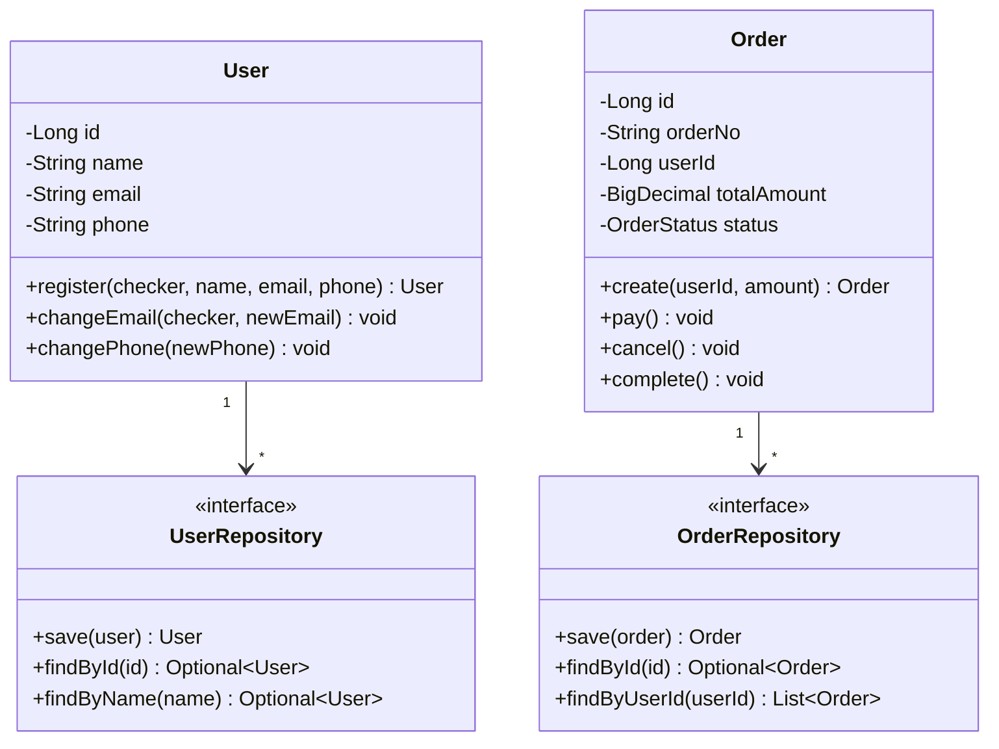
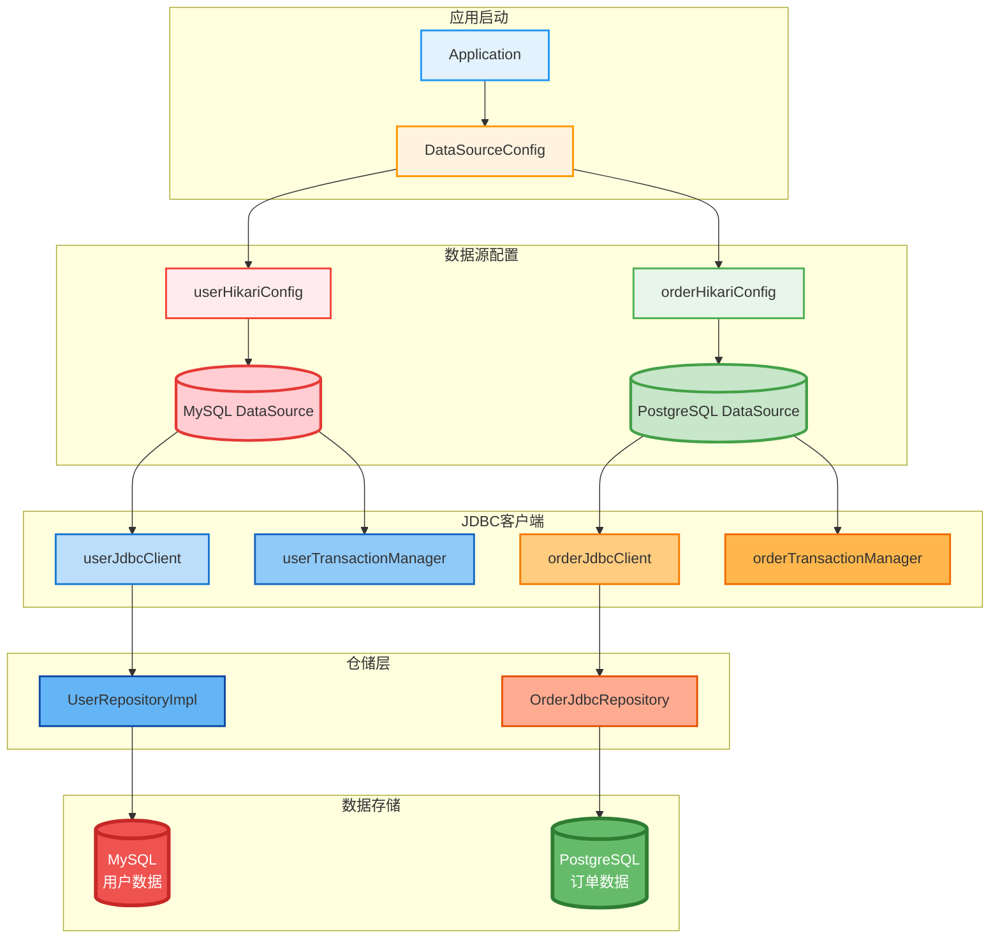
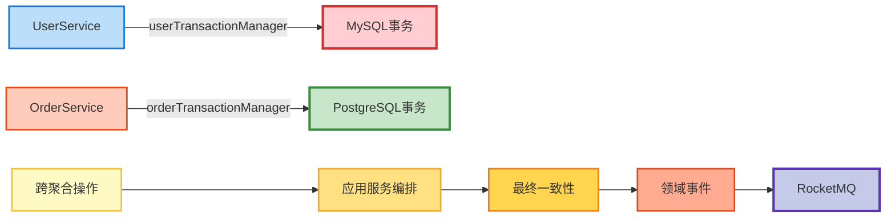
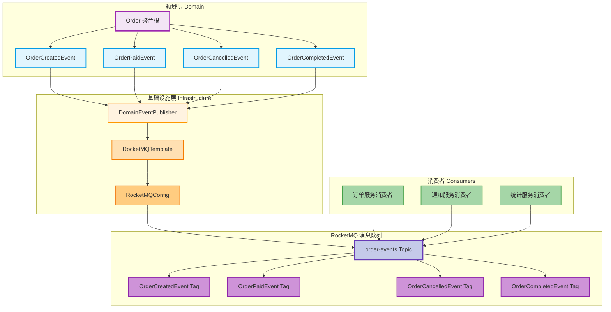
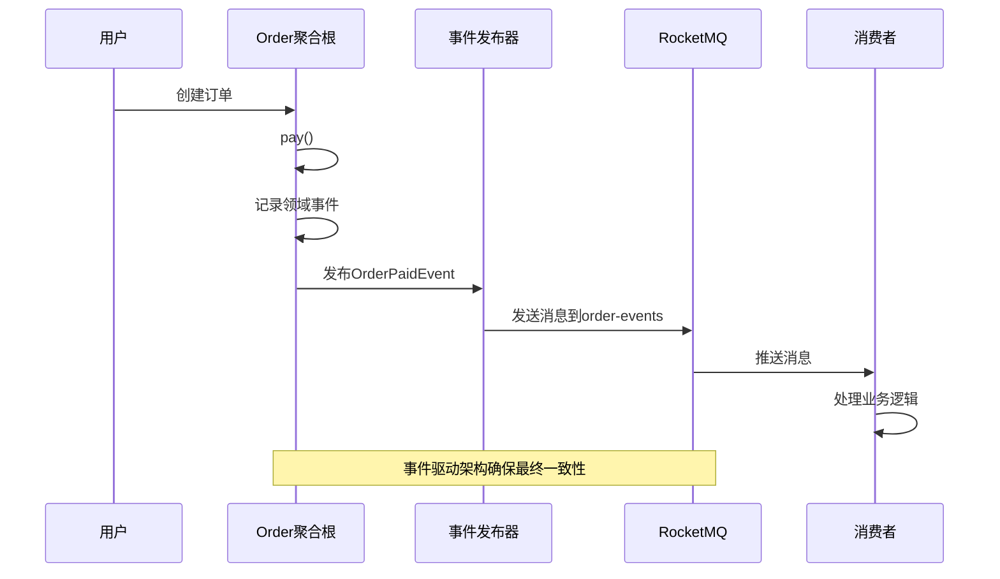
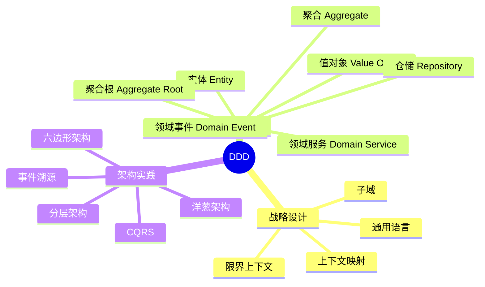

# Spring Boot 4.1 + JDK 25 DDD开源脚手架，面向 AI 编程

> **新一代 Java 企业级开发脚手架** - 基于新版 Spring Boot和 JDK，严格遵循 DDD 架构，开箱即用，打造 AI 编程最佳实践

## 为什么选择这个脚手架？

基于 Spring Boot 4.1 与 JDK 25，严格遵循 DDD 架构设计，内置多数据源支持，开箱即用。沉淀统一的工程规范与最佳实践，为 AI Coding 提供高质量上下文，实现更准确、更一致的代码生成。2026年，转型 AI 编程，从最新脚手架开始。这份代码不只是给你看的，更是给 AI 读的，用来指导 AI 按什么架构来写代码。

### 核心特性
- **最新技术栈** - Spring Boot 4.1 + JDK 25 LTS，享受最新特性和性能优化

- **DDD 架构** - 严格遵循领域驱动设计，四层架构清晰分离，让复杂变清晰

- **多数据源** - MySQL + PostgreSQL 双数据源，独立事务管理，你可以自由选择

- **事件驱动** - RocketMQ 支持领域事件发布，实现最终一致性

- **安全可靠** - 完整的鉴权机制和异常处理体系，实现系统可靠性

### 架构优雅


### 核心优势
| 特性 | 传统项目 | 本脚手架 | 收益 |
|------|---------|---------|------|
| **架构搭建** | 1-2周 | 10分钟 | ⚡ **90%+ 时间节省** |
| **代码规范** | 靠自觉 | 强制约束 | 📏 **架构一致性** |
| **多数据源** | 手动配置 | 开箱即用 | 🔌 **即插即用** |
| **领域建模** | 缺乏指导 | DDD 最佳实践 | 🎯 **业务清晰** |
| **技术栈** | 版本老旧 | 最新稳定 | 🚀 **技术领先** |

**源码地址**：https://github.com/microwind/design-patterns/tree/main/practice-projects/springboot4ddd

---

## 技术栈与优势

### 核心技术架构


### 数据库操作技术
| 技术 | 版本 | 用途 | 特点 |
|------|------|------|------|
| **JdbcClient** | - | 数据访问 | Spring最新JDBC方式，流畅API，类型安全，简化参数绑定 |
| **Spring Data JDBC** | - | ORM框架 | 轻量级，符合DDD理念，无JPA复杂性 |
| **MyBatis Plus** | 3.5.16 | SQL增强 | 强大的SQL增强，支持复杂查询，代码生成器提升效率 |
| **多数据源** | - | 数据源管理 | HikariCP连接池，独立事务管理，优雅降级机制 |

### 消息队列与缓存
| 技术 | 版本 | 用途 | 特点 |
|------|------|------|------|
| **RocketMQ** | 5.3+ | 消息队列 | 事件驱动架构，领域事件发布，优雅降级，主题隔离 |
| **Redis** | 6.0+ | 缓存 | 分布式缓存，性能优化，支持多种数据结构，集群模式 |

### 安全与鉴权
| 特性 | 说明 |
|------|------|
| **API 签名验证** | 内置完整的接口安全认证机制，防止请求篡改 |
| **统一响应格式** | 标准化的API响应结构，便于前端处理 |
| **全局异常处理** | 优雅的错误捕获和响应，统一的错误码体系 |
| **参数校验** | 基于Jakarta Validation的数据验证，自动校验请求参数 |

---

## DDD 架构设计

### 四层架构


### 领域模型示例


---

## 多数据源架构

### 数据源配置


### 事务管理策略


---

## 事件驱动架构

### RocketMQ 消息架构


### 消息发布流程


### RocketMQ 配置特性
- **优雅降级**: 当 RocketMQ 不可用时，系统仍能正常启动
- **主题隔离**: 订单事件使用独立的 `order-events` 主题
- **标签分类**: 不同事件类型使用不同标签便于过滤
- **配置验证**: 启动时自动验证配置，失败记录警告

### 消息类型
| 事件类型 | 标签 | 说明 | 触发时机 |
|---------|------|------|---------|
| **OrderCreatedEvent** | OrderCreatedEvent | 订单创建事件 | 订单首次保存后 |
| **OrderPaidEvent** | OrderPaidEvent | 订单支付事件 | 订单支付成功 |
| **OrderCancelledEvent** | OrderCancelledEvent | 订单取消事件 | 订单取消操作 |
| **OrderCompletedEvent** | OrderCompletedEvent | 订单完成事件 | 订单完成操作 |

### 配置示例
```yaml
rocketmq:
  name-server: localhost:9876
  producer:
    group: order-producer-group
  consumer:
    group: order-consumer-group
  fallback:
    enabled: true  # 启用优雅降级
```

---

## 项目结构

```
springboot4ddd/
├── src/main/java/com/github/microwind/springboot4ddd/
│   ├── interfaces/              # 接口层
│   │   ├── controller/          # REST控制器
│   │   ├── vo/                  # 视图对象
│   │   └── annotation/          # 自定义注解
│   │
│   ├── application/            # 应用层
│   │   ├── service/            # 应用服务
│   │   ├── command/            # 命令对象
│   │   ├── dto/                # 数据传输对象
│   │   └── port/               # 端口接口
│   │
│   ├── domain/                 # 领域层
│   │   ├── model/              # 领域模型
│   │   ├── repository/         # 仓储接口
│   │   ├── service/            # 领域服务
│   │   └── event/              # 领域事件
│   │
│   └── infrastructure/         # 基础设施层
│       ├── repository/         # 仓储实现
│       ├── config/             # 配置类
│       ├── client/             # 外部服务客户端
│       └── messaging/          # 消息处理
│
├── src/main/resources/
│   ├── application.yml         # 主配置文件
│   ├── application-dev.yml     # 开发环境配置
│   └── application-prod.yml    # 生产环境配置
│
└── pom.xml                     # Maven配置
```

---

## 快速开始

### 1. 获取脚手架

#### 方式一：克隆完整仓库
```bash
git clone https://github.com/microwind/design-patterns.git
cd design-patterns/practice-projects/springboot4ddd
```

#### 方式二：按需拉取（推荐）
```bash
# 使用 sparse-checkout 只拉取 springboot4ddd 目录
git clone --no-checkout https://github.com/microwind/design-patterns.git
cd design-patterns
git sparse-checkout init --cone
git sparse-checkout set practice-projects/springboot4ddd
git checkout
cd practice-projects/springboot4ddd
```

### 2. 环境要求
- JDK 25+
- Maven 3.8+
- MySQL 8.0+
- PostgreSQL 14+
- Redis 6.0+ (可选)
- RocketMQ 5.3+ (可选)

### 3. 配置数据源
编辑 `src/main/resources/application-dev.yml`:

```yaml
spring:
  user:
    datasource:
      jdbc-url: jdbc:mysql://localhost:3306/user_db
      username: root
      password: password
  order:
    datasource:
      jdbc-url: jdbc:postgresql://localhost:5432/order_db
      username: postgres
      password: password
```

### 4. 启动应用
```bash
./mvnw spring-boot:run
```

### 5. 访问API
```bash
# 创建用户
curl -X POST http://localhost:8080/api/users \
  -H "Content-Type: application/json" \
  -d '{"name":"张三","email":"zhangsan@example.com","phone":"13800138000"}'

# 查询用户
curl http://localhost:8080/api/users/1

# 创建订单
curl -X POST http://localhost:8080/api/orders \
  -H "Content-Type: application/json" \
  -d '{"userId":1,"totalAmount":99.99}'
```

---

## Agent CLI 编程指南

### 在 Agent CLI 模式下使用脚手架

```bash
# 1. 进入新建项目目录
cd your-new-project

# 2. 启动 Agent CLI（如 Claude Code、Codex CLI、Cursor Agent 等）
claude-code

# 3. 指定 DDD 脚手架作为参考项目
请以 `springboot4ddd` 脚手架作为参考：
<脚手架项目实际路径>

重点参考以下内容：
- pom.xml（依赖与技术栈）
- src/main/java/com/github/microwind/springboot4ddd/infrastructure/config/DataSourceConfig.java（多数据源配置）
- src/main/java/com/github/microwind/springboot4ddd/infrastructure/repository/user/UserRepositoryImpl.java（仓储实现示例）
- src/main/java/com/github/microwind/springboot4ddd/domain/model/user/User.java（领域模型示例）

# 4. 以脚手架为蓝本生成代码
请参考该脚手架的工程结构、编码规范和最佳实践，在当前项目中生成代码，并遵循以下约束：

【架构分层】
- interfaces/：接口层，包含 Controller、DTO、VO
- application/：应用层，包含 Application Service、Command、Query
- domain/：领域层，包含领域模型、领域服务、仓储接口
- infrastructure/：基础设施层，包含仓储实现、配置、数据库访问

【技术规范】
- 使用 Spring Boot 4.1 + JDK 25
- 数据访问使用 JdbcClient
- 支持多数据源，通过 @Qualifier 指定数据源
- 使用 @Transactional 指定事务管理器
- 领域事件统一通过 DomainEventPublisher 发布
- 统一使用全局异常处理机制

【编码规范】
- 领域层保持纯净，不依赖 Spring
- Repository 接口位于 Domain 层，实现位于 Infrastructure 层
- 优先采用 Builder 模式创建复杂对象
- 遵循 DDD、SOLID 和单一职责原则
- 保持与参考脚手架一致的代码风格和目录结构

请以该脚手架为蓝本，在当前项目中实现：

【你的需求】
- xxx
```

### Agent CLI 最佳实践

1. **上下文预加载** - 在开始任务前，让 Agent 先阅读关键配置文件和现有实现
2. **架构约束明确** - 在每个任务开始时，重申必须遵循的架构规范
3. **分步执行** - 将复杂任务分解为多个步骤，逐步实现
4. **代码审查** - 让 Agent 检查生成的代码是否符合 DDD 架构和项目规范
5. **持续反馈** - 根据生成结果调整提示词，优化 Agent 的理解

### 常用 CLI 提示词模板

**创建新聚合根：**
```
请参考 User 聚合根的实现，在 domain/model/ 下创建一个新的 [聚合根名称] 聚合根：
1. 领域模型放在 domain/model/ 目录
2. 不依赖任何 Spring 注解
3. 使用静态工厂方法创建实例
4. 包含业务逻辑验证
5. 在 domain/repository/ 创建对应的仓储接口
```

**实现仓储层：**
```
请参考 UserRepositoryImpl 的实现，在 infrastructure/repository/ 下创建 [仓储名称]Impl：
1. 使用 JdbcClient 进行数据库操作
2. 通过 @Qualifier 注入对应的数据源
3. 实现领域层定义的仓储接口
4. 使用流畅的 JdbcClient API 风格
```

**添加领域事件：**
```
请参考现有的领域事件实现，为 [聚合根名称] 添加领域事件：
1. 在 domain/event/ 下创建事件类
2. 在聚合根中记录领域事件
3. 通过 DomainEventPublisher 发布事件
4. 在 infrastructure/messaging/ 下创建消息转换器
```

---

## 核心特性

### 1. JdbcClient 使用示例
```java
// 传统 JdbcTemplate
String sql = "SELECT * FROM users WHERE id = ?";
User user = jdbcTemplate.queryForObject(sql, userRowMapper, id);

// 新版 JdbcClient (推荐)
User user = jdbcClient.sql("SELECT * FROM users WHERE id = ?")
    .param(id)
    .query((rs, rowNum) -> mapToUser(rs))
    .optional()
    .orElseThrow();
```

### 2. 多数据源事务
```java
@Service
@Transactional(transactionManager = "userTransactionManager")
public class UserService {
    // 自动使用 MySQL 事务管理器
}

@Service  
@Transactional(transactionManager = "orderTransactionManager")
public class OrderService {
    // 自动使用 PostgreSQL 事务管理器
}
```

### 3. 领域事件发布
```java
public class Order {
    public void pay() {
        this.status = OrderStatus.PAID;
        recordEvent(new OrderPaidEvent(this.id, this.orderNo));
    }
}
```

### 4. 聚合根设计
```java
// 纯领域模型，无框架依赖
public class User {
    // 私有构造函数，强制使用工厂方法
    private User(Long id, String name, String email) {
        this.id = id;
        this.name = name;
        this.email = email;
    }
    
    // 静态工厂方法
    public static User register(UserUniquenessChecker checker, 
                               String name, String email) {
        if (checker.existsByName(name)) {
            throw new UniquenessViolationException("用户名已存在");
        }
        return new User(null, name, email);
    }
}
```

---

## 学习资源

### DDD 核心概念


### 适用场景
- ✅ 中大型企业应用
- ✅ 复杂业务逻辑系统
- ✅ 需要长期维护的项目
- ✅ 团队协作开发
- ✅ 领域模型清晰的业务

AI编程下的各种场景都适用，可以让你的代码结构更清晰，让AI不跑偏。

---

## 最佳实践

### 1. 领域层纯净
```java
// ✅ 正确 - 领域层无框架依赖
package com.github.microwind.springboot4ddd.domain.model.user;

public class User {
    // 纯Java代码，无Spring注解
    private Long id;
    private String name;
    
    public static User register(String name, String email) {
        // 业务逻辑
        return new User(null, name, email);
    }
}

// ❌ 错误 - 领域层包含框架依赖
@Entity
public class User {
    @Id
    @GeneratedValue
    private Long id;
    
    @Autowired
    private UserRepository repository;
}
```

### 2. 仓储接口在领域层
```java
// ✅ 正确 - 接口在领域层
package com.github.microwind.springboot4ddd.domain.repository;

public interface UserRepository {
    User save(User user);
    Optional<User> findById(Long id);
}

// 实现在基础设施层
package com.github.microwind.springboot4ddd.infrastructure.repository;

@Repository
public class UserRepositoryImpl implements UserRepository {
    private final JdbcClient jdbcClient;
    
    @Override
    public User save(User user) {
        // JdbcClient实现
    }
}
```

### 3. 应用服务编排
```java
@Service
@RequiredArgsConstructor
public class OrderService {
    private final OrderRepository orderRepository;
    private final UserRepository userRepository;
    private final DomainEventPublisher eventPublisher;
    
    @Transactional
    public OrderDTO createOrder(CreateOrderCommand command) {
        // 1. 验证用户存在
        User user = userRepository.findById(command.getUserId())
            .orElseThrow(() -> new EntityNotFoundException("用户不存在"));
        
        // 2. 创建订单领域对象
        Order order = Order.create(user.getId(), command.getTotalAmount());
        
        // 3. 保存订单
        Order savedOrder = orderRepository.save(order);
        
        // 4. 发布领域事件
        eventPublisher.publishOrderCreated(savedOrder);
        
        return OrderDTO.from(savedOrder);
    }
}
```

---

## 适用人群

### 目标开发者：
适合所有转型AI编程的人
- 👨‍💻 **Java后端工程师** - 希望学习DDD架构
- 🏗️ **架构师** - 需要参考企业级项目架构
- 🚀 **技术负责人** - 寻找团队开发规范
- 📚 **学习者** - 想要了解Spring Boot 4.1新特性
- 🔧 **全栈开发者** - 需要快速搭建项目原型

### 技能提升
通过本项目可以学到：
- 🏛️ DDD架构设计思想
- 🔌 多数据源配置和管理
- 📡 事件驱动架构实现
- 🎯 领域建模最佳实践
- ⚡ Spring Boot 4.1新特性

---

## 相关资源

- **源码地址**: https://github.com/microwind/design-patterns/tree/main/practice-projects/springboot4ddd
- **Spring Boot 4.1 文档**: https://docs.spring.io/spring-boot/docs/4.1.0/reference/html/
- **JDK 25 新特性**: https://openjdk.org/projects/jdk/25/
- **DDD 参考**: https://github.com/microwind/design-patterns/tree/main/domain-driven-design
- **AI编程核心知识库**：https://microwind.github.io/

---

## 开始你的 DDD 之旅

```bash
git clone https://github.com/microwind/design-patterns.git
cd design-patterns/practice-projects/springboot4ddd
./mvnw spring-boot:run
```

**几分钟后，你将拥有一个生产级的 DDD 应用！** 🚀
