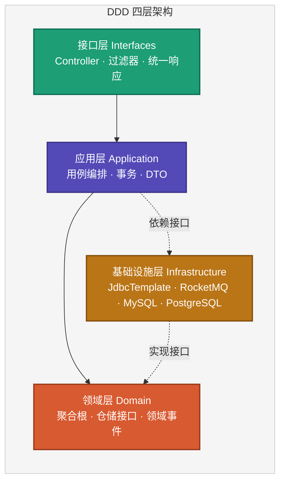

# 一款开箱即用的Spring Boot 4 DDD工程脚手架

> 一个开箱即用的 DDD（领域驱动设计）工程脚手架，基于 Spring Boot 4.0.1 和 Java 21

## 🎯 这是什么？

**Springboot4DDD** 是一个开箱即用的 Java DDD 工程脚手架，帮助开发者快速搭建符合领域驱动设计原则的Web应用。结构简单清晰，帮助你快速上手Java开发。
源码地址：https://github.com/microwind/design-patterns/tree/main/practice-projects/springboot4ddd

### 核心特点
✅ **严格的 DDD 四层架构** - 领域层、应用层、基础设施层、接口层分离清晰<br>
✅ **事件驱动架构** - 集成 RocketMQ，支持领域事件发布和消费<br>
✅ **多数据源支持** - 开箱支持 MySQL + PostgreSQL 双数据源<br>
✅ **双持久化方案** - JdbcTemplate 和 Spring Data JDBC 两种方式可选<br>
✅ **API 签名验证** - 内置完整的接口安全认证机制<br>
✅ **统一响应格式** - 标准化的 API 响应结构<br>
✅ **全局异常处理** - 优雅的错误捕获和响应<br>
✅ **参数校验** - 基于 Jakarta Validation 的数据验证<br>
✅ **生产就绪** - 完整的日志、配置、事务管理

### 技术栈

| 技术 | 版本 | 说明 |
|------|------|------|
| Spring Boot | 4.0.1 | 最新稳定版 |
| Java | 21 | LTS 版本 |
| MySQL | 8.0+ | 用户数据存储 |
| PostgreSQL | 14+ | 订单数据存储 |
| Redis | 6.0+ | 缓存（可选） |
| RocketMQ | 5.3+ | 消息队列（事件驱动） |
| Lombok | - | 简化代码 |
| Maven | 3.8+ | 构建工具 |

---

## 💡 为什么选择这个脚手架？

### 1. 节省时间

无需从零搭建项目架构，克隆即用，专注业务开发。

**对比**：
- ❌ 传统方式：1-2周搭建基础架构
- ✅ 使用脚手架：10分钟完成初始化

### 2. 架构规范

严格遵循 DDD 分层原则，避免代码混乱。

**收益**：
- 业务逻辑内聚在领域对象中
- 各层职责清晰，易于维护
- 支持单元测试和集成测试

### 3. 最佳实践

集成了企业级开发的最佳实践。

**包含**：
- 统一响应格式
- 全局异常处理
- API 签名验证
- 多数据源管理
- 跨数据库查询

### 4. 易于扩展

模块化设计，轻松添加新功能。

**示例**：
- 5分钟添加新的业务实体
- 10分钟集成 Redis 缓存
- 15分钟接入 RocketMQ 消息队列

---

## 📁 工程结构详解

### 架构总览



| 层 | 关注点 | 约束 |
|----|--------|------|
| **接口层** | HTTP 适配（Controller / 过滤器 / 统一响应） | 不写业务逻辑 |
| **应用层** | 用例编排、事务边界、DTO 转换 | 只依赖领域层 |
| **领域层** | 业务规则、聚合根、领域事件、仓储接口 | **零框架依赖** |
| **基础设施层** | JdbcTemplate / Spring Data JDBC / RocketMQ 等实现 | 向上实现领域接口 |

### 目录结构

```
springboot4ddd/
├── src/main/java/com/github/microwind/springboot4ddd/
│   │
│   ├── Application.java                              # Spring Boot 启动类
│   │
│   ├── domain/                                       # 【领域层】核心业务逻辑
│   │   ├── model/                                    # 领域模型
│   │   │   ├── order/
│   │   │   │   └── Order.java                        # 订单聚合根（包含业务方法）
│   │   │   └── user/
│   │   │       └── User.java                         # 用户实体
│   │   │
│   │   ├── repository/                               # 仓储接口（由基础设施层实现）
│   │   │   ├── order/
│   │   │   │   └── OrderRepository.java              # 订单仓储接口
│   │   │   └── user/
│   │   │       └── UserRepository.java               # 用户仓储接口
│   │   │
│   │   ├── event/                                    # 🆕 领域事件定义
│   │   │   ├── DomainEvent.java                      # 领域事件接口
│   │   │   ├── OrderEvent.java                       # 订单事件
│   │   │   ├── UserEvent.java                        # 用户事件
│   │   │   └── EventPublisher.java                   # 事件发布器接口
│   │   │
│   │   └── service/                                  # 领域服务（跨聚合的业务逻辑）
│   │       └── [领域服务类]
│   │
│   ├── application/                                  # 【应用层】业务编排
│   │   ├── dto/                                      # 数据传输对象
│   │   │   └── order/
│   │   │       ├── OrderDTO.java                     # 订单 DTO
│   │   │       └── OrderMapper.java                  # 实体与DTO转换
│   │   │
│   │   └── service/                                  # 应用服务（编排领域对象）
│   │       ├── order/
│   │       │   └── OrderService.java                 # 订单应用服务
│   │       └── user/
│   │           └── UserService.java                  # 用户应用服务
│   │
│   ├── infrastructure/                               # 【基础设施层】技术支撑
│   │   ├── common/                                   # 通用组件
│   │   │   ├── ApiResponse.java                      # 统一 API 响应
│   │   │   └── GlobalExceptionHandler.java           # 全局异常处理
│   │   │
│   │   ├── config/                                   # 配置类
│   │   │   ├── DataSourceConfig.java                 # 多数据源配置
│   │   │   ├── OrderJdbcConfig.java                  # Spring Data JDBC 配置
│   │   │   ├── SignConfig.java                       # 签名配置
│   │   │   ├── WebConfig.java                        # Web 配置
│   │   │   ├── JacksonConfig.java                    # JSON 序列化配置
│   │   │   └── ApiAuthConfig.java                    # API 认证配置
│   │   │
│   │   ├── constants/                                # 常量定义
│   │   │   └── ErrorCode.java                        # 错误码定义
│   │   │
│   │   ├── exception/                                # 自定义异常
│   │   │   ├── BusinessException.java                # 业务异常
│   │   │   └── ResourceNotFoundException.java        # 资源不存在异常
│   │   │
│   │   ├── middleware/                               # 中间件
│   │   │   ├── SignatureInterceptor.java             # 签名拦截器
│   │   │   ├── CachedBodyFilter.java                 # 请求体缓存过滤器
│   │   │   └── CachedBodyHttpServletRequest.java     # 请求体缓存包装类
│   │   │
│   │   ├── repository/                               # 仓储实现
│   │   │   ├── order/
│   │   │   │   └── OrderRepositoryImpl.java          # 订单仓储实现
│   │   │   ├── user/
│   │   │   │   └── UserRepositoryImpl.java           # 用户仓储实现
│   │   │   └── jdbc/
│   │   │       └── OrderJdbcRepository.java          # Spring Data JDBC 接口
│   │   │
│   │   ├── messaging/                              # 🆕 RocketMQ 消息处理
│   │   │   ├── config/
│   │   │   │   └── RocketMQConfig.java             # RocketMQ 配置
│   │   │   ├── producer/
│   │   │   │   └── OrderEventProducer.java         # 订单事件生产者
│   │   │   ├── consumer/
│   │   │   │   └── OrderEventConsumer.java         # 订单事件消费者
│   │   │   ├── message/
│   │   │   │   ├── OrderCreatedMessage.java        # 订单创建消息
│   │   │   │   ├── OrderPaidMessage.java           # 订单支付消息
│   │   │   │   ├── OrderCancelledMessage.java      # 订单取消消息
│   │   │   │   └── OrderCompletedMessage.java      # 订单完成消息
│   │   │   └── converter/
│   │   │       └── OrderEventMessageMapper.java    # 事件到消息转换器
│   │   │
│   │   └── util/                                     # 工具类
│   │       └── SignatureUtil.java                    # 签名工具
│   │
│   └── interfaces/                                   # 【接口层】对外暴露
│       ├── annotation/                               # 自定义注解
│       │   ├── RequireSign.java                      # 需要签名验证注解
│       │   ├── IgnoreSignHeader.java                 # 忽略签名验证注解
│       │   └── WithParams.java                       # 签名参数选项
│       │
│       ├── controller/                               # REST 控制器
│       │   ├── HealthController.java                 # 健康检查
│       │   ├── order/
│       │   │   └── OrderController.java              # 订单接口
│       │   └── user/
│       │       └── UserController.java               # 用户接口
│       │
│       └── vo/                                       # 视图对象（请求/响应）
│           ├── order/
│           │   ├── CreateOrderRequest.java           # 创建订单请求
│           │   ├── UpdateOrderRequest.java           # 更新订单请求
│           │   ├── OrderResponse.java                # 订单响应
│           │   └── OrderListResponse.java            # 订单列表响应
│           └── user/
│               ├── CreateUserRequest.java            # 创建用户请求
│               ├── UpdateUserRequest.java            # 更新用户请求
│               └── UserResponse.java                 # 用户响应
│
├── src/main/resources/
│   ├── application.yml                               # 主配置文件
│   ├── application-dev.yml                           # 开发环境配置
│   ├── application-prod.yml                          # 生产环境配置
│   ├── apiauth-config.yaml                           # API 认证配置
│   │
│   └── db/                                           # 数据库脚本
│       ├── mysql/
│       │   └── init_users.sql                        # MySQL 初始化脚本
│       └── postgresql/
│           └── init_orders.sql                       # PostgreSQL 初始化脚本
│
└── src/test/java/                                    # 测试代码
    └── com/github/microwind/springboot4ddd/
        └── ApplicationTests.java                     # 应用测试
```

### 各层职责说明

| 层级 | 位置 | 职责 | 关键原则 |
|------|------|------|---------|
| **领域层** | `domain/` | 核心业务逻辑、领域模型 | 独立于框架，业务规则内聚 |
| **应用层** | `application/` | 编排领域对象，管理事务 | 薄薄一层，不包含业务逻辑 |
| **基础设施层** | `infrastructure/` | 技术实现、持久化、配置 | 实现技术细节，对上层透明 |
| **接口层** | `interfaces/` | REST API、请求响应处理 | 处理外部交互，不含业务逻辑 |

---

## 🚀 快速开始

### 1. 环境准备

确保已安装：
- JDK 21
- Maven 3.8+
- MySQL 8.0+
- PostgreSQL 14+
- RocketMQ 5.3+ （用于事件驱动）
- Git

### 2. 克隆项目

```bash
git clone https://github.com/microwind/design-patterns.git
cd design-patterns/practice-projects/springboot4ddd
```

### 3. 启动 RocketMQ（可选，用于事件驱动）

```bash
# 启动 NameServer
cd rocketmq-all-5.3.2-bin-release
sh bin/mqnamesrv

# 启动 Broker
sh bin/mqbroker -n localhost:9876

# 检查集群状态
sh bin/mqadmin clusterList -n localhost:9876
```

### 4. 初始化数据库

**MySQL（用户数据）：**
```bash
mysql -u root -p
CREATE DATABASE frog CHARACTER SET utf8mb4;
CREATE USER 'frog_admin'@'localhost' IDENTIFIED BY 'frog_password';
GRANT ALL PRIVILEGES ON frog.* TO 'frog_admin'@'localhost';
USE frog;
source src/main/resources/db/mysql/init_users.sql;
```

**PostgreSQL（订单数据）：**
```bash
psql -U postgres
CREATE DATABASE seed ENCODING 'UTF8';
\c seed
\i src/main/resources/db/postgresql/init_orders.sql
```

### 5. 配置应用

编辑 `src/main/resources/application-dev.yml`：

```yaml
spring:
  datasource:
    user:
      jdbc-url: jdbc:mysql://localhost:3306/frog
      username: frog_admin
      password: frog_password  # 修改为你的密码

    order:
      jdbc-url: jdbc:postgresql://localhost:5432/seed
      username: postgres
      password: postgres_password  # 修改为你的密码

# RocketMQ 配置（可选）
rocketmq:
  name-server: localhost:9876
  producer:
    group: springboot4ddd-producer
    send-message-timeout: 3000
    retry-times-when-send-failed: 2
```

### 6. 启动应用

```bash
# 编译
./mvnw clean compile

# 运行
./mvnw spring-boot:run
```

### 7. 验证安装

```bash
# 健康检查
curl http://localhost:8080/api/health

# 查询用户列表
curl http://localhost:8080/api/users

# 查询订单列表
curl http://localhost:8080/api/orders/list
```

---

## 📝 如何基于脚手架开发新功能

### 场景：添加一个"商品管理"功能

#### 步骤 1：创建领域模型

在 `domain/model/product/` 下创建 `Product.java`：

```java
package com.github.microwind.springboot4ddd.domain.model.product;

import lombok.Data;
import org.springframework.data.annotation.Id;
import org.springframework.data.relational.core.mapping.Column;
import org.springframework.data.relational.core.mapping.Table;
import java.math.BigDecimal;
import java.time.LocalDateTime;

@Data
@Table("products")
public class Product {

    @Id
    private Long id;

    @Column("product_name")
    private String productName;

    private BigDecimal price;

    private Integer stock;

    @Column("created_at")
    private LocalDateTime createdAt;

    // 领域行为：减库存
    public void decreaseStock(Integer quantity) {
        if (this.stock < quantity) {
            throw new BusinessException("库存不足");
        }
        this.stock -= quantity;
    }

    // 领域行为：增加库存
    public void increaseStock(Integer quantity) {
        this.stock += quantity;
    }
}
```

#### 步骤 2：定义仓储接口

在 `domain/repository/product/` 下创建 `ProductRepository.java`：

```java
package com.github.microwind.springboot4ddd.domain.repository.product;

import com.github.microwind.springboot4ddd.domain.model.product.Product;
import java.util.List;
import java.util.Optional;

public interface ProductRepository {
    Product save(Product product);
    Optional<Product> findById(Long id);
    List<Product> findAll();
    void deleteById(Long id);
}
```

#### 步骤 3：实现仓储

在 `infrastructure/repository/product/` 下创建 `ProductRepositoryImpl.java`：

```java
package com.github.microwind.springboot4ddd.infrastructure.repository.product;

import com.github.microwind.springboot4ddd.domain.model.product.Product;
import com.github.microwind.springboot4ddd.domain.repository.product.ProductRepository;
import com.github.microwind.springboot4ddd.infrastructure.repository.jdbc.ProductJdbcRepository;
import lombok.RequiredArgsConstructor;
import org.springframework.stereotype.Repository;
import java.util.List;
import java.util.Optional;

@Repository
@RequiredArgsConstructor
public class ProductRepositoryImpl implements ProductRepository {

    private final ProductJdbcRepository jdbcRepository;

    @Override
    public Product save(Product product) {
        return jdbcRepository.save(product);
    }

    @Override
    public Optional<Product> findById(Long id) {
        return jdbcRepository.findById(id);
    }

    @Override
    public List<Product> findAll() {
        return (List<Product>) jdbcRepository.findAll();
    }

    @Override
    public void deleteById(Long id) {
        jdbcRepository.deleteById(id);
    }
}
```

在 `infrastructure/repository/jdbc/` 下创建 `ProductJdbcRepository.java`：

```java
package com.github.microwind.springboot4ddd.infrastructure.repository.jdbc;

import com.github.microwind.springboot4ddd.domain.model.product.Product;
import org.springframework.data.repository.CrudRepository;
import org.springframework.stereotype.Repository;

@Repository
public interface ProductJdbcRepository extends CrudRepository<Product, Long> {
}
```

#### 步骤 4：创建应用服务

在 `application/service/product/` 下创建 `ProductService.java`：

```java
package com.github.microwind.springboot4ddd.application.service.product;

import com.github.microwind.springboot4ddd.domain.model.product.Product;
import com.github.microwind.springboot4ddd.domain.repository.product.ProductRepository;
import com.github.microwind.springboot4ddd.infrastructure.exception.ResourceNotFoundException;
import lombok.RequiredArgsConstructor;
import org.springframework.stereotype.Service;
import org.springframework.transaction.annotation.Transactional;
import java.util.List;

@Service
@RequiredArgsConstructor
@Transactional
public class ProductService {

    private final ProductRepository productRepository;

    public Product createProduct(String name, BigDecimal price, Integer stock) {
        Product product = new Product();
        product.setProductName(name);
        product.setPrice(price);
        product.setStock(stock);
        product.setCreatedAt(LocalDateTime.now());

        return productRepository.save(product);
    }

    @Transactional(readOnly = true)
    public Product getProductById(Long id) {
        return productRepository.findById(id)
                .orElseThrow(() -> new ResourceNotFoundException("商品不存在"));
    }

    @Transactional(readOnly = true)
    public List<Product> getAllProducts() {
        return productRepository.findAll();
    }

    public void decreaseStock(Long productId, Integer quantity) {
        Product product = getProductById(productId);
        product.decreaseStock(quantity);  // 调用领域行为
        productRepository.save(product);
    }
}
```

#### 步骤 5：创建 REST 接口

在 `interfaces/controller/product/` 下创建 `ProductController.java`：

```java
package com.github.microwind.springboot4ddd.interfaces.controller.product;

import com.github.microwind.springboot4ddd.application.service.product.ProductService;
import com.github.microwind.springboot4ddd.domain.model.product.Product;
import com.github.microwind.springboot4ddd.infrastructure.common.ApiResponse;
import lombok.RequiredArgsConstructor;
import org.springframework.web.bind.annotation.*;
import java.util.List;

@RestController
@RequestMapping("/api/products")
@RequiredArgsConstructor
public class ProductController {

    private final ProductService productService;

    @PostMapping
    public ApiResponse<Product> createProduct(@RequestBody CreateProductRequest request) {
        Product product = productService.createProduct(
                request.getName(),
                request.getPrice(),
                request.getStock()
        );
        return ApiResponse.success(product);
    }

    @GetMapping("/{id}")
    public ApiResponse<Product> getProduct(@PathVariable Long id) {
        Product product = productService.getProductById(id);
        return ApiResponse.success(product);
    }

    @GetMapping
    public ApiResponse<List<Product>> getAllProducts() {
        List<Product> products = productService.getAllProducts();
        return ApiResponse.success(products);
    }
}
```

#### 步骤 6：创建数据库表

在 `src/main/resources/db/postgresql/` 下添加：

```sql
CREATE TABLE IF NOT EXISTS products (
    id BIGSERIAL PRIMARY KEY,
    product_name VARCHAR(100) NOT NULL,
    price DECIMAL(10, 2) NOT NULL,
    stock INTEGER NOT NULL DEFAULT 0,
    created_at TIMESTAMP DEFAULT CURRENT_TIMESTAMP
);

-- 插入测试数据
INSERT INTO products (product_name, price, stock) VALUES
    ('iPhone 15 Pro', 7999.00, 100),
    ('MacBook Pro', 15999.00, 50),
    ('AirPods Pro', 1999.00, 200);
```

#### 步骤 7：测试接口

```bash
# 查询所有商品
curl http://localhost:8080/api/products

# 查询单个商品
curl http://localhost:8080/api/products/1

# 创建商品
curl -X POST http://localhost:8080/api/products \
  -H "Content-Type: application/json" \
  -d '{"name":"iPad Pro","price":6999.00,"stock":80}'
```

---

## 🎨 开发规范

### 命名规范

```java
// 领域对象：名词，使用业务语言
public class Product { }

// 应用服务：XxxService
public class ProductService { }

// 仓储接口：XxxRepository
public interface ProductRepository { }

// 仓储实现：XxxRepositoryImpl
public class ProductRepositoryImpl implements ProductRepository { }

// DTO：XxxDTO
public class ProductDTO { }

// 请求对象：XxxRequest
public class CreateProductRequest { }

// 响应对象：XxxResponse
public class ProductResponse { }

// 控制器：XxxController
public class ProductController { }
```

### 分层原则

| 原则 | 说明 |
|------|------|
| **领域层纯净** | 不依赖 Spring 注解（除持久化映射） |
| **业务逻辑内聚** | 业务规则在领域对象中实现 |
| **依赖方向正确** | 接口层 → 应用层 → 领域层 ← 基础设施层 |
| **单一职责** | 每个类只负责一件事 |
| **接口隔离** | 领域层定义接口，基础设施层实现 |

### 代码风格

```java
// ✅ 推荐：业务逻辑在领域对象中
@Data
public class Order {
    public void cancel() {
        if (this.status != OrderStatus.PENDING) {
            throw new BusinessException("只有待支付订单可以取消");
        }
        this.status = OrderStatus.CANCELLED;
    }
}

// ✅ 推荐：应用服务只负责编排
@Service
public class OrderService {
    public void cancelOrder(Long orderId) {
        Order order = orderRepository.findById(orderId).orElseThrow();
        order.cancel();  // 调用领域行为
        orderRepository.save(order);
    }
}

// ❌ 不推荐：业务逻辑在应用服务中
@Service
public class OrderService {
    public void cancelOrder(Long orderId) {
        Order order = orderRepository.findById(orderId).orElseThrow();
        // 业务逻辑不应该在这里
        if (order.getStatus() != OrderStatus.PENDING) {
            throw new BusinessException("只有待支付订单可以取消");
        }
        order.setStatus(OrderStatus.CANCELLED);
        orderRepository.save(order);
    }
}
```

---

## 🔧 常用配置

### 多数据源配置

如需添加第三个数据源：

```java
@Configuration
public class DataSourceConfig {

    @Bean(name = "thirdDataSource")
    @ConfigurationProperties(prefix = "spring.datasource.third")
    public DataSource thirdDataSource() {
        return DataSourceBuilder.create().build();
    }

    @Bean(name = "thirdJdbcTemplate")
    public JdbcTemplate thirdJdbcTemplate(
            @Qualifier("thirdDataSource") DataSource dataSource) {
        return new JdbcTemplate(dataSource);
    }
}
```

### API 签名配置

编辑 `apiauth-config.yaml`：

```yaml
api-auth:
  apps:
    - app-code: my-app
      secret-key: my_secret_key_123
      permissions:
        - /api/products/**
        - /api/orders/**
```

在控制器方法上添加注解：

```java
@PostMapping
@RequireSign(withParams = WithParams.TRUE)  // 需要签名验证
public ApiResponse<?> createProduct(@RequestBody CreateProductRequest request) {
    // ...
}
```

### Redis 缓存配置

```yaml
spring:
  data:
    redis:
      host: localhost
      port: 6379
```

使用缓存：

```java
@Service
public class ProductService {

    @Cacheable(value = "products", key = "#id")
    public Product getProductById(Long id) {
        return productRepository.findById(id).orElseThrow();
    }

    @CacheEvict(value = "products", key = "#id")
    public void deleteProduct(Long id) {
        productRepository.deleteById(id);
    }
}
```

---

## 🚀 RocketMQ 事件驱动架构

### 为什么需要事件驱动？

在传统的同步调用模式下，订单创建、支付等操作需要同步调用多个服务（库存、通知、积分等），导致：
- **耦合度高** - 订单服务依赖其他所有服务
- **性能差** - 同步等待多个服务响应
- **可用性低** - 任何一个服务故障都会影响主流程

**事件驱动架构通过异步消息解耦，实现**：
- ✅ 服务解耦 - 订单服务只需发布事件，不关心谁消费
- ✅ 高性能 - 异步处理，不阻塞主流程
- ✅ 高可用 - 消费者故障不影响生产者

### 消息处理架构

本脚手架采用**清晰的职责分离**设计：

```
infrastructure/messaging/
├── config/                    # 配置管理
│   └── RocketMQConfig.java   # Topic、Tag、组名等配置
├── producer/                  # 生产者（发送消息）
│   └── OrderEventProducer.java
├── consumer/                  # 消费者（接收消息）
│   └── OrderEventConsumer.java
├── message/                   # 消息对象（传输载体）
│   ├── OrderCreatedMessage.java
│   ├── OrderPaidMessage.java
│   ├── OrderCancelledMessage.java
│   └── OrderCompletedMessage.java
└── converter/                 # 转换器（事件→消息）
    └── OrderEventMessageMapper.java
```

**设计原则**：
- 领域事件 (DomainEvent) 在领域层定义
- 消息对象 (Message) 在基础设施层定义
- 通过 Converter 解耦领域层和基础设施层

### 消息流转流程

```
┌─────────────┐      ┌──────────────┐      ┌─────────────┐
│  HTTP 请求   │ ───> │  OrderService │ ───> │  Order 模型  │
└─────────────┘      └──────────────┘      └─────────────┘
                            │                      │
                            │ 1.持久化            │ 2.记录事件
                            ▼                      ▼
                     ┌──────────────┐      ┌─────────────────┐
                     │   数据库      │      │ DomainEvent List │
                     └──────────────┘      └─────────────────┘
                                                   │
                                     3.获取事件并发布
                                                   ▼
                                          ┌───────────────────┐
                                          │ OrderEventProducer │
                                          └───────────────────┘
                                                   │
                                     4.转换为 Message 对象
                                                   ▼
                                          ┌───────────────────┐
                                          │    RocketMQ       │
                                          │ Topic: order-events│
                                          │ Tag: OrderCreated  │
                                          └───────────────────┘
                                                   │
                                     5.消费消息
                                                   ▼
                                          ┌───────────────────┐
                                          │ OrderEventConsumer│
                                          └───────────────────┘
                                                   │
                                     6.业务处理
                                                   ▼
                                     ┌───────────────────────────┐
                                     │ • 扣减库存                │
                                     │ • 发送通知                │
                                     │ • 更新积分                │
                                     │ • 生成报表                │
                                     └───────────────────────────┘
```

### 完整实现示例

### 步骤 1：定义领域事件（Domain 层）

在 `domain/event/` 创建基类和订单事件：

```java
// DomainEvent.java - 领域事件基类
package com.github.microwind.springboot4ddd.domain.event;

import lombok.Data;
import java.io.Serializable;
import java.time.LocalDateTime;
import java.util.UUID;

@Data
public abstract class DomainEvent implements Serializable {
    private String eventId;
    private Long aggregateId;
    private String aggregateType;
    private LocalDateTime occurredAt;

    protected DomainEvent(Long aggregateId, String aggregateType) {
        this.eventId = UUID.randomUUID().toString();
        this.aggregateId = aggregateId;
        this.aggregateType = aggregateType;
        this.occurredAt = LocalDateTime.now();
    }

    public String getEventType() {
        return this.getClass().getSimpleName();
    }
}

// OrderCreatedEvent.java - 订单创建事件
package com.github.microwind.springboot4ddd.domain.event.order;

import com.github.microwind.springboot4ddd.domain.event.DomainEvent;
import lombok.Data;
import lombok.EqualsAndHashCode;
import java.math.BigDecimal;

@Data
@EqualsAndHashCode(callSuper = true)
public class OrderCreatedEvent extends DomainEvent {
    private String orderNo;
    private Long userId;
    private BigDecimal totalAmount;
    private String status;

    public OrderCreatedEvent(Long orderId, String orderNo, Long userId,
                             BigDecimal totalAmount, String status) {
        super(orderId, "Order");
        this.orderNo = orderNo;
        this.userId = userId;
        this.totalAmount = totalAmount;
        this.status = status;
    }
}
```

### 步骤 2：在 Order 聚合根中记录事件

```java
// Order.java
@Data
@Table("orders")
public class Order {
    @Id
    private Long id;
    private String orderNo;
    private Long userId;
    private BigDecimal totalAmount;
    private String status;

    // 领域事件列表（不持久化）
    @Transient
    private List<DomainEvent> domainEvents = new ArrayList<>();

    // 创建订单
    public static Order create(Long userId, BigDecimal totalAmount) {
        Order order = new Order();
        order.setOrderNo("ORD" + System.currentTimeMillis());
        order.setUserId(userId);
        order.setTotalAmount(totalAmount);
        order.setStatus("PENDING");
        order.setCreatedAt(LocalDateTime.now());
        return order;
    }

    // 记录订单创建事件（在保存后调用）
    public void recordCreatedEvent() {
        this.domainEvents.add(new OrderCreatedEvent(
                this.id, this.orderNo, this.userId,
                this.totalAmount, this.status
        ));
    }

    // 支付订单
    public void pay() {
        if (!"PENDING".equals(this.status)) {
            throw new IllegalStateException("只有待支付订单可以支付");
        }
        this.status = "PAID";
        this.domainEvents.add(new OrderPaidEvent(...));
    }

    public List<DomainEvent> getDomainEvents() {
        return new ArrayList<>(this.domainEvents);
    }

    public void clearDomainEvents() {
        this.domainEvents.clear();
    }
}
```

### 步骤 3：创建消息对象（Infrastructure 层）

```java
// OrderCreatedMessage.java
package com.github.microwind.springboot4ddd.infrastructure.messaging.order.message;

import lombok.AllArgsConstructor;
import lombok.Builder;
import lombok.Data;
import lombok.NoArgsConstructor;
import java.io.Serializable;
import java.math.BigDecimal;
import java.time.LocalDateTime;

@Data
@Builder
@NoArgsConstructor
@AllArgsConstructor
public class OrderCreatedMessage implements Serializable {
    private String eventId;
    private Long orderId;
    private String orderNo;
    private Long userId;
    private BigDecimal totalAmount;
    private String status;
    private LocalDateTime occurredAt;
}
```

### 步骤 4：创建事件到消息的转换器

```java
// OrderEventMessageMapper.java
package com.github.microwind.springboot4ddd.infrastructure.messaging.order.converter;

import com.github.microwind.springboot4ddd.domain.event.order.*;
import com.github.microwind.springboot4ddd.infrastructure.messaging.order.message.*;
import org.springframework.stereotype.Component;

@Component
public class OrderEventMessageMapper {

    public OrderCreatedMessage toMessage(OrderCreatedEvent event) {
        return OrderCreatedMessage.builder()
                .eventId(event.getEventId())
                .orderId(event.getAggregateId())
                .orderNo(event.getOrderNo())
                .userId(event.getUserId())
                .totalAmount(event.getTotalAmount())
                .status(event.getStatus())
                .occurredAt(event.getOccurredAt())
                .build();
    }

    // 其他事件转换方法...
}
```

### 步骤 5：实现消息生产者

```java
// OrderEventProducer.java
package com.github.microwind.springboot4ddd.infrastructure.messaging.order.producer;

import com.fasterxml.jackson.databind.ObjectMapper;
import com.github.microwind.springboot4ddd.domain.event.DomainEvent;
import com.github.microwind.springboot4ddd.domain.event.order.*;
import com.github.microwind.springboot4ddd.infrastructure.messaging.order.converter.OrderEventMessageMapper;
import lombok.RequiredArgsConstructor;
import lombok.extern.slf4j.Slf4j;
import org.apache.rocketmq.client.producer.SendResult;
import org.apache.rocketmq.spring.core.RocketMQTemplate;
import org.springframework.stereotype.Component;

@Slf4j
@Component
@RequiredArgsConstructor
public class OrderEventProducer {

    private final RocketMQTemplate rocketMQTemplate;
    private final OrderEventMessageMapper messageMapper;
    private final ObjectMapper objectMapper;

    private static final String TOPIC = "order-events";

    public void publishEvent(DomainEvent event) {
        try {
            // 1. 转换事件为消息对象
            Object message = convertToMessage(event);

            // 2. 序列化为 JSON
            String messageBody = objectMapper.writeValueAsString(message);

            // 3. 发送到 RocketMQ
            String destination = TOPIC + ":" + event.getEventType();
            SendResult result = rocketMQTemplate.syncSend(destination, messageBody);

            log.info("订单事件已发送，eventId={}, eventType={}, msgId={}",
                    event.getEventId(), event.getEventType(), result.getMsgId());
        } catch (Exception e) {
            log.error("发送订单事件失败，eventId={}", event.getEventId(), e);
            throw new RuntimeException("发布订单事件失败", e);
        }
    }

    public void publishEvents(List<DomainEvent> events) {
        for (DomainEvent event : events) {
            publishEvent(event);
        }
    }

    private Object convertToMessage(DomainEvent event) {
        if (event instanceof OrderCreatedEvent) {
            return messageMapper.toMessage((OrderCreatedEvent) event);
        } else if (event instanceof OrderPaidEvent) {
            return messageMapper.toMessage((OrderPaidEvent) event);
        }
        // 其他事件类型...
        throw new IllegalArgumentException("不支持的事件类型: " + event.getClass());
    }
}
```

### 步骤 6：实现消息消费者

```java
// OrderEventConsumer.java
package com.github.microwind.springboot4ddd.infrastructure.messaging.order.consumer;

import com.fasterxml.jackson.databind.ObjectMapper;
import com.github.microwind.springboot4ddd.infrastructure.messaging.order.message.*;
import lombok.extern.slf4j.Slf4j;
import org.apache.rocketmq.spring.annotation.RocketMQMessageListener;
import org.apache.rocketmq.spring.core.RocketMQListener;
import org.springframework.stereotype.Component;

@Slf4j
@Component
public class OrderEventConsumer {

    private static final ObjectMapper OBJECT_MAPPER = new ObjectMapper()
            .registerModule(new JavaTimeModule());

    // 订单创建事件消费者
    @Slf4j
    @Component
    @RocketMQMessageListener(
            topic = "order-events",
            consumerGroup = "springboot4ddd-order-created-consumer",
            selectorExpression = "OrderCreatedEvent"
    )
    public static class OrderCreatedConsumer implements RocketMQListener<String> {

        @Override
        public void onMessage(String message) {
            try {
                log.info("收到订单创建消息：{}", message);

                OrderCreatedMessage msg = OBJECT_MAPPER.readValue(
                        message, OrderCreatedMessage.class);

                // 业务处理：发送通知
                sendCreationNotification(msg);

                log.info("订单创建消息处理完成，eventId={}", msg.getEventId());
            } catch (Exception e) {
                log.error("处理订单创建消息失败", e);
                throw new RuntimeException("订单创建消息处理失败", e);
            }
        }

        private void sendCreationNotification(OrderCreatedMessage msg) {
            log.info("【模拟通知】向用户 {} 发送订单创建通知，订单号：{}",
                    msg.getUserId(), msg.getOrderNo());
        }
    }

    // 订单支付事件消费者
    @Slf4j
    @Component
    @RocketMQMessageListener(
            topic = "order-events",
            consumerGroup = "springboot4ddd-order-paid-consumer",
            selectorExpression = "OrderPaidEvent"
    )
    public static class OrderPaidConsumer implements RocketMQListener<String> {

        @Override
        public void onMessage(String message) {
            try {
                log.info("收到订单支付消息：{}", message);

                OrderPaidMessage msg = OBJECT_MAPPER.readValue(
                        message, OrderPaidMessage.class);

                // 业务处理：更新库存、发送通知
                updateInventory(msg);
                sendPaymentConfirmation(msg);

                log.info("订单支付消息处理完成，eventId={}", msg.getEventId());
            } catch (Exception e) {
                log.error("处理订单支付消息失败", e);
                throw new RuntimeException("订单支付消息处理失败", e);
            }
        }

        private void updateInventory(OrderPaidMessage msg) {
            log.info("【模拟业务】订单 {} 支付成功，更新库存", msg.getOrderNo());
        }

        private void sendPaymentConfirmation(OrderPaidMessage msg) {
            log.info("【模拟通知】向用户 {} 发送支付成功通知", msg.getUserId());
        }
    }
}
```

### 步骤 7：在 OrderService 中发布事件

```java
// OrderService.java
@Service
@RequiredArgsConstructor
@Transactional(transactionManager = "orderTransactionManager", readOnly = true)
public class OrderService {

    private final OrderRepository orderRepository;
    private final OrderEventProducer orderEventProducer;

    @Transactional(transactionManager = "orderTransactionManager")
    public OrderDTO createOrder(CreateOrderRequest request) {
        // 1. 创建订单
        Order order = Order.create(request.getUserId(), request.getTotalAmount());

        // 2. 持久化
        Order savedOrder = orderRepository.save(order);

        // 3. 记录事件
        savedOrder.recordCreatedEvent();

        // 4. 发布事件到 RocketMQ
        publishDomainEvents(savedOrder);

        return orderMapper.toDTO(savedOrder);
    }

    @Transactional(transactionManager = "orderTransactionManager")
    public OrderDTO payOrder(Long id) {
        Order order = orderRepository.findById(id)
                .orElseThrow(() -> new IllegalArgumentException("订单不存在"));

        // 调用领域行为（会自动记录事件）
        order.pay();

        Order updatedOrder = orderRepository.save(order);

        // 发布事件
        publishDomainEvents(updatedOrder);

        return orderMapper.toDTO(updatedOrder);
    }

    private void publishDomainEvents(Order order) {
        List<DomainEvent> events = order.getDomainEvents();
        if (!events.isEmpty()) {
            orderEventProducer.publishEvents(events);
            order.clearDomainEvents();
        }
    }
}
```

### 步骤 8：配置 RocketMQ

**pom.xml 依赖**（已包含）：
```xml
<dependency>
    <groupId>org.apache.rocketmq</groupId>
    <artifactId>rocketmq-spring-boot-starter</artifactId>
    <version>2.3.0</version>
</dependency>
```

**application.yaml 配置**：
```yaml
rocketmq:
  name-server: localhost:9876
  producer:
    group: springboot4ddd-producer  # 生产者组
    send-message-timeout: 3000      # 发送超时（毫秒）
    compress-message-body-threshold: 4096  # 压缩阈值
    # 可选：ACL 认证
    # access-key: RocketMQ
    # secret-key: 12345678
  consumer:
    group: springboot4ddd-consumer  # 默认消费者组
    # access-key: RocketMQ
    # secret-key: 12345678
```

### 步骤 9：启动 RocketMQ

```bash
# 启动 NameServer
cd rocketmq-all-5.3.2-bin-release
nohup sh bin/mqnamesrv &

# 启动 Broker
nohup sh bin/mqbroker -n localhost:9876 &

# 查看进程
jps -l | grep rocketmq

# 应该看到：
# xxxxx org.apache.rocketmq.namesrv.NamesrvStartup
# xxxxx org.apache.rocketmq.broker.BrokerStartup
```

### 步骤 10：测试消息收发
# 1. 启动 Spring Boot 应用
./mvnw spring-boot:run

# 2. 创建订单（会自动发布 OrderCreatedEvent 消息）
curl -X POST http://localhost:8080/api/orders/create \
-H "Content-Type: application/json" \
-d '{
"userId": 1,
"totalAmount": 999.99
}'

# 响应示例：
{
"code": 200,
"message": "success",
"data": {
"id": 1,
"orderNo": "ORD1736121708403",
"userId": 1,
"totalAmount": 999.99,
"status": "PENDING",
"createdAt": "2026-01-11T13:45:08"
}
}

# 3. 支付订单（会自动发布 OrderPaidEvent 消息）
curl -X POST http://localhost:8080/api/orders/1/pay

# 4. 查看应用日志，可以看到：
- 订单创建成功日志
- 订单事件已发送，eventId=xxx, eventType=OrderCreatedEvent, msgId=xxx
- 收到订单创建消息：{"eventId":"xxx",...}
- 【模拟通知】向用户 1 发送订单创建通知，订单号：ORD1736121708403
- 订单创建消息处理完成，eventId=xxx

# 5. 使用 RocketMQ 命令行工具查看消息
```shell
$ cd rocketmq-all-5.3.2-bin-release
```

# 查看 Topic
```shell
$ sh bin/mqadmin topicList -n 127.0.0.1:9876
```

# 查看 Topic 统计
```shell
sh bin/mqadmin topicStatus -n 127.0.0.1:9876 -t order-events
```

# 消费消息（验证）
```shell
sh bin/mqadmin consumeMessage \
  -n 127.0.0.1:9876 \
  -t order-events \
  -g test-consumer
```

### 预期日志输出

**生产者日志**：

```shell
2026-01-11 13:45:08 INFO  OrderService - 创建订单，userId=1, totalAmount=999.99
2026-01-11 13:45:08 INFO  OrderService - 订单创建成功，orderNo=ORD1736121708403
2026-01-11 13:45:08 INFO  OrderEventProducer - 订单事件已发送，eventId=a1b2c3..., eventType=OrderCreatedEvent, msgId=7F00000100002A9F...
```

**消费者日志**：
```shell
2026-01-11 13:45:08 INFO  OrderCreatedConsumer - 收到订单创建消息：{"eventId":"a1b2c3...","orderId":1,"orderNo":"ORD1736121708403"...}
2026-01-11 13:45:08 INFO  OrderCreatedConsumer - 【模拟通知】向用户 1 发送订单创建通知，订单号：ORD1736121708403
2026-01-11 13:45:08 INFO  OrderCreatedConsumer - 订单创建消息处理完成，eventId=a1b2c3...
```

### 架构优势总结

| 特性 | 传统同步调用 | 事件驱动架构 |
|------|------------|------------|
| **耦合度** | 高 - 订单服务依赖库存、通知等服务 | 低 - 只需发布事件 |
| **性能** | 差 - 同步等待所有服务响应 | 好 - 异步处理，秒级返回 |
| **可用性** | 低 - 任一服务故障影响主流程 | 高 - 消费者故障不影响订单创建 |
| **扩展性** | 难 - 添加新功能需修改订单服务 | 易 - 只需添加新的消费者 |
| **可维护性** | 复杂 - 职责不清晰 | 简单 - 职责分离明确 |

---

## 🔧 RocketMQ 配置说明

### 基础配置

```yaml
rocketmq:
  name-server: localhost:9876          # NameServer 地址
  producer:
    group: springboot4ddd-producer     # 生产者组名
    send-message-timeout: 3000         # 发送超时（毫秒）
    compress-message-body-threshold: 4096  # 消息体压缩阈值（字节）
    retry-times-when-send-failed: 2    # 发送失败重试次数
    max-message-size: 4194304          # 最大消息大小（4MB）
  consumer:
    group: springboot4ddd-consumer     # 默认消费者组名
```

### ACL 权限配置（可选）

如果 RocketMQ 启用了 ACL，需要配置账号密码：

```yaml
rocketmq:
  producer:
    access-key: RocketMQ
    secret-key: 12345678
  consumer:
    access-key: RocketMQ
    secret-key: 12345678
```

**RocketMQ Broker 端配置** (`conf/plain_acl.yml`)：

```yaml
accounts:
  - accessKey: RocketMQ
    secretKey: 12345678
    whiteRemoteAddress:
    admin: false
    defaultTopicPerm: DENY
    defaultGroupPerm: SUB
    topicPerms:
      - order-events=PUB|SUB
    groupPerms:
      - springboot4ddd-producer=PUB
      - springboot4ddd-consumer=SUB
      - springboot4ddd-order-created-consumer=SUB
      - springboot4ddd-order-paid-consumer=SUB
```

### 常用 RocketMQ 命令

```bash
# 查看集群状态
sh bin/mqadmin clusterList -n localhost:9876

# 查看所有 Topic
sh bin/mqadmin topicList -n localhost:9876

# 查看 Topic 详情
sh bin/mqadmin topicStatus -n localhost:9876 -t order-events

# 查看消费者组状态
sh bin/mqadmin consumerProgress -n localhost:9876 -g springboot4ddd-order-created-consumer

# 发送测试消息
sh bin/mqadmin sendMessage \
  -n localhost:9876 \
  -t order-events \
  -p "test message"

# 消费消息
sh bin/mqadmin consumeMessage \
  -n localhost:9876 \
  -t order-events \
  -g test-consumer
```

---

## 🔧 常用配置

### 多数据源配置

如需添加第三个数据源，参考以下代码：

```java
@Configuration
public class DataSourceConfig {
    @Bean(name = "thirdDataSource")
    @ConfigurationProperties(prefix = "spring.datasource.third")
    public DataSource thirdDataSource() {
        return DataSourceBuilder.create().build();
    }

    @Bean(name = "thirdJdbcTemplate")
    public JdbcTemplate thirdJdbcTemplate(
            @Qualifier("thirdDataSource") DataSource dataSource) {
        return new JdbcTemplate(dataSource);
    }
}
```

### RocketMQ 配置

完整的 RocketMQ 配置示例：

```yaml
rocketmq:
  name-server: localhost:9876
  producer:
    group: springboot4ddd-producer
    send-message-timeout: 3000
    retry-times-when-send-failed: 2
    max-message-size: 4194304
  consumer:
    group: springboot4ddd-consumer
```

---

## 📚 相关文档

- **README.md** - 项目概述和快速开始
- **docs/TUTORIAL.md** - 完整的实战教程（3万字详解）
- **docs/DATABASE.md** - 多数据源配置详解
- **docs/SIGN_GUIDE.md** - API 签名验证使用指南

---

## 🤝 获取帮助

- **GitHub 仓库**: https://github.com/microwind/design-patterns/tree/main/practice-projects/springboot4ddd
- **问题反馈**: https://github.com/microwind/design-patterns/issues
- **参考资料**:
    - [Spring Boot 文档](https://docs.spring.io/spring-boot/)
    - [Spring Data JDBC 文档](https://docs.spring.io/spring-data/jdbc/)
    - [领域驱动设计](https://www.amazon.com/Domain-Driven-Design-Tackling-Complexity-Software/dp/0321125215)

---

## 📋 检查清单

使用脚手架开发新功能时，确保完成以下步骤：

- [ ] 在 `domain/model/` 创建领域模型
- [ ] 在领域模型中实现业务方法
- [ ] 在 `domain/repository/` 定义仓储接口
- [ ] 在 `infrastructure/repository/` 实现仓储
- [ ] 在 `application/service/` 创建应用服务
- [ ] 在 `interfaces/controller/` 创建 REST 控制器
- [ ] 在 `interfaces/vo/` 创建请求/响应对象
- [ ] 编写数据库初始化脚本
- [ ] 添加单元测试和集成测试
- [ ] 更新 API 文档

---

## ⚡ 常见问题

### Q: 如何切换数据库？

A: 修改 `application.yml` 中的数据源配置，并调整相应的初始化脚本。

### Q: 如何禁用 API 签名验证？

A: 在控制器方法上添加 `@IgnoreSignHeader` 注解。

### Q: 如何添加新的数据源？

A: 参考 `DataSourceConfig.java`，添加新的 DataSource Bean 和对应的 JdbcTemplate。

### Q: 领域层可以依赖 Spring 吗？

A: 领域层应该保持纯净，除了持久化映射注解（如 `@Table`、`@Column`）外，尽量不依赖 Spring。

### Q: 如何禁用 RocketMQ？

A: 如果不需要事件驱动功能，可以移除 RocketMQ 相关依赖，或者不注入 `EventPublisher`，系统仍可正常运行。

---

**作者**: JarryLi

源码下载：
https://github.com/microwind/design-patterns/tree/main/practice-projects/springboot4ddd
```
https://github.com/microwind/design-patterns/tree/main/practice-projects/springboot4ddd
```