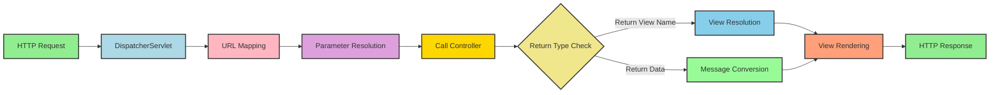

# Building a Spring-like Framework from Scratch: Mastering Spring Core Principles

> Author: JarryLi
> 
> Target Audience: Java engineers and students interested in design patterns and framework principles. If you want to learn and apply design patterns, understanding the Spring framework is one of the best approaches.

## Foreword

I remember when I first encountered `Spring` many years ago, I found it magical: objects could be automatically injected through `xml` configuration, or even a simple `@Autowired` annotation could do the job? AOP could add logging and transactions uniformly without invading business code? At that time, the mainstream was still the `EJB` system, using native `Servlet`, `JSP`, and `Struts` frameworks. Facing seemingly "magical" capabilities like IoC and DI, I couldn't help but want to explore: how are they actually implemented?

From then on, I started learning `Spring` source code. When I really looked into it, I discovered that these are not magical, but the result of extensive engineering design: layered abstractions, interface decoupling, and reuse of classic design patterns. The source code is not small, and it's difficult to read it all at once, so I could only learn bit by bit with questions.

纸上得来终觉浅，绝知此事要躬行。So I wrote a simplified version of the SpringWind framework by referencing the Spring framework, **implementing Spring's core features with the most concise code, making it easy for every developer who wants to deeply understand framework principles to understand**.

In this process, not only did I understand core concepts like IoC, DI, and AOP, as well as Bean lifecycle, DispatcherServlet controller and ApplicationContext container systems, but I also deeply understood **why Spring is designed this way**. Now, I share these practical experiences and insights, hoping to help you quickly grasp Spring's core principles.

**Code Repository:** https://github.com/microwind/design-patterns/tree/main/practice-projects/springwind

## Table of Contents

- [About SpringWind Framework](#about-springwind-framework)
- [Spring's Design Philosophy](#springs-design-philosophy)
- [Spring's Core Features](#springs-core-features)
- [Deep Understanding of Spring Framework](#deep-understanding-of-spring-framework)
- [Designing SpringWind Architecture by Referencing Spring Framework](#designing-springwind-architecture-by-referencing-spring-framework)
- [SpringWind vs Spring MVC Comparison](#springwind-vs-spring-mvc-comparison)
- [What is SpringWind Framework For](#what-is-springwind-framework-for)
- [SpringWind Project Structure](#springwind-project-structure)
- [SpringWind Usage Practice](#springwind-usage-practice)
- [Quick Start](#quick-start)
- [SpringWind Improvement Points](#springwind-improvement-points)

---

## About SpringWind Framework

SpringWind is a **lightweight educational Java Web framework** designed to help developers deeply understand the core principles of the Spring framework. By implementing Spring's core mechanisms from scratch (IoC, DI, AOP, three-level cache, MVC, etc.), it transforms the framework from a "black box" into a completely understandable "white box".

### Framework Positioning

SpringWind is **not** intended to replace Spring Framework, but serves as:
- **Learning Tool**: The best practice for understanding Spring core principles
- **Educational Framework**: Helps you gradually understand the Spring framework through a progressive approach
- **Quick Prototyping**: For small projects, SpringWind is more lightweight and convenient
- **Exploration Platform**: Can verify new architectural ideas and concepts, continuously innovating

### Core Features

SpringWind implements the following core functionalities of Spring Framework:

| Feature | Description | Corresponding Spring Feature |
|---------|-------------|---------------------------|
| **IoC Container** | Automatically scans, registers, and manages Bean lifecycle | ApplicationContext |
| **Dependency Injection** | Achieves automatic assembly through `@Autowired` | Dependency Injection |
| **Component Annotations** | `@Component`, `@Service`, `@Controller`, `@Repository` | Stereotype Annotations |
| **MVC Pattern** | Simulates Spring MVC's request handling mechanism | Spring MVC |
| **Request Mapping** | `@RequestMapping` implements URL to method mapping | Request Mapping |
| **Parameter Binding** | `@PathVariable`, `@RequestParam`, `@RequestBody` | Parameter Binding |
| **AOP Support** | Aspect-oriented programming based on JDK/CGLIB dynamic proxies | Spring AOP |
| **BeanPostProcessor** | Pre and post processing of Beans, supports lifecycle intervention | BeanPostProcessor |
| **SmartInstantiationAwareBeanPostProcessor** | Supports early proxy creation during Bean instantiation to resolve circular dependencies | SmartInstantiationAwareBeanPostProcessor |
| **Three-Level Cache** | Elegantly solves circular dependency problems | Circular Dependency Resolution |
| **JDBC Template** | Template class to simplify database operations | JdbcTemplate |
| **JSON Response** | Automatically serializes objects to JSON | @ResponseBody |

### Relationship with Spring Framework

SpringWind references Spring Framework's design philosophy but makes extensive simplifications:

**Similarities:**
- Core design philosophy (IoC, DI, AOP)
- Annotation-driven development
- Layered architecture (Controller-Service-Dao)
- Three-level cache to solve circular dependencies
- Template method pattern to encapsulate boilerplate code

**Differences:**
- **Code Scale**: SpringWind has about 4000 lines of code, Spring Framework has over 500,000 lines
- **Feature Scope**: SpringWind focuses on core features, Spring provides comprehensive enterprise-level features
- **Complexity**: SpringWind removes many abstraction layers, making it easier to understand
- **Production Ready**: Spring has been extensively validated, SpringWind is mainly for learning

### Technology Stack

```
Core Technologies:
├── Java 17+                    # Modern Java features
├── Jakarta Servlet API 6.1     # Web container standard
├── CGLIB 3.3.0                 # Bytecode enhancement (AOP)
├── SLF4J + Logback             # Logging framework
└── Jackson 2.18.2              # JSON serialization

Build Tools:
└── Maven 3.6+

Runtime Environment:
├── Embedded Tomcat 11         # Embedded web server
└── H2 / MySQL                 # Database (optional)
```

### SpringWind vs Spring MVC Annotation Comparison Table

To reduce learning costs, SpringWind's annotations are consistent with Spring MVC:

| SpringWind Annotation | Spring MVC Annotation | Purpose | Example |
|---------------------|---------------------|---------|---------|
| `@Component` | `@Component` | Mark generic component | `@Component` |
| `@Service` | `@Service` | Mark service layer component | `@Service` |
| `@Controller` | `@Controller` | Mark controller component | `@Controller` |
| `@Repository` | `@Repository` | Mark data access layer component | `@Repository` |
| `@Autowired` | `@Autowired` | Auto-inject dependencies | `@Autowired private UserDao dao;` |
| `@RequestMapping` | `@RequestMapping` | Map HTTP requests | `@RequestMapping("/user")` |
| `@PathVariable` | `@PathVariable` | Bind path variables | `@PathVariable("id") Long id` |
| `@RequestParam` | `@RequestParam` | Bind request parameters | `@RequestParam("name") String name` |
| `@RequestBody` | `@RequestBody` | Bind request body (JSON) | `@RequestBody User user` |
| `@ResponseBody` | `@ResponseBody` | Return JSON response | `@ResponseBody` |
| `@Aspect` | `@Aspect` | Mark aspect class | `@Aspect` |
| `@Before` | `@Before` | Before advice | `@Before("com.example.*")` |
| `@After` | `@After` | After advice | `@After("com.example.*")` |
| `@Around` | `@Around` | Around advice | `@Around("com.example.*")` |

**Usage Example:**

```java
// Define Controller
@Controller
@RequestMapping("/user")
public class UserController {
    @Autowired
    private UserService userService;  // Auto-injection

    @RequestMapping("/get")
    @ResponseBody
    public User getUser(@RequestParam("id") Long id) {
        return userService.getUserById(id);
    }

    @RequestMapping("/detail/{id}")
    @ResponseBody
    public User getUserDetail(@PathVariable("id") Long id) {
        return userService.getUserById(id);
    }

    @RequestMapping("/create")
    @ResponseBody
    public User createUser(@RequestBody User user) {
        return userService.createUser(user);
    }
}
```

If you're familiar with Spring MVC, you can understand SpringWind with **zero learning cost**! Once you understand SpringWind, you'll understand Spring.

### Learning Path Recommendations

**Step 1: Quick Experience (10 minutes)**
1. Run the example project and see the effects
2. Visit several API endpoints to understand the request flow

**Step 2: Understand Core Principles (1-2 hours)**
1. Read "Spring's Design Philosophy" and "Spring's Core Features" in this document
2. Debug with breakpoints to observe Bean creation and dependency injection process
3. Understand how three-level cache solves circular dependencies

**Step 3: Deep Dive into Source Code (3-5 hours)**
1. Read `SpringWindApplicationContext.java` (IoC container core)
2. Read `AspectProcessor.java` (AOP proxy creation)
3. Read `DispatcherServlet.java` (MVC request dispatching)
4. Read `JdbcTemplate.java` (JDBC template method)

**Step 4: Hands-on Practice (1-2 days)**
1. Write a small project based on SpringWind
2. Try adding new features (like transaction support)
3. Compare with Spring Framework source code to understand design differences

**Step 5: Contribute to Spring (Advanced)**
1. After understanding Spring's design philosophy, you can participate in the Spring community
2. Submit bug fixes or new feature Pull Requests

---

## Spring's Design Philosophy

Before building the wheel, we need to understand why Spring is designed this way. Many people find the Spring framework complex, but its core philosophy is actually very simple.

### 1. Inversion of Control (IoC) - Stop Creating Objects Yourself

**Pain Points of Traditional Approach:**

```java
// Traditional approach: manage objects yourself
public class UserService {
    private UserDao userDao = new UserDaoImpl();  // Hard-coded dependency
    private EmailService emailService = new EmailServiceImpl();   // Hard-coded dependency

    public void registerUser(User user) {
        userDao.save(user);
        emailService.sendWelcomeEmail(user);
    }
}
```

What's wrong with writing it this way?
Actually, this approach is easiest to understand, but not convenient for extension. When the project grows large, subsequent maintenance becomes troublesome.
1. **High Coupling**: UserService strongly depends on specific implementation classes
2. **Difficult to Test**: Cannot replace with Mock objects for unit testing
3. **Configuration Chaos**: Database connections, email configurations are all hard-coded in the code

**Spring's Solution:**

```java
// Spring approach: dependency injection
@Service
public class UserService {
    @Autowired
    private UserDao userDao;  // Injected by container
    @Autowired
    private EmailService emailService;

    public void registerUser(User user) {
        userDao.save(user);
        emailService.sendWelcomeEmail(user);
    }
}
```

Now, object creation and management are handed over to the IoC container. Business code only needs to declare "what I need" without caring about "how to create it". This is the core idea of **Inversion of Control**.

### 2. Aspect-Oriented Programming (AOP) - Separation of Cross-Cutting Concerns

Suppose you want to add logging to all Service methods. The traditional approach would be:

```java
public class UserService {
    public void registerUser(User user) {
        System.out.println("Starting registerUser");  // Logging code
        long start = System.currentTimeMillis();      // Performance monitoring code

        userDao.save(user);  // Real business logic

        long end = System.currentTimeMillis();
        System.out.println("Completed, took: " + (end - start) + "ms");
    }
}
```

Business code is mixed with logging and monitoring code, making it very bloated. Moreover, if there are 100 methods, these codes would have to be repeated 100 times.

**AOP Solution:**

```java
@Aspect
public class LoggingAspect {
    @Before("com.example.service.*.*")
    public void logBefore(Method method) {
        System.out.println("Starting: " + method.getName());
    }

    @After("com.example.service.*.*")
    public void logAfter(Method method) {
        System.out.println("Completed: " + method.getName());
    }
}

// Business code remains clean
@Service
public class UserService {
    public void registerUser(User user) {
        userDao.save(user);  // Only focus on business logic
    }
}
```

**Cross-cutting concerns** like logging, transactions, and permission checks are extracted, making business code much cleaner.

### 3. Convention Over Configuration - Less XML, More Annotations

Early Spring required writing extensive XML configurations:

```xml
<!-- Ancient Spring configuration -->
<bean id="userService" class="com.example.UserService">
    <property name="userDao" ref="userDao"/>
</bean>
<bean id="userDao" class="com.example.UserDaoImpl"/>
```

Now you only need:

```java
@Service
public class UserService {
    @Autowired
    private UserDao userDao;
}
```

One annotation gets it done. This is the power of **convention over configuration**.

### 4. Template Method Pattern - Encapsulating Boilerplate Code

JDBC operations have a lot of boilerplate code:

```java
// Traditional JDBC: 50+ lines of code
Connection conn = null;
PreparedStatement stmt = null;
ResultSet rs = null;
try {
    conn = dataSource.getConnection();
    stmt = conn.prepareStatement("SELECT * FROM users WHERE id = ?");
    stmt.setLong(1, userId);
    rs = stmt.executeQuery();
    if (rs.next()) {
        return new User(rs);
    }
} catch (SQLException e) {
    throw new RuntimeException(e);
} finally {
    if (rs != null) try { rs.close(); } catch (SQLException e) {}
    if (stmt != null) try { stmt.close(); } catch (SQLException e) {}
    if (conn != null) try { conn.close(); } catch (SQLException e) {}
}
```

**Spring JdbcTemplate:**

```java
// Concise JdbcTemplate: 2 lines of code
User user = jdbcTemplate.queryForObject(
    "SELECT * FROM users WHERE id = ?",
    (rs, rowNum) -> new User(rs),
    userId
);
```

Getting connections, closing resources - these fixed steps are encapsulated. You only need to focus on SQL and result mapping.

---

## Spring's Core Features

After understanding Spring's design philosophy, let's see how its core features are implemented.

### IoC Container - The Big Manager of Objects

The IoC container is like an object factory, responsible for:

1. **Scanning Components**: Find all classes with `@Component`, `@Service`, etc. annotations
2. **Registering Bean Definitions**: Store class metadata
3. **Instantiating Beans**: Create objects through reflection
4. **Dependency Injection**: Inject dependent objects
5. **Lifecycle Management**: Manage Bean creation and destruction

**Bean Lifecycle:**

```mermaid
---
title: Bean Lifecycle (Complete Flow)
---
graph LR
    A[Scan Components] --> B[Register BeanDefinition]
    B --> C[Instantiate Bean<br>Call Constructor]
    C --> D["Put into Third-Level Cache<br>ObjectFactory<br>Key!"]
    D --> E["Dependency Injection<br>@Autowired Fields<br>May Trigger Circular Dependencies"]
    E --> F["Pre-processor<br>postProcessBefore<br>Initialization"]
    F --> G["Initialization Method<br>@PostConstruct"]
    G --> H["Post-processor<br>postProcessAfter<br>Initialization<br>AOP Proxy Creation"]
    H --> I["Put into First-Level Cache<br>Clear Second & Third-Level Caches"]
    I --> J[Bean Ready<br>Can Be Used]
    J --> K["Destroy<br>@PreDestroy"]
    style A fill:#e1f5fe,stroke:#01579b,stroke-width:2px
    style B fill:#fff3e0,stroke:#f57c00,stroke-width:2px
    style C fill:#f1f8e9,stroke:#7cb342,stroke-width:2px
    style D fill:#fff8e1,stroke:#ffb300,stroke-width:3px
    style E fill:#fce4ec,stroke:#c2185b,stroke-width:2px
    style F fill:#f3e5f5,stroke:#7b1fa2,stroke-width:2px
    style G fill:#e8f5e8,stroke:#388e3c,stroke-width:2px
    style H fill:#ffe0b2,stroke:#e65100,stroke-width:2px
    style I fill:#c8e6c9,stroke:#2e7d32,stroke-width:2px
    style J fill:#a5d6a7,stroke:#00695c,stroke-width:2px
    style K fill:#FFE4E1,stroke:#B20E7E,stroke-width:2px
```



**Key Step Explanations**:
- **Step 4 (Third-Level Cache)**: This is the key to solving circular dependencies, putting ObjectFactory instead of the Bean itself
- **Step 5 (Dependency Injection)**: If the dependent Bean is being created, it will get early reference from third-level cache, triggering circular dependency resolution mechanism
- **Step 8 (Post-processor)**: AOP proxy is usually created here, but if already created in step 4's getEarlyBeanReference, it will be skipped

In SpringWind, we use a core class `SpringWindApplicationContext` to implement these features:

```java
public class SpringWindApplicationContext {
    // First-level cache: fully initialized Bean objects
    private Map<String, Object> singletonObjects = new ConcurrentHashMap<>();
    // Second-level cache: early Bean references (for solving circular dependencies)
    private Map<String, Object> earlySingletonObjects = new ConcurrentHashMap<>();
    // Third-level cache: ObjectFactory factory (for delayed generation of early references, supporting AOP)
    private Map<String, ObjectFactory<?>> singletonFactories = new ConcurrentHashMap<>();
    // Set of Beans currently being created (for detecting circular dependencies)
    private Set<String> singletonsCurrentlyInCreation = Collections.newSetFromMap(new ConcurrentHashMap<>());

    public SpringWindApplicationContext(Class<?> configClass) {
        scanComponents(configClass);      // 1. Scan components
        createSingletonBeans();           // 2. Create Beans
        dependencyInjection();            // 3. Dependency injection
        invokeInitMethods();              // 4. Execute initialization methods
    }
}
```

### Circular Dependency Problem - The Ingenious Design of Three-Level Cache

This is a common interview question at major companies. Suppose we have this circular dependency:

```java
@Service
public class ServiceA {
    @Autowired
    private ServiceB serviceB;  // A depends on B
}

@Service
public class ServiceB {
    @Autowired
    private ServiceA serviceA;  // B depends on A, forming a cycle
}
```

If not handled, it would fall into an infinite loop: **Create A → Need B → Create B → Need A → Create A →** ...

**Spring's Solution: Three-Level Cache**

The three-level cache is Spring's most ingenious design for solving circular dependencies. It includes:

- **First-level cache (singletonObjects)**: Stores fully initialized singleton Bean objects (dependency injection completed, initialization methods executed)
- **Second-level cache (earlySingletonObjects)**: Stores early Bean references (instantiated but not yet completed dependency injection and initialization)
- **Third-level cache (singletonFactories)**: Stores ObjectFactory object factories (**Note: Not the Bean itself!**)
  - The factory's role is to delay generation of early references, only calling getObject() when actually needed
  - If the Bean needs AOP proxy, it will create the proxy object in ObjectFactory.getObject()
  - This ensures that multiple Beans in circular dependency get the same proxy object, not multiple different instances

**Specific Flow:**

```java
// Process of creating A (corresponds to code SpringWindApplicationContext.java)
1. getBean("beanA") is called
2. Check first-level cache singletonObjects → Not found
3. Check if being created → Not in creation set, continue creation process
4. Mark A as being created: singletonsCurrentlyInCreation.add("beanA")
5. Instantiate A: call constructor, get raw object (dependencies not yet injected)

6. **Key Step**: Put ObjectFactory into third-level cache
   singletonFactories.put("beanA", () -> getEarlyBeanReference("beanA", rawBeanA))
   // Note: Putting factory object, not Bean itself!

7. Start injecting dependencies for A: doDependencyInjection(beanA)
8. Discover A depends on B, call getBean("beanB")

   // Process of creating B (nested within A's creation process)
   9. Check first-level cache → B not found
   10. Mark B as being created: singletonsCurrentlyInCreation.add("beanB")
   11. Instantiate B: get raw object
   12. Put ObjectFactory into third-level cache:
       singletonFactories.put("beanB", () -> getEarlyBeanReference("beanB", rawBeanB))
   13. Start injecting dependencies for B: discover B depends on A, call getBean("beanA")

      // Circular dependency detection and resolution (Key!)
      14. Check first-level cache → A not found (because A hasn't completed initialization)
      15. Discover A in creation set: singletonsCurrentlyInCreation.contains("beanA") = true
      16. Check second-level cache earlySingletonObjects → A not found
      17. Check third-level cache singletonFactories → Found A's ObjectFactory ✓
      18. **Call ObjectFactory.getObject()**
          → Internal call to getEarlyBeanReference("beanA", rawBeanA)
          → If A needs AOP proxy, SmartInstantiationAwareBeanPostProcessor creates proxy here
          → Return A's early reference (could be raw object or proxy object)
      19. Put A's early reference into second-level cache: earlySingletonObjects.put("beanA", earlyA)
      20. Remove from third-level cache: singletonFactories.remove("beanA")
      21. Return A's early reference to B ✓

   22. B completes dependency injection (injected with A's early reference)
   23. B executes pre-processor: applyBeanPostProcessorsBeforeInitialization
   24. B executes @PostConstruct initialization method
   25. B executes post-processor: applyBeanPostProcessorsAfterInitialization (AOP proxy might be created here)
   26. B completes creation, put into first-level cache: singletonObjects.put("beanB", beanB)
   27. Clear B's second and third-level caches
   28. Remove from creation set: singletonsCurrentlyInCreation.remove("beanB")

29. getBean("beanB") returns complete B → A successfully injects B
30. A completes dependency injection
31. A executes pre-processor
32. A executes @PostConstruct initialization method
33. A executes post-processor (if A already created proxy in getEarlyBeanReference, this will be skipped)
34. A completes creation, put into first-level cache: singletonObjects.put("beanA", beanA)
35. Clear A's second and third-level caches
36. Remove from creation set: singletonsCurrentlyInCreation.remove("beanA")
37. Complete! Both A and B successfully created, circular dependency resolved
```

**Key Design Points:**

1. **Why do we need three-level cache? Isn't two enough?**

   If we only had two-level cache (first level stores complete Beans, second level stores early Beans), there would be a fatal problem:
   - When Bean needs AOP proxy, what should be injected to other Beans is the **proxy object**, not the raw object
   - But in circular dependency scenarios, Bean creation doesn't know if it will be referenced by other Beans, nor when to create proxy
   - If we put raw object directly in second-level cache, after creating proxy later, other Beans still get raw object, causing inconsistency

   **Three-level cache (ObjectFactory) perfectly solves this problem**:
   - Third-level cache stores **object factory**, not the object itself
   - Only when actually needed by other Beans, the factory's getObject() method is called
   - In getObject(), call getEarlyBeanReference(), where SmartInstantiationAwareBeanPostProcessor decides whether to return raw object or proxy object
   - Once early reference is generated, move from third to second-level cache, ensuring multiple accesses get the same object

2. **Delayed nature of ObjectFactory**:
   ```java
   // Put into third-level cache when creating Bean (lines 615-621)
   singletonFactories.put(beanName, new ObjectFactory<Object>() {
       @Override
       public Object getObject() {
           // Only called when needed by dependencies
           return getEarlyBeanReference(beanName, rawBean);
       }
   });
   ```
   - If Bean has no circular dependencies, ObjectFactory is never called, no overhead
   - If there are circular dependencies, getObject() is called to generate early reference

3. **Role of SmartInstantiationAwareBeanPostProcessor**:

   This is a special BeanPostProcessor interface specifically for solving circular dependency + AOP scenarios:
   ```java
   protected Object getEarlyBeanReference(String beanName, Object bean) {
       Object exposedObject = bean;

       // Iterate through all BeanPostProcessors
       for (BeanPostProcessor bp : beanPostProcessors) {
           if (bp instanceof SmartInstantiationAwareBeanPostProcessor) {
               SmartInstantiationAwareBeanPostProcessor ibp =
                   (SmartInstantiationAwareBeanPostProcessor) bp;
               // AOP creates proxy here early, avoiding multiple different proxies in circular dependencies
               exposedObject = ibp.getEarlyBeanReference(exposedObject, beanName);
           }
       }
       return exposedObject;
   }
   ```

   - If Bean needs AOP proxy, AspectProcessor (implements SmartInstantiationAwareBeanPostProcessor) will create proxy here in advance
   - This ensures both sides of circular dependency get the **same proxy object**
   - Later in postProcessAfterInitialization, if proxy was already created, it won't be created again

4. **Role of Creation Set**:
   
   - Record which Beans are being created: `singletonsCurrentlyInCreation`
   - Used for detecting circular dependencies: if getBean finds Bean in this set, circular dependency occurred
   - Used for detecting unresolvable circular dependencies: if not found in third-level cache either, throw CircularDependencyException

### Dependency Injection - Automatic Assembly Implementation

The core of dependency injection is reflection. SpringWind's implementation:

```java
private void doDependencyInjection(Object bean) {
    Class<?> clazz = bean.getClass();

    // Scan all fields
    for (Field field : clazz.getDeclaredFields()) {
        if (!field.isAnnotationPresent(Autowired.class)) {
            continue;
        }

        // Find Bean from container by type
        Object dependency = getBean(field.getType());
        if (dependency == null) {
            throw new BeanNotFoundException("Dependency not found: " + field.getType());
        }

        // Set field value through reflection
        field.setAccessible(true);
        field.set(bean, dependency);
    }
}
```

The process is simple:
1. Find all fields with `@Autowired` annotation
2. Find corresponding Bean from container by field type
3. Inject Bean through reflection

### AOP - Dynamic Proxy Implementation

The core of AOP is **dynamic proxy**. SpringWind supports two proxy methods:

**1. JDK Dynamic Proxy (Interface-based)**

```java
// If target class implements interface, number of interfaces > 0
if (interfaces.length > 0) {
    // Use JDK dynamic proxy to create proxy object
    return Proxy.newProxyInstance(
        // Specify class loader for loading dynamically generated proxy class
        classLoader,
        // Interface array that proxy class needs to implement
        interfaces,
        // Create invocation handler, pass target object and aspect list
        // AopInvocationHandler handles aspect logic during method calls
        new AopInvocationHandler(target, aspects)
    );
}
```

**2. CGLIB Proxy (Inheritance-based)**

```java
// If target class has no interface, create CGLIB enhancer object for generating proxy class
Enhancer enhancer = new Enhancer();

// Set parent class to inherit (target class), CGLIB creates proxy through inheritance
enhancer.setSuperclass(targetClass);

// Set method interceptor, pass target object and aspect list
// AopMethodInterceptor handles aspect logic before and after method calls
enhancer.setCallback(new AopMethodInterceptor(target, aspects));

// Create and return proxy object
// create() method dynamically generates subclass of target class as proxy
return enhancer.create();
```

**Proxy Workflow:**


### Web MVC - Front Controller Pattern

SpringWind's Web MVC implements the classic front controller pattern:

```java
@WebServlet("/*")
public class DispatcherServlet extends HttpServlet {
    protected void service(HttpServletRequest req, HttpServletResponse resp) {
        // 1. Get request path
        String uri = req.getRequestURI();

        // 2. Find handler
        HandlerMethod handler = getHandler(uri);

        // 3. Resolve parameters
        Object[] args = resolveArguments(handler, req, resp);

        // 4. Call Controller method
        Object result = handler.invoke(args);

        // 5. Handle response
        handleResult(result, resp);
    }
}
```

**Request Processing Flow:**


### JDBC Template - Terminator of Boilerplate Code

JdbcTemplate just encapsulates basic JDBC operation steps, very simple to implement, not as complex as ORM frameworks:

```java
public <T> T queryForObject(String sql, RowMapper<T> mapper, Object... args) {
    Connection conn = null;
    PreparedStatement stmt = null;
    ResultSet rs = null;
    try {
        conn = getConnection();        // 1. Get connection
        stmt = prepareStatement(sql);  // 2. Create statement
        setParameters(stmt, args);     // 3. Set parameters
        rs = stmt.executeQuery();      // 4. Execute query
        return mapper.mapRow(rs, 0);   // 5. Map results (you only need to care about this)
    } catch (SQLException e) {
        throw new RuntimeException(e);
    } finally {
        closeResources(rs, stmt, conn);  // 6. Close resources
    }
}
```

You only need to provide SQL and result mapping logic, everything else is handled by the framework.

---

## Deep Understanding of Spring Framework

### Why Use Annotations?

Annotations are essentially **metadata**, used to describe code characteristics. Java can read these annotations at runtime through reflection API:

```java
// Scan annotations on class
Class<?> clazz = Class.forName("com.example.UserService");
if (clazz.isAnnotationPresent(Service.class)) {
    // This is a Service, register as Bean
}

// Scan annotations on fields
for (Field field : clazz.getDeclaredFields()) {
    if (field.isAnnotationPresent(Autowired.class)) {
        // This field needs dependency injection
    }
}
```

Advantages of annotations over XML configuration:
1. **Proximity Principle**: Configuration and code are together, more intuitive
2. **Type Safety**: Compile-time checking, avoids spelling errors
3. **Refactoring Friendly**: IDE can automatically refactor

### Reflection - Foundation of Spring

Spring extensively uses reflection to implement framework features:

```java
// 1. Create objects through reflection
Constructor<?> constructor = clazz.getDeclaredConstructor();
Object bean = constructor.newInstance();

// 2. Set field values through reflection
Field field = clazz.getDeclaredField("userDao");
field.setAccessible(true);
field.set(bean, userDaoBean);

// 3. Call methods through reflection
Method method = clazz.getDeclaredMethod("registerUser", User.class);
method.invoke(bean, user);
```

Reflection performance is indeed slower than direct calls, but Spring optimizes through **caching**:

```java
// Constructor cache
private Map<Class<?>, Constructor<?>> constructorCache = new ConcurrentHashMap<>();

public Object createBean(Class<?> clazz) {
    Constructor<?> constructor = constructorCache.computeIfAbsent(clazz, c -> {
        return c.getDeclaredConstructor();
    });
    return constructor.newInstance();
}
```

### Design Patterns - Spring is a Faithful Advocate of Classic Design Patterns

Spring framework applies numerous design patterns:

| Design Pattern | Application Scenario | Example |
|----------------|-------------------|---------|
| **Factory Pattern** | Bean creation | ApplicationContext is a Bean factory |
| **Singleton Pattern** | Bean scope | Default singleton Beans |
| **Proxy Pattern** | AOP implementation | JDK dynamic proxy, CGLIB proxy |
| **Template Method Pattern** | Fixed process encapsulation | JdbcTemplate, RestTemplate |
| **Strategy Pattern** | Different implementation strategies | RowMapper result mapping |
| **Observer Pattern** | Event mechanism | BeanPostProcessor |
| **Front Controller Pattern** | Web MVC | DispatcherServlet |
| **Registry Pattern** | Bean definition management | BeanDefinitionRegistry |

Learning Spring is also learning how to elegantly apply design patterns.

### Concurrency Safety - Choice of ConcurrentHashMap

Spring container is thread-safe, and SpringWind must also ensure this. We use `ConcurrentHashMap` instead of `Hashtable` or synchronized `HashMap`:

```java
// ✓ Recommended: ConcurrentHashMap
private Map<String, Object> singletonObjects = new ConcurrentHashMap<>();

// ✗ Not recommended: Hashtable (method-level lock, poor performance)
private Map<String, Object> singletonObjects = new Hashtable<>();

// ✗ Not recommended: synchronized wrapper (coarse-grained lock)
private Map<String, Object> singlet`ConcurrentHashMap` uses segmented locking, with much better concurrent performance than `Hashtable`.
```
---

## Designing SpringWind Architecture by Referencing Spring Framework

### Overall Architecture Design

SpringWind adopts a layered architecture, divided into four layers from bottom to top:
```
┌─────────────────────────────────────────────────────────────┐
│                    Application Layer                        │
│  Business code  : Controller, Service, Repository           │
└─────────────────────────────────────────────────────────────┘
                             ↓
┌─────────────────────────────────────────────────────────────┐
│                    Framework Layer                          │
│  ┌─────────────┐  ┌─────────────┐  ┌─────────────────────┐  │
│  │   Web MVC   │  │     AOP     │  │   JDBC Template     │  │
│  └─────────────┘  └─────────────┘  └─────────────────────┘  │
└─────────────────────────────────────────────────────────────┘
                             ↓
┌─────────────────────────────────────────────────────────────┐
│                 Core Container Layer                        │
│  ┌─────────────┐  ┌─────────────┐  ┌─────────────────────┐  │
│  │ Bean Def    │  │ Dependency  │  │ Lifecycle           │  │
│  │ Management  │  │ Injection   │  │ Management          │  │
│  └─────────────┘  └─────────────┘  └─────────────────────┘  │
│  ┌─────────────┐  ┌─────────────┐  ┌─────────────────────┐  │
│  │ Singleton   │  │ Circular    │  │ BeanPost            │  │
│  │ Pool        │  │ Dependency  │  │ Processor           │  │
│  │             │  │ Resolution  │  │                     │  │
│  └─────────────┘  └─────────────┘  └─────────────────────┘  │
└─────────────────────────────────────────────────────────────┘
                             ↓
┌─────────────────────────────────────────────────────────────┐
│                   Infrastructure Layer                      │
│  Reflection API | Class Loader | Dynamic Proxy              │
│  Annotation Processing | Concurrent Utils                   │
└─────────────────────────────────────────────────────────────┘
```

### Core Module Design

#### 1. IoC Container Module

**Core Class:** `SpringWindApplicationContext`

**Main Responsibilities:**
- Component scanning and registration
- Bean creation and caching
- Dependency injection
- Lifecycle management
- Circular dependency resolution (three-level cache)

**Key Code (SpringWindApplicationContext.java):**

```java
public class SpringWindApplicationContext {
    // Bean definition map (using ConcurrentHashMap for better concurrent performance)
    private final Map<String, BeanDefinition> beanDefinitionMap = new ConcurrentHashMap<>();

    // Three-level cache mechanism (core of circular dependency resolution)
    // First-level cache: fully initialized Bean objects
    private final Map<String, Object> singletonObjects = new ConcurrentHashMap<>();
    // Second-level cache: early Bean references
    private final Map<String, Object> earlySingletonObjects = new ConcurrentHashMap<>();
    // Third-level cache: ObjectFactory factory objects (Key!)
    private final Map<String, ObjectFactory<?>> singletonFactories = new ConcurrentHashMap<>();

    // Set of Beans currently being created
    private final Set<String> singletonsCurrentlyInCreation = Collections.newSetFromMap(new ConcurrentHashMap<>());

    // Bean post-processor list
    private final List<BeanPostProcessor> beanPostProcessors = new ArrayList<>();

    // Constructor cache (performance optimization)
    private final Map<Class<?>, Constructor<?>> constructorCache = new ConcurrentHashMap<>();

    public SpringWindApplicationContext(Class<?> configClass) {
        scanComponents(configClass);      // 1. Scan components
        createSingletonBeans();           // 2. Create singleton Beans
        dependencyInjection();            // 3. Dependency injection
        invokeInitMethods();              // 4. Execute initialization methods
    }
}
```

#### 2. AOP Module

**Core Classes:** `AspectProcessor`, `SmartInstantiationAwareBeanPostProcessor`, `AopInvocationHandler`, `AopMethodInterceptor`

**Main Responsibilities:**
- Aspect registration and management
- Proxy object creation (JDK dynamic proxy/CGLIB bytecode enhancement)
- Pointcut matching and advice execution
- **Early proxy creation** (solving circular dependency + AOP combination)

#### 3. Web MVC Module

**Core Classes:** `DispatcherServlet`, `HandlerMapping`, `PathMatcher`

**Main Responsibilities:**
- Request routing
- Parameter resolution and binding
- Controller invocation
- View resolution

#### 4. JDBC Module

**Core Classes:** `JdbcTemplate`, `RowMapper`

**Main Responsibilities:**
- Connection management
- SQL execution
- Result set mapping
- Resource cleanup

---

## SpringWind vs Spring MVC Comparison

### Feature Comparison Table

| Feature | SpringWind | Spring MVC | Description |
|---------|-----------|------------|-------------|
| **IoC Container** | Basic implementation | Complete implementation | SpringWind implements core container functionality |
| **Dependency Injection** | Field, method injection | Field, method, constructor injection | SpringWind doesn't support constructor injection yet |
| **Circular Dependency Resolution** | Three-level cache | Three-level cache + multiple strategies | Both use same core mechanism |
| **AOP Support** | JDK/CGLIB proxy | AspectJ integration | SpringWind implements basic AOP |
| **Web MVC** | Basic implementation | Complete MVC stack | SpringWind implements core request handling |
| **JDBC Support** | JdbcTemplate | JdbcTemplate + JPA/Hibernate | SpringWind implements core JDBC functionality |
| **Code Size** | ~5000 lines | ~500,000 lines | SpringWind is much more concise |
| **Learning Difficulty** | Easy | Difficult | SpringWind is easier to understand |

---

## What is SpringWind Framework For

SpringWind is not meant to replace Spring, but to **learn Spring** and **master Spring**.

### 1. Thoroughly Understand Spring Principles

**Common interview questions, SpringWind has answers:**

- **How does IoC container work?**
  Look at `SpringWindApplicationContext` implementation, 200+ lines of code can be understood.

- **How are circular dependencies resolved?**
  Look at three-level cache implementation, code is clear and concise.

- **How is AOP implemented?**
  Look at how `AspectProcessor` creates proxy objects.

### 2. Quick Development for Small Projects

SpringWind only has a few core dependencies:
```xml
<dependencies>
    <dependency>
        <groupId>jakarta.servlet</groupId>
        <artifactId>jakarta.servlet-api</artifactId>
    </dependency>
    <dependency>
        <groupId>cglib</groupId>
        <artifactId>cglib</artifactId>
    </dependency>
    <dependency>
        <groupId>org.slf4j</groupId>
        <artifactId>slf4j-api</artifactId>
    </dependency>
</dependencies>
```

**Applicable Scenarios:**
- Small web applications
- Internal tool systems
- Learning projects
- Demo demonstrations

---

## SpringWind Project Structure

SpringWind's code organization is clear, with well-defined module divisions:

```
springwind/
├── pom.xml                                      # Maven configuration
├── src/
│   ├── main/
│   │   └── java/com/github/microwind/springwind/
│   │       ├── SpringWindApplication.java      # Framework startup class
│   │       ├── annotation/                     # Annotation definitions
│   │       ├── core/                           # Core IoC container
│   │       ├── aop/                            # AOP implementation
│   │       ├── jdbc/                           # JDBC template
│   │       ├── web/                            # Web MVC
│   │       ├── exception/                      # Exception definitions
│   │       └── util/                           # Utility classes
│   └── test/                                   # Test code
└── examples/                                    # Example projects
    ├── user-demo/                               # User management example
    └── web-demo/                                # Web application example
```

The entire framework core code is about **4000 lines**, implementing Spring's core functionality with concise yet complete code.

---

## SpringWind Usage Practice

### Example 1: User Demo - Complete User Management System

This is a database-based user management system that showcases SpringWind's IoC, DI, Web MVC, and JDBC functionality.

#### Project Structure

Typical three-tier architecture: Controller → Service → Dao

```
user-demo/
├── controller/
│   └── UserController.java      # Handle HTTP requests
├── service/
│   └── UserService.java          # Business logic
├── dao/
│   └── UserDao.java              # Data access (using JdbcTemplate)
├── model/
│   └── User.java                 # Entity class
├── config/
│   └── DataSourceConfig.java    # Data source configuration
└── utils/
    ├── ApiResponse.java          # Unified response wrapper
    └── PageResult.java           # Pagination result
```

#### 1. Define Entity Class

```java
public class User {
    private Long id;
    private String name;
    private String email;
    private String phone;
    private Long createdTime;
    private Long updatedTime;

    // getter/setter omitted
}
```

#### 2. Data Access Layer - Using JdbcTemplate

```java
@Repository
public class UserDao {
    @Autowired
    private JdbcTemplate jdbcTemplate;

    // Query all users
    public List<User> findAll() {
        return jdbcTemplate.query(
            "SELECT * FROM users ORDER BY id DESC",
            this::mapRow
        );
    }

    // Query by ID
    public User findById(Long id) {
        return jdbcTemplate.queryForObject(
            "SELECT * FROM users WHERE id = ?",
            this::mapRow,
            id
        );
    }

    // Create user
    public int insert(User user) {
        return jdbcTemplate.update(
            "INSERT INTO users (name, email, phone, created_time, updated_time) " +
            "VALUES (?, ?, ?, ?, ?)",
            user.getName(), user.getEmail(), user.getPhone(),
            System.currentTimeMillis(), System.currentTimeMillis()
        );
    }

    // Result set mapping
    private User mapRow(ResultSet rs, int rowNum) throws SQLException {
        User user = new User();
        user.setId(rs.getLong("id"));
        user.setName(rs.getString("name"));
        user.setEmail(rs.getString("email"));
        user.setPhone(rs.getString("phone"));
        user.setCreatedTime(rs.getLong("created_time"));
        user.setUpdatedTime(rs.getLong("updated_time"));
        return user;
    }
}
```

**See?** Originally 50+ lines of JDBC code, now only needs 2 lines. `JdbcTemplate` automatically handles connection management, resource cleanup, exception handling.

#### 3. Service Layer - Business Logic

```java
@Service
public class UserService {
    @Autowired
    private UserDao userDao;

    public List<User> getAllUsers() {
        return userDao.findAll();
    }

    public User getUserById(Long id) {
        return userDao.findById(id);
    }

    public boolean createUser(User user) {
        return userDao.insert(user) > 0;
    }
}
```

#### 4. Controller Layer - RESTful API

```java
@Controller
@RequestMapping("/user")
public class UserController {
    @Autowired
    private UserService userService;

    // Get user list
    @RequestMapping("/list")
    @ResponseBody
    public ViewResult list(HttpServletRequest request) {
        try {
            List<User> users = userService.getAllUsers();
            return new JsonResult(
                ApiResponse.success(users, "获取用户列表成功").toMap()
            );
        } catch (Exception e) {
            return new JsonResult(
                ApiResponse.failure("获取用户列表失败: " + e.getMessage()).toMap()
            );
        }
    }

    // Create user
    @RequestMapping("/create")
    @ResponseBody
    public ViewResult create(@RequestBody User user) {
        try {
            boolean success = userService.createUser(user);
            if (success) {
                return new JsonResult(
                    ApiResponse.success(user, "创建用户成功").toMap()
                );
            } else {
                return new JsonResult(
                    ApiResponse.failure("创建用户失败").toMap()
                );
            }
        } catch (Exception e) {
            return new JsonResult(
                ApiResponse.failure("创建用户失败: " + e.getMessage()).toMap()
            );
        }
    }
}
```

#### 5. API Testing

```bash
# Get user list
curl "http://localhost:8080/user/list"

# Create user
curl -X POST http://localhost:8080/user/create \
  -H "Content-Type: application/json" \
  -d '{"name":"张三","email":"zhangsan@example.com","phone":"13800138000"}'
```

---

## SpringWind Improvement Points

SpringWind currently implements Spring's core functionality, but there are many areas for improvement.

### ✅ Already Implemented Features

- [x] IoC container (component scanning, Bean management)
- [x] Dependency injection (field injection, method injection)
- [x] Circular dependency resolution (three-level cache)
- [x] AOP (JDK dynamic proxy, CGLIB proxy)
- [x] Web MVC (request mapping, parameter binding, JSON response)
- [x] JDBC template (query, update, batch operations)
- [x] Pagination support (PageResult)
- [x] Unified response wrapper (ApiResponse)

### ⏳ Features to Improve

#### 1. Transaction Management

**Current Status:** No transaction support, needs manual management

**Improvement Plan:**

```java
// Declarative transaction
@Service
public class UserService {
    @Transactional
    public void registerUser(User user) {
        userDao.insert(user);
        emailService.sendWelcomeEmail(user);  // If email fails, user creation also rolls back
    }
}

// Implementation思路: Use AOP to intercept @Transactional methods
@Aspect
public class TransactionAspect {
    @Around("@annotation(Transactional)")
    public Object aroundTransaction(Method method, Object[] args) {
        Connection conn = null;
        try {
            conn = dataSource.getConnection();
            conn.setAutoCommit(false);  // Start transaction

            Object result = method.invoke(args);  // Execute business method

            conn.commit();  // Commit transaction
            return result;
        } catch (Exception e) {
            if (conn != null) {
                conn.rollback();  // Rollback transaction
            }
            throw e;
        }
    }
}
```

#### 2. Constructor Injection

**Current Status:** Only supports field injection and method injection

**Improvement Plan:**

```java
// Support constructor injection
@Service
public class UserService {
    private final UserDao userDao;  // final ensures immutability

    @Autowired
    public UserService(UserDao userDao) {
        this.userDao = userDao;
    }
}
```

#### 3. Bean Scopes

**Current Status:** Only supports singleton

**Improvement Plan:**

```java
@Service
@Scope("prototype")  // Create new instance each time
public class PrototypeService {
    // ...
}
```

#### 4. More Powerful AOP

**Current Improvements:**

1. **Support pointcut expressions:**
```java
@Before("execution(* com.example.service.*.*(..))") // Support AspectJ expressions
public void logBefore(JoinPoint joinPoint) {
    // ...
}
```

2. **Support pointcut combination:**
```java
@Pointcut("execution(* com.example.service.*.*(..))")
public void serviceMethods() {}

@Pointcut("@annotation(Transactional)")
public void transactionalMethods() {}

@Before("serviceMethods() && transactionalMethods()")
public void beforeServiceTransaction() {
    // Satisfy both pointcuts
}
```

#### 5. Configuration File Support

**Current Status:** Mainly relies on annotations

**Improvement Plan:**

```yaml
# application.yml
springwind:
  datasource:
    url: jdbc:mysql://localhost:3306/test
    username: root
    password: 123456
  web:
    port: 8080
    context-path: /api
```

---

## Summary

By implementing SpringWind framework from scratch (~5000 lines of code), we have thoroughly understood Spring's core principles:

### Core Mechanism Understanding

1. **IoC Container**: Manages complete lifecycle through reflection scanning components, registering Bean definitions
2. **Dependency Injection**: Implements automatic assembly through reflection, supports field and method injection
3. **Three-level Cache** (most ingenious design):
   - **First-level cache**: Stores fully initialized Beans
   - **Second-level cache**: Stores early Bean references
   - **Third-level cache**: Stores ObjectFactory factories (**Key!**)
   - **Why three levels needed**: Delayed generation of early references, supports early AOP proxy creation, ensures singleton consistency
4. **AOP**: Implements separation of cross-cutting concerns through dynamic proxies
5. **Web MVC**: Unified HTTP request processing through front controller pattern
6. **JDBC Template**: Encapsulates boilerplate code through template method pattern

### Learning Value

The best way to learn is through imitation. Only by completely hand-crafting a web framework can you thoroughly understand the core mechanisms of frameworks.

SpringWind is not meant to replace Spring, but to **deeply understand Spring**. It implements Spring's core functionality with the most concise code (~3800 lines), making it understandable for every developer who wants to deeply understand framework principles.

**By learning SpringWind, you will master Spring framework core knowledge points:**

- Spring IoC container working mechanism
- Ingenious design of three-level cache solving circular dependencies
- AOP dynamic proxy implementation principles
- Complete Bean lifecycle flow
- Practical application of design patterns in frameworks
- Deep reasons why Spring is designed this way

**Final Words:**

Frameworks are not black magic; they just encapsulate common code patterns. When you understand the principles, you can advance from "using frameworks" to "mastering frameworks" and even "designing frameworks".

Hope SpringWind can help you open the door to Spring. Happy learning! 

---

## Appendix

### Environment Requirements

- Java 17+
- Maven 3.6+
- MySQL 8.0+ (if using User Demo)

### Quick Start

```bash
# 1. Clone project
git clone https://github.com/microwind/design-patterns.git
cd practice-projects/springwind

# 2. Compile and install
mvn clean install -DskipTests=true

# 3. Run User Demo
cd examples/user-demo
mvn exec:java -Dexec.args="--web"

# 4. Run Web Demo
cd examples/web-demo
mvn exec:java -Dexec.args="--web"
```

### Related Resources

- **Project Homepage**: https://github.com/microwind/design-patterns/tree/main/practice-projects/springwind
- **Spring Official Documentation**: https://docs.spring.io/spring-framework/docs/current/reference/html/
- **Issue Feedback**: https://github.com/microwind/design-patterns/issues

### References

1. Spring Framework Official Documentation
2. "Spring Source Code Deep Analysis" book and related reviews
3. "Design Patterns: Elements of Reusable Object-Oriented Software"
4. "Effective Java"

---

**Hope you enjoy learning SpringWind!**
