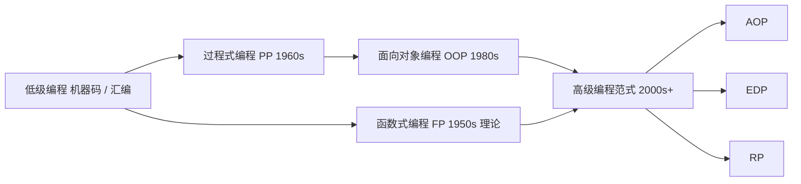

# 从程序员到架构师：6大编程范式全解析与实践对比

> 深入理解编程范式，才能真正理解编程的本质。下面详细介绍6大编程范式的特点、应用场景和最佳实践。

---

## 目录

1. [什么是编程范式？](#什么是编程范式)
2. [编程范式有什么用？](#编程范式有什么用)
3. [6大编程范式的区别](#6大编程范式的区别)
4. [6大编程范式的执行流程](#6大编程范式的执行流程)
5. [不同语言实现6大编程范式示例](#不同语言实现6大编程范式示例)
6. [编程范式在项目实战中的应用](#编程范式在项目实战中的应用)

---

## 什么是编程范式？

**编程范式**是程序设计所遵循的思想体系与方法论框架，它规定了如何组织代码、如何表达计算逻辑以及如何抽象和建模问题。不同的编程范式，本质上代表着不同的思维方式与问题建模哲学。

如果说**数据结构与算法**构成了计算机编程的计算基础，决定了“程序能做什么”，那么**编程范式**则构成了程序语言的结构基础，决定了“程序如何被构建”。前者关注计算能力，后者关注组织方式；前者解决效率问题，后者解决复杂性问题。

编程范式与设计模式属于一类概念，但两者也有明显区别。编程范式决定“如何思考程序”，而设计模式则是在既定范式之下，对常见代码结构进行抽象和优化，它考虑的是“如何更优雅地组织代码”。

相关源码示例：[https://github.com/microwind/design-patterns/tree/main/programming-paradigm](https://github.com/microwind/design-patterns/tree/main/programming-paradigm)

编程范式通常包含以下特点：

- **编程思想** - 如何看待问题和解决方案
- **代码组织方式** - 如何组织和结构化代码
- **数据和操作的关系** - 数据如何与操作相关联
- **执行流程** - 程序如何执行
- **语言特性** - 该范式所需的语言支持

### 编程范式的演变



---

## 编程范式有什么用？

### 1. 指导开发方向

同一个问题：学生成绩管理系统 —— 不同编程范式流程对比

```
同一个问题：实现学生成绩管理系统

PP范式的思路：
  第1步：读取学生数据 → 第2步：计算成绩 → 第3步：输出结果

OOP范式的思路：
  定义Student类 → 定义GradeCalculator类 → 通过对象交互实现

FP范式的思路：
  数据流 → map(计算) → filter(筛选) → reduce(汇总)

EDP范式的思路：
  学生添加事件 → 成绩计算事件 → 结果输出事件

RP范式的思路：
  成绩数据流 → 自动响应变化 → 实时更新UI
```



```mermaid
flowchart TD

%% ================= PP =================
subgraph PP[过程式编程 PP]
    PP1[读取学生数据] --> PP2[计算成绩]
    PP2 --> PP3[输出结果]
end

%% ================= OOP =================
subgraph OOP[面向对象编程 OOP]
    O1[定义 Student 类]
    O2[定义 GradeCalculator 类]
    O3[对象交互完成计算]
    O1 --> O3
    O2 --> O3
end

%% ================= FP =================
subgraph FP[函数式编程 FP]
    F1[成绩数据流]
    F1 --> F2[map 计算]
    F2 --> F3[filter 筛选]
    F3 --> F4[reduce 汇总]
end

%% ================= EDP =================
subgraph EDP[事件驱动编程 EDP]
    E1[学生添加事件]
    E1 --> E2[成绩计算事件]
    E2 --> E3[结果输出事件]
end

%% ================= RP =================
subgraph RP[响应式编程 RP]
    R1[成绩数据流]
    R1 --> R2[自动响应变化]
    R2 --> R3[实时更新 UI]
end
```

### 2. 提高代码质量

| 方面 | 说明 | 示例 |
|-----|------|------|
| **可维护性** | 清晰的结构使代码易于理解和修改 | OOP的封装隐藏复杂实现 |
| **可测试性** | 便于编写单元测试 | FP的纯函数无副作用易于测试 |
| **可复用性** | 代码片段可在多个地方使用 | FP的高阶函数，OOP的继承 |
| **可扩展性** | 容易添加新功能 | AOP的切面扩展，EDP的事件驱动 |
| **性能优化** | 针对性的优化策略 | PP的直接执行，RP的背压处理 |

### 3. 促进团队协作

- **统一思维** - 团队成员理解相同的设计思想
- **代码规范** - 遵循同一范式的最佳实践
- **知识共享** - 使用相同范式的框架和库

### 4. 解决特定问题

每种范式擅长解决特定类型的问题：

```
性能关键 → PP (直接高效)
业务系统 → OOP (结构清晰)
数据处理 → FP (易于并行化)
横切关注 → AOP (代码整洁)
解耦系统 → EDP (模块独立)
异步实时 → RP (自动响应)
```

---

## 6大编程范式的区别

### 总览表

| 维度 | PP (过程式) | OOP (面向对象) | FP (函数式) | AOP (切面) | EDP (事件驱动) | RP (响应式) |
|-----|-----------|-------------|-----------|----------|------------|----------|
| **核心思想** | 步骤分解 | 对象建模 | 函数组合 | 关注点分离 | 事件驱动 | 数据流反应 |
| **焦点** | 怎么做 | 什么是对象 | 做什么 | 横切逻辑 | 什么时候做 | 自动响应 |
| **数据状态** | 可变 | 封装可变 | 不可变 | 混合 | 事件相关 | 流式不可变 |
| **执行模型** | 顺序执行 | 对象交互 | 函数调用链 | 织入拦截 | 事件监听 | 流订阅 |
| **代码复用** | 低 | 高(继承) | 高(组合) | 高(切面) | 高(事件) | 高(操作符) |
| **学习难度** | ⭐ | ⭐⭐ | ⭐⭐⭐ | ⭐⭐⭐ | ⭐⭐ | ⭐⭐⭐⭐ |
| **应用广度** | 广(基础) | 很广 | 中等 | 专门 | 广 | 专门 |
| **性能** | 最快 | 很快 | 中等 | 中等 | 中等 | 中等 |

### 详细对比

#### 1. 面向过程编程 (PP - Procedural Programming)

| 特性 | 说明 |
|-----|------|
| **定义** | 按步骤分解问题，将大问题分解成多个小步骤，每个步骤对应一个函数 |
| **核心元素** | 函数、步骤、流程 |
| **数据管理** | 全局变量或静态变量，在函数间传递 |
| **关键特征** | 顺序执行，强制流程清晰，易于理解 |
| **最适合** | 简单脚本、系统编程、算法实现 |
| **代表语言** | C、Pascal、Go(基础) |
| **优点** | 执行效率高，代码直观，易于学习 |
| **缺点** | 全局变量导致耦合，难以扩展，代码复用性差 |

#### 2. 面向对象编程 (OOP - Object-Oriented Programming)

| 特性 | 说明 |
|-----|------|
| **定义** | 将数据和操作封装在对象中，通过对象的交互来实现功能 |
| **核心元素** | 类、对象、继承、多态、封装 |
| **数据管理** | 数据封装在对象内部，通过方法访问 |
| **关键特征** | 对象间通信，状态隔离，易于扩展 |
| **最适合** | 大型应用、业务系统、GUI程序 |
| **代表语言** | Java、C++、Python、C#、JavaScript |
| **优点** | 代码有序，易于扩展，复用性好，模拟现实 |
| **缺点** | 设计复杂，学习曲线陡，可能过度设计 |

#### 3. 函数式编程 (FP - Functional Programming)

| 特性 | 说明 |
|-----|------|
| **定义** | 将计算视为函数求值，避免使用可变数据和副作用 |
| **核心元素** | 纯函数、不可变数据、高阶函数、函数组合 |
| **数据管理** | 不可变，每次操作返回新数据 |
| **关键特征** | 无副作用，可预测，易于并行化 |
| **最适合** | 数据处理、并发编程、科学计算 |
| **代表语言** | Haskell、Lisp、Scala、JavaScript(支持) |
| **优点** | 易于测试，可预测，易于并行，防止副作用 |
| **缺点** | 学习曲线陡，某些问题代码冗长，性能可能差 |

#### 4. 面向切面编程 (AOP - Aspect-Oriented Programming)

| 特性 | 说明 |
|-----|------|
| **定义** | 从核心业务逻辑中分离横切关注点（日志、事务、权限等） |
| **核心元素** | 切面、连接点、切入点、通知、织入 |
| **数据管理** | 通过织入来增强对象行为 |
| **关键特征** | 关注点分离，代码整洁，易于维护 |
| **最适合** | 企业应用、框架开发、横切功能 |
| **代表语言** | Java(Spring AOP)、C#、Python |
| **优点** | 关注点清晰，易于维护，减少代码重复 |
| **缺点** | 增加复杂性，调试困难，运行时开销 |

#### 5. 事件驱动编程 (EDP - Event-Driven Programming)

| 特性 | 说明 |
|-----|------|
| **定义** | 程序流程由事件的发生与处理决定 |
| **核心元素** | 事件源、事件、事件监听器、事件处理器 |
| **数据管理** | 通过事件对象传递数据 |
| **关键特征** | 异步执行，模块解耦，响应快速 |
| **最适合** | GUI应用、游戏、Web服务器、实时系统 |
| **代表语言** | JavaScript、Node.js、C++、Java |
| **优点** | 模块独立，易于扩展，用户体验好 |
| **缺点** | 事件流复杂难跟踪，调试困难 |

#### 6. 响应式编程 (RP - Reactive Programming)

| 特性 | 说明 |
|-----|------|
| **定义** | 通过异步数据流自动响应数据变化 |
| **核心元素** | Observable、Subscriber、操作符、调度器 |
| **数据管理** | 数据流化，通过操作符转换 |
| **关键特征** | 自动响应，背压处理，异步非阻塞 |
| **最适合** | 实时数据处理、高并发、Web应用 |
| **代表语言** | JavaScript(RxJS)、Java(Reactor)、Python |
| **优点** | 简化异步编程，自动背压，高效并发 |
| **缺点** | 学习曲线陡，调试困难，性能开销 |

---

## 6大编程范式的执行流程

### 1. 面向过程编程 (PP) 的执行流程

```
┌─────────────┐
│  开始        │
└──────┬──────┘
       ↓
┌──────────────────┐
│ 函数1: 读取数据    │
└──────┬───────────┘
       ↓
┌──────────────────┐
│ 函数2: 处理数据    │
└──────┬───────────┘
       ↓
┌──────────────────┐
│ 函数3: 输出结果    │
└──────┬───────────┘
       ↓
┌──────────────────┐
│ 函数4: 关闭资源    │
└──────┬───────────┘
       ↓
┌─────────────┐
│  结束        │
└─────────────┘

特点：
✓ 线性执行
✓ 全局状态传递
✓ 函数调用顺序固定
✓ 直接、高效
```

### 2. 面向对象编程 (OOP) 的执行流程

```
┌─────────────────────┐
│   创建对象实例        │
│   (Student st1)     │
└────────┬────────────┘
         ↓
    ┌────────────────┐
    │ 对象A: Student  │
    │ 属性: name,age  │
    │ 方法: study()   │
    │     getGrade() │
    └────────┬───────┘
             ↓
    ┌────────────────┐
    │ 对象B: Teacher  │
    │ 属性: name      │
    │ 方法: grade()   │
    │     feedback() │
    └────────┬───────┘
             ↓
    ┌────────────────────┐
    │  对象间通信          │
    │  student.study()   │
    │  teacher.grade()   │
    │  student.feedback()│
    └────────┬───────────┘
             ↓
    ┌────────────────────┐
    │  维护对象状态        │
    │  (name, age修改)    │
    └────────┬───────────┘
             ↓
        ┌─────────┐
        │   结束   │
        └─────────┘

特点：
✓ 对象创建和销毁
✓ 对象间通信
✓ 状态封装
✓ 继承和多态调用
```

### 3. 函数式编程 (FP) 的执行流程

```
输入数据 [1, 2, 3, 4, 5]
    ↓
┌─────────────────┐
│ 函数1: map()     │  乘以2
│ [2, 4, 6, 8,10] │
└────────┬────────┘
         ↓
┌─────────────────┐
│ 函数2: filter()  │  > 5
│ [6, 8, 10]      │
└────────┬────────┘
         ↓
┌─────────────────┐
│ 函数3: reduce()  │  求和
│ 24              │
└────────┬────────┘
         ↓
      输出结果

流程特点：
✓ 数据管道 (Pipeline)
✓ 函数链式调用
✓ 不改变原数据
✓ 返回新的数据结构
✓ 可组合、可复用
```

### 4. 面向切面编程 (AOP) 的执行流程

```
┌──────────────────┐
│  方法调用         │
│  userService     │
│  .createUser()   │
└────────┬─────────┘
         ↓
    ┌────────────────────┐
    │  Before Advice     │
    │  (前置通知)         │
    │  - 参数校验         │
    │  - 权限检查         │
    └────────┬───────────┘
             ↓
    ┌────────────────────┐
    │  核心业务逻辑        │
    │  (Save User)       │
    └────────┬───────────┘
             ↓
    ┌────────────────────┐
    │  After Advice      │
    │  (后置通知)         │
    │  - 日志记录         │
    │  - 邮件发送         │
    └────────┬───────────┘
             ↓
    ┌────────────────────┐
    │  AfterReturning    │
    │  (返回通知)         │
    │  - 更新缓存         │
    └────────┬───────────┘
             ↓
        ┌──────────┐
        │ 返回结果  │
        └──────────┘

执行特点：
✓ 业务逻辑与横切逻辑分离
✓ 织入（Weaving）操作
✓ 多个通知链式执行
✓ 维护核心业务纯净
```

### 5. 事件驱动编程 (EDP) 的执行流程

```
用户操作: 点击按钮
    ↓
┌────────────────┐
│ 事件源产生事件   │
│ (Click Event)  │
└────────┬───────┘
         ↓
    ┌────────────────────┐
    │ 事件队列            │
    │ [event1]           │
    │ [event2]           │
    │ [event3]           │
    └────────┬───────────┘
             ↓
    ┌────────────────────┐
    │ 事件分发器           │
    │ (Event Dispatcher) │
    └────────┬───────────┘
             ↓
    ┌─────────────────────┐
    │ 监听器1: onSave()    │ → 保存数据
    │ 监听器2: onLog()     │ → 记录日志
    │ 监听器3: onNotify()  │ → 发送通知
    └────────┬────────────┘
             ↓
        ┌──────────┐
        │ 结束处理  │
        └──────────┘

执行特点：
✓ 异步非阻塞
✓ 事件队列处理
✓ 多监听器并行处理
✓ 模块间解耦
```

### 6. 响应式编程 (RP) 的执行流程

```
数据源(Observable)
    ↓
┌──────────────────┐
│ 创建数据流         │
│ [1, 2, 3, 4, 5]  │
└────────┬─────────┘
         ↓
    ┌───────────────────────┐
    │ 操作符链(Operators)    │
    │ ┌─────────────────┐   │
    │ │ map(x => x*2)   │ → [2,4,6,8,10]
    │ └────────┬────────┘   │
    │          ↓            │
    │ ┌─────────────────┐   │
    │ │filter(x > 5)    │ → [6,8,10]
    │ └────────┬────────┘   │
    │          ↓            │
    │ ┌─────────────────┐   │
    │ │reduce(+)        │ → 24
    │ └────────┬────────┘   │
    └───────────────────────┘
         ↓
    ┌───────────────────────┐
    │ 订阅(Subscribe)        │
    │ .subscribe({          │
    │   next: value => log  │
    │   error: err => handle│
    │   complete: () => end │
    │ })                    │
    └────────┬──────────────┘
             ↓
        ┌─────────────┐
        │ 响应结果     │
        │ next(24)    │
        │ complete()  │
        └─────────────┘

执行特点：
✓ 异步数据流
✓ 中间操作符链
✓ 自动背压处理
✓ 错误处理完整
✓ 生命周期管理(subscribe/unsubscribe)
```

---

## 不同语言实现编程范式源码

### 场景：数据统计系统

统计学生成绩，需要：
1. 读取学生成绩数据
2. 计算平均分
3. 找出及格学生
4. 输出结果

### 1. PP - C语言（面向过程）

```c
#include <stdio.h>
#include <string.h>

#define MAX_STUDENTS 5

typedef struct {
    char name[50];
    int score;
} Student;

// 全局数据
Student students[MAX_STUDENTS] = {
    {"Alice", 85},
    {"Bob", 72},
    {"Charlie", 90},
    {"David", 68},
    {"Eve", 92}
};

int count = 5;

// 步骤1: 计算平均分
float calculateAverage() {
    float sum = 0;
    for (int i = 0; i < count; i++) {
        sum += students[i].score;
    }
    return sum / count;
}

// 步骤2: 统计及格人数
int countPassed() {
    int passed = 0;
    for (int i = 0; i < count; i++) {
        if (students[i].score >= 60) {
            passed++;
        }
    }
    return passed;
}

// 步骤3: 显示及格学生
void displayPassed() {
    printf("Passed Students:\n");
    for (int i = 0; i < count; i++) {
        if (students[i].score >= 60) {
            printf("  %s: %d\n", students[i].name, students[i].score);
        }
    }
}

// 步骤4: 输出统计结果
void printStatistics() {
    float average = calculateAverage();
    int passed = countPassed();

    printf("=== Grade Statistics ===\n");
    printf("Average Score: %.2f\n", average);
    printf("Passed Count: %d\n", passed);
    printf("Pass Rate: %.1f%%\n", (passed * 100.0) / count);
}

int main() {
    printStatistics();
    displayPassed();
    return 0;
}
```

**特点：**
- 按步骤顺序执行
- 全局数据共享
- 函数直接操作数据
- 代码直观易懂

---

### 2. OOP - Java（面向对象）

```java
import java.util.ArrayList;
import java.util.List;

class Student {
    private String name;
    private int score;

    public Student(String name, int score) {
        this.name = name;
        this.score = score;
    }

    public String getName() { return name; }
    public int getScore() { return score; }
    public boolean isPassed() { return score >= 60; }

    @Override
    public String toString() {
        return name + ": " + score;
    }
}

class GradeStatistics {
    private List<Student> students;

    public GradeStatistics(List<Student> students) {
        this.students = students;
    }

    // 计算平均分
    public double getAverage() {
        return students.stream()
            .mapToInt(Student::getScore)
            .average()
            .orElse(0);
    }

    // 统计及格人数
    public int getPassedCount() {
        return (int) students.stream()
            .filter(Student::isPassed)
            .count();
    }

    // 获取及格学生列表
    public List<Student> getPassedStudents() {
        return students.stream()
            .filter(Student::isPassed)
            .toList();
    }

    // 输出统计结果
    public void printStatistics() {
        System.out.println("=== Grade Statistics ===");
        System.out.printf("Average Score: %.2f\n", getAverage());
        System.out.printf("Passed Count: %d\n", getPassedCount());
        System.out.printf("Pass Rate: %.1f%%\n",
            (getPassedCount() * 100.0) / students.size());

        System.out.println("\nPassed Students:");
        getPassedStudents().forEach(s -> System.out.println("  " + s));
    }
}

public class GradeAnalyzer {
    public static void main(String[] args) {
        List<Student> students = new ArrayList<>();
        students.add(new Student("Alice", 85));
        students.add(new Student("Bob", 72));
        students.add(new Student("Charlie", 90));
        students.add(new Student("David", 68));
        students.add(new Student("Eve", 92));

        GradeStatistics stats = new GradeStatistics(students);
        stats.printStatistics();
    }
}
```

**特点：**
- 对象间交互
- 数据封装
- 继承和多态
- 易于扩展

---

### 3. FP - JavaScript（函数式编程）

```javascript
// 定义学生数据（不可变）
const students = [
    { name: "Alice", score: 85 },
    { name: "Bob", score: 72 },
    { name: "Charlie", score: 90 },
    { name: "David", score: 68 },
    { name: "Eve", score: 92 }
];

// 纯函数：计算平均分
const calculateAverage = (students) => {
    const sum = students.reduce((acc, s) => acc + s.score, 0);
    return sum / students.length;
};

// 纯函数：筛选及格学生
const filterPassed = (students) => students.filter(s => s.score >= 60);

// 纯函数：计算及格人数
const countPassed = (students) => {filterPassed(students).length;
}

// 纯函数：计算及格率
const passRate = (students) =>
    (countPassed(students) / students.length) * 100;

// 纯函数：格式化输出
const formatStatistics = (students) => ({
    average: calculateAverage(students).toFixed(2),
    passedCount: countPassed(students),
    passRate: passRate(students).toFixed(1),
    passedStudents: filterPassed(students)
});

// 纯函数：显示结果
const printStatistics = (students) => {
    const stats = formatStatistics(students);

    console.log("=== Grade Statistics ===");
    console.log(`Average Score: ${stats.average}`);
    console.log(`Passed Count: ${stats.passedCount}`);
    console.log(`Pass Rate: ${stats.passRate}%`);
    console.log("\nPassed Students:");
    stats.passedStudents.forEach(s =>
        console.log(`  ${s.name}: ${s.score}`)
    );
};

// 执行
printStatistics(students);

// 函数组合示例
const compose = (...fns) => x =>
    fns.reduceRight((acc, fn) => fn(acc), x);

const getStatsSummary = compose(
    formatStatistics,
    students
);
```

**特点：**
- 纯函数无副作用
- 不可变数据
- 函数组合
- 易于测试

---

### 4. AOP - Java with Spring（面向切面）

```java
import org.springframework.stereotype.Service;
import org.aspectj.lang.annotation.Aspect;
import org.aspectj.lang.annotation.Before;
import org.aspectj.lang.annotation.After;
import org.aspectj.lang.annotation.Around;
import org.aspectj.lang.ProceedingJoinPoint;

// 核心业务类（不包含横切关注点）
@Service
public class GradeService {

    public double calculateAverage(int[] scores) {
        int sum = 0;
        for (int score : scores) {
            sum += score;
        }
        return sum / (double) scores.length;
    }

    public int[] filterPassed(int[] scores) {
        return java.util.Arrays.stream(scores)
            .filter(s -> s >= 60)
            .toArray();
    }

    public void printStatistics(int[] scores) {
        System.out.println("=== Grade Statistics ===");
        System.out.printf("Average: %.2f\n", calculateAverage(scores));
        int passed = filterPassed(scores).length;
        System.out.printf("Passed: %d / %d\n", passed, scores.length);
    }
}

// 切面：处理横切关注点
@Aspect
@Service
public class GradeAspect {

    // 前置通知：参数验证
    @Before("execution(* GradeService.*(..))")
    public void validateInput(JoinPoint jp) {
        System.out.println("[验证] 方法 " + jp.getSignature().getName() + " 开始执行");
        Object[] args = jp.getArgs();
        if (args.length > 0 && args[0] instanceof int[]) {
            int[] scores = (int[]) args[0];
            if (scores.length == 0) {
                throw new IllegalArgumentException("成绩列表不能为空");
            }
        }
    }

    // 环绕通知：性能监控
    @Around("execution(* GradeService.*(..))")
    public Object monitorPerformance(ProceedingJoinPoint pjp) throws Throwable {
        long start = System.currentTimeMillis();
        System.out.println("[监控] 开始执行: " + pjp.getSignature().getName());

        try {
            Object result = pjp.proceed();
            long duration = System.currentTimeMillis() - start;
            System.out.println("[监控] 执行耗时: " + duration + "ms");
            return result;
        } catch (Exception e) {
            System.out.println("[错误处理] " + e.getMessage());
            throw e;
        }
    }

    // 后置通知：日志记录
    @After("execution(* GradeService.*(..))")
    public void logExecution(JoinPoint jp) {
        System.out.println("[日志] 方法 " + jp.getSignature().getName() + " 执行完成");
    }
}

// 使用示例
public class GradeAnalyzer {
    public static void main(String[] args) {
        int[] scores = {85, 72, 90, 68, 92};

        GradeService service = new GradeService();
        service.printStatistics(scores);
        // 切面会自动织入验证、监控、日志等功能
    }
}
```

**特点：**
- 核心逻辑与横切逻辑分离
- 自动织入通知
- 易于添加功能
- 代码简洁

---

### 5. EDP - JavaScript（事件驱动）

```javascript
const EventEmitter = require('events');

class GradeAnalyzer extends EventEmitter {
    constructor(students) {
        super();
        this.students = students;
        this.setupListeners();
    }

    setupListeners() {
        // 监听器1：验证数据
        this.on('analyzeStart', (data) => {
            console.log('[事件] 开始分析，数据条数：' + data.count);
        });

        // 监听器2：计算平均分
        this.on('analyzeStart', () => {
            const average = this.calculateAverage();
            this.emit('averageCalculated', { average });
            console.log(`[平均分] ${average.toFixed(2)}`);
        });

        // 监听器3：筛选及格
        this.on('analyzeStart', () => {
            const passed = this.filterPassed();
            this.emit('passedFiltered', { passed });
            console.log(`[及格] ${passed.length}人及格`);
        });

        // 监听器4：生成报告
        this.on('averageCalculated', (data) => {
            this.emit('reportGenerated', {
                average: data.average,
                timestamp: new Date()
            });
        });

        // 监听器5：发送通知
        this.on('reportGenerated', (data) => {
            console.log(`[通知] 报告已生成于 ${data.timestamp}`);
        });

        // 错误处理
        this.on('error', (error) => {
            console.log(`[错误] ${error.message}`);
        });
    }

    calculateAverage() {
        const sum = this.students.reduce((a, s) => a + s.score, 0);
        return sum / this.students.length;
    }

    filterPassed() {
        return this.students.filter(s => s.score >= 60);
    }

    analyze() {
        try {
            this.emit('analyzeStart', { count: this.students.length });
        } catch (e) {
            this.emit('error', e);
        }
    }
}

// 使用示例
const students = [
    { name: "Alice", score: 85 },
    { name: "Bob", score: 72 },
    { name: "Charlie", score: 90 },
    { name: "David", score: 68 },
    { name: "Eve", score: 92 }
];

const analyzer = new GradeAnalyzer(students);
analyzer.analyze();
// 输出：
// [事件] 开始分析，数据条数：5
// [平均分] 81.40
// [及格] 4人及格
// [通知] 报告已生成于 ...
```

**特点：**
- 异步非阻塞
- 模块间解耦
- 事件驱动
- 易于扩展

---

### 6. RP - JavaScript with RxJS（响应式编程）

```javascript
import { from, of } from 'rxjs';
import { map, filter, reduce, scan, tap } from 'rxjs/operators';

// 定义学生数据流
const students = [
    { name: "Alice", score: 85 },
    { name: "Bob", score: 72 },
    { name: "Charlie", score: 90 },
    { name: "David", score: 68 },
    { name: "Eve", score: 92 }
];

class ReactiveGradeAnalyzer {
    constructor(students) {
        this.studentsData$ = from(students);
    }

    // 响应式管道：计算统计信息
    analyze() {
        return this.studentsData$.pipe(
            // 步骤1：验证数据
            tap(student => {
                if (student.score < 0 || student.score > 100) {
                    throw new Error(`Invalid score for ${student.name}`);
                }
            }),

            // 步骤2：映射为评分等级
            map(student => ({
                ...student,
                grade: this.getGrade(student.score)
            })),

            // 步骤3：记录日志
            tap(student => {
                console.log(`[处理] ${student.name}: ${student.score} (${student.grade})`);
            }),

            // 步骤4：筛选及格学生
            filter(student => student.score >= 60)
        );
    }

    // 计算总体统计
    getStatistics() {
        return this.studentsData$.pipe(
            // 累积计算
            reduce((acc, student) => ({
                count: acc.count + 1,
                sum: acc.sum + student.score,
                passed: acc.passed + (student.score >= 60 ? 1 : 0)
            }), { count: 0, sum: 0, passed: 0 }),

            // 转换为统计对象
            map(acc => ({
                totalStudents: acc.count,
                average: (acc.sum / acc.count).toFixed(2),
                passedCount: acc.passed,
                passRate: ((acc.passed / acc.count) * 100).toFixed(1)
            }))
        );
    }

    getGrade(score) {
        if (score >= 90) return 'A';
        if (score >= 80) return 'B';
        if (score >= 70) return 'C';
        if (score >= 60) return 'D';
        return 'F';
    }
}

// 使用示例
const analyzer = new ReactiveGradeAnalyzer(students);

console.log("=== 及格学生 ===");
analyzer.analyze().subscribe({
    next: (student) => {
        console.log(`  ${student.name}: ${student.score}`);
    },
    error: (err) => {
        console.log(`[错误] ${err.message}`);
    },
    complete: () => {
        console.log("处理完成");
    }
});

console.log("\n=== 统计信息 ===");
analyzer.getStatistics().subscribe({
    next: (stats) => {
        console.log(`平均分: ${stats.average}`);
        console.log(`及格人数: ${stats.passedCount}/${stats.totalStudents}`);
        console.log(`及格率: ${stats.passRate}%`);
    },
    error: (err) => {
        console.log(`[错误] ${err.message}`);
    },
    complete: () => {
        console.log("统计完成");
    }
});
```

**特点：**
- 异步数据流
- 操作符链
- 自动背压
- 完整的错误处理

---

## 编程范式在项目实战中的应用

### 案例1：电商平台订单系统

#### 项目背景

开发一个电商平台，需要处理：
- 订单创建和管理
- 支付处理
- 库存更新
- 用户通知

#### 范式应用方案

```
前端UI层：
  └─ RP (响应式) - React/Vue实时响应用户操作
    用户输入 → Observable流 → 实时验证 → UI更新

后端API层：
  └─ OOP (面向对象) - Spring Boot服务层设计
    ├─ OrderService
    ├─ PaymentService
    └─ UserService

业务逻辑层：
  ├─ OOP - 订单、支付、用户等业务对象
  ├─ FP - 数据处理管道（验证→计算→格式化）
  └─ AOP - 事务管理、日志、权限检查

通信层：
  ├─ EDP - 事件驱动
  │   订单创建事件 → 库存扣减
  │           → 支付处理
  │           → 用户通知
  └─ RP - 消息队列处理高并发

数据处理层：
  └─ FP - 不可变数据结构，纯函数处理
```

#### 实现示例

```java
// OOP：领域模型
class Order {
    private String id;
    private User user;
    private List<OrderItem> items;
    private OrderStatus status;

    public void placeOrder() { status = PENDING; }
    public void confirmPayment() { status = PAID; }
    public void prepareShip() { status = PREPARING; }
}

// AOP：横切关注点（事务、日志）
@Aspect
@Service
public class OrderAspect {
    @Around("execution(* OrderService.*(..))")
    public Object manageTransaction(ProceedingJoinPoint pjp) throws Throwable {
        // 事务开始
        beginTransaction();
        try {
            return pjp.proceed();
        } catch (Exception e) {
            rollback();
            throw e;
        } finally {
            commit();
        }
    }
}

// EDP：事件驱动
@Service
public class OrderEventListener {
    @EventListener
    public void onOrderCreated(OrderCreatedEvent event) {
        // 扣减库存
        inventoryService.decreaseStock(event.getOrder());
        // 发送通知
        notificationService.sendEmail(event.getUser());
    }
}

// FP：数据处理管道
public List<OrderDTO> processOrders(List<Order> orders) {
    return orders.stream()
        .filter(o -> o.getStatus() == PAID)      // 筛选已支付
        .map(this::calculateTax)                  // 计算税费
        .map(this::applyDiscount)                 // 应用折扣
        .map(OrderDTO::from)                      // 转换DTO
        .collect(Collectors.toList());            // 收集结果
}
```

#### 效果

| 方面 | 效果 |
|-----|------|
| **代码质量** | OOP保证结构清晰，AOP保证代码简洁 |
| **性能** | EDP异步处理高并发，RP管理背压 |
| **维护性** | FP的纯函数易于测试，EDP的事件易于追踪 |
| **可扩展性** | 添加新功能只需添加新的事件监听器 |

---

### 案例2：实时数据分析系统

#### 项目背景

构建一个实时数据分析平台，处理：
- 日志收集
- 数据清洗
- 指标计算
- 实时报表

#### 范式应用方案

```
数据采集层：
  └─ EDP (事件驱动)
    多个数据源 → 事件总线 → 消息队列

数据处理层：
  ├─ FP (函数式) - 纯函数处理数据
  │   清洗 → 转换 → 聚合 → 计算
  └─ RP (响应式) - 流式处理大数据
    背压控制 → 错误处理 → 恢复机制

计算层：
  └─ PP (过程式) - 关键路径优化
    高性能算法 → 直接计算 → 缓存结果

展示层：
  └─ RP (响应式) - 实时更新UI
    数据变化 → 自动推送 → WebSocket更新
```

#### 实现示例

```python
from functools import reduce
from typing import List, Dict
import asyncio
from rx import Observable

# FP：数据清洗纯函数
def clean_log(log):
    """纯函数：清洗日志"""
    if not log.get('timestamp'):
        return None
    return {
        'timestamp': log['timestamp'],
        'user_id': log['user_id'],
        'action': log['action'].lower()
    }

# FP：数据转换
def extract_metrics(log):
    """纯函数：提取指标"""
    return {
        'user_id': log['user_id'],
        'action': log['action'],
        'hour': log['timestamp'].hour
    }

# FP：数据聚合
def aggregate_metrics(metrics_list):
    """纯函数：聚合指标"""
    def reducer(acc, metric):
        key = f"{metric['hour']}:{metric['action']}"
        if key not in acc:
            acc[key] = 0
        acc[key] += 1
        return acc

    return reduce(reducer, metrics_list, {})

# FP：函数组合
def process_logs(logs):
    """组合多个纯函数"""
    return (
        logs
        .filter(lambda x: x is not None)
        .map(extract_metrics)
        .collect()
        .map(aggregate_metrics)
    )

# RP：响应式流处理
class DataPipeline:
    def __init__(self):
        self.logs_stream = Observable.create(self.create_logs_stream)

    @staticmethod
    def create_logs_stream(observer):
        """创建日志数据流"""
        try:
            # 模拟日志流
            logs = [
                {'timestamp': ..., 'user_id': 1, 'action': 'LOGIN'},
                {'timestamp': ..., 'user_id': 2, 'action': 'CLICK'},
                # ...
            ]

            for log in logs:
                observer.on_next(log)
            observer.on_completed()
        except Exception as e:
            observer.on_error(e)

    def start_processing(self):
        """开始处理流"""
        return self.logs_stream.pipe(
            # 步骤1：清洗
            operators.map(clean_log),
            operators.filter(lambda x: x is not None),

            # 步骤2：转换
            operators.map(extract_metrics),

            # 步骤3：缓冲和聚合
            operators.buffer_count(100),
            operators.map(aggregate_metrics),

            # 步骤4：错误处理
            operators.catch_error(handle_error)
        )

    def subscribe(self):
        """订阅数据流"""
        subscription = self.start_processing().subscribe(
            on_next=lambda metrics: self.save_metrics(metrics),
            on_error=lambda e: print(f"Error: {e}"),
            on_completed=lambda: print("Processing completed")
        )
        return subscription

# EDP：事件驱动
class EventHub:
    def __init__(self):
        self.listeners = {}

    def on(self, event_type, callback):
        """注册事件监听器"""
        if event_type not in self.listeners:
            self.listeners[event_type] = []
        self.listeners[event_type].append(callback)

    def emit(self, event_type, data):
        """发送事件"""
        if event_type in self.listeners:
            for callback in self.listeners[event_type]:
                callback(data)

# 使用示例
event_hub = EventHub()
pipeline = DataPipeline()

# 注册事件监听器
event_hub.on('metrics_calculated', lambda metrics: {
    'save_to_db': save_metrics(metrics),
    'send_alert': send_alert_if_needed(metrics),
    'update_dashboard': push_to_websocket(metrics)
})

# 启动处理
subscription = pipeline.subscribe()
```

#### 效果

| 方面 | 效果 |
|-----|------|
| **处理速度** | FP纯函数高效，PP优化关键路径 |
| **并发能力** | RP背压管理高吞吐量 |
| **可靠性** | 完整的错误处理和恢复机制 |
| **可维护性** | FP纯函数易测试，EDP事件易追踪 |

---

### 案例3：游戏引擎的范式应用

#### 项目背景

开发2D游戏引擎，需要：
- 游戏对象管理
- 碰撞检测
- 事件处理
- 渲染优化

#### 范式应用方案

```
主游戏循环：
  └─ PP (过程式) - 高性能关键路径
    初始化 → 输入处理 → 更新逻辑 → 渲染 → 清理

游戏对象系统：
  ├─ OOP (面向对象) - GameObject类体系
  │   ├─ Player (角色)
  │   ├─ Enemy (敌人)
  │   └─ Obstacle (障碍)
  └─ EDP (事件驱动) - 游戏事件
    碰撞事件 → 伤害计算 → 音效播放

事件系统：
  └─ EDP (事件驱动)
    用户输入 → 游戏逻辑 → UI更新
    碰撞检测 → 事件发送 → 处理结果

渲染优化：
  └─ FP (函数式) - 纯函数处理
    物体排序 → 批量渲染 → 效果叠加
```

#### 实现示例

```cpp
// PP：游戏主循环（高性能）
class GameEngine {
private:
    const float FRAME_TIME = 1.0f / 60.0f;  // 60 FPS

public:
    void run() {
        while (isRunning) {
            // 步骤1：处理输入（PP，顺序执行）
            handleInput();

            // 步骤2：更新游戏状态（OOP，对象调用）
            updateGameObjects(deltaTime);

            // 步骤3：检测碰撞（PP+EDP，顺序检测，事件驱动）
            checkCollisions();

            // 步骤4：渲染（PP+FP，顺序渲染，函数组合）
            render();

            // 步骤5：清理资源
            cleanup();

            deltaTime = calculateDeltaTime();
        }
    }
};

// OOP：游戏对象基类
class GameObject {
protected:
    Vector2 position;
    Vector2 velocity;
    bool active;

public:
    virtual void update(float deltaTime) = 0;
    virtual void render() = 0;
    virtual void onCollide(GameObject* other) = 0;

    Vector2 getPosition() const { return position; }
    void setVelocity(Vector2 v) { velocity = v; }
};

// OOP：具体游戏对象
class Player : public GameObject {
private:
    int health;
    int score;

public:
    void update(float deltaTime) override {
        // 处理输入
        if (input.isPressed(KEY_LEFT))
            velocity.x = -5.0f;

        // 更新位置
        position += velocity * deltaTime;

        // 边界检查
        clampPosition();
    }

    void onCollide(GameObject* other) override {
        // EDP：发送碰撞事件
        eventManager.emit("collision", {
            "player": this,
            "other": other
        });
    }
};

// EDP：事件管理器
class EventManager {
private:
    std::map<std::string, std::vector<Callback>> listeners;

public:
    void on(std::string event, Callback callback) {
        listeners[event].push_back(callback);
    }

    void emit(std::string event, EventData data) {
        if (listeners.count(event)) {
            for (auto& callback : listeners[event]) {
                callback(data);
            }
        }
    }
};

// FP：纯函数处理渲染
std::vector<GameObject*> sortByDepth(
    const std::vector<GameObject*>& objects) {
    // 按深度排序
    auto sorted = objects;
    std::sort(sorted.begin(), sorted.end(),
        [](GameObject* a, GameObject* b) {
            return a->getDepth() < b->getDepth();
        });
    return sorted;  // 返回新数组，不修改原数组
}

void batchRender(const std::vector<GameObject*>& objects) {
    // FP：纯函数，无副作用
    auto sorted = sortByDepth(objects);

    for (auto obj : sorted) {
        obj->render();
    }
}

// 使用示例
int main() {
    GameEngine engine;

    // 注册游戏事件
    engine.eventManager.on("collision", [](EventData data) {
        Player* player = static_cast<Player*>(data["player"]);
        GameObject* other = static_cast<GameObject*>(data["other"]);

        // 处理碰撞
        if (dynamic_cast<Enemy*>(other)) {
            player->takeDamage(10);
            play_sound("hit.wav");
        }
    });

    engine.run();
    return 0;
}
```

#### 效果

| 方面 | 效果 |
|-----|------|
| **性能** | PP主循环高效，FP排序函数优化 |
| **可维护性** | OOP清晰的对象模型 |
| **可扩展性** | EDP事件系统易添加新功能 |
| **开发效率** | 清晰的分层设计加快开发 |

---

## 总结与最佳实践

### 何时选择哪种范式

```
需求：                最佳范式        理由
━━━━━━━━━━━━━━━━━━━━━━━━━━━━━━━━━━━━━━━━━━━━━━━━━
快速脚本               PP            简单直接
业务系统               OOP + AOP     结构清晰，易扩展
数据处理               FP            纯函数，可并行
高并发I/O              RP            背压管理，高效
实时更新               EDP + RP      异步驱动，自动响应
横切功能               AOP           关注点分离
性能关键路径            PP            直接执行最快
大型复杂系统            多范式混合      各取所长
```

### 混合使用范式

大多数实际项目都采用**多范式混合**方式：

```
推荐组合：
✓ OOP + AOP (Spring框架标准)
✓ OOP + FP (现代Java/Python)
✓ FP + RP (函数式反应式)
✓ EDP + RP (事件驱动反应式)
✓ PP + OOP + FP (全栈应用)

避免：
✗ 过度使用AOP导致复杂性
✗ 混合不兼容的思想
✗ 为了用而用某范式
```

### 学习路径

编程范式是编程必须要学习和掌握的技能，也是理解编程语言本质的重要切入点，因此需要花时间去练习和掌握。可以按照下面的学习路径来增强练习，不断打磨，提升对于编程范式的理解。

```
初级 (1-2周)
  └─ PP基础控制流
     OOP基本概念
     完成简单项目

中级 (2-6个月)
  └─ FP函数式思想
     AOP和框架应用
     EDP事件驱动
     完成中等复杂项目

高级 (6个月+)
  └─ RP响应式编程
     范式混合应用
     架构设计
     参与大型项目
```

---

## 总结与语言范式矩阵

### 编程范式的意义

编程范式是**解决问题的思维模式**。掌握多个范式让你能够：
- 选择最适合问题的方案
- 在不同项目间快速切换
- 设计更优雅的系统架构

### 6大范式演进关系

```
PP (基础) → OOP (对象) → FP (函数) → RP (流处理)
                  ↓
                AOP (切面)
                  ↓
                EDP (事件驱动)

现代开发：多范式混合使用
```

### 各语言范式支持矩阵

| 语言 | PP | OOP | FP | AOP | EDP | RP | 最佳用途 |
|------|--------|--------|--------|---------|---------|--------|----------|
| **C** | ⭐⭐⭐⭐⭐ | ⭐⭐ | ⭐ | - | ⭐⭐ | - | 系统编程 |
| **Java** | ⭐⭐⭐ | ⭐⭐⭐⭐⭐ | ⭐⭐⭐ | ⭐⭐⭐⭐ | ⭐⭐⭐ | ⭐⭐⭐⭐ | 企业应用 |
| **Python** | ⭐⭐⭐⭐ | ⭐⭐⭐⭐ | ⭐⭐⭐⭐ | ⭐⭐ | ⭐⭐⭐ | ⭐⭐⭐ | 数据科学 |
| **JavaScript** | ⭐⭐⭐⭐ | ⭐⭐⭐⭐ | ⭐⭐⭐⭐⭐ | ⭐ | ⭐⭐⭐⭐⭐ | ⭐⭐⭐⭐⭐ | Web全栈 |
| **TypeScript** | ⭐⭐⭐⭐ | ⭐⭐⭐⭐⭐ | ⭐⭐⭐⭐⭐ | ⭐ | ⭐⭐⭐⭐⭐ | ⭐⭐⭐⭐⭐ | Web全栈 |
| **Go** | ⭐⭐⭐⭐⭐ | ⭐⭐⭐ | ⭐⭐⭐ | - | ⭐⭐⭐⭐ | ⭐⭐⭐ | 微服务 |
| **Rust** | ⭐⭐⭐⭐⭐ | ⭐⭐⭐⭐ | ⭐⭐⭐⭐⭐ | - | ⭐⭐⭐ | ⭐⭐⭐⭐ | 系统编程 |

**说明：** ⭐⭐⭐⭐⭐ 完美支持 | ⭐⭐⭐ 支持 | ⭐ 有限 | - 不支持

### 快速选择指南

```
快速Web开发     → JavaScript/TypeScript + FP + EDP + RP
企业级系统      → Java + OOP + AOP
数据分析        → Python + FP + PP
高性能系统      → C/Rust + PP
微服务架构      → Go + PP + EDP
实时数据处理    → Java RP + Scala FP
```

---

## 更多源码

- [https://github.com/microwind/design-patterns/tree/main/programming-paradigm](https://github.com/microwind/design-patterns/tree/main/programming-paradigm)
