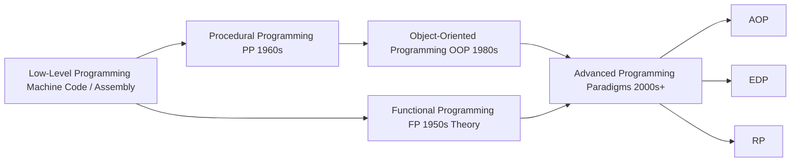

# From Programmer to Architect: Complete Analysis and Practical Comparison of 6 Programming Paradigms

> To truly understand programming, you must first understand programming paradigms. Below is a detailed introduction to the characteristics, application scenarios, and best practices of the 6 major programming paradigms.

---

## Table of Contents

1. [What is a Programming Paradigm?](#what-is-a-programming-paradigm)
2. [What is the Use of Programming Paradigms?](#what-is-the-use-of-programming-paradigms)
3. [Differences Between 6 Major Programming Paradigms](#differences-between-6-major-programming-paradigms)
4. [Execution Flow of 6 Major Programming Paradigms](#execution-flow-of-6-major-programming-paradigms)
5. [Implementation Examples of 6 Major Programming Paradigms in Different Languages](#implementation-examples-of-6-major-programming-paradigms-in-different-languages)
6. [Application of Programming Paradigms in Real-World Projects](#application-of-programming-paradigms-in-real-world-projects)

---

## What is a Programming Paradigm?

**Programming Paradigm** is the ideology system and methodological framework that guides program design. It defines how to organize code, express computational logic, and abstract and model problems. Different programming paradigms essentially represent different ways of thinking and philosophical approaches to problem modeling.

If **data structures and algorithms** form the computational foundation of computer programming, determining "what a program can do," then **programming paradigms** form the structural foundation of programming languages, determining "how a program is constructed." The former focuses on computational capability, the latter on organization; the former solves efficiency problems, the latter solves complexity problems.

Programming paradigms and design patterns belong to the same category of concepts, but they have distinct differences. Programming paradigms determine "how to think about programs," while design patterns are abstractions and optimizations of common code structures within a given paradigm, addressing "how to organize code more elegantly."

Related source code examples: [https://github.com/microwind/design-patterns/tree/main/programming-paradigm](https://github.com/microwind/design-patterns/tree/main/programming-paradigm)

Programming paradigms typically include the following characteristics:

- **Programming Philosophy** - How to view problems and solutions
- **Code Organization Method** - How to organize and structure code
- **Relationship Between Data and Operations** - How data relates to operations
- **Execution Flow** - How programs execute
- **Language Features** - Language support required for this paradigm

### Evolution of Programming Paradigms



---

## What is the Use of Programming Paradigms?

### 1. Guide Development Direction

Same problem: Student Grade Management System — Comparison of Processes in Different Programming Paradigms

```
Same problem: Implement a student grade management system

PP paradigm approach:
  Step 1: Read student data → Step 2: Calculate grades → Step 3: Output results

OOP paradigm approach:
  Define Student class → Define GradeCalculator class → Implement through object interaction

FP paradigm approach:
  Data flow → map(calculate) → filter(filter) → reduce(summarize)

EDP paradigm approach:
  Student added event → Grade calculation event → Result output event

RP paradigm approach:
  Grade data flow → Automatically respond to changes → Update UI in real-time
```



```mermaid
flowchart TD

%% ================= PP =================
subgraph PP[Procedural Programming PP]
    PP1[Read Student Data] --> PP2[Calculate Grades]
    PP2 --> PP3[Output Results]
end

%% ================= OOP =================
subgraph OOP[Object-Oriented Programming OOP]
    O1[Define Student Class]
    O2[Define GradeCalculator Class]
    O3[Complete Calculation Through Object Interaction]
    O1 --> O3
    O2 --> O3
end

%% ================= FP =================
subgraph FP[Functional Programming FP]
    F1[Grade Data Flow]
    F1 --> F2[map Calculate]
    F2 --> F3[filter Filter]
    F3 --> F4[reduce Summarize]
end

%% ================= EDP =================
subgraph EDP[Event-Driven Programming EDP]
    E1[Student Added Event]
    E1 --> E2[Grade Calculation Event]
    E2 --> E3[Result Output Event]
end

%% ================= RP =================
subgraph RP[Reactive Programming RP]
    R1[Grade Data Flow]
    R1 --> R2[Automatically Respond to Changes]
    R2 --> R3[Update UI in Real-Time]
end
```

### 2. Improve Code Quality

| Aspect | Description | Example |
|--------|-------------|---------|
| **Maintainability** | Clear structure makes code easy to understand and modify | OOP encapsulation hides complex implementation |
| **Testability** | Facilitates writing unit tests | FP pure functions have no side effects, easy to test |
| **Reusability** | Code snippets can be used in multiple places | FP higher-order functions, OOP inheritance |
| **Extensibility** | Easy to add new functionality | AOP aspect extension, EDP event-driven |
| **Performance Optimization** | Targeted optimization strategies | PP direct execution, RP backpressure handling |

### 3. Promote Team Collaboration

- **Unified Thinking** - Team members understand the same design philosophy
- **Code Standards** - Follow best practices of the same paradigm
- **Knowledge Sharing** - Use frameworks and libraries of the same paradigm

### 4. Solve Specific Problems

Each paradigm excels at solving specific types of problems:

```
Performance Critical → PP (Direct and Efficient)
Business Systems → OOP (Clear Structure)
Data Processing → FP (Easy to Parallelize)
Cross-cutting Concerns → AOP (Clean Code)
System Decoupling → EDP (Independent Modules)
Asynchronous Real-time → RP (Automatic Response)
```

---

## Differences Between 6 Major Programming Paradigms

### Overview Table

| Dimension | PP (Procedural) | OOP (Object-Oriented) | FP (Functional) | AOP (Aspect) | EDP (Event-Driven) | RP (Reactive) |
|-----------|--------------|-----------------|-------------|----------|-------------|----------|
| **Core Idea** | Step Decomposition | Object Modeling | Function Composition | Separation of Concerns | Event-Driven | Data Flow Response |
| **Focus** | How to Do | What is Object | What to Do | Cross-cutting Logic | When to Do | Automatic Response |
| **Data State** | Mutable | Encapsulated Mutable | Immutable | Mixed | Event-Related | Stream Immutable |
| **Execution Model** | Sequential Execution | Object Interaction | Function Call Chain | Weaving Interception | Event Listening | Stream Subscription |
| **Code Reuse** | Low | High (Inheritance) | High (Composition) | High (Aspect) | High (Event) | High (Operators) |
| **Learning Difficulty** | ⭐ | ⭐⭐ | ⭐⭐⭐ | ⭐⭐⭐ | ⭐⭐ | ⭐⭐⭐⭐ |
| **Application Breadth** | Broad (Foundational) | Very Broad | Moderate | Specialized | Broad | Specialized |
| **Performance** | Fastest | Very Fast | Moderate | Moderate | Moderate | Moderate |

### Detailed Comparison

#### 1. Procedural Programming (PP - Procedural Programming)

| Characteristic | Description |
|--------|-------------|
| **Definition** | Decompose problems step by step, breaking large problems into multiple small steps, each step corresponding to a function |
| **Core Elements** | Functions, Steps, Flow |
| **Data Management** | Global variables or static variables, passed between functions |
| **Key Features** | Sequential execution, enforced clear flow, easy to understand |
| **Best For** | Simple scripts, system programming, algorithm implementation |
| **Representative Languages** | C, Pascal, Go (Foundational) |
| **Advantages** | High execution efficiency, intuitive code, easy to learn |
| **Disadvantages** | Global variables cause coupling, difficult to extend, poor code reusability |

#### 2. Object-Oriented Programming (OOP - Object-Oriented Programming)

| Characteristic | Description |
|--------|-------------|
| **Definition** | Encapsulate data and operations in objects, implement functionality through object interaction |
| **Core Elements** | Classes, Objects, Inheritance, Polymorphism, Encapsulation |
| **Data Management** | Data encapsulated within objects, accessed through methods |
| **Key Features** | Object communication, state isolation, easy to extend |
| **Best For** | Large applications, business systems, GUI programs |
| **Representative Languages** | Java, C++, Python, C#, JavaScript |
| **Advantages** | Organized code, easy to extend, good reusability, simulates reality |
| **Disadvantages** | Complex design, steep learning curve, potential over-design |

#### 3. Functional Programming (FP - Functional Programming)

| Characteristic | Description |
|--------|-------------|
| **Definition** | View computation as function evaluation, avoid mutable data and side effects |
| **Core Elements** | Pure Functions, Immutable Data, Higher-Order Functions, Function Composition |
| **Data Management** | Immutable, each operation returns new data |
| **Key Features** | No side effects, predictable, easy to parallelize |
| **Best For** | Data processing, concurrent programming, scientific computing |
| **Representative Languages** | Haskell, Lisp, Scala, JavaScript (Supported) |
| **Advantages** | Easy to test, predictable, easy to parallelize, prevent side effects |
| **Disadvantages** | Steep learning curve, some problems require verbose code, potential performance issues |

#### 4. Aspect-Oriented Programming (AOP - Aspect-Oriented Programming)

| Characteristic | Description |
|--------|-------------|
| **Definition** | Separate cross-cutting concerns (logging, transactions, permissions, etc.) from core business logic |
| **Core Elements** | Aspect, Join Point, Pointcut, Advice, Weaving |
| **Data Management** | Enhance object behavior through weaving |
| **Key Features** | Clear concerns, clean code, easy to maintain |
| **Best For** | Enterprise applications, framework development, cross-cutting functions |
| **Representative Languages** | Java (Spring AOP), C#, Python |
| **Advantages** | Clear concerns, easy to maintain, reduced code duplication |
| **Disadvantages** | Increased complexity, difficult debugging, runtime overhead |

#### 5. Event-Driven Programming (EDP - Event-Driven Programming)

| Characteristic | Description |
|--------|-------------|
| **Definition** | Program flow is determined by event occurrence and handling |
| **Core Elements** | Event Source, Event, Event Listener, Event Handler |
| **Data Management** | Pass data through event objects |
| **Key Features** | Asynchronous execution, module decoupling, fast response |
| **Best For** | GUI applications, games, web servers, real-time systems |
| **Representative Languages** | JavaScript, Node.js, C++, Java |
| **Advantages** | Independent modules, easy to extend, good user experience |
| **Disadvantages** | Complex event flow, difficult to trace and debug |

#### 6. Reactive Programming (RP - Reactive Programming)

| Characteristic | Description |
|--------|-------------|
| **Definition** | Automatically respond to data changes through asynchronous data streams |
| **Core Elements** | Observable, Subscriber, Operators, Scheduler |
| **Data Management** | Data streamified, transformed through operators |
| **Key Features** | Automatic response, backpressure handling, asynchronous non-blocking |
| **Best For** | Real-time data processing, high concurrency, web applications |
| **Representative Languages** | JavaScript (RxJS), Java (Reactor), Python |
| **Advantages** | Simplify asynchronous programming, automatic backpressure, efficient concurrency |
| **Disadvantages** | Steep learning curve, difficult debugging, performance overhead |

---

## Execution Flow of 6 Major Programming Paradigms

### 1. Procedural Programming (PP) Execution Flow

```
┌─────────────┐
│  Start      │
└──────┬──────┘
       ↓
┌──────────────────┐
│ Function1: Read Data │
└──────┬───────────┘
       ↓
┌──────────────────┐
│ Function2: Process Data │
└──────┬───────────┘
       ↓
┌──────────────────┐
│ Function3: Output Results │
└──────┬───────────┘
       ↓
┌──────────────────┐
│ Function4: Close Resources │
└──────┬───────────┘
       ↓
┌─────────────┐
│  End        │
└─────────────┘

Characteristics:
✓ Linear Execution
✓ Global State Transfer
✓ Fixed Function Call Order
✓ Direct and Efficient
```

### 2. Object-Oriented Programming (OOP) Execution Flow

```
┌─────────────────────┐
│ Create Object Instance │
│ (Student st1)       │
└────────┬────────────┘
         ↓
    ┌────────────────┐
    │ Object A: Student │
    │ Properties: name,age │
    │ Methods: study()   │
    │    getGrade() │
    └────────┬───────┘
             ↓
    ┌────────────────┐
    │ Object B: Teacher │
    │ Properties: name      │
    │ Methods: grade()   │
    │    feedback() │
    └────────┬───────┘
             ↓
    ┌────────────────────┐
    │ Object Communication │
    │ student.study()   │
    │ teacher.grade()   │
    │ student.feedback() │
    └────────┬───────────┘
             ↓
    ┌────────────────────┐
    │ Maintain Object State │
    │ (name, age changes)   │
    └────────┬───────────┘
             ↓
        ┌─────────┐
        │  End    │
        └─────────┘

Characteristics:
✓ Object Creation and Destruction
✓ Object Communication
✓ State Encapsulation
✓ Inheritance and Polymorphism Calls
```

### 3. Functional Programming (FP) Execution Flow

```
Input Data [1, 2, 3, 4, 5]
    ↓
┌─────────────────┐
│ Function1: map() │  Multiply by 2
│ [2, 4, 6, 8,10] │
└────────┬────────┘
         ↓
┌─────────────────┐
│ Function2: filter() │  > 5
│ [6, 8, 10]      │
└────────┬────────┘
         ↓
┌─────────────────┐
│ Function3: reduce() │  Sum
│ 24              │
└────────┬────────┘
         ↓
      Output Result

Flow Characteristics:
✓ Data Pipeline
✓ Function Chain Calls
✓ Do Not Change Original Data
✓ Return New Data Structures
✓ Composable, Reusable
```

### 4. Aspect-Oriented Programming (AOP) Execution Flow

```
┌──────────────────┐
│ Method Call      │
│ userService      │
│ .createUser()    │
└────────┬─────────┘
         ↓
    ┌────────────────────┐
    │ Before Advice      │
    │ (Before Advice)    │
    │ - Parameter Validation │
    │ - Permission Check  │
    └────────┬───────────┘
             ↓
    ┌────────────────────┐
    │ Core Business Logic │
    │ (Save User)        │
    └────────┬───────────┘
             ↓
    ┌────────────────────┐
    │ After Advice       │
    │ (After Advice)     │
    │ - Logging          │
    │ - Send Email       │
    └────────┬───────────┘
             ↓
    ┌────────────────────┐
    │ AfterReturning     │
    │ (Return Advice)    │
    │ - Update Cache     │
    └────────┬───────────┘
             ↓
        ┌──────────┐
        │ Return Result │
        └──────────┘

Execution Characteristics:
✓ Business Logic Separated from Cross-cutting Logic
✓ Weaving Operations
✓ Chain Execution of Multiple Advices
✓ Maintain Core Business Purity
```

### 5. Event-Driven Programming (EDP) Execution Flow

```
User Operation: Click Button
    ↓
┌────────────────┐
│ Event Source Produces Event │
│ (Click Event)  │
└────────┬───────┘
         ↓
    ┌────────────────────┐
    │ Event Queue        │
    │ [event1]           │
    │ [event2]           │
    │ [event3]           │
    └────────┬───────────┘
             ↓
    ┌────────────────────┐
    │ Event Dispatcher   │
    │ (Event Dispatcher) │
    └────────┬───────────┘
             ↓
    ┌─────────────────────┐
    │ Listener1: onSave()    │ → Save Data
    │ Listener2: onLog()     │ → Log
    │ Listener3: onNotify()  │ → Send Notification
    └────────┬────────────┘
             ↓
        ┌──────────┐
        │ End Processing │
        └──────────┘

Execution Characteristics:
✓ Asynchronous Non-Blocking
✓ Event Queue Processing
✓ Multiple Listeners Process in Parallel
✓ Module Decoupling
```

### 6. Reactive Programming (RP) Execution Flow

```
Data Source (Observable)
    ↓
┌──────────────────┐
│ Create Data Flow │
│ [1, 2, 3, 4, 5]  │
└────────┬─────────┘
         ↓
    ┌───────────────────────┐
    │ Operator Chain        │
    │ ┌─────────────────┐   │
    │ │ map(x => x*2)   │ → [2,4,6,8,10]
    │ └────────┬────────┘   │
    │          ↓            │
    │ ┌─────────────────┐   │
    │ │filter(x > 5)    │ → [6,8,10]
    │ └────────┬────────┘   │
    │          ↓            │
    │ ┌─────────────────┐   │
    │ │reduce(+)        │ → 24
    │ └────────┬────────┘   │
    └───────────────────────┘
         ↓
    ┌───────────────────────┐
    │ Subscribe             │
    │ .subscribe({          │
    │   next: value => log  │
    │   error: err => handle│
    │   complete: () => end │
    │ })                    │
    └────────┬──────────────┘
             ↓
        ┌─────────────┐
        │ Response Results │
        │ next(24)    │
        │ complete()  │
        └─────────────┘

Execution Characteristics:
✓ Asynchronous Data Stream
✓ Middle Operator Chain
✓ Automatic Backpressure Handling
✓ Complete Error Handling
✓ Lifecycle Management (subscribe/unsubscribe)
```

---

## Implementation Examples of 6 Major Programming Paradigms in Different Languages

### Scenario: Data Statistics System

Statistics on student grades, which requires:
1. Read student grade data
2. Calculate average score
3. Find passing students
4. Output results

### 1. PP - C Language (Procedural Programming)

```c
#include <stdio.h>
#include <string.h>

#define MAX_STUDENTS 5

typedef struct {
    char name[50];
    int score;
} Student;

// Global data
Student students[MAX_STUDENTS] = {
    {"Alice", 85},
    {"Bob", 72},
    {"Charlie", 90},
    {"David", 68},
    {"Eve", 92}
};

int count = 5;

// Step 1: Calculate average score
float calculateAverage() {
    float sum = 0;
    for (int i = 0; i < count; i++) {
        sum += students[i].score;
    }
    return sum / count;
}

// Step 2: Count passing students
int countPassed() {
    int passed = 0;
    for (int i = 0; i < count; i++) {
        if (students[i].score >= 60) {
            passed++;
        }
    }
    return passed;
}

// Step 3: Display passing students
void displayPassed() {
    printf("Passed Students:\n");
    for (int i = 0; i < count; i++) {
        if (students[i].score >= 60) {
            printf("  %s: %d\n", students[i].name, students[i].score);
        }
    }
}

// Step 4: Output statistics
void printStatistics() {
    float average = calculateAverage();
    int passed = countPassed();

    printf("=== Grade Statistics ===\n");
    printf("Average Score: %.2f\n", average);
    printf("Passed Count: %d\n", passed);
    printf("Pass Rate: %.1f%%\n", (passed * 100.0) / count);
}

int main() {
    printStatistics();
    displayPassed();
    return 0;
}
```

**Characteristics:**
- Execute in step-by-step order
- Global data sharing
- Functions directly operate on data
- Code is intuitive and easy to understand

---

### 2. OOP - Java (Object-Oriented Programming)

```java
import java.util.ArrayList;
import java.util.List;

class Student {
    private String name;
    private int score;

    public Student(String name, int score) {
        this.name = name;
        this.score = score;
    }

    public String getName() { return name; }
    public int getScore() { return score; }
    public boolean isPassed() { return score >= 60; }

    @Override
    public String toString() {
        return name + ": " + score;
    }
}

class GradeStatistics {
    private List<Student> students;

    public GradeStatistics(List<Student> students) {
        this.students = students;
    }

    // Calculate average score
    public double getAverage() {
        return students.stream()
            .mapToInt(Student::getScore)
            .average()
            .orElse(0);
    }

    // Count passing students
    public int getPassedCount() {
        return (int) students.stream()
            .filter(Student::isPassed)
            .count();
    }

    // Get list of passing students
    public List<Student> getPassedStudents() {
        return students.stream()
            .filter(Student::isPassed)
            .toList();
    }

    // Output statistics
    public void printStatistics() {
        System.out.println("=== Grade Statistics ===");
        System.out.printf("Average Score: %.2f\n", getAverage());
        System.out.printf("Passed Count: %d\n", getPassedCount());
        System.out.printf("Pass Rate: %.1f%%\n",
            (getPassedCount() * 100.0) / students.size());

        System.out.println("\nPassed Students:");
        getPassedStudents().forEach(s -> System.out.println("  " + s));
    }
}

public class GradeAnalyzer {
    public static void main(String[] args) {
        List<Student> students = new ArrayList<>();
        students.add(new Student("Alice", 85));
        students.add(new Student("Bob", 72));
        students.add(new Student("Charlie", 90));
        students.add(new Student("David", 68));
        students.add(new Student("Eve", 92));

        GradeStatistics stats = new GradeStatistics(students);
        stats.printStatistics();
    }
}
```

**Characteristics:**
- Object interaction
- Data encapsulation
- Inheritance and polymorphism
- Easy to extend

---

### 3. FP - JavaScript (Functional Programming)

```javascript
// Define student data (immutable)
const students = [
    { name: "Alice", score: 85 },
    { name: "Bob", score: 72 },
    { name: "Charlie", score: 90 },
    { name: "David", score: 68 },
    { name: "Eve", score: 92 }
];

// Pure function: Calculate average score
const calculateAverage = (students) => {
    const sum = students.reduce((acc, s) => acc + s.score, 0);
    return sum / students.length;
};

// Pure function: Filter passing students
const filterPassed = (students) => students.filter(s => s.score >= 60);

// Pure function: Count passing students
const countPassed = (students) => {
    return filterPassed(students).length;
}

// Pure function: Calculate pass rate
const passRate = (students) =>
    (countPassed(students) / students.length) * 100;

// Pure function: Format output
const formatStatistics = (students) => ({
    average: calculateAverage(students).toFixed(2),
    passedCount: countPassed(students),
    passRate: passRate(students).toFixed(1),
    passedStudents: filterPassed(students)
});

// Pure function: Display results
const printStatistics = (students) => {
    const stats = formatStatistics(students);

    console.log("=== Grade Statistics ===");
    console.log(`Average Score: ${stats.average}`);
    console.log(`Passed Count: ${stats.passedCount}`);
    console.log(`Pass Rate: ${stats.passRate}%`);
    console.log("\nPassed Students:");
    stats.passedStudents.forEach(s =>
        console.log(`  ${s.name}: ${s.score}`)
    );
};

// Execute
printStatistics(students);

// Function composition example
const compose = (...fns) => x =>
    fns.reduceRight((acc, fn) => fn(acc), x);

const getStatsSummary = compose(
    formatStatistics,
    students
);
```

**Characteristics:**
- Pure functions without side effects
- Immutable data
- Function composition
- Easy to test

---

### 4. AOP - Java with Spring (Aspect-Oriented Programming)

```java
import org.springframework.stereotype.Service;
import org.aspectj.lang.annotation.Aspect;
import org.aspectj.lang.annotation.Before;
import org.aspectj.lang.annotation.After;
import org.aspectj.lang.annotation.Around;
import org.aspectj.lang.ProceedingJoinPoint;

// Core business class (without cross-cutting concerns)
@Service
public class GradeService {

    public double calculateAverage(int[] scores) {
        int sum = 0;
        for (int score : scores) {
            sum += score;
        }
        return sum / (double) scores.length;
    }

    public int[] filterPassed(int[] scores) {
        return java.util.Arrays.stream(scores)
            .filter(s -> s >= 60)
            .toArray();
    }

    public void printStatistics(int[] scores) {
        System.out.println("=== Grade Statistics ===");
        System.out.printf("Average: %.2f\n", calculateAverage(scores));
        int passed = filterPassed(scores).length;
        System.out.printf("Passed: %d / %d\n", passed, scores.length);
    }
}

// Aspect: Handle cross-cutting concerns
@Aspect
@Service
public class GradeAspect {

    // Before Advice: Parameter validation
    @Before("execution(* GradeService.*(..))")
    public void validateInput(JoinPoint jp) {
        System.out.println("[Validation] Method " + jp.getSignature().getName() + " starting");
        Object[] args = jp.getArgs();
        if (args.length > 0 && args[0] instanceof int[]) {
            int[] scores = (int[]) args[0];
            if (scores.length == 0) {
                throw new IllegalArgumentException("Grade list cannot be empty");
            }
        }
    }

    // Around Advice: Performance monitoring
    @Around("execution(* GradeService.*(..))")
    public Object monitorPerformance(ProceedingJoinPoint pjp) throws Throwable {
        long start = System.currentTimeMillis();
        System.out.println("[Monitor] Starting: " + pjp.getSignature().getName());

        try {
            Object result = pjp.proceed();
            long duration = System.currentTimeMillis() - start;
            System.out.println("[Monitor] Execution time: " + duration + "ms");
            return result;
        } catch (Exception e) {
            System.out.println("[Error Handling] " + e.getMessage());
            throw e;
        }
    }

    // After Advice: Logging
    @After("execution(* GradeService.*(..))")
    public void logExecution(JoinPoint jp) {
        System.out.println("[Log] Method " + jp.getSignature().getName() + " completed");
    }
}

// Usage example
public class GradeAnalyzer {
    public static void main(String[] args) {
        int[] scores = {85, 72, 90, 68, 92};

        GradeService service = new GradeService();
        service.printStatistics(scores);
        // Aspect will automatically weave in validation, monitoring, logging, etc.
    }
}
```

**Characteristics:**
- Core logic separated from cross-cutting logic
- Automatic advice weaving
- Easy to add functionality
- Clean code

---

### 5. EDP - JavaScript (Event-Driven Programming)

```javascript
const EventEmitter = require('events');

class GradeAnalyzer extends EventEmitter {
    constructor(students) {
        super();
        this.students = students;
        this.setupListeners();
    }

    setupListeners() {
        // Listener 1: Validate data
        this.on('analyzeStart', (data) => {
            console.log('[Event] Starting analysis, data count: ' + data.count);
        });

        // Listener 2: Calculate average
        this.on('analyzeStart', () => {
            const average = this.calculateAverage();
            this.emit('averageCalculated', { average });
            console.log(`[Average] ${average.toFixed(2)}`);
        });

        // Listener 3: Filter passing
        this.on('analyzeStart', () => {
            const passed = this.filterPassed();
            this.emit('passedFiltered', { passed });
            console.log(`[Passed] ${passed.length} students passed`);
        });

        // Listener 4: Generate report
        this.on('averageCalculated', (data) => {
            this.emit('reportGenerated', {
                average: data.average,
                timestamp: new Date()
            });
        });

        // Listener 5: Send notification
        this.on('reportGenerated', (data) => {
            console.log(`[Notification] Report generated at ${data.timestamp}`);
        });

        // Error handling
        this.on('error', (error) => {
            console.log(`[Error] ${error.message}`);
        });
    }

    calculateAverage() {
        const sum = this.students.reduce((a, s) => a + s.score, 0);
        return sum / this.students.length;
    }

    filterPassed() {
        return this.students.filter(s => s.score >= 60);
    }

    analyze() {
        try {
            this.emit('analyzeStart', { count: this.students.length });
        } catch (e) {
            this.emit('error', e);
        }
    }
}

// Usage example
const students = [
    { name: "Alice", score: 85 },
    { name: "Bob", score: 72 },
    { name: "Charlie", score: 90 },
    { name: "David", score: 68 },
    { name: "Eve", score: 92 }
];

const analyzer = new GradeAnalyzer(students);
analyzer.analyze();
// Output:
// [Event] Starting analysis, data count: 5
// [Average] 81.40
// [Passed] 4 students passed
// [Notification] Report generated at ...
```

**Characteristics:**
- Asynchronous non-blocking
- Module decoupling
- Event-driven
- Easy to extend

---

### 6. RP - JavaScript with RxJS (Reactive Programming)

```javascript
import { from, of } from 'rxjs';
import { map, filter, reduce, scan, tap } from 'rxjs/operators';

// Define student data stream
const students = [
    { name: "Alice", score: 85 },
    { name: "Bob", score: 72 },
    { name: "Charlie", score: 90 },
    { name: "David", score: 68 },
    { name: "Eve", score: 92 }
];

class ReactiveGradeAnalyzer {
    constructor(students) {
        this.studentsData$ = from(students);
    }

    // Reactive pipeline: Calculate statistics
    analyze() {
        return this.studentsData$.pipe(
            // Step 1: Validate data
            tap(student => {
                if (student.score < 0 || student.score > 100) {
                    throw new Error(`Invalid score for ${student.name}`);
                }
            }),

            // Step 2: Map to grade level
            map(student => ({
                ...student,
                grade: this.getGrade(student.score)
            })),

            // Step 3: Log
            tap(student => {
                console.log(`[Processing] ${student.name}: ${student.score} (${student.grade})`);
            }),

            // Step 4: Filter passing students
            filter(student => student.score >= 60)
        );
    }

    // Calculate overall statistics
    getStatistics() {
        return this.studentsData$.pipe(
            // Cumulative calculation
            reduce((acc, student) => ({
                count: acc.count + 1,
                sum: acc.sum + student.score,
                passed: acc.passed + (student.score >= 60 ? 1 : 0)
            }), { count: 0, sum: 0, passed: 0 }),

            // Transform to statistics object
            map(acc => ({
                totalStudents: acc.count,
                average: (acc.sum / acc.count).toFixed(2),
                passedCount: acc.passed,
                passRate: ((acc.passed / acc.count) * 100).toFixed(1)
            }))
        );
    }

    getGrade(score) {
        if (score >= 90) return 'A';
        if (score >= 80) return 'B';
        if (score >= 70) return 'C';
        if (score >= 60) return 'D';
        return 'F';
    }
}

// Usage example
const analyzer = new ReactiveGradeAnalyzer(students);

console.log("=== Passing Students ===");
analyzer.analyze().subscribe({
    next: (student) => {
        console.log(`  ${student.name}: ${student.score}`);
    },
    error: (err) => {
        console.log(`[Error] ${err.message}`);
    },
    complete: () => {
        console.log("Processing completed");
    }
});

console.log("\n=== Statistics ===");
analyzer.getStatistics().subscribe({
    next: (stats) => {
        console.log(`Average Score: ${stats.average}`);
        console.log(`Passed Count: ${stats.passedCount}/${stats.totalStudents}`);
        console.log(`Pass Rate: ${stats.passRate}%`);
    },
    error: (err) => {
        console.log(`[Error] ${err.message}`);
    },
    complete: () => {
        console.log("Statistics completed");
    }
});
```

**Characteristics:**
- Asynchronous data stream
- Operator chain
- Automatic backpressure
- Complete error handling

---

## Application of Programming Paradigms in Real-World Projects

### Case 1: E-commerce Platform Order System

#### Project Background

Develop an e-commerce platform that handles:
- Order creation and management
- Payment processing
- Inventory updates
- User notifications

#### Paradigm Application Scheme

```
Frontend UI Layer:
  └─ RP (Reactive) - React/Vue responds to user operations in real-time
    User Input → Observable Stream → Real-time Validation → UI Update

Backend API Layer:
  └─ OOP (Object-Oriented) - Spring Boot service layer design
    ├─ OrderService
    ├─ PaymentService
    └─ UserService

Business Logic Layer:
  ├─ OOP - Order, Payment, User and other business objects
  ├─ FP - Data processing pipeline (Validate → Calculate → Format)
  └─ AOP - Transaction management, logging, permission checking

Communication Layer:
  ├─ EDP - Event-driven
  │   Order Created Event → Deduct Inventory
  │                     → Process Payment
  │                     → Notify User
  └─ RP - Message queue processing for high concurrency

Data Processing Layer:
  └─ FP - Immutable data structures, pure function processing
```

#### Implementation Example

```java
// OOP: Domain Models
class Order {
    private String id;
    private User user;
    private List<OrderItem> items;
    private OrderStatus status;

    public void placeOrder() { status = PENDING; }
    public void confirmPayment() { status = PAID; }
    public void prepareShip() { status = PREPARING; }
}

// AOP: Cross-cutting concerns (transactions, logging)
@Aspect
@Service
public class OrderAspect {
    @Around("execution(* OrderService.*(..))")
    public Object manageTransaction(ProceedingJoinPoint pjp) throws Throwable {
        // Begin transaction
        beginTransaction();
        try {
            return pjp.proceed();
        } catch (Exception e) {
            rollback();
            throw e;
        } finally {
            commit();
        }
    }
}

// EDP: Event-driven
@Service
public class OrderEventListener {
    @EventListener
    public void onOrderCreated(OrderCreatedEvent event) {
        // Deduct inventory
        inventoryService.decreaseStock(event.getOrder());
        // Send notification
        notificationService.sendEmail(event.getUser());
    }
}

// FP: Data processing pipeline
public List<OrderDTO> processOrders(List<Order> orders) {
    return orders.stream()
        .filter(o -> o.getStatus() == PAID)      // Filter paid
        .map(this::calculateTax)                  // Calculate tax
        .map(this::applyDiscount)                 // Apply discount
        .map(OrderDTO::from)                      // Convert DTO
        .collect(Collectors.toList());            // Collect results
}
```

#### Effect

| Aspect | Effect |
|--------|--------|
| **Code Quality** | OOP ensures clear structure, AOP ensures clean code |
| **Performance** | EDP processes high concurrency asynchronously, RP manages backpressure |
| **Maintainability** | FP pure functions easy to test, EDP events easy to trace |
| **Extensibility** | Add new functionality by simply adding new event listeners |

---

### Case 2: Real-time Data Analytics System

#### Project Background

Build a real-time data analytics platform that handles:
- Log collection
- Data cleaning
- Metric calculation
- Real-time reports

#### Paradigm Application Scheme

```
Data Collection Layer:
  └─ EDP (Event-driven)
    Multiple Data Sources → Event Bus → Message Queue

Data Processing Layer:
  ├─ FP (Functional) - Pure function processing
  │   Clean → Transform → Aggregate → Calculate
  └─ RP (Reactive) - Stream processing for big data
    Backpressure Control → Error Handling → Recovery Mechanism

Computing Layer:
  └─ PP (Procedural) - Optimize critical paths
    High-Performance Algorithm → Direct Calculation → Cache Results

Display Layer:
  └─ RP (Reactive) - Update UI in real-time
    Data Change → Auto Push → WebSocket Update
```

#### Implementation Example

```python
from functools import reduce
from typing import List, Dict
import asyncio
from rx import Observable

# FP: Data cleaning pure function
def clean_log(log):
    """Pure function: Clean log"""
    if not log.get('timestamp'):
        return None
    return {
        'timestamp': log['timestamp'],
        'user_id': log['user_id'],
        'action': log['action'].lower()
    }

# FP: Data transformation
def extract_metrics(log):
    """Pure function: Extract metrics"""
    return {
        'user_id': log['user_id'],
        'action': log['action'],
        'hour': log['timestamp'].hour
    }

# FP: Data aggregation
def aggregate_metrics(metrics_list):
    """Pure function: Aggregate metrics"""
    def reducer(acc, metric):
        key = f"{metric['hour']}:{metric['action']}"
        if key not in acc:
            acc[key] = 0
        acc[key] += 1
        return acc

    return reduce(reducer, metrics_list, {})

# FP: Function composition
def process_logs(logs):
    """Compose multiple pure functions"""
    return (
        logs
        .filter(lambda x: x is not None)
        .map(extract_metrics)
        .collect()
        .map(aggregate_metrics)
    )

# RP: Reactive stream processing
class DataPipeline:
    def __init__(self):
        self.logs_stream = Observable.create(self.create_logs_stream)

    @staticmethod
    def create_logs_stream(observer):
        """Create log data stream"""
        try:
            # Simulate log stream
            logs = [
                {'timestamp': ..., 'user_id': 1, 'action': 'LOGIN'},
                {'timestamp': ..., 'user_id': 2, 'action': 'CLICK'},
                # ...
            ]

            for log in logs:
                observer.on_next(log)
            observer.on_completed()
        except Exception as e:
            observer.on_error(e)

    def start_processing(self):
        """Start processing stream"""
        return self.logs_stream.pipe(
            # Step 1: Clean
            operators.map(clean_log),
            operators.filter(lambda x: x is not None),

            # Step 2: Transform
            operators.map(extract_metrics),

            # Step 3: Buffer and aggregate
            operators.buffer_count(100),
            operators.map(aggregate_metrics),

            # Step 4: Error handling
            operators.catch_error(handle_error)
        )

    def subscribe(self):
        """Subscribe to data stream"""
        subscription = self.start_processing().subscribe(
            on_next=lambda metrics: self.save_metrics(metrics),
            on_error=lambda e: print(f"Error: {e}"),
            on_completed=lambda: print("Processing completed")
        )
        return subscription

# EDP: Event-driven
class EventHub:
    def __init__(self):
        self.listeners = {}

    def on(self, event_type, callback):
        """Register event listener"""
        if event_type not in self.listeners:
            self.listeners[event_type] = []
        self.listeners[event_type].append(callback)

    def emit(self, event_type, data):
        """Emit event"""
        if event_type in self.listeners:
            for callback in self.listeners[event_type]:
                callback(data)

# Usage example
event_hub = EventHub()
pipeline = DataPipeline()

# Register event listeners
event_hub.on('metrics_calculated', lambda metrics: {
    'save_to_db': save_metrics(metrics),
    'send_alert': send_alert_if_needed(metrics),
    'update_dashboard': push_to_websocket(metrics)
})

# Start processing
subscription = pipeline.subscribe()
```

#### Effect

| Aspect | Effect |
|--------|--------|
| **Processing Speed** | FP pure functions efficient, PP optimizes critical path |
| **Concurrency Capability** | RP backpressure manages high throughput |
| **Reliability** | Complete error handling and recovery mechanism |
| **Maintainability** | FP pure functions easy to test, EDP events easy to trace |

---

### Case 3: Game Engine Paradigm Application

#### Project Background

Develop a 2D game engine that handles:
- Game object management
- Collision detection
- Event handling
- Rendering optimization

#### Paradigm Application Scheme

```
Main Game Loop:
  └─ PP (Procedural) - High-performance critical path
    Initialize → Process Input → Update Logic → Render → Clean

Game Object System:
  ├─ OOP (Object-Oriented) - GameObject class hierarchy
  │   ├─ Player (Character)
  │   ├─ Enemy (Enemy)
  │   └─ Obstacle (Obstacle)
  └─ EDP (Event-Driven) - Game events
    Collision Event → Damage Calculation → Sound Effects

Event System:
  └─ EDP (Event-Driven)
    User Input → Game Logic → UI Update
    Collision Detection → Event Sending → Handle Results

Rendering Optimization:
  └─ FP (Functional) - Pure function processing
    Sort Objects → Batch Render → Stack Effects
```

#### Implementation Example

```cpp
// PP: Game main loop (high-performance)
class GameEngine {
private:
    const float FRAME_TIME = 1.0f / 60.0f;  // 60 FPS

public:
    void run() {
        while (isRunning) {
            // Step 1: Handle input (PP, sequential execution)
            handleInput();

            // Step 2: Update game state (OOP, object calls)
            updateGameObjects(deltaTime);

            // Step 3: Check collisions (PP+EDP, sequential check, event-driven)
            checkCollisions();

            // Step 4: Render (PP+FP, sequential render, function composition)
            render();

            // Step 5: Clean resources
            cleanup();

            deltaTime = calculateDeltaTime();
        }
    }
};

// OOP: Game object base class
class GameObject {
protected:
    Vector2 position;
    Vector2 velocity;
    bool active;

public:
    virtual void update(float deltaTime) = 0;
    virtual void render() = 0;
    virtual void onCollide(GameObject* other) = 0;

    Vector2 getPosition() const { return position; }
    void setVelocity(Vector2 v) { velocity = v; }
};

// OOP: Concrete game object
class Player : public GameObject {
private:
    int health;
    int score;

public:
    void update(float deltaTime) override {
        // Handle input
        if (input.isPressed(KEY_LEFT))
            velocity.x = -5.0f;

        // Update position
        position += velocity * deltaTime;

        // Boundary check
        clampPosition();
    }

    void onCollide(GameObject* other) override {
        // EDP: Emit collision event
        eventManager.emit("collision", {
            "player": this,
            "other": other
        });
    }
};

// EDP: Event manager
class EventManager {
private:
    std::map<std::string, std::vector<Callback>> listeners;

public:
    void on(std::string event, Callback callback) {
        listeners[event].push_back(callback);
    }

    void emit(std::string event, EventData data) {
        if (listeners.count(event)) {
            for (auto& callback : listeners[event]) {
                callback(data);
            }
        }
    }
};

// FP: Pure function for rendering
std::vector<GameObject*> sortByDepth(
    const std::vector<GameObject*>& objects) {
    // Sort by depth
    auto sorted = objects;
    std::sort(sorted.begin(), sorted.end(),
        [](GameObject* a, GameObject* b) {
            return a->getDepth() < b->getDepth();
        });
    return sorted;  // Return new array, don't modify original
}

void batchRender(const std::vector<GameObject*>& objects) {
    // FP: Pure function, no side effects
    auto sorted = sortByDepth(objects);

    for (auto obj : sorted) {
        obj->render();
    }
}

// Usage example
int main() {
    GameEngine engine;

    // Register game events
    engine.eventManager.on("collision", [](EventData data) {
        Player* player = static_cast<Player*>(data["player"]);
        GameObject* other = static_cast<GameObject*>(data["other"]);

        // Handle collision
        if (dynamic_cast<Enemy*>(other)) {
            player->takeDamage(10);
            play_sound("hit.wav");
        }
    });

    engine.run();
    return 0;
}
```

#### Effect

| Aspect | Effect |
|--------|--------|
| **Performance** | PP main loop efficient, FP sorting function optimized |
| **Maintainability** | OOP clear object model |
| **Extensibility** | EDP event system easy to add new features |
| **Development Efficiency** | Clear layered design speeds up development |

---

## Summary and Best Practices

### When to Choose Which Paradigm

```
Requirement:                Best Paradigm       Reason
━━━━━━━━━━━━━━━━━━━━━━━━━━━━━━━━━━━━━━━━━━━━━━━━━
Quick Scripts               PP                  Simple and direct
Business Systems            OOP + AOP           Clear structure, easy to extend
Data Processing             FP                  Pure functions, parallelizable
High Concurrency I/O        RP                  Backpressure management, efficient
Real-time Updates           EDP + RP            Async-driven, auto-responsive
Cross-cutting Functions     AOP                 Separation of concerns
Performance Critical Path   PP                  Direct execution fastest
Large Complex Systems       Multi-paradigm Mix  Each paradigm's strengths
```

### Mixed Paradigm Usage

Most real-world projects adopt a **multi-paradigm mixed** approach:

```
Recommended Combinations:
✓ OOP + AOP (Spring framework standard)
✓ OOP + FP (Modern Java/Python)
✓ FP + RP (Functional reactive)
✓ EDP + RP (Event-driven reactive)
✓ PP + OOP + FP (Full-stack application)

Avoid:
✗ Over-using AOP causing complexity
✗ Mixing incompatible ideas
✗ Using a paradigm just to use it
```

### Learning Path

Programming paradigms are essential skills that programmers must learn and master, and are an important entry point for understanding the essence of programming languages. Therefore, you need to spend time practicing and mastering them. You can follow the learning path below to enhance practice, constantly polish, and improve understanding of programming paradigms.

```
Beginner (1-2 weeks)
  └─ PP basic control flow
     OOP basic concepts
     Complete simple projects

Intermediate (2-6 months)
  └─ FP functional thinking
     AOP and framework application
     EDP event-driven
     Complete moderately complex projects

Advanced (6+ months)
  └─ RP reactive programming
     Mixed paradigm application
     Architecture design
     Participate in large projects
```

---

## Summary and Language Paradigm Matrix

### Significance of Programming Paradigms

Programming paradigms are **problem-solving thinking patterns**. Mastering multiple paradigms allows you to:
- Choose the most suitable solution for a problem
- Quickly switch between different projects
- Design more elegant system architecture

### Evolution Relationship of 6 Paradigms

```
PP (Foundation) → OOP (Objects) → FP (Functions) → RP (Stream Processing)
                    ↓
                  AOP (Aspects)
                    ↓
                  EDP (Event-Driven)

Modern Development: Multi-paradigm mixed usage
```

### Paradigm Support Matrix for Various Languages

| Language | PP | OOP | FP | AOP | EDP | RP | Best Use |
|----------|--------|--------|--------|---------|---------|--------|----------|
| **C** | ⭐⭐⭐⭐⭐ | ⭐⭐ | ⭐ | - | ⭐⭐ | - | System Programming |
| **Java** | ⭐⭐⭐ | ⭐⭐⭐⭐⭐ | ⭐⭐⭐ | ⭐⭐⭐⭐ | ⭐⭐⭐ | ⭐⭐⭐⭐ | Enterprise Applications |
| **Python** | ⭐⭐⭐⭐ | ⭐⭐⭐⭐ | ⭐⭐⭐⭐ | ⭐⭐ | ⭐⭐⭐ | ⭐⭐⭐ | Data Science |
| **JavaScript** | ⭐⭐⭐⭐ | ⭐⭐⭐⭐ | ⭐⭐⭐⭐⭐ | ⭐ | ⭐⭐⭐⭐⭐ | ⭐⭐⭐⭐⭐ | Web Full-Stack |
| **TypeScript** | ⭐⭐⭐⭐ | ⭐⭐⭐⭐⭐ | ⭐⭐⭐⭐⭐ | ⭐ | ⭐⭐⭐⭐⭐ | ⭐⭐⭐⭐⭐ | Web Full-Stack |
| **Go** | ⭐⭐⭐⭐⭐ | ⭐⭐⭐ | ⭐⭐⭐ | - | ⭐⭐⭐⭐ | ⭐⭐⭐ | Microservices |
| **Rust** | ⭐⭐⭐⭐⭐ | ⭐⭐⭐⭐ | ⭐⭐⭐⭐⭐ | - | ⭐⭐⭐ | ⭐⭐⭐⭐ | System Programming |

**Legend:** ⭐⭐⭐⭐⭐ Perfect Support | ⭐⭐⭐ Supported | ⭐ Limited | - Not Supported

### Quick Selection Guide

```
Quick Web Development     → JavaScript/TypeScript + FP + EDP + RP
Enterprise Systems        → Java + OOP + AOP
Data Analytics            → Python + FP + PP
High-Performance Systems  → C/Rust + PP
Microservice Architecture → Go + PP + EDP
Real-time Data Processing → Java RP + Scala FP
```

---

## More Source Code

- [https://github.com/microwind/design-patterns/tree/main/programming-paradigm](https://github.com/microwind/design-patterns/tree/main/programming-paradigm)
