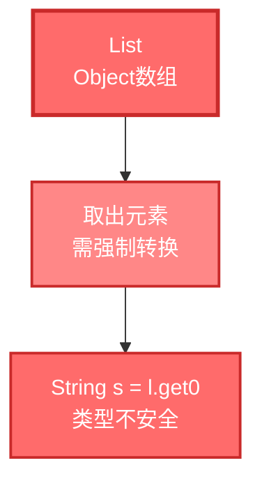
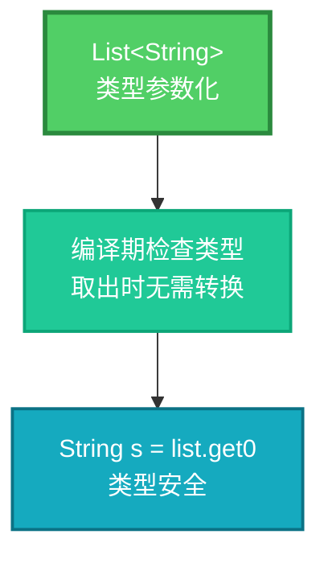

# 泛型概述

泛型（Generics）是 Java 在 JDK 1.5 引入的一种语言特性，通过在类、接口和方法中使用类型参数，使代码在编译阶段就能进行严格的类型检查，从而提高类型安全性并减少强制类型转换。

## 结构图形示例

### 使用泛型前



### 使用泛型后



## 作用与优缺点

  **作用：**
  - 在编译期进行类型检查，捕获类型不匹配错误。 
  - 提高代码复用性和可读性，无需大量的强制类型转换。

 **优点：**
  - 类型安全：编译器禁止向泛型集合插入错误类型的数据。 
  - 可读性：通过类型参数，代码意图更清晰。 
  - 复用性：同一份代码可应用于多种数据类型。

 **缺点：**
  - 类型擦除：运行时无法获取泛型类型信息，限制了某些反射和数组操作。 
  - 语法复杂：通配符、边界等用法初学者较难掌握。 
  - 与基本类型不兼容：无法直接对 int、double 等基本类型使用泛型。

## 与其他编程范式的对比
  - 面向对象编程（OOP）：OOP 关注对象和继承，泛型关注类型参数化，两者结合可编写更灵活的类和方法。 
  - 函数式编程（FP）：FP 强调不可变和高阶函数，泛型可与函数式接口（如 Function<T,R>）配合，增强函数式组件的通用性。 
  - 动态类型语言：如 JavaScript、Python，无需显式类型，灵活但类型安全性低；Java 泛型在保持静态类型优势的同时，提升了灵活性。
  - 泛型编程（GPG）：GPG 关注泛型，泛型关注类型参数化，两者结合可编写更灵活的类和方法。
  - 
## 应用场景
  - 集合框架：List<T>、Map<K,V> 等，确保集合中元素类型一致。 
  - 工具类与算法：如 Collections.sort(List<T>)、Arrays.asList(T...) 等通用操作。 
  - 自定义通用组件：例如通用缓存、数据访问层 DAO、消息处理框架等。

## 各语言实现示例

### Java
[查看完整示例](./java/GenericsExample.java)
```java
// 泛型类
public class GenericsExample<T> {
    private T value;
    public T getValue() { return value; }
    public void setValue(T value) { this.value = value; }
    
    public static <T> T findMax(T[] array) {
        return Arrays.stream(array).max().orElseThrow();
    }
}

// 使用示例
GenericsExample<String> stringBox = new GenericsExample<>("Hello Generics");
System.out.println(stringBox.getValue());
```

### C#
[查看完整示例](./csharp/GenericsExample.cs)
```csharp
// 泛型类
public class GenericsExample<T>
{
    public T Value { get; set; }
    
    public static T FindMax<T>(T[] array) where T : IComparable<T>
    {
        return array.Max();
    }
}

// 使用示例
var stringBox = new GenericsExample<string> { Value = "Hello Generics" };
Console.WriteLine(stringBox.Value);
```

### C++
[查看完整示例](./cpp/GenericsExample.cpp)
```cpp
// 模板类
template<typename T>
class GenericsExample {
private:
    T value;
public:
    GenericsExample(T v) : value(v) {}
    T getValue() const { return value; }
    
    template<typename U>
    static U findMax(const std::vector<U>& container) {
        return *std::max_element(container.begin(), container.end());
    }
};

// 使用示例
GenericsExample<std::string> stringBox("Hello Generics");
std::cout << stringBox.getValue() << std::endl;
```

### Go
[查看完整示例](./go/generics_example.go)
```go
// 泛型结构体
type GenericsExample[T any] struct {
    value T
}

func (g *GenericsExample[T]) GetValue() T {
    return g.value
}

func FindMax[T constraints.Ordered](slice []T) T {
    if len(slice) == 0 {
        var zero T
        return zero
    }
    max := slice[0]
    for i := 1; i < len(slice); i++ {
        if slice[i] > max {
            max = slice[i]
        }
    }
    return max
}

// 使用示例
stringBox := NewGenericsExample("Hello Generics")
fmt.Println(stringBox.GetValue())
```

### TypeScript
[查看完整示例](./typescript/generics_example.ts)
```typescript
// 泛型类
class GenericsExample<T> {
    private value: T;
    
    constructor(value: T) {
        this.value = value;
    }
    
    getValue(): T {
        return this.value;
    }
    
    static findMax<T>(array: T[]): T {
        return array.reduce((max, current) => current > max ? current : max);
    }
}

// 使用示例
const stringBox = new GenericsExample("Hello Generics");
console.log(stringBox.getValue());
```

### Python
[查看完整示例](./python/generics_example.py)
```python
from typing import TypeVar, Generic, List

T = TypeVar('T')

class GenericsExample(Generic[T]):
    def __init__(self, value: T):
        self.value = value
    
    def get_value(self) -> T:
        return self.value
    
    @staticmethod
    def find_max[T](array: List[T]) -> T:
        if not array:
            raise ValueError("Array is empty")
        return max(array)

# 使用示例
string_box = GenericsExample("Hello Generics")
print(string_box.get_value())
```

### Rust
[查看完整示例](./rust/generics_example.rs)
```rust
// 泛型结构体
pub struct GenericsExample<T> {
    value: T,
}

impl<T> GenericsExample<T> {
    pub fn new(value: T) -> Self {
        GenericsExample { value }
    }
    
    pub fn get_value(&self) -> &T {
        &self.value
    }
    
    pub fn find_max<T: std::cmp::PartialOrd + Copy>(slice: &[T]) -> T {
        slice.iter().max().copied().unwrap()
    }
}

// 使用示例
let string_box = GenericsExample::new("Hello Generics".to_string());
println!("{}", string_box.get_value());
```

### C (使用void*实现泛型)
[查看完整示例](./c/generics_example.c)
```c
// 泛型容器结构体
typedef struct {
    void* data;
    size_t size;
    size_t element_size;
} GenericArray;

GenericArray* create_array(size_t element_size, size_t initial_capacity);
void array_push(GenericArray* array, const void* element);
void* array_get(GenericArray* array, size_t index);

// 使用示例
GenericArray* string_array = create_array(sizeof(char*), 10);
const char* str = "Hello Generics";
array_push(string_array, &str);
```

### JavaScript
JavaScript不支持泛型，但作为动态类型语言具有天然的灵活性

[查看完整示例](./js/dynamic_example.js)
```javascript
// 动态容器 - 可以存储任何类型
class Container {
    constructor(value) {
        this.value = value; // 无需类型声明
    }
    
    getValue() {
        return this.value;
    }
    
    static findMax(array) {
        // 利用JavaScript动态特性处理任何类型
        return array.reduce((max, current) => current > max ? current : max);
    }
}

// 使用示例 - 同一个类可以处理不同类型
const stringBox = new Container("Hello Generics");
const numberBox = new Container(42);
const objectBox = new Container({name: "test"});

console.log(stringBox.getValue()); // "Hello Generics"
console.log(numberBox.getValue()); // 42
console.log(objectBox.getValue()); // {name: "test"}
```